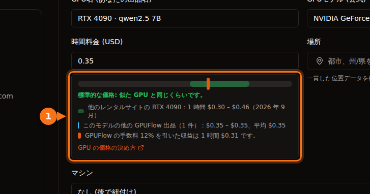

2026 年 9 月時点で、H100 1 基の料金は AWS と Azure で 1 時間約 $6.90、Google Cloud で GPU 1 基あたり $11.06、Lambda で $3.99、RunPod で $2.69〜$3.49、Vast.ai では約 $1.50 からです。コンシューマー向けのカードはマーケットプレイスにしかありません。RTX 4090 は安いところで 1 時間 $0.31〜$0.34、RunPod のデータセンター階層では $0.74 です。同じ H100 でも、オンデマンドの 1 時間は最も高いところが最も安いところの約 7.5 倍です。

以下では、それぞれの数字の出どころ、時間単価に含まれるもの、よくある 3 つのジョブの総コストを示します。特に断りのない限り、価格はすべてオンデマンド、米国リージョン（AWS は us-east-1、Azure は East US、Google Cloud は us-central1）、Linux で、2026 年 9 月に確認したものです。価格は毎月変わるので、ある時点のスナップショットとして扱い、お金をかける前に出典を確認してください。

## 料金一覧

データセンター向け GPU、GPU 1 基・1 時間あたりのドル：

| 事業者 | L4 24 GB | A10G / A10 24 GB | A100 80 GB | H100 |
| --- | --- | --- | --- | --- |
| AWS | $0.81（g6.xlarge） | $1.01（g5.xlarge、A10G） | $3.43（8 GPU の p4de のみ） | $6.88（p5.4xlarge） |
| Google Cloud | $0.71（g2-standard-4） | なし | $5.07（a2-ultragpu-1g） | $11.06（8 GPU の A3 ÷ 8） |
| Azure | なし | $3.20（NV36ads A10 v5） | $3.67（NC24ads A100 v4） | $6.98（NC40ads H100 v5、NVL 94 GB） |
| Lambda | なし | なし | $2.79 | $3.99 |
| RunPod Community / Secure | なし / $0.49 | なし | $1.39 / $1.59 | $2.69 / $3.49 |
| Vast.ai | 約 $0.27 から | なし | 約 $0.43 から | 約 $1.47 から |

「なし」は、その事業者の料金表に該当する単一 GPU の選択肢が見つからなかったことを意味します。コンシューマー向けカード、1 時間あたりのドル：

| GPU | Vast.ai（最安の出品） | RunPod Community / Secure | レンタルサイト全体の一般的な範囲 |
| --- | --- | --- | --- |
| RTX 3090 24 GB | $0.11〜$0.13 | $0.22 / $0.50 | $0.11〜$0.31 |
| RTX 4090 24 GB | $0.31〜$0.33 | $0.34 / $0.74 | $0.30〜$0.46 |
| RTX 5090 32 GB | $0.41〜$0.47 | $0.69 / $0.99 | $0.41〜$0.69 |

AWS、Google Cloud、Azure、Lambda はコンシューマー向けの RTX カードを掲載していません。Vast.ai の数字が範囲になっているのは、同じ日に取った getdeploying.com の 2 つのスナップショットで最安値が少しずつ違ったためで、これ自体がマーケットプレイスの価格の性質を物語っています。最後の列は、[GPUFlow のプロバイダー向け価格ガイド](https://docs.gpuflow.app/ja/providers/pricing/)が 2026 年 9 月に Vast.ai、RunPod、Salad、SimplePod、TensorDock、Hyperstack、Lambda から集めた範囲です。

## 時間単価に含まれるもの

これらの数字は厳密には同じ商品の価格ではなく、そのことは小数点第 2 位の違いより重要です。

ハイパースケーラーのインスタンスには、GPU 以外にも多くのものが付いてきます。AWS の p5.4xlarge には 16 vCPU、256 GiB の RAM、3.84 TB のローカル NVMe があります。Azure の NC24ads A100 v4 は 24 vCPU と 220 GiB の RAM です。A10 を 1 基まるごと使う Azure の NV36ads A10 v5 は 36 vCPU、440 GiB の RAM に仮想ワークステーション用の GRID ライセンスが付いており、AWS の同等のカードの 3 倍の料金になっている理由の一端はここにあります。GPU だけが必要でも、これらの分まで払うことになります。

大きなマシンでしか買えない GPU もあります。AWS の A100 80 GB は p4de.24xlarge として販売されており、8 GPU で 1 時間 $27.45、それより小さいサイズはありません。表にある Google Cloud の A3 High の H100 マシンは、8 GPU の a3-highgpu-8g で 1 時間 $88.49 です。Lambda の料金表は GPU 1 基あたりの価格を示していますが、H100 の横に書かれたマシンの仕様（208 vCPU、1,800 GiB の RAM）はマルチ GPU のシステムのものです。$3.99 を前提に計画する前に、実際にどのサイズが借りられるか確認してください。

マーケットプレイスの価格は、マシンの持ち主が決めます。Vast.ai では各ホストが自分で料金を設定し、ストレージと帯域幅は出品ごとに別料金です。RunPod の Community Cloud は独立したプロバイダーをつなぐもので、Secure Cloud は Tier 3 と Tier 4 のデータセンターで運用されています。同じ RTX 4090 が前者では $0.34、後者では $0.74 です。

時間単価に含まれないもの（ディスク、データ転送、セットアップ時間、アイドル時間）は、[GPU レンタルの本当のコスト](/ja/hidden-fees-in-gpu-rental/)で扱っています。小さなジョブでは、こうした追加分が GPU の時間より大きくなることがあります。

## H100 の料金を並べる

<figure>
<svg viewBox="0 0 720 380" role="img" aria-labelledby="d1-title" xmlns="http://www.w3.org/2000/svg" font-family="system-ui, sans-serif" font-size="15">
<title id="d1-title">2026 年 9 月時点のオンデマンドの H100 の GPU 1 基・1 時間あたりの料金の棒グラフ。Google Cloud の 11.06 ドルから Vast.ai の 1.47 ドルまで</title>
<rect x="0" y="0" width="720" height="380" fill="#ffffff"/>
<text x="20" y="28" fill="#1e1b4b" font-weight="600">H100 1 基、オンデマンド、GPU 1 時間あたりのドル</text>
<line x1="190" y1="44" x2="190" y2="316" stroke="#e2e8f0" stroke-width="1"/>
<text x="190" y="336" text-anchor="middle" fill="#64748b" font-size="13">$0</text>
<line x1="270" y1="44" x2="270" y2="316" stroke="#e2e8f0" stroke-width="1"/>
<text x="270" y="336" text-anchor="middle" fill="#64748b" font-size="13">$2</text>
<line x1="350" y1="44" x2="350" y2="316" stroke="#e2e8f0" stroke-width="1"/>
<text x="350" y="336" text-anchor="middle" fill="#64748b" font-size="13">$4</text>
<line x1="430" y1="44" x2="430" y2="316" stroke="#e2e8f0" stroke-width="1"/>
<text x="430" y="336" text-anchor="middle" fill="#64748b" font-size="13">$6</text>
<line x1="510" y1="44" x2="510" y2="316" stroke="#e2e8f0" stroke-width="1"/>
<text x="510" y="336" text-anchor="middle" fill="#64748b" font-size="13">$8</text>
<line x1="590" y1="44" x2="590" y2="316" stroke="#e2e8f0" stroke-width="1"/>
<text x="590" y="336" text-anchor="middle" fill="#64748b" font-size="13">$10</text>
<line x1="670" y1="44" x2="670" y2="316" stroke="#e2e8f0" stroke-width="1"/>
<text x="670" y="336" text-anchor="middle" fill="#64748b" font-size="13">$12</text>
<text x="180" y="69" text-anchor="end" fill="#1e1b4b">Google Cloud</text>
<rect x="190" y="50" width="442.4" height="26" rx="3" fill="#6366f1"/>
<text x="640.4" y="69" fill="#1e1b4b">$11.06</text>
<text x="180" y="107" text-anchor="end" fill="#1e1b4b">Azure (H100 NVL)</text>
<rect x="190" y="88" width="279.2" height="26" rx="3" fill="#6366f1"/>
<text x="477.2" y="107" fill="#1e1b4b">$6.98</text>
<text x="180" y="145" text-anchor="end" fill="#1e1b4b">AWS</text>
<rect x="190" y="126" width="275.2" height="26" rx="3" fill="#6366f1"/>
<text x="473.2" y="145" fill="#1e1b4b">$6.88</text>
<text x="180" y="183" text-anchor="end" fill="#1e1b4b">Lambda</text>
<rect x="190" y="164" width="159.6" height="26" rx="3" fill="#16a34a"/>
<text x="357.6" y="183" fill="#1e1b4b">$3.99</text>
<text x="180" y="221" text-anchor="end" fill="#1e1b4b">RunPod Secure</text>
<rect x="190" y="202" width="139.6" height="26" rx="3" fill="#16a34a"/>
<text x="337.6" y="221" fill="#1e1b4b">$3.49</text>
<text x="180" y="259" text-anchor="end" fill="#1e1b4b">RunPod Community</text>
<rect x="190" y="240" width="107.6" height="26" rx="3" fill="#16a34a"/>
<text x="305.6" y="259" fill="#1e1b4b">$2.69</text>
<text x="180" y="297" text-anchor="end" fill="#1e1b4b">Vast.ai（最安）</text>
<rect x="190" y="278" width="58.8" height="26" rx="3" fill="#16a34a"/>
<text x="256.8" y="297" fill="#1e1b4b">$1.47</text>
<line x1="190" y1="44" x2="190" y2="316" stroke="#64748b" stroke-width="1.5"/>
<rect x="190" y="352" width="14" height="14" fill="#6366f1"/>
<text x="212" y="364" fill="#64748b" font-size="13">大手クラウド</text>
<rect x="360" y="352" width="14" height="14" fill="#16a34a"/>
<text x="382" y="364" fill="#64748b" font-size="13">GPU クラウドとマーケットプレイス</text>
</svg>
<figcaption>2026 年 9 月時点の、H100 1 基のオンデマンド料金。Google Cloud の料金は 8 GPU の A3 マシンを 8 で割ったものです。Azure の単一 GPU サイズは 94 GB の H100 NVL です。Vast.ai はその日に getdeploying.com が報告した最安の出品です。</figcaption>
</figure>

グラフは実寸で描いています。目を引く点が 2 つあります。大手クラウド 3 社は GPU 1 基あたり約 $7 に集まっていて、Google Cloud の 8 GPU の A3 マシンはそれを大きく上回ります。そして、同じ計算をするカードなのに、AWS と Vast.ai の最安の出品とでは 4 倍以上の差があります。

余分なお金で買えるものは実在します。SLA、コンプライアンスの書類、すぐ隣にある他のインフラ、サポート契約です。マーケットプレイスで手放すものも実在します。ホストは小規模な事業者かもしれず、信頼性は出品ごとに違い、SLA はありません。週末の実験ならマーケットプレイスが楽に勝ちます。規制のある本番システムでは、そもそも選択肢に入らないことがよくあります。

## スポットと中断可能インスタンスの料金

この比較に出てくるどの事業者も、余っている容量を安く売っています。回収されるリスクと引き換えです。

| インスタンス | オンデマンド | スポット | 削減率 |
| --- | --- | --- | --- |
| AWS g6.xlarge（L4 × 1） | $0.805 | $0.605 | 25% |
| AWS g5.xlarge（A10G × 1） | $1.006 | $0.469 | 53% |
| AWS p5.4xlarge（H100 × 1） | $6.88 | $2.623 | 62% |
| Google Cloud g2-standard-4（L4 × 1） | $0.707 | $0.403 | 43% |
| Google Cloud a3-highgpu-8g（H100 × 8） | $88.49 | $41.60 | 53% |
| Azure NC24ads A100 v4（A100 80 GB × 1） | $3.673 | $0.679 | 82% |
| Azure NC40ads H100 v5（H100 NVL × 1） | $6.98 | $1.29 | 82% |

Azure のスポット価格は同社の小売価格 API から取ったもので、A100 と H100 のスポット料金は 2026 年 7 月と 8 月に適用が始まっています。H100 のスポット料金は、マーケットプレイスで見つけたオンデマンドの H100 の最安の出品より安い値でした。スポット価格は頻繁に変わり、容量も保証されないので、これもスナップショットとして扱ってください。

Vast.ai のドキュメントによると、中断可能インスタンスは「オンデマンドより 50% 以上安いことが多い」とされています。getdeploying.com では RTX 3090 の中断可能な出品が $0.08 からありました。スポットで節約になるのは、ジョブがチェックポイントを保存し、止まったところから再開できる場合だけです。そうでなければ、中断されるたびに同じ時間に 2 回払うことになります。

## GPUFlow の位置づけ

GPUFlow もマーケットプレイスですが、貸し出すものはもっと限られています。プロバイダーは自分の Linux マシンで AI モデルを（通常は Ollama で）動かし、あなたはその GPU を 1 時間単位で借りて OpenAI 互換の API キーを受け取ります（ベース URL は `https://gpuflow.app/v1`、`/v1/chat/completions` と `/v1/models` が使えます）。SSH もシェルもファイルアクセスもないので、学習、ファインチューニング、自分のコードの実行はできません。スクリプトやアプリからオープンなモデルを呼び出すだけなら、セットアップはまったく不要です。モデルはプロバイダーのマシンにすでに入っています。

GPUFlow は価格を決めていないので、表に載せる GPUFlow の価格はありません。代わりに、料金の仕組みを説明します。

- 各プロバイダーが、自分の出品の時間単価を米ドルで設定します。設定時には、出品フォームに他のレンタルサイトの価格帯と比べた位置と、手数料を引いた後の受け取り額が表示されます。
- 予約は 1 時間単位で、デフォルトでは 1〜168 時間です。レンタル開始時に、予約した全額がクレジットから確保されます。
- 支払いは最低 1 分の秒単位で、1 セント単位に切り上げられます（計算は[GPU の秒単位課金と時間単位課金](/ja/per-second-vs-hourly-gpu-billing/)で詳しく説明しています）。早めに終了したときや時間切れになったときは、確保額のうち未使用の分がそのままクレジットに戻ります。
- プロバイダーのマシンが 10 分間応答しないと、レンタルは終了し、支払いはマシンの最後のハートビートまでの分だけです。
- トークンは数えますが、課金はしません。ファイルを保存するマシンが渡されることはないので、請求にディスクやデータ転送の項目はありません。
- クレジットは Stripe 経由のカード払いで購入し、1 回のチャージは $10〜$500、手数料はかかりません。1 クレジットは $0.01 で、有効期限はありません。プロバイダーは各請求額の 88% を受け取り、GPUFlow は 12% を受け取ります。

API キーを借りるのとコンテナを借りるのとの詳しい比較は、[GPUFlow、Vast.ai、RunPod、SaladCloud の比較](/ja/gpuflow-vs-vast-ai-vs-runpod/)をご覧ください。GPU の時間単価とトークン課金の API を比べるなら、[その計算はこちら](/ja/hourly-gpu-vs-per-token-api/)です。

## 計算例 1：24 GB のカードで 3 時間のバッチジョブ

7B〜8B のオープンなモデルで大量の文書を約 3 時間処理したいとします。24 GB のカードならどれでも足ります。

| 選択肢 | 計算 | GPU のコスト |
| --- | --- | --- |
| Vast.ai RTX 4090 | 3 × $0.31 | $0.93 |
| RunPod Community RTX 4090 | 3 × $0.34 | $1.02 |
| Google Cloud L4（g2-standard-4） | 3 × $0.707 | $2.12 |
| RunPod Secure RTX 4090 | 3 × $0.74 | $2.22 |
| AWS L4（g6.xlarge） | 3 × $0.805 | $2.42 |
| AWS A10G（g5.xlarge） | 3 × $1.006 | $3.02 |

どの選択肢でも、セットアップの分も払います。推論サーバーのインストールとモデルのダウンロードを、課金される時間の中で行うからです。それに 20 分かかれば、Vast.ai のカードで $0.10、AWS の L4 で $0.27 が上乗せされます。

GPUFlow では、例として 1 時間 $0.35 の出品を使います（スクリーンショットにある価格で、見積もりではありません）。3 時間予約すると $1.05 が確保されます。ジョブが 2 時間 10 分（7,800 秒）で終わり、レンタルを終了します。請求額は 7,800 × 35 ÷ 3,600 = 75.8 セントを切り上げた $0.76 で、$0.29 がクレジットに戻ります。ただし、使いたいモデルを動かしているプロバイダーがいる場合に限ります。

## 計算例 2：A100 80 GB で 8 時間のファインチューニング

ファインチューニングには自分で管理できるマシンが必要なので、ここでは GPUFlow は対象外です。

| 選択肢 | 計算 | コスト |
| --- | --- | --- |
| Vast.ai、A100 の最安の出品 | 8 × $0.43 | $3.44 |
| RunPod Community A100 SXM | 8 × $1.39 | $11.12 |
| RunPod Secure A100 SXM | 8 × $1.59 | $12.72 |
| Lambda A100 SXM 80 GB | 8 × $2.79 | $22.32 |
| Azure NC24ads A100 v4 | 8 × $3.673 | $29.38 |
| Google Cloud a2-ultragpu-1g | 8 × $5.069 | $40.55 |
| AWS p4de.24xlarge（8 GPU） | 8 × $27.45 | $219.60 |

Vast.ai の行は、getdeploying.com が報告した A100 の最安の出品（2 GPU マシンの SXM カードで、メモリ容量は表示されていませんでした）なので、この価格を当てにする前に出品を確認してください。AWS の行は誤植ではありません。AWS で A100 80 GB が 1 基必要なら、8 基借りることになります。Lambda の行は、実際に借りられるサイズがある前提です。上の注意を参照してください。

学習ループが 15〜30 分ごとにチェックポイントを保存するなら、Azure のスポット価格 1 時間 $0.679 でこのジョブは $5.43 になります。ただし、容量を確保できればの話です。

## 計算例 3：L4 で 24 時間推論を提供する

小さな推論エンドポイントを 720 時間の 1 か月動かす場合です。

| 選択肢 | 計算 | 月額 |
| --- | --- | --- |
| Vast.ai L4、最安の出品 | 720 × $0.27 | $194.40 |
| RunPod Secure L4 | 720 × $0.49 | $352.80 |
| AWS g6.xlarge、1 年リザーブド | 720 × $0.524 | $377.28 |
| Google Cloud g2-standard-4 | 720 × $0.707 | $509.04 |
| AWS g6.xlarge、オンデマンド | 720 × $0.805 | $579.60 |

この長さになると、コミットメント割引が効いてきます。同じインスタンスの AWS の 1 年リザーブド料金は、オンデマンドより 35% 安くなります。それでもマーケットプレイスが最安ですが、ホストが 1 台なら、そこが単一障害点になります。エンドポイントに利用者がいるなら、おそらくマシンは 2 台必要で、マーケットプレイスの行は 2 倍になり、差は見た目より小さくなります。

## 私ならこう選ぶ

実験、画像生成、[LoRA の学習](/ja/stable-diffusion-lora-training-under-10-dollars/)など、やり直しがきく作業なら、マーケットプレイスの RTX 3090 か 4090 です。安いところで 1 時間 $0.11〜$0.34 で、大手クラウドにこれに近いものはありません。

A100 や H100 が必要な大きなモデルで、規制の対象でない場合は、まず RunPod か Lambda、[各ホストの信頼性スコアを確認する手間をかけられるなら Vast.ai](/ja/runpod-vs-vastapi-comparison/) です。決める前に Azure と Google Cloud のスポット価格も見てください。2026 年 9 月時点では、意外なほど競争力がありました。

規制のあるデータ、すでに AWS、Azure、Google Cloud で動いている会社、SLA が必要なものなら、今のクラウドにとどまり、コミットメントかスポット容量で価格を下げてください。H100 に 1 時間 $7 払うほうが、新しいベンダーのセキュリティ審査より安くつくことはよくあります。

サーバーを運用せずにコードからオープンなモデルを呼び出すなら、API です。使いたいモデルをホストしているところがあればトークン課金の API、特定のプロバイダーのモデルを固定の時間単価で使いたいなら GPUFlow の時間貸しです。アカウント周りの準備は[GPU レンタルを始めるのに必要なもの](/ja/what-you-need-to-rent-a-gpu/)で説明しています。

## 出典

- AWS：[EC2 オンデマンド料金](https://aws.amazon.com/ec2/pricing/on-demand/)、[P5 インスタンス](https://aws.amazon.com/ec2/instance-types/p5/)、[P4 インスタンス](https://aws.amazon.com/ec2/instance-types/p4/)。時間単価は Vantage が複製した AWS の料金表から読み取りました：[g6.xlarge](https://instances.vantage.sh/aws/ec2/g6.xlarge?region=us-east-1)、[g5.xlarge](https://instances.vantage.sh/aws/ec2/g5.xlarge?region=us-east-1)、[p5.4xlarge](https://instances.vantage.sh/aws/ec2/p5.4xlarge?region=us-east-1)、[p5.48xlarge](https://instances.vantage.sh/aws/ec2/p5.48xlarge?region=us-east-1)、[p4de.24xlarge](https://instances.vantage.sh/aws/ec2/p4de.24xlarge?region=us-east-1)
- Google Cloud：[アクセラレータ最適化 VM の料金](https://cloud.google.com/products/compute/pricing/accelerator-optimized)、[VM インスタンスの料金](https://cloud.google.com/compute/vm-instance-pricing)
- Azure：[Linux VM の料金](https://azure.microsoft.com/en-us/pricing/details/virtual-machines/linux/)、[Azure 小売価格 API](https://prices.azure.com/api/retail/prices)、サイズ：[NC A100 v4](https://learn.microsoft.com/en-us/azure/virtual-machines/sizes/gpu-accelerated/nca100v4-series)、[NCads H100 v5](https://learn.microsoft.com/en-us/azure/virtual-machines/sizes/gpu-accelerated/ncadsh100v5-series)、[NVads A10 v5](https://learn.microsoft.com/en-us/azure/virtual-machines/sizes/gpu-accelerated/nvadsa10v5-series)
- Lambda：[料金](https://lambda.ai/pricing)
- RunPod：[料金](https://www.runpod.io/pricing)、[RTX 3090](https://www.runpod.io/gpu-models/rtx-3090)、[RTX 4090](https://www.runpod.io/gpu-models/rtx-4090)、[RTX 5090](https://www.runpod.io/gpu-models/rtx-5090)、[A100 SXM](https://www.runpod.io/gpu-models/a100-sxm)、[H100 SXM](https://www.runpod.io/gpu-models/h100-sxm)、[Pods の概要](https://docs.runpod.io/pods/overview)
- Vast.ai：[料金のドキュメント](https://docs.vast.ai/guides/instances/pricing.md)。マーケットプレイスの価格は getdeploying.com から：[Vast.ai](https://getdeploying.com/vast-ai)、[RTX 3090](https://getdeploying.com/reference/cloud-gpu/nvidia-rtx-3090)、[RTX 4090](https://getdeploying.com/reference/cloud-gpu/nvidia-rtx-4090)、[RTX 5090](https://getdeploying.com/reference/cloud-gpu/nvidia-rtx-5090)、[A100](https://getdeploying.com/reference/cloud-gpu/nvidia-a100)、[H100](https://getdeploying.com/reference/cloud-gpu/nvidia-h100)
- GPUFlow：[GPU の価格の決め方](https://docs.gpuflow.app/ja/providers/pricing/)、[請求](https://docs.gpuflow.app/ja/renters/billing/)、[API クイックスタート](https://docs.gpuflow.app/ja/renters/api-quickstart/)、[マーケットプレイス](https://gpuflow.app/ja/marketplace)

すべて 2026 年 9 月に確認しました。
