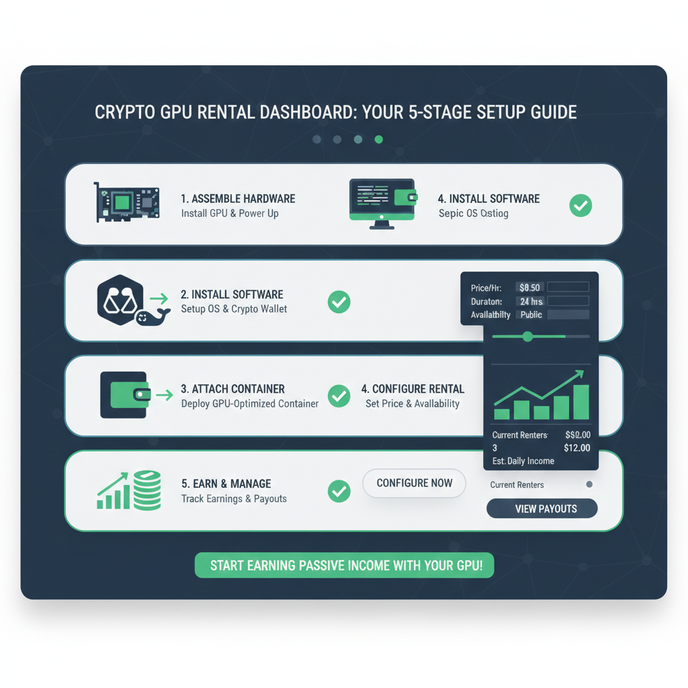
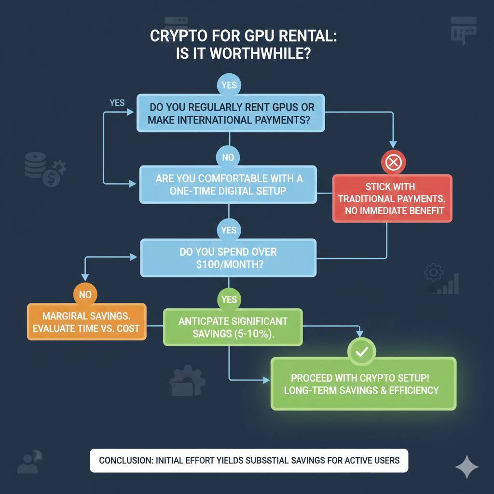

# GPUレンタルの隠れコスト：仮想通貨決済が海外ユーザーの資金を節約する仕組み

サンパウロの開発者とサンフランシスコの開発者が、同じRTX 4090を同じ10時間、同じ定価の「1時間あたり0.60ドル」でレンタルしたとします。サンフランシスコの開発者が支払うのは6.00ドルです。一方、サンパウロの開発者は6.00ドルに加え、国際クレジットカード取引に対する6.38%のIOF税、BRL（ブラジルレアル）からUSDへの2〜4%の為替スプレッド、さらに銀行がVisaやMastercardの為替レートに適用する上乗せ分を支払います。最終的なコストは、およそ6.55〜6.70ドルになります。1年間定期的にGPUを利用し続ければ、これらの隠れた手数料は、計算リソースへの総支出の無視できない割合を占めることになります。

この記事では、銀行口座からGPUプロバイダーの収益に至るまでのすべての手数料を考慮した場合、各国からのGPUレンタルに実際いくらかかるのかを正確に分析します。そして、Polygonネットワーク上の仮想通貨を使用した同じ計算と比較します。仮想通貨であれば、ラゴス、東京、ブエノスアイレスのどこにいても、総取引コストは0.03ドルです。この節約は理論上の話ではありません。具体的で、計算可能であり、一部の国では毎月追加のGPU時間を賄えるほど実質的なものです。

""ウォレットのセットアップ、スマートコントラクトのエスクロー、プラットフォーム別のガイドを含む、仮想通貨決済プロセスの完全な手順については、[仮想通貨でGPUをレンタルするための完全ガイド](../ja/rent-gpu-with-crypto.md)をご覧ください。""

---

## 6つの異なる国における「100ドルのGPUレンタル」の真のコスト

国際決済のコストを理解するには、手数料の構造全体を調べる必要があります。国境を越えるすべての取引は複数の仲介者を経由し、それぞれが一定の割合や固定手数料を徴収します。これらのコストは多くの場合、目に見えません。為替レートに埋め込まれていたり、ユーザーが読み飛ばす別項目の明細として記載されていたり、あるいはお金がアカウントに届く前に単に差し引かれていたりします。

以下の計算は、異なる地域と銀行システムを代表する6つの国から、100ドルのGPUレンタルデポジット（RTX 3090の約150〜200時間分）を行った場合の実際のコストを示しています。すべての計算は、2026年2月の為替レートおよび主要な決済処理業者と銀行の現在の料金体系を使用しています。

### ブラジル：誰も警告してくれないIOF税

**シナリオ：** サンパウロの開発者がNubankのクレジットカードを使用してRunPodでGPUをレンタルする場合

**GPUの表示コスト：** $100.00 USD

**手数料の内訳：**

1. **IOF (Imposto sobre Operações Financeiras - 金融取引税):** 6.38%
   - この連邦税はすべての国際クレジットカード取引に適用されます
   - 取引金額に上乗せして請求されます
   - 交渉不可、免除不可
   - **コスト：$6.38**

2. **為替スプレッド (BRL → USD):** 2.5〜4%
   - 公定レート：4.95 BRL/USD（例）
   - 銀行適用レート：5.10〜5.15 BRL/USD
   - スプレッドは為替による銀行の利益を表します
   - **コスト：$2.50〜4.00**

3. **海外取引手数料：** 3.1%
   - Visa/Mastercardネットワーク手数料
   - カード発行会社によって請求されます
   - 明細書には別項目として記載されます
   - **コスト：$3.10**

**手数料合計：$12.00〜13.50**  
**ブラジルの開発者の実質コスト：$112.00〜113.50**  
**実質的な上乗せ率：12〜13.5%**

月間1,000ドル分のGPU時間をレンタルする開発者にとって、これらの手数料は月額120〜135ドルの追加コストとなります。これは、RTX 4090をさらに20〜25時間稼働させるのに十分な金額です。

**仮想通貨という選択肢：**

- Mercado Bitcoinで100ドル分のUSDCを購入（0.5%の手数料）：$0.50
- USDCをPolygonウォレットへ送金（ネットワーク手数料）：$0.02
- GPUFlowへデポジット（換算不要）：$0.00
- **総コスト：$100.52**
- **節約額：$11.50〜13.00 (11.5〜13%)**

「[仮想通貨でGPUをレンタルするための完全ガイド](../ja/rent-gpu-with-crypto)では、あなたの支払いを保護し、GPUへのアクセスを保証する仕組みであるスマートコントラクトのエスクローについて詳しく解説しています。」

### インド：すべての購入にかかる海外取引手数料

**シナリオ：** バンガロールの機械学習エンジニアがHDFC銀行のクレジットカードを使用してGPUをレンタルする場合

**GPUの表示コスト：** $100.00 USD

**手数料の内訳：**

1. **海外取引マークアップ：** 3.5%
   - HDFCおよびほとんどのインドの銀行で適用されます
   - 銀行手数料とネットワーク手数料に分割されることがあります
   - **コスト：$3.50**

2. **通貨換算 (INR → USD):** 1.5〜2.5%
   - インターバンクレート：83.20 INR/USD（例）
   - 適用レート：84.50〜85.30 INR/USD
   - 差額は銀行の利益となります
   - **コスト：$1.50〜2.50**

3. **海外取引に対するGST（物品サービス税）：** 手数料の18%
   - 海外取引手数料そのものに対して適用されます
   - 「手数料に対する税金」です（本当にそうです）
   - **コスト：$0.63 ($3.50の18%)**

**手数料合計：$5.63〜6.63**  
**インドの開発者の実質コスト：$105.63〜106.63**  
**実質的な上乗せ率：5.6〜6.6%**

多くのインドの開発者は、GSTがGPUレンタル料金に統合されず、別の税金項目として表示されるため、この要素に気づいていません。月間500ドルのGPU支出を1年間続けると、これらの手数料は合計337〜398ドルになります。

**仮想通貨という選択肢：**

- WazirXで100ドル分のUSDCを購入（0.2%の手数料）：$0.20
- Polygonウォレットへ送金（ネットワーク手数料）：$0.02
- GPUプラットフォームへデポジット：$0.00
- **総コスト：$100.22**
- **節約額：$5.41〜6.41 (5.4〜6.4%)**

インドの規制では仮想通貨の使用が制限されていますが、仮想通貨の購入と保有は合法的です。国際サービス決済に仮想通貨を使用することで、現在のRBI（インド準備銀行）のガイドラインを遵守しつつ、海外取引手数料のカテゴリを完全に回避できます。

### ナイジェリア：海外送金の悪夢

**シナリオ：** ラゴスの開発者が銀行振込でGPUレンタル資金を入金しようとする場合（国際クレジットカードを持たないナイジェリアのユーザーに対し、多くのプラットフォームがこれを要求します）

**GPUの表示コスト：** $100.00 USD

**手数料の内訳：**

1. **海外送金手数料（発信）：** $25〜45
   - ナイジェリアの銀行によって請求されます
   - 金額に関わらず固定手数料です
   - **コスト：$25〜45**

2. **中継銀行手数料：** $10〜25
   - コルレス銀行（Correspondent bank）の手数料です
   - 多くの場合、送金額から差し引かれます
   - 送金後まで開示されません
   - **コスト：$10〜25**

3. **為替スプレッド (NGN → USD):** 3〜5%
   - 公定レート：815 NGN/USD（例）
   - 適用レート：840〜865 NGN/USD
   - 並行市場（闇市場）レートが複雑さを増します
   - **コスト：$3.00〜5.00**

4. **受取銀行手数料（プラットフォーム側の銀行）：** $15〜20
   - しばしば顧客に転嫁されます
   - プラットフォームが負担することもあります
   - **コスト：$15〜20（請求される場合）**

**手数料合計：$53〜95**  
**これにより、銀行振込による少額のGPUレンタルは経済的に不可能です**

このため、ナイジェリアの開発者は以下のいずれかを行っています。

- 3〜5%の手数料がかかる国際決済サービス（TransferWise/Wise）を利用する
- 4〜8%の手数料がかかるバーチャルドルカードに頼る
- 仮想通貨を使用する

**仮想通貨という選択肢：**

- LunoまたはBinanceで100ドル分のUSDCを購入（0.5%の手数料）：$0.50
- Polygonウォレットへ送金（ネットワーク手数料）：$0.02
- GPUプラットフォームへデポジット：$0.00
- **総コスト：$100.52**
- **節約額：$52.50〜94.50（銀行振込と比較）**

節約効果があまりにも劇的であるため、ナイジェリアのユーザーにとって仮想通貨は明白な選択肢となります。これは、ナイジェリアの開発者がクリプトネイティブなGPUプラットフォームにおいて最も急速に成長しているユーザーセグメントの一つであることを説明しています。

### 日本：「海外事務手数料無料」の誤解

**シナリオ：** 東京の開発者が楽天カード（海外手数料の安さを謳うカードの一例として）を使用する場合

**GPUの表示コスト：** $100.00 USD

**手数料の内訳：**

1. **海外取引手数料：** 0%
   - 一部のカードはこれを「無料」としてマーケティングします
   - 「海外ショッピングに強い」というイメージです
   - **コスト：$0.00**

2. **通貨換算マークアップ (JPY → USD):** 1.6〜2.3%
   - Visa/Mastercardが換算レートを適用します
   - レートは卸売レート + 1.6〜2.3%の上乗せです
   - ここで銀行（カード会社）は収益を上げています
   - 「手数料」としては開示されず、為替レートに含まれて表示されます
   - **コスト：$1.60〜2.30**

3. **ダイナミック・カレンシー・コンバージョン (DCC)（誤って選択した場合）：** 追加で3〜5%
   - 多くの決済フォームが「日本円（JPY）で支払う」という選択肢を提示します
   - このオプションは常に拒否してください
   - さらなる換算レイヤーが追加されてしまいます
   - **コスト：選択した場合 $3.00〜5.00**

**手数料合計：$1.60〜2.30（DCCを正しく拒否したと仮定）**  
**日本の開発者の実質コスト：$101.60〜102.30**  
**実質的な上乗せ率：1.6〜2.3%**

日本の開発者は、強固な銀行インフラと競争力のあるカード商品のおかげで、例に挙げた国々の中では海外手数料の支払いが最も少なくて済みます。しかし、これらの「低い」手数料でさえ、時間の経過とともに積み上がります。

**仮想通貨という選択肢：**

- bitFlyerで100ドル分のUSDCを購入（0.15%の手数料）：$0.15
- Polygonウォレットへ送金（ネットワーク手数料）：$0.02
- GPUプラットフォームへデポジット：$0.00
- **総コスト：$100.17**
- **節約額：$1.43〜2.13 (1.4〜2.1%)**

パーセンテージでの節約額は他国よりも小さいですが、月間2,000ドルをGPUレンタルに費やす開発者にとっては、月額28〜42ドル、年間では340〜500ドルの節約になります。

### ドイツ：欧州外におけるSEPAの限界

**シナリオ：** ベルリンのフリーランス機械学習エンジニアがドイツ銀行の口座を使用する場合

**GPUの表示コスト：** $100.00 USD

**手数料の内訳：**

SEPA送金を受け入れるヨーロッパのプラットフォームの場合：

- **コスト：€0.00**（EU内でのSEPA送金は無料）
- しかし、ほとんどのGPUプラットフォームは米国拠点で、USDを必要とします

米国のプラットフォームへのUSD払いの場合：

1. **海外取引手数料：** 0〜1.5%
   - 多くのドイツのカードは海外取引手数料が低いか無料です
   - EUの規制が過度な手数料を制限しています
   - **コスト：$0.00〜1.50**

2. **通貨換算 (EUR → USD):** 1〜2%
   - Mastercard/Visaのネットワークレート
   - 非EU諸国よりも透明性が高いです
   - **コスト：$1.00〜2.00**

3. **国際送金（カードではなく銀行振込を使用する場合）：** €15〜25
   - 直接銀行から入金する場合
   - **コスト：該当する場合 $16〜27**

**手数料合計（クレジットカード）：$1.00〜3.50**  
**ドイツの開発者の実質コスト：$101.00〜103.50**  
**実質的な上乗せ率：1〜3.5%**

ドイツは、EUの消費者保護規制と競争力のある銀行業務により、従来の支払い方法において最も恵まれたシナリオを代表しています。それでも、手数料は存在します。

**仮想通貨という選択肢：**

- Krakenで100ドル分のUSDCを購入（0.26%の手数料）：$0.26
- Polygonウォレットへ送金（ネットワーク手数料）：$0.02
- GPUプラットフォームへデポジット：$0.00
- **総コスト：$100.28**
- **節約額：$0.72〜3.22 (0.7〜3.2%)**

ヨーロッパのユーザーにとって節約額は最小ですが、仮想通貨にはさらなる利点があります。SEPA送金の待ち時間（1〜2営業日かかる）がなく、週末や祝日の遅延もなく、支払いのタイミングに関わらず価格が一貫していることです。

### トルコ：通貨の変動が隠れたコストを追加する

**シナリオ：** イスタンブールの開発者がİş Bankası（イシュバンク）のクレジットカードを使用する場合

**GPUの表示コスト：** $100.00 USD

**手数料の内訳：**

1. **海外取引手数料：** 2.5%
   - トルコの銀行における標準です
   - **コスト：$2.50**

2. **通貨換算 (TRY → USD):** 2〜4%
   - トルコリラ（TRY）の変動が広いスプレッドを生み出します
   - 銀行はリスクプレミアムを価格に織り込みます
   - 取引時と請求時の間でレートが変わる可能性があります
   - **コスト：$2.00〜4.00**

3. **特別通信税 (ÖİV):** 海外購入の1%
   - 国際取引に対するトルコの税金
   - 自動的に適用されます
   - **コスト：$1.00**

4. **付加価値税 (KDV):** デジタルサービスに対して20%
   - 技術的には支払いではなくサービスに適用されます
   - 徴収するプラットフォームとしないプラットフォームがあります
   - コンプライアンスの複雑さを生みます
   - **コスト：適用された場合 $20.00**

**手数料合計：$5.50〜7.50（プラス潜在的な$20のVAT）**  
**トルコの開発者の実質コスト：$105.50〜127.50**  
**実質的な上乗せ率：VATの扱いにより5.5〜27.5%**

トルコの開発者はさらなる予測不可能性に直面しています。GPUレンタルがVATの対象となるデジタルサービスとして分類された場合、実質コストは劇的に増加します。通貨の変動は、請求されるTRYの額が、取引日のレートに基づいて予想された額と大きく異なる可能性があることを意味します。

**仮想通貨という選択肢：**

- Binance TRで100ドル分のUSDCを購入（0.1%の手数料）：$0.10
- Polygonウォレットへ送金（ネットワーク手数料）：$0.02
- GPUプラットフォームへデポジット：$0.00
- **総コスト：$100.12**
- **節約額：$5.38〜27.38 (5.4〜27.4%)**

仮想通貨はリラの下落に対する保護も提供します。USDCで保有する資金は、TRY/USDの為替レートの変動に関係なく、ドル価値を維持します。

## クレジットカードの海外取引手数料：気づかないかもしれない3〜5%の税金

クレジットカードの海外取引手数料は、国際決済において最も透明性の低いコストの一つです。「手数料」というラベルの付いた項目とは異なり、これらの費用は為替レートの中に隠れていたり、総支出を計算するまで無視できるほど小さな割合として表示されたりすることがよくあります。

### 海外取引手数料の実際の仕組み

カードの母国通貨以外の通貨で購入を行う際、3つの主体が取り分を持っていきます。

**1. カードネットワーク (Visa/Mastercard/Amex):**

- 1%の「国際評価料（International assessment fee）」を請求します
- すべての国境を越える取引に適用されます
- カード発行会社に関わらず交渉不可能です

**2. カード発行会社（あなたの銀行）：**

- 1〜3%の海外事務手数料を加算します
- 銀行やカードのランクによって異なります
- プレミアムカードではこれが免除されることもあります
- 一般的なカードでは全額が請求されます

**3. 通貨換算の上乗せ（マークアップ）：**

- ネットワークはインターバンクレート（銀行間取引レート）よりもわずかに悪い為替レートを設定します
- インターバンクレートと適用レートのスプレッド：0.5〜2%
- 「利便性」として宣伝されますが、実際には収益源です
- 完全に隠されており、明細書には項目として表示されません

**合計の影響：** カードと銀行により2.5〜6%

### 明細書の不明瞭さ

100ドルのGPUレンタルを行った際のクレジットカード明細書には、以下のように表示されます。

```
2月10日  RUNPOD.IO            $103.20
        海外事務手数料         $3.00
```

3.00ドルの手数料は明白です。しかし、取引金額に埋め込まれている3.20ドルはそうではありません。その余分な0.20ドルは通貨換算の上乗せによるものです。あなたは外国為替市場で得られるよりも悪いレートで100ドルを支払ったことになります。

その103.20ドルの内訳：

- $100.00 = 基本のGPUレンタルコスト
- $2.50 = カード発行会社の海外事務手数料 (2.5%)
- $1.00 = Visa国際評価料 (1%)
- ~$0.70 = 通貨換算の上乗せ (0.7%)
- 合計マークアップ：$4.20、しかし「手数料」として表示されるのは$3.00のみ

### プレミアムカードは無料ではない

トラベルリワードカードやプレミアムクレジットカードは、しばしば「海外取引手数料無料」を宣伝しています。これは部分的には真実ですが、大部分はマーケティングです。

**免除されるもの：**

- 1〜3%のカード発行会社手数料
- これにより手数料構造は3〜5%ではなく1〜2%になります

**免除されないもの：**

- カードネットワーク評価料 (1%)
- 通貨換算の上乗せ (0.5〜2%)
- 年会費（カード維持のために95〜550ドル）

**計算例：**

Chase Sapphire Reserve（年会費：550ドル）：

- 海外取引手数料：0%
- Visa評価料：1%
- 換算マークアップ：~0.7%
- **100ドルの取引にかかる総コスト：$101.70**

一般的なクレジットカード（年会費：0ドル）：

- 海外取引手数料：3%
- Visa評価料：1%
- 換算マークアップ：~0.7%
- **100ドルの取引にかかる総コスト：$104.70**

プレミアムカードは100ドルの取引ごとに3ドルを節約します。GPUレンタルだけで550ドルの年会費を正当化するには、年間18,300ドル以上のGPU支出が必要です。ほとんどの個人の開発者はこの基準に達しません。

### 「自国通貨払い」の罠

多くの決済フォームは「ダイナミック・カレンシー・コンバージョン (DCC)」を提供しています。これは、USDではなく自国の通貨で請求額を表示するオプションです。親切に見えますが、これは高くつきます。

**例：**

ドイツの開発者が見る画面：

- オプションA：$100.00 USDを支払う
- オプションB：€94.50 EURを支払う（私たちが換算します！）

実際の為替レートを確認すると：

- 市場レート：0.92 EUR/USD
- 市場換算：$100 = €92.00
- DCC換算：$100 = €94.50
- **DCCマークアップ：€2.50 (2.7%)**

この€2.50は決済処理業者の純利益であり、加盟店と分配されます。これは、すでに支払っているクレジットカード手数料の上に積み重なります。

**海外取引では決して「自国通貨払い」を選択しないでください。** 常に加盟店の通貨（米国のGPUプラットフォームならUSD）で支払うことを選択し、換算は自分の銀行に任せてください。あなたの銀行の換算レートは、上乗せがあったとしても、DCCレートよりはマシです。

### なぜこれらの手数料が存在するのか

海外取引手数料は技術的な要件ではありません。現代の決済ネットワークは、国境を越える取引を無視できるほどの限界費用で処理しています。手数料が存在する理由は以下の通りです。

1. **収益創出：** 銀行は金利スプレッド以外に収入を必要としています
2. **リスクプレミアム：** 海外取引は不正利用率がわずかに高いためです
3. **市場セグメンテーション：** 手数料を免除することでプレミアムカードを差別化するためです
4. **規制の裁定取引（アービトラージ）：** 国によってこれらの手数料に対する規制が異なるためです
5. **顧客の無知：** ほとんどの顧客は総手数料の影響を計算していません

欧州の規制（決済サービス指令）はEU内の海外取引手数料を制限しており、これが例に挙げたドイツの開発者がブラジルやインドの開発者よりも支払いが少ない理由です。米国の規制にはそのような制限がないため、3〜5%の標準的な手数料が可能になっています。

### 複利効果

海外取引手数料は、単一の取引分析からは明らかでない方法で積み上がっていきます。

**シナリオ：** GPUレンタルに月額500ドルを費やす開発者

4%の海外取引手数料の場合：

- 月額手数料コスト：$20
- 年間手数料コスト：$240
- 5年間のコスト：$1,200

その1,200ドルで以下のことが可能です：

- RTX 3090を2,000時間（$0.60/時間で）
- A100を400時間（$3.00/時間で）
- 現在の使用率で約3ヶ月分の追加GPUアクセス

月額5,000ドルを費やす開発チームの場合、5年間の海外取引手数料コストは12,000ドルに達し、これは多くの市場でジュニア開発者を1ヶ月雇うのに十分な金額です。


---

## 通貨換算スプレッド：銀行の請求額 vs 実際の為替レート

通貨換算は銀行が見えないお金を稼ぐ場所です。明細書に開示される取引手数料とは異なり、換算スプレッドは為替レートの中に隠れています。ほとんどのユーザーは、通貨交換のために市場レートよりも多く支払っていることに気づいていません。

### スプレッドを理解する

通貨の為替レートには階層があります。

**1. インターバンクレート（卸売）：**

- 銀行同士が取引するレート
- 最大の取引量、最も狭いスプレッド
- Google FinanceやBloombergで見られるもの
- **個人としてこのレートにアクセスすることはできません**

**2. 機関レート：**

- 大企業やヘッジファンド向け
- インターバンクレート + 0.1〜0.3%のスプレッド
- 大量取引と交渉が必要です

**3. クレジットカードネットワークレート：**

- Visa/Mastercardが設定する日次レート
- インターバンクレート + 0.5〜1.5%のスプレッド
- 取引に自動的に適用されます

**4. リテールバンクレート：**

- 銀行の為替カウンター
- インターバンクレート + 2〜5%のスプレッド
- 利用可能な最悪のレート、最高の利益率

海外GPUレンタルのためにクレジットカードを使用する場合、ネットワークレート（第3層）が適用されます。これは銀行窓口に行くよりは良いですが、市場の実勢よりは悪いです。

### 実例：EURからUSDへの換算

**日付：** 2026年2月15日
**取引：** 100ドルのGPUレンタルに対する€92.00の請求

**インターバンクレート：** 0.9150 EUR/USD

- $100 / 0.9150 = €91.50（真の市場レートにて）

**Visaネットワークレート：** 0.9280 EUR/USD

- $100 / 0.9280 = €92.78（カードへの請求額）

**スプレッド：** €92.78 - €91.50 = €1.28

- パーセンテージの上乗せ：1.4%
- ドル換算額：$1.40

その€1.28は銀行の利益です。手数料としては表示されません。明細書には「€92.78 = $100.00 レート 0.9280」と表示され、比較基準を持たないほとんどのユーザーは、それが正しい為替レートだと思い込みます。

### 地域によるスプレッドの違い

通貨換算スプレッドは、国や通貨の強さによって劇的に異なります。

**安定通貨、先進国市場 (EUR, JPY, GBP):**

- 一般的なスプレッド：0.7〜1.5%
- 高い流動性、低いリスク
- 競争の激しい銀行市場

**新興国市場、変動通貨 (TRY, NGN, ARS):**

- 一般的なスプレッド：2〜5%
- 低い流動性、高いリスク
- 銀行はリスクプレミアムを価格に織り込みます
- 並行市場（闇市場）レートが公式価格設定を複雑にします

**100ドルGPUレンタルの比較例：**

| 通貨 | インターバンク | ネットワークレート | スプレッド | コスト |
| ---- | -------------- | ------------------ | ---------- | ------ |
| EUR  | 0.9150         | 0.9280             | 1.4%       | $1.40  |
| JPY  | 148.50         | 150.30             | 1.2%       | $1.20  |
| INR  | 83.20          | 84.85              | 2.0%       | $2.00  |
| BRL  | 4.95           | 5.12               | 3.4%       | $3.40  |
| TRY  | 32.15          | 33.45              | 4.0%       | $4.00  |
| NGN  | 815            | 848                | 4.0%       | $4.00  |

変動通貨を持つ国の開発者は、安定通貨地域の開発者に比べて2倍から3倍の換算スプレッドを支払っています。

### 週末と休日の上乗せ

為替市場は週末や休日に閉まります。銀行は閉まりません。

土曜日にGPUレンタル取引を行うと：

- 外国為替市場は閉まっています
- 銀行は金曜日の終値を適用します
- **さらに1〜3%の週末上乗せが追加されます**
- 「レート不確実性のためのリスクプレミアム」として正当化されます
- 実際には純利益です

**例：**

金曜日の終値：0.9200 EUR/USD
土曜日の取引適用レート：0.9450 EUR/USD
週末の上乗せ：2.7%

土曜日の100ドルGPUレンタルの場合：

- 基本換算コスト：$1.30（通常の1.3%スプレッドを想定）
- 週末の上乗せ：$2.70
- **合計換算コスト：$4.00**

クレジットカードを使用する場合、週末の海外取引は避けてください。外国為替市場が再開し、週末の上乗せがなくなる月曜日まで待ちましょう。

### 「リアルタイム」レートの嘘

決済処理業者は、公正な換算であるという印象を与えるために「リアルタイム為替レート」を宣伝します。これは技術的には真実ですが、実質的には誤解を招くものです。

「リアルタイム」とは：

- レートが取引時点で最新であること
- 市場の動きに基づいてレートが更新されること
- **レートが市場レートであることを意味しません**

レートはリアルタイムですが、前述の0.7〜2%の上乗せが含まれています。一定のスプレッドを維持しながら、インターバンクレートと同期して動きます。

一定の距離を保って前の車を追いかける車のようなものだと考えてください。後ろの車は前の車に対して「リアルタイム」で動いていますが、決して追いつくことはありません。そのギャップが銀行の利益です。

### 仮想通貨は換算を完全に排除する

仮想通貨は、より良いレートを提供することで通貨換算を解決するのではありません。換算を完全に排除することで解決するのです。

**従来の決済フロー：**

1. あなたは銀行口座にJPY（またはEUR等）を保有
2. 銀行がJPY → USDに換算（1〜4%のスプレッドを取る）
3. 決済処理業者がUSD → プラットフォーム口座に換算（0.5〜1%を取る）
4. GPUプロバイダーがUSDを受け取る

**仮想通貨決済フロー：**

1. あなたはウォレットにUSDCを保有（すでにUSD換算額で表示）
2. プラットフォームへUSDCを送金（$0.02のネットワーク手数料）
3. GPUプロバイダーがUSDCを受け取る（必要ならUSDに換算するか、USDCを保有）

**合計換算コスト：$0.02のネットワーク手数料 vs 従来のスプレッドで$1〜5**

重要な洞察：USDCのようなステーブルコインはドル建てです。100 USDCを保有することは、経済的に100 USDを保有することと等価です。取引の両側が同じ勘定単位を使用するため、換算は発生しません。

### 確認演習：自分の換算レートをチェックする

ほとんどの開発者は、銀行が通貨換算のために実際にいくら請求したかを計算したことがありません。確認方法は以下の通りです。

**ステップ1：** クレジットカード明細書で海外取引を見つける

**ステップ2：** 自国通貨での金額と、加盟店通貨での金額をメモする

例：明細書に「€92.78 = $100.00」とある

**ステップ3：** 適用された為替レートを計算する

適用レート = 自国通貨 / 加盟店通貨
適用レート = €92.78 / $100.00 = 0.9278 EUR/USD

**ステップ4：** 取引日のインターバンクレートを調べる

Googleで「EUR USD historical rate [日付]」またはxe.comを使用
その日のインターバンクレート：0.9150 EUR/USD

**ステップ5：** スプレッドを計算する

スプレッド = (適用レート - インターバンクレート) / インターバンクレート
スプレッド = (0.9278 - 0.9150) / 0.9150 = 1.4%

**ステップ6：** ドルコストを計算する

コスト = スプレッド × 取引金額
コスト = 1.4% × $100 = $1.40

いくつかの取引でこれを繰り返し、あなたの銀行の平均スプレッドを確認してください。ほとんどのユーザーは、気づかないうちにすべての海外取引で1〜3%を支払っていることに気づきます。


---

## 銀行振込とACH：なぜ銀行決済は想像以上に高いのか

クレジットカードは海外決済において高額ですが、銀行振込（ワイヤートランスファー）はさらに悪い場合があります。多くのGPUレンタルプラットフォームは、国際クレジットカードを持たないユーザーや、高額なプリペイドデポジットのために銀行振込を受け入れています。その手数料構造は、少額取引を経済的に不合理なものにします。

### 国際銀行振込の解剖

銀行から米国のGPUプラットフォームに送金する場合、送金は複数の機関を経由します。

**1. あなたの銀行（送金銀行）：**

- 送金手数料を請求します：$15〜50
- 通貨換算を適用します（USDを送金しない場合）
- 「取扱手数料」や「処理手数料」を請求する場合があります

**2. コルレス銀行（中継銀行）：**

- 国境を越える送金を円滑にする仲介銀行
- 各コルレス銀行が$10〜25を請求します
- コルレス銀行の数：ルートにより1〜3
- 手数料は送金額から差し引かれます（あなたが$100送金しても、彼らは$75しか受け取りません）

**3. 受取銀行（プラットフォームの銀行）：**

- 被仕向送金手数料を請求します：$10〜25
- 顧客に転嫁されるか、プラットフォームが負担する場合があります
- 多くの場合、送金後まで開示されません

**4. SWIFTネットワーク：**

- メッセージ料：送金あたり$0.05〜0.20
- 銀行手数料に比べれば微々たるものです
- 情報を移動させる実際のコストを反映している唯一の手数料です

**合計銀行振込オーバーヘッド：** ルートにより$35〜100以上

### 少額送金は経済的に不可能

銀行振込手数料は、金額に関わらず大部分が固定されています。これは、少額のGPUレンタルデポジットに対して壊滅的な経済性を生み出します。

**銀行振込による50ドルのGPUレンタルデポジット：**

| 手数料の構成要素   | 金額                              |
| ------------------ | --------------------------------- |
| 送金銀行手数料     | $25                               |
| コルレス銀行手数料 | $15                               |
| 通貨換算 (3%)      | $1.50                             |
| **手数料合計**     | **$41.50**                        |
| **実質コスト**     | **$50のデポジットのために$91.50** |
| **手数料比率**     | **83%**                           |

83%の手数料で、あなたは50ドルをデポジットするために91.50ドルを支払うことになります。これは極端な例ではありません。クレジットカードが国際的に利用できない、または制限されている国の開発者にとっては現実なのです。

**銀行振込による500ドルのGPUレンタルデポジット：**

| 手数料の構成要素   | 金額                             |
| ------------------ | -------------------------------- |
| 送金銀行手数料     | $25                              |
| コルレス銀行手数料 | $15                              |
| 通貨換算 (3%)      | $15.00                           |
| **手数料合計**     | **$55.00**                       |
| **実質コスト**     | **$500のデポジットのために$555** |
| **手数料比率**     | **11%**                          |

500ドルでは手数料比率は11%に下がりますが、依然として高いものの、代替手段がないユーザーにとっては許容範囲かもしれません。

**損益分岐点分析：** 銀行振込がクレジットカードとコスト競争力を持つようになるのは、およそ1,500ドル以上の取引サイズからです。そこでは固定手数料がより大きなベースに分散されます。

### コルレス銀行の問題

コルレス銀行は、あなたがルートを制御できないため、予測不可能なコストを追加します。あなたの銀行はあるコルレス銀行を使用するかもしれませんが、翌月には2つ使用するかもしれません。手数料は黙って差し引かれます。

**シナリオ例：**

ケニアの開発者がGPUレンタル資金として200ドルを送金：

- 送金：Equity Bank Kenyaから$200
- Equity Bank手数料：$35
- 最初の中継銀行（南アフリカ）：$20
- 2番目の中継銀行（ニューヨーク）：$15
- 受取銀行：$12
- **プラットフォーム到着額：** $118
- **手数料で消失：** $82 (41%)

開発者は165ドルが到着すると予想していました（銀行が提示した35ドルの手数料を考慮して）。しかし実際には、彼らが選んでおらず手数料が事前に開示されていなかったコルレス銀行を通じて82ドルが消えました。

この予測不可能性により、予算編成が不可能になります。資金が到着するまでGPUレンタルの実際のコストを知ることはできず、送金開始から2〜5営業日かかる場合があります。

### ACHと国内送金：より良いが限定的

米国内のACH（自動資金決済機関）送金は安いか無料です。海外の開発者はこのシステムにアクセスできません。

**ACHを使用する米国の開発者：**

- 送金手数料：$0
- 処理時間：1〜3営業日
- 通貨換算なし (USD → USD)
- **総コスト：$0**

**海外の開発者の選択肢：**

- 銀行振込：手数料$35〜100+
- クレジットカード：手数料3〜8%
- サードパーティサービス (Wise, PayPal): 手数料1〜5%
- 仮想通貨：手数料$0.02〜0.10

格差は歴然としています。米国の開発者は銀行送金に何も支払いません。海外の開発者は方法と金額に応じて3〜40%以上を支払います。

### サードパーティ送金サービス

Wise（旧TransferWise）、Remitly、WorldRemitのようなサービスは、従来の銀行振込に比べて改善されたレートを提供します。しかし、依然として仮想通貨よりは高額です。

**100ドル送金時のWiseの手数料構造：**

| 送金元の国   | 手数料 | 換算マークアップ | 合計  |
| ------------ | ------ | ---------------- | ----- |
| ブラジル     | $2.50  | 1.5%             | $4.00 |
| インド       | $1.80  | 1.2%             | $3.00 |
| ナイジェリア | $4.20  | 2.0%             | $6.20 |
| 日本         | $1.50  | 0.8%             | $2.30 |
| ドイツ       | $0.80  | 0.6%             | $1.40 |
| トルコ       | $3.50  | 1.8%             | $5.30 |

Wiseは銀行振込に対して大きな改善を示しています。ブラジルのユーザーにとっては40ドル以上に対し4.00ドルです。しかし、これらの手数料は依然として仮想通貨の取引コストを20〜200倍上回っています。

**Wiseの利点：**

- 送金前の透明な手数料開示
- ミッドマーケットの為替レート（隠れたスプレッドなし）
- 従来の銀行振込より速い（3〜5日に対し1〜2日）
- 銀行よりも低い最低額

**Wiseの限界：**

- 依然として銀行口座が必要
- 送金の遅延（即時ではない）
- 手数料は複数の入金にわたって積み上がる
- すべての国で利用できるわけではない
- 日次/月次の送金制限

### 決済方法比較マトリックス

年間12回、100ドルのGPUレンタルデポジットを行う開発者の場合：

| 決済方法                           | 取引ごとの手数料 | 年間コスト | 備考                 |
| ---------------------------------- | ---------------- | ---------- | -------------------- |
| 米国ACH                            | $0               | $0         | 米国居住者のみ       |
| 仮想通貨 (Polygon)                 | $0.02            | $0.24      | グローバルアクセス   |
| Wise                               | $3〜6            | $36〜72    | 国により異なる       |
| クレジットカード（海外手数料なし） | $1.50〜2.50      | $18〜30    | プレミアムカードのみ |
| クレジットカード（標準）           | $4〜8            | $48〜96    | 最も一般的           |
| 銀行振込                           | $40〜80          | $480〜960  | 経済的に不合理       |

仮想通貨（$0.24）と標準的なクレジットカード（$48〜96）の年間コストの差は、RTX 3090のレンタル時間にして80〜160時間分に相当します。

### プラットフォーム側の受取手数料

GPUレンタルプラットフォームも、あなたの支払いを受け取るために手数料を支払っています。これらのコストはプラットフォーム利用料と価格設定に組み込まれています。

**プラットフォームの決済処理コスト：**

| 方法             | プラットフォーム負担 | 誰がコストを負うか           |
| ---------------- | -------------------- | ---------------------------- |
| クレジットカード | 2.5〜3.5% + $0.30    | プラットフォーム利用料に内包 |
| 銀行振込         | $15〜25（受取）      | しばしば顧客に請求される     |
| ACH              | $0.20〜0.50          | プラットフォームが吸収       |
| 仮想通貨         | $0.01〜0.10          | 無視できるほど小さい         |

仮想通貨を受け入れるプラットフォームは、決済処理コストがほぼゼロであるため、より低いプラットフォーム利用料を請求できます。GPUFlowの10〜15%の手数料に対し、RunPodの約20%の手数料は、部分的にこの違いを反映しています。

「紛争解決を自動化することでプラットフォームコストをさらに削減するスマートコントラクトのエスクローについては、[仮想通貨GPUレンタル](../ja/rent-gpu-with-crypto)のガイドで詳しく解説しています。」

プラットフォームが決済処理コストを削減すると、以下のことが可能になります。

- プラットフォーム利用料を下げる
- GPUプロバイダーにより多く支払う（より良いハードウェアを引き付ける）
- ハイパースケーラーに対して競争力のある価格を提供する
- 上記3つすべてを同時に行う

仮想通貨決済は、支払いを行う顧客だけでなく、マーケットプレイスの両側に利益をもたらします。


---

## 国別内訳：どこでクリプトが最も節約になるか

銀行インフラ、通貨の安定性、規制、国際決済へのアクセスに基づき、国によって異なる手数料構造に直面します。このセクションでは、具体的な最適化戦略とともに、各ターゲット市場の詳細な分析を提供します。

### ブラジル：IOF税の排除

**IOF問題：**

ブラジルの金融取引税（IOF）は、国際クレジットカード取引を含む金融操作に対する連邦税です。6.38%という税率は、政府が課す国際取引税としては世界的に最も高い部類に入ります。

IOFが適用されるもの：

- 国際クレジットカード購入
- 外貨購入
- 国際送金
- 特定の投資運用

IOFが適用されないもの：

- 仮想通貨の購入（キャピタルゲインとして別課税）
- 国内取引
- SWIFT送金（異なる低い税率で課税）

**ブラジルの開発者の年間試算：**

月間GPU支出：R$2,500（約$500 USD）
年間GPU支出：R$30,000（約$6,000 USD）

**国際クレジットカードを使用する場合：**
| 手数料タイプ | 税率 | 年間コスト |
| ------------ | ---- | ---------- |
| IOF税 | 6.38% | $382.80 |
| 海外取引手数料 | 3.0% | $180.00 |
| 通貨換算 | 2.5% | $150.00 |
| **手数料合計** | **11.88%** | **$712.80** |

**仮想通貨 (Polygon USDC) を使用する場合：**
| 手数料タイプ | 税率 | 年間コスト |
| ------------ | ---- | ---------- |
| Mercado Bitcoin購入手数料 | 0.5% | $30.00 |
| Polygon取引手数料 | $0.02 × 12 | $0.24 |
| **手数料合計** | **0.5%** | **$30.24** |

**年間節約額：$682.56**
**節約で賄える月間GPU時間：113時間（RTX 3090 @ $0.50/時）**

**ブラジルのユーザー向け最適化戦略：**

1. Mercado BitcoinまたはBinance BrazilでUSDCを購入する
2. Polygonネットワーク上の個人ウォレットに出金する
3. GPUFlowや他のクリプトネイティブなプラットフォームを使用する
4. クリプト分類を通じてIOFを完全に回避する

ブラジルの税法では、仮想通貨はIOFの対象となる金融操作ではなく、キャピタルゲインの対象となる資産として扱われます。この分類の違いが節約の機会を生み出します。

**重要な注意：** 仮想通貨の報告要件については、ブラジルの税務専門家に相談してください。月間R$35,000を超えるキャピタルゲインには申告が必要です。

### インド：RBI規制の回避

**規制の状況：**

インド準備銀行（RBI）は様々な仮想通貨規制を実施してきましたが、全面的な禁止は裁判所によって覆されています。現在の状況（2026年2月）：

- 仮想通貨取引：合法
- 仮想通貨保有：合法
- 決済へのクリプト使用：グレーゾーン、明示的に禁止されていない
- クリプト取引所への銀行アクセス：2020年の最高裁判決後に回復

**インドの開発者の課題：**

1. 高い海外取引手数料（標準3.5%以上）
2. 海外取引手数料に対するGST（手数料の18%）
3. 多くのユーザーにとって国際クレジットカードの利用可能性が限定的
4. UPIや国内決済システムが国際的に機能しない

**インドの開発者のコスト比較：**

月間GPU支出：₹42,000（約$500 USD）
年間GPU支出：₹504,000（約$6,000 USD）

**HDFCクレジットカードを使用する場合：**
| 手数料タイプ | 税率 | 年間コスト |
| ------------ | ---- | ---------- |
| 海外取引手数料 | 3.5% | $210.00 |
| 海外手数料へのGST | $210の18% | $37.80 |
| 通貨換算 | 2.0% | $120.00 |
| **手数料合計** | **6.13%** | **$367.80** |

**仮想通貨 (WazirX → Polygon) を使用する場合：**
| 手数料タイプ | 税率 | 年間コスト |
| ------------ | ---- | ---------- |
| WazirX購入手数料 | 0.2% | $12.00 |
| ウォレットへの出金 | ₹10 (~$0.12) × 12 | $1.44 |
| Polygon取引手数料 | $0.02 × 12 | $0.24 |
| **手数料合計** | **0.23%** | **$13.68** |

**年間節約額：$354.12**

**インドのユーザー向け最適化戦略：**

1. 最高のINR → USDCレートを得るためにWazirXまたはCoinDCXでのP2P取引を使用する
2. USDCを直接Polygonネットワークに出金する（Ethereumメインネットの手数料を回避）
3. スプレッドが広がる取引量の多い時期を避けて購入する
4. 税務コンプライアンスのために記録を保持する（クリプトに対する30%のキャピタルゲイン税）

**税務上の考慮事項：** インドは仮想通貨の利益に対して30%の税金と、₹50,000を超える取引に1%のTDS（源泉徴収税）を課しています。GPUレンタルの場合（フィアットに売るのではなくクリプトを使用する）、税務上の影響は複雑です。インドの税務専門家に相談してください。

### ナイジェリア：銀行振込手数料からの脱出

**ナイジェリアの決済課題：**

ナイジェリアの開発者は、ターゲット市場の中で最も困難な国際決済環境に直面しています。

- 国際クレジットカード：稀少、しばしば拒否される、厳しい制限
- 銀行振込：$25〜50の手数料に加え、コルレス銀行の請求
- PayPal：機能が限定的、高い手数料
- ナイラの不安定さ：並行市場レートが公式レートから20〜40%乖離

多くのナイジェリアの開発者は、単に合理的なコストで従来の決済方法を通じて国際GPUレンタルにアクセスすることができません。

**ナイジェリアの開発者のコスト比較：**

月間GPU支出：₦400,000（並行レートで約$500 USD）
年間GPU支出：₦4,800,000（約$6,000 USD）

**銀行振込を使用する場合：**
| 手数料タイプ | 金額 | 年間コスト |
| ------------ | ---- | ---------- |
| 送金銀行手数料 | $35 × 12 | $420.00 |
| コルレス銀行手数料 | $20 × 12 | $240.00 |
| 通貨スプレッド（公式対実勢レート） | ~15% | $900.00 |
| **手数料合計** | **26%** | **$1,560.00** |

**仮想通貨 (Luno → Polygon) を使用する場合：**
| 手数料タイプ | 税率 | 年間コスト |
| ------------ | ---- | ---------- |
| Luno購入手数料 | 0.5% | $30.00 |
| ウォレットへの出金 | $1.00 × 12 | $12.00 |
| Polygon取引手数料 | $0.02 × 12 | $0.24 |
| **手数料合計** | **0.7%** | **$42.24** |

**年間節約額：$1,517.76**
**回収されたGPU予算の割合：25.3%**

節約額は劇的です。仮想通貨を使用するナイジェリアの開発者は、実質的に銀行振込を使用する開発者よりも25%多くのGPU時間を得ることができます。

**ナイジェリアのユーザー向け最適化戦略：**

1. NGN → USDC換算にLuno、Quidax、またはBinance P2Pを使用する
2. P2Pはしばしば取引所のスポット市場よりも良いレートを提供します
3. スプレッドを最小限に抑えるためにボラティリティの低い時期に購入する
4. 代替としてUSDTを検討する（ナイジェリア市場で高い流動性）
5. PolygonまたはSolanaに出金する（Ethereumメインネットの手数料を回避）

**為替レートの考慮事項：** ナイジェリアのP2Pクリプト市場は、公式のCBNレートではなく、並行市場（ナイラの実際の経済価値）を反映したレートで取引されています。これは、クリプト換算が従来の銀行チャネルよりも良い実効為替レートを提供することを意味します。

### 日本：わずかな節約、最大の利便性

**日本の決済環境：**

日本は世界で最も発展した銀行・決済システムを持っています。国際取引手数料は先進国の中で最も低い部類に入ります。

- 海外手数料無料のクレジットカード：広く利用可能
- 通貨換算スプレッド：競争力がある（1〜2%）
- 銀行振込：高価だがめったに必要ない
- 仮想通貨：合法的、規制されている、アクセス可能

日本の開発者にとって、仮想通貨はパーセンテージの節約は小さいものの、利便性の面で大きなメリットを提供します。

**日本の開発者のコスト比較：**

月間GPU支出：¥75,000（約$500 USD）
年間GPU支出：¥900,000（約$6,000 USD）

**楽天カード（海外手数料なし）を使用する場合：**
| 手数料タイプ | 税率 | 年間コスト |
| ------------ | ---- | ---------- |
| 海外取引手数料 | 0% | $0.00 |
| Visa換算マークアップ | 1.6% | $96.00 |
| **手数料合計** | **1.6%** | **$96.00** |

**仮想通貨 (bitFlyer → Polygon) を使用する場合：**
| 手数料タイプ | 税率 | 年間コスト |
| ------------ | ---- | ---------- |
| bitFlyer購入手数料 | 0.15% | $9.00 |
| ウォレットへの出金 | ¥400 (~$2.65) × 12 | $31.80 |
| Polygon取引手数料 | $0.02 × 12 | $0.24 |
| **手数料合計** | **0.68%** | **$41.04** |

**年間節約額：$54.96**

他国と比較すると節約額は控えめです。しかし、日本のユーザーは以下の恩恵を受けます。

**利便性のメリット：**

- 即時決済（引き落としのクレジットカード処理に2〜5日かかるのに対し）
- 週末・休日の遅延なし
- 取引のタイミングに関わらず一貫した価格設定
- プライバシー（クレジットカード明細に取引詳細が載らない）

**日本のユーザー向け最適化戦略：**

1. 規制されたJPY → USDC交換のためにbitFlyerまたはGMOコインを使用する
2. 利便性のメリットが少額の節約のためのセットアップ労力を正当化するか検討する
3. 大口ユーザー（$1,000+/月）にとって、節約額はより重要になります
4. 仮想通貨は将来の円安に対するヘッジを提供します

### ドイツ：SEPAの制限とEUR最適化

**欧州の決済状況：**

EU内では、SEPA送金は無料かつ即時です。しかし：

- ほとんどのGPUプラットフォームは米国拠点で、USDを必要とします
- SEPAはユーロ圏外には及びません
- 非EUプラットフォームには依然としてEUR → USD換算が必要です

ドイツの開発者は新興市場よりも低い手数料に直面しますが、米国の開発者よりも高い手数料を支払っています。

**ドイツの開発者のコスト比較：**

月間GPU支出：€460（約$500 USD）
年間GPU支出：€5,520（約$6,000 USD）

**N26デビットカードを使用する場合：**
| 手数料タイプ | 税率 | 年間コスト |
| ------------ | ---- | ---------- |
| 海外取引手数料 | 0% | $0.00 |
| Mastercard換算 | 1.2% | $72.00 |
| **手数料合計** | **1.2%** | **$72.00** |

**仮想通貨 (Kraken → Polygon) を使用する場合：**
| 手数料タイプ | 税率 | 年間コスト |
| ------------ | ---- | ---------- |
| Kraken購入手数料 | 0.26% | $15.60 |
| ウォレットへの出金 | €0.80 (~$0.87) × 12 | $10.44 |
| Polygon取引手数料 | $0.02 × 12 | $0.24 |
| **手数料合計** | **0.44%** | **$26.28** |

**年間節約額：$45.72**

**ドイツのユーザー向け最適化戦略：**

1. KrakenまたはBitstamp（EU規制下の取引所）を使用する
2. 取引所へのSEPA入金は無料かつ高速です
3. セットアップのオーバーヘッドが€45の年間節約に見合うか検討する
4. 取引量の多いユーザーは比例して大きなメリットを見込みます
5. 仮想通貨は変動するカード換算レートに対して一貫した価格設定を提供します

### トルコ：通貨変動への保護

**トルコリラの不安定さ：**

トルコリラは過去5年間でUSDに対して大幅に下落しました。これはユニークな課題を生み出します。

- TRY/USDレートは1週間で5〜10%動くことがあります
- 銀行はボラティリティの間に換算スプレッドを広げます
- 取引のタイミングが極めて重要になります
- TRYを保有することは貯蓄を価値下落にさらすことになります

**トルコの開発者のコスト比較：**

月間GPU支出：₺16,000（約$500 USD）
年間GPU支出：₺192,000（約$6,000 USD）

**İş Bankası（イシュバンク）クレジットカードを使用する場合：**
| 手数料タイプ | 税率 | 年間コスト |
| ------------ | ---- | ---------- |
| 海外取引手数料 | 2.5% | $150.00 |
| 通貨換算 | 3.0% | $180.00 |
| ÖİV税 | 1.0% | $60.00 |
| 変動タイミング損失 | ~2.0% | $120.00 |
| **手数料合計** | **8.5%** | **$510.00** |

「変動タイミング損失」は、リラが弱い時に取引する場合と、有利な時に取引する場合の平均コストを表しています。

**仮想通貨 (BtcTurk → Polygon) を使用する場合：**
| 手数料タイプ | 税率 | 年間コスト |
| ------------ | ---- | ---------- |
| BtcTurk購入手数料 | 0.2% | $12.00 |
| ウォレットへの出金 | ₺50 (~$1.55) × 12 | $18.60 |
| Polygon取引手数料 | $0.02 × 12 | $0.24 |
| **手数料合計** | **0.51%** | **$30.84** |

**年間節約額：$479.16**

**通貨保護のメリット：**

取引の節約以上に、仮想通貨はリラの下落に対する保護を提供します。

- リラが強い時にTRY → USDCに換算する
- 必要になるまでUSDC（ドル建て）を保有する
- GPUレンタルコストはドル換算で安定したままです
- 通貨変動によるタイミングのプレッシャーを回避します

**トルコのユーザー向け最適化戦略：**

1. リラが強い時期にTRYをUSDCに換算する
2. 取引ごとの換算ではなく、GPU費用のためにUSDC残高を保有する
3. TRY → USDC換算にBtcTurkまたはParibuを使用する
4. 代替としてUSDTを検討する（トルコ市場で高い流動性）
5. リラ安時の強制換算を避けるため、より大きなUSDCバッファーを維持する

### アルゼンチン：通貨規制のナビゲート

**アルゼンチンペソの課題：**

アルゼンチンは厳格な通貨規制を維持しており、国際決済を極めて困難にしています。

- 公式為替レート：政府が義務付け、大幅に過大評価されている
- ブルーダラーレート（Blue dollar rate）：並行市場レート、公式より20〜50%高い
- クレジットカード購入：公式レートに加えて75〜100%の税金が課される
- 銀行振込：規制と承認の対象

アルゼンチンの開発者にとって、従来の国際決済は合理的なレートではほぼ不可能です。

**「ドラル・タルヘタ（dólar tarjeta）」問題：**

アルゼンチンの居住者が国際的にクレジットカードを使用する場合、以下を支払います。

- 公式為替レート（人為的に低い）
- 30%のPAIS税
- 45%の源泉徴収税（所得税の前払い）
- **合計：実質為替レートより75%以上高い**

これは、100ドルのGPUレンタルがブルーダラーレートでは100,000 ARSであるのに対し、公式レートでは約175,000 ARS以上かかることを意味します。

**アルゼンチンの開発者のコスト比較：**

月間GPU支出：$500 USD相当
年間GPU支出：$6,000 USD相当

**クレジットカード（ドラル・タルヘタ）を使用する場合：**
| 手数料タイプ | 税率 | 年間コスト (USD相当) |
| ------------ | ---- | -------------------- |
| PAIS税 | 30% | $1,800.00 |
| 源泉徴収税 | 45% | $2,700.00 |
| カード手数料 | 3% | $180.00 |
| **オーバーヘッド合計** | **78%** | **$4,680.00** |

アルゼンチンの開発者は、クレジットカードを使用して6,000ドル相当のGPU時間を得るために約10,680ドルを支払っています。

**仮想通貨 (P2P → Polygon) を使用する場合：**
| 手数料タイプ | 税率 | 年間コスト |
| ------------ | ---- | ---------- |
| ブルーレートでのP2P購入 | 1〜2% | $90.00 |
| ウォレット送金 | $0.50 × 12 | $6.00 |
| Polygon取引手数料 | $0.02 × 12 | $0.24 |
| **手数料合計** | **1.6%** | **$96.24** |

**年間節約額：$4,583.76**
**回収されたGPU予算の割合：76%**

仮想通貨を使用するアルゼンチンの開発者は、同等のGPUアクセスのためにクレジットカードユーザーが支払う額のおよそ4分の1を支払っています。

**アルゼンチンのユーザー向け最適化戦略：**

1. ブルーレートでのARS → USDCのためにBinance P2Pまたはローカルプラットフォームを使用する
2. P2P取引は、ARSのためにUSDCを販売する個人とあなたを結びつけます
3. 取引は政府レートではなく市場レートで行われます
4. 購入後すぐにUSDCを個人ウォレットに出金する
5. 身元との紐付けを避けるためにGPUFlowや他のKYC不要プラットフォームを使用する

**法的考慮事項：** ブルーダラーレートにアクセスするために仮想通貨を使用することは、法的なグレーゾーンで動作します。現在の規制に関してアルゼンチンの法律専門家に相談してください。


---

## 仮想通貨のコスト優位性：完全分析

個別の国のシナリオを検証したところで、すべての市場における仮想通貨決済のメリットについて包括的な分析を提示します。

### 手数料排除の概要

仮想通貨決済は、複数の手数料カテゴリを同時に排除します。

| 手数料タイプ               | クレジットカード | 銀行振込 | 仮想通貨    |
| -------------------------- | ---------------- | -------- | ----------- |
| 海外取引手数料             | 1〜5%            | 該当なし | 0%          |
| 通貨換算スプレッド         | 1〜4%            | 2〜5%    | 0%\*        |
| カードネットワーク評価料   | 1%               | 該当なし | 0%          |
| 銀行送金手数料             | 該当なし         | $35〜100 | 0%          |
| 中継銀行手数料             | 該当なし         | $20〜50  | 0%          |
| 政府税 (IOF, ÖİV)          | 1〜6.4%          | 変動あり | 0%\*\*      |
| ブロックチェーン取引手数料 | 0%               | 0%       | $0.01〜0.10 |

\*通貨換算はステーブルコインを購入する際に発生しますが、スプレッドはカード取引の1〜4%に対して通常0.1〜0.5%です
\*\*税務上の扱いは管轄区域によって異なります。国によっては仮想通貨に異なる課税がなされます

### ネットワーク選択の最適化

すべての仮想通貨ネットワークが同等の取引コストを提供するわけではありません。適切なネットワークを選択することで節約を最大化できます。

| ネットワーク         | 取引手数料    | 承認時間   | GPUプラットフォーム対応 |
| -------------------- | ------------- | ---------- | ----------------------- |
| Polygon              | $0.001〜0.05  | 2〜5秒     | GPUFlow, その他一部     |
| Solana               | $0.0001〜0.01 | 400ms〜2秒 | GPUFlow, 限定的         |
| Arbitrum             | $0.01〜0.20   | 1〜3秒     | 対応拡大中              |
| Optimism             | $0.01〜0.15   | 1〜3秒     | 限定的                  |
| Ethereumメインネット | $0.50〜5.00   | 15〜60秒   | 多くのプラットフォーム  |
| Bitcoin              | $1〜15        | 10〜60分   | 決済プロセッサ経由      |

**推奨：** GPUレンタルの支払いにはPolygonまたはSolanaを使用してください。Ethereumメインネットの手数料は、銀行手数料よりは低いものの、日常的な取引には不必要に高額です。

### ステーブルコインの選択

GPUレンタルの支払いにおいて、ステーブルコインは価格変動を排除します。ステーブルコインの選択にはトレードオフがあります。

**USDC (Circle):**

- 完全裏付けと監査済み
- 規制された米国事業体
- GPUプラットフォームで広く受け入れられている
- すべての主要ネットワークで利用可能
- **ほとんどのユーザーにとって最良の選択**

**USDT (Tether):**

- 世界的に最も高い流動性
- どこでも受け入れられている
- 準備金の透明性がやや劣る
- 一部の新興国市場で入手性が良い
- **USDCの流動性が限られている場合の優れた代替手段**

**DAI (MakerDAO):**

- 分散型、アルゴリズムによる安定性
- 資金を凍結する中央発行者が存在しない
- 流動性がわずかに低い
- **分散化を重視する人にとって最良の選択**

実用的なGPUレンタルのためには、Polygon上のUSDCが安定性、受容性、低取引コストの最適な組み合わせを提供します。

### 総コスト比較：年間支出シナリオ

**シナリオA：ライトユーザー（月間100ドルのGPU支出）**

| 国           | クレジットカード（年間） | 仮想通貨（年間） | 節約額  |
| ------------ | ------------------------ | ---------------- | ------- |
| ブラジル     | $143.28                  | $6.24            | $137.04 |
| インド       | $73.56                   | $2.76            | $70.80  |
| ナイジェリア | $312.00                  | $8.52            | $303.48 |
| 日本         | $19.20                   | $8.28            | $10.92  |
| ドイツ       | $14.40                   | $5.28            | $9.12   |
| トルコ       | $102.00                  | $6.24            | $95.76  |
| アルゼンチン | $936.00                  | $19.32           | $916.68 |

**シナリオB：中規模ユーザー（月間500ドルのGPU支出）**

| 国           | クレジットカード（年間） | 仮想通貨（年間） | 節約額    |
| ------------ | ------------------------ | ---------------- | --------- |
| ブラジル     | $712.80                  | $30.24           | $682.56   |
| インド       | $367.80                  | $13.68           | $354.12   |
| ナイジェリア | $1,560.00                | $42.24           | $1,517.76 |
| 日本         | $96.00                   | $41.04           | $54.96    |
| ドイツ       | $72.00                   | $26.28           | $45.72    |
| トルコ       | $510.00                  | $30.84           | $479.16   |
| アルゼンチン | $4,680.00                | $96.24           | $4,583.76 |

**シナリオC：ヘビーユーザー（月間2,000ドルのGPU支出）**

| 国           | クレジットカード（年間） | 仮想通貨（年間） | 節約額     |
| ------------ | ------------------------ | ---------------- | ---------- |
| ブラジル     | $2,851.20                | $120.96          | $2,730.24  |
| インド       | $1,471.20                | $54.72           | $1,416.48  |
| ナイジェリア | $6,240.00                | $168.96          | $6,071.04  |
| 日本         | $384.00                  | $164.16          | $219.84    |
| ドイツ       | $288.00                  | $105.12          | $182.88    |
| トルコ       | $2,040.00                | $123.36          | $1,916.64  |
| アルゼンチン | $18,720.00               | $384.96          | $18,335.04 |

アルゼンチンのヘビーユーザーの場合、仮想通貨は年間18,000ドル以上を節約します。これは追加の開発リソースを雇ったり、GPU計算能力を劇的に拡大したりするのに十分すぎる金額です。

### 損益分岐点分析：いつクリプトが合理的になるか？

仮想通貨決済のセットアップには、初期の時間投資が必要です。

- ウォレット作成：10分
- 取引所経由でのウォレットへの入金：30〜60分（本人確認含む）
- プラットフォームインターフェースの学習：15〜30分
- **合計セットアップ時間：1〜2時間**

開発者の時間価値を時給50〜100ドルと仮定すると、セットアップコストは約50〜200ドルです。

**国別の損益分岐点（コスト回収ポイント）：**

| 国           | セットアップコスト回収ポイント     |
| ------------ | ---------------------------------- |
| ブラジル     | GPU支出の最初の$150〜400で回収     |
| インド       | GPU支出の最初の$200〜600で回収     |
| ナイジェリア | GPU支出の最初の$50〜150で回収      |
| 日本         | GPU支出の最初の$1,000〜4,000で回収 |
| ドイツ       | GPU支出の最初の$1,200〜5,000で回収 |
| トルコ       | GPU支出の最初の$150〜400で回収     |
| アルゼンチン | GPU支出の最初の$25〜75で回収       |

高手数料の国（ナイジェリア、アルゼンチン、ブラジル、トルコ）の開発者にとって、仮想通貨のセットアップは通常の利用の最初の1ヶ月以内に元が取れます。低手数料の国（日本、ドイツ）の開発者にとっては、利用量に応じて3〜12ヶ月が必要です。

**推奨の閾値：** GPUレンタルに合計500ドル以上費やす予定がある場合、国に関係なく仮想通貨のセットアップは価値があります。ブラジル、ナイジェリア、トルコ、アルゼンチンなどの高手数料市場にいる場合は、たとえ一回限りの50ドルのレンタルであってもセットアップする価値があります。


---

## ステップバイステップ：GPUレンタルのための仮想通貨決済セットアップ

手数料の節約を理解することは有用です。しかし、その節約を実際に手にするには実装が必要です。このセクションでは、各ターゲット地域の開発者がGPUレンタルのために仮想通貨の使用を開始するための具体的な手順を提供します。

### 普遍的なセットアッププロセス

国に関係なく、仮想通貨GPUレンタルのワークフローは同じパターンに従います。

1. **仮想通貨ウォレットを作成する**（一度だけ、10分）
2. **現地の取引所でステーブルコインを購入する**（入金ごと、5〜15分）
3. **低手数料ネットワーク上のウォレットへ送金する**（入金ごと、2〜5分）
4. **ウォレットをGPUプラットフォームに接続する**（一度だけ、1分）
5. **デポジットしてレンタルする**（レンタルごと、2〜3分）

初回セットアップ合計：約45〜60分
その後のデポジット：約10〜15分

### ステップ1：仮想通貨ウォレットの作成

**推奨ウォレット：MetaMask**

MetaMaskは、EthereumおよびPolygonを含む互換ネットワークをサポートするブラウザ拡張機能ウォレットです。GPUFlowや、仮想通貨を受け入れるほとんどのGPUプラットフォームで動作します。

**インストール手順：**

1. metamask.ioにアクセス（URLを慎重に確認してください。フィッシングサイトが存在します）
2. 「Download」をクリックし、ブラウザ（Chrome, Firefox, Brave, Edge）を選択
3. ブラウザに拡張機能を追加
4. 「新規ウォレットを作成 (Create a new wallet)」をクリック
5. ローカルアクセス用のパスワードを作成
6. **重要なステップ：** 12単語のシードフレーズ（リカバリーフレーズ）を紙に書き留める
   - 安全な場所（金庫、ロックボックス）に保管する
   - 決して写真を撮ったりデジタルで保存したりしない
   - どのウェブサイトにも絶対に入力しない
   - このフレーズがあればウォレットに完全にアクセスできます
7. 単語を順番に選択してシードフレーズを確認
8. ウォレット作成完了

**Polygonネットワークの追加：**

MetaMaskはデフォルトでEthereumメインネットになっています。Polygonは劇的に低い手数料を提供します。

1. ネットワークドロップダウンをクリック（「Ethereum Mainnet」と表示されています）
2. 「ネットワークを追加 (Add network)」をクリック
3. 「ネットワークを手動で追加 (Add network manually)」を選択
4. Polygonの詳細を入力：
   - ネットワーク名：`Polygon Mainnet`
   - RPC URL：`https://polygon-rpc.com`
   - チェーンID：`137`
   - 通貨記号：`MATIC`
   - ブロックエクスプローラー：`https://polygonscan.com`
5. 「保存」をクリック
6. ドロップダウンを使用してPolygonネットワークに切り替える

**代替の簡単な方法：**

1. chainlist.orgにアクセス
2. 「Polygon」を検索
3. 「Add to MetaMask」をクリック
4. MetaMaskのポップアップで承認

あなたのウォレットアドレス（0xで始まる）は、EthereumとPolygonで共通です。どちらのネットワークで送られた資金もこのアドレスに届きますが、それぞれのネットワーク上に存在することになります。

### ステップ2：ステーブルコインの購入（国別）

国ごとに異なる取引所の選択肢があります。以下の推奨事項は、2026年2月時点の可用性と手数料を反映しています。

**ブラジル：**

| 取引所          | 手数料 | 本人確認 | 入金方法 |
| --------------- | ------ | -------- | -------- |
| Mercado Bitcoin | 0.5%   | 必須     | PIX, TED |
| Binance Brazil  | 0.1%   | 必須     | PIX      |
| NovaDAX         | 0.5%   | 必須     | PIX, TED |

**推奨プロセス：**

1. Mercado BitcoinまたはBinance Brazilのアカウントを作成
2. 本人確認を完了（CPFが必要、1〜24時間）
3. PIX経由でBRLを入金（即時、無料）
4. USDCを購入（オプションがあればPolygonネットワークを選択）
5. USDCをMetaMaskウォレットアドレスに出金

**インド：**

| 取引所            | 手数料  | 本人確認 | 入金方法        |
| ----------------- | ------- | -------- | --------------- |
| WazirX            | 0.2%    | 必須     | UPI, IMPS, 銀行 |
| CoinDCX           | 0.2%    | 必須     | UPI, 銀行       |
| Binance (P2P経由) | 0〜0.5% | 必須     | UPI, IMPS       |

**推奨プロセス：**

1. WazirXアカウントを作成
2. KYCを完了（PAN, Aadhaar, 1〜48時間）
3. UPI経由でINRを入金（即時、無料）
4. USDCを購入
5. Polygonネットワーク上のMetaMaskに出金

**ナイジェリア：**

| 取引所      | 手数料 | 本人確認 | 入金方法 |
| ----------- | ------ | -------- | -------- |
| Luno        | 0.5%   | 必須     | 銀行振込 |
| Quidax      | 0.5%   | 必須     | 銀行振込 |
| Binance P2P | 0〜1%  | 必須     | 銀行振込 |

**推奨プロセス：**

1. Binanceアカウントを作成（P2P経由で最良レート）
2. 本人確認を完了（BVNが必要）
3. P2P取引へ移動
4. NGNで「Buy USDC」を選択
5. 取引完了率の高い（98%以上）売り手を選択
6. 売り手への銀行振込を完了
7. BinanceウォレットでUSDCを受け取る
8. Polygonネットワーク上のMetaMaskに出金

P2P取引は、USDCを販売している個人とあなたを直接結びつけます。レートは公式のCBNレートではなく、実際の市場状況を反映しています。

**日本：**

| 取引所    | 手数料 | 本人確認 | 入金方法 |
| --------- | ------ | -------- | -------- |
| bitFlyer  | 0.15%  | 必須     | 銀行振込 |
| GMOコイン | 0.05%  | 必須     | 銀行振込 |
| Coincheck | 0.1%   | 必須     | 銀行振込 |

**推奨プロセス：**

1. bitFlyerまたはGMOコインのアカウントを作成
2. 本人確認を完了（マイナンバーカード等、1〜3日）
3. 銀行振込で日本円（JPY）を入金
4. USDCまたはETHを購入（必要に応じてUSDCに交換）
5. Polygonネットワーク上のMetaMaskに出金

注意：日本の取引所はPolygonへの直接的なUSDC出金をサポートしていない場合があります。Ethereum出金のみ利用可能な場合は、Ethereumに出金してからPolygon Bridge (bridge.polygon.technology) を使用してPolygonにブリッジしてください。

**ドイツ：**

| 取引所   | 手数料 | 本人確認 | 入金方法 |
| -------- | ------ | -------- | -------- |
| Kraken   | 0.26%  | 必須     | SEPA     |
| Bitstamp | 0.5%   | 必須     | SEPA     |
| Coinbase | 1.49%  | 必須     | SEPA     |

**推奨プロセス：**

1. Krakenアカウントを作成（手数料が最良）
2. 本人確認を完了（パスポート/ID、1〜24時間）
3. SEPA経由でEURを入金（無料、1〜2営業日）
4. USDCを購入
5. Polygonネットワーク上のMetaMaskに出金

**トルコ：**

| 取引所     | 手数料 | 本人確認 | 入金方法 |
| ---------- | ------ | -------- | -------- |
| BtcTurk    | 0.2%   | 必須     | 銀行振込 |
| Paribu     | 0.25%  | 必須     | 銀行振込 |
| Binance TR | 0.1%   | 必須     | 銀行振込 |

**推奨プロセス：**

1. BtcTurkまたはBinance TRアカウントを作成
2. 本人確認を完了（TC Kimlik、1〜24時間）
3. 銀行振込でTRYを入金
4. USDCまたはUSDTを購入
5. Polygonネットワーク上のMetaMaskに出金

**アルゼンチン：**

| 取引所      | 手数料 | 本人確認 | 入金方法 |
| ----------- | ------ | -------- | -------- |
| Binance P2P | 0〜1%  | 必須     | 銀行振込 |
| Ripio       | 1%     | 必須     | 銀行振込 |
| Lemon Cash  | 0.5%   | 必須     | 銀行振込 |

**推奨プロセス：**

1. Binanceアカウントを作成
2. 本人確認を完了（DNIが必要）
3. P2P取引へ移動
4. ARSで「Buy USDC」を選択
5. 取引完了率の高い売り手を選択
6. P2Pレートはブルーダラー市場を反映しています
7. 売り手への銀行振込を完了
8. Polygon上のMetaMaskにUSDCを出金

### ステップ3：低手数料ネットワークへの送金

取引所がPolygonへの直接出金をサポートしている場合は、USDCを出金する際にPolygonを選択してください。Ethereum出金のみが利用可能な場合は、2つの選択肢があります。

**オプションA：Ethereumに出金し、Polygonへブリッジする**

1. Ethereumネットワーク上のMetaMaskにUSDCを出金
2. ガス代のためのETHを持っていることを確認（5ドル分程度）
3. bridge.polygon.technologyにアクセス
4. MetaMaskを接続
5. USDCを選択し、金額を入力
6. 承認してブリッジ（ガス代として2〜10ドルかかります）
7. ブリッジ完了まで7〜15分待つ
8. Polygonネットワーク上のMetaMaskにUSDCが表示される

**オプションB：Polygon対応の取引所を使用する**

多くの取引所がPolygonへの直接出金をサポートするようになっています。

- Binance：Polygon USDC 対応
- Crypto.com：Polygon USDC 対応
- KuCoin：Polygon USDC 対応
- FTX：Polygon USDC 対応

Polygonへの直接出金は0.10〜1.00ドルで済みますが、Ethereum出金＋ブリッジでは5〜15ドルかかります。

### ステップ4：ガス代のためのMATICを入手する

Polygonネットワークでは、取引手数料としてMATICトークンが必要です。手数料は通常1回の取引あたり0.001〜0.05ドルですが、取引を実行するには少額のMATIC残高が必要です。

**MATICを入手するオプション：**

**オプションA：取引所で少額購入する**

2〜5ドル分のMATICを購入し、Polygonウォレットに出金します。これで100回以上の取引に十分なガス代になります。

**オプションB：フォーセット（Faucet）を使用する**

一部のサービスは新規ユーザーに無料のMATICを提供しています。

- alchemy.com/faucets/polygon-mainnet
- 様々なコミュニティフォーセット（"Polygon MATIC faucet"で検索）

フォーセットの量は少ない（0.001〜0.01 MATIC）ですが、最初の取引には十分です。

**オプションC：GPUFlowによるガス代スポンサー**

GPUFlowや一部のプラットフォームは、初回ユーザーのガス代をスポンサーします。ウォレットを接続すると、プラットフォームが最初のデポジット取引に必要なMATICを提供します。

### ステップ5：ウォレットを接続して入金する

Polygonネットワーク上のMetaMaskウォレットにUSDCとガス代用の少額のMATICが準備できたら：

1. GPUレンタルプラットフォーム（例：gpuflow.app）にアクセス
2. 「Connect Wallet（ウォレット接続）」をクリック
3. MetaMaskを選択
4. MetaMaskのポップアップで接続を承認
5. Polygonネットワークが選択されていることを確認（間違ったネットワークの場合、プラットフォームが通知します）
6. デポジットまたはアカウントへの入金ページへ移動
7. 入金するUSDCの金額を入力
8. デポジット/確認をクリック
9. MetaMaskで取引を承認（ガス代が表示されます。通常0.01〜0.05ドル）
10. 承認を待つ（5〜30秒）
11. プラットフォームアカウントに残高が表示される

これでGPUをレンタルする準備が整いました。

### ステップ6：レンタルと管理

1. 利用可能なGPUを閲覧
2. 要件に合うインスタンスを選択
3. 「Rent（レンタル）」または「Deploy（デプロイ）」をクリック
4. レンタル条件とコストを確認
5. MetaMaskでエスクロー取引を承認
6. 承認を待つ
7. 提供された接続詳細を使ってGPUにアクセス
8. 作業を完了する
9. レンタルを終了する
10. 未使用の資金は自動的に返金される（スマートコントラクトプラットフォームの場合）か、クレジットとして残る

詳細なレンタルプロセスの手順については、[仮想通貨でGPUをレンタルするための完全ガイド](/ja/renting-gpu-with-cryptocurrency-guide/)をご覧ください。



---

## よくある反論と実践的な回答

仮想通貨決済を検討している開発者は、しばしば正当な懸念を抱いています。このセクションでは、最も一般的な反論に対して実践的な回答を提供します。

### 「仮想通貨は経費にするには変動が激しすぎる」

**懸念：** Bitcoinは2022年に60%下落しました。仮想通貨を保有すると、GPU予算が市場のボラティリティにさらされます。

**回答：** 変動の激しい仮想通貨ではなく、ステーブルコインを使用してください。

USDCのようなステーブルコインは、米ドルと1:1のペグ（連動）を維持します。BitcoinやEthereum、その他の仮想通貨がどう動こうとも、あなたの100 USDCは100ドルの価値を保ちます。ボラティリティの懸念は投機的な資産に当てはまるもので、ドルペッグのステーブルコインには当てはまりません。

**実践的なワークフロー：**

1. GPUレンタルの直前に現地通貨をUSDCに交換する
2. プラットフォームにUSDCを入金する
3. GPUをレンタルする
4. どの時点でもボラティリティのエクスポージャー（リスク）はない

通貨交換からGPU支払いまでの保有期間は数分で済みます。投機的投資として「仮想通貨を保有し続ける」必要はありません。

### 「仮想通貨のことがよくわからない」

**懸念：** ブロックチェーン、ウォレット、ガス代……複雑そうです。私はただGPUを借りたいだけなのですが。

**回答：** 学習曲線は約30〜60分で、新しい決済システムを学ぶのと同程度です。

GPUレンタルに関連する概念：

- ウォレット：銀行口座のようなものですが、鍵はあなたが管理します
- ステーブルコイン：ブロックチェーン上を移動するデジタルドル
- ガス代：取引コスト、通常0.01〜0.10ドル
- ネットワーク：使用するブロックチェーン（Polygonを推奨）

支払いに仮想通貨を使用するために、ブロックチェーンのコンセンサス、暗号技術、DeFiを理解する必要はありません。銀行振込を利用するためにSWIFTやACHの仕組みを理解する必要がないのと同様に、複雑さはユーザーインターフェースの下に隠れています。

### 「どうせ取引所でKYCが必要なら、意味がないのでは？」

**懸念：** 仮想通貨を買うために取引所で本人確認が必要なら、KYC付きのクレジットカードを使うのと比べてプライバシーが得られていません。

**回答：** プライバシーのメリットは選択的であり、絶対的なものではありません。

取引所のKYCは、あなたの身元を仮想通貨の購入と結びつけますが、その後の使用とは結びつけません。GPUプラットフォームはあなたのウォレットアドレスを見るだけで、あなたの身元、場所、購入履歴を見ることはありません。これにより以下が提供されます。

- **プラットフォームレベルのプライバシー：** GPUレンタルプラットフォームはあなたが誰かを知りません
- **取引のプライバシー：** 個々のレンタルはあなたの銀行記録にリンクされません
- **選択的開示：** あなたは各当事者が受け取る情報を選択できます

さらに、一部のユーザーは以下を通じて仮想通貨を入手します。

- より軽いKYC要件でのP2P取引
- Bitcoin ATM（管轄区域による）
- 提供したサービスの対価としての支払い
- マイニングやステーキング報酬

高手数料国のユーザーにとって、主なメリットはコスト削減であり、プライバシーではありません。KYC取引所を使用しても、GPUレンタルコストを5〜25%節約できます。

### 「取引所がアカウントを凍結したらどうなりますか？」

**懸念：** 仮想通貨取引所がアカウントを凍結したり、破産したり、ハッキングされたりしたことがあります。私の資金が閉じ込められる可能性があります。

**回答：** 取引所に多額の資金を保管しないでください。

推奨されるワークフロー：

1. 取引所にフィアット（法定通貨）を入金
2. ステーブルコインを購入
3. **即座に個人ウォレットに出金する**
4. 必要になるまで自分が管理するウォレットに保管する

取引所への露出は数日や数週間ではなく、数分であるべきです。USDCがあなたのMetaMaskウォレットにあれば、どの取引所もその資金を凍結したり、アクセスしたり、失ったりすることはできません。あなたが秘密鍵を持っています。

特にGPUレンタルの場合：

- 直近のレンタルに必要な分だけを入金する
- 積極的にレンタルしていない時は、未使用のプラットフォーム残高を引き出す
- 取引所の残高は最小限に保つ

取引所の問題のリスクは現実ですが、適切なワークフローを通じて管理可能です。

### 「税金や報告についてはどうですか？」

**懸念：** 仮想通貨は税務上の複雑さを生みます。GPUレンタルのために会計上の頭痛の種を抱えたくありません。

**回答：** 税務上の義務は存在しますが、管理可能です。

ほとんどの管轄区域において、サービス支払いにステーブルコインを使用する場合、課税イベントは最小限です。

- フィアットでUSDCを購入：課税イベントではない（交換であり、利益ではない）
- GPUレンタルにUSDCを使用：技術的には処分ですが、利益は最小限です
- USDCがペグを維持している場合：100 USDC → 100ドルのサービス = 利益0ドル

複雑さは、利益や損失が蓄積する変動性のある仮想通貨で生じます。ステーブルコインは一定のドル価値を維持することでこれを最小限に抑えます。

**実践的なアプローチ：**

1. GPUレンタルにはステーブルコインのみを使用する
2. 取引を記録する（ウォレットや取引所からエクスポート）
3. 経費として報告する（ほとんどの管轄区域で控除可能）
4. 具体的な要件については現地の税務専門家に相談する

GPUレンタルコストは、支払い方法に関わらず控除可能な経費です。支払いメカニズムは経費の性質を変えません。

### 「私の国には仮想通貨の制限があります」

**懸念：** 私の国では仮想通貨の規制が不明確または制限的です。クリプトの使用は法的問題を引き起こすかもしれません。

**回答：** 規制は国によって大きく異なり、ほとんどの制限は取引所や換金を対象としており、使用を対象とはしていません。

**ほとんどの管轄区域で一般的に許可されていること：**

- 個人ウォレットでの仮想通貨の保有
- 国際サービス支払いのための仮想通貨の使用
- ライセンスされた取引所を通じたフィアットからステーブルコインへの換金

**制限される可能性があること：**

- 無認可の取引所の運営
- 登録なしの大規模な取引
- 脱税（支払い方法に関わらず問題）

GPUレンタルサービスを購入する個人の開発者にとって：

- あなたの管轄区域でライセンス/登録された取引所を使用する
- 取引記録を保持する
- 地域の税法で求められる通りに報告する
- 不確実性が存在する場合は法律の専門家に相談する

一部の管轄区域（中国の禁止、インドの不確実性、ナイジェリアの制限）では規制上の懸念は現実です。しかし、仮想通貨が全面的に禁止されていない場所では、コンプライアンスを遵守した取引所を通じて正当なビジネス購入のために仮想通貨を使用することは一般的に許容されています。

### 「クレジットカードのポイントと特典」

**懸念：** 私はクレジットカードの利用でキャッシュバックやトラベルポイントなどの特典を得ています。仮想通貨には特典がありません。

**回答：** 特典が手数料を上回るかどうか計算してください。

**計算例：**

インドからの月間500ドルのGPUレンタル：

- クレジットカード手数料：~6% = 月額コスト$30
- クレジットカードキャッシュバック：1.5% = 月額利益$7.50
- **純コスト：月額$22.50**

仮想通貨手数料：~0.25% = 月額$1.25

- **純コスト：月額$1.25**

クレジットカードの特典を放棄しても、仮想通貨は月額21.25ドルを節約します。

**損益分岐点：** 仮想通貨が有利になるのは、手数料が特典を上回る場合です。ほとんどの海外ユーザーにとって、手数料は特典を大幅に上回ります。プレミアムな海外手数料無料カードと高い還元率を持つ米国の国内ユーザーは、クレジットカード払いから真に利益を得られる可能性があります。

あなたの特定の状況を計算してください：

- (クレジットカード手数料) - (クレジットカード特典) = クレジットカードの純コスト
- 仮想通貨の取引コストと比較
- 純コストが低い方法を選択

### 「わずかな節約のために労力をかけすぎな気がします」

**懸念：** 年間50ドルの節約のために仮想通貨を学ぶのは時間の無駄です。

**回答：** 節約額は利用量に応じて拡大し、セットアップは一度きりです。

一度きりのセットアップ：45〜60分
入金ごとの継続的な時間：10〜15分（どの支払い方法とも同等）

**ライトユーザー（$100/月）の場合：**

- ブラジルのユーザーは年間137ドル節約（セットアップは3〜4ヶ月で元が取れる）
- ドイツのユーザーは年間9ドル節約（小規模ユーザーにはセットアップを正当化できないかもしれない）

**中規模ユーザー（$500/月）の場合：**

- ブラジルのユーザーは年間682ドル節約
- ドイツのユーザーは年間46ドル節約

**ヘビーユーザー（$2,000/月）の場合：**

- ブラジルのユーザーは年間2,730ドル節約
- ドイツのユーザーは年間183ドル節約

労力対効果の計算は、あなたの国と利用量に依存します。高手数料国の開発者にとって、節約額はたまにGPUをレンタルする場合でもセットアップを正当化します。低手数料国の開発者にとって、学習投資を正当化するにはより多くの利用が必要です。



---

## 結論：隠れた価値を捉える

海外GPUレンタルには、GPUプラットフォームの価格ページには決して表示されないコストが伴います。クレジットカードの海外取引手数料、通貨換算スプレッド、銀行振込手数料、そして政府税が組み合わさり、米国外の開発者のGPUコストを5〜25%増加させます。これらの手数料はGPUプロバイダーではなく、銀行や決済処理業者に流れます——これはシステムにおける純粋な摩擦です。

仮想通貨決済はこの摩擦を排除します。Polygonの取引コストは、ラゴス、サンパウロ、ムンバイ、東京のどこで発生しても0.01〜0.05ドルです。GPUプロバイダーは送金された正確な金額を受け取ります。途中で割合を抜き取る仲介者は存在しません。

### 中核となる節約の機会

**高手数料国（ブラジル、ナイジェリア、トルコ、アルゼンチン、インド）の開発者にとって：**

- 節約範囲：GPU支出の8〜77%
- 年間インパクト：利用量に応じて$350〜18,000以上
- セットアップ時間：45〜60分（一度きり）
- 継続的なオーバーヘッド：どの支払い方法とも同等

**低手数料国（日本、ドイツ、英国、カナダ）の開発者にとって：**

- 節約範囲：GPU支出の1〜3%
- 年間インパクト：利用量に応じて$50〜200
- その他のメリット：スピード、一貫性、プライバシー
- 損益分岐点：量に応じて3〜12ヶ月

### 今すぐできるアクションステップ

**ステップ1：現在の手数料を計算する**

最近のGPUレンタルのクレジットカード明細を確認してください。

- 海外取引手数料の項目を特定する
- 通貨換算スプレッドを計算する（明細書のレートとインターバンクレートを比較）
- 合計手数料をGPU支出に対する割合として合計する

**ステップ2：仮想通貨が価値あるものか評価する**

- 合計手数料が3%を超える場合：仮想通貨でおそらく節約できる
- 合計手数料が5%を超える場合：仮想通貨で間違いなく節約できる
- 年間利用額が500ドルを超える場合：ほとんどの国でセットアップ時間が正当化される

**ステップ3：小さく始める**

- MetaMaskウォレットを作成する（10分）
- 現地の取引所を通じて20〜50ドル分のUSDCを購入する
- 小さなGPUレンタルを1回行う
- 多額を投入する前に完全なワークフローを体験する

**ステップ4：自信を持って拡大する**

テストレンタルの成功後：

- 仮想通貨購入の定期的なワークフローを確立する
- 機動的なGPU利用のために少額のUSDC残高を維持する
- メリットを定量化するために節約額を記録する

### より広い視点

現在の決済インフラは、ラゴスの開発者がロンドンのチームと協力してシンガポールでホストされているインフラを利用するというグローバル経済のために設計されたものではありません。クレジットカードネットワークとコルレス銀行業務は、すべての国境を越える取引からレント（超過利益）を抽出しています。それはサービス提供にそれだけのコストがかかるからではなく、彼らにそれが可能だからです。

仮想通貨は、最初からグローバルな取引のために設計されたインフラを代表しています。取引コストは、レガシーな銀行の利益率ではなく、必要な実際の計算リソース（最小限）を反映しています。これはイデオロギーではなく、エンジニアリングです。

特にGPUレンタルの場合、この組み合わせが重要です。計算リソースのグローバルな供給が計算リソースのグローバルな需要と出会い、地理的場所によってどちらの当事者も罰しない決済レールによって接続されるのです。

支払い方法によって同じ計算リソースのコストが5〜25%変わるというこのアービトラージ（裁定取引）を認識した開発者は、真の競争上の優位性を獲得します。彼らはより多くのGPU時間を確保し、より大きなモデルをトレーニングし、取引ごとに銀行手数料を支払っている同業者よりも速くイテレーションを回します。

セットアップには1時間かかります。節約は無期限に積み上がります。

### 関連リソース

**当サイトより：**

- [仮想通貨でGPUをレンタルするための完全ガイド](/ja/renting-gpu-with-cryptocurrency-guide/) — スマートコントラクトのエスクローを含むクリプトGPUレンタルの完全な手順
- [GPUレンタル価格比較 2026](/ja/gpu-rental-pricing-comparison-2026/) — すべての主要プラットフォームにおける基本価格
- [GPUレンタルのためのMetaMaskとPolygonのセットアップ](/ja/metamask-polygon-gpu-rental-setup/) — 詳細なウォレット設定ガイド

**外部リソース：**

- [MetaMaskドキュメント](https://support.metamask.io) — 公式のウォレットセットアップとトラブルシューティング
- [Polygon Network](https://polygon.technology) — ネットワーク情報とブリッジツール
- [CoinGecko](https://coingecko.com) — 取引所比較と手数料情報


---

## よくある質問 (FAQ)

### 海外手数料はGPUレンタルコストをどれくらい増加させますか？

海外手数料は、あなたの国と支払い方法にもよりますが、通常GPUレンタルコストを5〜15%増加させます。ブラジルのユーザーは6.38%のIOF税に加え、2〜4%の通貨換算スプレッド、さらに3%の海外取引手数料を支払い、合計で約12%になります。インドのユーザーは3.5%の海外取引手数料に加え、GSTと換算スプレッドで合計約6%に直面します。銀行振込で支払うナイジェリアのユーザーは、少額取引において固定手数料とスプレッドで25〜40%を失う可能性があります。トルコのユーザーは2.5%の海外取引手数料に加え、3%の換算スプレッドと1%のÖİV税を支払います。アルゼンチンのユーザーは最も極端なケースに直面し、「ドラル・タルヘタ」税制を通じて実質75%以上の手数料がかかります。Polygonネットワークでの仮想通貨決済は、国に関係なく0.01〜0.05ドルで済み、すべてのパーセンテージベースの海外手数料を排除します。

### なぜ米国外からのGPUレンタルは高くなるのですか？

GPUレンタルプラットフォームは、ほとんどのGPUハードウェアとホスティングインフラがドル建てであるため、USDで価格設定を行っています。海外ユーザーは現地通貨をUSDに換算する必要があり、これにより複数の手数料カテゴリが発生します。通貨換算スプレッド（通貨の安定性により1〜4%）、カード発行会社による海外取引手数料（1〜5%）、カードネットワーク評価料（1%）、そして国際取引に対する国別の税金（0〜6.4%）です。これらの手数料は掛け算的に積み上がります。ブラジルのユーザーにとって100ドルのレンタルは、IOF税、海外取引手数料、換算スプレッドの後、約112ドルになります。これらの手数料はいずれもGPUプロバイダーには渡らず、すべて銀行、カードネットワーク、政府税務当局に流れます。国内カードで支払う米国のユーザーはすべての海外手数料カテゴリを回避するため、同一の計算リソースに対して大きな価格格差が生じます。

### GPUをレンタルする際、海外取引手数料を回避することはできますか？

はい。GPUレンタルにおける海外取引手数料を削減または排除する3つのアプローチがあります。第一に、海外取引手数料を免除するプレミアムクレジットカードを使用することです（Chase Sapphire, Capital One Ventureなど）。これは1〜3%のイシュア手数料を排除しますが、1〜2%の通貨換算マークアップは排除できず、中規模ユーザーにとっては年会費が節約額を上回る可能性があります。第二に、銀行よりも良い換算レートを提供するWiseのようなサードパーティ決済サービスを使用することです。これは総手数料を1〜3%に削減しますが、排除はしません。第三に、PolygonやSolanaのような低手数料ネットワークでの仮想通貨決済を使用することです。これはすべてのパーセンテージベースの手数料を排除し、金額に関係なく取引あたり0.01〜0.10ドルの固定取引コストのみを残します。GPUレンタルに年間500ドル以上費やす開発者にとって、ほとんどの国で仮想通貨が最も低い総コストを提供します。

### GPUレンタルに仮想通貨を使用することで、最も節約できるのはどの国ですか？

仮想通貨決済による節約額が最も大きい国には共通点があります。高い銀行手数料、不安定または弱い通貨、国際取引に対する政府税、そして国際クレジットカードへのアクセスの制限です。絶対額で最も節約できるのはアルゼンチンです。仮想通貨は75%以上の「ドラル・タルヘタ」税制をバイパスし、6,000ドルのGPU支出で年間約4,500ドルを節約します。ナイジェリアは銀行振込においてパーセンテージで最も節約します。仮想通貨は取引ごとの40〜80ドルの固定手数料を排除し、これは少額のデポジットにとって重要です。ブラジルは6.38%のIOF税と換算スプレッドを排除し、中規模利用で年間約680ドルを節約します。トルコは6〜8%の合計手数料に加え、リラのボラティリティによる通貨タイミングリスクを回避します。インドは5〜6%の合計手数料を排除します。効率的な銀行システムを持つ日本やドイツでさえ、仮想通貨を通じて1〜3%を節約します。これは小さな割合ですが、大口ユーザーにとっては意味のある額です。一般的なパターンとして、不安定な通貨、国際取引の厳しい規制、または未発達な銀行インフラを持つ国々が、仮想通貨のボーダーレスで低手数料な特性から最も恩恵を受けます。

### Bitcoinの手数料が高い場合でも、仮想通貨でお金を節約できますか？

はい。なぜなら、BitcoinはGPUレンタル決済には不適切な仮想通貨だからです。Bitcoinの取引手数料はネットワーク混雑時に10〜30ドルに達することがあり、承認には10〜60分かかります。代わりに、低手数料ネットワーク上のステーブルコイン（USDC, USDT）を使用してください。Polygonネットワークは2〜5秒の承認で取引あたり0.001〜0.05ドルを請求します。Solanaは1秒未満の承認で取引あたり0.0001〜0.01ドルを請求します。これらのネットワークは、日常的な支払いておいてBitcoinよりも100〜1000倍安価です。国際銀行手数料と比較した仮想通貨手数料の節約は依然として劇的です。クレジットカードや銀行振込手数料の5〜50ドルに対し、Polygonでは最大0.05ドルです。Bitcoinは価値の保存と決済レイヤーとして機能し、レイヤー2ネットワークや代替チェーンは支払いレールとして機能します。適切な目的のために適切なツールを使用することで、節約を最大化できます。

### レンタル中に仮想通貨の価格が変わったらどうなりますか？

ステーブルコイン（USDC, USDT, DAI）を使用する場合、何も起こりません。ステーブルコインは設計上、米ドルと1:1のペグを維持します。あなたの100ドルのUSDCデポジットは、BitcoinやEthereum、その他の変動する仮想通貨がどうなろうとも、レンタル期間を通じて100ドルの価値のままです。変動する仮想通貨（ETH, SOL, BTC）を入金する場合、あなたの残高は市場価格とともに変動します。ETH価格が10%下落すると、残りの残高で購入できるGPU時間は10%少なくなります。これが、GPUレンタルにステーブルコインが強く推奨される理由です。それらは価格変動リスクなしに仮想通貨の手数料メリットを提供します。実用的なワークフローはシンプルです。レンタル準備が整うまで現地通貨を保有し、デポジット直前にステーブルコインに換算し、数時間または数日以内にGPUレンタルに費やします。適切なステーブルコインの使用により、仮想通貨価格の変動への露出はゼロまたはほぼゼロになります。

### 仮想通貨GPUレンタルは安全で合法的ですか？

確立されたプラットフォームと適切なセキュリティ慣行を使用する場合、仮想通貨GPUレンタルは安全かつ合法的です。GPUFlow、Vast.ai、RunPodは、実績とコミュニティでの評判を持つ確立されたプラットフォームです。スマートコントラクトのエスクロー（GPUFlowで使用）は、レンタル中にどちらの当事者も資金を盗むことができないという暗号化された保証を提供します。これは、資金管理をプラットフォーム運営者に信頼して任せるよりも強力な保護です。リスクは存在しますが管理可能です。フィッシングサイトが正規のプラットフォームを装う可能性があります（URLを慎重に確認してください）、ウォレットのセキュリティはシードフレーズの保護に依存します（決して共有したりウェブサイトに入力したりしないでください）、そして一部の管轄区域では規制の不確実性が存在します（準拠した取引所を使用してください）。特にGPUレンタルのユースケース（支払いを伴う計算サービスの購入）において、取引はDeFi取引や投機的投資に比べて単純で低リスクです。何千人もの開発者が事故なく毎日GPUレンタルに仮想通貨を使用しています。

### 仮想通貨GPUレンタルのセットアップにはどれくらい時間がかかりますか？

初期セットアップには約45〜60分かかります。これには、ウォレット作成（10分）、取引所アカウント作成と確認（取引所と管轄区域により15〜45分）、最初のステーブルコイン購入（10〜15分）、そして最初のGPUレンタル（10分）が含まれます。ワークフローが確立されれば、その後のデポジットは10〜15分で完了します（取引所にログイン、ステーブルコイン購入、ウォレットに出金、プラットフォームにデポジット）。これはルーチンが確立された他の支払い方法と同等です。取引所の本人確認が変動要因です。数分で確認する取引所もあれば、身元確認に24〜48時間かかる取引所もあります。取引所の確認プロセスを早期に開始すること（仮想通貨を確実に使用すると決定する前であっても）が、この潜在的な遅延を排除します。初期セットアップ後、継続的な時間投資は最小限であり、他の支払い方法の管理と同等です。

### クリプトが制限されている国でGPUレンタルに仮想通貨を使用できますか？

規制は国によって大きく異なり、「仮想通貨取引」と「サービスに対する仮想通貨決済」の区別が重要です。ほとんどの制限は、取引所、取引プラットフォーム、または国内での通貨としてのクリプト使用を対象としており、国際的なサービスを購入するための仮想通貨の使用を対象としていません。インドでは、仮想通貨は合法ですが重税で規制されています。クリプトを通じたGPUレンタルの購入は許可されています。ナイジェリアでは、取引所の銀行アクセスは制限されていますが仮想通貨の所有は合法です。P2P取引によりUSDCの取得が可能です。トルコでは、国内購入のための仮想通貨決済は禁止されていますが、国際サービス購入はグレーゾーンにあります。中国では、使用を含め仮想通貨は包括的に禁止されています。ほとんどの管轄区域にとって、ライセンスされた取引所を使用して仮想通貨を取得し、それを国際GPUレンタルに費やすことは、現在の規制に違反しません。ただし、法律は頻繁に変更されます。特に活発な仮想通貨規制の進展がある管轄区域では、現地の法律顧問に相談して確実なガイダンスを得てください。保守的なアプローチとしては、ライセンスされた現地の取引所を使用し、取引記録を保持し、税法で求められる通りに報告し、仮想通貨を投機的投資ではなく支払い方法として扱うことです。

### 仮想通貨が合理的になる最低金額はいくらですか？

最低限実行可能な取引額は、あなたの国の手数料構造に依存します。高手数料の国（ナイジェリア、アルゼンチン、ブラジル）では、金額に関わらず最初の取引から仮想通貨が理にかなっています。20ドルのGPUレンタルであっても、銀行振込やクレジットカード手数料に比べて数ドル節約できます。中程度の手数料の国（インド、トルコ、メキシコ）では、交換手数料と学習時間の投資を考慮すると、総支出が約50〜100ドルで仮想通貨が損益分岐点に達します。低手数料の国（日本、ドイツ、英国）では、仮想通貨は約500〜1,500ドルの総支出で損益分岐点に達します。パーセンテージでの節約が小さいため、セットアップ時間を正当化するにはボリュームが必要です。単発の使用シナリオ（一回限りの50ドルレンタル）の場合、高手数料国にいるか、将来の利用を期待しない限り、仮想通貨はセットアップ時間を正当化しないかもしれません。継続的な利用（月次レンタル）の場合、仮想通貨は最初の月の後、ほぼ普遍的に有利です。セットアップ時間は一度きりですが、節約は永続的です。


---

**GPUレンタルから隠れた手数料を排除する準備はできましたか？** [GPUFlow](https://gpuflow.app)は、スマートコントラクトのエスクローとKYC要件なしで、Polygonネットワーク上の仮想通貨決済を受け入れています。ウォレットを接続して、60秒以内にコンピューティングを開始しましょう——ラゴス、サンパウロ、ムンバイ、その他のどこにいても、同じ低手数料で利用できます。
