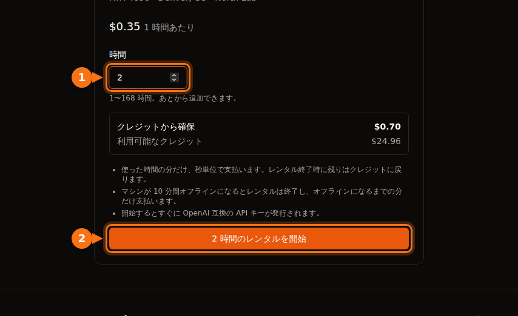

GPU の出品に書かれた時間単価に含まれるのは GPU の時間だけです。ほとんどのプラットフォームでは、ほかにもディスク容量（稼働中より停止中のほうが高いことも多い）、一部のマーケットプレイスではデータ転送、実際の作業と同じようにメーターが回るセットアップ時間とアイドル時間、そして銀行の通貨換算手数料を払います。後の計算例では、RTX 4090 の時間として $13.60 を見込んだ 1 か月が、$42.23 の請求になります。

どれも意図的に隠されているわけではありません。表の数字でプラットフォームを比べていると、見落としやすいだけです。以下の内容はすべて 2026 年 9 月に各プラットフォームのドキュメントと料金ページで確認したもので、リンクは最後にあります。時間単価そのものについては、[GPU レンタル料金比較](/ja/gpu-rental-pricing-comparison-2026/)をご覧ください。

## プラットフォーム別の追加費用

| 費用 | Vast.ai | RunPod | Lambda | AWS EC2 | GPUFlow |
| --- | --- | --- | --- | --- | --- |
| 課金単位 | 秒単位 | 秒単位 | 分単位 | 秒単位、最低 60 秒 | 秒単位、最低 1 分 |
| 停止中のストレージ | ホストの料金で課金 | ボリュームディスク 1 GB あたり月 $0.20 | ファイルシステムは 1 GiB あたり月額で課金 | EBS の課金は継続 | なし |
| データ転送 | ホストの料金、全バイト | 無料 | 無料 | 送信：月 100 GB まで無料、以降は GB 単位 | なし |
| 始めるのに必要なもの | 最低デポジット $5 | 1 時間分のクレジット、プリペイドカードは $100 | カードに $10 の仮押さえ | 支払い方法 | $10 のチャージ、予約分を全額確保 |
| 残高がゼロになると | 停止、その後破棄 | 停止、ネットワークボリュームがなければデータは消える | 利用後に毎週請求 | 該当なし | レンタル中には起こらない |

GPUFlow にストレージと転送の行がないのは、貸し出すものが違うからです。GPUFlow が貸すのは、プロバイダーの GPU ですでに動いている AI モデル用の OpenAI 互換 API キーで、ログインできるマシンではありません。その裏返しとして、自分のコードを動かしたり、学習やファインチューニングをしたりはできません。マシンが必要なら、関係するのは残りの 4 列です。

## ストレージ、特に停止中

マシンやコンテナを借りるプラットフォームでは、ファイルはディスクに置かれ、ディスクは存在する限り費用がかかります。

- **RunPod** は、Pod の稼働中はコンテナディスクとボリュームディスクに 1 GB あたり月 $0.10 を課金します。Pod を停止するとコンテナディスクは消去されて費用もかかりませんが、ボリュームディスクは 1 GB あたり月 $0.20 に上がります。ネットワークボリュームは稼働の有無にかかわらず、1 TB 未満で 1 GB あたり月 $0.07、それ以上で $0.05 です。Savings Plan の対象は GPU のコンピューティングだけで、ストレージは通常料金です。
- **Vast.ai** は、オフライン以外のすべての状態で「インスタンスが存在する間は 1 秒ごとに」ストレージを課金します。ドキュメントにははっきりと「インスタンスを停止してもストレージ料金は避けられません」とあります。料金はホストが決めます。
- **AWS** は停止中のインスタンスのコンピューティングとデータ転送には課金しませんが、「Amazon EBS ストレージボリュームの保存には料金が発生します」。停止中のインスタンスに割り当てた Elastic IP の課金も続きます。us-east-1 の gp3 ボリュームは 1 GB あたり月約 $0.08 です。
- **Lambda** はファイルシステムを、使用した 1 GiB あたりの月額で、1 時間単位で課金します。

停止中の RunPod の Pod に 200 GB のボリュームディスクがあると、二度と Pod を起動しなくても 200 × $0.20 = 月 $40 かかります。RunPod の Community Cloud の料金で、RTX 4090 の 100 時間分を超える額です。

クレジットが尽きると、さらに悪くなります。RunPod の残高が $0 になると Pod は停止し、「ネットワークボリュームのない Pod は削除され、そのデータは復元できません」。Vast.ai もインスタンスを停止し、カードが登録されていなければ、短い猶予期間の後に「インスタンスと保存データは破棄されます」。つまり、忘れていたボリュームは課金を続けるか、作業ごと消えるかのどちらかです。

私のやり方はこうです。プロジェクトが終わったその日にボリュームを削除し、まだ必要なものだけを小さなネットワークボリュームに残し、重要なものは GPU プラットフォーム以外の場所にもコピーを置いておきます。

## データ転送

15 GB のモデルをダウンロードし、データセットをアップロードすれば、1 回のセッションで数十 GB が動くこともあります。

- **Vast.ai** は「インスタンスの状態にかかわらず、インスタンスとの間で送受信したすべてのバイトに帯域幅料金」を課金します。アップロードとダウンロードの料金は各ホストが設定し、ドキュメントは「データ量の多いワークロードでは総コストに大きく影響しうる」と注意しています。借りる前に出品で確認してください。
- **RunPod** は、Pod には「受信・送信の料金はかからない」としています。
- **Lambda**：「受信にも送信にも課金されません」。
- **AWS**：受信は無料です。インターネットへの送信は、全サービス・全リージョン合計で毎月最初の 100 GB が無料で、それを超えると段階制の GB 単価で課金されます。パブリック IPv4 アドレスは使用中でもアイドルでも 1 つあたり 1 時間 $0.005 で、720 時間の 1 か月なら $3.60 です。

## デポジット、仮押さえ、前払いのクレジット

GPU プラットフォームの多くは前払い制です。クレジットを買ってから使います。そこに置いておくお金もコストで、戻ってこない場合は特にそうです。

- **Vast.ai**：最低デポジットは $5 で、カード、BitPay、Crypto.com で支払えます。カードで買った未使用のクレジットは、サイトのチャットで依頼すれば返金されます。使ったクレジットは返金されません。
- **RunPod**：選んだ Pod の少なくとも 1 時間分のクレジットが必要で、プリペイドカードは 1 回の取引で $100 以上入金することが推奨されています。クレジットは返金も引き出しもできません。
- **Lambda** は逆の方式です。前の週の利用分を毎週請求し、カードを登録したときに $10 の仮押さえをかけ、数日で返されます。使えるのは主要なクレジットカードだけで、プリペイドカードとデビットカードは断られます。
- **SaladCloud**：チャージは $5〜$10,000 で、クレジットは購入から 12 か月で失効します。
- **GPUFlow**：Stripe 経由のカード払いで $10〜$500 をチャージでき、手数料はなく、クレジットに有効期限はありません。レンタルを開始すると、少額のデポジットではなく、予約した全額がクレジットから確保されます。$0.40 で 10 時間予約すれば、レンタル終了まで $4.00 が確保され、使わなかった分はその時点で戻ります。購入したクレジットは換金できず、カードへの返金は、二重請求や誤った請求、クレジットが届かなかった場合、法律で必要な場合に限り、60 日以内に行われます。

失効するクレジットや、もう使わなくなったプラットフォームに眠っているクレジットは、使ってしまったお金と同じです。チャージは 1 年分ではなく、今月予定している作業の分だけにしてください。

## セットアップとアイドル時間

借りたマシンは、作業ではなく時間に対して課金されます。実際の作業と同じ料金がかかるのに何も生まない時間が 2 種類あります。

### セットアップ

メーターはマシンと同時に動き出します。Lambda では「インスタンスを起動し、インスタンスがヘルスチェックに合格した瞬間から課金が始まります」。ライブラリのインストール、コンテナイメージの pull、モデルのダウンロードはすべて課金される時間の中で行われます。1 時間 $0.34 なら、15 分のセットアップで約 $0.09 です。1 回なら小さな額ですが、1 か月毎日やれば GPU の数時間分になります。

効く対策は 2 つです。必要な環境がすでに入ったテンプレートやイメージから始めること、そしてモデルをボリュームに置いてダウンロードを 1 回で済ませることです（その場合は、上で見たストレージ料金と天秤にかけてください）。

GPUFlow では、利用者側のセットアップはありません。プロバイダーがモデルをマシンにインストール済みで、レンタル開始直後に API キーを受け取れます。

### アイドル

Lambda ははっきり書いています。「インスタンスは、実際に使われているかどうかにかかわらず、稼働している間は課金されます」。Google Cloud も、RUNNING 状態のままのアイドルな VM について同じことを書いています。朝すぐ使えるようにと Pod を一晩起動しておけば、一晩分の GPU の時間がかかります。

Azure にはもう 1 つ罠があります。単に「Stopped」になっただけの VM（たとえば OS の中からシャットダウンしたもの）は、コアの料金がかかり続けます。コンピューティングの課金を止めるには、ポータルか CLI から「Stopped (Deallocated)」にする必要があります。

GPUFlow も無関係ではありません。**今すぐ終了** をクリックするか予約した時間が切れるまで課金されます。早めの終了は無料で、確保額の未使用分は戻ってくるので、対策は単純に、終わったらレンタルを終了することです。[GPUFlow の課金の仕組み](https://docs.gpuflow.app/ja/renters/billing/)。

## 課金の単位と最低料金

秒単位課金は今では一般的ですが、細部は違います。

| プラットフォーム | 時間の課金方法 |
| --- | --- |
| Vast.ai | 秒単位 |
| RunPod Pods | 秒単位（Pods の概要ページはまだ分単位と記載） |
| RunPod Serverless | 秒単位で切り上げ。ワーカーの起動時間とアイドルタイムアウト（デフォルト 5 秒）を含む |
| Lambda | 1 分単位 |
| AWS EC2（Linux） | 秒単位、最低 60 秒 |
| Google Cloud | 最低 1 分、その後は秒単位 |
| Azure | 完全な分単位 |
| GPUFlow | 秒単位、最低 1 分、1 セント単位に切り上げ |

長いジョブでは、この違いは誤差です。問題になるのは短いセッションが多い場合と Serverless で、Serverless ではリクエストに加えて起動時間とアイドルタイムアウトも課金されます。間隔を空けて短いリクエストを送ると、そちらのほうがリクエスト自体より高くつくこともあります。計算は[GPU の秒単位課金と時間単位課金](/ja/per-second-vs-hourly-gpu-billing/)で詳しく扱っています。

## 中断可能インスタンス

中断可能（スポット）な容量は安く、ときには大幅に安くなりますが、回収されることがあります。

- Vast.ai によると、中断可能インスタンスは「オンデマンドより 50% 以上安いことが多い」とのことです。
- 2026 年 9 月の AWS では、p5.4xlarge（H100 × 1）がオンデマンドの 1 時間 $6.88 に対してスポットで $2.62 でした。
- TensorDock では、入札額に加えてストレージが通常料金で課金され、ほかの入札者に負けている間も払い続けます。ホストは最低入札額を設定しており、通常はオンデマンド価格の 50% 前後です。

隠れたコストは、作業のやり直しです。ジョブがチェックポイントから再開できなければ、1 回の中断で節約分が吹き飛ぶこともあります。直近の区間を失っても痛くない頻度でチェックポイントを保存してください。

## 銀行の手数料

GPUFlow を含め、ほぼすべての GPU プラットフォームは米ドルで請求します。カードが別の通貨なら、銀行が独自の手数料を加えることがあります。

- 海外事務手数料は通常 1〜3% で、価格が米ドルで表示されていても、海外の加盟店での購入に手数料をかける銀行もあります。
- カナダのクレジットカードの多くは、外貨での購入に約 2.5% の手数料をかけます。
- ブラジルでは、2025 年 7 月から国際カード決済にかかる IOF 税が 3.5% です。

$100 のチャージなら $1〜$3.50 で、プラットフォームの請求書には出てきません。海外事務手数料のかからないカードを使えば、ほとんどなくせます。

## 計算例：1 時間 $0.34 で月 $42

RunPod の Community Cloud の RTX 4090 を 1 時間 $0.34 で使い、カナダのクレジットカードで払う、現実的な 1 か月です。

- 実際の作業 40 時間：40 × $0.34 = $13.60。多くの人が予算に入れるのはこの数字です。
- 20 回のセッションでそれぞれ 15 分のセットアップ、計 5 時間：5 × $0.34 = $1.70。
- Pod を起動したまま放置した夜が 2 回、各 10 時間：20 × $0.34 = $6.80。
- 1 か月保持した 100 GB のボリュームディスク。その月の 720 時間のうち 65 時間は稼働、残りの 655 時間は停止：100 × ($0.10 × 65/720 + $0.20 × 655/720) = 約 $19.10。
- 小計 $41.20、これに 2.5% の海外事務手数料：$1.03。

合計 $42.23 で、見込んでいた GPU の作業の約 3.1 倍です。RunPod はデータ転送に課金しないので、帯域幅料金のある Vast.ai のホストなら、もう 1 行増えます。

<figure>
<svg viewBox="0 0 720 300" role="img" aria-labelledby="d1-title" xmlns="http://www.w3.org/2000/svg" font-family="system-ui, sans-serif" font-size="15">
<title id="d1-title">積み上げ棒グラフ：RTX 4090 の時間として 13.60 ドルを見込んだ 1 か月が、セットアップ時間、放置した夜、ディスクのストレージ、カード手数料を加えて 42.23 ドルの請求になる</title>
<rect x="0" y="0" width="720" height="300" fill="#ffffff"/>
<text x="20" y="28" fill="#1e1b4b" font-weight="600">1 時間 $0.34 の RTX 4090 を 1 か月使った場合</text>
<line x1="130" y1="50" x2="130" y2="170" stroke="#e2e8f0" stroke-width="1"/>
<text x="130" y="190" text-anchor="middle" fill="#64748b" font-size="13">$0</text>
<line x1="250" y1="50" x2="250" y2="170" stroke="#e2e8f0" stroke-width="1"/>
<text x="250" y="190" text-anchor="middle" fill="#64748b" font-size="13">$10</text>
<line x1="370" y1="50" x2="370" y2="170" stroke="#e2e8f0" stroke-width="1"/>
<text x="370" y="190" text-anchor="middle" fill="#64748b" font-size="13">$20</text>
<line x1="490" y1="50" x2="490" y2="170" stroke="#e2e8f0" stroke-width="1"/>
<text x="490" y="190" text-anchor="middle" fill="#64748b" font-size="13">$30</text>
<line x1="610" y1="50" x2="610" y2="170" stroke="#e2e8f0" stroke-width="1"/>
<text x="610" y="190" text-anchor="middle" fill="#64748b" font-size="13">$40</text>
<text x="120" y="84" text-anchor="end" fill="#1e1b4b">見込み</text>
<rect x="130" y="62" width="163.2" height="34" rx="3" fill="#6366f1"/>
<text x="301.2" y="84" fill="#1e1b4b">$13.60</text>
<text x="120" y="144" text-anchor="end" fill="#1e1b4b">請求額</text>
<rect x="130" y="122" width="163.2" height="34" fill="#6366f1"/>
<rect x="293.2" y="122" width="20.4" height="34" fill="#eef2ff" stroke="#6366f1" stroke-width="1.5"/>
<rect x="313.6" y="122" width="81.6" height="34" fill="#f97316"/>
<rect x="395.2" y="122" width="229.2" height="34" fill="#64748b"/>
<rect x="624.4" y="122" width="12.4" height="34" fill="#1e1b4b"/>
<text x="644.8" y="144" fill="#1e1b4b" font-weight="600">$42.23</text>
<line x1="130" y1="50" x2="130" y2="170" stroke="#64748b" stroke-width="1.5"/>
<rect x="20" y="209" width="16" height="16" fill="#6366f1"/>
<text x="44" y="222" fill="#1e1b4b">GPU の作業：$13.60</text>
<rect x="250" y="209" width="16" height="16" fill="#eef2ff" stroke="#6366f1" stroke-width="1.5"/>
<text x="274" y="222" fill="#1e1b4b">セットアップ：$1.70</text>
<rect x="480" y="209" width="16" height="16" fill="#f97316"/>
<text x="504" y="222" fill="#1e1b4b">放置した夜：$6.80</text>
<rect x="20" y="245" width="16" height="16" fill="#64748b"/>
<text x="44" y="258" fill="#1e1b4b" font-size="13">ボリュームディスク：$19.10</text>
<rect x="250" y="245" width="16" height="16" fill="#1e1b4b"/>
<text x="274" y="258" fill="#1e1b4b">カード手数料：$1.03</text>
</svg>
<figcaption>この節の計算例を実寸で描いたものです。1 時間 $0.34 で実際の GPU の作業が 40 時間、これにセットアップ 5 時間、放置した夜 2 回、1 か月保持した 100 GB のボリュームディスク、2.5% のカード手数料が加わります。GPU の作業は請求額の 3 分の 1 未満です。</figcaption>
</figure>

最大の項目は GPU ではなく、その月の 91% を停止状態で過ごしたディスクです。対策は地味なものです。ボリュームを削除するか小さくし、作業をやめたら Pod を終了してください。

### レンタル前のチェックリスト

1. GPU の時間に、ファイルを保持する期間分のストレージ料金を停止中の料金で足し合わせる。
2. プラットフォームに帯域幅料金があれば出品で確認し、ダウンロード量を見積もる。
3. セットアップ時間も課金される時間として数える。
4. 支払いを止める方法を把握しておく：レンタルを終了する、マシンを停止または割り当て解除する、ボリュームを削除する。
5. 残高がゼロになったときにデータがどうなるかを把握しておく。
6. カードの海外事務手数料を確認する。

必要なのが自分のソフトウェアを動かすマシンではなく、コードから呼び出せる AI モデルなら、API ベースのレンタルでストレージ、転送、セットアップの項目はまるごとなくなります。トークン課金との比較は[GPU の時間貸しか、トークン課金の API か](/ja/hourly-gpu-vs-per-token-api/)、どのジョブにどのプラットフォームが合うかは[GPUFlow、Vast.ai、RunPod、SaladCloud の比較](/ja/gpuflow-vs-vast-ai-vs-runpod/)で扱っています。学習など、マシンまるごとが必要な作業では、このチェックリストが請求額を時間単価に近づける方法です。

## 出典

- RunPod：[Pod の料金とストレージ](https://docs.runpod.io/pods/pricing)、[料金ページ](https://www.runpod.io/pricing)、[Pods の概要](https://docs.runpod.io/pods/overview)、[Serverless の料金](https://docs.runpod.io/serverless/pricing)、[請求に関する情報](https://docs.runpod.io/references/billing-information)、[RTX 4090 の料金](https://www.runpod.io/gpu-models/rtx-4090)
- Vast.ai：[料金](https://docs.vast.ai/guides/instances/pricing.md)、[請求](https://docs.vast.ai/documentation/reference/billing)、[クイックスタート（最低デポジット）](https://docs.vast.ai/guides/get-started/quickstart.md)
- Lambda：[請求](https://docs.lambda.ai/public-cloud/billing/)、[請求の管理](https://docs.lambda.ai/public-cloud/manage-billing/)
- SaladCloud：[請求](https://docs.salad.com/general/explanation/billing.md)
- TensorDock：[スポットインスタンス](https://docs.tensordock.com/virtual-machines/spot-instances)
- AWS：[EC2 オンデマンド料金](https://aws.amazon.com/ec2/pricing/on-demand/)、[停止と起動の仕組み](https://docs.aws.amazon.com/AWSEC2/latest/UserGuide/how-ec2-instance-stop-start-works.html)、[VPC の料金（パブリック IPv4）](https://aws.amazon.com/vpc/pricing/)、[Vantage 経由の p5.4xlarge の料金](https://instances.vantage.sh/aws/ec2/p5.4xlarge?region=us-east-1)、gp3 の料金：[CloudBurn の EBS 料金ガイド](https://cloudburn.io/blog/amazon-ebs-pricing)
- Google Cloud：[VM インスタンスの料金](https://cloud.google.com/compute/vm-instance-pricing)
- Azure：[Linux VM の料金と FAQ](https://azure.microsoft.com/en-us/pricing/details/virtual-machines/linux/)
- カード手数料：[Experian](https://www.experian.com/blogs/ask-experian/what-is-a-foreign-transaction-fee/)、[NerdWallet Canada](https://www.nerdwallet.com/ca/p/best/credit-cards/best-no-foreign-transaction-fee-credit-cards)、ブラジルの IOF：[Wise Brazil](https://wise.com/br/blog/iof-cartao-internacional)
- GPUFlow：[請求](https://docs.gpuflow.app/ja/renters/billing/)、[はじめに](https://docs.gpuflow.app/ja/renters/getting-started/)、[マーケットプレイス](https://gpuflow.app/ja/marketplace)

すべて 2026 年 9 月に確認しました。
