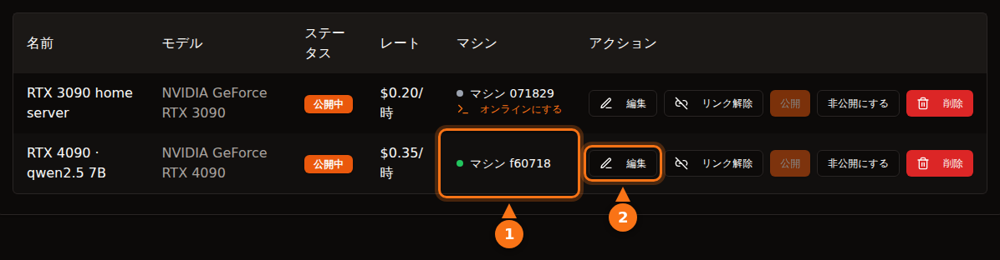

プラットフォームを理解したうえで選べば、それなりに安全です。ただ、「安全」の意味はプラットフォームによって違います。Vast.ai のようなコンテナ型のプラットフォームでは、借り手はあなたのマシンで自分のコードを実行し、その通信はあなたの IP アドレスから出ていきます。隔離によってファイルは守られますが、ネットワークや電気代までは守られません。GPUFlow のような API 専用の設計では、借り手ができるのはあなたがインストールしたモデルにチャットリクエストを送ることだけで、リスクの向きが逆になります。プロンプトはあなたのマシン上で読める状態になるので、借り手は秘密の情報を送るべきではありません。

この記事では、その両方の方向を見ていきます。他社についての記述は 2026 年 9 月に各プラットフォームのドキュメントで確認したもので、GPUFlow についての記述はすべてそのソースコードとドキュメントに基づいています。出典は最後にあります。

## コンテナ型のプラットフォームで借り手ができること

GPU マーケットプレイスの多くはコンテナを貸し出します。借り手はイメージを選び、シェルを受け取り、好きなものを実行します。ホストであるあなたが考えるべきことは 5 つあります。

- **任意のコード。** 借り手のコードは、コンテナや VM の中とはいえ、あなたのカーネル上で動きます。隔離は優秀ですが完璧ではありません。コンテナからの脱出はまれですが、カーネルやドライバーのアップデートで修正されるのはまさにこの種のバグであり、そのアップデートを入れるのはあなたです。
- **あなたの IP アドレス。** コンテナからの外向きの通信は、あなたのインターネット回線を通って出ていきます。借り手がサイトをスクレイピングしたり、スパムを送ったり、インターネットをスキャンしたりすれば、あなたの IP アドレス宛ての苦情があなたの ISP に届きます。Vast.ai の規約では、ユーザーのコンテンツから生じた請求についてユーザーがプロバイダーを補償するとされています。第三者との紛争では役に立ちますが、ISP があなたに警告を送ってくるのを止めることはできません。
- **ポートの開放。** Vast.ai のホスティングガイドには「ほとんどのジョブでは、クライアントがマシンに直接接続するためにポートの開放が必要です」とあり、ルーターでポートフォワーディングを設定することになります。
- **ディスク。** 借り手はイメージ、モデル、データセットをあなたのドライブにダウンロードします。Vast.ai はクライアントがボリュームを削除すると領域を解放しますが、レンタル中はその領域は借り手のものです。
- **電力、熱、ドライバー。** Vast.ai はホストに「レンタル期間中、GPU はほぼ最大の能力で使われるものと考えてください」と伝えています。何時間もボードの最大電力で動き、部屋は暑くなり、ファンは回り続けます。コンテナ型のプラットフォームでは専用のセットアップも必要です。Vast.ai のガイドには、Ubuntu のインストール、ディスクのパーティション分割、NVIDIA ドライバーのインストール、ルーターのポート開放が並んでいます。

## Vast.ai、Salad、RunPod は借り手をどう隔離しているか

| | Vast.ai | Salad | RunPod Community Cloud |
| --- | --- | --- | --- |
| **借り手が受け取るもの** | SSH または Jupyter で使うコンテナ（または VM） | 自分でデプロイしたコンテナ。SSH と Web ターミナルで入れる | Pod（コンテナ） |
| **隔離** | 非特権の Docker コンテナ | ハイパーバイザー上の Linux VM の中にコンテナ | 「厳格に分離された専用のコンテナ」 |
| **受信ポート** | ほとんどのジョブで必要 | デフォルトでブロック | 記載なし |
| **新規ホスト** | 受付中（Ubuntu） | 受付中（Windows 10/11） | 受付終了 |

- **Vast.ai** は「クライアントは非特権の Docker コンテナで隔離され、自分のデータにしかアクセスできません」としており、名前空間と cgroup を分け、ネットワーク、ファイルシステム、プロセスを隔離しています。一方で借り手には「プロバイダーのセキュリティには大きなばらつきがあります」と注意を促し、機密性の高い作業には認定データセンターで構成される Secure Cloud を勧めています。
- **Salad** は「ワークロードは Linux 仮想マシン上の OCI 互換コンテナで動作し、Windows やホスト上のほかのすべてのプロセスから隔離されます」としており、受信接続はデフォルトでブロックされます。ホストから借り手を守る仕組みもあり、ホストが「Linux 環境にアクセスしようとすると、環境を自動的に破棄し、そのマシンをブラックリストに登録します」。これとは別に、Salad には任意の帯域共有ジョブがあり、あなたの回線で「大手ストリーミングサービスの動画コンテンツを処理」します。サポートページには、データ使用量が増えること、そして「まれに、それらのストリーミングサービスで一時的な（通常 1〜2 日の）コンテンツ制限」が起きることがあると書かれています。
- **RunPod** は「Runpod は Community Cloud の新規ホストの受け付けを終了しました」としています。既存の環境については「各 Pod／ワーカーは専用のコンテナで動作します」とし、規約で「ホストがあなたの Pod／ワーカーのデータを調べることを禁止しています」。

3 社とも、借り手をあなたのシステムから隔離しています。ただし、正当に見える借り手の通信があなたの回線から出ていくのを止められるところはなく、止められるとうたっているところもありません。

## GPUFlow の設計はどう違うか

GPUFlow が貸し出すのはマシンではなく、OpenAI 互換 API の向こうにある AI モデルです。これで借り手が触れられる範囲が変わります。コードが実際に何をしているかを見ていきます。

**エージェント。** インストーラーは Go のバイナリ 1 つを `/usr/local/bin/gpuflow-agent` に置き、systemd のサービスとして実行します。Docker は使いません。サービスユニットでは `DynamicUser=yes`（一時的な非特権ユーザー）、`NoNewPrivileges=yes`（権限を昇格できない）、`ProtectSystem=strict`（システムは読み取り専用）、`ProtectHome=yes`（ホームフォルダーは見えない）、`PrivateTmp=yes` を指定しています。推論エンジンはデフォルトで Ollama で、Ollama 自身のインストーラーで独立したサービスとしてインストールされます（プロバイダーは代わりに、自分の OpenAI 互換サーバーをエージェントの接続先にすることもできます）。この強化設定はエージェントに対するもので、Ollama には適用されません。

**ネットワーク。** エージェントは外向きの接続しか行いません。`wss://ws.gpuflow.app` への TLS 上の WebSocket と、登録と 15 秒ごとのハートビートのための `gpuflow.app` への HTTPS です。ポートは一切開かず、ルーターで何かをフォワードする必要もなく、借り手があなたの IP アドレスを知ることもありません。Ollama とは、Ollama のデフォルトのループバックアドレスである `127.0.0.1:11434` で通信します。

**借り手が呼び出せるもの。** 借り手は `https://gpuflow.app/v1` 用の API キーを受け取ります。`GET /v1/models` には GPUFlow 自身が応答し、あなたのマシンに転送されるリクエストは `POST /v1/chat/completions` だけです。エージェントにも独自の二重の鍵があります。プロキシするのは 4 つのパス（`/v1/chat/completions`、`/v1/completions`、`/v1/embeddings`、`/v1/models`）だけで、それ以外はすべて拒否します。モデルの pull、削除、作成ができる Ollama ネイティブの `/api/*` エンドポイントも拒否の対象です。エージェントが扱うメッセージの種類は推論リクエストの 1 つだけで、それ以外は無視します。

つまり、借り手にはシェルも SSH もファイルもなく、あなたのマシンへのネットワークアクセスもありません。70 GB のモデルをあなたのディスクにダウンロードすることも、あなたの回線を使ってインターネットに出ることもできません。できるのは、予約した時間だけ GPU を使い続けることと、`model` フィールドにあなたがインストールした任意のモデルを指定することです。

<figure>
<svg viewBox="0 0 720 380" role="img" aria-labelledby="d1-title" xmlns="http://www.w3.org/2000/svg" font-family="system-ui, sans-serif" font-size="15">
<title id="d1-title">コンテナ型ホストと、GPUFlow のような API 専用の設計で、借り手ができることの比較</title>
<rect x="0" y="0" width="720" height="380" fill="#ffffff"/>
<text x="20" y="40" fill="#64748b" font-weight="bold">借り手ができること</text>
<text x="470" y="40" text-anchor="middle" fill="#1e1b4b" font-weight="bold">コンテナ型ホスト</text>
<text x="630" y="40" text-anchor="middle" fill="#1e1b4b" font-weight="bold">GPUFlow（API）</text>
<line x1="20" y1="55" x2="700" y2="55" stroke="#e2e8f0" stroke-width="2"/>
<text x="20" y="89" fill="#1e1b4b">自分のプログラムを実行する</text>
<rect x="430" y="70" width="80" height="28" rx="14" fill="#fff7ed" stroke="#f97316" stroke-width="2"/>
<text x="470" y="89" text-anchor="middle" fill="#1e1b4b">はい</text>
<rect x="590" y="70" width="80" height="28" rx="14" fill="#f0fdf4" stroke="#16a34a" stroke-width="2"/>
<text x="630" y="89" text-anchor="middle" fill="#1e1b4b">いいえ</text>
<line x1="20" y1="110" x2="700" y2="110" stroke="#e2e8f0" stroke-width="1"/>
<text x="20" y="133" fill="#1e1b4b">シェルや SSH を開く</text>
<rect x="430" y="114" width="80" height="28" rx="14" fill="#fff7ed" stroke="#f97316" stroke-width="2"/>
<text x="470" y="133" text-anchor="middle" fill="#1e1b4b">はい</text>
<rect x="590" y="114" width="80" height="28" rx="14" fill="#f0fdf4" stroke="#16a34a" stroke-width="2"/>
<text x="630" y="133" text-anchor="middle" fill="#1e1b4b">いいえ</text>
<line x1="20" y1="154" x2="700" y2="154" stroke="#e2e8f0" stroke-width="1"/>
<text x="20" y="177" fill="#1e1b4b">ディスクにファイルを書き込む</text>
<rect x="430" y="158" width="80" height="28" rx="14" fill="#fff7ed" stroke="#f97316" stroke-width="2"/>
<text x="470" y="177" text-anchor="middle" fill="#1e1b4b">はい</text>
<rect x="590" y="158" width="80" height="28" rx="14" fill="#f0fdf4" stroke="#16a34a" stroke-width="2"/>
<text x="630" y="177" text-anchor="middle" fill="#1e1b4b">いいえ</text>
<line x1="20" y1="198" x2="700" y2="198" stroke="#e2e8f0" stroke-width="1"/>
<text x="20" y="221" fill="#1e1b4b">あなたの IP から通信を送る</text>
<rect x="430" y="202" width="80" height="28" rx="14" fill="#fff7ed" stroke="#f97316" stroke-width="2"/>
<text x="470" y="221" text-anchor="middle" fill="#1e1b4b">はい</text>
<rect x="590" y="202" width="80" height="28" rx="14" fill="#f0fdf4" stroke="#16a34a" stroke-width="2"/>
<text x="630" y="221" text-anchor="middle" fill="#1e1b4b">いいえ</text>
<line x1="20" y1="242" x2="700" y2="242" stroke="#e2e8f0" stroke-width="1"/>
<text x="20" y="265" fill="#1e1b4b">ルーターのポート開放が必要</text>
<rect x="430" y="246" width="80" height="28" rx="14" fill="#fff7ed" stroke="#f97316" stroke-width="2"/>
<text x="470" y="265" text-anchor="middle" fill="#1e1b4b">たいてい</text>
<rect x="590" y="246" width="80" height="28" rx="14" fill="#f0fdf4" stroke="#16a34a" stroke-width="2"/>
<text x="630" y="265" text-anchor="middle" fill="#1e1b4b">いいえ</text>
<line x1="20" y1="286" x2="700" y2="286" stroke="#e2e8f0" stroke-width="1"/>
<text x="20" y="309" fill="#1e1b4b">モデルをダウンロード・削除する</text>
<rect x="430" y="290" width="80" height="28" rx="14" fill="#fff7ed" stroke="#f97316" stroke-width="2"/>
<text x="470" y="309" text-anchor="middle" fill="#1e1b4b">はい</text>
<rect x="590" y="290" width="80" height="28" rx="14" fill="#f0fdf4" stroke="#16a34a" stroke-width="2"/>
<text x="630" y="309" text-anchor="middle" fill="#1e1b4b">いいえ</text>
<line x1="20" y1="330" x2="700" y2="330" stroke="#e2e8f0" stroke-width="1"/>
<text x="20" y="353" fill="#1e1b4b">GPU を何時間も使い続ける</text>
<rect x="430" y="334" width="80" height="28" rx="14" fill="#eef2ff" stroke="#6366f1" stroke-width="2"/>
<text x="470" y="353" text-anchor="middle" fill="#1e1b4b">はい</text>
<rect x="590" y="334" width="80" height="28" rx="14" fill="#eef2ff" stroke="#6366f1" stroke-width="2"/>
<text x="630" y="353" text-anchor="middle" fill="#1e1b4b">はい</text>
</svg>
<figcaption>コンテナの列は Vast.ai 型のホスティングを表しています。ファイルと通信は借り手のコンテナの中にとどまりますが、使うのはあなたのディスクと回線です。細部はプラットフォームによって異なり、Salad はコンテナを Linux VM の中で動かし、受信接続をデフォルトでブロックします。GPUFlow では、借り手はあなたがインストールしたモデルにチャットリクエストを送るだけです。</figcaption>
</figure>

## データの経路を 1 区間ずつ

借り手に読んでほしいのはこの部分です。チャットリクエストは 4 つのソフトウェアを通り、そのうち複数の地点で本文を読める状態になります。

<figure>
<svg viewBox="0 0 720 330" role="img" aria-labelledby="d2-title" xmlns="http://www.w3.org/2000/svg" font-family="system-ui, sans-serif" font-size="15">
<title id="d2-title">GPUFlow のチャットリクエストは、借り手のアプリから gpuflow.app、リレー、プロバイダーの PC 上のエージェント、Ollama へと進み、回答は同じ経路をストリーミングで戻る</title>
<rect x="0" y="0" width="720" height="330" fill="#ffffff"/>
<rect x="480" y="50" width="230" height="200" rx="12" fill="#fff7ed" stroke="#f97316" stroke-width="2" stroke-dasharray="6 4"/>
<text x="595" y="76" text-anchor="middle" fill="#1e1b4b" font-weight="bold">プロバイダーの PC</text>
<rect x="10" y="110" width="110" height="70" rx="10" fill="#eef2ff" stroke="#6366f1" stroke-width="2"/>
<text x="65" y="141" text-anchor="middle" fill="#1e1b4b">借り手の</text>
<text x="65" y="161" text-anchor="middle" fill="#1e1b4b">アプリ</text>
<rect x="160" y="110" width="120" height="70" rx="10" fill="#eef2ff" stroke="#6366f1" stroke-width="2"/>
<text x="220" y="141" text-anchor="middle" fill="#1e1b4b">GPUFlow API</text>
<text x="220" y="161" text-anchor="middle" fill="#64748b" font-size="12">gpuflow.app/v1</text>
<rect x="320" y="110" width="105" height="70" rx="10" fill="#eef2ff" stroke="#6366f1" stroke-width="2"/>
<text x="372" y="141" text-anchor="middle" fill="#1e1b4b">リレー</text>
<text x="372" y="161" text-anchor="middle" fill="#64748b" font-size="12">ws.gpuflow.app</text>
<rect x="492" y="110" width="90" height="70" rx="10" fill="#ffffff" stroke="#6366f1" stroke-width="2"/>
<text x="537" y="141" text-anchor="middle" fill="#1e1b4b">GPUFlow</text>
<text x="537" y="161" text-anchor="middle" fill="#1e1b4b" font-size="13">エージェント</text>
<rect x="610" y="110" width="90" height="70" rx="10" fill="#ffffff" stroke="#6366f1" stroke-width="2"/>
<text x="655" y="141" text-anchor="middle" fill="#1e1b4b">Ollama</text>
<text x="655" y="161" text-anchor="middle" fill="#64748b" font-size="12">127.0.0.1</text>
<line x1="124" y1="145" x2="156" y2="145" stroke="#16a34a" stroke-width="4"/>
<line x1="284" y1="145" x2="316" y2="145" stroke="#64748b" stroke-width="4"/>
<line x1="429" y1="145" x2="488" y2="145" stroke="#16a34a" stroke-width="4"/>
<line x1="586" y1="145" x2="606" y2="145" stroke="#f97316" stroke-width="4"/>
<text x="140" y="102" text-anchor="middle" fill="#16a34a" font-size="13">TLS</text>
<text x="300" y="102" text-anchor="middle" fill="#64748b" font-size="13">内部</text>
<text x="452" y="102" text-anchor="middle" fill="#16a34a" font-size="13">TLS</text>
<text x="596" y="102" text-anchor="middle" fill="#f97316" font-size="13">平文</text>
<text x="65" y="212" text-anchor="middle" fill="#64748b" font-size="12">ここで本文を</text>
<text x="65" y="228" text-anchor="middle" fill="#64748b" font-size="12">入力する</text>
<text x="220" y="212" text-anchor="middle" fill="#64748b" font-size="12">本文を読み、</text>
<text x="220" y="228" text-anchor="middle" fill="#64748b" font-size="12">保存するのは</text>
<text x="220" y="244" text-anchor="middle" fill="#64748b" font-size="12">トークン数だけ</text>
<text x="372" y="212" text-anchor="middle" fill="#64748b" font-size="12">そのまま転送し、</text>
<text x="372" y="228" text-anchor="middle" fill="#64748b" font-size="12">本文は</text>
<text x="372" y="244" text-anchor="middle" fill="#64748b" font-size="12">記録しない</text>
<text x="595" y="212" text-anchor="middle" fill="#1e1b4b" font-size="13" font-weight="bold">メモリ上では平文</text>
<text x="595" y="230" text-anchor="middle" fill="#1e1b4b" font-size="13" font-weight="bold">所有者は root 権限を持つ</text>
<line x1="20" y1="295" x2="50" y2="295" stroke="#16a34a" stroke-width="4"/>
<text x="58" y="300" fill="#1e1b4b" font-size="13">インターネット上は TLS</text>
<line x1="235" y1="295" x2="265" y2="295" stroke="#64748b" stroke-width="4"/>
<text x="273" y="300" fill="#1e1b4b" font-size="13">GPUFlow の内部</text>
<line x1="420" y1="295" x2="450" y2="295" stroke="#f97316" stroke-width="4"/>
<text x="458" y="300" fill="#1e1b4b" font-size="13">プロバイダーの PC 上では平文</text>
</svg>
<figcaption>リクエストは左から右へ進み、回答は同じ経路をストリーミングで戻ります。インターネットを通る区間はそれぞれ TLS で保護されますが、TLS は各サーバーで終端します。そのため本文は、GPUFlow のサーバーが転送している間と、Ollama がモデルを動かすプロバイダーの PC 上で読める状態になります。</figcaption>
</figure>

1. **借り手から gpuflow.app まで：** HTTPS です。サイトは Cloudflare の背後にあります。
2. **GPUFlow の API からリレーまで：** GPUFlow 側の内部接続です。API はキーを確認し、リクエストの本文をそのまま転送し、トークン数を記録します。リクエストや回答の本文は保存せず、プライバシーポリシーにもそう書かれています。
3. **リレーからプロバイダーのエージェントまで：** エージェントが開いた TLS の WebSocket です。リレーが記録するのは各メッセージの種類で、中身ではありません。
4. **エージェントから Ollama まで：** プロバイダーの PC 内のループバックアドレスでの平文の HTTP です。エージェントもリクエストの本文は記録しません。

モデルまでのエンドツーエンド暗号化はありませんし、通常の推論エンジンでは実現しようがありません。モデルはプロンプトを読まなければ答えられないからです。

## プロバイダーから見えるもの

はっきり書きます。**プロバイダーのコンピューターは、あなたのプロンプトと回答を平文で扱います。** Ollama はそこで動いており、プロバイダーはそのマシンの root 権限を持っています（インストーラーが root を必要とします）。その気になれば、ループバックの通信をキャプチャすることも、エンジンを差し替えることも、エージェントの接続先を別のサーバーに変えることもできます。

それを防いでいるのは契約です。GPUFlow の規約には、プロバイダーは「借り手のリクエストや回答を記録、閲覧、保持、共有してはならず、回答を改変してもならない」とあります。これはアカウントへの処分を伴うルールであって、技術的な防止策ではありません。プライバシーポリシーも借り手に同じことを伝えています。レンタル中、リクエストと回答はプロバイダーのコンピューターを通ります。

プロンプト以外では、プロバイダーにはあなたの GPUFlow のユーザー名が見え、レンタル開始時に通知（レンタル ID、出品、時間数）が届きます。借り手には、プロバイダーのマシンの統計は何も見えません。GPU の温度、VRAM、消費電力などのテレメトリーは所有者のダッシュボードにしか表示されません。

借り手にとっての実際的なルールはこうです。**秘密の情報、認証情報、他人の個人データ、規制対象のデータ（医療、金融、顧客の機密情報）は、どのコミュニティ GPU にも送らないでください。** これは GPUFlow に限らず、誰かの自宅 PC 上のコンテナでも同じです。そこでもホストは同じ root 権限でメモリやディスクを調べられます。機密性の高い作業では、自分で管理するハードウェアでモデルを動かすか、コンプライアンス上必要な契約を結べるプロバイダーを使ってください。ポリシーの面は[企業が公開 AI ツールを禁止する理由](/ja/why-corporate-policies-banning-chatgpt/)で、コンテナの面は[公開 GPU ノードでデータセットを守る方法](/ja/how-to-secure-dataset-on-public-gpu-node/)で扱っています。

## GPUFlow でも残るリスク

API 専用にすれば攻撃対象領域は小さくなります。なくなるわけではありません。ないふりをするより、残っているものを挙げておきます。

- **Ollama は信頼できない入力を解析します。** 借り手のリクエストはすべて、最終的に JSON として Ollama に渡されます。侵入経路として最も可能性が高いのは Ollama のバグなので、アップデートしてください。エージェントの許可リストは借り手を Ollama のモデル管理エンドポイントから遠ざけますが、チャットの経路にあるバグまでは防げません。
- **インストーラーは root で動きます。** gpuflow.app のスクリプトを `sudo bash` にパイプして実行し、さらに Ollama のインストールスクリプトも実行されます。先に両方を読んでください。どんなホスティング用ソフトウェアでも、それが良い習慣です。
- **自動アップデートはありません。** エージェントは自分自身を更新しません。新しいバージョンにするにはインストーラーを再実行します。SHA256SUMS ファイルが公開されていれば、インストーラーはそれでバイナリを検証します。
- **負荷。** リクエスト数の上限はありません。借り手は予約した時間中ずっと GPU をフル稼働させることができ、あなたがインストールしたモデルなら一番大きいものでも使えます。
- **熱と電力。** ほかのプラットフォームと同じで、貸し出した時間は負荷がかかる時間です。

## プロバイダー向けチェックリスト

1. **貸しても困らないマシンを使う。** 理想は専用のマシンです。少なくとも、どのプラットフォームであれ、貸し出すコンピューターに仕事のファイルやパスワード管理のデータを置かないでください。GPUFlow ではエージェントはすでにホームフォルダーが見えない一時的なシステムユーザーとして動いていますが、Ollama は別のサービスです。
2. **電力を制限する。** `sudo nvidia-smi -pl 280` でボードの電力上限をワット単位で設定できます（root が必要で、値はカードの最小値と最大値の間でなければなりません）。Puget Systems の報告では、270〜280 W に制限した RTX 3090 は性能の約 95% を維持しています。起動のたびに systemd ユニットで制限をかけ直す方法も紹介されています。
3. **先に電気代を計算する。** GPU が稼働している間に **マイマシン** で消費電力を確認し、キロワット数に 1 kWh あたりの電気料金を掛けます。[ゲーミング GPU の貸し出しでいくら稼げるか](/ja/how-much-can-you-earn-renting-out-your-gpu/)で、一般的なカードと 5 か国についてこの計算をしています。
4. **温度を見る。** リアルタイムの統計に、GPU、ホットスポット、メモリの温度とファンの回転数が表示されます。ケースに空気が通るようにしてください。
5. **システムを最新に保つ。** Linux、GPU ドライバー、Ollama のアップデートを入れてください。GPUFlow のインストーラーは GPU ドライバーを管理しません。再起動後は systemd がエージェントを再起動します。
6. **一時停止の方法を知っておく。** **マイGPU** で出品を非公開にするか、`sudo systemctl stop gpuflow-agent` を実行します（`start` で元に戻ります）。レンタル中は、ダッシュボードから出品やマシンを変更することも、借り手のレンタルを終了させることもできません。レンタル中にエージェントを止めると、レンタルは 10 分後に終了し、報酬は最後のハートビートまでの分だけになります。
7. **アンインストールの方法を知っておく。** 手順は[トラブルシューティングのドキュメント](https://docs.gpuflow.app/ja/providers/troubleshooting/)にあります。Ollama は自分で削除するまで残ります。

コンテナ型のプラットフォームでは、項目が 2 つ増えます。ルーターのポートを本当に開放してよいかを決めること、そして ISP が苦情にどう対応するかを確認しておくことです。借り手の通信にはあなたの IP アドレスが付くからです。

## 借り手向けチェックリスト

1. **コミュニティ GPU はすべて他人のコンピューターだと考える。** API キー、パスワード、顧客の記録、医療や金融のデータをプロンプトに入れないでください。
2. **不要な情報は削る。** 送る前に、名前や口座番号をプレースホルダーに置き換えます。
3. **キーを守る。** GPUFlow では、キーはレンタルが終わると使えなくなります。漏れた場合は **新しいキー** で古いキーをすぐに無効にでき、**今すぐ終了** で課金を止めて未使用分の時間を返金できます。
4. **回答が間違っている、または改変されている可能性を前提にする。** 規約はプロバイダーによる回答の改変を禁じていますが、重要なものは確認してください。
5. **機密性の高い作業には適した手段を使う。** 自分でホストするか、必要な契約を結べるプロバイダーを使ってください。それ以外の用途には[アプリでキーを使う方法](/ja/use-openai-compatible-api-key-in-apps/)をどうぞ。

## 出典

すべて 2026 年 9 月に確認しました。

- GPUFlow：[借り手が触れられる範囲](https://docs.gpuflow.app/ja/providers/security/)、[プロバイダーの始め方](https://docs.gpuflow.app/ja/providers/getting-started/)、[価格と電気代](https://docs.gpuflow.app/ja/providers/pricing/)、[トラブルシューティングとアンインストール](https://docs.gpuflow.app/ja/providers/troubleshooting/)、[API クイックスタート](https://docs.gpuflow.app/ja/renters/api-quickstart/)
- Vast.ai：[ホスティングの概要](https://docs.vast.ai/host/hosting-overview.md)、[セキュリティ FAQ](https://docs.vast.ai/documentation/reference/faq/security)、[Linux 仮想マシン](https://docs.vast.ai/linux-virtual-machines)、[利用規約](https://vast.ai/terms)、[プライベート AI モデルの実行](https://vast.ai/article/running-private-ai-models-without-the-risk-of-data-exposure)
- Salad：[セキュリティ](https://salad.com/security)、[コンテナワークロードとあなたの PC](https://community.salad.com/container-workloads-and-your-pc/)、[帯域共有](https://support.salad.com/faq/jobs/what-is-bandwidth-sharing/)、[SSH とターミナル](https://docs.salad.com/container-engine/explanation/container-groups/ssh-and-terminal.md)、[ダウンロードとシステム要件](https://salad.com/download/)
- RunPod：[Pod の選び方](https://docs.runpod.io/pods/choose-a-pod)、[データセキュリティと法令遵守](https://docs.runpod.io/hosting/partner-requirements)
- Ollama：[FAQ（デフォルトのバインドアドレス）](https://docs.ollama.com/faq)
- NVIDIA：[nvidia-smi マニュアル](https://docs.nvidia.com/deploy/nvidia-smi/index.html)
- Puget Systems：[systemd と nvidia-smi による RTX 3090 の電力制限](https://www.pugetsystems.com/labs/hpc/quad-rtx3090-gpu-power-limiting-with-systemd-and-nvidia-smi-1983/)
