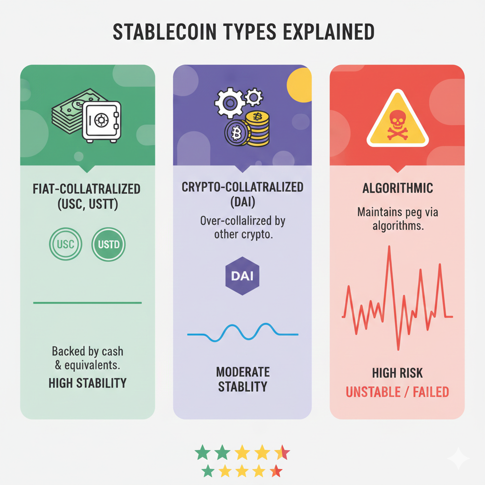

# GPUレンタルの支払いにステーブルコインが最も賢い選択である理由

> **最終更新日:** 2026年2月21日 | **読了時間:** 10分

ある開発者が、週末にGPUを借りて学習ジョブを回すために、200ドル相当のイーサリアム（ETH）を入金しました。ところが月曜までの間に、ETHは12%下落しました。学習ジョブのGPU利用料は85ドル。残高は本来115ドル相当のはずが、実際には101ドル分の価値しかありません。市場のボラティリティに14ドルを寄付した形です。理由もなく。

ステーブルコインを使えば、この問題は完全に排除できます。ステーブルコインはドル建ての価値を維持しつつ、暗号資産決済の利点――低い手数料、高速な決済、グローバルなアクセス性、一定のプライバシー――をそのまま享受できます。GPUレンタルのように、必要なのは投機的な値動きではなく「読める予算」である場面では、ステーブルコインはごく自然な選択肢です。

この記事では、ステーブルコインとは何か、GPUレンタルではどの銘柄を使うべきか、そして手数料を抑えながらどうやって入手するかを説明します。ウォレットのセットアップやプラットフォーム選定を含めた暗号資産によるGPUレンタル全体の流れについては、[暗号資産でGPUをレンタルするための完全ガイド](/ja/rent-gpu-with-crypto/)を参照してください。

---

## ボラティリティの問題：ETHで支払うと余計に払うことになる理由

暗号資産の価格は常に変動しています。そのため、ETHやBTCのようなボラティリティの高い資産をサービス料金の支払いに使うと、見えにくいコストが発生します。

### ボラティリティ損失の計算

**シナリオ：週末の機械学習トレーニング**

金曜日:

- 0.08 ETHを入金（ETH価格が2,500ドルのとき、200ドル相当）
- 計画：RTX 4090を約30時間、1時間あたり0.60ドルで利用 = GPUコストは108ドル程度
- 想定残高：およそ92ドル分のETH

月曜日:

- 学習ジョブ完了、GPU利用料として108ドル分を消費
- ETH価格が2,200ドルに下落（12%の下落）
- 残りの0.0368 ETHの価値：81ドル
- **ボラティリティによる損失：11ドル**

GPU利用として実際に支払ったのは108ドルですが、トータルでは119ドル（108ドル + 11ドルのボラティリティ損）を失っています。市場に、実質的に10%の上乗せ料金を払わされたのと同じです。

### ボラティリティは上にも下にも動く（ただし予測不能）

「でもETHが上がったらどうなる？」

たしかに、ボラティリティは有利に働くこともあります。もしETHが12%上昇していたら:

- 残りの0.0368 ETHの価値は103ドル
- 11ドル分の「利益」が出た計算になります

**問題はここです：あなたがやりたいのはトレードではなく、モデルの学習です。**

GPUレンタルは本来、予測可能な事業コストであるべきで、暗号資産の価格方向に賭けるためのポジションではありません。計算資源が必要なときに、同時にマーケットの値動きにも賭けるべきではないのです。

### 実際のボラティリティの履歴

2025年のランダムな48時間区間におけるETH価格の推移:

| 期間        | ETH開始価格 | ETH終了価格 | 変化率 |
| ----------- | ----------- | ----------- | ------ |
| 1月5〜7日   | $2,380      | $2,520      | +5.9%  |
| 2月12〜14日 | $2,710      | $2,490      | -8.1%  |
| 3月22〜24日 | $2,150      | $2,340      | +8.8%  |
| 4月8〜10日  | $2,890      | $2,650      | -8.3%  |
| 5月15〜17日 | $2,420      | $2,380      | -1.7%  |

**48時間あたりの平均絶対変動率：6.6%**

200ドルをGPUレンタル用に入金した場合、平均するとプラスマイナスおよそ13ドル分のボラティリティにさらされることになります。計算資源を借りたいだけの人にとって、この不確実性には実質的なメリットがありません。

### ステーブルコインならこの変数を消せる

同じシナリオをUSDCで行った場合:

金曜日:

- 200 USDCを入金（200ドル分）
- 計画：RTX 4090を約30時間レンタル = GPUコストは108ドル程度

月曜日:

- 学習ジョブ完了、GPU利用料として108ドル分を消費
- 残高：92 USDC（92ドル分）
- **ボラティリティによる損失：0ドル**

108ドル分のGPU利用に対して、支払ったのもきっちり108ドル。市場リスクも、思わぬサプライズも、投機的な要素もありません。

### ボラティリティ資産が合理的なケース

GPUレンタルにETHやBTCを使うのが合理的になるのは、次のような場合です。

- 暗号資産を積極的にトレードしており、レンタル期間中もマーケットエクスポージャーを取りたい
- 報酬や収入をETHで受け取っており、あえて換金したくない
- 法定通貨ではない資産にこだわる思想的な理由がある
- ボラティリティによるリスクを十分理解し、受け入れている

一方で、ただ「読めるコストでGPUを借りたい」だけの多くの開発者にとっては、ステーブルコインの方が明らかに適しています。

---

## ステーブルコインとは何か、そのドルペッグはどう維持されているのか

ステーブルコインは、価値を安定させることを目的に設計された暗号資産で、多くは米ドルに1:1でペッグされています。その仕組みを理解しておくと、実際に使う際の安心感が違ってきます。

### 基本的な仕組み

**従来型の暗号資産（ETH、BTCなど）の場合:**

- 価格は市場の需給だけで決まる
- 裏付けとなる資産は存在しない
- 価値は投機、採用状況、センチメントに応じて変動する

**ステーブルコイン（USDC、USDTなど）の場合:**

- 価格は1.00ドルに維持されるよう設計されている
- 準備資産（現金、国債など）によって裏付けされている
- 市場からの圧力がかかった際にペッグを維持する仕組みを持つ

### ステーブルコインの3つのタイプ

**1. 法定通貨担保型（USDC、USDT）**

仕組み:

- 発行体が、発行したトークン1枚につき1ドルの準備資産を保有する
- 準備資産は銀行預金、米国短期国債、現金同等物など
- ユーザーは（一定の条件を満たせば）トークンをドルと交換可能
- 市場で価格が1ドルから乖離すると、アービトラージにより1ドル近辺に戻る  
  例：USDCが0.99ドルで取引されていれば、トレーダーはそれを買って1ドルで償還することで利益を得る

**USDCの裏付け例:**

- 発行体：Circle（米国の規制対象となる企業）
- 準備資産：現金と短期米国債
- 監査：大手会計事務所Grant Thorntonによる月次アテステーション
- 発行残高：250億ドル超

**2. 暗号資産担保型（DAI）**

仕組み:

- ETH、WBTCなどの暗号資産を担保として預け入れ、その上にDAIを発行
- 担保は過剰に積まれており、100 DAIに対して150ドル以上の暗号資産が裏付けとなる
- 担保価値が下がりすぎるとスマートコントラクトが自動的に清算
- 発行体となる中央集権的な企業は存在せず、分散型プロトコルが運営

**DAIの裏付け例:**

- 発行主体：MakerDAO（分散型プロトコル）
- 担保資産：複数の暗号資産および実世界資産の組み合わせ
- 最低担保率：おおよそ150%以上
- 発行残高：およそ50億ドル

**3. アルゴリズム型（歴史的には──ほぼすべて失敗）**

仕組み:

- 明確な担保資産を持たない
- アルゴリズムにより供給量を増減させ、価格を1ドルに保とうとする
- 価格が1ドルから乖離すると、ミント／バーンの仕組みで調整

**おすすめしない理由:**

- TerraUSD（UST）は2022年5月に崩壊し、400億ドル以上の価値が失われた
- 市場ストレス時にアルゴリズムが機能せずペッグ維持に失敗
- 多くのアルゴリズム型ステーブルコインが同様に破綻
- GPUレンタル用途では、担保付きのステーブルコインだけを使うべき

### 実際の安定性はどの程度か

**USDCのペッグ安定性の履歴:**

| 出来事                | USDC価格     | 継続時間      | その後の推移 |
| --------------------- | ------------ | ------------- | ------------ |
| 通常時                | $0.999-1.001 | 時間の99%以上 | N/A          |
| 2023年3月 SVB危機     | 最安$0.87    | 約48時間      | 完全回復     |
| 2022年5月 Terra崩壊時 | 最安$0.98    | 約24時間      | 完全回復     |

**USDTのペッグ安定性の履歴:**

| 出来事                   | USDT価格     | 継続時間      | その後の推移 |
| ------------------------ | ------------ | ------------- | ------------ |
| 通常時                   | $0.998-1.002 | 時間の99%以上 | N/A          |
| 2018年10月のストレス局面 | 最安$0.92    | 約1週間       | 完全回復     |
| 2022年5月 Terra崩壊時    | 最安$0.95    | 約24時間      | 完全回復     |

**GPUレンタルという観点から:**

実際にステーブルコインを保有するのは、レンタル中の数時間から数日程度であることがほとんどです。この時間スケールでは、大きなデペッグ（ペッグからの乖離）イベントに巻き込まれるリスクはかなり限定的です。USDCで最悪だった2023年3月の事例でも、48時間以内に1ドル近辺まで戻っています。数週間単位で保有するのが不安であれば、USDCとUSDTに分散して持つというやり方もあります。

### GPUレンタルにとって何が重要なのか

ステーブルコインを使うことで、次のようなメリットがあります。

- **予算の予測可能性:** 100ドルを入金したら、計算資源として使えるのも常に100ドル
- **暗号資産決済の利点:** 低手数料、高速決済、暗号ネイティブなプラットフォームではKYC不要
- **マーケットエクスポージャーなし:** GPU予算が暗号資産の値動きに左右されない
- **会計処理のしやすさ:** 1 USDC = 1ドルとして扱えるため、経費計上がシンプル

言い換えれば、暗号資産決済のメリットだけを取り出し、そのデメリットである価格ボラティリティは切り離せるのがステーブルコインです。GPUレンタルとの相性は非常に良いと言えます。

この続き（第2の三分の一：USDC vs USDT vs DAI 〜 ネットワーク選択の章）に進めてよければ知らせてください。

## USDC vs USDT vs DAI：GPUレンタル向けの最適なステーブルコインはどれか

現在の市場で支配的なステーブルコインは3種類あります。それぞれに特徴があり、GPUレンタルという用途において重視すべきポイントも異なります。

### USDC（USD Coin）

**発行体:** Circle（米国で規制を受ける金融会社）

**時価総額:** 約300億ドル

**裏付け資産:** 現金および短期米国債

**透明性:** Grant Thornton LLP（大手会計事務所）による月次アテステーション

**主な特徴:**

| 要素                    | USDCの評価 | メモ                                         |
| ----------------------- | ---------- | -------------------------------------------- |
| 規制遵守                | 最高       | 米国規制下の発行体、準備資産が透明           |
| 準備資産の透明性        | 最高       | 第三者による月次アテステーション             |
| 償還の信頼性            | 高い       | 直接償還は10万ドル以上から                   |
| 取引所での入手性        | 非常に高い | 主要なすべての取引所で取扱い                 |
| GPUプラットフォーム対応 | 非常に高い | GPUFlow、Vast.ai、RunPodで利用可能           |
| 対応ネットワーク        | 非常に高い | Ethereum、Polygon、Solana、Arbitrum など多数 |

**GPUレンタル向けの利点:**

- 裏付けの透明性が最も高く、準備資産の存在を確認しやすい
- 規制下の発行体であり、発行体リスクが比較的低い
- GPUプラットフォームでの対応状況が広い
- Polygon上でネイティブに利用でき、手数料が低い

**欠点:**

- Circleが規制に基づいてアドレスを凍結する可能性がある
- 米国規制へのエクスポージャーがある（将来の制限リスク）
- 市場ストレス時には、ごくわずかにプレミアムが付くことがある

**向いているユーザー:** 透明性と規制面の明確さを重視するユーザー。GPUレンタル用途では、ほとんどの人にとってのデフォルト選択肢となります。

---

### USDT（Tether）

**発行体:** Tether Limited（オフショア拠点の企業）

**時価総額:** 約950億ドル

**裏付け資産:** 現金、現金同等物、コマーシャルペーパー、担保付ローン、その他投資

**透明性:** 四半期ごとのアテステーション（USDCより詳細度は低い）

**主な特徴:**

| 要素                    | USDTの評価 | メモ                                             |
| ----------------------- | ---------- | ------------------------------------------------ |
| 規制遵守                | 中         | オフショア拠点、規制の枠組みは相対的に緩い       |
| 準備資産の透明性        | 中         | アテステーションはあるが詳細性に課題、過去に懸念 |
| 償還の信頼性            | 中〜高     | 直接償還は10万ドル以上、審査が必要               |
| 取引所での入手性        | 最高       | 世界で最も流動性の高いステーブルコイン           |
| GPUプラットフォーム対応 | 高い       | 多くのプラットフォームで利用可能                 |
| 対応ネットワーク        | 最高       | ほぼすべての主要チェーンで利用可能               |

**GPUレンタル向けの利点:**

- 世界的に最も高い流動性を持ち、新興市場でも入手しやすい
- 市場ストレス時でも供給量が多く、プレミアムがつきにくい
- 対応ネットワークが最も広い
- 米国外市場では、USDCより有利なレートになることもある

**欠点:**

- 準備資産の透明性が相対的に低く、過去に複数の論争があった
- オフショアを拠点とし、規制構造がわかりにくい
- Tetherもアドレス凍結が可能
- 発行体リスクはUSDCよりやや高いと見なされることが多い

**向いているユーザー:** USDCの流動性が限定されている地域のユーザー。あるいは、取引所でUSDTの方が有利なレートになっている場合や、すでにUSDTを保有しているユーザー。

---

### DAI

**発行体:** MakerDAO（単一の企業ではなく、分散型プロトコル）

**時価総額:** 約50億ドル

**裏付け資産:** 暗号資産および実世界資産による過剰担保

**透明性:** すべてオンチェーンで公開（誰でも担保状況を確認可能）

**主な特徴:**

| 要素                    | DAIの評価 | メモ                                           |
| ----------------------- | --------- | ---------------------------------------------- |
| 規制遵守                | 該当せず  | 発行体となる単一企業がなく、直接的な規制対象外 |
| 準備資産の透明性        | 最高      | すべての担保がオンチェーンで公表され、検証可能 |
| 償還の信頼性            | 高い      | スマートコントラクトによるミント／バーン       |
| 取引所での入手性        | 高い      | 主要取引所で取扱い（USDC/USDTほどではない）    |
| GPUプラットフォーム対応 | 中        | 対応しているプラットフォームもあるが、限定的   |
| 対応ネットワーク        | 高い      | Ethereum、Polygonなど複数                      |

**GPUレンタル向けの利点:**

- 真に分散化されており、特定企業によるアカウント凍結がない
- 担保状況が完全にオンチェーンで公開されている
- 検閲耐性が高い
- 発行体企業に対するカウンターパーティリスクがない

**欠点:**

- USDC/USDTと比べると流動性が低い
- 仕組みが複雑で、直感的に理解しづらい
- すべてのGPUプラットフォームが対応しているわけではない
- 市場ストレス時には、1〜2%程度の価格乖離が起こる可能性がある

**向いているユーザー:** 検閲耐性や分散性を最優先するユーザー。中央集権的な発行体に依存したくないと考える人。

---

### 3つの比較一覧

| 要素                        | USDC             | USDT       | DAI                        |
| --------------------------- | ---------------- | ---------- | -------------------------- |
| **価格安定性**              | 非常に高い       | 非常に高い | 高い                       |
| **透明性**                  | 非常に高い       | 高い       | 非常に高い（オンチェーン） |
| **流動性**                  | 非常に高い       | 最高       | 高い                       |
| **分散化の度合い**          | 低い             | 低い       | 高い                       |
| **GPUプラットフォーム対応** | 非常に高い       | 高い       | 中                         |
| **Polygon対応**             | 対応             | 対応       | 対応                       |
| **アドレス凍結リスク**      | あり             | あり       | なし                       |
| **GPU用途での推奨度**       | 推奨（第一候補） | 代替候補   | 特定用途向け               |

### 推奨まとめ

**GPUレンタルにはUSDCを使うことを推奨します。**

USDCは次の点でバランスが優れています。

- ペッグの安定性と信頼性
- 準備資産の透明性
- GPUプラットフォームでの広い対応状況
- 低手数料ネットワーク（Polygon）での利用可能性
- GPUレンタルで想定される金額なら十分すぎる流動性

**USDTを選ぶべきケース:**

- 居住国や取引所でUSDCの流動性が低い、あるいは入手しづらい
- 使っている取引所でUSDTの方が有利なレートになっている
- すでにUSDTを保有しており、わざわざスワップしたくない

**DAIを選ぶべきケース:**

- 検閲耐性（アドレス凍結されないこと）が最重要である
- 分散化を重視する思想を持ち、中央集権的な発行体を避けたい
- 利用するGPUプラットフォームがDAIに対応している

多くの開発者にとって、実務上の違いはそれほど大きくありません。3つとも、通常の市場環境においてはドルペッグを十分に維持しています。とはいえ、準備資産と発行体が比較的はっきりしているUSDCは、デフォルトの選択肢として妥当です。

---

## ネットワーク選択の重要性：同じステーブルコインでも手数料が違う

USDCは複数のブロックチェーンネットワーク上に存在します。どのネットワーク上のUSDCも「1 USDC = 1ドル」という点では同じですが、送金手数料はネットワークによって大きく異なります。

### ネットワーク選びが重要な理由

**同じUSDCでもコストが違う:**

| ネットワーク         | 送金手数料   | 承認時間 | メモ                     |
| -------------------- | ------------ | -------- | ------------------------ |
| Ethereumメインネット | $2〜15       | 30〜60秒 | 高手数料だが最もセキュア |
| Polygon              | $0.001〜0.05 | 2〜5秒   | 非常に低コストで高速     |
| Arbitrum             | $0.10〜0.50  | 1〜3秒   | 低コストのEthereum L2    |
| Optimism             | $0.10〜0.50  | 1〜3秒   | 低コストのEthereum L2    |
| Solana               | $0.001〜0.01 | 1秒未満  | 非常に低コストで高速     |
| Base                 | $0.05〜0.20  | 1〜3秒   | 低コストのCoinbase L2    |

**50ドルをGPUレンタル用に入金する場合:**

| ネットワーク | 想定手数料 | 手数料率（入金額に対して） |
| ------------ | ---------- | -------------------------- |
| Ethereum     | $5〜10     | 10〜20%                    |
| Polygon      | $0.02      | 0.04%                      |
| Solana       | $0.005     | 0.01%                      |

50ドルを入金するだけの用途でEthereumを選ぶと、Polygonに比べて10〜20%分もの余計なコストを支払うことになります。到着するUSDC自体はまったく同じにもかかわらず、です。

### GPUレンタルにはPolygonがおすすめ

**Polygonが最適な理由:**

- **実用上もっとも低い手数料:** 1トランザクションあたり0.001〜0.05ドル程度
- **高速なファイナリティ:** 2〜5秒で取引が確定
- **対応範囲が広い:** GPUFlowを含む多くのサービスが対応
- **Ethereum互換:** ウォレットアドレス形式やツール類がEthereumと共通
- **ステーブルコインの流動性:** Polygon上にUSDC/USDTの流動性が十分にある

**GPUFlowはPolygonを主要ネットワークとして採用しています。** これは、低手数料であることで、小規模なGPUレンタルでも採算が取りやすくなるからです。2時間だけGPUを借りて合計1.20ドルを支払うケースでも、トランザクション手数料が0.02ドル程度であれば合理的ですが、10ドルかかるのであれば現実的ではありません。

### プラットフォームごとのネットワーク対応状況

| GPUプラットフォーム | Polygon上のUSDC    | Ethereum上のUSDC | Solana上のUSDC   |
| ------------------- | ------------------ | ---------------- | ---------------- |
| GPUFlow             | 対応（ネイティブ） | 対応             | 対応             |
| Vast.ai             | ゲートウェイ経由   | ゲートウェイ経由 | ゲートウェイ経由 |
| RunPod              | Coinbase経由       | Coinbase経由     | 限定的           |

**補足:** Vast.aiとRunPodは、CoinPaymentsやCoinbase Commerceなどの決済ゲートウェイを利用しています。ユーザーは指定されたアドレスに暗号資産を送るだけで、ゲートウェイ側がネットワーク変換などの処理を内部で行います。一方、GPUFlowはウォレットを直接接続する方式を採用しているため、自分でネットワークを選択できます。

### ネットワーク間でUSDCを移動させる（ブリッジ）

もしUSDCを「間違ったネットワーク」で保有してしまった場合は、ブリッジを使って移動させられます。

**Ethereum → Polygonへの移動:**

1. portal.polygon.technology/bridge にアクセス
2. ウォレット（MetaMaskなど）を接続
3. トークンとしてUSDCを選択し、数量を入力
4. 取引を承認し、ブリッジ処理を開始
5. 15〜30分ほど待つ
6. Polygon側のウォレットにUSDCが反映される

**コスト:** Ethereum側のガス代として、5〜15ドル程度

**Polygon → Ethereumへの移動:**

同様の手順ですが、必要となるのはPolygon側のガス（約0.02ドル）で、完了までに30分前後かかります。

**クロスチェーンブリッジの代替手段:**

- **Hop Protocol:** hop.exchange（マルチチェーン対応ブリッジ）
- **Across:** across.to（高速ブリッジ）
- **Stargate:** stargate.finance（LayerZeroを用いたブリッジ）

**よりよいアプローチ:** そもそもブリッジを使わずに、取引所から最初から目的のネットワークへ出金することです。多くの大手取引所は、Polygonへの直接出金に対応しており、その手数料は0.10〜0.50ドル程度です。Ethereumでブリッジする場合の5〜15ドルと比べると、かなり割安です。

### ネットワーク選択の簡易フローチャート

スタート地点：GPUレンタル用にUSDCが必要

USDCはすでに取引所にあるか？
├── はい → その取引所はPolygon出金に対応しているか？
│ ├── はい → Polygonネットワークを選んで直接出金 ✅（最安）
│ └── いいえ → いったんEthereumに出金し、そこからPolygonへブリッジ  
│ またはPolygon出金に対応した別の取引所を利用
│
└── いいえ → これからUSDCを購入するか？
├── Polygon出金対応の取引所で購入 → Polygonに直接出金 ✅
└── オンランプ（Transak、MoonPayなど）を利用 → ネットワークにPolygonを選択 ✅

**目的:** Ethereumメインネットのガス代を払わずに、最初からPolygon上でUSDCを受け取ることです。

### USDCが正しいネットワークにあるか確認する方法

USDCを受け取ったら、意図したネットワークにあるかを確認します。

1. MetaMaskを開く
2. 画面上部のネットワーク選択で「Polygon Mainnet」を選ぶ
3. USDCの残高が表示されることを確認
4. 残高が0のままなら、ネットワークをEthereumやその他に切り替えて確認

**よくあるミス:** Polygonに送ったつもりがEthereumで送っていた（またはその逆）ケースです。ウォレットアドレスは同じでも、ネットワークごとに残高は別々に管理されます。

もしUSDCが「意図しないネットワーク」に届いてしまった場合:

- 資金が失われたわけではありません
- 元のネットワークからブリッジすれば、目的のネットワークに移せます（そのネットワーク側のガス代が必要）
- あるいは、そのネットワークに対応しているプラットフォームであれば、そのまま利用することもできます

MetaMaskやPolygonのセットアップ方法など、ネットワーク設定の詳細な手順については、[GPUレンタルのためのMetaMaskとPolygonの設定方法](/ja/setting-up-metamask-polygon-gpu-rental/)を参照してください。

## ステーブルコインの入手方法：取引所、スワップ、オンランプ

GPUレンタルにステーブルコインが適している理由は理解できたはずです。ここからは、どうすれば手数料を抑えながら自分のウォレットにステーブルコインを用意できるかを説明します。

### 方法1：取引所で購入して出金する（推奨）

**おすすめのケース:** 50ドル以上の金額を扱う場合、すでに取引所アカウントを持っている場合

法定通貨（ドル、ユーロ、円など）からステーブルコインへ換える際、レートと手数料の点で最も有利なのは中央集権型取引所です。ポイントは、「Polygonネットワークへの直接出金」に対応している取引所を選ぶことです。

**PolygonへのUSDC出金に対応している主な取引所:**

| 取引所     | Polygon対応 | 出金手数料 | 本人確認（KYC）の要否        |
| ---------- | ----------- | ---------- | ---------------------------- |
| Coinbase   | 対応        | ~\$0.10    | 必須（法定通貨入金には必須） |
| Binance    | 対応        | ~\$0.10    | 必須（法定通貨入金には必須） |
| Kraken     | 対応        | ~\$0.10    | 必須（法定通貨入金には必須） |
| Crypto.com | 対応        | ~\$0.10    | 必須（法定通貨入金には必須） |
| KuCoin     | 対応        | ~\$0.10    | 少額なら制限付きで利用可能   |
| OKX        | 対応        | ~\$0.10    | 必須（法定通貨入金には必須） |

**手順（例としてCoinbaseを使用）:**

1. Coinbaseにログイン（アカウントがなければ作成）
2. 銀行振込またはクレジットカードで法定通貨を入金
3. USDCのページから、入金した法定通貨でUSDCを購入
4. 「送信（Send）」をクリック
5. 自分のMetaMaskウォレットアドレスを入力
6. **ネットワークとして「Polygon」を選択する（重要）**
7. 送金したいUSDCの数量を入力
8. 内容を確認して送金を実行
9. 数分〜数十分でUSDCがウォレットに着金

**総コストの目安:**

- Coinbaseのスプレッド（購入時のレート差）：約0.5%
- Polygonへの出金手数料：およそ0.10ドル
- **100ドル分のUSDCを入手する場合の合計コスト：おおよそ0.60ドル程度**

**オンランプとの比較:** 同じ100ドルをオンランプで購入すると、1〜4ドル（1〜4%）の手数料になることが多く、取引所経由の方が明らかに割安です。

---

### 方法2：既存の暗号資産をスワップする

**おすすめのケース:** すでにETH、BTCその他の暗号資産を保有している場合

すでに暗号資産を持っているなら、それをいったん法定通貨に戻すのではなく、直接ステーブルコインにスワップした方が手数料面で有利です。

**MetaMaskの内蔵スワップ機能を使う場合:**

1. MetaMaskを開き、Polygonネットワークを選択
2. 「スワップ」をクリック
3. 「From」にスワップ元のトークン（ETH、MATICなど）を選択
4. 「To」にUSDCを選択
5. スワップしたい数量を入力
6. レートと手数料を確認
7. 「スワップ」をクリックして実行
8. トランザクションを承認

**手数料:** MetaMaskのスワップ手数料0.875% + ガス代（Polygonなら約0.02ドル）

**分散型取引所（DEX）を使う方法（より低コスト）:**

| DEX       | ネットワーク | 手数料 | メモ                              |
| --------- | ------------ | ------ | --------------------------------- |
| Uniswap   | Polygon      | 0.3%   | 流動性が高く定番                  |
| QuickSwap | Polygon      | 0.3%   | PolygonネイティブDEX              |
| SushiSwap | Polygon      | 0.3%   | マルチチェーン対応                |
| 1inch     | Polygon      | 変動   | 複数DEXをまとめて最良レートを検索 |

**1inchを使う（レート重視の場合の推奨）:**

1. app.1inch.io にアクセス
2. ウォレット（MetaMaskなど）を接続
3. 画面右上でPolygonネットワークを選択
4. 「From」にスワップ元トークン、「To」にUSDCを選択
5. スワップしたい数量を入力
6. 1inchが複数DEXから最良レートを自動的に検索
7. レートを確認して「Swap」をクリック
8. トランザクションを承認

**手数料の目安:** スワップ手数料0.1〜0.3% + ガス代（Polygonなら約0.02ドル）

**注意点:** いずれの方法でも、スワップ時にはネットワークのネイティブトークンがガス代として必要です。PolygonならMATIC、EthereumならETHが必要になります。特にEthereumメインネットでのスワップはガス代が高くなりがちなので、可能であればPolygonに移してからスワップした方がよいでしょう。

---

### 方法3：オンランプでウォレットに直接購入する

**おすすめのケース:** 取引所アカウントがない場合、少額を手早く用意したい場合、利便性を優先する場合

オンランプ（fiat-to-crypto onramp）サービスを使うと、クレジットカードや銀行振込で直接ウォレットに暗号資産を購入送金できます。取引所を経由しないため、操作はシンプルですが、その分手数料は高めです。

**代表的なオンランプサービス:**

| サービス | 手数料の目安 | 対応支払い方法              | Polygon対応 |
| -------- | ------------ | --------------------------- | ----------- |
| Transak  | 1〜3%        | クレジットカード、銀行振込  | 対応        |
| MoonPay  | 2〜4%        | カード、銀行、Apple Payなど | 対応        |
| Ramp     | 1〜3%        | カード、銀行                | 対応        |
| Banxa    | 2〜4%        | カード、銀行                | 対応        |
| Simplex  | 3〜5%        | カード                      | 対応        |

**手順（例としてTransakを利用）:**

1. transak.com にアクセス
2. 「Buy（購入）」を選択
3. 暗号資産としてUSDCを選択
4. **ネットワークに「Polygon」を指定する**
5. 自分の通貨建て（USD、EUR、JPYなど）で購入金額を入力
6. 「Buy Now」をクリック
7. 自分のウォレットアドレス（MetaMaskなど）を入力、またはウォレットを接続
8. カードや銀行振込で決済を完了
9. 5〜30分程度でUSDCがウォレットに着金

**手数料:** 決済方法や金額によりますが、概ね1〜4%程度

**オンランプが向いているケース:**

- 50ドル未満の少額を購入したい
- 取引所アカウントを持っておらず、新規開設も避けたい
- 数%の追加コストより、手間の少なさを優先したい
- 暗号資産部分については、取引所でのKYCを避けたい

---

### 方法4：報酬としてステーブルコインを受け取る

**おすすめのケース:** フリーランス、業務委託、暗号ネイティブ企業から報酬を受け取る人

クライアントや雇用主が暗号資産での支払いに対応しているなら、最初からステーブルコインで受け取るのが最もシンプルです。

- 報酬通貨として「Polygon上のUSDC」での支払いを依頼する
- 自分のウォレットアドレスを伝える
- 取引所やオンランプを使わずに直接受け取れる
- 受け取ったUSDCをそのままGPUレンタルに使うか、必要に応じて法定通貨に換金する

暗号ネイティブな企業やプロジェクトでは、フリーランス報酬をUSDC/USDTなどで支払うケースが増えています。この場合、入手コストはゼロです。

---

### コスト比較のまとめ

**Polygon上で100ドル分のUSDCを用意する場合:**

| 方法                                 | 手数料の目安 | 支払総額 | 所要時間     |
| ------------------------------------ | ------------ | -------- | ------------ |
| 取引所で購入しPolygonに直接出金      | 約\$0.60     | \$100.60 | 10〜30分     |
| 既存のETHをPolygon上でDEXスワップ    | 約\$0.35     | \$100.35 | 数分         |
| オンランプ（Transak）で直接購入      | 約\$2.50     | \$102.50 | 10〜30分     |
| オンランプ（MoonPay）で直接購入      | 約\$3.50     | \$103.50 | 10〜30分     |
| クライアントからUSDCで報酬を受け取る | \$0          | \$100.00 | 報酬条件次第 |

**状況別のおすすめ:**

| 状況                                     | ベストな方法                    |
| ---------------------------------------- | ------------------------------- |
| 取引所アカウントがあり、金額が50ドル超   | 取引所で購入 → Polygon出金      |
| すでにPolygon上にETHなどの暗号資産がある | Polygon上でDEXスワップ（1inch） |
| 取引所アカウントがなく、手早く用意したい | オンランプ（Transakなど）       |
| クライアントから暗号資産で報酬を受け取る | Polygon上のUSDCで支払い依頼     |

---

### よくあるミスとその回避方法

**ミス1: 間違ったネットワークで出金してしまう**

Polygonに送るつもりがEthereumを選んでしまうと:

- 出金手数料が高くつく（0.10ドル前後 vs 5〜15ドル）
- その後のトランザクション手数料もEthereum価格になる
- 最終的にPolygonに移したければ、さらにブリッジ手数料（5〜15ドル）が必要

**対策:** 出金時に、「ネットワークの選択」を必ず3回ぐらい確認するつもりでチェックする。

---

**ミス2: 大きな金額でオンランプを使ってしまう**

500ドルを3%手数料のオンランプで購入すると、手数料は15ドルです。  
同じ500ドルを取引所で購入してPolygonに出金する場合、手数料はだいたい3ドル前後に収まります。

**対策:** 50〜100ドルを超える金額では、可能な限り取引所を利用する。

---

**ミス3: Ethereumメインネットでスワップしてしまう**

Ethereum上で50ドル分のETHをUSDCにスワップすると:

- スワップのガス代だけで5〜15ドルかかることがある
- 結果として、資金のかなりの部分を手数料で失う

**対策:** どうしてもEthereumにしか資産がない場合は、一度だけPolygonへブリッジ（5〜15ドル）し、その後のスワップはPolygon上で行う（1回あたり約0.02ドル）ようにする。

---

**ミス4: ガス代用のMATICを用意し忘れる**

100ドル分のUSDCを用意したのに、MATICを一切持っていないケースです。この場合、トランザクションを送信できず、USDCを動かすことができません。

**対策:** USDCを準備する際は、常にガス代用として1〜2ドル分のMATICも一緒に用意しておく。オンランプによっては、USDCとMATICを同時に購入できるものもあります。

---

## 結論：GPU予算に「安定性」という選択肢を

ステーブルコインを使えば、暗号資産の最も厄介な問題である価格ボラティリティを、GPUレンタルの予算から切り離すことができます。100ドルのGPU予算は、どれだけ市場が動こうと、常に100ドルのままです。

### 押さえておくべきポイント

**ボラティリティは「見えにくいコスト」です。** ETHやBTCでGPUレンタルを行うと、典型的なレンタル期間（数十時間〜数日）のあいだに6〜7%程度の価格変動にさらされます。その変動は、プラスに働くこともあればマイナスに働くこともありますが、「単にGPUを借りたいだけ」のユーザーにとって、その不確実性はほとんどメリットがありません。

**GPUレンタル用途ではUSDCが最適です。** 主要なステーブルコインの中でも、USDCはペッグの安定性、準備資産の透明性、そしてGPUプラットフォームでの対応状況のバランスが最も取れています。USDTは一部地域での流動性がより高く、USDCが使いにくい場合の選択肢になります。DAIは分散性を重視するユーザー向けです。

**ネットワーク選択はコストを大きく左右します。** 同じUSDCでも、Ethereum上のトランザクションは1回あたり2〜15ドルの手数料がかかる一方、Polygonでは0.001〜0.05ドル程度で済みます。トークンそのものは同じでも、コストは桁違いです。特別な理由がない限り、GPUレンタルではPolygonを使うべきです。

**ステーブルコインの入手方法によって総コストが変わります。** 取引所で購入してPolygonに直接出金する方法であれば、トータルのコストはおおむね0.5〜1%に収まります。オンランプを使う場合は1〜4%が一般的です。50ドルを超える金額なら取引所、少額や手軽さを優先する場合はオンランプという使い分けが現実的です。

---

### クイックスタートのパターン

**すでにCoinbaseやBinanceなどの取引所アカウントを持っている場合:**

1. 取引所でUSDCを購入
2. 出金時にネットワークとしてPolygonを選択し、自分のMetaMaskアドレスへ送金
3. GPUFlowにウォレットを接続
4. USDCをデポジットしてGPUをレンタル
5. **想定される総手数料：おおよそ0.50〜1.00ドル程度**

---

**ゼロから始める場合:**

1. MetaMaskをインストールし、ウォレットを作成する（[セットアップガイド](/ja/setting-up-metamask-polygon-gpu-rental/)を参照）
2. transak.com などのオンランプサービスにアクセス
3. 購入通貨としてUSDC、ネットワークとしてPolygonを選択
4. MetaMaskのアドレスを指定して購入
5. GPUFlowにウォレットを接続
6. USDCをデポジットしてGPUをレンタル
7. **想定される総手数料：概ね2〜3%程度**

---

### もう少し大きな視点から見たとき

ステーブルコインは、「暗号資産」と「従来型金融」の良いところを組み合わせた存在です。

**暗号資産から受け継いでいるもの:**

- 決済手数料が低い（クレジットカードの2.5〜3.5%よりかなり安い）
- 決済が速い（数日ではなく数分で着金）
- 国境や銀行口座の制約が小さい
- 暗号ネイティブのプラットフォームではKYC不要で利用可能

**従来型金融から受け継いでいるもの:**

- ドル建てで価値が安定している
- 会計および経費計上がしやすい
- マーケットの値動きに左右されない
- 「ドル」という馴染みのある単位で考えられる

GPUレンタルという観点では、この組み合わせは非常に相性が良いと言えます。暗号資産決済の利点だけを取り込み、価格変動という最大のデメリットを取り除くことができるからです。結果として、GPU予算は最初に決めたとおりの金額で維持されます。

---

### 関連リソース

**本サイト内の記事:**

- [暗号資産でGPUをレンタルするための完全ガイド](/ja/rent-gpu-with-crypto/) — エスクローやプラットフォーム選定まで含めた一連の流れ
- [GPUレンタルのためのMetaMaskとPolygonの設定方法](/ja/setting-up-metamask-polygon-gpu-rental/) — ウォレットのインストールとネットワーク設定
- [GPUレンタルの隠れコスト：暗号資産決済が海外ユーザーをどれだけ助けるか](/ja/hidden-fees-in-gpu-rental/) — 海外ユーザー向けのコスト分析
- [KYCや本人確認なしでGPUをレンタルする方法](/ja/how-to-rent-gpu-without-kyc/) — プライバシー重視のレンタルオプション

**外部リソース:**

- [Circle USDC Transparency](https://www.circle.com/en/usdc) — USDC準備資産に関するアテステーションやドキュメント
- [Polygon Bridge](https://portal.polygon.technology/bridge) — 公式のEthereum–Polygonブリッジ
- [1inch](https://app.1inch.io) — 最良レートを検索するDEXアグリゲーター

---

## よくある質問（FAQ）

### ステーブルコインとは何ですか？ なぜGPUレンタルの支払いに使うべきなのでしょうか？

ステーブルコインは、価値を安定させることを目的に設計された暗号資産で、代表的なものは米ドルに1:1でペッグされています。USDCやUSDTがその代表例で、1 USDCは常におおよそ1ドルと等価になるように設計されています。

GPUレンタルにステーブルコインを使う最大の理由は、暗号資産特有の価格ボラティリティを避けられることです。たとえばETHで100ドル分を入金して、その間にETHが10%下落すれば、何もしていないのに残高の購買力が90ドルに減ってしまいます。USDCであれば、100ドル分を入金した時点から、残高の価値は常に約100ドルのままです。暗号資産決済の利点（低手数料・高速決済・KYC不要）を享受しながら、価格変動リスクだけを取り除けます。

---

### GPUレンタルに最適なステーブルコインはどれですか？

多くのGPUレンタルユーザーには、USDCを推奨します。USDCはこれまで複数回の市場ストレス局面を経験しながらもペッグを維持しており、準備資産についても大手会計事務所による月次のアテステーションが行われています。また、GPUFlowやVast.ai、RunPodといった主要プラットフォームで広く受け入れられているため、実務面でも扱いやすい選択肢です。

USDTは世界的な流動性が最も高く、USDCの流動性が限られる地域では有利な場合があります。DAIは中央集権的な発行体に依存しておらず、分散性を重視するユーザーに適していますが、流動性と対応プラットフォームの面ではUSDC/USDTより一段劣ります。特別な事情がなければ、Polygonネットワーク上のUSDCを第一候補と考えてよいでしょう。

---

### ステーブルコインは本当に「安定」しているのですか？

主要なステーブルコインは、通常の市場環境においては非常に安定しています。USDCはその大半の時間で0.999〜1.001ドルのレンジ内で取引されています。もっとも大きなデペッグは2023年3月で、Silicon Valley Bankの破綻（USDC準備金の一部を預託）に伴い、一時的に0.87ドルまで下落しましたが、米政府が預金の全額保護を発表した後、48時間以内に1ドル近辺まで戻りました。

USDTも2018年10月に0.92ドルまで下落した局面がありましたが、その後ペッグを回復しています。GPUレンタルのように、資金を数時間から数日単位でしか保有しない用途であれば、こうしたまれなデペッグイベントが実際の利用に与える影響は極めて小さいと言えます。長期間にわたって保有する場合は、USDCとUSDTを分散して持つことで、そのリスクをさらに低減できます。

---

### GPUレンタル用にステーブルコインを入手する方法を教えてください。

主な方法は3つあります。

1. **取引所で購入して出金する方法**  
   Coinbase、Binance、Krakenなどの取引所で銀行振込やクレジットカードを使ってUSDC/USDTを購入し、Polygonネットワーク上の自分のウォレットに出金します。50ドル以上の金額であれば、手数料は合計で0.5〜1%程度に収まることが多く、最もコスト効率に優れた方法です。

2. **オンランプサービスを使う方法**  
   TransakやMoonPayといったオンランプを使い、クレジットカードや銀行振込でウォレットに直接ステーブルコインを購入します。利便性は高いものの、手数料は1〜4%程度と取引所より高くなります。

3. **既存の暗号資産をスワップする方法**  
   すでにETHやBTCなどを保有している場合、それらをMetaMaskのスワップ機能や1inchなどの分散型取引所でUSDC/USDTに交換します。Polygon上で行えば、スワップ手数料とガス代を合わせても概ね0.3%程度で済みます。

多くの場合、「取引所で購入してPolygonに直接出金する」方法が、コストと手間のバランスが最も良くなります。

---

### ステーブルコインはすべてのGPUレンタルプラットフォームで使えますか？

USDCは、暗号資産支払いに対応している主要なGPUレンタルプラットフォームのほとんどで利用できます。具体的には、GPUFlow（ネイティブ対応）、Vast.ai（CoinPayments経由）、RunPod（Coinbase Commerce経由）などです。USDTも同様に広く受け入れられています。

ただし、すべてのプラットフォームがすべてのネットワークに対応しているわけではありません。GPUFlowはPolygon（推奨）、Ethereum、SolanaでUSDCをネイティブサポートしています。Vast.aiやRunPodは決済ゲートウェイを介しているため、ユーザーは指定されたアドレスに送金し、その後のネットワーク変換などはゲートウェイ側が処理します。利用前に、希望するネットワーク（Polygon推奨）でのステーブルコイン受け入れ状況を確認しておくと安心です。

---

### なぜステーブルコインのネットワーク選びがそれほど重要なのですか？

USDCのようなステーブルコインは、Ethereum、Polygon、Solanaなど複数のネットワーク上に存在しますが、トランザクション手数料はネットワークごとに大きく異なります。Ethereumメインネットでは、1回の送金に2〜15ドルかかることが珍しくありません。一方、Polygonでは同じUSDCの送金が0.001〜0.05ドルほどで済みます。

GPUレンタルでは、入金・デポジット・レンタル・引き出しと複数回のトランザクションが発生します。短時間・少額のレンタルであっても、Ethereumを使うだけで合計の手数料がレンタル料金を上回ってしまうことがあります。Polygonを使えば、これらの取引を合計数セントで済ませることができ、小さなレンタルでも十分に現実的なコストに収まります。

---

### すでに暗号資産を持っていますが、ステーブルコインではありません。どうすればいいですか？

既存の暗号資産をステーブルコインにスワップすれば問題ありません。最も一般的なのは、ETHやMATIC、その他のトークンをUSDC/USDTに交換する方法です。

- すでにPolygon上に資産がある場合は、1inchなどのDEXでUSDCにスワップするのが簡単で低コストです。
- 資産がEthereumメインネットにある場合は、直接スワップするとガス代が高くつくことが多いため、まずPolygonにブリッジしてからスワップした方がトータルコストは抑えられます。

もし資産が取引所にある場合は、いったんその資産を売却して法定通貨に戻し、USDCを購入してPolygonに出金する方が、オンチェーンのブリッジやスワップよりシンプルな場合もあります。

---

### ステーブルコインが完全にペッグを失うことはありますか？

理論上はありえます。法定通貨担保型のステーブルコイン（USDC、USDT）は、発行体が不正を行ったり、準備資産が毀損したりすれば、ペッグを維持できなくなる可能性があります。実際、アルゴリズム型ステーブルコインのTerraUSD（UST）は2022年5月に完全崩壊し、ほぼ無価値になりました。

一方で、USDCやUSDT、DAIといった主要な担保付きステーブルコインは、複数回の市場ショック、銀行破綻、規制の変化などを経験しながらも、最終的にはペッグを維持してきました。GPUレンタルのように、比較的少額を短期間だけ保持する用途に限れば、「完全崩壊」に巻き込まれるリスクは現実的にはかなり低いと言えます。そのうえで不安があれば、USDCとUSDTに分散するのが現実的な落としどころです。

---

### クレジットカード払いと比べて、ステーブルコイン決済にはどんな違いがありますか？

どちらもドル建ての安定した支払い手段ですが、性質が異なります。

- クレジットカードは、加盟店側に2.5〜3.5%程度の手数料が発生し、それが価格に転嫁されることが多くあります。国際決済の場合は、さらに1〜4%程度の為替手数料が上乗せされることもあります。決済の確定までは数日かかり、基本的にKYCが必須です。
- ステーブルコイン（Polygon上のUSDCなど）は、1回のトランザクションコストが0.001〜0.05ドル程度で、金額や国境に依存しません。決済は数十秒〜数分で完了し、暗号ネイティブなプラットフォームではKYC不要で利用できます。特に国際ユーザーにとっては、クレジットカードと比べて5〜15%程度コストを削減できるケースも珍しくありません。

代わりに、ウォレットの管理や秘密鍵の保護といった責任は自分で負う必要があります。そうした基本を理解し、適切に運用できるのであれば、GPUレンタルにおいてはステーブルコインの方が有利な場面が多いでしょう。

---

### ステーブルコインの取引を税務申告する必要はありますか？

税務上の扱いは居住国によって異なりますが、一般的な考え方としては次のようになります（必ず自国の税理士や専門家に確認してください）。

- 法定通貨でステーブルコインを購入する行為自体は、多くの国で課税対象にはなりません（100ドルを100 USDCに交換しても、そこに利益は発生していないため）。
- ステーブルコインでGPUレンタルなどのサービスを購入する行為は、技術的にはステーブルコインの「処分」にあたり得ますが、1 USDC = 1ドルの範囲で使っている限り、実質的なキャピタルゲインはほとんど発生しません。
- ただし、ボラティリティのある資産（ETH、BTCなど）をステーブルコインにスワップした場合、その元の資産が値上がりしていれば、そこでキャピタルゲインが発生する可能性があります。

「法定通貨 → USDC → すぐにGPUレンタルに利用」という流れであれば、税務上の論点は比較的シンプルですが、取引履歴は必ず保存し、居住国のルールに従って対応してください。

---

### 万が一、保有しているステーブルコインがデペッグしたらどうなりますか？

一時的にペッグが外れた場合に取りうる選択肢はいくつかあります。

- **ホールドして様子を見る:** USDCやUSDTの過去のデペッグ事例では、いずれも数日以内に再び1ドル近辺まで戻っています。GPUレンタル用の資金であれば、そのまま使ってしまうのも現実的です。
- **そのままGPUレンタルに使う:** 短期的なデペッグであれば、プラットフォーム側が1 USDC = 1ドルとして受け入れている可能性もあります。多少の評価損が出ても、必要な計算資源を確保できることを優先する選択もありえます。
- **別のステーブルコインに乗り換える:** たとえばUSDCが0.95ドルで、USDTが1.00ドル近辺で推移しているなら、USDCからUSDTにスワップして損失を固定し、それ以上の悪化を防ぐこともできます。

GPUレンタルという用途に限って言えば、資金を長期間プールすることはあまりなく、主に「入金して数時間〜数日で使い切る」形になります。そのため、過去のデペッグ事例を見ても、実際のユーザーに与えた影響はごく限定的でした。

---

**GPU予算からボラティリティを排除する準備は整いましたか？** Polygon上でPOLを確保し、[GPUFlow](https://gpuflow.app/ja) にウォレットを接続して、安定した予測可能なコストでGPUをレンタルしてください。価格変動への投機ではなく、必要なときに必要なだけの計算資源だけを扱うシンプルな世界に戻れます。
