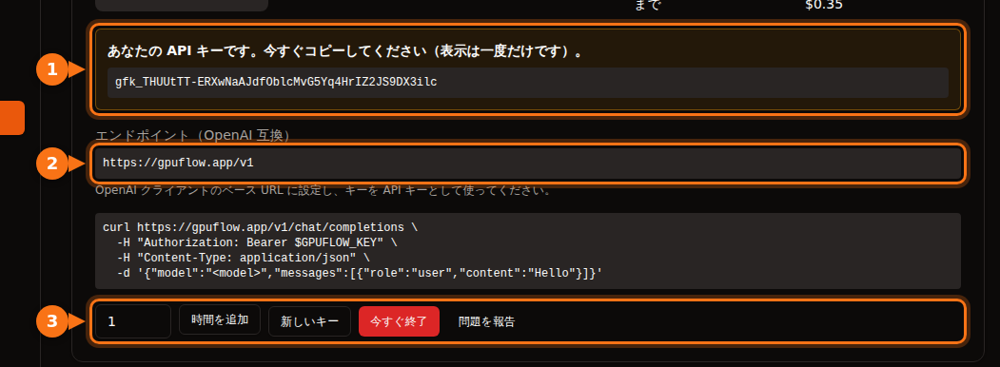

多くの AI ツールでは、OpenAI と同じ API に対応していれば、OpenAI をほかのプロバイダーに切り替えられます。必要なものはいつも同じ 3 つです。

| 項目 | 例 |
| --- | --- |
| **ベース URL**（API ベース、エンドポイント、ホストとも呼ばれます） | `https://gpuflow.app/v1` |
| **API キー** | `gfk_...` |
| **モデル名** | `qwen2.5:7b` |

この記事では GPUFlow のレンタルを例にしますが、手順は OpenAI 互換のサーバーならどれでも同じです（ローカルの Ollama や llama.cpp、vLLM、OpenRouter など）。変えるのは 3 つの値だけです。

GPUFlow では、GPU を借りたあと **ダッシュボード → 現在のレンタル** で 3 つとも確認できます。



## 始める前に：エンドポイントとモデル名を確認する

次のコマンドを 1 つ実行すれば、キーが使えるかどうかと、モデルの名前がわかります。

```bash
curl https://gpuflow.app/v1/models \
  -H "Authorization: Bearer gfk_your_key"
```

応答にモデルの一覧が表示されます。`id`（たとえば `qwen2.5:7b`）を、表示されたとおり正確にコピーしてください。アプリが動かない原因としていちばん多いのは、モデル名の間違いです。

**エンドポイントが何に対応しているかを把握しておきましょう。** GPUFlow のエンドポイントが提供しているのは `/v1/models` と `/v1/chat/completions` で、ストリーミングにも対応しています。埋め込み（embeddings）、新しい Responses API、画像生成には対応していません。アプリの機能によってはこれらが必要になるので、該当する箇所は以下で説明します。

## チャットアプリ

### Open WebUI

1. **Settings → Admin → Connections** を開きます。
2. **Manage OpenAI API Connections** で **+ (Add Connection)** をクリックします。
3. 次のように入力します。
   - **URL:** `https://gpuflow.app/v1`
   - **API Key:** あなたのキー
4. **Verify Connection** をクリックして接続をテストし（保存するだけではテストされません）、**Save** をクリックします。

Open WebUI は `/models` からモデルの一覧を自動で読み込みます。Docker で動かしている場合は、代わりに `OPENAI_API_BASE_URL` と `OPENAI_API_KEY` を設定することもできますが、これらが読み込まれるのは Open WebUI の初回起動時だけです。それ以降は管理画面で変更してください。

Open WebUI のドキュメントのアップロードと検索では、デフォルトでローカルで動く小さな埋め込みモデルが使われるので、そのまま動作します。埋め込みエンジンを OpenAI に切り替えて、その URL にチャット用のエンドポイントを指定するのは避けてください。

### LibreChat

`librechat.yaml` にカスタムエンドポイントを追加します。

```yaml
endpoints:
  custom:
    - name: "GPUFlow"
      apiKey: "${GPUFLOW_API_KEY}"
      baseURL: "https://gpuflow.app/v1"
      models:
        default: ["qwen2.5:7b"]
        fetch: true
      titleConvo: true
      titleModel: "qwen2.5:7b"
      modelDisplayLabel: "GPUFlow"
```

キーは `.env` に `GPUFLOW_API_KEY=gfk_...` として記述します。ユーザーごとに自分のキーを入力させたい場合は、`apiKey: "user_provided"` を使います。`fetch: true` にすると、LibreChat はエンドポイントからモデルの一覧を読み込みます。

LibreChat のドキュメント検索（RAG API）は、デフォルトで OpenAI の埋め込みを使います。OpenAI、Ollama、Hugging Face のいずれかのままにしておき、`RAG_OPENAI_BASEURL` をチャット専用のエンドポイントに向けないでください。

### AnythingLLM

1. LLM の設定を開き、**Generic OpenAI** を選びます。
2. **Base URL**（`https://gpuflow.app/v1`）、**API Key**、**Chat Model Name**（`qwen2.5:7b`）、**Token context window**、**Max Tokens** を入力します。

Docker の場合は、同じ設定を環境変数で指定します。

```bash
LLM_PROVIDER='generic-openai'
GENERIC_OPEN_AI_BASE_PATH='https://gpuflow.app/v1'
GENERIC_OPEN_AI_MODEL_PREF='qwen2.5:7b'
GENERIC_OPEN_AI_MODEL_TOKEN_LIMIT=32768
GENERIC_OPEN_AI_API_KEY=gfk_your_key
```

埋め込み（Embedder）は **AnythingLLM Default** のままにしておきます。

### Jan

1. **Settings → Model Providers** を開き、**Add Provider** をクリックします。
2. **OpenAI-compatible** を選びます。
3. 名前、末尾に `/v1` を付けた **Base URL**、あなたの **API key** を入力し、**Create** をクリックします。

保存すると、Jan がモデルの一覧を読み込みます。読み込まれない場合は、プロバイダーのモデル一覧にある **+** ボタンでモデル名を手動で追加してください。

## コーディングアシスタント

### Continue（VS Code と JetBrains）

`config.yaml` にモデルを追加します。

```yaml
models:
  - name: GPUFlow Qwen 2.5 7B
    provider: openai
    model: qwen2.5:7b
    apiBase: https://gpuflow.app/v1
    apiKey: ${{ secrets.GPUFLOW_API_KEY }}
    roles:
      - chat
      - edit
      - apply
```

`autocomplete` と `embed` のロールは付けないでください。このエンドポイントが提供するのはチャットだけで、埋め込みには `/v1/embeddings` が必要です。VS Code 版の Continue には、コードベース検索用の埋め込み機能が組み込まれています。JetBrains 版にはないので、別の埋め込みモデルを設定してください。

Continue のエージェントモードには、ツール呼び出しに対応したモデルが必要です。`capabilities: [tool_use]` は、使うモデルが対応していると確かな場合にだけ追加してください。

### Cline

1. Cline の設定を開きます。
2. **API Provider** を **OpenAI Compatible** にします。
3. **Base URL**、**API Key**、**Model**（`qwen2.5:7b`）を入力します。
4. **Model Configuration** で、コンテキストウィンドウを[モデルに合わせて](/ja/which-ai-models-fit-your-gpu-vram/)設定します。

**Roo Code** について補足します。ドキュメントによると、Roo Code はネイティブのツール呼び出しに対応したモデルでしか動作せず、代替手段もありません。通常のチャット用エンドポイントでは動かない可能性があります。

## コード

### OpenAI の Python / Node ライブラリ

Python（`pip install openai`）：

```python
from openai import OpenAI

client = OpenAI(base_url="https://gpuflow.app/v1", api_key="gfk_your_key")

reply = client.chat.completions.create(
    model="qwen2.5:7b",
    messages=[{"role": "user", "content": "Say hello in five languages."}],
)
print(reply.choices[0].message.content)
```

Node（`npm install openai`）：

```js
import OpenAI from "openai";

const client = new OpenAI({ baseURL: "https://gpuflow.app/v1", apiKey: "gfk_your_key" });

const reply = await client.chat.completions.create({
  model: "qwen2.5:7b",
  messages: [{ role: "user", content: "Say hello in five languages." }],
});
console.log(reply.choices[0].message.content);
```

どちらのライブラリも、環境変数の `OPENAI_BASE_URL` と `OPENAI_API_KEY` を読み込みます。なお、現在どちらの README も冒頭で `client.responses.create(...)` を紹介していますが、これは Responses API です。上の例のように `client.chat.completions.create(...)` を使ってください。

### LangChain

Python（`pip install -U langchain-openai`）：

```python
from langchain_openai import ChatOpenAI

llm = ChatOpenAI(
    model="qwen2.5:7b",
    base_url="https://gpuflow.app/v1",
    api_key="gfk_your_key",
    use_responses_api=False,
)
print(llm.invoke("Name three uses for a GPU.").content)
```

JavaScript（`npm install @langchain/openai @langchain/core`）。まず環境変数にキーを設定します（`export OPENAI_API_KEY=gfk_your_key`）。そのうえで次のように書きます。

```js
import { ChatOpenAI } from "@langchain/openai";

const llm = new ChatOpenAI({
  model: "qwen2.5:7b",
  configuration: { baseURL: "https://gpuflow.app/v1" },
});
```

LangChain は、組み込みツールや推論（reasoning）の出力など、特定の機能を使うと Responses API に切り替わります。`use_responses_api=False` を指定すれば、Chat Completions のまま使えます。

### LlamaIndex

`OpenAILike` を使います（`pip install llama-index-llms-openai-like`）。

```python
from llama_index.llms.openai_like import OpenAILike

llm = OpenAILike(
    model="qwen2.5:7b",
    api_base="https://gpuflow.app/v1",
    api_key="gfk_your_key",
    context_window=32768,
    is_chat_model=True,
    is_function_calling_model=False,
)
```

**`is_chat_model=True` を必ず設定してください。** デフォルトは `False` で、その場合リクエストは `/v1/chat/completions` ではなく `/v1/completions` に送られます。ドキュメントをインデックス化する場合は、`Settings.embed_model` に実際の埋め込みモデルを設定してください。LlamaIndex はデフォルトで OpenAI の埋め込みを使います。

## チャット専用のエンドポイントでは動かないツール

- **Codex CLI。** 2026 年初めに Chat Completions への対応を終了し、現在は Responses API しか受け付けません。
- **OpenAI Agents SDK。** デフォルトで Responses API を使います。`set_default_openai_api("chat_completions")` を呼び出すか、クライアントを `OpenAIChatCompletionsModel` でラップしてください。また、トレースには OpenAI のキーが必要なので、`set_tracing_disabled(True)` でトレースを無効にします。
- **同じエンドポイントの埋め込みを必要とするもの全般。** ドキュメント検索、「ファイルと会話」する機能、セマンティックなコード検索などです。アプリに組み込まれた埋め込み機能か、別の埋め込みプロバイダーを使ってください。

## それでも動かない場合

| 表示される内容 | よくある原因 |
| --- | --- |
| `404` または「not found」 | ベース URL に `/v1` が付いていない。または、アプリが自動で `/v1` を付けるのに自分でも付けて二重になっている。 |
| `401` または `invalid_api_key` | キーが間違っているか、レンタルが終了している。GPUFlow でキーをなくした場合は、現在のレンタルで **新しいキー** をクリックします。 |
| 「Model not found」 | モデル名が `/v1/models` の表示と完全には一致していない。 |
| `/v1/completions` や `/v1/responses` へのリクエストが失敗する | アプリが別の API を使っている。「chat model」や「chat completions」といった設定を探してください。 |

## 関連記事

- [GPU の時間貸しか、トークン課金の API か：7B〜8B モデルの実際のコスト](/ja/hourly-gpu-vs-per-token-api/)
- [GPUFlow・Vast.ai・RunPod・SaladCloud を比較：用途に合う GPU レンタルはどれか](/ja/gpuflow-vs-vast-ai-vs-runpod/)

## 出典

すべて 2026 年 9 月に確認しました。

- Open WebUI：[OpenAI 互換プロバイダー](https://docs.openwebui.com/getting-started/quick-start/connect-a-provider/starting-with-openai-compatible/)、[環境変数](https://docs.openwebui.com/reference/env-configuration)
- LibreChat：[カスタムエンドポイント](https://www.librechat.ai/docs/configuration/librechat_yaml/object_structure/custom_endpoint)、[RAG API](https://www.librechat.ai/docs/configuration/rag_api)
- AnythingLLM：[Generic OpenAI](https://docs.anythingllm.com/setup/llm-configuration/cloud/openai-generic)
- Jan：[カスタムエンドポイント](https://www.jan.ai/docs/desktop/remote-models/custom-endpoint)
- Continue：[OpenAI プロバイダー](https://docs.continue.dev/customize/model-providers/top-level/openai)、[設定リファレンス](https://docs.continue.dev/reference)
- Cline：[OpenAI Compatible](https://docs.cline.bot/provider-config/openai-compatible)、Roo Code：[OpenAI Compatible](https://roocodeinc.github.io/Roo-Code/providers/openai-compatible/)
- OpenAI ライブラリ：[openai-python](https://github.com/openai/openai-python)、[openai-node](https://github.com/openai/openai-node)
- LangChain：[Python](https://docs.langchain.com/oss/python/integrations/chat/openai)、[JavaScript](https://docs.langchain.com/oss/javascript/integrations/chat/openai)
- LlamaIndex：[OpenAILike](https://developers.llamaindex.ai/python/framework-api-reference/llms/openai_like/)
- OpenAI Agents SDK：[モデル](https://openai.github.io/openai-agents-python/models/)
- Codex と Chat Completions：[github.com/openai/codex/discussions/7782](https://github.com/openai/codex/discussions/7782)
- GPUFlow API：[API キーを使う](https://docs.gpuflow.app/ja/renters/api-quickstart/)
