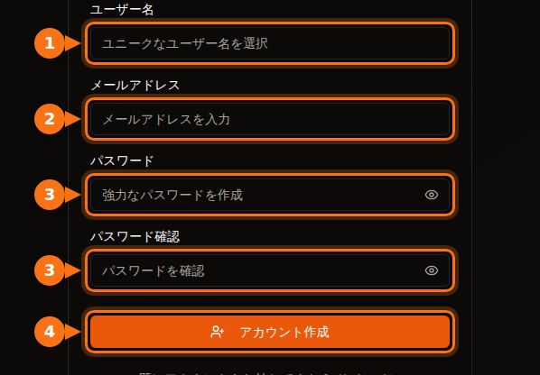
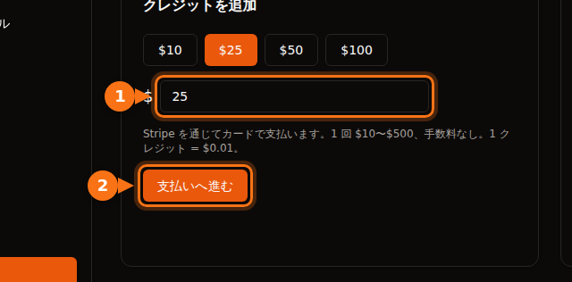

最初の GPU を借りる前に、どのサービスも何かしらの情報を求めます。メールアドレス、カード、ときには電話番号、そして大手クラウドでは数日かかることもあるクォータの申請です。この記事では各サービスが求めるものをまとめました。今日から使い始められるサービスを選ぶ参考にしてください。

内容はすべて 2026 年 9 月に各サービスのドキュメントで確認しました。出典は最後にまとめています。

## ひと目でわかる比較

| サービス | アカウント作成に必要なもの | 借りる前に必要なこと | 借り手の本人確認 | 始めるのに必要な額 |
| --- | --- | --- | --- | --- |
| **GPUFlow** | メールアドレスとパスワード、または Google か GitHub | メールアドレスの確認、カードでのクレジット追加 | 借り手の手順にはなし | $10 のチャージ、手数料なし |
| **Vast.ai** | メールアドレス | メールアドレスの確認、クレジットの追加 | ドキュメントに記載なし | $5 の入金 |
| **RunPod** | メールアドレス | クレジットの追加 | 最初の暗号資産での支払いの前のみ | 1 時間分のクレジット（プリペイドカードは 1 回あたり $100） |
| **SaladCloud** | ポータルのアカウント | 組織に支払い方法を追加 | ドキュメントに記載なし | チャージは $5 から |
| **Lambda** | アカウント | クレジットカードの追加 | ドキュメントに記載なし | カードに $10 の仮売上（返金あり） |
| **TensorDock** | アカウント | 入金 | 利用規約でアカウントの確認が認められている | 「わずか $5 から」 |
| **AWS** | メールアドレス、電話の PIN 認証、支払い方法、CAPTCHA | GPU のクォータを申請（新規アカウントは 0 から） | ほとんどのアカウントでは不要 | 従量課金 |
| **Google Cloud** | 請求先を設定したアカウント | GPU のクォータを申請（無料トライアルのアカウントには割り当てなし） | ほとんどのアカウントでは不要 | 従量課金 |

「ドキュメントに記載なし」は、そのサービスのドキュメントに借り手の本人確認の要件が見つからなかったことを示します。それでも、不審な点があれば確認を求められることはあります。

## 小規模なサービス：数日ではなく数分

Vast.ai、RunPod、SaladCloud、TensorDock、GPUFlow は、いずれも前払い制です。先にお金を入れ、それを秒単位や分単位で使っていきます。支払っていない分の請求が膨らむことはないので、これらのサービスは信用情報や会社の審査を必要としません。

違いがあるのは次の点です。

- **メールアドレスの確認。** Vast.ai と GPUFlow はどちらも、レンタルやクレジットの追加の前に確認が必要です。メールが届かない場合は、迷惑メールフォルダーを確認してください。
- **支払い方法。**
  - Vast.ai：カード、BitPay、Crypto.com。
  - RunPod：Visa、Mastercard、Amex、暗号資産、$5,000 を超える支払いには請求書払い。
  - SaladCloud：カード、または Solana 上の USDC、USDT、RENDER。
  - Lambda：主要なクレジットカードのみ（対応国のみ）。
  - GPUFlow：Stripe を通じたカード払い。
- **使わなかったお金の扱い。** SaladCloud のクレジットは購入から 12 か月で失効します。GPUFlow のクレジットに有効期限はありません。

## 大手クラウド：クォータの申請を見込んでおく

AWS と Google Cloud では、登録の時点で止められることはありません。壁になるのは GPU を使う段階です。

- **AWS：** 新規アカウントでは、「Running On-Demand G and VT instances」（NVIDIA L4 や A10G を搭載したインスタンスファミリー）のクォータが **0 vCPU** から始まります。引き上げは Service Quotas コンソールで申請します。アカウントの利用実績が積み上がると、AWS が自動でクォータを引き上げることもあります。
- **Google Cloud：** 無料トライアルのアカウントには GPU のクォータが割り当てられません。プロジェクトに請求履歴ができると、クォータの申請が認められやすくなります。クォータはリージョンごとで、プリエンプティブル GPU には別のクォータが必要です。

今日 GPU が必要なら、新しい AWS や Google Cloud のアカウントから始めるのはやめましょう。

## GPUFlow の登録手順

GPUFlow は「5 分で AI モデルを使いたい」というケースのために作られています。手に入るのは GPU 用の OpenAI 互換 API キーで、マシンではありません。

1. gpuflow.app で、ユーザー名、メールアドレス、パスワードを入力するか、Google または GitHub で **アカウントを作成** します。

   

2. **メールアドレスを確認します。** GPUFlow から届くメールのリンクをクリックします。確認が済むまで、クレジットは追加できません。
3. **ダッシュボード → 支払い** で **クレジットを追加** します。Stripe を通じてカードで $10〜$500 を追加できます。1 クレジット = $0.01 で、手数料はかかりません。

   

4. 必要な時間数を指定して **GPU を借り**、API キーをコピーします。[支払いは秒単位で](/ja/per-second-vs-hourly-gpu-billing/)、早めに終了すれば残りはクレジットに戻ります。

すべての画面を含む詳しい手順はドキュメントにあります：[GPU を借りる手順](https://docs.gpuflow.app/ja/renters/getting-started/)。

## GPU を貸し出したい場合

本人確認が必要になるのは、お金を受け取る側です。決済会社は、送金先が誰なのかを把握することが義務付けられています。

- **GPUFlow：** 出金するには、Stripe で出金用のアカウントを設定します。Stripe が本人確認を行い、銀行口座の情報を求めます。出金は米国、カナダ、英国、スイス、欧州経済領域（EEA）で利用できます。
- **Vast.ai：** ホストへの支払いは Wise、PayPal、Stripe を通じて行われ、本人確認はそれらのサービスが担当します。
- **Salad：** 報酬は PayPal、ギフトカードなどで受け取れます。

ホストとしての収益については、[ゲーミング GPU の貸し出しでいくら稼げるか](/ja/how-much-can-you-earn-renting-out-your-gpu/) で詳しく紹介しています。

## 支払う前の簡単なチェックリスト

1. **先にメールアドレスを確認します。** 支払いの段階で行き詰まらずに済みます。
2. **自分の国とカードが対応しているか確認します。** たとえば Lambda は、決められた国からの支払いしか受け付けていません。
3. **銀行の海外事務手数料を把握しておきます。** ほとんどのサービスは米ドルで請求します。[隠れたコストについて詳しくはこちら](/ja/hidden-fees-in-gpu-rental/)。
4. **少額から始めます。** まず数時間分だけ追加して試し、それから買い足しましょう。

## 関連記事

- [GPUFlow・Vast.ai・RunPod・SaladCloud を比較：用途に合う GPU レンタルはどれか](/ja/gpuflow-vs-vast-ai-vs-runpod/)
- [OpenAI 互換の API キーを Open WebUI、Continue、LangChain などで使う方法](/ja/use-openai-compatible-api-key-in-apps/)

## 出典

すべて 2026 年 9 月に確認しました。

- GPUFlow：[GPU を借りる手順](https://docs.gpuflow.app/ja/renters/getting-started/)、[クレジットと課金](https://docs.gpuflow.app/ja/renters/billing/)、[報酬の受け取り](https://docs.gpuflow.app/ja/providers/getting-paid/)
- Vast.ai：[クイックスタート](https://docs.vast.ai/guides/get-started/quickstart.md)、[課金](https://docs.vast.ai/documentation/reference/billing)、[ホストへの支払い](https://docs.vast.ai/host/payment.md)
- RunPod：[課金情報](https://docs.runpod.io/references/billing-information)
- SaladCloud：[アカウントの設定](https://docs.salad.com/general/tutorials/account-setup.md)、[課金](https://docs.salad.com/general/explanation/billing.md)
- Lambda：[請求の管理](https://docs.lambda.ai/public-cloud/manage-billing/)
- TensorDock：[クラウド GPU](https://www.tensordock.com/cloud-gpus.html)、[利用規約](https://docs.tensordock.com/legal-information/terms-of-service-tos)
- AWS：[アカウントの作成](https://docs.aws.amazon.com/accounts/latest/reference/manage-acct-creating.html)、[オンデマンドインスタンスのクォータ](https://docs.aws.amazon.com/AWSEC2/latest/UserGuide/ec2-on-demand-instances.html)
- Google Cloud：[GPU クォータのトラブルシューティング](https://docs.cloud.google.com/deep-learning-vm/docs/troubleshooting)
- Salad の報酬：[PayPal での交換](https://support.salad.com/rewards/redeeming-your-rewards/how-to-redeem-paypal/)
