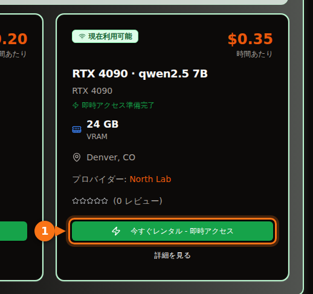

Ollama がデフォルトで配布している 4 ビット量子化なら、7B〜8B モデルは 8 GB のカード、12B〜14B モデルは 12 GB（長いプロンプトを使うなら 16 GB）、27B〜32B モデルは 24 GB のカードが必要です。70B モデルは 4 ビットでも 43 GB あるので、VRAM は 48 GB 以上が必要です。

ただ、話はそれで終わりません。必要なメモリはダウンロードサイズだけでは決まらないからです。使うコンテキストもメモリを消費します。収まりそうに見えたモデルが半分 CPU で動き、何倍も遅くなることもあります。以下では、私が使っている計算式、量子化のラベルの意味、そして現行のオープンモデルを Ollama ライブラリの実際のダウンロードサイズとともに表にまとめました。サイズと仕様は 2026 年 9 月に確認したもので、出典は最後にあります。

## VRAM 容量別の早見表

| VRAM | 主なカード | GPU だけで動くもの（4 ビット） |
| --- | --- | --- |
| 8 GB | RTX 4060、RTX 5060、RTX 3070 | 7B〜8B モデル：Llama 3.1 8B、Qwen3 8B、Mistral 7B |
| 12 GB | RTX 3060 12 GB、RTX 4070、RTX 5070 | 短いコンテキストなら 12B〜14B モデル。7B〜8B なら Q8_0 も可 |
| 16 GB | RTX 4060 Ti 16 GB、RTX 4080、RTX 5080 | 長いコンテキストの 14B、gpt-oss 20B |
| 24 GB | RTX 3090、RTX 4090 | 24B〜32B：Mistral Small 3.2、Gemma 3 27B、Qwen3 32B |
| 32 GB | RTX 5090 | 長いコンテキストの 32B、35B の Mixture-of-Experts モデル |
| 48〜80 GB | L40S（48 GB）、H100（80 GB） | 4 ビットの 70B、80 GB なら gpt-oss 120B |

カードのメモリ容量は NVIDIA の仕様ページによるものです。一部のカードには 2 種類のモデルがあります。RTX 3060 には 12 GB 版と 8 GB 版、RTX 4060 Ti と RTX 5060 Ti には 16 GB 版と 8 GB 版があります。買う、または借りるカードがどちらなのかを確認してください。

## モデルに必要な VRAM の見積もり方

モデルが回答を生成している間、GPU メモリには 3 つのものが載っています。

1. **重み。** パラメータ数 × 1 重みあたりのビット数 ÷ 8 = バイト数。
2. **KV キャッシュ。** モデルは会話中のすべてのトークンのキーとバリューを保持し、再計算しないようにしています。1 トークンあたり 2 × レイヤー数 × KV ヘッド数 × ヘッドサイズ × 2 バイト（デフォルトの 16 ビットキャッシュの場合）です。これにコンテキスト長を掛けます。
3. **オーバーヘッド。** CUDA コンテキスト、作業用バッファ、ランタイム自体の分です。私は約 1 GB を見込んでいます。エンジンや設定で変わるので、仕様ではなく経験則として扱ってください。

レイヤー数とヘッド数は、Hugging Face にある各モデルの `config.json` に書かれています。

### 計算例：16 GB カードで Qwen 2.5 14B を動かす

Qwen 2.5 14B は 147 億パラメータ、48 レイヤー、KV ヘッド 8 個、ヘッドサイズ 128（隠れ層サイズ 5,120 ÷ アテンションヘッド 40 個）です。

- **Q4_K_M での重み：** llama.cpp によると Q4_K_M は 1 重みあたり約 4.89 ビットです。147 億 × 4.89 ÷ 8 = 8.99 GB。Ollama の `qwen2.5:14b` のダウンロードサイズは 9.0 GB なので、計算と実際のファイルが一致します。
- **1 トークンあたりの KV キャッシュ：** 2 × 48 × 8 × 128 × 2 バイト = 196,608 バイト、約 0.2 MB。
- **コンテキスト全体の KV キャッシュ：** 4,096 トークンで 0.8 GB、16,384 トークンで 3.2 GB、32,768 トークンで 6.4 GB。
- **合計：** 4K コンテキストで 9.0 + 0.8 + 1 = 10.8 GB。16K で 9.0 + 3.2 + 1 = 13.2 GB。32K では 9.0 + 6.4 + 1 = 16.4 GB となり、16 GB のカードにはもう収まりません。

<figure>
<svg viewBox="0 0 720 340" role="img" aria-labelledby="d1-title" xmlns="http://www.w3.org/2000/svg" font-family="system-ui, sans-serif" font-size="15">
<title id="d1-title">16 GB カードで Qwen 2.5 14B（Q4_K_M）を動かすときの VRAM の内訳：重み、3 種類のコンテキスト長での KV キャッシュ、オーバーヘッド</title>
<rect x="0" y="0" width="720" height="340" fill="#ffffff"/>
<rect x="150" y="20" width="16" height="16" rx="3" fill="#6366f1"/>
<text x="172" y="33" fill="#1e1b4b">重み 9.0 GB</text>
<rect x="330" y="20" width="16" height="16" rx="3" fill="#a5b4fc"/>
<text x="352" y="33" fill="#1e1b4b">KV キャッシュ</text>
<rect x="510" y="20" width="16" height="16" rx="3" fill="#e2e8f0"/>
<text x="532" y="33" fill="#1e1b4b">オーバーヘッド 約 1 GB</text>
<line x1="582.0" y1="66" x2="582.0" y2="278" stroke="#f97316" stroke-width="2" stroke-dasharray="5 4"/>
<text x="576.0" y="60" text-anchor="end" fill="#f97316" font-weight="600">16 GB カード</text>
<text x="140" y="106" text-anchor="end" fill="#1e1b4b" font-size="13">4K コンテキスト</text>
<rect x="150" y="80" width="243.0" height="40" fill="#6366f1"/>
<text x="271.5" y="106" text-anchor="middle" fill="#ffffff">重み</text>
<rect x="393.0" y="80" width="21.6" height="40" fill="#a5b4fc"/>
<rect x="414.6" y="80" width="27.0" height="40" fill="#e2e8f0"/>
<text x="449.6" y="106" fill="#16a34a" font-weight="600">10.8 GB</text>
<text x="140" y="180" text-anchor="end" fill="#1e1b4b" font-size="13">16K コンテキスト</text>
<rect x="150" y="154" width="243.0" height="40" fill="#6366f1"/>
<text x="271.5" y="180" text-anchor="middle" fill="#ffffff">重み</text>
<rect x="393.0" y="154" width="86.4" height="40" fill="#a5b4fc"/>
<text x="436.2" y="180" text-anchor="middle" fill="#1e1b4b">3.2</text>
<rect x="479.4" y="154" width="27.0" height="40" fill="#e2e8f0"/>
<text x="514.4" y="180" fill="#16a34a" font-weight="600">13.2 GB</text>
<text x="140" y="254" text-anchor="end" fill="#1e1b4b" font-size="13">32K コンテキスト</text>
<rect x="150" y="228" width="243.0" height="40" fill="#6366f1"/>
<text x="271.5" y="254" text-anchor="middle" fill="#ffffff">重み</text>
<rect x="393.0" y="228" width="172.8" height="40" fill="#a5b4fc"/>
<text x="479.4" y="254" text-anchor="middle" fill="#1e1b4b">6.4</text>
<rect x="565.8" y="228" width="27.0" height="40" fill="#e2e8f0"/>
<text x="600.8" y="254" fill="#f97316" font-weight="600">16.4 GB</text>
<line x1="150" y1="278" x2="690" y2="278" stroke="#64748b"/>
<line x1="150.0" y1="278" x2="150.0" y2="283" stroke="#64748b"/>
<text x="150.0" y="300" text-anchor="middle" fill="#64748b">0</text>
<line x1="258.0" y1="278" x2="258.0" y2="283" stroke="#64748b"/>
<text x="258.0" y="300" text-anchor="middle" fill="#64748b">4</text>
<line x1="366.0" y1="278" x2="366.0" y2="283" stroke="#64748b"/>
<text x="366.0" y="300" text-anchor="middle" fill="#64748b">8</text>
<line x1="474.0" y1="278" x2="474.0" y2="283" stroke="#64748b"/>
<text x="474.0" y="300" text-anchor="middle" fill="#64748b">12</text>
<line x1="582.0" y1="278" x2="582.0" y2="283" stroke="#64748b"/>
<text x="582.0" y="300" text-anchor="middle" fill="#64748b">16</text>
<line x1="690.0" y1="278" x2="690.0" y2="283" stroke="#64748b"/>
<text x="690.0" y="300" text-anchor="middle" fill="#64748b">20</text>
<text x="420.0" y="326" text-anchor="middle" fill="#64748b">VRAM（GB）</text>
</svg>
<figcaption>16 GB カードで動かす Qwen 2.5 14B（Q4_K_M）。重みは 9.0 GB のままですが、KV キャッシュはコンテキストとともに大きくなり、32K トークンで合計が 16 GB を超えます。オーバーヘッドは経験則の 1 GB としています。</figcaption>
</figure>

ここから 2 つのことがわかります。1 つ目は、設定するコンテキストがモデル本体と同じくらいのメモリを食う場合があることです。Llama 3.1 8B（32 レイヤー、KV ヘッド 8 個、ヘッドサイズ 128）は 1 トークンあたり 131,072 バイトの KV キャッシュを使うので、128K のコンテキストを目いっぱい使うとキャッシュだけで 17.2 GB になります。ダウンロードサイズ 4.9 GB の約 3.5 倍です。2 つ目は、1 トークンあたりの KV キャッシュのサイズがモデルによって大きく違うことです。Qwen 2.5 7B は KV ヘッドが 4 個、レイヤーが 28 しかないので、1 トークンあたり 57,344 バイトで済みます。Llama 3.1 8B の半分以下です。思い込みで決めずに config を確認してください。

### Ollama はコンテキストをデフォルトでどう決めるか

Ollama は、検出した VRAM に応じてデフォルトのコンテキスト長を選びます。24 GiB 未満なら 4K トークン、24〜48 GiB なら 32K トークン、48 GiB 以上なら 256K です。環境変数 `OLLAMA_CONTEXT_LENGTH` で変更でき、実際に割り当てられたコンテキストは `ollama ps` の CONTEXT 列に表示されます。計算を変える設定はほかに 2 つあります。

- `OLLAMA_NUM_PARALLEL`（デフォルトは 1）：Ollama のドキュメントによると、並列リクエストを有効にすると、コンテキストサイズが並列数の分だけ増えます。並列スロットが 4 つなら、KV キャッシュは 4 倍です。
- `OLLAMA_KV_CACHE_TYPE`：`q8_0` はデフォルトの `f16` キャッシュの約半分、`q4_0` は約 4 分の 1 のメモリで済みます。Flash Attention を有効にする必要があります。

## 量子化レベルの意味

オープンモデルは 16 ビット精度で公開されています（下にリンクした config には bfloat16 と書かれています）。1 パラメータあたり 2 バイトです。量子化は、重みをより少ないビット数で保存する方法です。Ollama と llama.cpp が使う GGUF ファイルでは、ラベルはおおよそ次の意味です。

| ラベル | 1 重みあたりのビット数 | Llama 3.1 8B のサイズ | Llama 3 8B のパープレキシティ（低いほど良い） |
| --- | --- | --- | --- |
| F16 | 16.0 | 14.96 GiB | 6.233 |
| Q8_0 | 8.50 | 7.95 GiB | 6.234 |
| Q6_K | 6.56 | 6.14 GiB | 6.253 |
| Q5_K_M | 5.70 | 5.33 GiB | 6.289 |
| Q4_K_M | 4.89 | 4.58 GiB | 6.407 |
| Q3_K_M | 4.00 | 3.74 GiB | 6.888 |
| Q2_K_S / Q2_K | 2.97 | 2.78 GiB | 9.752（Q2_K） |

ビット数とサイズは llama.cpp の quantize README（Llama 3.1 8B）、パープレキシティは llama.cpp の perplexity README（Llama 3 8B、Wikitext）によるものです。「K」の付いた形式は llama.cpp の k-quant で、モデル内で精度を混在させています。`_S`、`_M`、`_L` はその組み合わせの小・中・大です。

数字からわかること：Q8_0 は実質的に劣化なしです（パープレキシティ 6.234 対 6.233）。Q4_K_M ではパープレキシティが約 3% 悪化します。同じ README によると、次に来る可能性が最も高いトークンが元の精度のモデルと一致する割合は 91.9% です。Q3 でははっきり悪くなり、Q2 では使い物になりません。

パープレキシティは実用上の性能と同じではありません。そこで参考になるのが、Uygar Kurt による 2026 年 1 月の研究です。Llama 3.1 8B Instruct を llama.cpp の各レベルで、推論、知識、指示追従、真実性のベンチマークにかけています。単純平均は F16 で 69.47、Q8_0 で 69.41、Q5_K_M で 69.36、Q4_K_M で 69.15 でした。Ollama を含めほぼ全員が Q4_K_M をデフォルトにしているのはこのためです。ファイルは FP16 の 3 分の 1 未満になり、失うものに気づくことはまずありません。Ollama では、タグ名だけを指定するとこの 4 ビット版になります。`qwen3:8b` と `qwen3:8b-q4_K_M` はどちらも 5.2 GB、`phi4:14b` と `phi4:14b-q4_K_M` はどちらも 9.1 GB です。

私のルールはこうです。小さいモデルを Q8_0 で使う前に、Q4_K_M で収まる最大のモデルを選びます。Q4 の 14B はたいてい Q8 の 7B より優秀で、ファイルサイズはほぼ同じです。メモリに余裕があり、コードや厳密な抽出のように小さな誤りが問題になる作業なら、Q5 や Q8 にします。

Ollama の新しいタグには、`qat`（Gemma の量子化を考慮した学習版）、`nvfp4`、`mxfp8` といった形式もあります。gpt-oss は OpenAI 自身が MXFP4 で配布しており、Mixture-of-Experts の重みは 1 パラメータあたり 4.25 ビットです。

## どのモデルが収まるか：サイズと VRAM の区分

次の表は、2026 年 9 月時点の Ollama ライブラリにある現行のオープンモデルと、そのダウンロードサイズです。「4 ビット」の列はデフォルトタグのサイズです。ほとんどのモデルでは `q4_K_M` タグと同じファイルですが、デフォルトが別のビルドの場合は両方のサイズを載せています（Mistral Nemo のデフォルトは 7.1 GB、`q4_K_M` は 7.5 GB）。「最小のカード」は、モデルに約 1 GB のオーバーヘッドと 4K〜8K のコンテキストを加えて、すべて GPU に収まるサイズです。長いコンテキストを使いたいなら、1 段上を選んでください。

| モデル | Ollama タグ | 4 ビットのサイズ | Q8_0 のサイズ | 最小のカード（4 ビット / Q8_0） |
| --- | --- | --- | --- | --- |
| Mistral 7B v0.3 | [`mistral:7b`](https://ollama.com/library/mistral/tags) | 4.4 GB | 7.7 GB | 8 GB / 12 GB |
| Qwen 2.5 7B | [`qwen2.5:7b`](https://ollama.com/library/qwen2.5/tags) | 4.7 GB | 8.1 GB | 8 GB / 12 GB |
| DeepSeek-R1 蒸留 7B（Qwen 2.5） | [`deepseek-r1:7b`](https://ollama.com/library/deepseek-r1/tags) | 4.7 GB | 未確認 | 8 GB |
| Llama 3.1 8B | [`llama3.1:8b`](https://ollama.com/library/llama3.1/tags) | 4.9 GB | 8.5 GB | 8 GB / 12 GB |
| Qwen3 8B | [`qwen3:8b`](https://ollama.com/library/qwen3/tags) | 5.2 GB | 8.9 GB | 8 GB / 12 GB |
| DeepSeek-R1-0528（Qwen3 8B） | [`deepseek-r1:8b`](https://ollama.com/library/deepseek-r1/tags) | 5.2 GB | 未確認 | 8 GB |
| Qwen3.5 9B | [`qwen3.5:9b`](https://ollama.com/library/qwen3.5/tags) | 6.6 GB | 11 GB | 8 GB（短いコンテキストのみ）/ 16 GB |
| Mistral Nemo 12B | [`mistral-nemo:12b`](https://ollama.com/library/mistral-nemo/tags) | 7.1 GB（q4_K_M：7.5 GB） | 13 GB | 12 GB / 16 GB |
| Gemma 4 12B | [`gemma4:12b`](https://ollama.com/library/gemma4/tags) | 7.6 GB | 13 GB | 12 GB / 16 GB |
| Gemma 3 12B | [`gemma3:12b`](https://ollama.com/library/gemma3/tags) | 8.1 GB | 13 GB | 12 GB / 16 GB |
| Qwen 2.5 14B | [`qwen2.5:14b`](https://ollama.com/library/qwen2.5/tags) | 9.0 GB | 16 GB | 12 GB / 24 GB |
| DeepSeek-R1 蒸留 14B（Qwen 2.5） | [`deepseek-r1:14b`](https://ollama.com/library/deepseek-r1/tags) | 9.0 GB | 未確認 | 12 GB |
| Phi-4 14B | [`phi4:14b`](https://ollama.com/library/phi4/tags) | 9.1 GB | 16 GB | 12 GB / 24 GB |
| Qwen3 14B | [`qwen3:14b`](https://ollama.com/library/qwen3/tags) | 9.3 GB | 16 GB | 12 GB / 24 GB |
| gpt-oss 20B（MoE） | [`gpt-oss:20b`](https://ollama.com/library/gpt-oss/tags) | 14 GB（MXFP4） | なし | 16 GB |
| Mistral Small 3.2 24B | [`mistral-small3.2:24b`](https://ollama.com/library/mistral-small3.2/tags) | 15 GB | 26 GB | 24 GB / 32 GB |
| Gemma 3 27B | [`gemma3:27b`](https://ollama.com/library/gemma3/tags) | 17 GB | 30 GB | 24 GB / 48 GB |
| Qwen3.5 27B | [`qwen3.5:27b`](https://ollama.com/library/qwen3.5/tags) | 17 GB | 30 GB | 24 GB / 48 GB |
| Qwen3.6 27B | [`qwen3.6:27b`](https://ollama.com/library/qwen3.6/tags) | 18 GB（q4_K_M：17 GB） | 30 GB | 24 GB / 48 GB |
| Gemma 4 26B（MoE、アクティブ 3.8B） | [`gemma4:26b`](https://ollama.com/library/gemma4/tags) | 19 GB（q4_K_M：18 GB） | 28 GB | 24 GB / 32 GB |
| Qwen3 30B-A3B（MoE） | [`qwen3:30b`](https://ollama.com/library/qwen3/tags) | 19 GB | 未確認 | 24 GB |
| Gemma 4 31B | [`gemma4:31b`](https://ollama.com/library/gemma4/tags) | 20 GB | 34 GB | 24 GB / 48 GB |
| Qwen3 32B | [`qwen3:32b`](https://ollama.com/library/qwen3/tags) | 20 GB | 35 GB | 24 GB / 48 GB |
| Qwen 2.5 32B | [`qwen2.5:32b`](https://ollama.com/library/qwen2.5/tags) | 20 GB | 35 GB | 24 GB / 48 GB |
| DeepSeek-R1 蒸留 32B（Qwen 2.5） | [`deepseek-r1:32b`](https://ollama.com/library/deepseek-r1/tags) | 20 GB | 未確認 | 24 GB |
| Qwen3.6 35B-A3B（MoE） | [`qwen3.6:35b`](https://ollama.com/library/qwen3.6/tags) | 23 GB（q4_K_M：24 GB） | 39 GB | 32 GB / 48 GB |
| Qwen3.5 35B-A3B（MoE） | [`qwen3.5:35b`](https://ollama.com/library/qwen3.5/tags) | 24 GB | 39 GB | 32 GB / 48 GB |
| Llama 3.3 70B | [`llama3.3:70b`](https://ollama.com/library/llama3.3/tags) | 43 GB | 75 GB | 48 GB（ぎりぎり）/ 80 GB（ぎりぎり） |
| Qwen 2.5 72B | [`qwen2.5:72b`](https://ollama.com/library/qwen2.5/tags) | 47 GB | 未確認 | 80 GB |
| gpt-oss 120B（MoE） | [`gpt-oss:120b`](https://ollama.com/library/gpt-oss/tags) | 65 GB（MXFP4） | なし | 80 GB |

区分の判定にはデフォルトタグのサイズを使いました。短い名前で `ollama pull` したときにダウンロードされるのがそのファイルだからです。

24 GB と 32 GB のカードの区分には落とし穴があります。Ollama のデフォルトのコンテキストは 24 GiB を境に 4K から 32K に跳ね上がるので、RTX 4090 で 20 GB のモデルを動かすと、隣に収まらない 32K のキャッシュが割り当てられることがあります。`ollama ps` に CPU の割合が表示されたら、コンテキストを小さくしてください。また、名前の数字でモデルを判断しないでください。Gemma 4 のエッジ向けモデル `gemma4:e4b`（実効パラメータ 4.5B）は 9.6 GB あり、7.6 GB の `gemma4:12b` より大きいのです。サイズを確認してください。

<figure>
<svg viewBox="0 0 720 546" role="img" aria-labelledby="d2-title" xmlns="http://www.w3.org/2000/svg" font-family="system-ui, sans-serif" font-size="14">
<title id="d2-title">人気の Ollama モデルのデフォルト 4 ビット量子化でのダウンロードサイズと、VRAM 8・12・16・24・32 GB との比較</title>
<rect x="0" y="0" width="720" height="546" fill="#ffffff"/>
<line x1="320.0" y1="58" x2="320.0" y2="486" stroke="#f97316" stroke-width="2" stroke-dasharray="5 4"/>
<text x="320.0" y="50" text-anchor="middle" fill="#f97316" font-weight="600">8 GB</text>
<line x1="380.0" y1="58" x2="380.0" y2="486" stroke="#f97316" stroke-width="2" stroke-dasharray="5 4"/>
<text x="380.0" y="50" text-anchor="middle" fill="#f97316" font-weight="600">12 GB</text>
<line x1="440.0" y1="58" x2="440.0" y2="486" stroke="#f97316" stroke-width="2" stroke-dasharray="5 4"/>
<text x="440.0" y="50" text-anchor="middle" fill="#f97316" font-weight="600">16 GB</text>
<line x1="560.0" y1="58" x2="560.0" y2="486" stroke="#f97316" stroke-width="2" stroke-dasharray="5 4"/>
<text x="560.0" y="50" text-anchor="middle" fill="#f97316" font-weight="600">24 GB</text>
<line x1="680.0" y1="58" x2="680.0" y2="486" stroke="#f97316" stroke-width="2" stroke-dasharray="5 4"/>
<text x="680.0" y="50" text-anchor="middle" fill="#f97316" font-weight="600">32 GB</text>
<text x="20" y="50" fill="#64748b">VRAM の区分</text>
<text x="190" y="84" text-anchor="end" fill="#1e1b4b">mistral:7b</text>
<rect x="200" y="70" width="66.0" height="18" rx="3" fill="#6366f1"/>
<text x="272.0" y="84" fill="#1e1b4b">4.4</text>
<text x="190" y="110" text-anchor="end" fill="#1e1b4b">qwen2.5:7b</text>
<rect x="200" y="96" width="70.5" height="18" rx="3" fill="#6366f1"/>
<text x="276.5" y="110" fill="#1e1b4b">4.7</text>
<text x="190" y="136" text-anchor="end" fill="#1e1b4b">llama3.1:8b</text>
<rect x="200" y="122" width="73.5" height="18" rx="3" fill="#6366f1"/>
<text x="279.5" y="136" fill="#1e1b4b">4.9</text>
<text x="190" y="162" text-anchor="end" fill="#1e1b4b">qwen3:8b</text>
<rect x="200" y="148" width="78.0" height="18" rx="3" fill="#6366f1"/>
<text x="284.0" y="162" fill="#1e1b4b">5.2</text>
<text x="190" y="188" text-anchor="end" fill="#1e1b4b">qwen3.5:9b</text>
<rect x="200" y="174" width="99.0" height="18" rx="3" fill="#6366f1"/>
<text x="297.0" y="188" text-anchor="end" fill="#ffffff">6.6</text>
<text x="190" y="214" text-anchor="end" fill="#1e1b4b">gemma4:12b</text>
<rect x="200" y="200" width="114.0" height="18" rx="3" fill="#6366f1"/>
<text x="324.0" y="214" fill="#1e1b4b">7.6</text>
<text x="190" y="240" text-anchor="end" fill="#1e1b4b">gemma3:12b</text>
<rect x="200" y="226" width="121.5" height="18" rx="3" fill="#6366f1"/>
<text x="327.5" y="240" fill="#1e1b4b">8.1</text>
<text x="190" y="266" text-anchor="end" fill="#1e1b4b">qwen2.5:14b</text>
<rect x="200" y="252" width="135.0" height="18" rx="3" fill="#6366f1"/>
<text x="341.0" y="266" fill="#1e1b4b">9.0</text>
<text x="190" y="292" text-anchor="end" fill="#1e1b4b">qwen3:14b</text>
<rect x="200" y="278" width="139.5" height="18" rx="3" fill="#6366f1"/>
<text x="345.5" y="292" fill="#1e1b4b">9.3</text>
<text x="190" y="318" text-anchor="end" fill="#1e1b4b">gpt-oss:20b</text>
<rect x="200" y="304" width="210.0" height="18" rx="3" fill="#6366f1"/>
<text x="416.0" y="318" fill="#1e1b4b">14</text>
<text x="190" y="344" text-anchor="end" fill="#1e1b4b">mistral-small3.2:24b</text>
<rect x="200" y="330" width="225.0" height="18" rx="3" fill="#6366f1"/>
<text x="423.0" y="344" text-anchor="end" fill="#ffffff">15</text>
<text x="190" y="370" text-anchor="end" fill="#1e1b4b">gemma3:27b</text>
<rect x="200" y="356" width="255.0" height="18" rx="3" fill="#6366f1"/>
<text x="461.0" y="370" fill="#1e1b4b">17</text>
<text x="190" y="396" text-anchor="end" fill="#1e1b4b">qwen3.5:27b</text>
<rect x="200" y="382" width="255.0" height="18" rx="3" fill="#6366f1"/>
<text x="461.0" y="396" fill="#1e1b4b">17</text>
<text x="190" y="422" text-anchor="end" fill="#1e1b4b">gemma4:31b</text>
<rect x="200" y="408" width="300.0" height="18" rx="3" fill="#6366f1"/>
<text x="506.0" y="422" fill="#1e1b4b">20</text>
<text x="190" y="448" text-anchor="end" fill="#1e1b4b">qwen3:32b</text>
<rect x="200" y="434" width="300.0" height="18" rx="3" fill="#6366f1"/>
<text x="506.0" y="448" fill="#1e1b4b">20</text>
<text x="190" y="474" text-anchor="end" fill="#1e1b4b">qwen3.6:35b</text>
<rect x="200" y="460" width="345.0" height="18" rx="3" fill="#6366f1"/>
<text x="539.0" y="474" text-anchor="end" fill="#ffffff">23</text>
<line x1="200" y1="486" x2="680" y2="486" stroke="#64748b" stroke-width="1"/>
<line x1="200.0" y1="486" x2="200.0" y2="491" stroke="#64748b"/>
<text x="200.0" y="506" text-anchor="middle" fill="#64748b">0</text>
<line x1="260.0" y1="486" x2="260.0" y2="491" stroke="#64748b"/>
<text x="260.0" y="506" text-anchor="middle" fill="#64748b">4</text>
<line x1="320.0" y1="486" x2="320.0" y2="491" stroke="#64748b"/>
<text x="320.0" y="506" text-anchor="middle" fill="#64748b">8</text>
<line x1="380.0" y1="486" x2="380.0" y2="491" stroke="#64748b"/>
<text x="380.0" y="506" text-anchor="middle" fill="#64748b">12</text>
<line x1="440.0" y1="486" x2="440.0" y2="491" stroke="#64748b"/>
<text x="440.0" y="506" text-anchor="middle" fill="#64748b">16</text>
<line x1="500.0" y1="486" x2="500.0" y2="491" stroke="#64748b"/>
<text x="500.0" y="506" text-anchor="middle" fill="#64748b">20</text>
<line x1="560.0" y1="486" x2="560.0" y2="491" stroke="#64748b"/>
<text x="560.0" y="506" text-anchor="middle" fill="#64748b">24</text>
<line x1="620.0" y1="486" x2="620.0" y2="491" stroke="#64748b"/>
<text x="620.0" y="506" text-anchor="middle" fill="#64748b">28</text>
<line x1="680.0" y1="486" x2="680.0" y2="491" stroke="#64748b"/>
<text x="680.0" y="506" text-anchor="middle" fill="#64748b">32</text>
<text x="440.0" y="530" text-anchor="middle" fill="#64748b">ダウンロードサイズ（GB、Ollama のデフォルトタグ、4 ビット）</text>
</svg>
<figcaption>Ollama のデフォルト 4 ビットタグのダウンロードサイズを、一般的な VRAM 容量と同じ縮尺で描いたものです。収まるには、バーが線よりかなり手前で終わっている必要があります。オーバーヘッドに約 1 GB、さらに KV キャッシュの分を残してください。</figcaption>
</figure>

## Mixture-of-Experts モデルでは事情が少し変わる

gpt-oss、Gemma 4 26B、Qwen の「A3B」モデルは Mixture-of-Experts（MoE）モデルです。1 トークンごとに動くのは一部のエキスパートだけで、Gemma 4 26B はパラメータ 25.2B のうちアクティブなのは 3.8B です。メモリのルールは変わりません。重みはすべてどこかに読み込む必要があるからです。変わるのは、全部が収まらないときの速度です。各トークンが触れるのは重みの一部だけなので、システム RAM にはみ出した MoE モデルは、同じサイズの密モデルよりずっと遅くなりにくいのです。その差がどれほどかは、次の節の測定結果でわかります。

## モデルが収まらないとどうなるか

Ollama は、大きすぎるモデルの読み込みを拒否しません。収まるだけのレイヤーを GPU に載せ、残りはシステム RAM から CPU で実行します。どちらの状態かは `ollama ps` でわかります。`100% GPU` ならすべて収まっており、`100% CPU` なら何も収まっていません。`48%/52% CPU/GPU` のような表示は分割されている状態です。

分割されると大きな代償があります。トークンを 1 つ生成するたびにアクティブな重みをすべて読む必要があり、システム RAM は VRAM よりはるかに遅いからです。Rost が 2026 年 4 月に DEV Community で公開した、16 GB の RTX 4080 での llama.cpp の測定結果がそれをよく示しています。

| モデル（量子化、ファイルサイズ） | コンテキスト | GPU / CPU 負荷 | 毎秒トークン数 |
| --- | --- | --- | --- |
| Qwen3.5 27B 密モデル（IQ3_XXS、11.5 GB） | 32K | 98% / 100% | 45.1 |
| Qwen3.5 27B 密モデル | 64K | 45% / 410% | 22.7 |
| Qwen3.5 27B 密モデル | 128K | 16% / 625% | 9.6 |
| Qwen3.5 35B-A3B MoE（IQ3_S、13.6 GB） | 64K | 88% / 115% | 136.8 |
| Qwen3.5 122B-A10B MoE（IQ3_XXS、44.7 GB） | 32K | 30% / 480% | 21.8 |

CPU の数値が高く GPU の数値が低ければ、処理の大半が CPU に移ったということです。著者も同じように読んでいます。

同じ密モデルが、コンテキストを 32K から 64K にしただけで速度が半分になりました。KV キャッシュが大きくなってレイヤーが GPU から押し出されたためで、128K では 80% 近く遅くなっています。一方、122B の MoE モデルは 16 GB のカードに 44.7 GB のファイルを載せていながら、毎秒約 22 トークンで動きました。1 トークンあたりのアクティブなパラメータが 10B だけだからです。密モデルでは「一部が CPU」は「何倍も遅い」と考えてください。MoE モデルなら、許容できるトレードオフになることもあります。

分割が起きたときの対処は、手軽なものから順に次のとおりです。コンテキストを小さくする、KV キャッシュを `q8_0` に量子化する、同じモデルのより小さい量子化を選ぶ（Q5 ではなく Q4_K_M）、より小さいモデルを選ぶ、メモリの多いカードに移る。

## 32 GB カードとデータセンター向けカード

RTX 5090 は 32 GB です。これなら 4 ビットの 32B モデルを長いコンテキストで動かせますし、23〜24 GB の 35B-A3B MoE モデルもキャッシュの余裕を持って載せられます。70B には届きません。`llama3.3:70b` は 4 ビットでも 43 GB あります。

70B には 48 GB 以上が必要です。L40S は 48 GB で、43 GB のファイルは収まりますが、コンテキストの余裕はほとんどありません。H100 SXM は 80 GB（H100 NVL は 94 GB）で、4 ビットの Llama 3.3 70B を長いコンテキストで、gpt-oss 120B（65 GB。Ollama のページには 80 GB の GPU 1 枚に収まると書かれています）を、あるいは Q8_0 の Llama 3.3 70B（75 GB）を短いコンテキストで動かせます。81 GB の Qwen3.5 122B は、80 GB のカード 1 枚ではもう収まりません。

## 買わずに借りる場合：GPUFlow の出品の確認方法

GPUFlow で GPU を借りる場合、モデルはプロバイダーが自分のマシンで提供し（GPUFlow のインストーラーがデフォルトで設定する Ollama を使います）、どのモデルを入れるかもプロバイダーが決めます。自分でモデルを pull することはありません。受け取るのはその GPU 用の OpenAI 互換 API キーで、シェルではありません。GPUFlow のインストーラーはデフォルトで `qwen2.5:7b` を使い、インストーラーとドキュメントに出てくるタグは `qwen2.5:0.5b`、`deepseek-r1:1.5b`、`qwen2.5:7b`、`deepseek-r1:7b`、`llama3.1:8b`、`qwen2.5:14b` です。プロバイダーはほかのモデルもインストールできます。

[マーケットプレイス](https://gpuflow.app/ja/marketplace)の各カードには、GPU、その VRAM、1 時間あたりの料金が表示され、提供するモデルはプロバイダーの説明文に書かれています。GPUFlow のドキュメントには、同じルールを少し慎重にしたものが載っています。7B モデルは 8 GB 以上、14B モデルは 16 GB 以上で快適に動く、というものです。キーを受け取ったら、`GET /v1/models` はモデル名を 1 つ返します。説明文にほかのモデルも書かれていれば、その名前も `model` フィールドに指定できます。

知っておくべきことが 2 つあります。GPUFlow は独自のコンテキスト上限を設けていないので、プロバイダーが変更していない限り、プロバイダーのマシンの Ollama のデフォルトが適用されます。また、プロバイダーがインストールしていないモデルは使えません。出品は、まず必要なモデルで選び、GPU はその次に選んでください。[Open WebUI、Continue、LangChain へのキーの接続](/ja/use-openai-compatible-api-key-in-apps/)は、ほかの OpenAI 形式の API と同じ手順です。

## 関連記事

- [OpenAI 互換の API キーを Open WebUI、Continue、LangChain などで使う方法](/ja/use-openai-compatible-api-key-in-apps/)
- [GPU の時間貸しか、トークン課金の API か：7B〜8B モデルの実際のコスト](/ja/hourly-gpu-vs-per-token-api/)
- [Ollama vs vLLM vs TGI：RTX 4090 での推論ベンチマーク](/ja/ollama-vs-vllm-vs-tgi-rtx-4090-benchmark/)
- [GPU レンタル料金比較 2026](/ja/gpu-rental-pricing-comparison-2026/)

## 出典

すべて 2026 年 9 月に確認しました。

- Ollama ライブラリのダウンロードサイズ：[mistral](https://ollama.com/library/mistral/tags)、[qwen2.5](https://ollama.com/library/qwen2.5/tags)、[qwen3](https://ollama.com/library/qwen3/tags)、[qwen3.5](https://ollama.com/library/qwen3.5/tags)、[qwen3.6](https://ollama.com/library/qwen3.6/tags)、[llama3.1](https://ollama.com/library/llama3.1/tags)、[llama3.3](https://ollama.com/library/llama3.3/tags)、[deepseek-r1](https://ollama.com/library/deepseek-r1/tags)、[DeepSeek-R1 のモデルページ（蒸留元のモデル）](https://ollama.com/library/deepseek-r1)、[gemma3](https://ollama.com/library/gemma3/tags)、[gemma4](https://ollama.com/library/gemma4/tags)、[Gemma 4 のモデルページ（MoE とアクティブパラメータ）](https://ollama.com/library/gemma4)、[mistral-nemo](https://ollama.com/library/mistral-nemo/tags)、[mistral-small3.2](https://ollama.com/library/mistral-small3.2/tags)、[phi4](https://ollama.com/library/phi4/tags)、[gpt-oss](https://ollama.com/library/gpt-oss/tags)、[gpt-oss のモデルページ（MXFP4、メモリ）](https://ollama.com/library/gpt-oss)、[Ollama ライブラリの一覧](https://ollama.com/library)
- モデルの構造：[Qwen2.5-14B-Instruct のモデルカード](https://huggingface.co/Qwen/Qwen2.5-14B-Instruct)、[Qwen2.5-14B-Instruct の config.json](https://huggingface.co/Qwen/Qwen2.5-14B-Instruct/blob/main/config.json)、[Qwen2.5-7B-Instruct の config.json](https://huggingface.co/Qwen/Qwen2.5-7B-Instruct/blob/main/config.json)、[Llama-3.1-8B-Instruct の config.json（unsloth のミラー）](https://huggingface.co/unsloth/Llama-3.1-8B-Instruct/blob/main/config.json)
- Ollama のコンテキストとメモリの設定：[Ollama ドキュメント「Context length」](https://docs.ollama.com/context-length)、[Ollama FAQ](https://docs.ollama.com/faq)
- 量子化のサイズとビット数：[llama.cpp quantize README](https://github.com/ggml-org/llama.cpp/blob/master/tools/quantize/README.md)
- 量子化のパープレキシティ：[llama.cpp perplexity README](https://github.com/ggml-org/llama.cpp/blob/master/tools/perplexity/README.md)
- 量子化のベンチマーク研究：[Uygar Kurt「Which Quantization Should I Use?」（arXiv 2601.14277）](https://arxiv.org/abs/2601.14277)
- CPU オフロードの測定：[Rost「16 GB VRAM LLM benchmarks with llama.cpp」（DEV Community、2026 年 4 月）](https://dev.to/rosgluk/16-gb-vram-llm-benchmarks-with-llamacpp-speed-and-context-3hgg)
- GPU のメモリ容量：[NVIDIA RTX 50 シリーズの比較](https://www.nvidia.com/en-us/geforce/graphics-cards/compare/)、[RTX 40 シリーズ](https://www.nvidia.com/en-us/geforce/graphics-cards/40-series/)、[RTX 30 シリーズ](https://www.nvidia.com/en-us/geforce/graphics-cards/30-series/)、[L40S](https://www.nvidia.com/en-us/data-center/l40s/)、[H100](https://www.nvidia.com/en-us/data-center/h100/)
- GPUFlow：[GPU を借りる手順](https://docs.gpuflow.app/ja/renters/getting-started/)、[API クイックスタート](https://docs.gpuflow.app/ja/renters/api-quickstart/)、[プロバイダーの始め方](https://docs.gpuflow.app/ja/providers/getting-started/)
