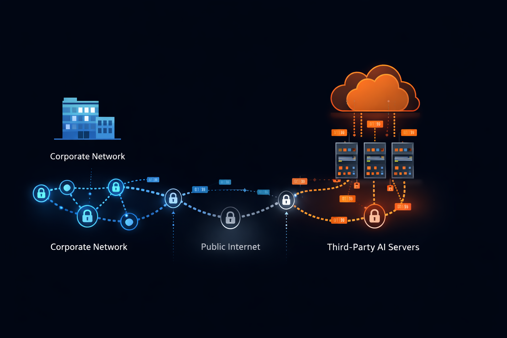
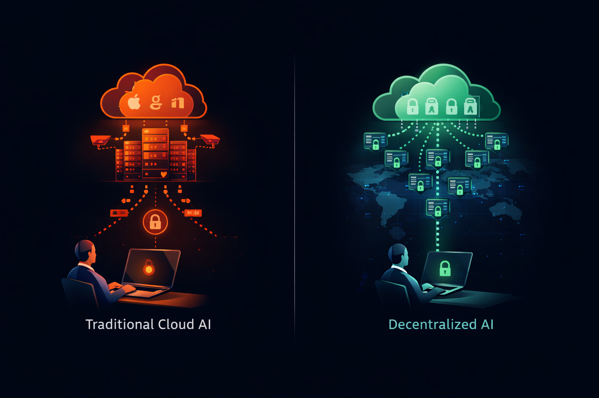

そのメモは誰も満足させないが、すべてを変える。

Samsungの半導体部門がエンジニアがプロプライエタリなチップ設計をChatGPTにアップロードしたことを発見したとき、対応は即座かつ絶対的だった。全社的な禁止。例外なし。上訴プロセスなし。AI生産性の代名詞となっていたツールが、すべての企業ネットワークで禁止された。

Samsungだけではなかった。数ヶ月以内に、JPMorgan Chase、Apple、Amazon、Goldman Sachs、Deutsche Bank、その他数十の企業から同様の発表が出た。Fortune 500企業にアドバイスを行う法律事務所はアソシエイトのサービス使用を禁止した。医療システムはファイアウォールレベルでアクセスをブロックした。政府機関は許容可能な使用に関するあいまいさを事実上終わらせるガイダンスを発行した。

このパターンは、テクノロジー愛好家がAI能力への興奮の中で見落としていたことを明らかにした：企業採用はコンシューマー採用にはない制約の下で運営される。

この記事では、企業AIポリシーが厳格化している理由、これらの決定を推進する特定のリスク、そして組織が容認できないデータ露出を受け入れることなくAI能力を維持する方法を検討する。前進の道はAIを放棄することを必要としない。インフラストラクチャがインテリジェンスと同じくらい重要であることを理解することを必要とする。

## すべてを変えた事件

企業AI禁止は理論的なリスク評価から生じたものではない。機密情報が組織の管理から逃れた実際の事件に続いたものだ。

**Samsung半導体の情報漏洩**

2023年初頭、Samsung Electronicsの従業員がソースコードのデバッグと半導体製造プロセスの最適化にChatGPTを使用した。エンジニアはプロプライエタリコードを直接チャットインターフェースに貼り付けた。他の者は戦略的計画の議論を含む会議メモをアップロードした。ChatGPTが社内使用に許可されてから3週間以内に、Samsungの情報セキュリティチームはOpenAIサーバーへの機密データ送信の複数のインスタンスを特定した。

半導体業界はナノメートル単位のマージンと月単位の競争優位性で運営される。Samsungの製造プロセスがOpenAIのトレーニングコーパスに存在する可能性—同じサービスを使用する競合他社がアクセスできる可能性—は容認できなかった。Samsungは完全な禁止を実施し、データを外部に送信しない内部AIツールの開発を開始した。

**金融サービス業界の対応**

JPMorgan Chaseは公表された事件の前にChatGPTアクセスを制限し、規制上の影響を先制的に認識していた。銀行員が顧客ポートフォリオを分析し、合併戦略を議論し、信用リスクを評価するとき、彼らはSEC規制、銀行機密法、受託者義務の対象となる情報を扱っている。そのような情報を第三者AIサービスに送信すること—そのサービスの明記されたプライバシーポリシーに関係なく—は、ゼネラルカウンセルが受け入れないコンプライアンスリスクを生じさせる。

Goldman Sachs、Citigroup、Bank of America、Deutsche Bankも同様の制限で追随した。金融サービス業界の協調した対応は、パラノイアではなく、規制責任の専門的理解を反映していた。従業員のChatGPT使用から生じるデータ侵害は、開示を必要とし、規制調査を引き起こし、潜在的に執行措置につながる可能性がある。

**法律業界への影響**

米国弁護士会はAIツールに対する包括的な禁止を発行していないが、弁護士・依頼者秘匿特権要件の実際的な効果はそれに近い。弁護士がChatGPTで依頼者の問題を議論するとき、その会話は秘匿特権保護を放棄する可能性がある。第三者に開示された情報—AIシステムさえも—は、法的助言を保護する機密性を失う可能性がある。

Davis Polk、Cravath、Sullivan & Cromwellを含む主要法律事務所は、完全な禁止からパートナーの承認を必要とする承認済み使用のみポリシーまで、様々な制限を実施した。法律専門家の対応は、AIリスクがデータセキュリティを超えて専門家責任の根本的な問題にまで及ぶことを示した。

## クラウドAIデータ処理の技術的現実

企業がChatGPTを禁止する理由を理解するには、クラウドAIサービスにメッセージを送信するときに実際に何が起こるかを調べる必要がある。

**データ送信経路**

ChatGPTにプロンプトを入力すると、テキストはデバイスから企業ネットワークを経由し、パブリックインターネットを越えて、OpenAIのインフラストラクチャに到達する。OpenAIは主にMicrosoft Azure上で運営されており、データはMicrosoftのネットワークを通過し、Microsoft管理のサーバーに存在する。

この送信はコンテンツの機密性に関係なく発生する。システムは詩を書くリクエストと機密の合併条件を分析するリクエストを区別できない。入力するすべての文字が同じ経路で同じ宛先に行く。

**データ保持ポリシー**

OpenAIのデータ使用ポリシーは時間とともに進化してきたが、特定の基本事項は一貫している。ユーザー入力はログに記録される。会話は保存される。保存の期間と目的は、サブスクリプションティアと特定の契約に依存する。

無料ティアとPlusサブスクライバーについては、OpenAIはモデル改善のために入力を使用する権利を明示的に留保している。プロンプトはトレーニングデータになる。問題をデバッグするために貼り付けた機密コードは、将来のユーザー—潜在的に競合他社を含む—へのモデルの応答方法に影響を与える可能性がある。

APIユーザーとEnterpriseサブスクライバーはトレーニングデータへの貢献をオプトアウトできるが、入力は依然としてOpenAIインフラストラクチャで処理される。データは依然として管理していないサーバー上に存在し、審査していない従業員によって管理され、影響を与えることができない法的プロセスの対象となる。

**第三者の問題**

企業セキュリティアーキテクチャは、ファーストパーティシステム（所有し運営するインフラストラクチャ）、セカンドパーティシステム（直接的な契約関係と監査済みセキュリティ管理を持つベンダー）、サードパーティシステム（詳細なセキュリティ統合なしにアクセスされるサービス）を区別する。

ChatGPTは、ほとんどのユーザーにとって、監査されていない第三者として運営される。組織がセキュリティ補遺、ペネトレーションテスト権、要件にマップされたコンプライアンス認証を含む特定のエンタープライズ契約を交渉していない限り、ChatGPTはセキュリティ境界の外側に位置し、従業員が共有することを選択したあらゆるデータにアクセスできる。

このアーキテクチャ上の現実は、セキュリティチームがChatGPTをMicrosoft OfficeやSalesforceとは異なる扱いをする理由を説明している。これらのシステムは、クラウドベースであるにもかかわらず、定義されたセキュリティ管理、監査権、責任条件を持つエンタープライズ契約の下で運営されている。月額20ドルのサブスクリプションを持つユーザーにとって、ChatGPTはこれらの保護のいずれも提供しない。

## 企業の慎重さを促す規制フレームワーク

企業AIポリシーは真空中に存在しない。ChatGPT以前から存在し、ChatGPT後も存続する法的要件に対応している。

**GDPRと欧州データ保護**

一般データ保護規則は、EU居住者の個人データの処理に厳格な要件を課している。従業員がChatGPTに顧客情報を貼り付けると、米国拠点のプロセッサーへのデータ転送を開始する。この転送には法的根拠—適切性決定、標準契約条項、または拘束的企業規則のいずれか—が必要である。

OpenAIのデータ処理契約は一部のユースケースでGDPR要件を満たす可能性があるが、コンシューマー製品を使用するほとんどの従業員はそのような契約を結んでいない。彼らは単に許可なく外国企業に個人データを送信している。

イタリアの規制当局は2023年にGDPRの懸念から一時的にChatGPTを禁止した。OpenAIがコンプライアンス調整を行った後にサービスは再開されたが、この事件は規制当局の行動意欲を示した。欧州企業はGDPRに違反する従業員の行動に対して直接的な責任を負い、制限的なポリシーへの強いインセンティブを生み出している。

**HIPAAと医療データ**

医療保険の携行性と説明責任に関する法律は、特定の許可された状況を除いて保護対象医療情報（PHI）の開示を禁止している。医療従事者がChatGPTで患者のケースを議論すると、無許可の受取人にPHIを開示することになる。

典型的な医療機関とOpenAIの間にはビジネスアソシエイト契約は存在しない。セキュリティ監査はChatGPTのHIPAA技術的セーフガードへのコンプライアンスを検証していない。開示を許可する法的フレームワークは存在しない。

従業員がChatGPTを通じてPHIを共有したことを発見した医療機関は、違反通知要件、潜在的なOCR調査、年間違反カテゴリあたり最大150万ドルの罰則に直面する。これらの結果は、病院システムがポリシーコンプライアンスに依存するのではなく、ネットワークレベルでChatGPTをブロックする理由を説明している。

**金融規制**

銀行、ブローカーディーラー、投資顧問は、ビジネスコミュニケーションの記録保持と監督を義務付けるSEC、FINRA、OCC、連邦準備制度の規制の下で運営されている。アナリストがChatGPTを使用して顧客通信を起草する場合、その会話はコンプライアンスアーカイブにキャプチャされるべきである。

ChatGPTは企業アーカイブシステムとの統合を提供していない。潜在的に問題のある使用をフラグする監督ツールはない。会話はOpenAIのサーバーと従業員のデバイスにのみ存在し、どちらも規制上の記録保持要件を満たさない。

記録保持を超えて、金融規制当局はAI生成の投資アドバイス、信用決定へのAI関与、市場操作を構成する可能性のあるAI分析について懸念を表明している。規制環境は不確実なままであり、コンプライアンス担当者は明確化を待つ間に使用を許可するのではなく、制限することで不確実性に対応している。

**新興のAI特有の規制**

2025年と2026年に段階的に発効すると予想されるEU AI法は、AIシステム展開に追加の要件を課す。雇用、信用、教育に影響を与えるものを含む高リスクAIアプリケーションは、適合性評価、文書化、人間の監視を必要とする。

これらのコンテキストでChatGPTを使用している組織は、規制が発効すると非準拠のAIシステムを運用していることに気づく可能性がある。先を見越した企業は、後でコンプライアンス是正に直面するのではなく、今使用を制限している。

## 知的財産：契約では解決できないリスク

規制コンプライアンスは懸念の一つのカテゴリを表す。知的財産保護はもう一つを表す—そして多くの企業にとって、より重大なものである。

**営業秘密と機密性**

営業秘密保護法および州の同等法に基づく営業秘密保護は、合理的な保護措置を通じて情報が機密のままであることを要求する。従業員がプロプライエタリアルゴリズム、製造プロセス、戦略計画をChatGPTに貼り付けると、組織の保護措置は失敗している。

営業秘密請求を評価する裁判所は、請求当事者が秘密を維持するための合理的な措置を講じたかどうかを調べる。従業員が第三者AIサービスと機密情報を共有することを許可することは、この要件を弱める。情報がOpenAIのシステムから漏洩しなくても、開示行為自体が法的保護を損なう可能性がある。

この懸念は仮想的な訴訟を超えて及ぶ。企業は定期的に退職する従業員や競合他社に対して営業秘密請求を主張している。発見により「秘密」の情報が以前にChatGPTと共有されていたことが明らかになった場合—潜在的なモデルトレーニングを通じて何百万人ものユーザーがアクセス可能—請求は大幅に弱まる。

**ソースコードと技術資産**

ソフトウェア企業は特に露出している。開発者は当然、AIツールを使用してコードのデバッグ、ボイラープレートの生成、開発の加速を望む。しかし、ソースコードはソフトウェアビジネスの中核資産を表す。ChatGPTに送信されると、そのコードは組織の管理外に存在する。

トレーニングデータの懸念は理論的ではない。大規模言語モデルは入力から学習する。OpenAIはEnterpriseおよびAPIカスタマーはトレーニング貢献をオプトアウトできると述べているが、コンシューマー製品にはそのような保証はない。ある開発者が共有したコードは、別の開発者に表示される補完に影響を与える可能性がある—潜在的に競合企業で。

Amazonの従業員への内部警告は、ChatGPTの応答がAmazonの機密情報に似ている可能性があるリスクを具体的に挙げ、同様のデータがすでにモデルに組み込まれていることを示唆していた。これがトレーニングデータ内の実際のAmazonコードを表すのか、単に類似のパターンを表すのかは不明のままである。あいまいさ自体が制限的なポリシーを推進した。

**クライアントと顧客情報**

専門サービスファーム—コンサルタント、会計士、弁護士、建築家—は、サービスプロバイダーではなく、それらのクライアントに属するクライアント情報を扱う。ChatGPTとクライアントデータを共有することは、エンゲージメントレター、機密保持契約、専門家倫理規則に違反する可能性がある。

分析のためにクライアントの財務予測をChatGPTにアップロードするコンサルタントは、そのクライアントの機密情報を第三者と共有している。コンサルタントの会社は、発見された場合、契約違反請求、専門家による懲戒、クライアント関係の喪失に直面する可能性がある。

これらの懸念は顧客データを扱うあらゆるビジネスに等しく適用される。応答を起草するために顧客通信をChatGPTに貼り付ける営業担当者は、顧客コミュニケーションをOpenAIに送信している。業界と適用される契約によっては、これは顧客データ取り扱いコミットメントに違反する可能性がある。

## エンタープライズAI契約の不十分さ

OpenAIは企業の懸念に対処するためにChatGPT Enterpriseを特に提供している。MicrosoftはエンタープライズセキュリティフィーチャーとともにAzure OpenAI Serviceを提供している。これらの製品はコンシューマー向け製品を改善するが、高感度ユースケースに対する根本的な懸念を排除するものではない。

**エンタープライズ契約が提供するもの**

ChatGPT Enterpriseにはいくつかの有意義な改善が含まれている：

- データはモデルトレーニングに使用されない
- SOC 2 Type 2コンプライアンス認証
- 保存時および転送時のデータ暗号化
- SSO統合と管理制御
- データ保持制御

これらの機能は多くの企業ユースケースの要件を満たす。キャンペーンコピーを起草するマーケティングチームは最小限のリスクに直面する。応答テンプレートを生成するカスタマーサービス部門は許容可能なパラメータ内で運営される。

**エンタープライズ契約が提供できないもの**

規制対象業界と機密知的財産については、エンタープライズ契約は根本的な点で不十分である。

第一に、データは依然として管理していないインフラストラクチャで処理される。情報はOpenAIサーバーに存在し、OpenAI従業員によって管理され、OpenAIのセキュリティ慣行に従う。彼らの実装を信頼する。彼らの人員審査を信頼する。彼らのインシデント対応を信頼する。この信頼は正当化されるかもしれないが、それでも信頼であり—検証ではない。

第二に、データは法的プロセスの対象のままである。OpenAIに送達された召喚状は会話の開示を強制する可能性がある。別の顧客への政府調査は潜在的に共有インフラストラクチャを露出させる可能性がある。国家安全保障書簡とFISA裁判所命令は、OpenAIがアクセスについて通知することを妨げる秘密保持要件の下で運営される。

第三に、攻撃対象領域にはOpenAI組織全体が含まれる。セキュリティ境界はもはやネットワーク境界で終わらない。システムアクセスを持つすべてのOpenAI従業員、インフラストラクチャアクセスを持つすべてのベンダー、OpenAIのシステムのすべてのセキュリティ脆弱性がリスクプロファイルの一部となる。

第四に、脱出と��ータビリティは制約されたままである。ChatGPTに蓄積された会話履歴、ファインチューニングされた動作、組織知識は、OpenAIのシステムとのインタラクションに属する。代替への移行にはゼロからの再構築が必要である。

新規化合物を開発する製薬会社、機密に近い研究を扱う防衛請負業者、潜在的価値で数十億ドルを表すトレーディングアルゴリズムを持つ金融機関にとって、これらの制限は重要である。エンタープライズ契約はリスクを軽減する。それを排除するわけではない。

## オープンウェイトの代替手段

企業のChatGPT禁止を促す制限は、一般的なAIには適用されない。データが組織の管理を離れるクラウドAIサービスに特に適用される。異なるアーキテクチャはこれらの懸念を完全に排除する。

**オープンウェイトモデルが提供するもの**

オープンウェイトモデル—MetaのLlama、Mistral AIのMistral、AlibabaのQwenなど—は、任意の互換ハードウェアで実行できるダウンロード可能なモデルファイルを提供する。モデルウェイトは公開されている。推論コードはオープンソースである。所有し運営するインフラストラクチャでシステム全体を実行できる。

自社サーバーでLlamaを実行すると、プロンプトはネットワークを離れない。第三者がデータを受け取ることはない。クラウドサービスがクエリをログに記録することはない。トレーニングパイプラインが入力を組み込むことはない。モデルはローカルで実行され、ローカルで処理され、明示的に設定したもの以外は何も保存しない。

このアーキテクチャはChatGPT禁止を促すすべての懸念を満たす：

- **規制コンプライアンス：**データはセキュリティ境界内に留まり、管理下に置かれ、ポリシーによって統治される。データが転送されないため、GDPRデータ転送は発生しない。無許可の当事者への開示がないため、HIPAAの懸念は解消される。

- **知的財産保護：**営業秘密は秘密のままである。ソースコードがシステムを離れることはない。第三者がクライアント情報を受け取らないため、クライアントの機密性は維持される。

- **セキュリティ管理：**攻撃対象領域は自社のままである。自社のセキュリティ慣行を検証する。自社の人員を審査する。自社のインシデント対応を管理する。外部組織の脆弱性がデータに影響することはない。

- **監査とコンプライアンス：**すべてのクエリ、すべての応答、すべてのモデルインタラクションを要件に従ってログに記録できる。規制上の記録保持は既存のアーカイブシステムと統合される。

**能力の比較**

自然な疑問は、オープンウェイトモデルがChatGPTの能力に匹敵するかどうかである。正直な答え：ユースケースによる。

一般的な知識クエリについては、インターネット規模のデータでのChatGPTのトレーニングは、より小さなオープンモデルでは匹敵できない幅広さを提供する。複雑な問題に対するGPT-4の推論能力は、Llama-3-8Bの達成を上回る。

しかし、企業ユースケースはインターネット規模の知識を必要とすることはほとんどない。契約を分析する法務チームは、ドキュメント理解と正確な言語生成を必要とする—ファインチューニングされたオープンモデルが優れる能力である。コードをデバッグする開発チームは、特定のコードベース内のパターン認識を必要とする—カスタムトレーニングがジェネリックモデルを劇的に上回るタスクである。

重要な洞察は、ファインチューニングがジェネリックモデルをドメインスペシャリストに変換することである。組織のドキュメント、コーディング標準、コミュニケーションパターンでファインチューニングされたLlama-3-8Bモデルは、完全なデータ分離を維持しながら、特定のタスクでGPT-4を上回る。

[分散型GPUでのプライベートLLMファインチューニング](/ja/private-llm-fine-tuning-guide)に関する当社のピラーガイドは、このプロセスの完全な技術的ワークフローを提供する。

## プライベートAIデプロイメントのインフラストラクチャオプション

オープンウェイトモデルの実行にはGPUコンピュートが必要である。組織にはこの能力を取得するためのいくつかのオプションがある。

**オンプレミスハードウェア**

内部データセンター用にNVIDIA GPUを購入すると、最大の制御が提供される。ハードウェアは施設内に設置され、スタッフによって管理され、ネットワークに接続される。外部当事者はいかなるアクセスも持たない。

課題は資本支出とリードタイムである。NVIDIA H100 GPUは約3万ドルである。トレーニング用の意味のあるクラスターには複数のユニットが必要である。調達タイムラインは数ヶ月に及ぶ。継続的なメンテナンスには専門的な専門知識が必要である。

既存のデータセンター運営を持つ大企業にとって、オンプレミスAIインフラストラクチャは自然な拡張を表す。より小さな組織やGPU専門知識を持たない組織にとって、障壁は相当なものである。

**プライベートクラウドインスタンス**

AWS、GCP、AzureはSaaS AI製品よりも多くの制御を提供するGPUインスタンスを提供している。環境を設定する。アクセスを制御する。データは共有サービスではなく専用インスタンスで処理される。

このアプローチはChatGPTのアーキテクチャを改善するが、クラウドプロバイダーの関与を維持する。データは依然として物理的に制御していないインフラストラクチャ上に存在する。十分なアクセスを持つクラウドプロバイダーの従業員は理論的にシステムにアクセスできる。クラウドプロバイダーに送達された法的プロセスはデータに到達する可能性がある。

さらに、プライベートクラウドGPUインスタンスには相当なコストがかかる。AWS p4d.24xlarge インスタンス（8x A100 GPU）は1時間あたり約32ドルで運用される。長時間のトレーニング実行や継続的な推論サービスは、かなりの月額費用を発生させる。可用性は制約されており—GPUインスタンスは頻繁に待機リストや限定的な地域可用性を示す。

**分散型GPUレンタル**

第三のオプションは、資本支出とクラウドプロバイダーの関与の両方をバイパスする。分散型GPUマーケットプレイスはユーザーをハードウェア所有者と直接接続する。暗号通貨で支払い、本人確認やクラウドプロバイダーの仲介なしに、ピアツーピアでコンピュート容量をレンタルする。

このモデルは、プライバシーを意識した組織にいくつかの利点を提供する：

- **KYC要件なし：**ウォレットを接続してハードウェアをレンタルする。企業アカウントなし。エンタープライズセールスプロセスなし。組織を特定のAI活動にリンクする身分証明書類なし。

- **クラウドプロバイダーの関与なし：**データは、法務部門、政府契約、法執行機関との関係を持つ企業ではなく、個人が所有するハードウェアで処理される。

- **コスト効率：**RTX 4090レンタルは1時間あたり0.40ドルから0.60ドルで、同等のクラウドインスタンスのコストの約10分の1である。当社の[GPUレンタル価格比較](/ja/gpu-rental-pricing-comparison-2026)は経済性の詳細を提供する。

- **グローバル可用性：**分散型供給は地域の制約がないことを意味する。必要なときにハードウェアが利用可能であり、世界中の管轄区域に分散している。

GPUハードウェアへの資本支出を正当化できないが、クラウドプロバイダーが提供するよりも強力なプライバシー保証を必要とする組織にとって、分散型レンタルは実用的な中間パスを提供する。

ワークフローには、暗号化されたSSH接続を介してレンタルノードにデータを直接転送し、トレーニングまたは推論ジョブを実行し、結果をダウンロードし、切断前にリモート環境をサニタイズすることが含まれる。[パブリックGPUノードでデータセットを保護する方法](/ja/how-to-secure-dataset-on-public-gpu-node)に関する当社のガイドは、運用セキュリティ慣行の詳細をカバーしている。

## コンプライアンス準拠のAI戦略の実装

ChatGPT禁止からプライベートAIデプロイメントに移行する組織は、体系的にトランジションにアプローチすべきである。

**フェーズ1：ポリシー開発**

AIポリシーが実際に何を禁止し、何を許可するかを明確にすることから始める。多くの初期ChatGPT禁止は反応的だった—即時のリスクを止めるために迅速に実装された包括的な禁止。成熟したポリシーは以下を区別する：

- 外部AIシステムで処理してはならないデータカテゴリ
- 適切な管理を伴えばクラウドAIサービスが許容されるユースケース
- 異なる機密性レベルに対する承認されたツールとプラットフォーム
- 新しいAIツール採用の承認プロセス
- ポリシー違反に対するインシデント報告要件

このフレームワークにより、機密性の高い運用を保護しながら、適切な場所でAI使用を継続できる。

**フェーズ2：インフラストラクチャ評価**

組織のリソースと要件に基づいて、プライベートAIデプロイメントのオプションを評価する：

- **既存のGPUリソース：**多くの組織には、他の目的（ビジュアライゼーション、レンダリング、科学計算）に使用されているNVIDIA GPU搭載のワークステーションやサーバーがあり、AIワークロードをサポートできる。

- **クラウド予算とリスク許容度：**セキュリティチームが適切な管理を伴うクラウドプロバイダーの関与を受け入れる場合、プライベートクラウドGPUインスタンスはオンプレミスや分散型オプションよりも簡単な運用を提供する。

- **プライバシー要件：**ユースケースがいかなる状況でもクラウドプロバイダーインフラストラクチャに触れることができないデータを含む場合、オンプレミスハードウェアまたは分散型レンタルが必要になる。

- **スケールと頻度：**時折のファインチューニングジョブはレンタルモデルに適している。継続的な推論サービスは資本投資を正当化する可能性がある。

**フェーズ3：モデル選択とカスタマイズ**

ジェネリックなオープンウェイトモデルは出発点を提供するが、組織の価値はカスタマイズから生まれる。自社のデータでファインチューニングすることで、ドメイン、用語、要件を理解するモデルを作成する。

最も高い価値を提供するユースケースを検討する：

- **ドキュメント分析：**法的契約、規制申請、内部ポリシー
- **コード支援：**特定のフレームワークと標準内での開発
- **顧客コミュニケーション：**ブランドボイスと製品知識を反映した応答
- **内部ナレッジ：**組織ドキュメントと機関知識のクエリ

各ユースケースは個別のファインチューニングされたモデルを保証するか、または多様な組織データでトレーニングされた単一のモデルが複数の目的に役立つ可能性がある。

**フェーズ4：運用統合**

プライベートAIデプロイメントには、SaaS製品が抽象化する運用能力が必要である：

- **モデルサービングインフラストラクチャ：**スケールでの推論実行には、GPUリソース、ロードバランシング、APIインターフェースが必要である。vLLM、Text Generation Inference、Ollamaなどのツールがデプロイメントを簡素化する。

- **アクセス制御：**誰がモデルにクエリできるか？どのようなロギングが発生するか？使用をどのように監査するか？

- **更新手順：**新しいトレーニングデータをどのように組み込むか？改善されたモデルバージョンをどのようにデプロイするか？

- **インシデント対応：**モデルが問題のある出力を生成した場合、何が起こるか？エッジケースを誰がレビューするか？

SaaSのシンプルさに慣れた組織は、この運用オーバーヘッドを過小評価する可能性がある。初期デプロイメントだけでなく、継続的なメンテナンスに適切に予算を計上する。

## ケーススタディ：金融サービスコンプライアンスアーキテクチャ

資産500億ドルの地域銀行は、馴染みのあるジレンマに直面した。リレーションシップマネージャーは、顧客コミュニケーションの起草とポートフォリオポジションの分析にAI支援を望んでいた。コンプライアンス担当者は、ChatGPTに顧客の財務データを送信することは規制要件と受託者義務の両方に違反することを認識していた。

ソリューションアーキテクチャは、組織が両方の構成員を満足させる方法を示している。

**データ分類**

銀行はAI許容データの3つのティアを確立した：

- **ティア1（パブリック）：**マーケティング資料、公開財務教育コンテンツ、一般的な製品説明。標準的な許容使用ガイドラインを伴うクラウドAIサービスが許可される。

- **ティア2（内部）：**内部ポリシー、トレーニング資料、運用手順。エンタープライズ契約とデータ取り扱い補遺を伴うクラウドAIサービスが許可される。

- **ティア3（制限）：**顧客データ、ポートフォリオ情報、取引詳細、戦略計画。いかなる状況でも外部AI処理は許可されない。

この分類により、リスクが許容可能な場所でAI採用が可能になり、機密性の高いカテゴリに対する絶対的な保護を維持した。

**プライベートインフラストラクチャのデプロイメント**

ティア3ユースケースについて、銀行は既存のデータセンター内のオンプレミスGPUサーバーにファインチューニングされたLlamaモデルをデプロイした。モデルは以下でトレーニングされた：

- 匿名化された過去の顧客コミュニケーション（顧客の同意を得て）
- 内部コンプライアンスガイドラインと規制解釈
- 製品ドキュメントと投資リサーチ
- コンプライアンスによって承認されたコミュニケーションテンプレート

結果として得られたモデルは、銀行用語、規制上の制約、組織のコミュニケーション標準を理解した。リレーションシップマネージャーは、顧客データが銀行のセキュリティ境界を離れないことを知りながら、AI支援で顧客への手紙を起草できた。

**運用管理**

すべてのモデルインタラクションは銀行の既存のコンプライアンスアーカイブシステムにログされた。スーパーバイザーは従来の通信とともにAI支援コミュニケーションをレビューできた。監査証跡は規制上の記録保持要件を満たした。

モデル自体は特定の出力を防止するガードレール内で運用された—投資推奨、保証言語、または特定のライセンスを必要とするアドバイスを構成する可能性のあるステートメント。これらの制約はモデルの動作だけに頼るのではなく、アプリケーション層で実装された。

**測定された結果**

デプロイメントの6ヶ月後、銀行は以下を報告した：

- ルーティンの顧客コミュニケーション起草に費やす時間が40%削減
- AI使用に関連するコンプライアンスインシデントがゼロ
- AIデプロイメントに関連する所見なしで規制審査に合格
- リレーションシップマネージャーの満足度スコアが向上

プライベートインフラストラクチャへの投資—ハードウェア、開発、統合を含めて約20万ドル—は、生産性向上だけで最初の1年以内にリターンを生み出した。

## ケーススタディ：医療研究機関

臨床研究を行う大規模な学術医療センターは、患者データを使用したクラウドAI使用を法的に問題のあるものにするHIPAAの制約に直面した。研究者は文献レビュー、プロトコル開発、データ分析にAIを使用することを望んでいた。

**ハイブリッドアプローチ**

完全な禁止と容認できないリスクのいずれかを選択するのではなく、機関はハイブリッドアーキテクチャを実装した：

- **パブリックリサーチタスク**（文献レビュー、方法論の質問、統計的アプローチ）は、患者データ入力を禁止する明確なポリシーを伴うクラウドAIサービスを使用した。

- **患者データ分析**は、セキュアな研究環境内のエアギャップされたワークステーション上にローカルにデプロイされたモデルを使用した。これらのマシンにはインターネット接続がなかった。ユーザーの行動に関係なく、データは外部に出ることができなかった。

**分散型トレーニング**

機関にはトレーニング可能なGPUハードウェアの資本予算がなかったが、医学文献と研究プロトコルでファインチューニングされたモデルが必要だった。彼らは公開医学文献とHIPAAの影響がない匿名化されたデータセットのみを使用して、トレーニング実行に分散型GPUレンタルを利用した。

トレーニングワークフローは当社の[データセットセキュリティガイド](/ja/how-to-secure-dataset-on-public-gpu-node)に記載されているセキュリティ慣行に従った：

1. 非機密トレーニングデータのみをレンタルノードに転送
2. ファインチューニングジョブを実行
3. 結果のモデルウェイトをダウンロード
4. リモート環境を完全にサニタイズ
5. トレーニングされたモデルをエアギャップされた内部インフラストラクチャにデプロイ

このアプローチは、保護対象医療情報を外部システムに公開することなく、カスタマイズされた医療AI能力を提供した。

**規制検証**

機関のIRBは研究プロトコル修正の一部としてAIデプロイメントをレビューした。パブリックデータトレーニング（外部）と患者データ推論（内部、エアギャップ）の明確な分離がプライバシー要件を満たした。HIPAAコンプライアンス担当者はセキュリティ評価後にアーキテクチャを承認した。

## 戦略的必然性

AIポリシーをリスク軽減のレンズのみを通して見る組織は、より大きな全体像を見逃している。今日ChatGPTを禁止している企業はAIを放棄していない。持続可能な優位性のために再ポジショニングしている。

**データによる競争差別化**

最も価値のあるAI能力はプロプライエタリデータから生まれる。インターネットテキストでトレーニングされたジェネリック言語モデルは、すべての人が利用できるジェネリックな能力を提供する。顧客とのインタラクション、運用データ、機関知識でファインチューニングされたモデルは、組織に固有の能力を提供する。

この差別化にはプロプライエタリデータをプロプライエタリに保つ必要がある。クラウドAIサービスに競争優位性を供給する組織は、すべてのユーザーに利益をもたらすモデルに貢献している—競合他社を含む。プライベートAIをデプロイしながらデータ管理を維持する組織は、時間とともに複利的に増加する優位性を蓄積する。

**規制の軌道**

AI規制は緩和されるのではなく、厳格化している。EU AI法は他の管轄区域が従う先例を確立している。FTC、SEC、銀行規制当局を含む米国機関がAI特有のガイダンスを開発している。中国はモデルトレーニングとデプロイメントに影響するAI規制を実施している。

今プライベートAIインフラストラクチャを構築している組織は、クラウドAI使用をますます制限する規制環境に備えている。コンプライアンスアーキテクチャへの投資は、コンプライアンス要件が強化されるにつれてより価値が高まる。

**サプライチェーンの考慮事項**

単一のAIプロバイダーへの依存は戦略的脆弱性を生み出す。OpenAIの価格設定、ポリシー、能力は彼らの裁量で変更される。サービス中断はすべての顧客に同時に影響する。ポリシー変更は以前許容されていたユースケースを一夜にして禁止する可能性がある。

プライベートAIデプロイメントは単一ベンダーへの依存を排除する。オープンウェイトモデルはダウンロード可能で永続的に利用可能である。デプロイメントには複数のハードウェアオプションが存在する。組織は外部の決定に依存するのではなく、AIサプライチェーンを管理する。

## 実装ロードマップ

ChatGPT禁止を超えてプライベートAI能力に移行する準備ができた組織には、段階的なアプローチを推奨する。

**即時アクション（1-2週目）**

1. 組織全体の現在のAI使用を監査
2. 機密性と規制要件によるデータタイプの分類
3. どのユースケースがプライベートインフラストラクチャを必要とするか、許容可能なクラウド使用かを文書化
4. 禁止されている活動と許可されている活動を明確にする暫定ポリシーを確立

**短期開発（1-3ヶ月目）**

1. 機密性要件と予算に基づいてインフラストラクチャオプションを評価
2. プライベートAIデプロイメントの初期ユースケースを選択
3. モデルカスタマイズのためのトレーニングデータソースを特定
4. 該当する場合、外部GPU使用のためのセキュリティプロトコルを確立

**中期デプロイメント（3-6ヶ月目）**

1. [当社の技術ガイド](/ja/private-llm-fine-tuning-guide)に従って組織データでモデルをファインチューニング
2. 適切なアクセス制御を備えた推論インフラストラクチャをデプロイ
3. 既存のコンプライアンスおよび監査システムと統合
4. 承認されたワークフローとツールについてユーザーをトレーニング

**継続的な運用**

1. 新しいトレーニングデータを組み込んだ定期的なモデル更新
2. AIインフラストラクチャのセキュリティ評価
3. 規制変更を反映したポリシー更新
4. 追加のユースケースへの能力拡張

## 結論

ChatGPTに対する企業禁止は、テクノフォビアではなく、合理的なリスク管理を反映している。Samsungがプロプライエタリな半導体設計がアップロードされたことを発見した後にツールを禁止したとき、彼らは正しい決定を下した。JPMorganが先制的にアクセスを制限したとき、彼らは適切な規制認識を示した。医療システムがファイアウォールレベルでアクセスをブロックするとき、彼らは法律で要求される患者のプライバシーを保護している。

しかし、禁止は戦略ではない。「ノー」で止まる組織は、競合他社が獲得する生産性の優位性を放棄する。繁栄する企業は、第三の道が存在することを認識するものである。

プライベートインフラストラクチャ上で実行されるオープンウェイトモデルは、データ露出なしにAI能力を提供する。モデルは今利用可能である。インフラストラクチャはアクセス可能である。技術的ワークフローは文書化されている。唯一の障壁は実装するための組織の意志である。

プロプライエタリデータでモデルをファインチューニングしている競合他社—顧客、製品、運用を理解するシステムをトレーニングしている—は、ジェネリックサービスに加入することでは複製できない優位性を構築している。ポリシーを議論している間に、彼らは能力をデプロイしている。

今日下すインフラストラクチャの決定は、AIがあなたの競争優位性になるか、競合他社のあなたに対する優位性になるかを決定する。クラウドAIサービスはデータを共有リソースに変える。プライベートAIデプロイメントはデータをユニークな能力に変える。

選択はAIを使用するかどうかではない。選択はそれを管理するかどうかである。

---

## 関連リソース

この記事は、企業AI決定の戦略的および規制的コンテキストを扱っている。以下のリソースは技術的実装ガイダンスを提供する：

**コア実装ガイド**

- [分散型GPUでのプライベートLLMファインチューニングの究極ガイド](/ja/private-llm-fine-tuning-guide) — カスタムモデルトレーニングの完全な技術的ワークフロー

**セキュリティと運用**

- [パブリックGPUノードでデータセットを保護する方法](/ja/how-to-secure-dataset-on-public-gpu-node) — 分散型コンピュートの運用セキュリティ慣行
- [KYCなしでGPUをレンタルする方法](/ja/how-to-rent-gpu-without-kyc) — プライバシーに配慮したデプロイメントのための匿名レンタルワークフロー

**プラットフォームと経済性**

- [GPUレンタル価格比較2026](/ja/gpu-rental-pricing-comparison-2026) — デプロイメントオプション全体のコスト分析
- [スマートコントラクトエスクローの説明](/ja/smart-contract-escrow) — 分散型支払いが両当事者を保護する方法
- [ステーブルコインはGPUレンタルの支払いに最もスマートな方法](/ja/stable-coins-are-the-smartest-way-to-pay-for-gpu-rental) — 分散型インフラストラクチャの支払いメカニクス

**技術比較**

- [Ollama vs vLLM vs TGI：コンシューマーGPUでの推論速度のベンチマーク](/ja/ollama-vs-vllm-vs-tgi-rtx-4090-benchmark) — デプロイメント用推論サーバー選択
- [RunPod vs Vast.ai比較](/ja/runpod-vs-vastapi-comparison) — GPUレンタルのマーケットプレイス評価
