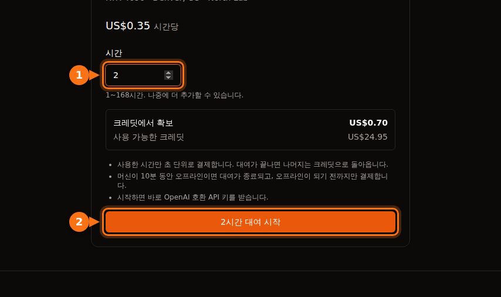

GPU 리스팅의 시간당 가격은 GPU 시간만 포함합니다. 대부분의 플랫폼에서는 디스크 공간(머신이 정지해 있을 때 실행 중보다 더 비싼 경우가 많습니다), 일부 마켓플레이스에서는 데이터 전송, 실제 작업처럼 요금이 나가는 준비 시간과 유휴 시간, 그리고 은행의 환전 수수료까지 냅니다. 아래 계산 예시에서는 RTX 4090 사용료로 $13.60을 잡은 한 달이 $42.23 청구서로 끝납니다.

일부러 숨긴 비용은 없습니다. 대표 가격 하나로 플랫폼을 비교하면 놓치기 쉬울 뿐입니다. 아래 내용은 모두 2026년 9월에 각 플랫폼의 공식 문서와 가격 페이지에서 확인했고, 링크는 글 끝에 있습니다. 대표 가격 자체는 [GPU 대여 가격 비교](/ko/gpu-rental-pricing-comparison-2026/)를 보세요.

## 플랫폼별 부가 비용

| 비용 | Vast.ai | RunPod | Lambda | AWS EC2 | GPUFlow |
| --- | --- | --- | --- | --- | --- |
| 과금 단위 | 초 단위 | 초 단위 | 분 단위 | 초 단위, 최소 60초 | 초 단위, 최소 1분 |
| 정지 중 스토리지 | 호스트 요금으로 청구 | 볼륨 디스크 월 GB당 $0.20 | 파일시스템 월 GiB당 청구 | EBS 요금 계속 발생 | 없음 |
| 데이터 전송 | 호스트 요금, 모든 바이트 | 요금 없음 | 요금 없음 | 아웃바운드: 월 100 GB 무료, 이후 GB당 | 없음 |
| 시작 조건 | 최소 예치금 $5 | 1시간 분량 크레딧, 선불카드는 $100 | 카드 사전 승인 $10 | 결제 수단 | $10 충전, 예약 금액 전액 확보 |
| 잔액이 0이 되면 | 정지 후 삭제 | 정지, 네트워크 볼륨 없으면 데이터 삭제 | 사용 후 매주 청구 | 해당 없음 | 대여 도중에는 일어나지 않음 |

GPUFlow에 스토리지와 전송 항목이 없는 이유는 빌려주는 것이 다르기 때문입니다. 로그인하는 머신이 아니라, 제공자의 GPU에서 이미 돌아가는 AI 모델용 OpenAI 호환 API 키입니다. 대신 자체 코드를 돌리거나 학습, 파인튜닝을 할 수는 없습니다. 머신이 필요하다면 나머지 네 열이 해당됩니다.

## 스토리지, 특히 정지 중일 때

머신이나 컨테이너를 빌려주는 플랫폼이라면 파일은 디스크에 있고, 디스크는 존재하는 동안 계속 돈이 듭니다.

- **RunPod**는 포드가 실행 중일 때 컨테이너 디스크와 볼륨 디스크에 월 GB당 $0.10을 받습니다. 포드를 정지하면 컨테이너 디스크는 지워지고 요금도 없지만, 볼륨 디스크는 월 GB당 $0.20으로 오릅니다. 네트워크 볼륨은 실행 여부와 관계없이 1 TB 미만은 월 GB당 $0.07, 그 이상은 $0.05입니다. 절약 플랜은 GPU 컴퓨팅에만 적용되고 스토리지는 표준 요금으로 청구됩니다.
- **Vast.ai**는 스토리지를 "인스턴스가 존재하는 모든 초에 대해" 청구하며, 오프라인 상태를 빼면 어떤 상태든 마찬가지입니다. 문서도 단도직입적입니다. "인스턴스를 정지해도 스토리지 비용은 피할 수 없습니다." 요금은 호스트가 정합니다.
- **AWS**는 정지된 인스턴스의 컴퓨팅이나 데이터 전송에는 요금을 받지 않지만, "Amazon EBS 스토리지 볼륨을 보관하는 데에는 요금이 발생"하고, 정지된 인스턴스에 연결된 Elastic IP도 계속 청구됩니다. us-east-1의 gp3 볼륨은 월 GB당 약 $0.08입니다.
- **Lambda**는 파일시스템을 사용한 GiB 기준으로 월 단위 요금을 1시간 단위로 청구합니다.

정지된 RunPod 포드의 200 GB 볼륨 디스크는 포드를 다시 켜지 않아도 200 × $0.20 = 월 $40입니다. RunPod Community Cloud 가격으로 RTX 4090을 100시간 넘게 쓸 수 있는 돈입니다.

크레딧이 떨어지면 더 나빠집니다. RunPod 잔액이 $0이 되면 포드가 정지되고, "네트워크 볼륨이 없는 포드는 종료되며 데이터는 복구할 수 없습니다." Vast.ai도 인스턴스를 정지하고, 저장된 카드가 없으면 짧은 유예 기간 뒤 "인스턴스와 저장된 데이터가 삭제됩니다." 결국 잊어버린 볼륨은 계속 요금을 물리거나, 작업물과 함께 사라집니다.

제가 하는 방법은 이렇습니다. 프로젝트가 끝난 날 볼륨을 지우고, 아직 필요한 것만 작은 네트워크 볼륨에 남기고, 중요한 것은 GPU 플랫폼이 아닌 다른 곳에 사본을 둡니다.

## 데이터 전송

15 GB 모델을 받고 데이터셋을 올리면 세션 하나에 수십 GB가 오갈 수 있습니다.

- **Vast.ai**는 "인스턴스가 어떤 상태이든, 인스턴스로 보내거나 받는 모든 바이트에 대역폭 요금"을 받습니다. 호스트마다 업로드와 다운로드 가격을 따로 정하며, 문서에서도 "데이터를 많이 쓰는 워크로드에서는 전체 비용에 큰 영향을 줄 수 있다"고 경고합니다. 빌리기 전에 리스팅에서 확인하세요.
- **RunPod**는 포드에 "인바운드/아웃바운드 요금이 없다"고 밝힙니다.
- **Lambda**: "인바운드나 아웃바운드에 요금이 부과되지 않습니다."
- **AWS**: 들어오는 데이터는 무료입니다. 인터넷으로 나가는 데이터는 모든 서비스와 리전을 합쳐 매달 처음 100 GB까지 무료이고, 그 뒤로는 구간별 GB당 요금이 붙습니다. 퍼블릭 IPv4 주소는 사용 여부와 관계없이 하나당 시간당 $0.005로, 720시간짜리 한 달이면 $3.60입니다.

## 예치금, 승인 보류, 선불 크레딧

GPU 플랫폼은 대부분 선불입니다. 크레딧을 사서 쓰는 방식입니다. 거기 묶어 둔 돈도 비용이고, 돌려받을 수 없다면 더욱 그렇습니다.

- **Vast.ai**: 최소 예치금 $5, 카드·BitPay·Crypto.com으로 결제합니다. 카드로 산 크레딧 중 쓰지 않은 부분은 사이트 채팅으로 요청하면 환불받을 수 있고, 쓴 크레딧은 환불되지 않습니다.
- **RunPod**: 고른 포드의 1시간 분량 이상의 크레딧이 있어야 하고, 선불카드는 한 번에 최소 $100을 충전해야 합니다. 크레딧은 환불되지 않고 인출할 수도 없습니다.
- **Lambda**는 반대 방식입니다. 지난주 사용량을 매주 청구하고, 카드를 등록할 때 $10을 사전 승인했다가 며칠 뒤 풀어 줍니다. 주요 신용카드만 받으며 선불카드와 체크카드는 거절됩니다.
- **SaladCloud**: $5~$10,000 충전, 크레딧은 구매 후 12개월에 만료됩니다.
- **GPUFlow**: Stripe를 통해 카드로 $10~$500 충전, 수수료 없음, 크레딧은 만료되지 않습니다. 대여를 시작하면 소액 예치금이 아니라 예약한 금액 전체가 크레딧에서 확보됩니다. 시간당 $0.40로 10시간을 예약하면 대여가 끝날 때까지 $4.00이 확보되고, 쓰지 않은 금액은 그때 돌아옵니다. 산 크레딧은 현금으로 인출할 수 없고, 카드 환불은 이중 결제나 잘못된 결제, 크레딧이 들어오지 않은 경우, 법적 요구가 있는 경우에만 60일 안에 가능합니다.

만료되는 크레딧이나 더는 쓰지 않는 플랫폼에 남은 크레딧은 이미 쓴 돈입니다. 1년 치가 아니라 이번 달에 할 작업만큼만 충전하세요.

## 준비 시간과 유휴 시간

빌린 머신은 작업량이 아니라 시간으로 요금을 매깁니다. 실제 작업과 똑같이 돈이 나가면서 아무것도 만들지 않는 시간이 두 종류 있습니다.

### 준비 시간

요금은 머신이 켜지는 순간 시작됩니다. Lambda에서는 "인스턴스를 띄우고 인스턴스가 상태 검사를 통과하는 순간 과금이 시작됩니다." 라이브러리 설치, 컨테이너 이미지 받기, 모델 다운로드가 모두 유료 시간에 일어납니다. 시간당 $0.34라면 15분 준비에 약 $0.09입니다. 한 번은 사소하지만, 한 달 동안 매일 하면 GPU 몇 시간어치가 됩니다.

도움이 되는 방법은 두 가지입니다. 필요한 스택이 이미 들어 있는 템플릿이나 이미지에서 시작하고, 모델을 볼륨에 두어 한 번만 받는 것입니다(다만 위의 스토리지 비용과 저울질해야 합니다).

GPUFlow에서는 이용자 쪽 준비 단계가 없습니다. 제공자가 이미 머신에 모델을 설치해 두었고, 대여를 시작하면 바로 API 키를 받습니다.

### 유휴 시간

Lambda는 분명하게 말합니다. "인스턴스는 실제로 사용되는지와 관계없이 실행 중인 동안 계속 청구됩니다." Google Cloud도 RUNNING 상태로 놀고 있는 VM에 대해 같은 설명을 합니다. 아침에 바로 쓰려고 포드를 밤새 켜 두면 하룻밤치 GPU 요금을 냅니다.

Azure에는 함정이 하나 더 있습니다. 운영체제 안에서 종료하는 식으로 VM이 단순히 "Stopped" 상태가 되면 코어 요금이 계속 나갑니다. 포털이나 CLI에서 "Stopped (Deallocated)" 상태로 만들어야 컴퓨팅 요금이 멈춥니다.

GPUFlow도 예외는 아닙니다. **지금 종료**를 클릭하거나 예약한 시간이 끝날 때까지 요금이 나갑니다. 일찍 끝내도 추가 비용은 없고 확보 금액 중 쓰지 않은 부분이 돌아오니, 다 썼으면 대여를 끝내면 됩니다. [GPUFlow 결제 방식](https://docs.gpuflow.app/ko/renters/billing/).

## 과금 단위와 최소 청구 시간

이제 초 단위 과금이 흔하지만 세부 사항은 다릅니다.

| 플랫폼 | 시간 청구 방식 |
| --- | --- |
| Vast.ai | 초 단위 |
| RunPod 포드 | 초 단위(포드 개요 페이지에는 아직 분 단위라고 나와 있음) |
| RunPod 서버리스 | 초 단위 올림, 워커 시작 시간과 유휴 타임아웃(기본 5초) 포함 |
| Lambda | 1분 단위 |
| AWS EC2(Linux) | 초 단위, 최소 60초 |
| Google Cloud | 최소 1분 이후 초 단위 |
| Azure | 온전한 분 단위 |
| GPUFlow | 초 단위, 최소 1분, 다음 센트로 올림 |

긴 작업에서는 이 차이가 무시할 만한 수준입니다. 짧은 세션을 많이 돌릴 때, 그리고 요청 외에 시작 시간과 유휴 타임아웃까지 청구되는 서버리스에서 중요해집니다. 짧은 요청을 간격을 두고 보낸다면 이 부분이 요청 자체보다 비쌀 수 있습니다. 계산은 [초 단위 vs 시간 단위 과금](/ko/per-second-vs-hourly-gpu-billing/)에 있습니다.

## 중단 가능 인스턴스

중단 가능(스팟) 용량은 더 싸고, 때로는 훨씬 싸지만 언제든 회수될 수 있습니다.

- Vast.ai는 중단 가능 인스턴스가 "온디맨드보다 50% 이상 저렴한 경우가 많다"고 합니다.
- 2026년 9월 AWS에서 p5.4xlarge(H100 한 장)는 온디맨드 시간당 $6.88, 스팟 $2.62였습니다.
- TensorDock에서는 입찰가와 별도로 스토리지가 표준 요금으로 청구되고, 더 높은 입찰에 밀려난 동안에도 계속 냅니다. 호스트가 최소 입찰가를 정하며, 보통 온디맨드 가격의 50% 정도입니다.

숨은 비용은 반복 작업입니다. 체크포인트에서 다시 시작할 수 없는 작업이라면 한 번의 중단으로 절감액이 모두 날아갈 수 있습니다. 마지막 구간을 잃어도 아프지 않을 만큼 자주 체크포인트를 저장하세요.

## 은행 수수료

GPUFlow를 포함해 거의 모든 GPU 플랫폼이 미국 달러로 청구합니다. 카드 통화가 다르면 은행이 수수료를 따로 붙일 수 있습니다.

- 해외 결제 수수료는 보통 1~3%이고, 가격이 미국 달러로 표시되어 있어도 해외 가맹점 결제에 수수료를 받는 은행이 있습니다.
- 캐나다 신용카드는 대부분 다른 통화 결제에 약 2.5%를 받습니다.
- 브라질에서는 2025년 7월부터 해외 카드 결제에 대한 IOF 세금이 3.5%입니다.

$100을 충전하면 플랫폼 청구서에는 보이지 않는 $1~$3.50이 더 나갑니다. 해외 결제 수수료가 없는 카드를 쓰면 대부분 없앨 수 있습니다.

## 계산 예시: 시간당 $0.34, 한 달 $42

캐나다 신용카드로 RunPod Community Cloud의 RTX 4090을 시간당 $0.34에 쓰는 현실적인 한 달입니다.

- 실제 작업 40시간: 40 × $0.34 = $13.60. 보통 예산으로 잡는 숫자입니다.
- 세션 20번, 매번 준비 15분, 합계 5시간: 5 × $0.34 = $1.70.
- 포드를 켜 둔 채 잊은 밤 두 번, 각 10시간: 20 × $0.34 = $6.80.
- 한 달 내내 유지한 100 GB 볼륨 디스크. 한 달 720시간 중 65시간은 실행, 나머지 655시간은 정지 상태: 100 × ($0.10 × 65/720 + $0.20 × 655/720) = 약 $19.10.
- 소계 $41.20, 여기에 해외 결제 수수료 2.5%: $1.03.

합계 $42.23으로, 계획한 GPU 작업의 약 3.1배입니다. RunPod는 데이터 전송 요금이 없으니, 대역폭 가격이 있는 Vast.ai 호스트였다면 한 줄이 더 붙었을 것입니다.

<figure>
<svg viewBox="0 0 720 300" role="img" aria-labelledby="d1-title" xmlns="http://www.w3.org/2000/svg" font-family="system-ui, sans-serif" font-size="15">
<title id="d1-title">누적 막대 차트: RTX 4090 사용료로 13.60달러를 잡은 한 달이 준비 시간, 방치한 밤, 디스크 스토리지, 카드 수수료가 더해져 42.23달러 청구서가 됩니다</title>
<rect x="0" y="0" width="720" height="300" fill="#ffffff"/>
<text x="20" y="28" fill="#1e1b4b" font-weight="600">시간당 $0.34 RTX 4090으로 보낸 한 달</text>
<line x1="130" y1="50" x2="130" y2="170" stroke="#e2e8f0" stroke-width="1"/>
<text x="130" y="190" text-anchor="middle" fill="#64748b" font-size="13">$0</text>
<line x1="250" y1="50" x2="250" y2="170" stroke="#e2e8f0" stroke-width="1"/>
<text x="250" y="190" text-anchor="middle" fill="#64748b" font-size="13">$10</text>
<line x1="370" y1="50" x2="370" y2="170" stroke="#e2e8f0" stroke-width="1"/>
<text x="370" y="190" text-anchor="middle" fill="#64748b" font-size="13">$20</text>
<line x1="490" y1="50" x2="490" y2="170" stroke="#e2e8f0" stroke-width="1"/>
<text x="490" y="190" text-anchor="middle" fill="#64748b" font-size="13">$30</text>
<line x1="610" y1="50" x2="610" y2="170" stroke="#e2e8f0" stroke-width="1"/>
<text x="610" y="190" text-anchor="middle" fill="#64748b" font-size="13">$40</text>
<text x="120" y="84" text-anchor="end" fill="#1e1b4b">계획</text>
<rect x="130" y="62" width="163.2" height="34" rx="3" fill="#6366f1"/>
<text x="301.2" y="84" fill="#1e1b4b">$13.60</text>
<text x="120" y="144" text-anchor="end" fill="#1e1b4b">실제 청구</text>
<rect x="130" y="122" width="163.2" height="34" fill="#6366f1"/>
<rect x="293.2" y="122" width="20.4" height="34" fill="#eef2ff" stroke="#6366f1" stroke-width="1.5"/>
<rect x="313.6" y="122" width="81.6" height="34" fill="#f97316"/>
<rect x="395.2" y="122" width="229.2" height="34" fill="#64748b"/>
<rect x="624.4" y="122" width="12.4" height="34" fill="#1e1b4b"/>
<text x="644.8" y="144" fill="#1e1b4b" font-weight="600">$42.23</text>
<line x1="130" y1="50" x2="130" y2="170" stroke="#64748b" stroke-width="1.5"/>
<rect x="20" y="209" width="16" height="16" fill="#6366f1"/>
<text x="44" y="222" fill="#1e1b4b">GPU 작업: $13.60</text>
<rect x="250" y="209" width="16" height="16" fill="#eef2ff" stroke="#6366f1" stroke-width="1.5"/>
<text x="274" y="222" fill="#1e1b4b">준비 시간: $1.70</text>
<rect x="480" y="209" width="16" height="16" fill="#f97316"/>
<text x="504" y="222" fill="#1e1b4b">켜 둔 밤: $6.80</text>
<rect x="20" y="245" width="16" height="16" fill="#64748b"/>
<text x="44" y="258" fill="#1e1b4b">볼륨 디스크: $19.10</text>
<rect x="250" y="245" width="16" height="16" fill="#1e1b4b"/>
<text x="274" y="258" fill="#1e1b4b">카드 수수료: $1.03</text>
</svg>
<figcaption>이 섹션의 계산 예시를 축척대로 그렸습니다. 시간당 $0.34로 실제 GPU 작업 40시간, 여기에 준비 시간 5시간, 잊고 켜 둔 밤 두 번, 한 달 내내 유지한 100 GB 볼륨 디스크, 카드 수수료 2.5%가 더해집니다. GPU 작업은 청구액의 3분의 1도 안 됩니다.</figcaption>
</figure>

가장 큰 항목은 GPU가 아니라 한 달의 91%를 정지 상태로 있던 디스크입니다. 해결책은 따분합니다. 볼륨을 지우거나 줄이고, 작업을 멈추면 포드도 끄세요.

### 빌리기 전 체크리스트

1. GPU 시간에 더해, 파일을 보관할 기간 동안의 스토리지 비용을 정지 중 요금으로 계산합니다.
2. 플랫폼에 대역폭 가격이 있다면 리스팅에서 확인하고, 얼마나 받을지 추정합니다.
3. 준비 시간도 유료 시간으로 셉니다.
4. 요금을 멈추는 방법을 알아 둡니다. 대여 종료, 머신 정지 또는 할당 해제, 볼륨 삭제.
5. 잔액이 0이 되면 데이터가 어떻게 되는지 알아 둡니다.
6. 카드의 해외 결제 수수료를 확인합니다.

필요한 것이 자체 소프트웨어를 돌릴 머신이 아니라 코드에서 호출할 AI 모델이라면, API 방식의 대여는 스토리지, 전송, 준비 시간 항목을 아예 없애 줍니다. 토큰당 과금과의 비교는 [시간당 GPU인가, 토큰당 API인가](/ko/hourly-gpu-vs-per-token-api/)에서, 어떤 작업에 어떤 플랫폼이 맞는지는 [GPUFlow vs Vast.ai vs RunPod vs SaladCloud](/ko/gpuflow-vs-vast-ai-vs-runpod/)에서 다룹니다. 학습처럼 머신 전체가 필요한 작업이라면 이 체크리스트가 청구액을 시간당 가격에 가깝게 유지하는 방법입니다.

## 출처

- RunPod: [포드 가격과 스토리지](https://docs.runpod.io/pods/pricing), [가격 페이지](https://www.runpod.io/pricing), [포드 개요](https://docs.runpod.io/pods/overview), [서버리스 가격](https://docs.runpod.io/serverless/pricing), [결제 정보](https://docs.runpod.io/references/billing-information), [RTX 4090 가격](https://www.runpod.io/gpu-models/rtx-4090)
- Vast.ai: [가격](https://docs.vast.ai/guides/instances/pricing.md), [결제](https://docs.vast.ai/documentation/reference/billing), [빠른 시작(최소 예치금)](https://docs.vast.ai/guides/get-started/quickstart.md)
- Lambda: [결제](https://docs.lambda.ai/public-cloud/billing/), [결제 관리](https://docs.lambda.ai/public-cloud/manage-billing/)
- SaladCloud: [결제](https://docs.salad.com/general/explanation/billing.md)
- TensorDock: [스팟 인스턴스](https://docs.tensordock.com/virtual-machines/spot-instances)
- AWS: [EC2 온디맨드 가격](https://aws.amazon.com/ec2/pricing/on-demand/), [정지와 시작의 동작 방식](https://docs.aws.amazon.com/AWSEC2/latest/UserGuide/how-ec2-instance-stop-start-works.html), [VPC 가격(퍼블릭 IPv4)](https://aws.amazon.com/vpc/pricing/), [Vantage의 p5.4xlarge 가격](https://instances.vantage.sh/aws/ec2/p5.4xlarge?region=us-east-1), gp3 가격: [CloudBurn EBS 가격 가이드](https://cloudburn.io/blog/amazon-ebs-pricing)
- Google Cloud: [VM 인스턴스 가격](https://cloud.google.com/compute/vm-instance-pricing)
- Azure: [Linux VM 가격과 FAQ](https://azure.microsoft.com/en-us/pricing/details/virtual-machines/linux/)
- 카드 수수료: [Experian](https://www.experian.com/blogs/ask-experian/what-is-a-foreign-transaction-fee/), [NerdWallet Canada](https://www.nerdwallet.com/ca/p/best/credit-cards/best-no-foreign-transaction-fee-credit-cards), 브라질 IOF: [Wise Brazil](https://wise.com/br/blog/iof-cartao-internacional)
- GPUFlow: [결제](https://docs.gpuflow.app/ko/renters/billing/), [시작하기](https://docs.gpuflow.app/ko/renters/getting-started/), [마켓플레이스](https://gpuflow.app/ko/marketplace)

모두 2026년 9월에 확인했습니다.
