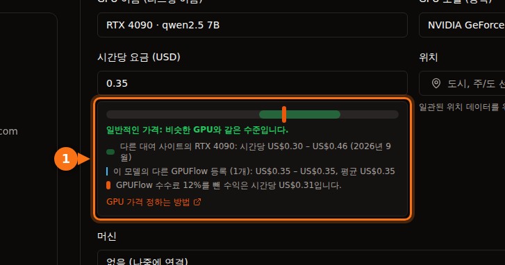

하루 대부분을 놀고 있는 게이밍 GPU가 있다면, 마켓플레이스에 대여로 내놓고 시간 단위로 돈을 받을 수 있습니다. 해볼 만한지는 네 가지 숫자에 달려 있습니다.

1. **대여자가 내는 금액:** 내 카드의 시간당 가격.
2. **플랫폼이 가져가는 몫.**
3. **돌아가는 동안 드는 전기료.**
4. **하루에 실제로 대여되는 시간.**

처음 세 가지는 쉽게 찾을 수 있습니다. 네 번째는 아무도 약속할 수 없는 숫자라서 범위로 보여 드립니다. 아래 가격은 모두 2026년 9월에 확인했으며, 출처는 글 끝에 있습니다.

## 1. 대여자가 내는 금액

2026년 9월 GPU 대여 사이트(Vast.ai, RunPod, Salad, SimplePod, TensorDock, Hyperstack, Lambda)의 일반적인 온디맨드 시간당 가격입니다.

| GPU | 일반적인 시간당 가격 | 가격대 중간값 |
| --- | --- | --- |
| RTX 3060 12 GB | $0.05 – $0.08 | $0.065 |
| RTX 4070 | $0.07 – $0.15 | $0.11 |
| RTX 3090 | $0.11 – $0.31 | $0.21 |
| RTX 4080 | $0.23 – $0.27 | $0.25 |
| RTX 4090 | $0.30 – $0.46 | $0.38 |
| RTX 5090 | $0.41 – $0.69 | $0.55 |

메모리는 속도만큼 중요합니다. 3090이나 4090 같은 24GB 카드는 12GB나 16GB 카드보다 큰 AI 모델을 돌릴 수 있고, 대여자는 그만큼 더 냅니다.

## 2. 플랫폼이 가져가는 몫

| 플랫폼 | 몫 | 출금 |
| --- | --- | --- |
| GPUFlow | 12%를 가져가고 88%를 제공자가 받음 | Stripe를 통해 은행 계좌로. 최소 $25, 출금 1회당 $2.50. |
| Vast.ai | Vast에 따르면 표시 가격은 보통 호스트 수익보다 약 25% 높음 | Wise, PayPal, Stripe. 최소 $20, 매주 정산. |
| Salad | 공개하지 않음 | PayPal, 기프트 카드, 게임 등 |

운영 방식도 다릅니다. Vast.ai 호스트는 Ubuntu를 쓰고, 대여자는 호스트에 컨테이너를 받아 SSH나 Jupyter로 접속합니다. Salad는 Windows 10이나 11에서 돌아갑니다. GPUFlow에서는 systemd를 쓰는 Linux 컴퓨터에서 명령어 하나를 실행하면 됩니다. 대여자는 API를 통해 내 AI 모델에만 접근할 수 있고, 내 머신의 셸에는 절대 접근할 수 없습니다. [대여자가 접근할 수 있는 것과 없는 것](https://docs.gpuflow.app/ko/providers/security/).

## 3. 전기료

계산식은 **소비 전력(kW) × kWh당 요금 = 시간당 비용**입니다.

소비 전력에는 각 카드의 공식 보드 전력을 썼습니다. 카드 자체가 끌어 쓰는 최대치에 가깝고, AI 텍스트 생성 중에는 이보다 적은 경우가 많습니다. 여기에 PC의 나머지 부품 전력이 더해집니다. 가장 정확한 방법은 직접 재는 것입니다. GPUFlow는 **내 머신**에서 GPU의 실시간 소비 전력을 보여 주고, 콘센트형 전력계를 쓰면 PC 전체의 전력을 잴 수 있습니다.

| GPU | 보드 전력 |
| --- | --- |
| RTX 3060 | 170 W |
| RTX 4070 | 200 W |
| RTX 3090 | 350 W |
| RTX 4080 | 320 W |
| RTX 4090 | 450 W |
| RTX 5090 | 575 W |

450W인 RTX 4090을 1시간 돌리는 전기료는 다음과 같습니다.

| 지역 | 가정용 요금 | 450W로 1시간 |
| --- | --- | --- |
| 미국(2026년 평균 전망) | 18.2 ¢/kWh | 약 $0.08 |
| 캐나다 | C$0.170/kWh | 약 C$0.08 |
| 영국(2026년 10~12월 요금 상한) | 26.32 p/kWh | 약 11.8 p |
| 독일 | €0.3869/kWh | 약 €0.17 |
| 프랑스 | €0.2561/kWh | 약 €0.12 |

미국에서는 4090이 대여 1시간에 버는 금액의 약 4분의 1을 전기료가 가져갑니다. 독일에서는 같은 1시간에 약 €0.17가 드니, 가격을 정하기 전에 내 요금을 꼭 확인하세요.

## 4. 종합하면

가격대 중간값, GPUFlow의 88% 몫, 미국 평균 전기료, 보드 전력 최대치를 기준으로 한 대여 1시간당 수치입니다.

| GPU | 받는 금액(88%) | 전기료 | 대여 1시간당 남는 금액 | 하루 4시간(월 120시간) | 하루 12시간(월 360시간) |
| --- | --- | --- | --- | --- | --- |
| RTX 3060 12 GB | $0.057 | $0.031 | **$0.026** | $3.15 | $9.45 |
| RTX 4070 | $0.097 | $0.036 | **$0.060** | $7.25 | $21.74 |
| RTX 3090 | $0.185 | $0.064 | **$0.121** | $14.53 | $43.60 |
| RTX 4080 | $0.220 | $0.058 | **$0.162** | $19.41 | $58.23 |
| RTX 4090 | $0.334 | $0.082 | **$0.253** | $30.30 | $90.90 |
| RTX 5090 | $0.484 | $0.105 | **$0.379** | $45.52 | $136.57 |

이 표에 빠진 것이 세 가지 있습니다.

- **대기 시간.** 대여자가 찾을 수 있으려면 PC가 켜져 있고 온라인이어야 합니다. 기다리는 동안에도 전력은 씁니다. 유휴 상태의 PC 전력도 재서 빼세요.
- **마모.** 팬과 서멀 페이스트는 장시간 부하에서 더 빨리 노화합니다. 케이스 통풍을 잘 유지하고 온도를 지켜보세요.
- **세금.** 대여 수입도 소득입니다. 세금은 거주지에 따라 다릅니다.

## 숫자로 본 결론

- **RTX 3090, 4080, 4090, 5090**은 하루 몇 시간씩 대여된다면 의미 있는 금액을 벌 수 있습니다. 가성비는 3090입니다. 24GB 메모리에 전력 비용이 낮습니다.
- **RTX 3060과 4070**은 시간당 수익이 매우 적습니다. 월 $3라면 3060이 GPUFlow의 최소 출금액 $25에 도달하는 데 약 8개월이 걸립니다. 전기료가 싸거나 PC를 어차피 켜 두는 경우에만 해볼 만합니다.
- **모든 것은 가동률이 결정합니다.** 같은 4090도 하루 4시간 대여되느냐 12시간 대여되느냐에 따라 월 $30가 되기도 하고 $91가 되기도 합니다. 몇 센트 할인보다 적정한 가격과 안정적으로 온라인인 머신이 더 많은 대여를 불러옵니다.

## 대여 시간을 늘리는 방법

1. **처음에는 가격대의 아래쪽 절반으로 정하세요.** 대여자는 비교합니다. 대여가 들어오기 시작하면 가격을 올리면 됩니다.
2. **온라인 상태를 유지하세요.** 오프라인 GPU는 대여될 수 없습니다. GPUFlow에서는 대여자가 오프라인 GPU에 대해 **온라인 시 알림 받기**를 클릭할 수 있고, 기다리는 대여자가 있으면 이메일로 알려 드립니다.
3. **인기 있는 모델을 제공하세요.** 리스팅에 `qwen2.5:7b`나 `llama3.1:8b`처럼 돌리는 모델 이름을 적으세요. 대여자는 모델 이름으로 검색합니다.
4. **일주일 뒤에 다시 확인하세요.** 거의 항상 대여되고 있다면 가격을 조금 올리세요. 대여가 없다면 조금 내리세요.

GPUFlow의 리스팅 양식은 내 가격이 다른 대여 사이트와 같은 카드의 다른 GPUFlow 리스팅에 비해 어디쯤인지, 수수료를 뺀 시간당 수익이 얼마인지 보여 줍니다.

## GPUFlow 출금이 가능한 곳

GPUFlow는 Stripe를 통해 **미국, 캐나다, 영국, 스위스, 유럽경제지역(EEA) 소재** 은행 계좌로 수익을 지급합니다. 다른 지역에 살아도 GPU를 등록하고 번 돈으로 다른 GPU를 대여할 수는 있지만, 아직 은행으로 출금할 수는 없습니다. 수익은 7일 동안(가입 30일 미만 계정은 14일) 보류된 뒤 출금할 수 있습니다. [GPUFlow에서 수익 받기](https://docs.gpuflow.app/ko/providers/getting-paid/).

## 내 숫자로 계산해 보기

**(시간당 가격 × 0.88) − (와트 ÷ 1,000 × kWh당 요금) = 대여 1시간당 남는 금액**

여기에 현실적으로 예상되는 대여 시간을 곱하세요. 결과가 월 몇 달러라면 마모를 감수할 가치가 없을 가능성이 큽니다. 수십 달러라면 한 달 정도 해 보고 실제 숫자를 확인해 볼 만합니다.

시작하려면 [GPU 온라인으로 올리기](https://docs.gpuflow.app/ko/providers/getting-started/)와 [GPU 가격 정하는 법](https://docs.gpuflow.app/ko/providers/pricing/)을 참고하세요.

## 관련 글

- [GPUFlow vs Vast.ai vs RunPod vs SaladCloud: 내 작업에 맞는 플랫폼은](/ko/gpuflow-vs-vast-ai-vs-runpod/)
- [GPU 대여의 실제 비용: 시간당 가격에 빠져 있는 것들](/ko/hidden-fees-in-gpu-rental/)

## 출처

모두 2026년 9월에 확인했습니다.

- GPU 대여 가격대: [GPUFlow 문서, GPU 가격 정하는 법](https://docs.gpuflow.app/ko/providers/pricing/)
- GPUFlow 수수료, 보류, 출금: [GPUFlow 문서, 수익 받기](https://docs.gpuflow.app/ko/providers/getting-paid/)
- Vast.ai 호스트 수익: [vast.ai 글](https://vast.ai/article/how-much-money-can-you-earn-renting-out-your-gpu-on-vast-ai) (2026년 5월 18일), 지급: [docs.vast.ai/host/payment.md](https://docs.vast.ai/host/payment.md), 호스팅 요구 사항: [docs.vast.ai/host/hosting-overview.md](https://docs.vast.ai/host/hosting-overview.md)
- Salad: [salad.com/download](https://salad.com/download/), [PayPal 교환](https://support.salad.com/rewards/redeeming-your-rewards/how-to-redeem-paypal/)
- 보드 전력: NVIDIA 제품 페이지 [RTX 3060](https://www.nvidia.com/en-us/geforce/graphics-cards/30-series/rtx-3060-3060ti/), [RTX 4080](https://www.nvidia.com/en-us/geforce/graphics-cards/40-series/rtx-4080-family/), [RTX 4090](https://www.nvidia.com/en-us/geforce/graphics-cards/40-series/rtx-4090/), [RTX 5090](https://www.nvidia.com/en-us/geforce/graphics-cards/50-series/rtx-5090/), RTX 3090: [TechPowerUp](https://www.techpowerup.com/gpu-specs/geforce-rtx-3090.c3622), RTX 4070: [TechSpot](https://www.techspot.com/review/2663-nvidia-geforce-rtx-4070/)
- 미국 전기료: [EIA 단기 에너지 전망](https://www.eia.gov/outlooks/steo/report/elec_coal_renew.php) (2026년 9월)
- 영국 전기료: [Ofgem 요금 상한](https://www.ofgem.gov.uk/your-energy-supply/your-energy-bill/energy-price-cap-unit-rates-and-standing-charges)
- 독일·프랑스 전기료, 2025년 하반기: [Eurostat 전기 요금 통계](https://ec.europa.eu/eurostat/statistics-explained/index.php?title=Electricity_price_statistics), [Eurostat nrg_pc_204 프랑스 데이터](https://ec.europa.eu/eurostat/api/dissemination/statistics/1.0/data/nrg_pc_204?geo=FR&nrg_cons=KWH2500-4999&unit=KWH&tax=I_TAX&currency=EUR&lastTimePeriod=1)
- 캐나다 전기료, 2025년 6월: [GlobalPetrolPrices](https://www.globalpetrolprices.com/Canada/electricity_prices/)
