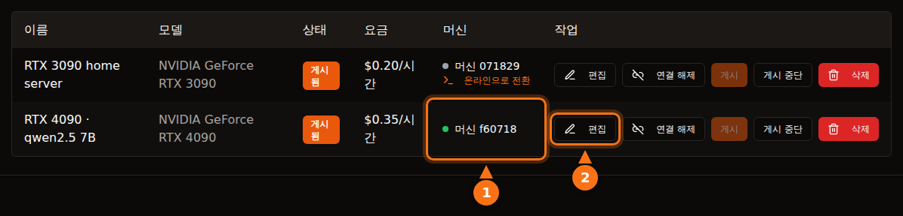

플랫폼을 알고 고른다면 그런대로 안전합니다. 다만 "안전"의 의미가 플랫폼마다 다릅니다. Vast.ai 같은 컨테이너 플랫폼에서는 대여자가 내 머신에서 자기 코드를 돌리고, 그 트래픽은 내 IP 주소로 나갑니다. 격리가 막아 주는 것은 내 파일이지, 내 네트워크나 전기 요금이 아닙니다. GPUFlow 같은 API 전용 구조에서는 대여자가 내가 설치한 모델에 채팅 요청만 보낼 수 있고, 위험의 방향이 반대가 됩니다. 프롬프트가 내 머신에서 읽을 수 있는 상태이므로, 대여자는 비밀스러운 내용을 보내면 안 됩니다.

이 글은 양쪽 방향을 모두 다룹니다. 다른 플랫폼에 관한 내용은 2026년 9월에 각 플랫폼의 공식 문서로 확인했고, GPUFlow에 관한 내용은 모두 소스 코드와 문서에서 가져왔습니다. 출처는 글 끝에 있습니다.

## 컨테이너 플랫폼에서 대여자가 할 수 있는 일

GPU 마켓플레이스 대부분은 컨테이너를 빌려줍니다. 대여자는 이미지를 고르고, 셸을 받고, 원하는 것을 실행합니다. 호스트인 내 입장에서는 다섯 가지를 생각해야 합니다.

- **임의의 코드.** 대여자의 코드는 컨테이너나 VM 안에서 내 커널 위로 돌아갑니다. 격리는 훌륭하지만 완벽하지 않습니다. 컨테이너 탈출은 드물지만, 바로 이런 버그가 커널과 드라이버 업데이트로 패치되고, 그 업데이트는 내가 설치해야 합니다.
- **내 IP 주소.** 컨테이너에서 나가는 트래픽은 내 인터넷 회선을 통해 나갑니다. 대여자가 사이트를 스크래핑하거나, 스팸을 보내거나, 인터넷을 스캔하면 악용 신고는 내 IP 앞으로 내 ISP에 들어갑니다. Vast.ai 약관은 사용자 콘텐츠로 인한 청구에 대해 사용자가 제공자를 면책한다고 규정합니다. 제3자와의 분쟁에서는 도움이 되지만, ISP가 나에게 경고를 보내는 것은 막지 못합니다.
- **열린 포트.** Vast.ai 호스팅 가이드에는 "대부분의 작업에서 클라이언트가 머신에 직접 접속하려면 포트가 열려 있어야 한다"라고 나와 있습니다. 그래서 공유기에서 포트 포워딩을 해야 합니다.
- **디스크.** 대여자는 이미지, 모델, 데이터셋을 내 드라이브에 내려받습니다. Vast.ai는 클라이언트가 볼륨을 삭제하면 공간을 비우지만, 대여가 진행되는 동안에는 그 공간이 대여자의 것입니다.
- **전력, 열, 드라이버.** Vast.ai는 호스트에게 "대여 기간 동안 GPU가 거의 최대 용량으로 쓰일 것으로 예상하라"고 안내합니다. 몇 시간 동안 보드 전력을 최대로 쓰고, 방에 열이 차고, 팬이 돈다는 뜻입니다. 컨테이너 플랫폼은 설정도 까다롭습니다. Vast.ai 가이드는 Ubuntu 설치, 디스크 파티션 나누기, NVIDIA 드라이버 설치, 공유기 포트 개방을 요구합니다.

## Vast.ai, Salad, RunPod의 대여자 격리 방식

| | Vast.ai | Salad | RunPod Community Cloud |
| --- | --- | --- | --- |
| **대여자가 받는 것** | SSH나 Jupyter가 되는 컨테이너(또는 VM) | 직접 배포한 컨테이너, 그 안으로 들어가는 SSH와 웹 터미널 | 포드(컨테이너) |
| **격리** | 비특권 Docker 컨테이너 | 하이퍼바이저 위 Linux VM, 그 안의 컨테이너 | "엄격히 분리된 자체 컨테이너" |
| **인바운드 포트** | 대부분의 작업에 필요 | 기본적으로 차단 | 명시되지 않음 |
| **신규 호스트** | 받음, Ubuntu | 받음, Windows 10/11 | 더 이상 받지 않음 |

- **Vast.ai**는 "클라이언트는 비특권 Docker 컨테이너에 격리되며 자기 데이터에만 접근할 수 있다"라고 설명합니다. 네임스페이스와 cgroup이 분리되고, 네트워크, 파일 시스템, 프로세스도 격리됩니다. 대여자에게는 "제공자마다 보안 수준이 크게 다르다"라고 경고하고, 민감한 작업은 인증된 데이터센터로 구성된 Secure Cloud 등급을 쓰라고 권합니다.
- **Salad**는 "워크로드는 Linux 가상 머신 위의 OCI 호환 컨테이너에서 실행되며, Windows와 호스트의 다른 모든 프로세스로부터 격리된다"라고 설명하며, 인바운드 연결은 기본적으로 차단합니다. 호스트로부터 대여자도 보호합니다. 호스트가 "Linux 환경에 접근하려 하면 환경을 자동으로 파기하고 해당 머신을 차단 목록에 올린다"는 것입니다. 이와 별도로 Salad는 내 회선으로 "프리미엄 스트리밍 플랫폼의 동영상 콘텐츠를 처리하는" 선택형 대역폭 공유 작업을 제공합니다. 지원 페이지는 이 작업이 데이터 사용량을 늘리고 "드물게 해당 스트리밍 플랫폼에서 일시적인, 보통 1~2일의 콘텐츠 제한"을 일으킬 수 있다고 경고합니다.
- **RunPod**는 "Community Cloud의 신규 호스트는 더 이상 받지 않는다"라고 밝혔습니다. 기존 용량에 대해서는 "각 포드와 워커가 자체 컨테이너에서 작동한다"고 하며, 약관은 "호스트가 포드와 워커 데이터를 들여다보는 것을 금지한다"고 합니다.

세 곳 모두 대여자를 내 시스템과 격리합니다. 하지만 정상처럼 보이는 대여자의 트래픽이 내 회선으로 나가는 것은 어느 곳도 막지 못하고, 막는다고 주장하지도 않습니다.

## GPUFlow 구조는 무엇이 다른가

GPUFlow가 빌려주는 것은 머신이 아니라 OpenAI 호환 API 뒤의 AI 모델입니다. 그래서 대여자가 닿을 수 있는 범위가 달라집니다. 코드가 실제로 하는 일은 다음과 같습니다.

**에이전트.** 설치 프로그램은 Go 바이너리 하나를 `/usr/local/bin/gpuflow-agent`에 두고 systemd 서비스로 실행합니다. Docker는 없습니다. 서비스 유닛은 `DynamicUser=yes`(임시 비특권 사용자), `NoNewPrivileges=yes`(권한을 더 얻을 수 없음), `ProtectSystem=strict`(시스템이 읽기 전용), `ProtectHome=yes`(홈 폴더가 보이지 않음), `PrivateTmp=yes`를 씁니다. 추론 엔진은 기본적으로 Ollama이며, Ollama 자체 설치 프로그램으로 별도 서비스로 설치됩니다(제공자가 에이전트를 자기 OpenAI 호환 서버로 연결할 수도 있습니다). 이 보안 설정은 에이전트에 적용되고, Ollama에는 적용되지 않습니다.

**네트워크.** 에이전트는 나가는 연결만 만듭니다. `wss://ws.gpuflow.app`으로의 TLS WebSocket, 그리고 등록과 15초마다의 하트비트를 위한 `gpuflow.app`으로의 HTTPS입니다. 포트를 열지 않으니 공유기에서 포워딩할 것도 없고, 대여자는 내 IP 주소를 알 수 없습니다. 에이전트는 Ollama의 기본 루프백 주소인 `127.0.0.1:11434`로 Ollama와 통신합니다.

**대여자가 호출할 수 있는 것.** 대여자는 `https://gpuflow.app/v1`용 API 키를 받습니다. `GET /v1/models`는 GPUFlow가 직접 응답하고, 내 머신으로 넘기는 요청은 `POST /v1/chat/completions` 하나뿐입니다. 에이전트에도 자체 잠금 장치가 하나 더 있습니다. 정확히 네 경로(`/v1/chat/completions`, `/v1/completions`, `/v1/embeddings`, `/v1/models`)만 프록시하고 나머지는 모두 거부합니다. 모델을 받거나 지우거나 만드는 Ollama 고유의 `/api/*` 엔드포인트도 여기에 포함됩니다. 에이전트가 처리하는 메시지 유형은 추론 요청 하나이고, 그 밖의 것은 무시합니다.

그래서 대여자는 내 머신에 대해 셸도, SSH도, 파일도, 네트워크 접근도 없습니다. 70 GB 모델을 내 디스크에 내려받을 수 없고, 내 회선으로 인터넷에 나갈 수도 없습니다. 할 수 있는 것은 예약한 시간 동안 내 GPU를 바쁘게 만드는 것, 그리고 `model` 필드에 내가 설치한 모델 중 아무거나 지정하는 것입니다.

<figure>
<svg viewBox="0 0 720 380" role="img" aria-labelledby="d1-title" xmlns="http://www.w3.org/2000/svg" font-family="system-ui, sans-serif" font-size="15">
<title id="d1-title">컨테이너 호스트와 GPUFlow 같은 API 전용 구조에서 대여자가 할 수 있는 일 비교</title>
<rect x="0" y="0" width="720" height="380" fill="#ffffff"/>
<text x="20" y="40" fill="#64748b" font-weight="bold">대여자가 할 수 있는 일</text>
<text x="470" y="40" text-anchor="middle" fill="#1e1b4b" font-weight="bold">컨테이너 호스트</text>
<text x="630" y="40" text-anchor="middle" fill="#1e1b4b" font-weight="bold">GPUFlow (API)</text>
<line x1="20" y1="55" x2="700" y2="55" stroke="#e2e8f0" stroke-width="2"/>
<text x="20" y="89" fill="#1e1b4b">자기 프로그램 실행</text>
<rect x="430" y="70" width="80" height="28" rx="14" fill="#fff7ed" stroke="#f97316" stroke-width="2"/>
<text x="470" y="89" text-anchor="middle" fill="#1e1b4b">예</text>
<rect x="590" y="70" width="80" height="28" rx="14" fill="#f0fdf4" stroke="#16a34a" stroke-width="2"/>
<text x="630" y="89" text-anchor="middle" fill="#1e1b4b">아니요</text>
<line x1="20" y1="110" x2="700" y2="110" stroke="#e2e8f0" stroke-width="1"/>
<text x="20" y="133" fill="#1e1b4b">셸 또는 SSH 접속</text>
<rect x="430" y="114" width="80" height="28" rx="14" fill="#fff7ed" stroke="#f97316" stroke-width="2"/>
<text x="470" y="133" text-anchor="middle" fill="#1e1b4b">예</text>
<rect x="590" y="114" width="80" height="28" rx="14" fill="#f0fdf4" stroke="#16a34a" stroke-width="2"/>
<text x="630" y="133" text-anchor="middle" fill="#1e1b4b">아니요</text>
<line x1="20" y1="154" x2="700" y2="154" stroke="#e2e8f0" stroke-width="1"/>
<text x="20" y="177" fill="#1e1b4b">내 디스크에 파일 쓰기</text>
<rect x="430" y="158" width="80" height="28" rx="14" fill="#fff7ed" stroke="#f97316" stroke-width="2"/>
<text x="470" y="177" text-anchor="middle" fill="#1e1b4b">예</text>
<rect x="590" y="158" width="80" height="28" rx="14" fill="#f0fdf4" stroke="#16a34a" stroke-width="2"/>
<text x="630" y="177" text-anchor="middle" fill="#1e1b4b">아니요</text>
<line x1="20" y1="198" x2="700" y2="198" stroke="#e2e8f0" stroke-width="1"/>
<text x="20" y="221" fill="#1e1b4b">내 IP로 트래픽 보내기</text>
<rect x="430" y="202" width="80" height="28" rx="14" fill="#fff7ed" stroke="#f97316" stroke-width="2"/>
<text x="470" y="221" text-anchor="middle" fill="#1e1b4b">예</text>
<rect x="590" y="202" width="80" height="28" rx="14" fill="#f0fdf4" stroke="#16a34a" stroke-width="2"/>
<text x="630" y="221" text-anchor="middle" fill="#1e1b4b">아니요</text>
<line x1="20" y1="242" x2="700" y2="242" stroke="#e2e8f0" stroke-width="1"/>
<text x="20" y="265" fill="#1e1b4b">공유기 포트 개방 필요</text>
<rect x="430" y="246" width="80" height="28" rx="14" fill="#fff7ed" stroke="#f97316" stroke-width="2"/>
<text x="470" y="265" text-anchor="middle" fill="#1e1b4b">대개</text>
<rect x="590" y="246" width="80" height="28" rx="14" fill="#f0fdf4" stroke="#16a34a" stroke-width="2"/>
<text x="630" y="265" text-anchor="middle" fill="#1e1b4b">아니요</text>
<line x1="20" y1="286" x2="700" y2="286" stroke="#e2e8f0" stroke-width="1"/>
<text x="20" y="309" fill="#1e1b4b">모델 내려받기, 삭제</text>
<rect x="430" y="290" width="80" height="28" rx="14" fill="#fff7ed" stroke="#f97316" stroke-width="2"/>
<text x="470" y="309" text-anchor="middle" fill="#1e1b4b">예</text>
<rect x="590" y="290" width="80" height="28" rx="14" fill="#f0fdf4" stroke="#16a34a" stroke-width="2"/>
<text x="630" y="309" text-anchor="middle" fill="#1e1b4b">아니요</text>
<line x1="20" y1="330" x2="700" y2="330" stroke="#e2e8f0" stroke-width="1"/>
<text x="20" y="353" fill="#1e1b4b">몇 시간 동안 GPU 점유</text>
<rect x="430" y="334" width="80" height="28" rx="14" fill="#eef2ff" stroke="#6366f1" stroke-width="2"/>
<text x="470" y="353" text-anchor="middle" fill="#1e1b4b">예</text>
<rect x="590" y="334" width="80" height="28" rx="14" fill="#eef2ff" stroke="#6366f1" stroke-width="2"/>
<text x="630" y="353" text-anchor="middle" fill="#1e1b4b">예</text>
</svg>
<figcaption>컨테이너 열은 Vast.ai 방식의 호스팅입니다. 파일과 트래픽은 대여자의 컨테이너 안에 머물지만, 내 디스크와 내 회선을 씁니다. 세부 사항은 플랫폼마다 다릅니다. Salad는 컨테이너를 Linux VM 안에서 돌리고 인바운드 연결을 기본적으로 차단합니다. GPUFlow에서는 대여자가 내가 설치한 모델에 채팅 요청만 보냅니다.</figcaption>
</figure>

## 데이터 경로, 구간별로

대여자가 읽어야 할 부분입니다. 채팅 요청은 네 가지 소프트웨어를 거치고, 텍스트는 그중 여러 곳에서 읽을 수 있는 상태입니다.

<figure>
<svg viewBox="0 0 720 330" role="img" aria-labelledby="d2-title" xmlns="http://www.w3.org/2000/svg" font-family="system-ui, sans-serif" font-size="15">
<title id="d2-title">GPUFlow 채팅 요청은 대여자의 앱에서 gpuflow.app, 릴레이, 제공자 PC의 에이전트, Ollama로 이동하고, 답변은 같은 길로 스트리밍되어 돌아옵니다</title>
<rect x="0" y="0" width="720" height="330" fill="#ffffff"/>
<rect x="480" y="50" width="230" height="200" rx="12" fill="#fff7ed" stroke="#f97316" stroke-width="2" stroke-dasharray="6 4"/>
<text x="595" y="76" text-anchor="middle" fill="#1e1b4b" font-weight="bold">제공자 PC</text>
<rect x="10" y="110" width="110" height="70" rx="10" fill="#eef2ff" stroke="#6366f1" stroke-width="2"/>
<text x="65" y="141" text-anchor="middle" fill="#1e1b4b">대여자의</text>
<text x="65" y="161" text-anchor="middle" fill="#1e1b4b">앱</text>
<rect x="160" y="110" width="120" height="70" rx="10" fill="#eef2ff" stroke="#6366f1" stroke-width="2"/>
<text x="220" y="141" text-anchor="middle" fill="#1e1b4b">GPUFlow API</text>
<text x="220" y="161" text-anchor="middle" fill="#64748b" font-size="12">gpuflow.app/v1</text>
<rect x="320" y="110" width="105" height="70" rx="10" fill="#eef2ff" stroke="#6366f1" stroke-width="2"/>
<text x="372" y="141" text-anchor="middle" fill="#1e1b4b">릴레이</text>
<text x="372" y="161" text-anchor="middle" fill="#64748b" font-size="12">ws.gpuflow.app</text>
<rect x="492" y="110" width="90" height="70" rx="10" fill="#ffffff" stroke="#6366f1" stroke-width="2"/>
<text x="537" y="141" text-anchor="middle" fill="#1e1b4b">GPUFlow</text>
<text x="537" y="161" text-anchor="middle" fill="#1e1b4b">에이전트</text>
<rect x="610" y="110" width="90" height="70" rx="10" fill="#ffffff" stroke="#6366f1" stroke-width="2"/>
<text x="655" y="141" text-anchor="middle" fill="#1e1b4b">Ollama</text>
<text x="655" y="161" text-anchor="middle" fill="#64748b" font-size="12">127.0.0.1</text>
<line x1="124" y1="145" x2="156" y2="145" stroke="#16a34a" stroke-width="4"/>
<line x1="284" y1="145" x2="316" y2="145" stroke="#64748b" stroke-width="4"/>
<line x1="429" y1="145" x2="488" y2="145" stroke="#16a34a" stroke-width="4"/>
<line x1="586" y1="145" x2="606" y2="145" stroke="#f97316" stroke-width="4"/>
<text x="140" y="102" text-anchor="middle" fill="#16a34a" font-size="13">TLS</text>
<text x="300" y="102" text-anchor="middle" fill="#64748b" font-size="13">내부</text>
<text x="452" y="102" text-anchor="middle" fill="#16a34a" font-size="13">TLS</text>
<text x="596" y="102" text-anchor="middle" fill="#f97316" font-size="13">평문</text>
<text x="65" y="212" text-anchor="middle" fill="#64748b" font-size="12">텍스트를</text>
<text x="65" y="228" text-anchor="middle" fill="#64748b" font-size="12">작성하는 곳</text>
<text x="220" y="212" text-anchor="middle" fill="#64748b" font-size="12">텍스트를 읽고,</text>
<text x="220" y="228" text-anchor="middle" fill="#64748b" font-size="12">토큰 수만</text>
<text x="220" y="244" text-anchor="middle" fill="#64748b" font-size="12">저장</text>
<text x="372" y="212" text-anchor="middle" fill="#64748b" font-size="12">그대로 전달,</text>
<text x="372" y="228" text-anchor="middle" fill="#64748b" font-size="12">본문은</text>
<text x="372" y="244" text-anchor="middle" fill="#64748b" font-size="12">기록 안 함</text>
<text x="595" y="212" text-anchor="middle" fill="#1e1b4b" font-size="13" font-weight="bold">메모리에 평문으로 존재</text>
<text x="595" y="230" text-anchor="middle" fill="#1e1b4b" font-size="13" font-weight="bold">소유자에게 root 권한</text>
<line x1="20" y1="295" x2="50" y2="295" stroke="#16a34a" stroke-width="4"/>
<text x="58" y="300" fill="#1e1b4b" font-size="13">인터넷 구간 TLS</text>
<line x1="235" y1="295" x2="265" y2="295" stroke="#64748b" stroke-width="4"/>
<text x="273" y="300" fill="#1e1b4b" font-size="13">GPUFlow 내부</text>
<line x1="420" y1="295" x2="450" y2="295" stroke="#f97316" stroke-width="4"/>
<text x="458" y="300" fill="#1e1b4b" font-size="13">제공자 PC 안에서는 평문</text>
</svg>
<figcaption>요청은 왼쪽에서 오른쪽으로 가고, 답변은 같은 길로 스트리밍되어 돌아옵니다. 인터넷을 지나는 구간은 TLS가 보호하지만, TLS는 각 서버에서 끝납니다. 그래서 텍스트는 GPUFlow 서버가 전달하는 동안 그 서버에서, 그리고 Ollama가 모델을 돌리는 제공자 PC에서 읽을 수 있는 상태입니다.</figcaption>
</figure>

1. **대여자에서 gpuflow.app으로:** HTTPS. 사이트는 Cloudflare 뒤에 있습니다.
2. **GPUFlow API에서 릴레이로:** GPUFlow 내부 연결입니다. API는 키를 확인하고, 요청 본문을 바꾸지 않고 전달하며, 토큰 수를 기록합니다. 요청이나 답변의 텍스트는 저장하지 않으며, 개인정보 처리방침에도 그렇게 적혀 있습니다.
3. **릴레이에서 제공자의 에이전트로:** 에이전트가 연 TLS WebSocket입니다. 릴레이는 각 메시지의 유형만 기록하고 내용은 기록하지 않습니다.
4. **에이전트에서 Ollama로:** 제공자 PC 안의 루프백 주소로 가는 평문 HTTP입니다. 에이전트도 요청 본문을 기록하지 않습니다.

모델까지 이어지는 종단 간 암호화는 없고, 일반적인 추론 엔진으로는 있을 수도 없습니다. 모델이 답하려면 프롬프트를 읽어야 하기 때문입니다.

## 제공자가 볼 수 있는 것

분명히 말하겠습니다. **제공자의 컴퓨터는 프롬프트와 답변을 평문으로 다룹니다.** Ollama가 그곳에서 돌아가고, 제공자는 그 머신의 root 권한을 가지고 있습니다(설치 프로그램이 root를 요구합니다). 마음먹은 제공자라면 루프백 트래픽을 캡처하거나, 엔진을 바꾸거나, 에이전트를 다른 서버로 연결할 수 있습니다.

이를 막는 것은 계약입니다. GPUFlow 약관은 제공자가 "대여자의 요청이나 답변을 기록, 열람, 보관, 공유하거나 답변을 변경해서는 안 된다"고 규정합니다. 위반하면 계정에 조치가 따르는 규칙이지, 기술적 차단은 아닙니다. 개인정보 처리방침도 대여자에게 같은 내용을 알립니다. 대여가 진행되는 동안 요청과 답변은 제공자의 컴퓨터를 거칩니다.

프롬프트 외에 제공자가 보는 것은 대여자의 GPUFlow 사용자 이름, 그리고 대여가 시작될 때 받는 알림(대여 ID, 리스팅, 시간)입니다. 대여자는 제공자 머신의 통계를 전혀 볼 수 없습니다. GPU 온도, VRAM, 소비 전력 등의 원격 측정 정보는 소유자의 대시보드에만 표시됩니다.

대여자를 위한 실용적인 원칙은 이렇습니다. **비밀 정보, 인증 정보, 타인의 개인정보, 규제 대상 데이터(의료, 금융, 고객 기밀)는 어떤 커뮤니티 GPU로도 보내지 마세요.** GPUFlow에도 해당하고, 남의 가정용 PC에 있는 컨테이너에도 똑같이 해당합니다. 그곳의 호스트도 같은 root 권한으로 메모리와 디스크를 들여다볼 수 있습니다. 민감한 작업은 내가 통제하는 하드웨어에서 모델을 돌리거나, 컴플라이언스에 필요한 계약을 체결해 주는 업체를 쓰세요. 정책 측면은 [일부 기업이 공개 AI 도구를 금지하는 이유](/ko/why-corporate-policies-banning-chatgpt/)에서, 컨테이너 측면은 [공용 GPU 노드에서 데이터셋 보호하기](/ko/how-to-secure-dataset-on-public-gpu-node/)에서 다룹니다.

## GPUFlow에 남아 있는 위험

API 전용 구조는 공격 표면을 줄입니다. 없애지는 못합니다. 없는 척하기보다 남은 것을 적어 두겠습니다.

- **Ollama는 신뢰할 수 없는 입력을 파싱합니다.** 대여자의 모든 요청은 결국 JSON으로 Ollama에 전달됩니다. 침입 경로가 있다면 Ollama의 버그일 가능성이 가장 크므로 업데이트하세요. 에이전트의 허용 목록은 대여자가 Ollama의 모델 관리 엔드포인트에 접근하지 못하게 하지만, 채팅 경로의 버그까지 고쳐 주지는 못합니다.
- **설치 프로그램은 root로 실행됩니다.** gpuflow.app의 스크립트를 `sudo bash`로 파이프해 실행하고, 이 스크립트는 Ollama 설치 스크립트도 실행합니다. 둘 다 먼저 읽어 보세요. 어떤 호스팅 소프트웨어든 그렇게 하는 것이 좋습니다.
- **자동 업데이트가 없습니다.** 에이전트는 스스로 업데이트하지 않습니다. 새 버전을 받으려면 설치 프로그램을 다시 실행하세요. SHA256SUMS 파일이 공개되어 있으면 설치 프로그램이 바이너리를 그 파일로 검증합니다.
- **부하.** 요청 수 제한은 없습니다. 대여자는 예약한 모든 시간 동안 GPU를 최대 부하로 돌릴 수 있고, 가장 큰 모델을 포함해 내가 설치한 어떤 모델이든 쓸 수 있습니다.
- **열과 전력.** 어디서나 마찬가지입니다. 대여된 시간은 부하가 걸린 시간입니다.

## 제공자 체크리스트

1. **빌려줘도 괜찮은 머신을 쓰세요.** 가능하면 전용 머신이 좋습니다. 최소한 플랫폼과 관계없이, 대여하는 컴퓨터에 업무 파일이나 비밀번호 저장소를 두지 마세요. GPUFlow에서는 에이전트가 이미 홈 폴더가 가려진 임시 시스템 사용자로 돌아가지만, Ollama는 별도 서비스입니다.
2. **전력을 제한하세요.** `sudo nvidia-smi -pl 280`은 보드 전력 한도를 와트 단위로 설정합니다(root가 필요하고, 값은 카드의 최소·최대 한도 사이여야 합니다). Puget Systems에 따르면 270~280 W로 제한한 RTX 3090은 성능의 약 95%를 유지했고, systemd 유닛으로 부팅할 때마다 한도를 다시 적용하는 방법도 소개합니다.
3. **전기료부터 계산하세요.** GPU가 일하는 동안 **내 머신**에서 소비 전력을 확인하고, 킬로와트에 kWh당 전기 요금을 곱하세요. [게이밍 GPU로 얼마나 벌 수 있을까](/ko/how-much-can-you-earn-renting-out-your-gpu/)에서 일반적인 카드와 다섯 개 나라 기준으로 계산해 두었습니다.
4. **온도를 지켜보세요.** 실시간 통계에 GPU, 핫스팟, 메모리 온도와 팬 속도가 나옵니다. 케이스에 공기가 잘 통하는지 확인하세요.
5. **시스템을 최신 상태로 유지하세요.** Linux, GPU 드라이버, Ollama 업데이트를 설치하세요. GPUFlow 설치 프로그램은 GPU 드라이버를 관리하지 않습니다. 재부팅 후에는 systemd가 에이전트를 다시 시작합니다.
6. **멈추는 방법을 알아 두세요.** **내 GPU**에서 리스팅을 게시 중단하거나, `sudo systemctl stop gpuflow-agent`를 실행하세요(`start`로 다시 켭니다). 대여가 진행 중이면 대시보드에서 리스팅이나 머신을 바꿀 수 없고, 대여자의 대여를 끝낼 수도 없습니다. 대여 중에 에이전트를 멈추면 10분 뒤 대여가 끝나고, 마지막 하트비트 시점까지만 수익을 받습니다.
7. **제거 방법을 알아 두세요.** 절차는 [문제 해결 문서](https://docs.gpuflow.app/ko/providers/troubleshooting/)에 있습니다. Ollama는 직접 제거할 때까지 설치된 채로 남습니다.

컨테이너 플랫폼이라면 두 가지를 더하세요. 공유기 포트를 정말 열고 싶은지 결정하고, ISP가 악용 신고를 어떻게 처리하는지 물어보세요. 대여자의 트래픽에 내 IP 주소가 찍히기 때문입니다.

## 대여자 체크리스트

1. **모든 커뮤니티 GPU를 낯선 사람의 컴퓨터로 대하세요.** 프롬프트에 API 키, 비밀번호, 고객 기록, 의료·금융 데이터를 넣지 마세요.
2. **필요 없는 정보는 지우세요.** 보내기 전에 이름과 계좌 번호를 자리 표시자로 바꾸세요.
3. **키를 지키세요.** GPUFlow에서는 대여가 끝나면 키가 작동을 멈춥니다. 유출되었다면 **새 키**로 기존 키를 즉시 폐기하고, **지금 종료**로 과금을 멈추고 쓰지 않은 시간을 환불받으세요.
4. **답변이 틀리거나 변조될 수 있다고 가정하세요.** 약관은 제공자가 답변을 바꾸는 것을 금지하지만, 중요한 내용은 확인하세요.
5. **민감한 작업에는 맞는 도구를 쓰세요.** 직접 호스팅하거나, 필요한 계약을 제공하는 업체를 쓰세요. 그 밖의 경우는 [앱에서 키 쓰는 법](/ko/use-openai-compatible-api-key-in-apps/)을 참고하세요.

## 출처

모두 2026년 9월에 확인했습니다.

- GPUFlow: [대여자가 접근할 수 있는 것](https://docs.gpuflow.app/ko/providers/security/), [제공자 시작하기](https://docs.gpuflow.app/ko/providers/getting-started/), [가격과 전기료](https://docs.gpuflow.app/ko/providers/pricing/), [문제 해결과 제거](https://docs.gpuflow.app/ko/providers/troubleshooting/), [API 빠른 시작](https://docs.gpuflow.app/ko/renters/api-quickstart/)
- Vast.ai: [호스팅 개요](https://docs.vast.ai/host/hosting-overview.md), [보안 FAQ](https://docs.vast.ai/documentation/reference/faq/security), [Linux 가상 머신](https://docs.vast.ai/linux-virtual-machines), [서비스 약관](https://vast.ai/terms), [프라이빗 AI 모델 실행](https://vast.ai/article/running-private-ai-models-without-the-risk-of-data-exposure)
- Salad: [보안](https://salad.com/security), [컨테이너 워크로드와 내 PC](https://community.salad.com/container-workloads-and-your-pc/), [대역폭 공유](https://support.salad.com/faq/jobs/what-is-bandwidth-sharing/), [SSH와 터미널](https://docs.salad.com/container-engine/explanation/container-groups/ssh-and-terminal.md), [다운로드와 시스템 요구 사항](https://salad.com/download/)
- RunPod: [포드 선택](https://docs.runpod.io/pods/choose-a-pod), [데이터 보안과 법적 준수](https://docs.runpod.io/hosting/partner-requirements)
- Ollama: [FAQ(기본 바인드 주소)](https://docs.ollama.com/faq)
- NVIDIA: [nvidia-smi 매뉴얼](https://docs.nvidia.com/deploy/nvidia-smi/index.html)
- Puget Systems: [systemd와 nvidia-smi로 RTX 3090 전력 제한하기](https://www.pugetsystems.com/labs/hpc/quad-rtx3090-gpu-power-limiting-with-systemd-and-nvidia-smi-1983/)
