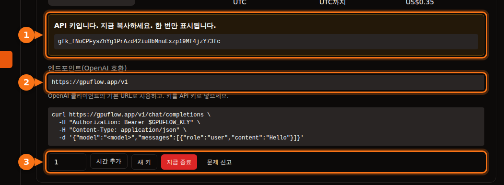

많은 AI 도구는 OpenAI와 같은 API를 쓰는 제공 업체라면 OpenAI 대신 연결해 쓸 수 있습니다. 필요한 것은 언제나 같은 세 가지입니다.

| 항목 | 예시 |
| --- | --- |
| **Base URL** (API base, 엔드포인트, 호스트라고도 부름) | `https://gpuflow.app/v1` |
| **API 키** | `gfk_...` |
| **모델 이름** | `qwen2.5:7b` |

이 글에서는 GPUFlow 대여를 예시로 쓰지만, OpenAI 호환 서버라면 로컬 Ollama나 llama.cpp, vLLM, OpenRouter 등 무엇이든 단계는 같습니다. 세 값만 바꾸면 됩니다.

GPUFlow에서는 GPU를 대여한 뒤 **대시보드 → 현재 대여**에서 세 값을 모두 찾을 수 있습니다.



## 시작하기 전에: 엔드포인트와 모델 이름 확인

명령어 하나로 키가 작동하는지, 모델 이름이 무엇인지 알 수 있습니다.

```bash
curl https://gpuflow.app/v1/models \
  -H "Authorization: Bearer gfk_your_key"
```

응답에 모델 목록이 나옵니다. `qwen2.5:7b` 같은 `id`를 적힌 그대로 복사하세요. 앱이 작동하지 않는 가장 흔한 이유는 모델 이름이 틀린 것입니다.

**엔드포인트가 무엇을 지원하는지 알아 두세요.** GPUFlow 엔드포인트는 `/v1/models`와 `/v1/chat/completions`를 스트리밍과 함께 제공합니다. 임베딩, 새 Responses API, 이미지 생성은 제공하지 않습니다. 앱 기능 중 이런 API가 필요한 것은 아래에서 따로 짚어 드립니다.

## 채팅 앱

### Open WebUI

1. **Settings → Admin → Connections**를 엽니다.
2. **Manage OpenAI API Connections**에서 **+ (Add Connection)** 버튼을 클릭합니다.
3. 다음을 입력합니다.
   - **URL:** `https://gpuflow.app/v1`
   - **API Key:** 내 키
4. **Verify Connection**을 클릭해 연결을 테스트한 다음(저장만으로는 테스트되지 않습니다) **Save**를 클릭합니다.

Open WebUI는 `/models`에서 모델 목록을 알아서 읽어 옵니다. Docker로 실행한다면 대신 `OPENAI_API_BASE_URL`과 `OPENAI_API_KEY`를 설정할 수도 있지만, 이 값은 Open WebUI를 처음 시작할 때만 읽습니다. 그 뒤로는 관리자 화면에서 바꾸세요.

Open WebUI의 문서 업로드와 검색은 기본적으로 로컬에서 도는 작은 임베딩 모델을 쓰므로 계속 작동합니다. 임베딩 엔진을 OpenAI로 바꾸고 채팅 엔드포인트를 URL로 넣지 마세요.

### LibreChat

`librechat.yaml`에 사용자 지정 엔드포인트를 추가합니다.

```yaml
endpoints:
  custom:
    - name: "GPUFlow"
      apiKey: "${GPUFLOW_API_KEY}"
      baseURL: "https://gpuflow.app/v1"
      models:
        default: ["qwen2.5:7b"]
        fetch: true
      titleConvo: true
      titleModel: "qwen2.5:7b"
      modelDisplayLabel: "GPUFlow"
```

키는 `.env`에 `GPUFLOW_API_KEY=gfk_...`로 넣습니다. 사용자마다 자기 키를 입력하게 하려면 `apiKey: "user_provided"`를 쓰세요. `fetch: true`이면 LibreChat이 엔드포인트에서 모델 목록을 읽어 옵니다.

LibreChat의 문서 검색(RAG API)은 기본적으로 OpenAI 임베딩을 씁니다. OpenAI, Ollama, Hugging Face 중 하나로 두고, `RAG_OPENAI_BASEURL`을 채팅 전용 엔드포인트로 지정하지 마세요.

### AnythingLLM

1. LLM 설정을 열고 **Generic OpenAI**를 선택합니다.
2. **Base URL**(`https://gpuflow.app/v1`), **API Key**, **Chat Model Name**(`qwen2.5:7b`), **Token context window**, **Max Tokens**를 입력합니다.

Docker에서는 같은 설정을 환경 변수로 지정합니다.

```bash
LLM_PROVIDER='generic-openai'
GENERIC_OPEN_AI_BASE_PATH='https://gpuflow.app/v1'
GENERIC_OPEN_AI_MODEL_PREF='qwen2.5:7b'
GENERIC_OPEN_AI_MODEL_TOKEN_LIMIT=32768
GENERIC_OPEN_AI_API_KEY=gfk_your_key
```

임베더는 **AnythingLLM Default**로 두세요.

### Jan

1. **Settings → Model Providers**를 열고 **Add Provider**를 클릭합니다.
2. **OpenAI-compatible**을 선택합니다.
3. 이름, 끝에 `/v1`이 붙은 **Base URL**, **API key**를 입력하고 **Create**를 클릭합니다.

Jan은 저장할 때 모델 목록을 불러옵니다. 불러오지 못하면 제공 업체의 모델 목록에서 **+** 버튼으로 모델 이름을 직접 추가하세요.

## 코딩 도우미

### Continue (VS Code, JetBrains)

`config.yaml`에 모델을 추가합니다.

```yaml
models:
  - name: GPUFlow Qwen 2.5 7B
    provider: openai
    model: qwen2.5:7b
    apiBase: https://gpuflow.app/v1
    apiKey: ${{ secrets.GPUFLOW_API_KEY }}
    roles:
      - chat
      - edit
      - apply
```

`autocomplete`와 `embed` 역할은 빼 두세요. 이 엔드포인트는 채팅만 제공하며, 임베딩에는 `/v1/embeddings`가 필요합니다. VS Code용 Continue에는 코드베이스 검색용 내장 임베더가 있습니다. JetBrains용에는 없으므로 별도의 임베딩 모델을 설정하세요.

Continue의 Agent 모드에는 도구 호출을 처리할 수 있는 모델이 필요합니다. 내 모델이 지원한다는 확신이 있을 때만 `capabilities: [tool_use]`를 추가하세요.

### Cline

1. Cline 설정을 엽니다.
2. **API Provider**를 **OpenAI Compatible**로 설정합니다.
3. **Base URL**, **API Key**, **Model**(`qwen2.5:7b`)을 입력합니다.
4. **Model Configuration**에서 컨텍스트 창 크기를 [모델에 맞게](/ko/which-ai-models-fit-your-gpu-vram/) 설정합니다.

**Roo Code**에 대한 참고: 문서에 따르면 네이티브 도구 호출을 지원하는 모델에서만 작동하며 대체 방식이 없습니다. 일반 채팅 엔드포인트로는 작동하지 않을 수 있습니다.

## 코드

### OpenAI Python·Node 라이브러리

Python(`pip install openai`):

```python
from openai import OpenAI

client = OpenAI(base_url="https://gpuflow.app/v1", api_key="gfk_your_key")

reply = client.chat.completions.create(
    model="qwen2.5:7b",
    messages=[{"role": "user", "content": "Say hello in five languages."}],
)
print(reply.choices[0].message.content)
```

Node(`npm install openai`):

```js
import OpenAI from "openai";

const client = new OpenAI({ baseURL: "https://gpuflow.app/v1", apiKey: "gfk_your_key" });

const reply = await client.chat.completions.create({
  model: "qwen2.5:7b",
  messages: [{ role: "user", content: "Say hello in five languages." }],
});
console.log(reply.choices[0].message.content);
```

두 라이브러리 모두 환경 변수 `OPENAI_BASE_URL`과 `OPENAI_API_KEY`도 읽습니다. 참고로 두 라이브러리의 README는 이제 `client.responses.create(...)`로 시작합니다. 이것은 Responses API입니다. 위 예시처럼 `client.chat.completions.create(...)`를 쓰세요.

### LangChain

Python(`pip install -U langchain-openai`):

```python
from langchain_openai import ChatOpenAI

llm = ChatOpenAI(
    model="qwen2.5:7b",
    base_url="https://gpuflow.app/v1",
    api_key="gfk_your_key",
    use_responses_api=False,
)
print(llm.invoke("Name three uses for a GPU.").content)
```

JavaScript(`npm install @langchain/openai @langchain/core`). 먼저 환경 변수에 키를 설정하고(`export OPENAI_API_KEY=gfk_your_key`), 다음과 같이 씁니다.

```js
import { ChatOpenAI } from "@langchain/openai";

const llm = new ChatOpenAI({
  model: "qwen2.5:7b",
  configuration: { baseURL: "https://gpuflow.app/v1" },
});
```

LangChain은 내장 도구나 추론 출력 같은 일부 기능을 쓰면 Responses API로 전환합니다. `use_responses_api=False`로 Chat Completions에 고정할 수 있습니다.

### LlamaIndex

`OpenAILike`를 씁니다(`pip install llama-index-llms-openai-like`).

```python
from llama_index.llms.openai_like import OpenAILike

llm = OpenAILike(
    model="qwen2.5:7b",
    api_base="https://gpuflow.app/v1",
    api_key="gfk_your_key",
    context_window=32768,
    is_chat_model=True,
    is_function_calling_model=False,
)
```

**`is_chat_model=True`로 설정하세요.** 기본값은 `False`이며, 이 경우 요청이 `/v1/chat/completions`가 아니라 `/v1/completions`로 갑니다. 문서를 인덱싱하려면 `Settings.embed_model`을 실제 임베딩 모델로 지정하세요. LlamaIndex는 기본적으로 OpenAI 임베딩을 씁니다.

## 채팅 전용 엔드포인트로는 작동하지 않는 도구

- **Codex CLI.** 2026년 초에 Chat Completions 지원을 없앴고, 이제 Responses API만 받습니다.
- **OpenAI Agents SDK.** 기본적으로 Responses API를 씁니다. `set_default_openai_api("chat_completions")`를 호출하거나 클라이언트를 `OpenAIChatCompletionsModel`로 감싸세요. 트레이싱에는 OpenAI 키가 필요하므로 `set_tracing_disabled(True)`로 꺼 두세요.
- **같은 엔드포인트에서 임베딩이 필요한 모든 기능.** 문서 검색, "내 파일과 대화", 시맨틱 코드 검색 등이 해당합니다. 앱의 내장 임베더나 별도의 임베딩 제공 업체를 쓰세요.

## 그래도 작동하지 않는다면

| 증상 | 흔한 원인 |
| --- | --- |
| `404` 또는 "not found" | base URL에 `/v1`이 빠졌거나, 앱이 `/v1`을 알아서 붙이는데 직접 한 번 더 붙였습니다. |
| `401` 또는 `invalid_api_key` | 키가 틀렸거나 대여가 끝났습니다. GPUFlow에서 키를 잃어버렸다면 현재 대여에서 **새 키**를 클릭하세요. |
| "Model not found" | 모델 이름이 `/v1/models`의 이름과 정확히 일치하지 않습니다. |
| `/v1/completions` 또는 `/v1/responses` 요청 실패 | 앱이 다른 API를 쓰고 있습니다. "chat model"이나 "chat completions" 설정을 찾아보세요. |

## 관련 글

- [시간당 GPU인가, 토큰당 API인가? 7B–8B 모델 운영의 실제 비용](/ko/hourly-gpu-vs-per-token-api/)
- [GPUFlow vs Vast.ai vs RunPod vs SaladCloud: 내 작업에 맞는 플랫폼은](/ko/gpuflow-vs-vast-ai-vs-runpod/)

## 출처

모두 2026년 9월에 확인했습니다.

- Open WebUI: [OpenAI 호환 제공 업체](https://docs.openwebui.com/getting-started/quick-start/connect-a-provider/starting-with-openai-compatible/), [환경 변수](https://docs.openwebui.com/reference/env-configuration)
- LibreChat: [사용자 지정 엔드포인트](https://www.librechat.ai/docs/configuration/librechat_yaml/object_structure/custom_endpoint), [RAG API](https://www.librechat.ai/docs/configuration/rag_api)
- AnythingLLM: [Generic OpenAI](https://docs.anythingllm.com/setup/llm-configuration/cloud/openai-generic)
- Jan: [사용자 지정 엔드포인트](https://www.jan.ai/docs/desktop/remote-models/custom-endpoint)
- Continue: [OpenAI 제공 업체](https://docs.continue.dev/customize/model-providers/top-level/openai), [설정 레퍼런스](https://docs.continue.dev/reference)
- Cline: [OpenAI Compatible](https://docs.cline.bot/provider-config/openai-compatible), Roo Code: [OpenAI Compatible](https://roocodeinc.github.io/Roo-Code/providers/openai-compatible/)
- OpenAI 라이브러리: [openai-python](https://github.com/openai/openai-python), [openai-node](https://github.com/openai/openai-node)
- LangChain: [Python](https://docs.langchain.com/oss/python/integrations/chat/openai), [JavaScript](https://docs.langchain.com/oss/javascript/integrations/chat/openai)
- LlamaIndex: [OpenAILike](https://developers.llamaindex.ai/python/framework-api-reference/llms/openai_like/)
- OpenAI Agents SDK: [모델](https://openai.github.io/openai-agents-python/models/)
- Codex와 Chat Completions: [github.com/openai/codex/discussions/7782](https://github.com/openai/codex/discussions/7782)
- GPUFlow API: [API 키 사용하기](https://docs.gpuflow.app/ko/renters/api-quickstart/)
