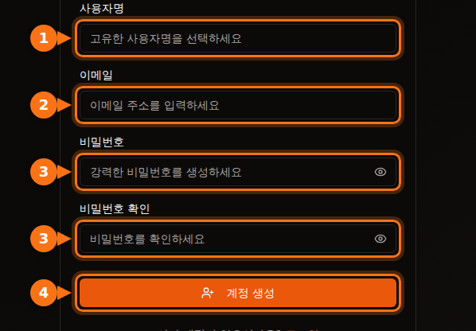
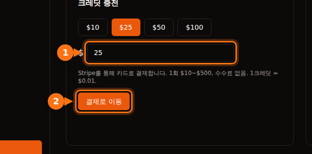

첫 GPU를 대여하기 전에 모든 플랫폼이 무언가를 요구합니다. 이메일 주소, 카드, 때로는 전화번호, 대형 클라우드에서는 며칠이 걸릴 수 있는 할당량 요청까지 필요합니다. 이 글에서는 플랫폼마다 무엇을 요구하는지 정리해, 오늘 바로 시작할 수 있는 곳을 고를 수 있게 했습니다.

모든 내용은 2026년 9월에 각 플랫폼의 공식 문서에서 확인했습니다. 출처는 글 끝에 있습니다.

## 한눈에 비교

| 플랫폼 | 계정 생성 | 대여 전 필요한 것 | 대여자 신원 확인 | 시작 최소 금액 |
| --- | --- | --- | --- | --- |
| **GPUFlow** | 이메일과 비밀번호, 또는 Google이나 GitHub | 이메일 인증, 카드로 크레딧 충전 | 대여 절차에는 없음 | $10 충전, 수수료 없음 |
| **Vast.ai** | 이메일 | 이메일 인증, 크레딧 충전 | 문서에 없음 | $5 입금 |
| **RunPod** | 이메일 | 크레딧 충전 | 첫 암호화폐 결제 전에만 | 1시간 분량 크레딧, 선불카드는 건당 $100 |
| **SaladCloud** | 포털 계정 | 조직에 결제 수단 추가 | 문서에 없음 | $5부터 충전 |
| **Lambda** | 계정 | 신용카드 추가 | 문서에 없음 | 카드 $10 사전 승인, 환불됨 |
| **TensorDock** | 계정 | 금액 입금 | 약관상 계정 확인 가능 | "최소 $5" |
| **AWS** | 이메일, 전화 PIN 확인, 결제 수단, CAPTCHA | GPU 할당량 요청: 새 계정은 0에서 시작 | 대부분의 계정은 해당 없음 | 종량제 |
| **Google Cloud** | 결제가 설정된 계정 | GPU 할당량 요청, 무료 체험 계정은 할당량 없음 | 대부분의 계정은 해당 없음 | 종량제 |

"문서에 없음"은 해당 플랫폼 문서에서 대여자 신원 확인 요건을 찾지 못했다는 뜻입니다. 이상 징후가 보이면 플랫폼이 확인을 요청할 수는 있습니다.

## 소규모 플랫폼: 며칠이 아니라 몇 분

Vast.ai, RunPod, SaladCloud, TensorDock, GPUFlow는 모두 선불제입니다. 먼저 돈을 넣고 초 또는 분 단위로 씁니다. 결제하지 않은 금액이 청구될 일이 없으니, 신용이나 회사 정보를 확인할 필요가 없습니다.

차이가 나는 부분은 다음과 같습니다.

- **이메일 인증.** Vast.ai와 GPUFlow는 대여하거나 크레딧을 충전하기 전에 이메일 인증을 요구합니다. 메일이 오지 않으면 스팸함을 확인하세요.
- **결제 수단.**
  - Vast.ai: 카드, BitPay, Crypto.com.
  - RunPod: Visa, Mastercard, Amex, 암호화폐, $5,000 초과 결제는 청구서.
  - SaladCloud: 카드, 또는 Solana 기반 USDC, USDT, RENDER.
  - Lambda: 주요 신용카드만, 지원 국가에서만.
  - GPUFlow: Stripe를 통한 카드 결제.
- **쓰지 않은 돈은 어떻게 되는가.** SaladCloud 크레딧은 구매 후 12개월이 지나면 만료됩니다. GPUFlow 크레딧은 만료되지 않습니다.

## 대형 클라우드: 할당량 요청부터 준비하세요

AWS와 Google Cloud는 가입은 쉽게 되지만, GPU를 쓰려는 단계에서 막힙니다.

- **AWS:** 새 계정은 "Running On-Demand G and VT instances"(NVIDIA L4와 A10G가 속한 인스턴스 계열) 할당량이 **0 vCPU**에서 시작합니다. Service Quotas 콘솔에서 증가를 요청합니다. 계정 사용량이 쌓이면 AWS가 할당량을 자동으로 올리기도 합니다.
- **Google Cloud:** 무료 체험 계정에는 GPU 할당량이 없습니다. 프로젝트에 결제 이력이 생기면 할당량 요청이 더 쉽게 승인됩니다. 할당량은 리전별이며, 선점형 GPU는 별도 할당량이 필요합니다.

오늘 GPU가 필요하다면 새 AWS나 Google Cloud 계정으로 시작하지 마세요.

## GPUFlow 가입 단계별 안내

GPUFlow는 "5분 안에 AI 모델이 필요하다"는 상황을 위해 만들었습니다. 받는 것은 머신이 아니라 GPU에 연결된 OpenAI 호환 API 키입니다.

1. gpuflow.app에서 사용자명, 이메일 주소, 비밀번호로, 또는 Google이나 GitHub로 **계정을 만듭니다**.

   

2. **이메일을 인증합니다.** GPUFlow가 보낸 메일의 링크를 클릭하세요. 인증하기 전에는 크레딧을 충전할 수 없습니다.
3. **대시보드 → 결제**에서 Stripe를 통해 카드로 $10부터 $500까지 **크레딧을 충전합니다**. 1크레딧 = $0.01이며, 수수료는 없습니다.

   

4. 원하는 시간만큼 **GPU를 대여하고** API 키를 복사합니다. 요금은 초 단위로 나가며, 일찍 끝내면 남은 시간은 크레딧으로 돌아옵니다.

모든 화면이 담긴 전체 안내는 문서에 있습니다. [GPU 대여하기, 단계별 안내](https://docs.gpuflow.app/ko/renters/getting-started/).

## 반대로 GPU를 빌려주고 싶다면

신원 확인이 필요해지는 것은 돈을 받을 때입니다. 결제 회사는 돈을 보내는 상대가 누구인지 확인해야 할 의무가 있습니다.

- **GPUFlow:** 출금하려면 Stripe에서 출금 계정을 설정합니다. Stripe가 신원을 확인하고 은행 정보를 요청합니다. 출금은 미국, 캐나다, 영국, 스위스, 유럽경제지역(EEA)에서 가능합니다.
- **Vast.ai:** 호스트는 Wise, PayPal, Stripe로 지급받으며, 신원 확인은 이 서비스들이 처리합니다.
- **Salad:** 보상은 PayPal, 기프트 카드 등으로 지급됩니다.

호스팅 수익에 대해서는 [게이밍 GPU로 얼마나 벌 수 있을까](/ko/how-much-can-you-earn-renting-out-your-gpu/)에서 더 자세히 다룹니다.

## 결제 전 짧은 체크리스트

1. **이메일부터 인증하세요.** 그래야 결제 단계에서 막히지 않습니다.
2. **내 국가와 카드가 지원되는지 확인하세요.** 예를 들어 Lambda는 정해진 국가 목록에서만 결제를 받습니다.
3. **은행의 해외 결제 수수료를 알아 두세요.** 대부분의 플랫폼은 미국 달러로 요금을 받습니다. [숨은 비용 자세히 보기](/ko/hidden-fees-in-gpu-rental/).
4. **작게 시작하세요.** 몇 시간 분량만 충전해 테스트한 뒤 더 충전하세요.

## 관련 글

- [GPUFlow vs Vast.ai vs RunPod vs SaladCloud: 내 작업에 맞는 플랫폼은](/ko/gpuflow-vs-vast-ai-vs-runpod/)
- [Open WebUI, Continue, LangChain 등에서 OpenAI 호환 API 키 쓰는 법](/ko/use-openai-compatible-api-key-in-apps/)

## 출처

모두 2026년 9월에 확인했습니다.

- GPUFlow: [GPU 대여하기, 단계별 안내](https://docs.gpuflow.app/ko/renters/getting-started/), [크레딧과 요금 청구](https://docs.gpuflow.app/ko/renters/billing/), [수익 받기](https://docs.gpuflow.app/ko/providers/getting-paid/)
- Vast.ai: [빠른 시작](https://docs.vast.ai/guides/get-started/quickstart.md), [과금](https://docs.vast.ai/documentation/reference/billing), [호스트 지급](https://docs.vast.ai/host/payment.md)
- RunPod: [결제 정보](https://docs.runpod.io/references/billing-information)
- SaladCloud: [계정 설정](https://docs.salad.com/general/tutorials/account-setup.md), [과금](https://docs.salad.com/general/explanation/billing.md)
- Lambda: [결제 관리](https://docs.lambda.ai/public-cloud/manage-billing/)
- TensorDock: [클라우드 GPU](https://www.tensordock.com/cloud-gpus.html), [서비스 약관](https://docs.tensordock.com/legal-information/terms-of-service-tos)
- AWS: [계정 만들기](https://docs.aws.amazon.com/accounts/latest/reference/manage-acct-creating.html), [온디맨드 인스턴스 할당량](https://docs.aws.amazon.com/AWSEC2/latest/UserGuide/ec2-on-demand-instances.html)
- Google Cloud: [GPU 할당량 문제 해결](https://docs.cloud.google.com/deep-learning-vm/docs/troubleshooting)
- Salad 보상: [PayPal 교환](https://support.salad.com/rewards/redeeming-your-rewards/how-to-redeem-paypal/)
