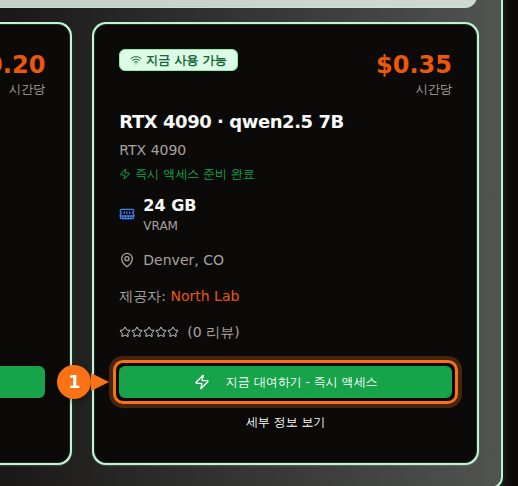

Ollama가 기본으로 제공하는 4비트 양자화 기준으로, 7B·8B 모델은 8 GB 카드, 12B~14B 모델은 12 GB 카드(긴 프롬프트를 쓰려면 16 GB), 27B~32B 모델은 24 GB 카드가 필요합니다. 70B 모델은 4비트로도 43 GB라서 VRAM이 48 GB 이상 있어야 합니다.

자세한 설명이 필요한 이유는 다운로드 크기가 전부가 아니기 때문입니다. 쓰는 컨텍스트도 메모리를 차지하고, 들어갈 것처럼 보이던 모델이 절반쯤 CPU로 밀려나 몇 배 느려지기도 합니다. 아래에 제가 쓰는 계산식, 양자화 표기의 의미, 그리고 Ollama 라이브러리의 실제 다운로드 크기를 담은 최신 오픈 모델 표를 정리했습니다. 크기와 사양은 2026년 9월에 확인했으며, 출처는 글 끝에 있습니다.

## VRAM 크기별 요약

| VRAM | 대표 카드 | GPU에서 완전히 돌아가는 모델(4비트) |
| --- | --- | --- |
| 8 GB | RTX 4060, RTX 5060, RTX 3070 | 7B~8B 모델: Llama 3.1 8B, Qwen3 8B, Mistral 7B |
| 12 GB | RTX 3060 12 GB, RTX 4070, RTX 5070 | 짧은 컨텍스트의 12B~14B 모델, Q8_0의 7B~8B |
| 16 GB | RTX 4060 Ti 16 GB, RTX 4080, RTX 5080 | 긴 컨텍스트의 14B, gpt-oss 20B |
| 24 GB | RTX 3090, RTX 4090 | 24B~32B: Mistral Small 3.2, Gemma 3 27B, Qwen3 32B |
| 32 GB | RTX 5090 | 긴 컨텍스트의 32B, 35B 전문가 혼합(MoE) 모델 |
| 48~80 GB | L40S(48 GB), H100(80 GB) | 4비트 70B, 80 GB에서 gpt-oss 120B |

카드 메모리 크기는 NVIDIA 사양 페이지 기준입니다. 일부 카드는 두 가지 버전이 있습니다. RTX 3060은 12 GB와 8 GB 버전이, RTX 4060 Ti와 RTX 5060 Ti는 16 GB와 8 GB 버전이 있습니다. 사거나 빌리는 카드가 어느 쪽인지 확인하세요.

## 모델에 필요한 VRAM 추정하기

모델이 답변을 만드는 동안 GPU 메모리에는 세 가지가 올라가 있습니다.

1. **가중치.** 파라미터 수 × 가중치당 비트 수 ÷ 8 = 바이트.
2. **KV 캐시.** 모델은 대화에 나온 모든 토큰의 키와 값을 저장해 두고 다시 계산하지 않습니다. 토큰당 2 × 레이어 수 × KV 헤드 수 × 헤드 크기 × 2바이트입니다(기본 16비트 캐시 기준). 여기에 컨텍스트 길이를 곱합니다.
3. **오버헤드.** CUDA 컨텍스트, 작업용 버퍼, 런타임 자체입니다. 저는 약 1 GB로 잡습니다. 엔진과 설정에 따라 달라지므로 사양이 아니라 경험칙으로 보세요.

레이어 수와 헤드 수는 Hugging Face에 있는 각 모델의 `config.json`에 나와 있습니다.

### 계산 예시: 16 GB 카드에서 Qwen 2.5 14B

Qwen 2.5 14B는 파라미터 147억 개, 레이어 48개, KV 헤드 8개, 헤드 크기 128입니다(히든 크기 5,120 ÷ 어텐션 헤드 40개).

- **Q4_K_M 가중치:** llama.cpp는 Q4_K_M을 가중치당 약 4.89비트로 표기합니다. 147억 × 4.89 ÷ 8 = 8.99 GB. Ollama의 `qwen2.5:14b` 다운로드 크기가 9.0 GB이므로 계산이 실제 파일과 맞습니다.
- **토큰당 KV 캐시:** 2 × 48 × 8 × 128 × 2바이트 = 196,608바이트, 약 0.2 MB.
- **컨텍스트 전체의 KV 캐시:** 4,096토큰 = 0.8 GB. 16,384토큰 = 3.2 GB. 32,768토큰 = 6.4 GB.
- **합계:** 4K 컨텍스트에서 9.0 + 0.8 + 1 = 10.8 GB. 16K에서 9.0 + 3.2 + 1 = 13.2 GB. 32K에서 9.0 + 6.4 + 1 = 16.4 GB로, 16 GB 카드에는 더 이상 들어가지 않습니다.

<figure>
<svg viewBox="0 0 720 340" role="img" aria-labelledby="d1-title" xmlns="http://www.w3.org/2000/svg" font-family="system-ui, sans-serif" font-size="15">
<title id="d1-title">16 GB 카드에서 Q4_K_M Qwen 2.5 14B가 VRAM을 채우는 구성: 가중치, 세 가지 컨텍스트 길이의 KV 캐시, 오버헤드</title>
<rect x="0" y="0" width="720" height="340" fill="#ffffff"/>
<rect x="150" y="20" width="16" height="16" rx="3" fill="#6366f1"/>
<text x="172" y="33" fill="#1e1b4b">가중치 9.0 GB</text>
<rect x="330" y="20" width="16" height="16" rx="3" fill="#a5b4fc"/>
<text x="352" y="33" fill="#1e1b4b">KV 캐시</text>
<rect x="510" y="20" width="16" height="16" rx="3" fill="#e2e8f0"/>
<text x="532" y="33" fill="#1e1b4b">오버헤드 약 1 GB</text>
<line x1="582.0" y1="66" x2="582.0" y2="278" stroke="#f97316" stroke-width="2" stroke-dasharray="5 4"/>
<text x="576.0" y="60" text-anchor="end" fill="#f97316" font-weight="600">16 GB 카드</text>
<text x="140" y="106" text-anchor="end" fill="#1e1b4b">4K 컨텍스트</text>
<rect x="150" y="80" width="243.0" height="40" fill="#6366f1"/>
<text x="271.5" y="106" text-anchor="middle" fill="#ffffff">가중치</text>
<rect x="393.0" y="80" width="21.6" height="40" fill="#a5b4fc"/>
<rect x="414.6" y="80" width="27.0" height="40" fill="#e2e8f0"/>
<text x="449.6" y="106" fill="#16a34a" font-weight="600">10.8 GB</text>
<text x="140" y="180" text-anchor="end" fill="#1e1b4b">16K 컨텍스트</text>
<rect x="150" y="154" width="243.0" height="40" fill="#6366f1"/>
<text x="271.5" y="180" text-anchor="middle" fill="#ffffff">가중치</text>
<rect x="393.0" y="154" width="86.4" height="40" fill="#a5b4fc"/>
<text x="436.2" y="180" text-anchor="middle" fill="#1e1b4b">3.2</text>
<rect x="479.4" y="154" width="27.0" height="40" fill="#e2e8f0"/>
<text x="514.4" y="180" fill="#16a34a" font-weight="600">13.2 GB</text>
<text x="140" y="254" text-anchor="end" fill="#1e1b4b">32K 컨텍스트</text>
<rect x="150" y="228" width="243.0" height="40" fill="#6366f1"/>
<text x="271.5" y="254" text-anchor="middle" fill="#ffffff">가중치</text>
<rect x="393.0" y="228" width="172.8" height="40" fill="#a5b4fc"/>
<text x="479.4" y="254" text-anchor="middle" fill="#1e1b4b">6.4</text>
<rect x="565.8" y="228" width="27.0" height="40" fill="#e2e8f0"/>
<text x="600.8" y="254" fill="#f97316" font-weight="600">16.4 GB</text>
<line x1="150" y1="278" x2="690" y2="278" stroke="#64748b"/>
<line x1="150.0" y1="278" x2="150.0" y2="283" stroke="#64748b"/>
<text x="150.0" y="300" text-anchor="middle" fill="#64748b">0</text>
<line x1="258.0" y1="278" x2="258.0" y2="283" stroke="#64748b"/>
<text x="258.0" y="300" text-anchor="middle" fill="#64748b">4</text>
<line x1="366.0" y1="278" x2="366.0" y2="283" stroke="#64748b"/>
<text x="366.0" y="300" text-anchor="middle" fill="#64748b">8</text>
<line x1="474.0" y1="278" x2="474.0" y2="283" stroke="#64748b"/>
<text x="474.0" y="300" text-anchor="middle" fill="#64748b">12</text>
<line x1="582.0" y1="278" x2="582.0" y2="283" stroke="#64748b"/>
<text x="582.0" y="300" text-anchor="middle" fill="#64748b">16</text>
<line x1="690.0" y1="278" x2="690.0" y2="283" stroke="#64748b"/>
<text x="690.0" y="300" text-anchor="middle" fill="#64748b">20</text>
<text x="420.0" y="326" text-anchor="middle" fill="#64748b">VRAM (GB)</text>
</svg>
<figcaption>16 GB 카드에서 Q4_K_M으로 돌리는 Qwen 2.5 14B. 가중치는 9.0 GB로 고정이고, KV 캐시는 컨텍스트에 따라 커지다가 32K 토큰에서 합계가 16 GB를 넘습니다. 오버헤드 1 GB는 경험칙입니다.</figcaption>
</figure>

여기서 두 가지를 알 수 있습니다. 첫째, 설정한 컨텍스트가 모델만큼 메모리를 먹을 수 있습니다. Llama 3.1 8B(레이어 32개, KV 헤드 8개, 헤드 크기 128)는 토큰당 131,072바이트의 KV 캐시가 필요하므로, 128K 컨텍스트를 다 쓰면 캐시만 17.2 GB입니다. 4.9 GB 다운로드 크기의 약 3.5배입니다. 둘째, 토큰당 KV 캐시 크기는 모델마다 크게 다릅니다. Qwen 2.5 7B는 KV 헤드 4개, 레이어 28개라서 토큰당 57,344바이트로, Llama 3.1 8B의 절반도 안 됩니다. 짐작하지 말고 config를 확인하세요.

### Ollama의 기본 컨텍스트

Ollama는 감지한 VRAM에 따라 기본 컨텍스트 길이를 정합니다. 24 GiB 미만은 4K 토큰, 24~48 GiB는 32K 토큰, 48 GiB 이상은 256K 토큰입니다. `OLLAMA_CONTEXT_LENGTH` 환경 변수로 바꿀 수 있고, 실제로 할당된 컨텍스트는 `ollama ps`의 CONTEXT 열에서 볼 수 있습니다. 계산을 바꾸는 설정이 두 가지 더 있습니다.

- `OLLAMA_NUM_PARALLEL`(기본값 1): Ollama 문서에 따르면 병렬 요청 수만큼 컨텍스트 크기가 늘어납니다. 병렬 슬롯이 4개면 KV 캐시도 4배입니다.
- `OLLAMA_KV_CACHE_TYPE`: `q8_0`은 기본 `f16` 캐시의 약 절반, `q4_0`은 약 4분의 1의 메모리를 씁니다. flash attention이 켜져 있어야 합니다.

## 양자화 수준의 의미

오픈 모델은 16비트 정밀도로 공개됩니다(아래 링크한 config에는 bfloat16으로 나옵니다). 파라미터당 2바이트입니다. 양자화는 가중치를 더 적은 비트로 저장합니다. Ollama와 llama.cpp가 쓰는 GGUF 파일에서 각 표기는 대략 다음을 뜻합니다.

| 표기 | 가중치당 비트 | Llama 3.1 8B 크기 | Llama 3 8B 퍼플렉시티(낮을수록 좋음) |
| --- | --- | --- | --- |
| F16 | 16.0 | 14.96 GiB | 6.233 |
| Q8_0 | 8.50 | 7.95 GiB | 6.234 |
| Q6_K | 6.56 | 6.14 GiB | 6.253 |
| Q5_K_M | 5.70 | 5.33 GiB | 6.289 |
| Q4_K_M | 4.89 | 4.58 GiB | 6.407 |
| Q3_K_M | 4.00 | 3.74 GiB | 6.888 |
| Q2_K_S / Q2_K | 2.97 | 2.78 GiB | 9.752 (Q2_K) |

가중치당 비트와 크기는 llama.cpp quantize README(Llama 3.1 8B)에서, 퍼플렉시티는 llama.cpp perplexity README(Llama 3 8B, Wikitext)에서 가져왔습니다. "K" 계열은 llama.cpp의 k-quant로, 모델 안에서 여러 정밀도를 섞어 씁니다. `_S`, `_M`, `_L`은 각각 소, 중, 대 조합입니다.

숫자가 말해 주는 것은 이렇습니다. Q8_0은 사실상 손실이 없습니다(퍼플렉시티 6.234 대 6.233). Q4_K_M은 퍼플렉시티가 약 3% 나빠지고, 같은 README에 따르면 가장 가능성 높은 다음 토큰이 원래 정밀도 모델과 91.9% 일치합니다. Q3는 눈에 띄게 나빠지고, Q2는 무너집니다.

퍼플렉시티가 곧 실용성은 아닙니다. 그래서 2026년 1월 Uygar Kurt의 연구가 도움이 됩니다. 이 연구는 Llama 3.1 8B Instruct를 llama.cpp의 각 수준으로 추론, 지식, 지시 이행, 진실성 벤치마크에 돌렸습니다. 단순 평균은 F16 69.47, Q8_0 69.41, Q5_K_M 69.36, Q4_K_M 69.15였습니다. Ollama를 비롯해 거의 모두가 Q4_K_M을 기본값으로 쓰는 이유가 이것입니다. 파일은 FP16의 3분의 1도 안 되는데, 손실은 거의 느끼기 어렵습니다. Ollama에서 태그를 짧게 쓰면 그 4비트 빌드가 받아집니다. `qwen3:8b`와 `qwen3:8b-q4_K_M`은 둘 다 5.2 GB이고, `phi4:14b`와 `phi4:14b-q4_K_M`은 둘 다 9.1 GB입니다.

제 원칙은 이렇습니다. 작은 모델을 Q8_0으로 쓰기 전에, Q4_K_M으로 들어가는 가장 큰 모델을 먼저 고릅니다. 4비트 14B가 보통 8비트 7B보다 낫고, 파일 크기는 비슷합니다. 메모리가 남고 작업이 작은 오류에 민감할 때, 예를 들어 코드나 정확한 정보 추출이라면 Q5나 Q8로 올리세요.

최근 Ollama 태그에는 `qat`(Gemma의 양자화 인식 학습 빌드), `nvfp4`, `mxfp8` 같은 형식도 있습니다. gpt-oss는 OpenAI가 직접 MXFP4로 배포하며, 전문가 혼합 가중치가 파라미터당 4.25비트입니다.

## 어떤 모델이 들어가는가: 크기와 VRAM 구간

아래 표는 2026년 9월 기준 Ollama 라이브러리의 최신 오픈 모델과 다운로드 크기입니다. "4비트" 열은 기본 태그의 크기입니다. 대부분의 모델은 `q4_K_M` 태그와 같은 파일이고, 기본 태그가 다른 빌드인 경우에는 두 크기를 모두 적었습니다(Mistral Nemo는 기본 7.1 GB, `q4_K_M` 7.5 GB). "최소 카드"는 모델, 약 1 GB 오버헤드, 4K~8K 컨텍스트가 GPU에 모두 들어가는 크기입니다. 긴 컨텍스트가 필요하면 한 단계 위를 고르세요.

| 모델 | Ollama 태그 | 4비트 크기 | Q8_0 크기 | 최소 카드(4비트 / Q8_0) |
| --- | --- | --- | --- | --- |
| Mistral 7B v0.3 | [`mistral:7b`](https://ollama.com/library/mistral/tags) | 4.4 GB | 7.7 GB | 8 GB / 12 GB |
| Qwen 2.5 7B | [`qwen2.5:7b`](https://ollama.com/library/qwen2.5/tags) | 4.7 GB | 8.1 GB | 8 GB / 12 GB |
| DeepSeek-R1 증류 7B(Qwen 2.5) | [`deepseek-r1:7b`](https://ollama.com/library/deepseek-r1/tags) | 4.7 GB | 미확인 | 8 GB |
| Llama 3.1 8B | [`llama3.1:8b`](https://ollama.com/library/llama3.1/tags) | 4.9 GB | 8.5 GB | 8 GB / 12 GB |
| Qwen3 8B | [`qwen3:8b`](https://ollama.com/library/qwen3/tags) | 5.2 GB | 8.9 GB | 8 GB / 12 GB |
| DeepSeek-R1-0528(Qwen3 8B) | [`deepseek-r1:8b`](https://ollama.com/library/deepseek-r1/tags) | 5.2 GB | 미확인 | 8 GB |
| Qwen3.5 9B | [`qwen3.5:9b`](https://ollama.com/library/qwen3.5/tags) | 6.6 GB | 11 GB | 8 GB(짧은 컨텍스트만) / 16 GB |
| Mistral Nemo 12B | [`mistral-nemo:12b`](https://ollama.com/library/mistral-nemo/tags) | 7.1 GB (q4_K_M: 7.5 GB) | 13 GB | 12 GB / 16 GB |
| Gemma 4 12B | [`gemma4:12b`](https://ollama.com/library/gemma4/tags) | 7.6 GB | 13 GB | 12 GB / 16 GB |
| Gemma 3 12B | [`gemma3:12b`](https://ollama.com/library/gemma3/tags) | 8.1 GB | 13 GB | 12 GB / 16 GB |
| Qwen 2.5 14B | [`qwen2.5:14b`](https://ollama.com/library/qwen2.5/tags) | 9.0 GB | 16 GB | 12 GB / 24 GB |
| DeepSeek-R1 증류 14B(Qwen 2.5) | [`deepseek-r1:14b`](https://ollama.com/library/deepseek-r1/tags) | 9.0 GB | 미확인 | 12 GB |
| Phi-4 14B | [`phi4:14b`](https://ollama.com/library/phi4/tags) | 9.1 GB | 16 GB | 12 GB / 24 GB |
| Qwen3 14B | [`qwen3:14b`](https://ollama.com/library/qwen3/tags) | 9.3 GB | 16 GB | 12 GB / 24 GB |
| gpt-oss 20B(MoE) | [`gpt-oss:20b`](https://ollama.com/library/gpt-oss/tags) | 14 GB (MXFP4) | 해당 없음 | 16 GB |
| Mistral Small 3.2 24B | [`mistral-small3.2:24b`](https://ollama.com/library/mistral-small3.2/tags) | 15 GB | 26 GB | 24 GB / 32 GB |
| Gemma 3 27B | [`gemma3:27b`](https://ollama.com/library/gemma3/tags) | 17 GB | 30 GB | 24 GB / 48 GB |
| Qwen3.5 27B | [`qwen3.5:27b`](https://ollama.com/library/qwen3.5/tags) | 17 GB | 30 GB | 24 GB / 48 GB |
| Qwen3.6 27B | [`qwen3.6:27b`](https://ollama.com/library/qwen3.6/tags) | 18 GB (q4_K_M: 17 GB) | 30 GB | 24 GB / 48 GB |
| Gemma 4 26B(MoE, 활성 3.8B) | [`gemma4:26b`](https://ollama.com/library/gemma4/tags) | 19 GB (q4_K_M: 18 GB) | 28 GB | 24 GB / 32 GB |
| Qwen3 30B-A3B(MoE) | [`qwen3:30b`](https://ollama.com/library/qwen3/tags) | 19 GB | 미확인 | 24 GB |
| Gemma 4 31B | [`gemma4:31b`](https://ollama.com/library/gemma4/tags) | 20 GB | 34 GB | 24 GB / 48 GB |
| Qwen3 32B | [`qwen3:32b`](https://ollama.com/library/qwen3/tags) | 20 GB | 35 GB | 24 GB / 48 GB |
| Qwen 2.5 32B | [`qwen2.5:32b`](https://ollama.com/library/qwen2.5/tags) | 20 GB | 35 GB | 24 GB / 48 GB |
| DeepSeek-R1 증류 32B(Qwen 2.5) | [`deepseek-r1:32b`](https://ollama.com/library/deepseek-r1/tags) | 20 GB | 미확인 | 24 GB |
| Qwen3.6 35B-A3B(MoE) | [`qwen3.6:35b`](https://ollama.com/library/qwen3.6/tags) | 23 GB (q4_K_M: 24 GB) | 39 GB | 32 GB / 48 GB |
| Qwen3.5 35B-A3B(MoE) | [`qwen3.5:35b`](https://ollama.com/library/qwen3.5/tags) | 24 GB | 39 GB | 32 GB / 48 GB |
| Llama 3.3 70B | [`llama3.3:70b`](https://ollama.com/library/llama3.3/tags) | 43 GB | 75 GB | 48 GB(빠듯함) / 80 GB(빠듯함) |
| Qwen 2.5 72B | [`qwen2.5:72b`](https://ollama.com/library/qwen2.5/tags) | 47 GB | 미확인 | 80 GB |
| gpt-oss 120B(MoE) | [`gpt-oss:120b`](https://ollama.com/library/gpt-oss/tags) | 65 GB (MXFP4) | 해당 없음 | 80 GB |

구간은 기본 태그 크기로 정했습니다. 짧은 이름으로 `ollama pull`을 실행하면 그 파일이 받아지기 때문입니다.

24 GB와 32 GB 구간에는 함정이 있습니다. Ollama의 기본 컨텍스트는 24 GiB에서 4K가 32K로 뛰기 때문에, RTX 4090에서 20 GB 모델을 돌리면 옆에 들어가지 않는 32K 캐시가 잡힐 수 있습니다. `ollama ps`에 CPU 비율이 보이면 컨텍스트를 줄이세요. 그리고 이름에 붙은 숫자로 모델을 판단하지 마세요. Gemma 4의 엣지 모델 `gemma4:e4b`(유효 파라미터 4.5B)는 다운로드 크기가 9.6 GB로, 7.6 GB인 `gemma4:12b`보다 큽니다. 크기를 확인하세요.

<figure>
<svg viewBox="0 0 720 546" role="img" aria-labelledby="d2-title" xmlns="http://www.w3.org/2000/svg" font-family="system-ui, sans-serif" font-size="14">
<title id="d2-title">인기 Ollama 모델의 기본 4비트 양자화 다운로드 크기를 8, 12, 16, 24, 32 GB VRAM과 비교한 차트</title>
<rect x="0" y="0" width="720" height="546" fill="#ffffff"/>
<line x1="320.0" y1="58" x2="320.0" y2="486" stroke="#f97316" stroke-width="2" stroke-dasharray="5 4"/>
<text x="320.0" y="50" text-anchor="middle" fill="#f97316" font-weight="600">8 GB</text>
<line x1="380.0" y1="58" x2="380.0" y2="486" stroke="#f97316" stroke-width="2" stroke-dasharray="5 4"/>
<text x="380.0" y="50" text-anchor="middle" fill="#f97316" font-weight="600">12 GB</text>
<line x1="440.0" y1="58" x2="440.0" y2="486" stroke="#f97316" stroke-width="2" stroke-dasharray="5 4"/>
<text x="440.0" y="50" text-anchor="middle" fill="#f97316" font-weight="600">16 GB</text>
<line x1="560.0" y1="58" x2="560.0" y2="486" stroke="#f97316" stroke-width="2" stroke-dasharray="5 4"/>
<text x="560.0" y="50" text-anchor="middle" fill="#f97316" font-weight="600">24 GB</text>
<line x1="680.0" y1="58" x2="680.0" y2="486" stroke="#f97316" stroke-width="2" stroke-dasharray="5 4"/>
<text x="680.0" y="50" text-anchor="middle" fill="#f97316" font-weight="600">32 GB</text>
<text x="20" y="50" fill="#64748b">VRAM 구간</text>
<text x="190" y="84" text-anchor="end" fill="#1e1b4b">mistral:7b</text>
<rect x="200" y="70" width="66.0" height="18" rx="3" fill="#6366f1"/>
<text x="272.0" y="84" fill="#1e1b4b">4.4</text>
<text x="190" y="110" text-anchor="end" fill="#1e1b4b">qwen2.5:7b</text>
<rect x="200" y="96" width="70.5" height="18" rx="3" fill="#6366f1"/>
<text x="276.5" y="110" fill="#1e1b4b">4.7</text>
<text x="190" y="136" text-anchor="end" fill="#1e1b4b">llama3.1:8b</text>
<rect x="200" y="122" width="73.5" height="18" rx="3" fill="#6366f1"/>
<text x="279.5" y="136" fill="#1e1b4b">4.9</text>
<text x="190" y="162" text-anchor="end" fill="#1e1b4b">qwen3:8b</text>
<rect x="200" y="148" width="78.0" height="18" rx="3" fill="#6366f1"/>
<text x="284.0" y="162" fill="#1e1b4b">5.2</text>
<text x="190" y="188" text-anchor="end" fill="#1e1b4b">qwen3.5:9b</text>
<rect x="200" y="174" width="99.0" height="18" rx="3" fill="#6366f1"/>
<text x="297.0" y="188" text-anchor="end" fill="#ffffff">6.6</text>
<text x="190" y="214" text-anchor="end" fill="#1e1b4b">gemma4:12b</text>
<rect x="200" y="200" width="114.0" height="18" rx="3" fill="#6366f1"/>
<text x="324.0" y="214" fill="#1e1b4b">7.6</text>
<text x="190" y="240" text-anchor="end" fill="#1e1b4b">gemma3:12b</text>
<rect x="200" y="226" width="121.5" height="18" rx="3" fill="#6366f1"/>
<text x="327.5" y="240" fill="#1e1b4b">8.1</text>
<text x="190" y="266" text-anchor="end" fill="#1e1b4b">qwen2.5:14b</text>
<rect x="200" y="252" width="135.0" height="18" rx="3" fill="#6366f1"/>
<text x="341.0" y="266" fill="#1e1b4b">9.0</text>
<text x="190" y="292" text-anchor="end" fill="#1e1b4b">qwen3:14b</text>
<rect x="200" y="278" width="139.5" height="18" rx="3" fill="#6366f1"/>
<text x="345.5" y="292" fill="#1e1b4b">9.3</text>
<text x="190" y="318" text-anchor="end" fill="#1e1b4b">gpt-oss:20b</text>
<rect x="200" y="304" width="210.0" height="18" rx="3" fill="#6366f1"/>
<text x="416.0" y="318" fill="#1e1b4b">14</text>
<text x="190" y="344" text-anchor="end" fill="#1e1b4b">mistral-small3.2:24b</text>
<rect x="200" y="330" width="225.0" height="18" rx="3" fill="#6366f1"/>
<text x="423.0" y="344" text-anchor="end" fill="#ffffff">15</text>
<text x="190" y="370" text-anchor="end" fill="#1e1b4b">gemma3:27b</text>
<rect x="200" y="356" width="255.0" height="18" rx="3" fill="#6366f1"/>
<text x="461.0" y="370" fill="#1e1b4b">17</text>
<text x="190" y="396" text-anchor="end" fill="#1e1b4b">qwen3.5:27b</text>
<rect x="200" y="382" width="255.0" height="18" rx="3" fill="#6366f1"/>
<text x="461.0" y="396" fill="#1e1b4b">17</text>
<text x="190" y="422" text-anchor="end" fill="#1e1b4b">gemma4:31b</text>
<rect x="200" y="408" width="300.0" height="18" rx="3" fill="#6366f1"/>
<text x="506.0" y="422" fill="#1e1b4b">20</text>
<text x="190" y="448" text-anchor="end" fill="#1e1b4b">qwen3:32b</text>
<rect x="200" y="434" width="300.0" height="18" rx="3" fill="#6366f1"/>
<text x="506.0" y="448" fill="#1e1b4b">20</text>
<text x="190" y="474" text-anchor="end" fill="#1e1b4b">qwen3.6:35b</text>
<rect x="200" y="460" width="345.0" height="18" rx="3" fill="#6366f1"/>
<text x="539.0" y="474" text-anchor="end" fill="#ffffff">23</text>
<line x1="200" y1="486" x2="680" y2="486" stroke="#64748b" stroke-width="1"/>
<line x1="200.0" y1="486" x2="200.0" y2="491" stroke="#64748b"/>
<text x="200.0" y="506" text-anchor="middle" fill="#64748b">0</text>
<line x1="260.0" y1="486" x2="260.0" y2="491" stroke="#64748b"/>
<text x="260.0" y="506" text-anchor="middle" fill="#64748b">4</text>
<line x1="320.0" y1="486" x2="320.0" y2="491" stroke="#64748b"/>
<text x="320.0" y="506" text-anchor="middle" fill="#64748b">8</text>
<line x1="380.0" y1="486" x2="380.0" y2="491" stroke="#64748b"/>
<text x="380.0" y="506" text-anchor="middle" fill="#64748b">12</text>
<line x1="440.0" y1="486" x2="440.0" y2="491" stroke="#64748b"/>
<text x="440.0" y="506" text-anchor="middle" fill="#64748b">16</text>
<line x1="500.0" y1="486" x2="500.0" y2="491" stroke="#64748b"/>
<text x="500.0" y="506" text-anchor="middle" fill="#64748b">20</text>
<line x1="560.0" y1="486" x2="560.0" y2="491" stroke="#64748b"/>
<text x="560.0" y="506" text-anchor="middle" fill="#64748b">24</text>
<line x1="620.0" y1="486" x2="620.0" y2="491" stroke="#64748b"/>
<text x="620.0" y="506" text-anchor="middle" fill="#64748b">28</text>
<line x1="680.0" y1="486" x2="680.0" y2="491" stroke="#64748b"/>
<text x="680.0" y="506" text-anchor="middle" fill="#64748b">32</text>
<text x="440.0" y="530" text-anchor="middle" fill="#64748b">다운로드 크기(GB, Ollama 기본 태그, 4비트)</text>
</svg>
<figcaption>Ollama 기본 4비트 태그의 다운로드 크기를 일반적인 VRAM 크기와 같은 축척으로 그렸습니다. 막대가 선보다 한참 왼쪽에서 끝나야 들어갑니다. 오버헤드 약 1 GB와 KV 캐시 자리를 남겨 두세요.</figcaption>
</figure>

## 전문가 혼합 모델은 사정이 조금 다릅니다

gpt-oss, Gemma 4 26B, Qwen의 "A3B" 모델은 전문가 혼합(MoE) 모델입니다. 토큰마다 일부 전문가만 돌아갑니다. Gemma 4 26B는 파라미터가 25.2B지만 활성 파라미터는 3.8B입니다. 메모리 규칙은 달라지지 않습니다. 가중치는 전부 어딘가에 올려야 하기 때문입니다. 달라지는 것은 다 들어가지 않을 때의 속도입니다. 토큰마다 가중치의 일부만 건드리므로, 시스템 RAM으로 넘친 MoE 모델은 같은 크기의 덴스 모델보다 훨씬 덜 느려집니다. 그 차이가 얼마나 되는지는 다음 섹션의 측정값에 나옵니다.

## 모델이 들어가지 않으면 벌어지는 일

Ollama는 너무 큰 모델이라고 로드를 거부하지 않습니다. 들어가는 만큼 레이어를 GPU에 올리고, 나머지는 시스템 RAM에 두고 CPU에서 돌립니다. 지금 어느 상태인지는 `ollama ps`로 알 수 있습니다. `100% GPU`는 전부 들어간 것, `100% CPU`는 하나도 안 들어간 것, `48%/52% CPU/GPU` 같은 혼합은 나뉜 것입니다.

나뉘면 대가가 큽니다. 토큰 하나를 생성할 때마다 활성 가중치를 전부 읽어야 하는데, 시스템 RAM은 VRAM보다 훨씬 느리기 때문입니다. Rost가 2026년 4월 DEV Community에 공개한 16 GB RTX 4080의 llama.cpp 측정값이 이를 잘 보여 줍니다.

| 모델(양자화, 파일 크기) | 컨텍스트 | GPU / CPU 부하 | 초당 토큰 |
| --- | --- | --- | --- |
| Qwen3.5 27B 덴스(IQ3_XXS, 11.5 GB) | 32K | 98% / 100% | 45.1 |
| Qwen3.5 27B 덴스 | 64K | 45% / 410% | 22.7 |
| Qwen3.5 27B 덴스 | 128K | 16% / 625% | 9.6 |
| Qwen3.5 35B-A3B MoE(IQ3_S, 13.6 GB) | 64K | 88% / 115% | 136.8 |
| Qwen3.5 122B-A10B MoE(IQ3_XXS, 44.7 GB) | 32K | 30% / 480% | 21.8 |

CPU 수치가 높고 GPU 수치가 낮으면 작업 대부분이 CPU로 넘어갔다는 뜻입니다. 원저자도 같은 방식으로 해석합니다.

같은 덴스 모델이 컨텍스트를 32K에서 64K로 늘리자 속도가 절반으로 떨어졌습니다. 커진 KV 캐시가 레이어를 GPU 밖으로 밀어냈기 때문이고, 128K에서는 거의 80%가 줄었습니다. 반면 122B MoE 모델은 16 GB 카드에 44.7 GB 파일인데도 초당 약 22토큰으로 돌았습니다. 토큰당 활성 파라미터가 10B뿐이기 때문입니다. 덴스 모델에서 "일부가 CPU에 있다"는 "몇 배 느리다"는 뜻으로 받아들이세요. MoE 모델이라면 감수할 만한 절충일 수 있습니다.

나뉘는 상황이 되면 비용이 적은 순서로 이렇게 해결합니다. 컨텍스트를 줄이고, KV 캐시를 `q8_0`으로 양자화하고, 같은 모델의 더 작은 양자화(Q5 대신 Q4_K_M)를 고르고, 더 작은 모델을 고르고, 그래도 안 되면 메모리가 더 큰 카드로 옮깁니다.

## 32 GB와 데이터센터 카드

RTX 5090은 32 GB입니다. 긴 컨텍스트의 4비트 32B 모델이나, 23~24 GB인 35B-A3B MoE 모델을 캐시 여유와 함께 올릴 수 있습니다. 70B까지는 안 됩니다. `llama3.3:70b`는 4비트로도 43 GB입니다.

70B에는 48 GB 이상이 필요합니다. L40S는 48 GB라서 43 GB 파일은 들어가지만 컨텍스트 여유는 거의 없습니다. H100 SXM은 80 GB(H100 NVL은 94 GB)로, 긴 컨텍스트의 4비트 Llama 3.3 70B, gpt-oss 120B(65 GB, Ollama 페이지에 80 GB GPU 한 장에 들어간다고 나와 있습니다), 또는 짧은 컨텍스트의 Q8_0 Llama 3.3 70B(75 GB)가 들어갑니다. 81 GB인 Qwen3.5 122B는 이미 80 GB 카드 한 장을 넘습니다.

## 사지 않고 빌린다면: GPUFlow 리스팅 확인하기

GPUFlow에서 GPU를 대여하면 제공자가 자기 머신에서 모델을 서빙하고(GPUFlow 설치 프로그램이 기본으로 설정하는 Ollama 사용), 어떤 모델을 설치할지도 제공자가 정합니다. 모델을 직접 받을 수는 없습니다. 받는 것은 셸이 아니라 그 GPU용 OpenAI 호환 API 키입니다. GPUFlow 설치 프로그램의 기본 모델은 `qwen2.5:7b`이고, 설치 프로그램과 문서에 나오는 태그는 `qwen2.5:0.5b`, `deepseek-r1:1.5b`, `qwen2.5:7b`, `deepseek-r1:7b`, `llama3.1:8b`, `qwen2.5:14b`입니다. 제공자는 다른 모델도 설치할 수 있습니다.

[마켓플레이스](https://gpuflow.app/ko/marketplace)의 각 카드에는 GPU, VRAM, 시간당 가격이 나오고, 제공자의 설명에 서빙하는 모델이 적혀 있습니다. GPUFlow 문서는 같은 규칙을 조금 더 보수적으로 안내합니다. 7B 모델은 8 GB 이상, 14B 모델은 16 GB 이상에서 잘 돌아갑니다. 키를 받은 뒤 `GET /v1/models`를 호출하면 모델 이름 하나가 돌아옵니다. 설명에 다른 모델도 적혀 있다면 그 이름을 `model` 필드에 넣어 쓸 수 있습니다.

알아 둘 점이 두 가지 있습니다. GPUFlow는 자체 컨텍스트 제한을 두지 않으므로, 제공자가 바꾸지 않았다면 제공자 머신의 Ollama 기본값이 적용됩니다. 그리고 제공자가 설치하지 않은 모델은 쓸 수 없으니, 필요한 모델을 먼저 보고 GPU는 그다음에 고르세요. [Open WebUI, Continue, LangChain에 키 연결하기](/ko/use-openai-compatible-api-key-in-apps/)는 다른 OpenAI 방식 API와 똑같습니다.

## 관련 글

- [Open WebUI, Continue, LangChain 등에서 OpenAI 호환 API 키 쓰는 법](/ko/use-openai-compatible-api-key-in-apps/)
- [시간당 GPU인가, 토큰당 API인가? 7B–8B 모델 운영의 실제 비용](/ko/hourly-gpu-vs-per-token-api/)
- [Ollama vs vLLM vs TGI: RTX 4090 추론 벤치마크](/ko/ollama-vs-vllm-vs-tgi-rtx-4090-benchmark/)
- [GPU 대여 가격 비교 2026](/ko/gpu-rental-pricing-comparison-2026/)

## 출처

모두 2026년 9월에 확인했습니다.

- Ollama 라이브러리 다운로드 크기: [mistral](https://ollama.com/library/mistral/tags), [qwen2.5](https://ollama.com/library/qwen2.5/tags), [qwen3](https://ollama.com/library/qwen3/tags), [qwen3.5](https://ollama.com/library/qwen3.5/tags), [qwen3.6](https://ollama.com/library/qwen3.6/tags), [llama3.1](https://ollama.com/library/llama3.1/tags), [llama3.3](https://ollama.com/library/llama3.3/tags), [deepseek-r1](https://ollama.com/library/deepseek-r1/tags), [DeepSeek-R1 모델 페이지(증류 기반 모델)](https://ollama.com/library/deepseek-r1), [gemma3](https://ollama.com/library/gemma3/tags), [gemma4](https://ollama.com/library/gemma4/tags), [Gemma 4 모델 페이지(MoE와 활성 파라미터)](https://ollama.com/library/gemma4), [mistral-nemo](https://ollama.com/library/mistral-nemo/tags), [mistral-small3.2](https://ollama.com/library/mistral-small3.2/tags), [phi4](https://ollama.com/library/phi4/tags), [gpt-oss](https://ollama.com/library/gpt-oss/tags), [gpt-oss 모델 페이지(MXFP4, 메모리)](https://ollama.com/library/gpt-oss), [Ollama 라이브러리 목록](https://ollama.com/library)
- 모델 구조: [Qwen2.5-14B-Instruct 모델 카드](https://huggingface.co/Qwen/Qwen2.5-14B-Instruct), [Qwen2.5-14B-Instruct config.json](https://huggingface.co/Qwen/Qwen2.5-14B-Instruct/blob/main/config.json), [Qwen2.5-7B-Instruct config.json](https://huggingface.co/Qwen/Qwen2.5-7B-Instruct/blob/main/config.json), [Llama-3.1-8B-Instruct config.json(unsloth 미러)](https://huggingface.co/unsloth/Llama-3.1-8B-Instruct/blob/main/config.json)
- Ollama 컨텍스트와 메모리 설정: [Ollama 문서, Context length](https://docs.ollama.com/context-length), [Ollama FAQ](https://docs.ollama.com/faq)
- 양자화 크기와 가중치당 비트: [llama.cpp quantize README](https://github.com/ggml-org/llama.cpp/blob/master/tools/quantize/README.md)
- 양자화 퍼플렉시티: [llama.cpp perplexity README](https://github.com/ggml-org/llama.cpp/blob/master/tools/perplexity/README.md)
- 양자화 벤치마크 연구: [Uygar Kurt, Which Quantization Should I Use? (arXiv 2601.14277)](https://arxiv.org/abs/2601.14277)
- CPU 오프로드 측정: [Rost, llama.cpp로 측정한 16 GB VRAM LLM 벤치마크(DEV Community, 2026년 4월)](https://dev.to/rosgluk/16-gb-vram-llm-benchmarks-with-llamacpp-speed-and-context-3hgg)
- GPU 메모리 크기: [NVIDIA RTX 50 시리즈 비교](https://www.nvidia.com/en-us/geforce/graphics-cards/compare/), [RTX 40 시리즈](https://www.nvidia.com/en-us/geforce/graphics-cards/40-series/), [RTX 30 시리즈](https://www.nvidia.com/en-us/geforce/graphics-cards/30-series/), [L40S](https://www.nvidia.com/en-us/data-center/l40s/), [H100](https://www.nvidia.com/en-us/data-center/h100/)
- GPUFlow: [GPU 대여 단계별 안내](https://docs.gpuflow.app/ko/renters/getting-started/), [API 빠른 시작](https://docs.gpuflow.app/ko/renters/api-quickstart/), [제공자 시작하기](https://docs.gpuflow.app/ko/providers/getting-started/)
