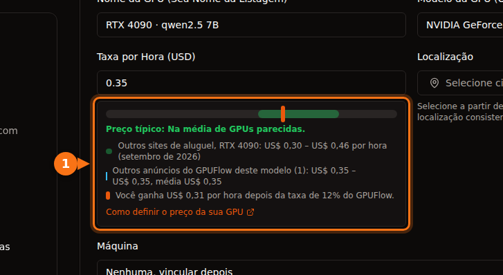

Em setembro de 2026, uma H100 custa cerca de US$ 6,90 por hora na AWS ou no Azure, US$ 11,06 por GPU no Google Cloud, US$ 3,99 na Lambda, de US$ 2,69 a US$ 3,49 no RunPod e a partir de cerca de US$ 1,50 no Vast.ai. Placas de consumo só existem nos marketplaces: uma RTX 4090 sai por US$ 0,31 a US$ 0,34 a hora na ponta barata e US$ 0,74 no nível de data center do RunPod. Para a mesma H100, a hora sob demanda mais cara custa cerca de sete vezes e meia a mais barata.

O resto do post mostra de onde vem cada número, o que o preço por hora inclui e quanto custam, do começo ao fim, três trabalhos típicos. Todos os preços são sob demanda, salvo indicação, em regiões dos EUA (us-east-1 na AWS, East US no Azure, us-central1 no Google Cloud), com Linux, conferidos em setembro de 2026. Os preços mudam todo mês, então trate-os como um retrato do momento e confira a fonte antes de gastar dinheiro.

## Os preços num relance

GPUs de data center, em dólares por GPU por hora:

| Fornecedor | L4 24 GB | A10G / A10 24 GB | A100 80 GB | H100 |
| --- | --- | --- | --- | --- |
| AWS | US$ 0,81 (g6.xlarge) | US$ 1,01 (g5.xlarge, A10G) | US$ 3,43 (só a p4de de 8 GPUs) | US$ 6,88 (p5.4xlarge) |
| Google Cloud | US$ 0,71 (g2-standard-4) | n/d | US$ 5,07 (a2-ultragpu-1g) | US$ 11,06 (A3 de 8 GPUs, ÷ 8) |
| Azure | n/d | US$ 3,20 (NV36ads A10 v5) | US$ 3,67 (NC24ads A100 v4) | US$ 6,98 (NC40ads H100 v5, NVL 94 GB) |
| Lambda | n/d | n/d | US$ 2,79 | US$ 3,99 |
| RunPod Community / Secure | n/d / US$ 0,49 | n/d | US$ 1,39 / US$ 1,59 | US$ 2,69 / US$ 3,49 |
| Vast.ai | a partir de cerca de US$ 0,27 | n/d | a partir de cerca de US$ 0,43 | a partir de cerca de US$ 1,47 |

n/d quer dizer que não encontramos uma opção equivalente com uma única GPU na tabela de preços daquele fornecedor. Placas de consumo, em dólares por hora:

| GPU | Vast.ai (oferta mais barata) | RunPod Community / Secure | Faixa típica nos sites de aluguel |
| --- | --- | --- | --- |
| RTX 3090 24 GB | US$ 0,11 – US$ 0,13 | US$ 0,22 / US$ 0,50 | US$ 0,11 – US$ 0,31 |
| RTX 4090 24 GB | US$ 0,31 – US$ 0,33 | US$ 0,34 / US$ 0,74 | US$ 0,30 – US$ 0,46 |
| RTX 5090 32 GB | US$ 0,41 – US$ 0,47 | US$ 0,69 / US$ 0,99 | US$ 0,41 – US$ 0,69 |

AWS, Google Cloud, Azure e Lambda não oferecem placas RTX de consumo. Os valores do Vast.ai são faixas porque dois retratos do getdeploying.com no mesmo dia deram mínimos um pouco diferentes, o que já diz algo sobre preço de marketplace. A última coluna é a faixa que o [guia de preços para provedores do GPUFlow](https://docs.gpuflow.app/pt-br/providers/pricing/) levantou no Vast.ai, RunPod, Salad, SimplePod, TensorDock, Hyperstack e Lambda em setembro de 2026.

## O que o preço por hora inclui

Esses números não são exatamente o mesmo produto, e isso importa mais do que a segunda casa decimal.

Uma instância de hiperescala traz muita coisa além da GPU. A p5.4xlarge da AWS vem com 16 vCPUs, 256 GiB de RAM e 3,84 TB de NVMe local. A NC24ads A100 v4 do Azure tem 24 vCPUs e 220 GiB de RAM. O tamanho com A10 inteira do Azure, NV36ads A10 v5, tem 36 vCPUs, 440 GiB de RAM e uma licença GRID para estações de trabalho virtuais, o que ajuda a explicar por que custa três vezes o que a AWS cobra por uma placa parecida. Se você só precisa da GPU, paga por tudo isso do mesmo jeito.

Algumas GPUs só vêm em máquinas grandes. Na AWS, a A100 80 GB é vendida como p4de.24xlarge: oito GPUs, US$ 27,45 por hora, sem tamanho menor. A máquina A3 High com H100 do Google Cloud na nossa tabela é a a3-highgpu-8g, de 8 GPUs, a US$ 88,49 por hora. A tabela da Lambda mostra um preço por GPU, mas as especificações que ela lista ao lado da H100 (208 vCPUs, 1.800 GiB de RAM) descrevem um sistema com várias GPUs, então confira quais tamanhos estão de fato disponíveis antes de planejar em cima de US$ 3,99.

No marketplace, quem define o preço é o dono da máquina. No Vast.ai cada host define a própria tarifa, e armazenamento e banda têm preço separado em cada oferta. O Community Cloud do RunPod conecta provedores independentes; o Secure Cloud roda em data centers Tier 3 e Tier 4. A mesma RTX 4090 custa US$ 0,34 no primeiro e US$ 0,74 no segundo.

O que o preço por hora deixa de fora (disco, transferência de dados, tempo de preparação, tempo ocioso) está em [quanto custa de verdade alugar uma GPU](/pt_br/hidden-fees-in-gpu-rental/). Num trabalho pequeno, esses extras podem passar do tempo de GPU.

## Preços da H100 lado a lado

<figure>
<svg viewBox="0 0 720 380" role="img" aria-labelledby="d1-title" xmlns="http://www.w3.org/2000/svg" font-family="system-ui, sans-serif" font-size="15">
<title id="d1-title">Gráfico de barras com o preço sob demanda da H100 por GPU por hora em setembro de 2026, de 11,06 dólares no Google Cloud a 1,47 dólar no Vast.ai</title>
<rect x="0" y="0" width="720" height="380" fill="#ffffff"/>
<text x="20" y="28" fill="#1e1b4b" font-weight="600">Uma H100, sob demanda, dólares por GPU-hora</text>
<line x1="190" y1="44" x2="190" y2="316" stroke="#e2e8f0" stroke-width="1"/>
<text x="190" y="336" text-anchor="middle" fill="#64748b" font-size="13">$0</text>
<line x1="270" y1="44" x2="270" y2="316" stroke="#e2e8f0" stroke-width="1"/>
<text x="270" y="336" text-anchor="middle" fill="#64748b" font-size="13">$2</text>
<line x1="350" y1="44" x2="350" y2="316" stroke="#e2e8f0" stroke-width="1"/>
<text x="350" y="336" text-anchor="middle" fill="#64748b" font-size="13">$4</text>
<line x1="430" y1="44" x2="430" y2="316" stroke="#e2e8f0" stroke-width="1"/>
<text x="430" y="336" text-anchor="middle" fill="#64748b" font-size="13">$6</text>
<line x1="510" y1="44" x2="510" y2="316" stroke="#e2e8f0" stroke-width="1"/>
<text x="510" y="336" text-anchor="middle" fill="#64748b" font-size="13">$8</text>
<line x1="590" y1="44" x2="590" y2="316" stroke="#e2e8f0" stroke-width="1"/>
<text x="590" y="336" text-anchor="middle" fill="#64748b" font-size="13">$10</text>
<line x1="670" y1="44" x2="670" y2="316" stroke="#e2e8f0" stroke-width="1"/>
<text x="670" y="336" text-anchor="middle" fill="#64748b" font-size="13">$12</text>
<text x="180" y="69" text-anchor="end" fill="#1e1b4b">Google Cloud</text>
<rect x="190" y="50" width="442.4" height="26" rx="3" fill="#6366f1"/>
<text x="640.4" y="69" fill="#1e1b4b">$11.06</text>
<text x="180" y="107" text-anchor="end" fill="#1e1b4b">Azure (H100 NVL)</text>
<rect x="190" y="88" width="279.2" height="26" rx="3" fill="#6366f1"/>
<text x="477.2" y="107" fill="#1e1b4b">$6.98</text>
<text x="180" y="145" text-anchor="end" fill="#1e1b4b">AWS</text>
<rect x="190" y="126" width="275.2" height="26" rx="3" fill="#6366f1"/>
<text x="473.2" y="145" fill="#1e1b4b">$6.88</text>
<text x="180" y="183" text-anchor="end" fill="#1e1b4b">Lambda</text>
<rect x="190" y="164" width="159.6" height="26" rx="3" fill="#16a34a"/>
<text x="357.6" y="183" fill="#1e1b4b">$3.99</text>
<text x="180" y="221" text-anchor="end" fill="#1e1b4b">RunPod Secure</text>
<rect x="190" y="202" width="139.6" height="26" rx="3" fill="#16a34a"/>
<text x="337.6" y="221" fill="#1e1b4b">$3.49</text>
<text x="180" y="259" text-anchor="end" fill="#1e1b4b">RunPod Community</text>
<rect x="190" y="240" width="107.6" height="26" rx="3" fill="#16a34a"/>
<text x="305.6" y="259" fill="#1e1b4b">$2.69</text>
<text x="180" y="297" text-anchor="end" fill="#1e1b4b">Vast.ai (menor)</text>
<rect x="190" y="278" width="58.8" height="26" rx="3" fill="#16a34a"/>
<text x="256.8" y="297" fill="#1e1b4b">$1.47</text>
<line x1="190" y1="44" x2="190" y2="316" stroke="#64748b" stroke-width="1.5"/>
<rect x="190" y="352" width="14" height="14" fill="#6366f1"/>
<text x="212" y="364" fill="#64748b" font-size="13">Grandes nuvens</text>
<rect x="360" y="352" width="14" height="14" fill="#16a34a"/>
<text x="382" y="364" fill="#64748b" font-size="13">Nuvens de GPU e marketplaces</text>
</svg>
<figcaption>Preço sob demanda de uma H100, setembro de 2026. O preço do Google Cloud é a máquina A3 de 8 GPUs dividida por 8. O tamanho de uma GPU do Azure usa a H100 NVL de 94 GB. O Vast.ai é a oferta mais barata que o getdeploying.com registrou naquele dia.</figcaption>
</figure>

O gráfico está em escala. Duas coisas chamam a atenção. As três grandes nuvens ficam em torno de US$ 7 por GPU, com o Google Cloud bem acima disso na máquina A3 de 8 GPUs. E a distância entre a AWS e a oferta mais barata do Vast.ai passa de quatro vezes, para uma placa que faz exatamente as mesmas contas.

O que o dinheiro a mais compra é real: um SLA, a papelada de compliance, o resto da sua infraestrutura ao lado e um contrato de suporte. O que você abre mão num marketplace também é real: o host pode ser um operador pequeno, a confiabilidade varia de oferta para oferta e não há SLA. Para um experimento de fim de semana, o marketplace ganha fácil. Para um sistema de produção regulado, muitas vezes ele nem é opção.

## Preços spot e interruptíveis

Todos os fornecedores desta comparação vendem capacidade ociosa mais barata, com o risco de ela ser tomada de volta.

| Instância | Sob demanda | Spot | Economia |
| --- | --- | --- | --- |
| AWS g6.xlarge (1× L4) | US$ 0,805 | US$ 0,605 | 25% |
| AWS g5.xlarge (1× A10G) | US$ 1,006 | US$ 0,469 | 53% |
| AWS p5.4xlarge (1× H100) | US$ 6,88 | US$ 2,623 | 62% |
| Google Cloud g2-standard-4 (1× L4) | US$ 0,707 | US$ 0,403 | 43% |
| Google Cloud a3-highgpu-8g (8× H100) | US$ 88,49 | US$ 41,60 | 53% |
| Azure NC24ads A100 v4 (1× A100 80 GB) | US$ 3,673 | US$ 0,679 | 82% |
| Azure NC40ads H100 v5 (1× H100 NVL) | US$ 6,98 | US$ 1,29 | 82% |

Os preços spot do Azure vêm da API de preços de varejo dele, onde as tarifas spot da A100 e da H100 entraram em vigor em julho e agosto de 2026. A tarifa spot da H100 ficou abaixo da H100 sob demanda mais barata que encontramos nos marketplaces. Preço spot muda com frequência e a disponibilidade não é garantida, então trate isso como um retrato do momento.

No Vast.ai, as instâncias interruptíveis são "muitas vezes 50% ou mais baratas que as sob demanda", segundo a documentação; o getdeploying.com mostrava ofertas interruptíveis de RTX 3090 a partir de US$ 0,08. Spot só economiza dinheiro se o seu trabalho grava checkpoints e consegue continuar de onde parou. Senão, uma interrupção significa pagar duas vezes pelas mesmas horas.

## Onde o GPUFlow entra

O GPUFlow também é um marketplace, mas aluga algo mais restrito. Os provedores rodam modelos de IA (geralmente com Ollama) nas próprias máquinas Linux, e você aluga uma dessas GPUs por hora para receber uma chave de API compatível com a OpenAI (URL base `https://gpuflow.app/v1`, com `/v1/chat/completions` e `/v1/models`). Não há SSH, shell nem acesso a arquivos, então você não pode treinar, fazer fine-tuning ou rodar o seu próprio código. Para chamar um modelo aberto a partir de um script ou de um app, você pula toda a preparação: o modelo já está instalado na máquina do provedor.

O GPUFlow não define preços, então não há um preço do GPUFlow para colocar nas tabelas. Em vez disso, é assim que o preço funciona:

- Cada provedor define um preço por hora em dólares americanos para a sua oferta. Na hora de definir, o formulário mostra onde esse preço fica em relação à faixa dos outros sites de aluguel e quanto o provedor vai receber depois da taxa.
- Você reserva horas inteiras, de 1 a 168 por padrão. O valor total reservado é retido dos seus créditos quando o aluguel começa.
- Você paga por segundo, com mínimo de 1 minuto, arredondado para cima até o centavo seguinte ([cobrança por segundo ou por hora](/pt_br/per-second-vs-hourly-gpu-billing/) faz as contas). Quando você encerra antes ou o tempo acaba, a parte não usada da reserva volta direto para os seus créditos.
- Se a máquina do provedor parar de responder por 10 minutos, o aluguel termina e você paga só até o último heartbeat da máquina.
- Os tokens são contados, mas não cobrados. Não há linha de disco nem de transferência de dados na conta, porque você nunca recebe uma máquina onde guardar arquivos.
- Os créditos são comprados com cartão via Stripe, de US$ 10 a US$ 500 por recarga, sem taxa. 1 crédito vale US$ 0,01 e os créditos não expiram. Os provedores ficam com 88% de cada cobrança e o GPUFlow com 12%.

Para uma comparação mais longa entre alugar uma chave de API e alugar um contêiner, veja [GPUFlow vs Vast.ai vs RunPod vs SaladCloud](/pt_br/gpuflow-vs-vast-ai-vs-runpod/). Se você está comparando preço de GPU por hora com APIs cobradas por token, [as contas estão aqui](/pt_br/hourly-gpu-vs-per-token-api/).

## Exemplo 1: um trabalho em lote de 3 horas numa placa de 24 GB

Digamos que você queira passar um monte de documentos por um modelo aberto de 7B a 8B durante umas três horas. Qualquer placa de 24 GB serve.

| Opção | Cálculo | Custo de GPU |
| --- | --- | --- |
| Vast.ai RTX 4090 | 3 × US$ 0,31 | US$ 0,93 |
| RunPod Community RTX 4090 | 3 × US$ 0,34 | US$ 1,02 |
| Google Cloud L4 (g2-standard-4) | 3 × US$ 0,707 | US$ 2,12 |
| RunPod Secure RTX 4090 | 3 × US$ 0,74 | US$ 2,22 |
| AWS L4 (g6.xlarge) | 3 × US$ 0,805 | US$ 2,42 |
| AWS A10G (g5.xlarge) | 3 × US$ 1,006 | US$ 3,02 |

Em todas essas opções você também paga pela preparação: instalar um servidor de inferência e baixar o modelo em tempo pago. Vinte minutos disso somam US$ 0,10 na placa do Vast.ai e US$ 0,27 na L4 da AWS.

No GPUFlow, pegue como exemplo uma oferta a US$ 0,35 por hora (é o preço da nossa captura de tela, não uma cotação). Você reserva 3 horas, então US$ 1,05 ficam retidos. O trabalho termina depois de 2 horas e 10 minutos (7.800 segundos) e você encerra o aluguel. A cobrança é 7.800 × 35 ÷ 3.600 = 75,8 centavos, arredondados para US$ 0,76, e US$ 0,29 voltam para os seus créditos. Isso só funciona se algum provedor rodar o modelo que você quer.

## Exemplo 2: 8 horas de fine-tuning numa A100 80 GB

Fine-tuning exige uma máquina que você controla, então o GPUFlow está fora aqui.

| Opção | Cálculo | Custo |
| --- | --- | --- |
| Vast.ai, oferta de A100 mais barata | 8 × US$ 0,43 | US$ 3,44 |
| RunPod Community A100 SXM | 8 × US$ 1,39 | US$ 11,12 |
| RunPod Secure A100 SXM | 8 × US$ 1,59 | US$ 12,72 |
| Lambda A100 SXM 80 GB | 8 × US$ 2,79 | US$ 22,32 |
| Azure NC24ads A100 v4 | 8 × US$ 3,673 | US$ 29,38 |
| Google Cloud a2-ultragpu-1g | 8 × US$ 5,069 | US$ 40,55 |
| AWS p4de.24xlarge (8 GPUs) | 8 × US$ 27,45 | US$ 219,60 |

A linha do Vast.ai é a oferta de A100 mais barata que o getdeploying.com registrou (uma placa SXM numa máquina de 2 GPUs; o tamanho da memória não aparecia), então confira a oferta antes de contar com esse preço. A linha da AWS não é erro de digitação: se você precisa de uma A100 80 GB na AWS, aluga oito. A linha da Lambda supõe um tamanho que você consiga de fato, veja a observação acima.

Se o seu loop de treino salva checkpoints a cada 15 a 30 minutos, o preço spot do Azure, de US$ 0,679 por hora, leva esse trabalho para US$ 5,43, mas só se você conseguir a capacidade.

## Exemplo 3: uma L4 servindo 24 horas por dia

Um pequeno endpoint de inferência rodando um mês de 720 horas:

| Opção | Cálculo | Por mês |
| --- | --- | --- |
| Vast.ai L4, oferta mais barata | 720 × US$ 0,27 | US$ 194,40 |
| RunPod Secure L4 | 720 × US$ 0,49 | US$ 352,80 |
| AWS g6.xlarge, reservada por 1 ano | 720 × US$ 0,524 | US$ 377,28 |
| Google Cloud g2-standard-4 | 720 × US$ 0,707 | US$ 509,04 |
| AWS g6.xlarge, sob demanda | 720 × US$ 0,805 | US$ 579,60 |

Nessa duração, os descontos por compromisso começam a pesar: a tarifa reservada de 1 ano da AWS para a mesma instância fica 35% abaixo da sob demanda. O marketplace continua mais barato, mas um único host é um ponto único de falha. Se o endpoint tem usuários, você provavelmente quer duas máquinas, o que dobra a linha do marketplace e deixa a diferença menor do que parece.

## Como eu escolheria

Para experimentos, geração de imagens, [treino de LoRA](/pt_br/stable-diffusion-lora-training-under-10-dollars/) e qualquer coisa que você possa reiniciar: uma RTX 3090 ou 4090 de marketplace. A ponta barata vai de US$ 0,11 a US$ 0,34 por hora, e nada nas grandes nuvens chega perto.

Para um modelo grande que precisa de A100 ou H100 e não é regulado: RunPod ou Lambda primeiro, [Vast.ai se você topar conferir o índice de confiabilidade de cada host](/pt_br/runpod-vs-vastapi-comparison/). Olhe os preços spot do Azure e do Google Cloud antes de decidir; em setembro de 2026 eles estavam surpreendentemente competitivos.

Para dados regulados, uma empresa que já roda na AWS, no Azure ou no Google Cloud, ou qualquer coisa que exija SLA: fique na sua nuvem e compre compromissos ou capacidade spot para baixar o preço. Pagar US$ 7 por hora por uma H100 muitas vezes sai mais barato do que uma revisão de segurança de um fornecedor novo.

Para chamar um modelo aberto a partir de código sem manter um servidor: uma API. Ou uma API por token, se alguma hospeda o modelo que você quer, ou um aluguel por hora no GPUFlow, se você quer um preço fixo por hora no modelo de um provedor específico. [O que você precisa para alugar uma GPU](/pt_br/what-you-need-to-rent-a-gpu/) cobre a parte da conta.

## Fontes

- AWS: [preços sob demanda do EC2](https://aws.amazon.com/ec2/pricing/on-demand/), [instâncias P5](https://aws.amazon.com/ec2/instance-types/p5/), [instâncias P4](https://aws.amazon.com/ec2/instance-types/p4/). Preços por hora lidos da cópia da tabela de preços da AWS feita pela Vantage: [g6.xlarge](https://instances.vantage.sh/aws/ec2/g6.xlarge?region=us-east-1), [g5.xlarge](https://instances.vantage.sh/aws/ec2/g5.xlarge?region=us-east-1), [p5.4xlarge](https://instances.vantage.sh/aws/ec2/p5.4xlarge?region=us-east-1), [p5.48xlarge](https://instances.vantage.sh/aws/ec2/p5.48xlarge?region=us-east-1), [p4de.24xlarge](https://instances.vantage.sh/aws/ec2/p4de.24xlarge?region=us-east-1)
- Google Cloud: [preços de VMs otimizadas para aceleradores](https://cloud.google.com/products/compute/pricing/accelerator-optimized), [preços de instâncias de VM](https://cloud.google.com/compute/vm-instance-pricing)
- Azure: [preços de VMs Linux](https://azure.microsoft.com/en-us/pricing/details/virtual-machines/linux/), [API de preços de varejo do Azure](https://prices.azure.com/api/retail/prices), tamanhos: [NC A100 v4](https://learn.microsoft.com/en-us/azure/virtual-machines/sizes/gpu-accelerated/nca100v4-series), [NCads H100 v5](https://learn.microsoft.com/en-us/azure/virtual-machines/sizes/gpu-accelerated/ncadsh100v5-series), [NVads A10 v5](https://learn.microsoft.com/en-us/azure/virtual-machines/sizes/gpu-accelerated/nvadsa10v5-series)
- Lambda: [preços](https://lambda.ai/pricing)
- RunPod: [preços](https://www.runpod.io/pricing), [RTX 3090](https://www.runpod.io/gpu-models/rtx-3090), [RTX 4090](https://www.runpod.io/gpu-models/rtx-4090), [RTX 5090](https://www.runpod.io/gpu-models/rtx-5090), [A100 SXM](https://www.runpod.io/gpu-models/a100-sxm), [H100 SXM](https://www.runpod.io/gpu-models/h100-sxm), [visão geral dos pods](https://docs.runpod.io/pods/overview)
- Vast.ai: [documentação de preços](https://docs.vast.ai/guides/instances/pricing.md). Preços de marketplace do getdeploying.com: [Vast.ai](https://getdeploying.com/vast-ai), [RTX 3090](https://getdeploying.com/reference/cloud-gpu/nvidia-rtx-3090), [RTX 4090](https://getdeploying.com/reference/cloud-gpu/nvidia-rtx-4090), [RTX 5090](https://getdeploying.com/reference/cloud-gpu/nvidia-rtx-5090), [A100](https://getdeploying.com/reference/cloud-gpu/nvidia-a100), [H100](https://getdeploying.com/reference/cloud-gpu/nvidia-h100)
- GPUFlow: [como definir o preço da sua GPU](https://docs.gpuflow.app/pt-br/providers/pricing/), [cobrança](https://docs.gpuflow.app/pt-br/renters/billing/), [guia rápido da API](https://docs.gpuflow.app/pt-br/renters/api-quickstart/), [marketplace](https://gpuflow.app/pt-BR/marketplace)

Tudo verificado em setembro de 2026.
