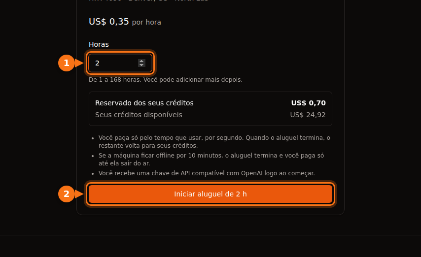

O preço por hora de uma oferta de GPU cobre o tempo de GPU e mais nada. Na maioria das plataformas você também paga pelo espaço em disco (muitas vezes mais caro com a máquina parada do que rodando), pela transferência de dados em alguns marketplaces, pelo tempo de preparação e pelo tempo ocioso que o taxímetro conta como trabalho de verdade, e pela taxa de câmbio do seu banco. No exemplo mais abaixo, um mês planejado em US$ 13,60 de tempo de RTX 4090 vira uma conta de US$ 42,23.

Nada disso é escondido de propósito. Só é fácil de deixar passar quando você compara plataformas pelo número da vitrine. Tudo o que vem a seguir foi conferido na documentação e nas páginas de preço de cada plataforma em setembro de 2026; os links estão no final. Para os preços por hora em si, veja a [comparação de preços de aluguel de GPU](/pt_br/gpu-rental-pricing-comparison-2026/).

## Os extras por plataforma

| Custo | Vast.ai | RunPod | Lambda | AWS EC2 | GPUFlow |
| --- | --- | --- | --- | --- | --- |
| Unidade de cobrança | Por segundo | Por segundo | Por minuto | Por segundo, mínimo de 60 s | Por segundo, mínimo de 1 min |
| Armazenamento com a máquina parada | Cobrado pela tarifa do host | Volume disk a US$ 0,20/GB/mês | Filesystems cobrados por GiB/mês | O EBS continua sendo cobrado | Nenhum |
| Transferência de dados | Tarifa do host, cada byte | Sem cobrança | Sem cobrança | Saída: 100 GB/mês grátis, depois por GB | Nenhuma |
| Para começar | Depósito mínimo de US$ 5 | 1 hora de crédito; US$ 100 para cartões pré-pagos | Pré-autorização de US$ 10 no cartão | Uma forma de pagamento | Recarga de US$ 10; reserva retida por inteiro |
| Saldo chega a zero | Parada, depois destruída | Parado; sem network volume, os dados somem | Cobrança semanal depois do uso | n/d | Não acontece no meio do aluguel |

O GPUFlow pode pular as linhas de armazenamento e transferência porque aluga outra coisa: uma chave de API compatível com a OpenAI para modelos de IA que já estão rodando na GPU de um provedor, e não uma máquina em que você entra. O outro lado é que você não pode rodar o seu próprio código, treinar ou fazer fine-tuning nele. Se você precisa de uma máquina, as outras quatro colunas são as que valem para você.

## Armazenamento, principalmente com a máquina parada

Em qualquer plataforma que aluga uma máquina ou um contêiner, os seus arquivos ficam num disco, e o disco custa dinheiro enquanto existir.

- **RunPod** cobra US$ 0,10 por GB por mês pelo container disk e pelo volume disk enquanto o pod roda. Quando você para o pod, o container disk é apagado e não custa nada, mas o volume disk sobe para US$ 0,20 por GB por mês. Network volumes custam US$ 0,07 por GB por mês abaixo de 1 TB e US$ 0,05 acima disso, rodando ou não. Os planos de economia cobrem só a computação de GPU; o armazenamento é cobrado pelas tarifas normais.
- **Vast.ai** cobra o armazenamento "a cada segundo em que a sua instância existe", em todos os estados, menos offline. A documentação é direta: "Parar uma instância não evita os custos de armazenamento." Quem define a tarifa é o host.
- **AWS** não cobra computação nem transferência de dados de uma instância parada, mas "há cobranças para armazenar volumes do Amazon EBS", e um Elastic IP associado a uma instância parada continua sendo cobrado. Um volume gp3 em us-east-1 custa cerca de US$ 0,08 por GB por mês.
- **Lambda** cobra os filesystems por GiB usado por mês, em incrementos de uma hora.

Um volume disk de 200 GB num pod parado do RunPod custa 200 × US$ 0,20 = US$ 40 por mês, mesmo que você nunca mais ligue o pod. É mais do que 100 horas de uma RTX 4090 pelo preço do Community Cloud do RunPod.

Ficar sem crédito piora a situação. Quando o saldo do RunPod chega a US$ 0, os pods param, e "Pods sem network volume são encerrados, e os dados deles não podem ser recuperados." O Vast.ai também para as instâncias e, se você não tiver cartão salvo, "suas instâncias e dados armazenados serão destruídos" depois de um curto período de tolerância. Ou seja, um volume esquecido ou continua cobrando ou desaparece com o seu trabalho dentro.

O que eu faço: apago os volumes no dia em que o projeto acaba, guardo só o que ainda preciso num network volume pequeno e mantenho uma cópia de tudo o que é importante fora da plataforma de GPU.

## Transferência de dados

Baixar um modelo de 15 GB e subir um dataset pode movimentar dezenas de gigabytes por sessão.

- **Vast.ai** cobra "preços de banda por cada byte enviado ou recebido pela instância, qualquer que seja o estado dela." Cada host define o próprio preço de upload e download, e a documentação avisa que isso "pode ter um impacto significativo no custo total de cargas de trabalho com muitos dados." Olhe esse preço na oferta antes de alugar.
- **RunPod** diz que os pods "não têm cobrança de entrada/saída de dados."
- **Lambda**: "Você não é cobrado por entrada nem por saída de dados."
- **AWS**: a entrada de dados é grátis. A saída para a internet é grátis nos primeiros 100 GB por mês, somando todos os serviços e regiões, e depois é cobrada por GB em faixas. Cada endereço IPv4 público custa US$ 0,005 por hora, em uso ou não, o que dá US$ 3,60 num mês de 720 horas.

## Depósitos, pré-autorizações e crédito pré-pago

A maioria das plataformas de GPU é pré-paga: você compra crédito e depois gasta. O dinheiro que fica parado lá também é um custo, principalmente quando não tem como voltar.

- **Vast.ai**: depósito mínimo de US$ 5, por cartão, BitPay ou Crypto.com. O crédito não gasto comprado com cartão pode ser reembolsado a pedido pelo chat do site; o crédito gasto, não.
- **RunPod**: você precisa ter pelo menos uma hora de crédito para o pod escolhido, e cartões pré-pagos devem depositar no mínimo US$ 100 por transação. Os créditos não são reembolsáveis e não podem ser sacados.
- **Lambda** funciona ao contrário: cobra toda semana o uso da semana anterior e faz uma pré-autorização de US$ 10 quando você cadastra um cartão, estornada em poucos dias. Só aceita os principais cartões de crédito; pré-pagos e de débito são recusados.
- **SaladCloud**: recargas de US$ 5 a US$ 10.000, e o crédito expira 12 meses depois da compra.
- **GPUFlow**: recargas de US$ 10 a US$ 500 com cartão via Stripe, sem taxa, e os créditos não expiram. Quando você inicia um aluguel, o valor total reservado fica retido dos seus créditos, não um pequeno depósito. Reserve 10 horas a US$ 0,40 e US$ 4,00 ficam retidos até o aluguel terminar; o que você não usou volta nesse momento. Créditos comprados não podem ser sacados, e reembolso no cartão só existe para cobrança duplicada ou feita por engano, créditos que nunca chegaram ou exigência legal, dentro de 60 dias.

Crédito que expira, ou que fica parado numa plataforma que você deixou de usar, é dinheiro gasto. Recarregue para o trabalho que você espera fazer neste mês, não para o ano.

## Tempo de preparação e tempo ocioso

Uma máquina alugada cobra por tempo, não por trabalho. Dois tipos de tempo custam o mesmo que trabalho de verdade e não produzem nada.

### Preparação

O taxímetro começa quando a máquina liga. Na Lambda, "a cobrança começa no momento em que você lança uma instância e ela passa nas verificações de saúde." Instalar bibliotecas, baixar uma imagem de contêiner e baixar um modelo, tudo isso acontece em tempo pago. A US$ 0,34 por hora, 15 minutos de preparação dão cerca de US$ 0,09. Pouco numa vez só, mas faça isso todo dia durante um mês e são algumas horas de GPU.

Duas coisas ajudam: começar de um template ou imagem que já tenha o seu ambiente, e guardar os modelos num volume para baixá-los uma vez só (e aí pesar isso contra o custo de armazenamento acima).

No GPUFlow não existe etapa de preparação do seu lado: o provedor já instalou os modelos na máquina, e você recebe a chave de API assim que o aluguel começa.

### Tempo ocioso

A Lambda diz com todas as letras: "As instâncias são cobradas enquanto estiverem rodando, estejam elas sendo usadas ativamente ou não." O Google Cloud diz o mesmo sobre uma VM ociosa que continua no estado RUNNING. Deixar um pod ligado durante a noite para ele estar pronto de manhã custa uma noite de GPU.

O Azure tem uma armadilha a mais. Uma VM que está apenas "Stopped" (por exemplo, desligada de dentro do sistema operacional) continua pagando pelos núcleos. Ela precisa ficar "Stopped (Deallocated)", pelo portal ou pela CLI, para a cobrança de computação acabar.

O GPUFlow também não está imune: você paga até clicar em **Encerrar agora** ou até o tempo reservado acabar. Encerrar antes não custa nada e a parte não usada da reserva volta, então a solução é simplesmente encerrar o aluguel quando terminar. [Como funciona a cobrança do GPUFlow](https://docs.gpuflow.app/pt-br/renters/billing/).

## Incrementos e mínimos de cobrança

Cobrança por segundo é comum hoje, mas os detalhes mudam:

| Plataforma | Como o tempo é cobrado |
| --- | --- |
| Vast.ai | Por segundo |
| RunPod pods | Por segundo (a página de visão geral dos pods ainda diz por minuto) |
| RunPod serverless | Por segundo, arredondado para cima, incluindo o tempo de inicialização do worker e um tempo ocioso (5 segundos por padrão) |
| Lambda | Incrementos de um minuto |
| AWS EC2 (Linux) | Por segundo, mínimo de 60 segundos |
| Google Cloud | Por segundo depois de um mínimo de 1 minuto |
| Azure | Minutos completos |
| GPUFlow | Por segundo, mínimo de 1 minuto, arredondado para cima até o centavo seguinte |

Em trabalhos longos essas diferenças são ruído. Elas pesam em muitas sessões curtas e no serverless, em que o tempo de inicialização e o tempo ocioso são cobrados além das requisições. Se você manda requisições curtas com intervalos entre elas, esses tempos podem custar mais do que as próprias requisições. [Cobrança por segundo ou por hora](/pt_br/per-second-vs-hourly-gpu-billing/) faz as contas.

## Instâncias interruptíveis

Capacidade interruptível (spot) é mais barata, às vezes muito mais barata, mas pode ser tomada de volta.

- O Vast.ai diz que as instâncias interruptíveis são "muitas vezes 50% ou mais baratas que as sob demanda."
- Na AWS, em setembro de 2026, uma p5.4xlarge (uma H100) custava US$ 2,62 por hora no spot contra US$ 6,88 sob demanda.
- No TensorDock, o armazenamento é cobrado pela tarifa normal além do seu lance, e você continua pagando enquanto estiver sendo superado. Os hosts definem um lance mínimo, normalmente em torno de 50% do preço sob demanda.

O custo escondido é o trabalho repetido. Se o seu trabalho não consegue recomeçar de um checkpoint, uma única interrupção pode apagar a economia. Salve checkpoints com frequência suficiente para que perder o último intervalo não doa.

## As taxas do seu banco

Quase toda plataforma de GPU, o GPUFlow incluído, cobra em dólar americano. Se o seu cartão é em outra moeda, o banco pode somar uma taxa própria:

- As tarifas sobre compras internacionais costumam ficar entre 1% e 3%, e alguns bancos cobram mesmo quando o preço aparece em dólar, só porque o lojista é estrangeiro.
- A maioria dos cartões de crédito canadenses cobra cerca de 2,5% em compras em outra moeda.
- No Brasil, o IOF sobre compras internacionais com cartão é de 3,5% desde julho de 2025.

Numa recarga de US$ 100, isso dá de US$ 1 a US$ 3,50 que você não vai ver na fatura da plataforma. Um cartão sem tarifa sobre compras internacionais elimina quase tudo.

## Um exemplo com as contas: US$ 0,34 por hora, US$ 42 por mês

Um mês realista numa RTX 4090 do Community Cloud do RunPod a US$ 0,34 por hora, com um cartão de crédito canadense:

- 40 horas de trabalho de verdade: 40 × US$ 0,34 = US$ 13,60. É esse o número que entra no orçamento.
- 20 sessões com 15 minutos de preparação cada, 5 horas: 5 × US$ 0,34 = US$ 1,70.
- Duas noites em que o pod ficou ligado, 10 horas cada: 20 × US$ 0,34 = US$ 6,80.
- Um volume disk de 100 GB mantido o mês inteiro. Ele roda 65 das 720 horas do mês e fica parado nas outras 655: 100 × (US$ 0,10 × 65/720 + US$ 0,20 × 655/720) = cerca de US$ 19,10.
- Subtotal de US$ 41,20, mais uma tarifa internacional de 2,5%: US$ 1,03.

Total: US$ 42,23, cerca de 3,1 vezes o trabalho de GPU que você planejou. O RunPod não cobra transferência de dados, então num host do Vast.ai com preço de banda haveria mais uma linha.

<figure>
<svg viewBox="0 0 720 300" role="img" aria-labelledby="d1-title" xmlns="http://www.w3.org/2000/svg" font-family="system-ui, sans-serif" font-size="15">
<title id="d1-title">Gráfico de barras empilhadas: um mês planejado em 13,60 dólares de tempo de RTX 4090 vira uma conta de 42,23 dólares depois do tempo de preparação, das noites ociosas, do armazenamento em disco e da tarifa do cartão</title>
<rect x="0" y="0" width="720" height="300" fill="#ffffff"/>
<text x="20" y="28" fill="#1e1b4b" font-weight="600">Um mês numa RTX 4090 a $0.34 por hora</text>
<line x1="130" y1="50" x2="130" y2="170" stroke="#e2e8f0" stroke-width="1"/>
<text x="130" y="190" text-anchor="middle" fill="#64748b" font-size="13">$0</text>
<line x1="250" y1="50" x2="250" y2="170" stroke="#e2e8f0" stroke-width="1"/>
<text x="250" y="190" text-anchor="middle" fill="#64748b" font-size="13">$10</text>
<line x1="370" y1="50" x2="370" y2="170" stroke="#e2e8f0" stroke-width="1"/>
<text x="370" y="190" text-anchor="middle" fill="#64748b" font-size="13">$20</text>
<line x1="490" y1="50" x2="490" y2="170" stroke="#e2e8f0" stroke-width="1"/>
<text x="490" y="190" text-anchor="middle" fill="#64748b" font-size="13">$30</text>
<line x1="610" y1="50" x2="610" y2="170" stroke="#e2e8f0" stroke-width="1"/>
<text x="610" y="190" text-anchor="middle" fill="#64748b" font-size="13">$40</text>
<text x="120" y="84" text-anchor="end" fill="#1e1b4b">Planejado</text>
<rect x="130" y="62" width="163.2" height="34" rx="3" fill="#6366f1"/>
<text x="301.2" y="84" fill="#1e1b4b">$13.60</text>
<text x="120" y="144" text-anchor="end" fill="#1e1b4b">Cobrado</text>
<rect x="130" y="122" width="163.2" height="34" fill="#6366f1"/>
<rect x="293.2" y="122" width="20.4" height="34" fill="#eef2ff" stroke="#6366f1" stroke-width="1.5"/>
<rect x="313.6" y="122" width="81.6" height="34" fill="#f97316"/>
<rect x="395.2" y="122" width="229.2" height="34" fill="#64748b"/>
<rect x="624.4" y="122" width="12.4" height="34" fill="#1e1b4b"/>
<text x="644.8" y="144" fill="#1e1b4b" font-weight="600">$42.23</text>
<line x1="130" y1="50" x2="130" y2="170" stroke="#64748b" stroke-width="1.5"/>
<rect x="20" y="209" width="16" height="16" fill="#6366f1"/>
<text x="44" y="222" fill="#1e1b4b">Trabalho na GPU: $13.60</text>
<rect x="250" y="209" width="16" height="16" fill="#eef2ff" stroke="#6366f1" stroke-width="1.5"/>
<text x="274" y="222" fill="#1e1b4b">Preparação: $1.70</text>
<rect x="480" y="209" width="16" height="16" fill="#f97316"/>
<text x="504" y="222" fill="#1e1b4b">Noites ociosas: $6.80</text>
<rect x="20" y="245" width="16" height="16" fill="#64748b"/>
<text x="44" y="258" fill="#1e1b4b">Volume disk: $19.10</text>
<rect x="250" y="245" width="16" height="16" fill="#1e1b4b"/>
<text x="274" y="258" fill="#1e1b4b">Tarifa do cartão: $1.03</text>
</svg>
<figcaption>O exemplo desta seção, em escala: 40 horas de trabalho real de GPU a US$ 0,34 por hora, mais 5 horas de preparação, duas noites esquecidas, um volume disk de 100 GB mantido o mês todo e uma tarifa de cartão de 2,5%. O trabalho de GPU é menos de um terço da conta.</figcaption>
</figure>

O maior item nem é a GPU, é um disco que ficou parado 91% do mês. A solução é sem graça: apagar o volume ou diminuí-lo, e encerrar o pod quando parar de trabalhar.

### Um checklist antes de alugar

1. Some o tempo de GPU com o armazenamento pelo tempo em que você vai manter os arquivos, pela tarifa de máquina parada.
2. Confira o preço de banda na oferta, se a plataforma cobrar, e estime quanto você vai baixar.
3. Conte o tempo de preparação como tempo pago.
4. Saiba como você vai parar de pagar: encerrar o aluguel, parar ou desalocar a máquina, apagar o volume.
5. Saiba [o que acontece com os seus dados se o saldo chegar a zero](/pt_br/runpod-vs-vastapi-comparison/).
6. Confira a tarifa internacional do seu cartão.

Se o que você precisa é de um modelo de IA para chamar a partir do seu código, e não de uma máquina para rodar o seu próprio software, um aluguel via API elimina de vez as linhas de armazenamento, transferência e preparação. [GPU por hora ou API por token](/pt_br/hourly-gpu-vs-per-token-api/) compara isso com pagar por token, e [GPUFlow vs Vast.ai vs RunPod vs SaladCloud](/pt_br/gpuflow-vs-vast-ai-vs-runpod/) mostra qual plataforma serve para qual trabalho. Para treino ou qualquer outra coisa que exija uma máquina inteira, este checklist é o que mantém a conta perto do preço por hora.

## Fontes

- RunPod: [preços de pods e armazenamento](https://docs.runpod.io/pods/pricing), [página de preços](https://www.runpod.io/pricing), [visão geral dos pods](https://docs.runpod.io/pods/overview), [preços do serverless](https://docs.runpod.io/serverless/pricing), [informações de cobrança](https://docs.runpod.io/references/billing-information), [preços da RTX 4090](https://www.runpod.io/gpu-models/rtx-4090)
- Vast.ai: [preços](https://docs.vast.ai/guides/instances/pricing.md), [cobrança](https://docs.vast.ai/documentation/reference/billing), [guia rápido (depósito mínimo)](https://docs.vast.ai/guides/get-started/quickstart.md)
- Lambda: [cobrança](https://docs.lambda.ai/public-cloud/billing/), [gerenciar cobrança](https://docs.lambda.ai/public-cloud/manage-billing/)
- SaladCloud: [cobrança](https://docs.salad.com/general/explanation/billing.md)
- TensorDock: [instâncias spot](https://docs.tensordock.com/virtual-machines/spot-instances)
- AWS: [preços sob demanda do EC2](https://aws.amazon.com/ec2/pricing/on-demand/), [como funciona parar e iniciar](https://docs.aws.amazon.com/AWSEC2/latest/UserGuide/how-ec2-instance-stop-start-works.html), [preços da VPC (IPv4 público)](https://aws.amazon.com/vpc/pricing/), [preços da p5.4xlarge via Vantage](https://instances.vantage.sh/aws/ec2/p5.4xlarge?region=us-east-1), preço do gp3: [guia de preços do EBS da CloudBurn](https://cloudburn.io/blog/amazon-ebs-pricing)
- Google Cloud: [preços de instâncias de VM](https://cloud.google.com/compute/vm-instance-pricing)
- Azure: [preços e FAQ de VMs Linux](https://azure.microsoft.com/en-us/pricing/details/virtual-machines/linux/)
- Tarifas de cartão: [Experian](https://www.experian.com/blogs/ask-experian/what-is-a-foreign-transaction-fee/), [NerdWallet Canadá](https://www.nerdwallet.com/ca/p/best/credit-cards/best-no-foreign-transaction-fee-credit-cards), IOF no Brasil: [Wise Brasil](https://wise.com/br/blog/iof-cartao-internacional)
- GPUFlow: [cobrança](https://docs.gpuflow.app/pt-br/renters/billing/), [primeiros passos](https://docs.gpuflow.app/pt-br/renters/getting-started/), [marketplace](https://gpuflow.app/pt-BR/marketplace)

Tudo verificado em setembro de 2026.
