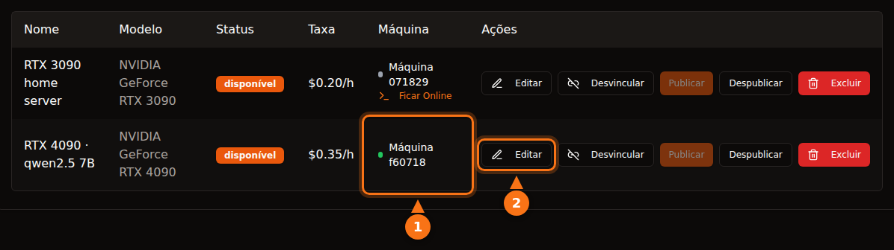

É razoavelmente seguro se você escolher a plataforma sabendo o que está fazendo, mas "seguro" significa coisas diferentes em plataformas diferentes. Em plataformas de contêiner como o Vast.ai, o locatário roda o próprio código na sua máquina e o tráfego dele sai pelo seu endereço IP; o isolamento o mantém longe dos seus arquivos, não da sua rede nem da sua conta de luz. Em um modelo só de API como o GPUFlow, o locatário só consegue enviar requisições de chat para os modelos que você instalou, e o risco se inverte: os prompts podem ser lidos na sua máquina, então os locatários não devem enviar nada secreto.

Este artigo trata das duas direções. As informações sobre outras plataformas foram conferidas na documentação de cada uma em setembro de 2026, e tudo o que diz respeito ao GPUFlow vem do código-fonte e da documentação dele. As fontes estão no final.

## O que um locatário pode fazer em uma plataforma de contêiner

A maioria dos marketplaces de GPU aluga um contêiner. O locatário escolhe uma imagem, recebe um shell e roda o que quiser. Isso deixa você, o host, com cinco pontos para pensar.

- **Código arbitrário.** O código do locatário roda no seu kernel, dentro de um contêiner ou de uma VM. O isolamento é bom, mas não perfeito; fugas de contêiner são raras, e são exatamente o tipo de bug corrigido nas atualizações de kernel e de driver que você precisa instalar.
- **Seu endereço IP.** O tráfego de saída do contêiner sai pela sua conexão de internet. Se um locatário fizer scraping de um site, mandar spam ou varrer a internet, a denúncia de abuso vai para o seu provedor de internet, endereçada ao seu IP. Os termos do Vast.ai dizem que os usuários indenizam os provedores por reclamações decorrentes do conteúdo dos usuários, o que ajuda numa disputa com terceiros, mas não impede o seu provedor de internet de mandar um aviso para você.
- **Portas abertas.** O guia de hospedagem do Vast.ai diz que "os clientes precisam de portas abertas para se conectar diretamente à máquina na maioria dos trabalhos", então você redireciona portas no seu roteador.
- **Disco.** Os locatários baixam imagens, modelos e datasets para os seus discos. O Vast.ai libera o espaço quando um cliente apaga um volume, mas enquanto o aluguel dura, o espaço é dele.
- **Energia, calor e drivers.** O Vast.ai avisa os hosts: "espere que a GPU seja usada perto da capacidade máxima durante o período do aluguel". São horas com a placa na potência máxima, calor no cômodo e ventoinhas girando. As plataformas de contêiner também exigem uma instalação específica: o guia do Vast.ai lista instalar o Ubuntu, particionar os discos, instalar os drivers da NVIDIA e abrir portas no roteador.

## Como Vast.ai, Salad e RunPod isolam os locatários

| | Vast.ai | Salad | RunPod Community Cloud |
| --- | --- | --- | --- |
| **O locatário recebe** | Um contêiner (ou uma VM) com SSH ou Jupyter | Um contêiner que ele mesmo implantou; SSH e um terminal web dentro dele | Um pod (contêiner) |
| **Isolamento** | Contêineres Docker sem privilégios | VM Linux sobre um hypervisor, com o contêiner dentro | "Seu próprio contêiner, com separação rigorosa" |
| **Portas de entrada** | Necessárias na maioria dos trabalhos | Bloqueadas por padrão | Não informado |
| **Novos hosts** | Sim, no Ubuntu | Sim, no Windows 10/11 | Não aceita mais |

- O **Vast.ai** diz que "os clientes ficam isolados em contêineres Docker sem privilégios e só têm acesso aos próprios dados", com namespaces e cgroups separados e isolamento de rede, sistema de arquivos e processos. Ele também avisa os locatários de que "a segurança dos provedores varia bastante" e indica o Secure Cloud, sua linha de data centers certificados, para trabalhos sensíveis.
- O **Salad** diz que "sua carga de trabalho roda dentro de um contêiner compatível com OCI em uma máquina virtual Linux, isolada do Windows e de todos os outros processos do host", com conexões de entrada bloqueadas por padrão. Ele também protege os locatários dos hosts: se um host "tentar acessar o ambiente Linux, destruímos o ambiente automaticamente e colocamos a máquina na lista negra". À parte disso, o Salad oferece trabalhos opcionais de compartilhamento de banda que "processam conteúdo de vídeo de plataformas de streaming premium" pela sua conexão; a página de suporte avisa que isso aumenta o seu consumo de dados e pode causar "uma restrição de conteúdo rara e temporária (normalmente de 1 a 2 dias) nessas plataformas de streaming".
- O **RunPod** diz que "o Runpod não está mais aceitando novos hosts no Community Cloud". Na capacidade que já existe, "cada Pod/worker opera no seu próprio contêiner", e os termos "proíbem os hosts de inspecionar os dados do seu Pod/worker".

As três isolam o locatário do seu sistema. Nenhuma delas consegue impedir que um tráfego com cara de legítimo saia pela sua conexão, e nenhuma afirma que consegue.

## Como o GPUFlow é diferente

O GPUFlow aluga um modelo de IA atrás de uma API compatível com a OpenAI, não uma máquina. Isso muda o que o locatário consegue alcançar. Veja o que o código faz.

**O agente.** O instalador coloca um único binário Go em `/usr/local/bin/gpuflow-agent` e o roda como serviço do systemd. Não há Docker. A unit do serviço usa `DynamicUser=yes` (um usuário temporário sem privilégios), `NoNewPrivileges=yes` (ele não consegue ganhar permissões), `ProtectSystem=strict` (o sistema fica somente leitura para ele), `ProtectHome=yes` (as pastas pessoais ficam invisíveis) e `PrivateTmp=yes`. O motor de inferência é o Ollama por padrão, instalado pelo próprio instalador do Ollama como um serviço separado (o provedor pode, em vez disso, apontar o agente para o seu próprio servidor compatível com a OpenAI). O endurecimento vale para o agente, não para o Ollama.

**Rede.** O agente só faz conexões de saída: um WebSocket sobre TLS para `wss://ws.gpuflow.app` e HTTPS para `gpuflow.app`, para se registrar e enviar um heartbeat a cada 15 segundos. Ele não abre portas, você não redireciona nada no roteador e os locatários nunca ficam sabendo o seu endereço IP. Ele conversa com o Ollama em `127.0.0.1:11434`, o endereço de loopback padrão do Ollama.

**O que os locatários podem chamar.** O locatário recebe uma chave de API para `https://gpuflow.app/v1`. O próprio GPUFlow responde ao `GET /v1/models`, e a única requisição que ele encaminha para a sua máquina é `POST /v1/chat/completions`. O agente tem uma segunda trava própria: ele só repassa quatro caminhos exatos (`/v1/chat/completions`, `/v1/completions`, `/v1/embeddings` e `/v1/models`) e recusa todo o resto, incluindo os endpoints nativos `/api/*` do Ollama, que serviriam para baixar, apagar ou criar modelos. O agente trata um único tipo de mensagem, uma requisição de inferência; qualquer outra coisa é ignorada.

Ou seja, o locatário não tem shell, nem SSH, nem arquivos, nem acesso de rede à sua máquina. Ele não consegue baixar um modelo de 70 GB para o seu disco nem usar a sua conexão para acessar a internet. O que ele consegue é manter a sua GPU ocupada pelas horas que reservou e usar no campo `model` qualquer modelo que você instalou.

<figure>
<svg viewBox="0 0 720 380" role="img" aria-labelledby="d1-title" xmlns="http://www.w3.org/2000/svg" font-family="system-ui, sans-serif" font-size="15">
<title id="d1-title">O que um locatário pode fazer em um host de contêiner, comparado com um modelo só de API como o GPUFlow</title>
<rect x="0" y="0" width="720" height="380" fill="#ffffff"/>
<text x="20" y="40" fill="#64748b" font-weight="bold">O que o locatário pode fazer</text>
<text x="470" y="40" text-anchor="middle" fill="#1e1b4b" font-weight="bold">Host de contêiner</text>
<text x="630" y="40" text-anchor="middle" fill="#1e1b4b" font-weight="bold">GPUFlow (API)</text>
<line x1="20" y1="55" x2="700" y2="55" stroke="#e2e8f0" stroke-width="2"/>
<text x="20" y="89" fill="#1e1b4b">Rodar os próprios programas</text>
<rect x="430" y="70" width="80" height="28" rx="14" fill="#fff7ed" stroke="#f97316" stroke-width="2"/>
<text x="470" y="89" text-anchor="middle" fill="#1e1b4b">Sim</text>
<rect x="590" y="70" width="80" height="28" rx="14" fill="#f0fdf4" stroke="#16a34a" stroke-width="2"/>
<text x="630" y="89" text-anchor="middle" fill="#1e1b4b">Não</text>
<line x1="20" y1="110" x2="700" y2="110" stroke="#e2e8f0" stroke-width="1"/>
<text x="20" y="133" fill="#1e1b4b">Abrir um shell ou SSH</text>
<rect x="430" y="114" width="80" height="28" rx="14" fill="#fff7ed" stroke="#f97316" stroke-width="2"/>
<text x="470" y="133" text-anchor="middle" fill="#1e1b4b">Sim</text>
<rect x="590" y="114" width="80" height="28" rx="14" fill="#f0fdf4" stroke="#16a34a" stroke-width="2"/>
<text x="630" y="133" text-anchor="middle" fill="#1e1b4b">Não</text>
<line x1="20" y1="154" x2="700" y2="154" stroke="#e2e8f0" stroke-width="1"/>
<text x="20" y="177" fill="#1e1b4b">Gravar arquivos no seu disco</text>
<rect x="430" y="158" width="80" height="28" rx="14" fill="#fff7ed" stroke="#f97316" stroke-width="2"/>
<text x="470" y="177" text-anchor="middle" fill="#1e1b4b">Sim</text>
<rect x="590" y="158" width="80" height="28" rx="14" fill="#f0fdf4" stroke="#16a34a" stroke-width="2"/>
<text x="630" y="177" text-anchor="middle" fill="#1e1b4b">Não</text>
<line x1="20" y1="198" x2="700" y2="198" stroke="#e2e8f0" stroke-width="1"/>
<text x="20" y="221" fill="#1e1b4b">Enviar tráfego pelo seu IP</text>
<rect x="430" y="202" width="80" height="28" rx="14" fill="#fff7ed" stroke="#f97316" stroke-width="2"/>
<text x="470" y="221" text-anchor="middle" fill="#1e1b4b">Sim</text>
<rect x="590" y="202" width="80" height="28" rx="14" fill="#f0fdf4" stroke="#16a34a" stroke-width="2"/>
<text x="630" y="221" text-anchor="middle" fill="#1e1b4b">Não</text>
<line x1="20" y1="242" x2="700" y2="242" stroke="#e2e8f0" stroke-width="1"/>
<text x="20" y="265" fill="#1e1b4b">Exigir portas abertas no roteador</text>
<rect x="430" y="246" width="80" height="28" rx="14" fill="#fff7ed" stroke="#f97316" stroke-width="2"/>
<text x="470" y="265" text-anchor="middle" fill="#1e1b4b">Em geral</text>
<rect x="590" y="246" width="80" height="28" rx="14" fill="#f0fdf4" stroke="#16a34a" stroke-width="2"/>
<text x="630" y="265" text-anchor="middle" fill="#1e1b4b">Não</text>
<line x1="20" y1="286" x2="700" y2="286" stroke="#e2e8f0" stroke-width="1"/>
<text x="20" y="309" fill="#1e1b4b">Baixar ou apagar modelos</text>
<rect x="430" y="290" width="80" height="28" rx="14" fill="#fff7ed" stroke="#f97316" stroke-width="2"/>
<text x="470" y="309" text-anchor="middle" fill="#1e1b4b">Sim</text>
<rect x="590" y="290" width="80" height="28" rx="14" fill="#f0fdf4" stroke="#16a34a" stroke-width="2"/>
<text x="630" y="309" text-anchor="middle" fill="#1e1b4b">Não</text>
<line x1="20" y1="330" x2="700" y2="330" stroke="#e2e8f0" stroke-width="1"/>
<text x="20" y="353" fill="#1e1b4b">Manter sua GPU ocupada por horas</text>
<rect x="430" y="334" width="80" height="28" rx="14" fill="#eef2ff" stroke="#6366f1" stroke-width="2"/>
<text x="470" y="353" text-anchor="middle" fill="#1e1b4b">Sim</text>
<rect x="590" y="334" width="80" height="28" rx="14" fill="#eef2ff" stroke="#6366f1" stroke-width="2"/>
<text x="630" y="353" text-anchor="middle" fill="#1e1b4b">Sim</text>
</svg>
<figcaption>A coluna de contêiner descreve uma hospedagem no estilo do Vast.ai, em que arquivos e tráfego ficam dentro do contêiner do locatário, mas usam o seu disco e a sua conexão. Os detalhes variam: o Salad roda os contêineres em uma VM Linux e bloqueia conexões de entrada por padrão. No GPUFlow, o locatário só envia requisições de chat para os modelos que você instalou.</figcaption>
</figure>

## O caminho dos dados, trecho por trecho

Esta é a parte que os locatários devem ler. Uma requisição de chat passa por quatro softwares, e o texto pode ser lido em mais de um deles.

<figure>
<svg viewBox="0 0 720 330" role="img" aria-labelledby="d2-title" xmlns="http://www.w3.org/2000/svg" font-family="system-ui, sans-serif" font-size="15">
<title id="d2-title">Uma requisição de chat no GPUFlow vai do app do locatário para o gpuflow.app, o relay, o agente no PC do provedor e o Ollama, e a resposta volta pelo mesmo caminho em streaming</title>
<rect x="0" y="0" width="720" height="330" fill="#ffffff"/>
<rect x="480" y="50" width="230" height="200" rx="12" fill="#fff7ed" stroke="#f97316" stroke-width="2" stroke-dasharray="6 4"/>
<text x="595" y="76" text-anchor="middle" fill="#1e1b4b" font-weight="bold">PC do provedor</text>
<rect x="10" y="110" width="110" height="70" rx="10" fill="#eef2ff" stroke="#6366f1" stroke-width="2"/>
<text x="65" y="141" text-anchor="middle" fill="#1e1b4b">App do</text>
<text x="65" y="161" text-anchor="middle" fill="#1e1b4b">locatário</text>
<rect x="160" y="110" width="120" height="70" rx="10" fill="#eef2ff" stroke="#6366f1" stroke-width="2"/>
<text x="220" y="141" text-anchor="middle" fill="#1e1b4b" font-size="13">API do GPUFlow</text>
<text x="220" y="161" text-anchor="middle" fill="#64748b" font-size="12">gpuflow.app/v1</text>
<rect x="320" y="110" width="105" height="70" rx="10" fill="#eef2ff" stroke="#6366f1" stroke-width="2"/>
<text x="372" y="141" text-anchor="middle" fill="#1e1b4b">Relay</text>
<text x="372" y="161" text-anchor="middle" fill="#64748b" font-size="12">ws.gpuflow.app</text>
<rect x="492" y="110" width="90" height="70" rx="10" fill="#ffffff" stroke="#6366f1" stroke-width="2"/>
<text x="537" y="141" text-anchor="middle" fill="#1e1b4b">Agente</text>
<text x="537" y="161" text-anchor="middle" fill="#1e1b4b">GPUFlow</text>
<rect x="610" y="110" width="90" height="70" rx="10" fill="#ffffff" stroke="#6366f1" stroke-width="2"/>
<text x="655" y="141" text-anchor="middle" fill="#1e1b4b">Ollama</text>
<text x="655" y="161" text-anchor="middle" fill="#64748b" font-size="12">127.0.0.1</text>
<line x1="124" y1="145" x2="156" y2="145" stroke="#16a34a" stroke-width="4"/>
<line x1="284" y1="145" x2="316" y2="145" stroke="#64748b" stroke-width="4"/>
<line x1="429" y1="145" x2="488" y2="145" stroke="#16a34a" stroke-width="4"/>
<line x1="586" y1="145" x2="606" y2="145" stroke="#f97316" stroke-width="4"/>
<text x="140" y="102" text-anchor="middle" fill="#16a34a" font-size="13">TLS</text>
<text x="300" y="102" text-anchor="middle" fill="#64748b" font-size="13">interno</text>
<text x="452" y="102" text-anchor="middle" fill="#16a34a" font-size="13">TLS</text>
<text x="596" y="102" text-anchor="middle" fill="#f97316" font-size="13">sem TLS</text>
<text x="65" y="212" text-anchor="middle" fill="#64748b" font-size="12">O texto é</text>
<text x="65" y="228" text-anchor="middle" fill="#64748b" font-size="12">escrito aqui</text>
<text x="220" y="212" text-anchor="middle" fill="#64748b" font-size="12">Lê o texto,</text>
<text x="220" y="228" text-anchor="middle" fill="#64748b" font-size="12">guarda só a</text>
<text x="220" y="244" text-anchor="middle" fill="#64748b" font-size="12">contagem de tokens</text>
<text x="372" y="212" text-anchor="middle" fill="#64748b" font-size="12">Só repassa,</text>
<text x="372" y="228" text-anchor="middle" fill="#64748b" font-size="12">não registra</text>
<text x="372" y="244" text-anchor="middle" fill="#64748b" font-size="12">o conteúdo</text>
<text x="595" y="212" text-anchor="middle" fill="#1e1b4b" font-size="13" font-weight="bold">Texto puro na memória</text>
<text x="595" y="230" text-anchor="middle" fill="#1e1b4b" font-size="13" font-weight="bold">O dono tem acesso root</text>
<line x1="20" y1="295" x2="50" y2="295" stroke="#16a34a" stroke-width="4"/>
<text x="58" y="300" fill="#1e1b4b" font-size="13">TLS pela internet</text>
<line x1="235" y1="295" x2="265" y2="295" stroke="#64748b" stroke-width="4"/>
<text x="273" y="300" fill="#1e1b4b" font-size="13">dentro do GPUFlow</text>
<line x1="420" y1="295" x2="450" y2="295" stroke="#f97316" stroke-width="4"/>
<text x="458" y="300" fill="#1e1b4b" font-size="13">texto puro no PC do provedor</text>
</svg>
<figcaption>A requisição vai da esquerda para a direita e a resposta volta pelo mesmo caminho em streaming. O TLS protege cada trecho que passa pela internet, mas termina em cada servidor, então o texto pode ser lido nos servidores do GPUFlow enquanto eles o encaminham e no PC do provedor, onde o Ollama roda o modelo.</figcaption>
</figure>

1. **Do locatário para o gpuflow.app:** HTTPS. O site fica atrás do Cloudflare.
2. **Da API do GPUFlow para o relay:** uma conexão interna do lado do GPUFlow. A API verifica a chave, encaminha o corpo da requisição sem alterações e registra a contagem de tokens. Ela não guarda o texto das requisições nem das respostas, e a política de privacidade diz isso.
3. **Do relay para o agente do provedor:** um WebSocket com TLS que o próprio agente abriu. O relay registra o tipo de cada mensagem, não o conteúdo.
4. **Do agente para o Ollama:** HTTP simples no endereço de loopback, dentro do PC do provedor. O agente também não registra o corpo das requisições.

Não há criptografia de ponta a ponta até o modelo, e nem pode haver com um motor de inferência comum: o modelo precisa ler o prompt para responder.

## O que o provedor consegue ver

Sem rodeios: **o computador do provedor processa os seus prompts e respostas em texto puro.** O Ollama roda ali, e o provedor tem acesso root à máquina (o instalador exige isso). Um provedor que quisesse poderia capturar o tráfego de loopback, trocar o motor ou apontar o agente para outro servidor.

O que impede isso é contratual. Os termos do GPUFlow dizem que os provedores "não podem registrar, ler, guardar ou compartilhar as requisições ou respostas dos locatários, nem alterar as respostas". É uma regra com consequências para a conta, não um bloqueio técnico. A política de privacidade diz o mesmo aos locatários: as requisições e respostas passam pelo computador do provedor enquanto o aluguel dura.

Além dos prompts, o provedor vê o seu nome de usuário no GPUFlow e recebe um aviso quando um aluguel começa (id do aluguel, anúncio e horas). Os locatários não veem nada das estatísticas da máquina do provedor; temperatura da GPU, VRAM, consumo de energia e outras métricas vão só para o painel do dono.

A regra prática para locatários: **não envie segredos, credenciais, dados pessoais de outras pessoas nem dados regulados (saúde, finanças, informações confidenciais de clientes) por nenhuma GPU comunitária.** Isso vale para o GPUFlow e, do mesmo jeito, para um contêiner no PC de alguém, onde o host pode inspecionar a memória e o disco com o mesmo acesso root. Para trabalho sensível, rode o modelo em hardware que você controla ou use um fornecedor que assine o contrato que a sua área de compliance exige. [Por que algumas empresas proíbem ferramentas públicas de IA](/pt_br/why-corporate-policies-banning-chatgpt/) trata do lado das políticas, e [como proteger um dataset em um nó de GPU público](/pt_br/how-to-secure-dataset-on-public-gpu-node/) trata do lado dos contêineres.

## O que ainda tem risco no GPUFlow

Um modelo só de API reduz a superfície de ataque. Não a elimina, e prefiro listar o que sobra a fingir o contrário.

- **O Ollama processa entrada não confiável.** Toda requisição de locatário acaba virando um JSON entregue ao Ollama. Um bug no Ollama é o caminho de entrada mais provável, então mantenha-o atualizado. A lista de permissões do agente mantém os locatários longe dos endpoints de gerenciamento de modelos do Ollama, mas não corrige um bug no caminho do chat.
- **O instalador roda como root.** Você passa um script do gpuflow.app para `sudo bash`, e ele também roda o script de instalação do Ollama. Leia os dois antes; isso é boa prática para qualquer software de hospedagem.
- **Sem atualização automática.** O agente não se atualiza sozinho. Para pegar uma versão nova, rode o instalador de novo; ele confere o binário contra um arquivo SHA256SUMS quando há um publicado.
- **Carga.** Não há limite de requisições. Um locatário pode manter a sua GPU em carga máxima em todas as horas que reservou e pode usar qualquer modelo que você instalou, inclusive o maior.
- **Calor e energia.** Igual a qualquer outro lugar: hora alugada é hora com carga.

## Checklist para provedores

1. **Use uma máquina que você possa emprestar.** O ideal é uma máquina dedicada. No mínimo, não deixe arquivos de trabalho nem gerenciadores de senha no computador que você aluga, qualquer que seja a plataforma. No GPUFlow, o agente já roda como um usuário de sistema temporário e com as pastas pessoais ocultas, mas o Ollama é um serviço separado.
2. **Limite a potência.** `sudo nvidia-smi -pl 280` define o limite de potência da placa em watts (exige root, e o valor precisa ficar entre os limites mínimo e máximo da placa). A Puget Systems relata que RTX 3090 limitadas a 270-280 W mantêm cerca de 95% do desempenho e mostra como reaplicar o limite a cada boot com uma unit do systemd.
3. **Faça a conta da energia antes.** Veja o consumo em **Minhas máquinas** enquanto a GPU está ocupada e multiplique os quilowatts pelo seu preço por kWh. [Quanto a sua GPU gamer pode render](/pt_br/how-much-can-you-earn-renting-out-your-gpu/) faz essa conta para placas comuns e cinco países.
4. **Acompanhe a temperatura.** As estatísticas ao vivo mostram as temperaturas da GPU, do hotspot e da memória e a velocidade das ventoinhas. Garanta que o gabinete tenha ventilação.
5. **Mantenha o sistema atualizado.** Instale as atualizações do Linux, do driver da GPU e do Ollama. O instalador do GPUFlow não gerencia o driver da sua GPU; o systemd reinicia o agente depois de um reboot.
6. **Saiba como pausar.** Despublique o anúncio em **Minhas GPUs** ou rode `sudo systemctl stop gpuflow-agent` (`start` o traz de volta). Enquanto há um aluguel ativo, o painel não deixa alterar o anúncio nem a máquina, e você não consegue encerrar o aluguel do locatário por ali. Parar o agente no meio de um aluguel faz o aluguel terminar depois de 10 minutos, e você só recebe até o último heartbeat.
7. **Saiba como desinstalar.** Os passos estão na [documentação de solução de problemas](https://docs.gpuflow.app/pt-br/providers/troubleshooting/). O Ollama continua instalado até você removê-lo.

Em plataformas de contêiner, acrescente dois itens: decida se você quer mesmo portas abertas no seu roteador e pergunte ao seu provedor de internet o que ele faz com denúncias de abuso, porque o tráfego dos locatários vai sair com o seu endereço IP.

## Checklist para locatários

1. **Trate toda GPU comunitária como o computador de um desconhecido.** Nada de chaves de API, senhas, cadastros de clientes, dados médicos ou financeiros nos prompts.
2. **Tire o que não for necessário.** Troque nomes e números de conta por marcadores antes de enviar.
3. **Proteja a sua chave.** No GPUFlow, a chave para de funcionar quando o aluguel termina. Se ela vazar, **Nova chave** revoga a antiga na hora, e **Encerrar agora** para a cobrança e devolve o tempo não usado.
4. **Considere que as respostas podem estar erradas ou adulteradas.** Os termos proíbem os provedores de alterar as respostas, mas confira qualquer coisa importante.
5. **Use a ferramenta certa para trabalho sensível.** Hospede o modelo você mesmo ou use um fornecedor que ofereça o contrato de que você precisa. [Como usar a chave nos seus apps](/pt_br/use-openai-compatible-api-key-in-apps/) serve para todo o resto.

## Fontes

Tudo verificado em setembro de 2026.

- GPUFlow: [o que os locatários conseguem acessar](https://docs.gpuflow.app/pt-br/providers/security/), [primeiros passos para provedores](https://docs.gpuflow.app/pt-br/providers/getting-started/), [preço e energia](https://docs.gpuflow.app/pt-br/providers/pricing/), [solução de problemas e desinstalação](https://docs.gpuflow.app/pt-br/providers/troubleshooting/), [guia rápido da API](https://docs.gpuflow.app/pt-br/renters/api-quickstart/)
- Vast.ai: [visão geral da hospedagem](https://docs.vast.ai/host/hosting-overview.md), [FAQ de segurança](https://docs.vast.ai/documentation/reference/faq/security), [máquinas virtuais Linux](https://docs.vast.ai/linux-virtual-machines), [termos de serviço](https://vast.ai/terms), [como rodar modelos de IA privados](https://vast.ai/article/running-private-ai-models-without-the-risk-of-data-exposure)
- Salad: [segurança](https://salad.com/security), [cargas de trabalho em contêiner e o seu PC](https://community.salad.com/container-workloads-and-your-pc/), [compartilhamento de banda](https://support.salad.com/faq/jobs/what-is-bandwidth-sharing/), [SSH e terminal](https://docs.salad.com/container-engine/explanation/container-groups/ssh-and-terminal.md), [download e requisitos de sistema](https://salad.com/download/)
- RunPod: [como escolher um pod](https://docs.runpod.io/pods/choose-a-pod), [segurança de dados e conformidade legal](https://docs.runpod.io/hosting/partner-requirements)
- Ollama: [FAQ (endereço de bind padrão)](https://docs.ollama.com/faq)
- NVIDIA: [manual do nvidia-smi](https://docs.nvidia.com/deploy/nvidia-smi/index.html)
- Puget Systems: [limitação de potência de RTX 3090 com systemd e nvidia-smi](https://www.pugetsystems.com/labs/hpc/quad-rtx3090-gpu-power-limiting-with-systemd-and-nvidia-smi-1983/)
