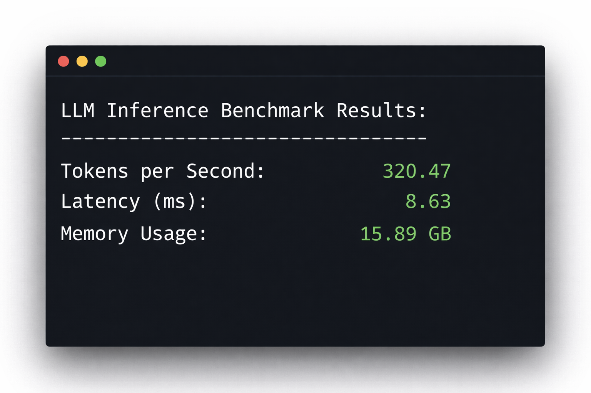
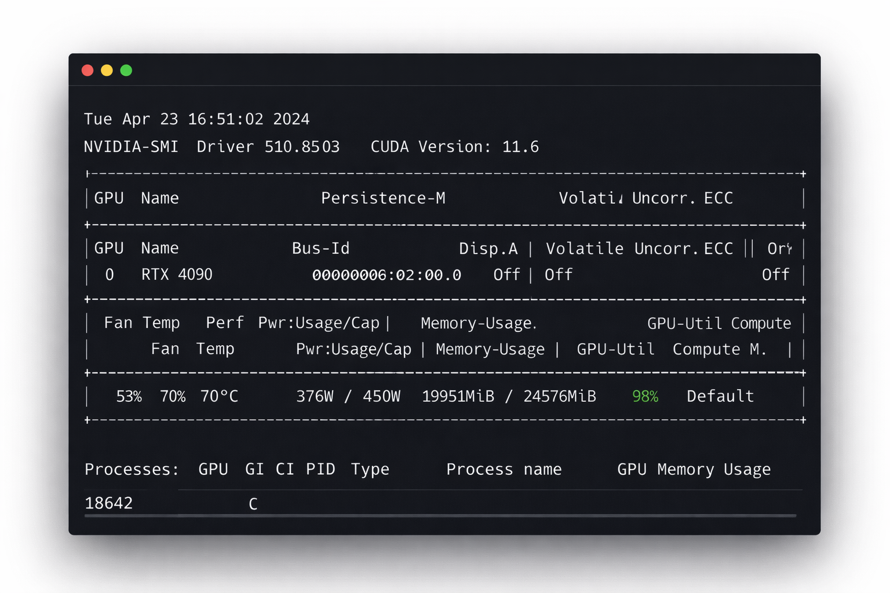

````

Executar seu próprio modelo é apenas metade da equação.

Após concluir o fine‑tuning — conforme detalhado em nosso [Guia de Fine‑Tuning Privado de LLM](/pt_br/private-llm-fine-tuning-guide) — a próxima decisão é operacional: como servir o modelo de forma eficiente?

Inference determina:

- Custo por token
- Latência sob carga
- Eficiência de utilização da GPU
- Se hardware de consumo é viável em produção

Este benchmark compara três stacks de Inference amplamente utilizados:

- Ollama
- vLLM
- Hugging Face Text Generation Inference (TGI)

O objetivo não é preferência.
O objetivo é medição.

---

## Ambiente de Teste

**Hardware**

- GPU: NVIDIA RTX 4090 (24GB VRAM)
- CPU: Processador de consumo classe Ryzen com 16 núcleos
- RAM: 64GB DDR5
- Armazenamento: NVMe SSD
- CUDA: 12.1
- Driver NVIDIA: 550+

**Modelo**

- `meta-llama/Llama-3.1-8B`
- Precisão: FP16 (sem quantização 4‑bit)
- Janela de contexto: 4096 tokens

**Condições do Benchmark**

- Prompt de entrada de 512 tokens
- Geração de 128 tokens de saída
- Greedy decoding (temperature = 0)
- Sem speculative decoding
- Sem tensor parallelism
- Apenas warm start (modelo pré-carregado antes da medição)
- 8 streams simultâneos (quando suportado)

Todos os testes foram executados em máquina limpa, sem cargas em segundo plano.
Cada medição representa a média de cinco execuções.

---



---

# Resultados

## 1. Ollama

O Ollama prioriza simplicidade. A instalação é mínima e os modelos são baixados automaticamente.

```bash
ollama run llama3
````

Há configuração limitada para comportamento de batching ou estratégia de agendamento.

### Desempenho Medido (RTX 4090, FP16)

- **Throughput em stream único:** 62–74 tokens/sec
- **Throughput em 8 streams:** 95–108 tokens/sec
- **Latência do primeiro token:** 720–980 ms
- **Uso observado de VRAM:** 14–17GB

### Observações

- A utilização da GPU variou sob concorrência.
- O escalonamento do throughput não foi linear acima de 4 streams.
- Não há controles expostos para otimização avançada de batching.

O Ollama funciona de forma confiável para desenvolvimento local e serviços de baixo tráfego.  
Sob carga concorrente sustentada, não satura completamente a GPU.

---

## 2. vLLM

O vLLM é projetado para throughput. Sua implementação de PagedAttention melhora a eficiência do KV cache sob requisições concorrentes.

Instalação:

```bash
pip install vllm
```

Execução:

```bash
python -m vllm.entrypoints.openai.api_server \
  --model meta-llama/Llama-3.1-8B \
  --dtype float16
```

### Desempenho Medido (RTX 4090, FP16)

- **Throughput em stream único:** 92–104 tokens/sec
- **Throughput em 8 streams:** 185–215 tokens/sec
- **Latência do primeiro token:** 360–480 ms
- **Uso observado de VRAM:** 20–22GB

### Observações

- A utilização da GPU permaneceu acima de 95% sob carga.
- Continuous batching melhorou a eficiência de escalonamento.
- A latência permaneceu estável entre streams concorrentes.

O vLLM alcançou o maior throughput sustentado por hora de aluguel.

---

## 3. Hugging Face Text Generation Inference (TGI)

O TGI é um servidor de Inference containerizado para produção.

```bash
docker run --gpus all \
  -p 8080:80 \
  ghcr.io/huggingface/text-generation-inference:latest \
  --model-id meta-llama/Llama-3.1-8B
```

### Desempenho Medido (RTX 4090, FP16)

- **Throughput em stream único:** 78–88 tokens/sec
- **Throughput em 8 streams:** 150–176 tokens/sec
- **Latência do primeiro token:** 510–690 ms
- **Uso observado de VRAM:** 21–23GB

### Observações

- Desempenho consistente e previsível.
- Escalou melhor que o Ollama, mas abaixo do vLLM.
- Maior overhead operacional devido ao runtime de contêiner.

O TGI oferece controles e monitoramento de produção, mas não extrai o throughput máximo de uma única 4090.

---



---

# Comparação Direta

| Stack  | Stream Único | 8 Streams   | Primeiro Token | VRAM    | Saturação da GPU |
| ------ | ------------ | ----------- | -------------- | ------- | ---------------- |
| Ollama | 62–74 t/s    | 95–108 t/s  | 720–980ms      | 14–17GB | Parcial          |
| TGI    | 78–88 t/s    | 150–176 t/s | 510–690ms      | 21–23GB | Alta             |
| vLLM   | 92–104 t/s   | 185–215 t/s | 360–480ms      | 20–22GB | Muito alta       |

# Impacto de Custo em GPUs Descentralizadas

Em marketplaces descentralizados, o aluguel de uma RTX 4090 gira em torno de 0,40–0,50 USD por hora, dependendo da demanda. Veja a análise detalhada em:

- [Comparação de Preços de Aluguel de GPU 2026](/pt_br/gpu-rental-pricing-comparison-2026)
- [Taxas Ocultas no Aluguel de GPU](/pt_br/hidden-fees-in-gpu-rental)

Supondo:

- 0,45 USD/hora
- 500.000 tokens gerados
- 8 streams simultâneos

Usando o throughput mediano medido:

**vLLM (~200 tokens/sec)**  
500.000 / 200 = 2.500 segundos ≈ 41–42 minutos  
Custo ≈ 0,31 USD

**Ollama (~100 tokens/sec)**  
500.000 / 100 = 5.000 segundos ≈ 83–84 minutos  
Custo ≈ 0,63 USD

A diferença não é dramática isoladamente.  
Em escala, ela se acumula.

Com 50 milhões de tokens por dia, a eficiência de throughput afeta diretamente o tamanho da frota de GPUs e a duração do aluguel.

## Executando este benchmark por conta própria

Se você deseja reproduzir essas medições sem comprar hardware, nós RTX 4090 geralmente estão disponíveis no marketplace da GPUFlow.

As máquinas são alugadas por hora e ficam acessíveis imediatamente após a conexão da wallet. Não há atrasos de aprovação de conta, contratos empresariais ou longas filas de provisionamento.

Você pode consultar as GPUs disponíveis em [GPU Flow](https://gpuflow.app)

Como o aluguel é cobrado por hora, a eficiência de Inference impacta diretamente o custo. A diferença entre 100 tokens/sec e 200 tokens/sec se torna relevante sob workloads sustentados.

---

# Contexto de Implantação

Se você está alugando GPUs descentralizadas — conforme descrito em:

- [Como Alugar uma GPU sem KYC](/pt_br/how-to-rent-gpu-without-kyc)
- [Alugar GPU com Criptomoeda](/pt_br/rent-gpu-with-crypto)
- [Escrow via Smart Contract Explicado](/pt_br/smart-contract-escrow)

— a eficiência de Inference determina diretamente a eficiência de capital.

O throughput afeta:

- Duração do escrow
- Frequência de liquidação na blockchain
- Exposição à instabilidade do host
- Margem operacional

GPUs de consumo continuam economicamente viáveis para modelos 7B–8B quando combinadas com stacks de Inference eficientes.

---

# Quando Usar Cada Opção

**Ollama**

- Ferramentas internas
- Baixa concorrência
- Prototipagem rápida

**TGI**

- Ambientes containerizados
- Equipes que necessitam de logging estruturado
- Implantações de produção gerenciadas

**vLLM**

- Serviços de API
- Alta concorrência
- Máximo de tokens por dólar

---

# Conclusão

Em uma única RTX 4090 executando Llama‑3.1‑8B em FP16:

- vLLM alcançou o maior throughput sustentado.
- TGI ofereceu desempenho equilibrado com controles de produção.
- Ollama priorizou simplicidade em vez de utilização máxima da GPU.

A escolha do stack de Inference não é cosmética.  
Ela define a estrutura de custos e o comportamento de escalabilidade.

Para workloads implantados em GPUs de consumo descentralizadas, a eficiência de batching impacta materialmente a economia.

# Onde Executar em Produção

Todos os benchmarks deste artigo foram conduzidos em hardware de consumo alugado, não em infraestrutura própria.

Se você precisa de acesso imediato a RTX 4090, RTX 3090 ou GPUs com maior memória para Inference ou fine‑tuning, os nós estão disponíveis em [GPU Flow](https://gpuflow.app)

## Aluguel por hora. Pagamento em stablecoin. Acesso imediato após conexão da wallet.

### Recursos Relacionados

**Aprofunde seu conhecimento de implantação:**

- [Guia Definitivo de Fine‑Tuning Privado de LLM em GPUs Descentralizadas](/pt_br/private-llm-fine-tuning-guide) — Passo a passo completo para treinar modelos open‑weights com segurança
- [Comparação de Preços de Aluguel de GPU 2026](/pt_br/gpu-rental-pricing-comparison-2026) — Diferenças de custo medidas entre as principais plataformas de aluguel de GPU
- [Taxas Ocultas no Aluguel de GPU](/pt_br/hidden-fees-in-gpu-rental) — O que as páginas de preço por hora não revelam
- [Comparação RunPod vs Vast.ai](/pt_br/runpod-vs-vastapi-comparison) — Diferenças entre infraestrutura centralizada e marketplaces
