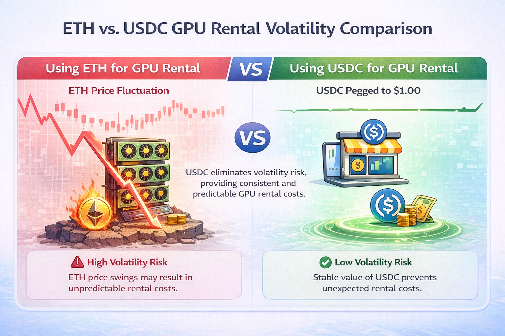
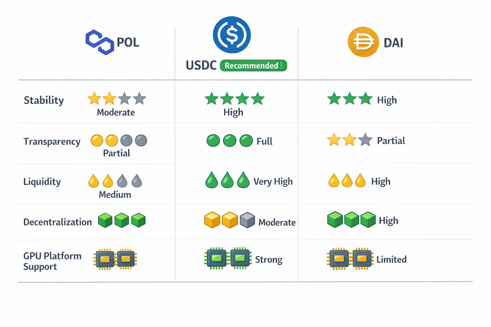
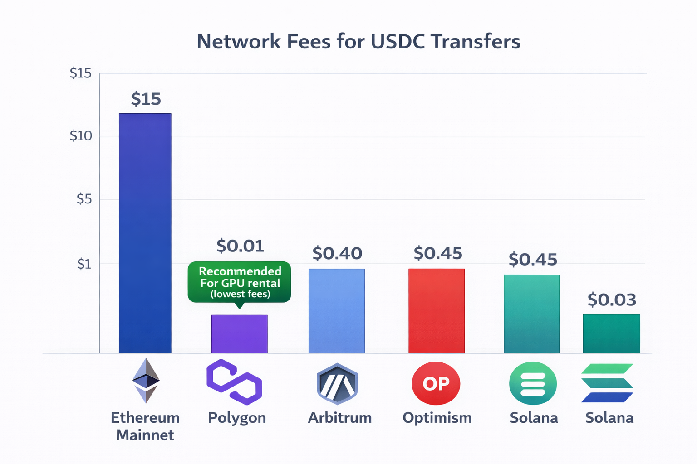
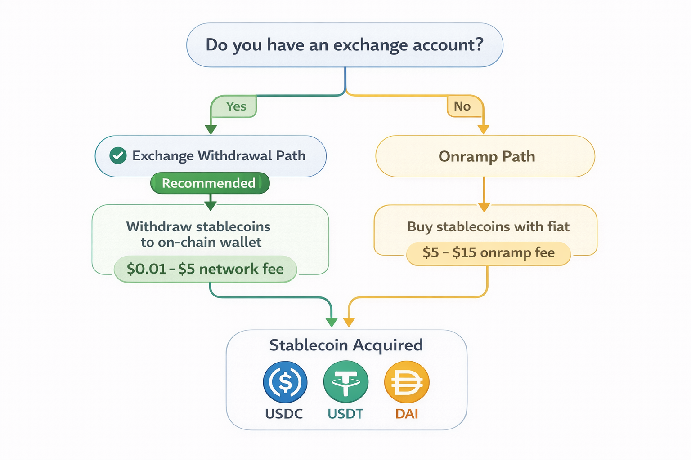
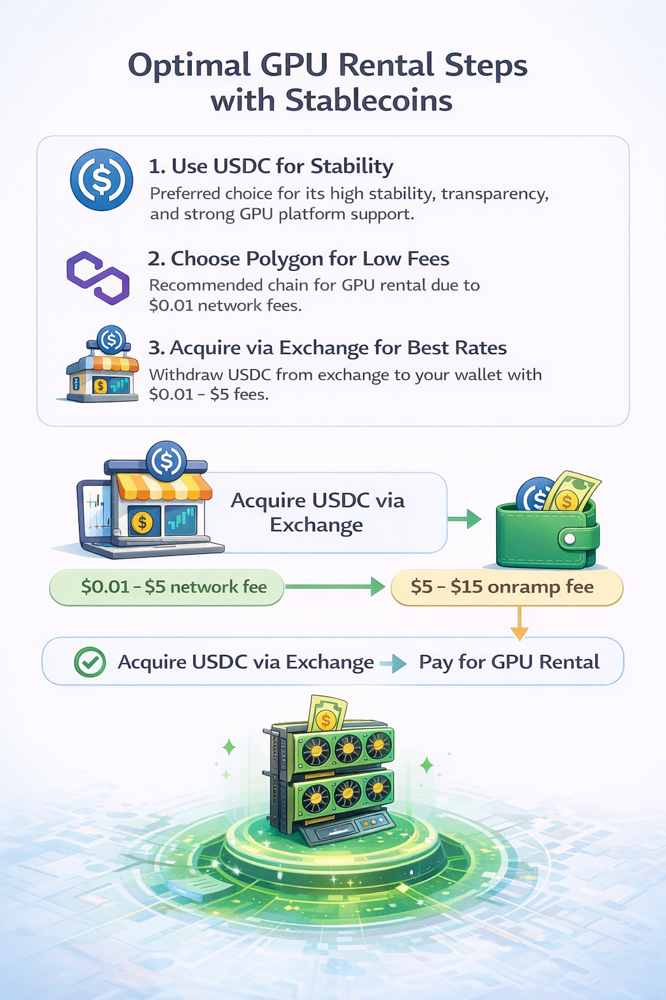

# Por que stablecoins são a forma mais inteligente de pagar pelo aluguel de GPU

> **Última atualização:** 21 de fevereiro de 2026 | **Tempo de leitura:** 10 minutos

Um desenvolvedor depositou US$ 200 em Ethereum para alugar GPUs para um treino de fim de semana. Na segunda‑feira, o ETH havia caído 12%. O treino custou US$ 85 em tempo de GPU. O saldo restante, que deveria ser de US$ 115, valia US$ 101. O mercado ficou com US$ 14 a mais em volatilidade sem nenhum motivo.

Stablecoins eliminam esse problema por completo. Elas mantêm o valor em dólar e, ao mesmo tempo, oferecem todos os benefícios dos pagamentos em criptomoedas: taxas baixas, liquidação rápida, acesso global e privacidade. Para aluguel de GPU—onde o que você precisa é de um orçamento previsível, não de exposição especulativa—stablecoins são a escolha óbvia.

Este guia explica o que são stablecoins, quais usar para aluguel de GPU e como obtê‑las com o mínimo de taxas possível. Para ver o processo completo de aluguel de GPU com criptomoedas, incluindo configuração de carteira e escolha de plataforma, consulte o nosso [Guia completo para alugar GPUs com criptomoedas](/pt_br/rent-gpu-with-crypto/).

---

## O problema da volatilidade: por que pagar com ETH pode sair mais caro

Os preços das criptomoedas se movem o tempo todo. Isso cria um custo oculto quando você usa ativos voláteis como ETH ou BTC para pagar por serviços.

### A matemática da perda por volatilidade

**Cenário: treino de ML no fim de semana**

Sexta‑feira:

- Depósito de 0,08 ETH (equivalente a US$ 200 com ETH a US$ 2.500)
- Plano: ~30 horas de RTX 4090 a US$ 0,60/hora = US$ 108 de custo de GPU
- Saldo esperado: ~US$ 92 em ETH

Segunda‑feira:

- Treino concluído, US$ 108 de tempo de GPU utilizados
- Preço do ETH caiu para US$ 2.200 (queda de 12%)
- Saldo de 0,0368 ETH agora vale: US$ 81
- **Perdido para a volatilidade: US$ 11**

Você pagou US$ 108 por tempo de GPU, mas perdeu US$ 119 no total (US$ 108 + US$ 11 de volatilidade). O mercado cobrou, na prática, 10% a mais.

### Volatilidade funciona nos dois sentidos (mas é imprevisível)

“Mas e se o ETH subir?”

Sim, a volatilidade pode jogar a seu favor. Se o ETH subir 12%:

- O saldo de 0,0368 ETH passaria a valer US$ 103
- Você teria um “ganho” de US$ 11

**O problema é que você não está tentando operar o mercado. Você está tentando treinar um modelo.**

Alugar GPU deve ser um custo previsível de negócio, não uma posição especulativa. Quando você precisa de capacidade de computação, não faz sentido, ao mesmo tempo, aceitar um palpite sobre a direção do preço de uma criptomoeda.

### Volatilidade histórica real

Movimentos de preço do ETH em janelas aleatórias de 48 horas em 2025:

| Período   | Preço inicial do ETH | Preço final do ETH | Variação |
| --------- | -------------------- | ------------------ | -------- |
| 5–7 jan   | $2,380               | $2,520             | +5.9%    |
| 12–14 fev | $2,710               | $2,490             | -8.1%    |
| 22–24 mar | $2,150               | $2,340             | +8.8%    |
| 8–10 abr  | $2,890               | $2,650             | -8.3%    |
| 15–17 mai | $2,420               | $2,380             | -1.7%    |

**Variação absoluta média em 48 horas: 6,6%**

Para um depósito de US$ 200 para aluguel de GPU, a exposição média à volatilidade é de aproximadamente US$ 13 para cima ou para baixo. Essa incerteza não traz nenhum benefício real para quem só quer alugar capacidade de computação.

### Stablecoins removem essa variável

Mesmo cenário usando USDC:

Sexta‑feira:

- Depósito de 200 USDC (equivalente a US$ 200)
- Plano: ~30 horas de RTX 4090 = US$ 108 de custo de GPU

Segunda‑feira:

- Treino concluído, US$ 108 de tempo de GPU utilizados
- Saldo restante: 92 USDC (equivalente a US$ 92)
- **Perdido para a volatilidade: US$ 0**

Você pagou exatamente US$ 108 por US$ 108 de tempo de GPU. Sem exposição de mercado, sem surpresas, sem especulação.

### Quando faz sentido usar cripto volátil

Usar ETH ou BTC para aluguel de GPU é razoável se:

- Você opera ativamente o mercado de cripto e quer manter exposição durante o período de aluguel
- Você é remunerado em ETH e prefere não converter
- Você tem compromisso filosófico com ativos não fiduciários
- Você entende e aceita o risco de volatilidade

Para a maioria dos desenvolvedores que simplesmente precisam de acesso a GPU com custos previsíveis, stablecoins são superiores.

---

## O que são stablecoins e como elas mantêm o pareamento com o dólar

Stablecoins são criptomoedas projetadas para manter um valor estável, normalmente atrelado 1:1 ao dólar americano. Entender como funcionam ajuda a criar confiança no uso.

### O mecanismo básico

**Criptomoedas tradicionais (ETH, BTC):**

- O preço é determinado apenas pela oferta e demanda de mercado
- Não há um ativo subjacente que dê lastro direto
- O valor flutua com base em especulação, adoção, sentimento de mercado

**Stablecoins (USDC, USDT):**

- O preço é projetado para ser US$ 1,00
- São lastreadas por ativos de reserva (caixa, títulos, etc.)
- Existem mecanismos para manter o peg quando há pressão de mercado

### Três tipos de stablecoins

**1. Lastreadas em moeda fiduciária (USDC, USDT)**

Como funciona:

- A emissora mantém US$ 1 em reserva para cada token emitido
- As reservas ficam em contas bancárias, títulos do tesouro, equivalentes de caixa
- Usuários podem resgatar tokens pelos dólares subjacentes (mediante verificação)
- O arbitragem mantém o preço em US$ 1: se o USDC negociar a US$ 0,99, traders compram e resgatam a US$ 1, capturando o lucro

**Exemplo de lastro (USDC):**

- Emitido pela Circle (empresa financeira regulada nos EUA)
- Reservas: caixa e títulos do tesouro americano de curto prazo
- Atestações mensais pela Grant Thornton (grande firma de auditoria)
- Mais de US$ 25 bilhões em circulação

**2. Lastreadas em cripto (DAI)**

Como funciona:

- Lastreada por depósitos em criptomoedas (ETH, WBTC etc.)
- Supercolateralizada: mais de US$ 150 em cripto para cada US$ 100 em DAI
- Smart contracts liquidam automaticamente se o valor do colateral cair
- Descentralizada: nenhuma empresa única controla a emissão

**Exemplo de lastro (DAI):**

- Emitida pela MakerDAO (protocolo descentralizado)
- Colateral: combinação de criptoativos e ativos do mundo real
- Razão de sobrecolateralização: mínimo de ~150%
- Cerca de US$ 5 bilhões em circulação

**3. Algorítmicas (histórico—em sua maioria fracassadas)**

Como funcionavam:

- Não possuíam colateral explícito
- Algoritmos ajustavam a oferta para manter o peg
- Mecanismos de emissão/queima baseados na variação de preço

**Por que não recomendamos:**

- TerraUSD (UST) entrou em colapso em maio de 2022, destruindo mais de US$ 40 bilhões em valor
- O algoritmo falhou sob estresse de mercado
- A maioria das stablecoins algorítmicas fracassou
- Para aluguel de GPU, fique apenas com opções colateralizadas

### Quão estáveis são as stablecoins?

**Estabilidade histórica do peg do USDC:**

| Evento                    | Preço do USDC | Duração       | Recuperação  |
| ------------------------- | ------------- | ------------- | ------------ |
| Operação normal           | $0.999–1.001  | >99% do tempo | N/A          |
| Crise do SVB (mar/2023)   | mínima $0.87  | ~48 horas     | Peg completo |
| Colapso da Terra (mai/22) | mínima $0.98  | ~24 horas     | Peg completo |

**Estabilidade histórica do peg do USDT:**

| Evento                    | Preço do USDT | Duração       | Recuperação  |
| ------------------------- | ------------- | ------------- | ------------ |
| Operação normal           | $0.998–1.002  | >99% do tempo | N/A          |
| Estresse em out/2018      | mínima $0.92  | ~1 semana     | Peg completo |
| Colapso da Terra (mai/22) | mínima $0.95  | ~24 horas     | Peg completo |

**Para fins de aluguel de GPU:**

Manter stablecoins por horas ou dias durante o aluguel significa que a exposição a eventos de despareamento é mínima. Mesmo o pior despeg do USDC (março de 2023) foi resolvido em 48 horas. Se você se preocupa com períodos de retenção de várias semanas, divida entre USDC e USDT para diversificar.

### Por que isso importa para aluguel de GPU

Stablecoins oferecem:

- **Previsibilidade de orçamento:** US$ 100 depositados = US$ 100 disponíveis para computação
- **Benefícios das criptomoedas:** taxas baixas, liquidação rápida, sem KYC em plataformas cripto‑nativas
- **Sem exposição de mercado:** o seu orçamento de GPU não fica atrelado à especulação com cripto
- **Contabilidade simples:** 1 USDC = US$ 1 simplifica o registro de despesas

A combinação é ideal: você obtém as vantagens de pagamento com criptomoedas sem a volatilidade de preço das criptomoedas.

## USDC vs USDT vs DAI: qual stablecoin usar para aluguel de GPU

Três stablecoins dominam o mercado. Cada uma tem características que importam em cenários de aluguel de GPU.

### USDC (USD Coin)

**Emissora:** Circle (empresa financeira regulada nos EUA)

**Capitalização de mercado:** ~US$ 30 bilhões

**Lastro:** Caixa e títulos do tesouro americano de curto prazo

**Transparência:** Atestações mensais de reservas pela Grant Thornton LLP

**Principais características:**

| Fator                           | Avaliação USDC | Observações                                       |
| ------------------------------- | -------------- | ------------------------------------------------- |
| Conformidade regulatória        | Muito alta     | Emissora regulada nos EUA, reservas transparentes |
| Transparência das reservas      | Muito alta     | Atestações mensais por terceiros independentes    |
| Confiabilidade de resgate       | Alta           | Resgates diretos a partir de ~US$ 100 mil         |
| Disponibilidade em corretoras   | Muito alta     | Presente em todas as grandes corretoras           |
| Aceitação em plataformas de GPU | Muito alta     | Aceita em GPUFlow, Vast.ai, RunPod                |
| Disponibilidade em redes        | Muito alta     | Ethereum, Polygon, Solana, Arbitrum, entre outras |

**Vantagens para aluguel de GPU:**

- Lastro com maior transparência—você sabe quais reservas existem.
- Emissora regulada, com risco de contraparte relativamente menor.
- Ampla aceitação em plataformas de GPU.
- Suporte nativo em Polygon (taxas baixas).

**Desvantagens:**

- A Circle pode congelar endereços (para cumprir exigências regulatórias).
- Exposição ao ambiente regulatório dos EUA (potenciais restrições futuras).
- Eventuais prêmios de preço pontuais em épocas de alta demanda.

**Melhor para:** Usuários que priorizam transparência e clareza regulatória. É a recomendação padrão para a maioria dos casos de aluguel de GPU.

---

### USDT (Tether)

**Emissora:** Tether Limited (empresa sediada offshore)

**Capitalização de mercado:** ~US$ 95 bilhões

**Lastro:** Caixa, equivalentes de caixa, commercial paper, empréstimos garantidos, outros investimentos

**Transparência:** Atestações trimestrais (menos detalhadas que as do USDC)

**Principais características:**

| Fator                           | Avaliação USDT | Observações                                                |
| ------------------------------- | -------------- | ---------------------------------------------------------- |
| Conformidade regulatória        | Média          | Emissora offshore, menos supervisão regulatória            |
| Transparência das reservas      | Média          | Atestações menos detalhadas, histórico de controvérsias    |
| Confiabilidade de resgate       | Média–Alta     | Resgates diretos a partir de ~US$ 100 mil, com verificação |
| Disponibilidade em corretoras   | Altíssima      | Stablecoin mais líquida globalmente                        |
| Aceitação em plataformas de GPU | Alta           | Amplamente aceita                                          |
| Disponibilidade em redes        | Altíssima      | Disponível em praticamente todas as principais blockchains |

**Vantagens para aluguel de GPU:**

- Maior liquidez global—mais fácil de obter, sobretudo em mercados emergentes.
- Em geral, boa disponibilidade mesmo em períodos de estresse de mercado.
- Suporte na maioria das redes.
- Em alguns mercados fora dos EUA, pode ter taxas de câmbio mais favoráveis que o USDC.

**Desvantagens:**

- Reservas menos transparentes, com questionamentos históricos.
- Estrutura regulatória baseada em jurisdições offshore.
- A Tether também pode congelar endereços.
- Ligeiramente mais risco de contraparte em comparação ao USDC.

**Melhor para:** Usuários em mercados onde o USDC tem pouca liquidez ou acesso restrito; ou para quem já mantém posições em USDT e não quer converter.

---

### DAI

**“Emissora”:** MakerDAO (protocolo descentralizado, sem empresa única controladora)

**Capitalização de mercado:** ~US$ 5 bilhões

**Lastro:** Criptoativos e ativos do mundo real, com sobrecolateralização

**Transparência:** Totalmente on‑chain—todo o colateral é público na blockchain

**Principais características:**

| Fator                           | Avaliação DAI | Observações                                                           |
| ------------------------------- | ------------- | --------------------------------------------------------------------- |
| Conformidade regulatória        | N/A           | Protocolo descentralizado, sem emissora única                         |
| Transparência das reservas      | Muito alta    | Colateral on‑chain, verificável por qualquer pessoa                   |
| Confiabilidade de resgate       | Alta          | Mint/burn via smart contracts                                         |
| Disponibilidade em corretoras   | Alta          | Listada em grandes corretoras, porém com liquidez menor que USDC/USDT |
| Aceitação em plataformas de GPU | Média         | Aceita em algumas plataformas, mas não em todas                       |
| Disponibilidade em redes        | Alta          | Ethereum, Polygon, entre outras                                       |

**Vantagens para aluguel de GPU:**

- Verdadeiramente descentralizada—nenhuma empresa pode congelar seus tokens.
- Colateral totalmente transparente (verificável na blockchain).
- Alta resistência à censura.
- Sem risco de contraparte ligado a um emissor corporativo.

**Desvantagens:**

- Menor liquidez que USDC/USDT.
- Mecanismo mais complexo, menos intuitivo.
- Não é suportada por todas as plataformas de GPU.
- Pequenas variações de preço (cerca de 1–2%) em situações de estresse podem ocorrer.

**Melhor para:** Usuários que priorizam descentralização e resistência à censura. Pessoas que têm objeções a emissores centralizados.

---

### Comparação direta

| Fator                             | USDC             | USDT        | DAI                    |
| --------------------------------- | ---------------- | ----------- | ---------------------- |
| **Estabilidade de preço**         | Excelente        | Excelente   | Muito boa              |
| **Transparência**                 | Excelente        | Boa         | Excelente (on‑chain)   |
| **Liquidez**                      | Muito alta       | Altíssima   | Alta                   |
| **Descentralização**              | Baixa            | Baixa       | Alta                   |
| **Suporte em plataformas de GPU** | Excelente        | Muito bom   | Bom                    |
| **Disponível em Polygon**         | Sim              | Sim         | Sim                    |
| **Risco de congelamento**         | Sim              | Sim         | Não                    |
| **Recomendação para GPU**         | Primeira escolha | Alternativa | Para casos específicos |

### Nossa recomendação

Use USDC para aluguel de GPU, a menos que você tenha um motivo específico para escolher outra stablecoin.

O USDC oferece o melhor equilíbrio entre:

- Estabilidade e confiabilidade do peg;
- Transparência nas reservas;
- Aceitação em plataformas de GPU;
- Disponibilidade em redes de baixa taxa (Polygon);
- Liquidez suficiente para qualquer volume razoável de aluguel.

Use USDT se:

- O USDC tiver pouca disponibilidade no seu país;
- A sua corretora oferecer condições melhores em USDT;
- Você já possuir USDT e não quiser fazer swap.

Use DAI se:

- Resistência à censura for essencial;
- Você tiver uma preferência forte por soluções descentralizadas;
- A plataforma que você escolheu aceitar DAI.

Para a maioria dos desenvolvedores que só querem alugar GPU com custos previsíveis, as diferenças práticas entre as três são pequenas. Todas mantêm o peg de forma confiável em condições normais de mercado. A transparência do USDC o torna a recomendação padrão.

---

## Escolhendo a rede certa: mesma stablecoin, taxas diferentes

USDC existe em várias redes de blockchain. O token é o mesmo—US$ 1 de valor, independentemente da rede—mas as taxas de transação variam bastante.

### Por que a escolha da rede importa

**Mesmo USDC, custos diferentes:**

| Rede             | Taxa de transferência | Tempo de confirmação | Observações                      |
| ---------------- | --------------------- | -------------------- | -------------------------------- |
| Ethereum mainnet | US$ 2–15              | 30–60 segundos       | Taxas altas, maior segurança     |
| Polygon          | US$ 0,001–0,05        | 2–5 segundos         | Taxas muito baixas, rápida       |
| Arbitrum         | US$ 0,10–0,50         | 1–3 segundos         | L2 do Ethereum, taxas baixas     |
| Optimism         | US$ 0,10–0,50         | 1–3 segundos         | L2 do Ethereum, taxas baixas     |
| Solana           | US$ 0,001–0,01        | < 1 segundo          | Taxas muito baixas, muito rápida |
| Base             | US$ 0,05–0,20         | 1–3 segundos         | L2 da Coinbase, taxas baixas     |

**Para um depósito de US$ 50 em aluguel de GPU:**

| Rede     | Taxa       | Taxa em % do depósito |
| -------- | ---------- | --------------------- |
| Ethereum | US$ 5–10   | 10–20%                |
| Polygon  | ~US$ 0,02  | ~0,04%                |
| Solana   | ~US$ 0,005 | ~0,01%                |

Escolher Ethereum em vez de Polygon para um depósito de US$ 50 custa entre 10% e 20% a mais em taxas desnecessárias. O USDC que chega na outra ponta é idêntico.

### Polygon: recomendada para aluguel de GPU

**Por que Polygon é ideal:**

- **Taxas mínimas na prática:** US$ 0,001–0,05 por transação.
- **Confirmação rápida:** 2–5 segundos.
- **Suporte amplo:** GPUFlow, grandes corretoras e muitos protocolos DeFi.
- **Compatibilidade com Ethereum:** Mesmo formato de endereço, mesmas ferramentas.
- **Boa liquidez de stablecoins:** Alto volume de USDC/USDT em Polygon.

A GPUFlow usa Polygon como rede principal justamente porque as taxas baixas tornam viáveis alugueis de GPU pequenos. Um aluguel de 2 horas custando US$ 1,20 faz sentido quando a taxa de transação é de US$ 0,02, não quando é de US$ 10.

### Disponibilidade por plataforma

| Plataforma de GPU | USDC em Polygon | USDC em Ethereum | USDC em Solana   |
| ----------------- | --------------- | ---------------- | ---------------- |
| GPUFlow           | Suporte nativo  | Suportado        | Suportado        |
| Vast.ai           | Via gateway     | Via gateway      | Via gateway      |
| RunPod            | Via Coinbase    | Via Coinbase     | Suporte limitado |

Observação: Vast.ai e RunPod usam gateways de pagamento (CoinPayments, Coinbase Commerce) que fazem a conversão de rede internamente. Você envia cripto para o endereço fornecido, e o gateway cuida do resto. A integração direta de carteira da GPUFlow permite que você escolha explicitamente a rede.

### Movendo USDC entre redes

Se você tem USDC na rede “errada”, é possível fazer bridging:

**Ethereum → Polygon:**

1. Acesse portal.polygon.technology/bridge
2. Conecte sua carteira
3. Selecione USDC, informe o valor
4. Aprove e inicie o bridge
5. Aguarde de 15 a 30 minutos
6. Veja o USDC chegando em Polygon

**Custo:** US$ 5–15 em gas da rede Ethereum

**Polygon → Ethereum:**

Fluxo semelhante, mas o custo é em gas de Polygon (cerca de US$ 0,02) e a espera é de ~30 minutos.

**Alternativas multi‑chain:**

- Hop Protocol: hop.exchange
- Across: across.to
- Stargate: stargate.finance

**Melhor abordagem:** evitar o bridge, sacando diretamente na rede correta pela corretora. A maioria das grandes corretoras suporta saque direto para Polygon, com custo entre US$ 0,10 e US$ 0,50, em vez de US$ 5–15 de um bridge a partir do Ethereum.

### Fluxo de decisão para escolha de rede

Ponto de partida: você precisa de USDC para aluguel de GPU.

USDC está em uma corretora?
├── Sim → A corretora suporta saque em Polygon?
│ ├── Sim → Sacar diretamente para Polygon (opção mais barata).
│ └── Não → Sacar para Ethereum e fazer bridge para Polygon,  
│ ou usar outra corretora que ofereça saque em Polygon.
└── Não → Você vai comprar USDC agora?
├── Sim, em uma corretora que suporta Polygon → Compre e saque para Polygon.
└── Não tenho corretora → Use um onramp (Transak, MoonPay) e selecione Polygon.

**Objetivo:** ter USDC em Polygon sem pagar gas da mainnet Ethereum.

### Verificando se o USDC está na rede correta

Depois de receber USDC, confirme se ele está na rede desejada:

1. Abra o MetaMask.
2. Verifique se a rede selecionada é “Polygon Mainnet”.
3. Veja se o saldo de USDC aparece.
4. Se estiver 0, troque a rede (Ethereum, etc.) e verifique novamente.

Erro comum: achar que enviou em Polygon quando, na verdade, usou Ethereum (ou o inverso). O endereço é o mesmo, mas os saldos são separados por rede.

Se o USDC aparecer na rede errada:

- Os fundos não estão perdidos.
- Você pode usar um bridge para movê‑los (pagando gas na rede de origem).
- Ou utilizar os fundos na própria rede, se a sua plataforma suportar.

Para instruções detalhadas de configuração de rede, consulte o guia [Configurando MetaMask e Polygon para aluguel de GPU](/pt_br/setting-up-metamask-polygon-gpu-rental/).

## Como adquirir stablecoins: corretoras, swaps e onramps

Você já entendeu por que stablecoins funcionam bem para aluguel de GPU. Agora, vamos colocá‑las na sua carteira com o mínimo de taxas possível.

### Método 1: compra em corretora e saque (recomendado)

**Melhor para:** valores acima de US$ 50, usuários que já têm conta em corretora

Corretoras centralizadas oferecem as melhores cotações para converter moeda fiduciária em stablecoins. A chave é escolher uma corretora que permita saque direto para a rede Polygon.

**Corretoras com saque de USDC em Polygon:**

| Corretora  | Suporte Polygon | Taxa de saque | Verificação necessária     |
| ---------- | --------------- | ------------- | -------------------------- |
| Coinbase   | Sim             | ~US$ 0,10     | Sim (para fiat)            |
| Binance    | Sim             | ~US$ 0,10     | Sim (para fiat)            |
| Kraken     | Sim             | ~US$ 0,10     | Sim (para fiat)            |
| Crypto.com | Sim             | ~US$ 0,10     | Sim (para fiat)            |
| KuCoin     | Sim             | ~US$ 0,10     | Limitada p/ baixos valores |
| OKX        | Sim             | ~US$ 0,10     | Sim (para fiat)            |

**Passo a passo (exemplo com Coinbase):**

1. Faça login na Coinbase (crie uma conta, se necessário).
2. Deposite fiat via transferência bancária ou cartão.
3. Navegue até USDC ou compre USDC com o fiat depositado.
4. Clique em "Enviar" (Send).
5. Insira o endereço da sua carteira MetaMask.
6. **Selecione "Polygon" como rede (etapa crítica).**
7. Informe o valor.
8. Confirme e envie.
9. O USDC chega em 1–10 minutos.

**Taxas totais:**

- Spread de compra na Coinbase: ~0,5%
- Saque para Polygon: ~US$ 0,10
- **Para US$ 100 de USDC: aproximadamente US$ 0,60 de custo total**

**Comparação com onramps:** 1–4% de taxa = US$ 1–4 para os mesmos US$ 100.

---

### Método 2: swap de criptomoedas existentes

**Melhor para:** quem já possui ETH, BTC ou outra cripto

Se você já tem criptomoedas e quer stablecoins, faça um swap direto em vez de converter para fiat primeiro.

**Usando o swap nativo do MetaMask:**

1. Abra o MetaMask na rede Polygon.
2. Clique em "Swap".
3. Selecione seu token (ETH, MATIC etc.) em "From".
4. Selecione USDC em "To".
5. Informe o valor.
6. Confira a cotação e as taxas.
7. Clique em "Swap".
8. Aprove a transação.

**Taxas:** 0,875% (MetaMask) + ~US$ 0,02 de gas

**Usando DEXes (taxas menores):**

| DEX       | Rede    | Taxa     | Observações                       |
| --------- | ------- | -------- | --------------------------------- |
| Uniswap   | Polygon | 0,3%     | Alta liquidez                     |
| QuickSwap | Polygon | 0,3%     | Nativa de Polygon                 |
| SushiSwap | Polygon | 0,3%     | Multi‑chain                       |
| 1inch     | Polygon | Variável | Agregador, busca a melhor cotação |

**Usando 1inch (recomendado para melhores taxas):**

1. Acesse app.1inch.io
2. Conecte o MetaMask.
3. Selecione a rede Polygon.
4. Escolha o token de origem e USDC como destino.
5. Informe o valor.
6. O 1inch encontra a melhor taxa entre as DEXes.
7. Clique em "Swap".
8. Aprove a transação.

**Taxas:** ~0,1–0,3% de swap + ~US$ 0,02 de gas

**Observação:** fazer swap exige gas no token nativo da rede. Em Polygon, você precisa de um pequeno saldo de MATIC. Se estiver na Ethereum mainnet, precisará de ETH para gas (caro).

---

### Método 3: onramp direto para a carteira

**Melhor para:** novos usuários sem conta em corretora, valores pequenos, prioridade em conveniência

Serviços de onramp permitem comprar cripto diretamente com cartão ou transferência bancária, entregando direto na sua carteira.

**Principais serviços de onramp:**

| Serviço | Taxa | Métodos de pagamento             | Suporte Polygon |
| ------- | ---- | -------------------------------- | --------------- |
| Transak | 1–3% | Cartão, transferência            | Sim             |
| MoonPay | 2–4% | Cartão, transferência, Apple Pay | Sim             |
| Ramp    | 1–3% | Cartão, transferência            | Sim             |
| Banxa   | 2–4% | Cartão, transferência            | Sim             |
| Simplex | 3–5% | Cartão                           | Sim             |

**Passo a passo (exemplo com Transak):**

1. Acesse transak.com
2. Selecione "Comprar" (Buy).
3. Escolha USDC como criptomoeda.
4. **Selecione Polygon como rede.**
5. Informe o valor na sua moeda local.
6. Clique em "Buy Now".
7. Cole o endereço da sua carteira MetaMask (ou conecte a carteira).
8. Conclua o pagamento com cartão ou transferência.
9. O USDC chega diretamente na sua carteira (5–30 minutos).

**Taxas:** 1–4%, dependendo do método de pagamento e do valor.

**Quando onramps fazem sentido:**

- Compras abaixo de US$ 50 (depósitos mínimos em corretoras podem ser maiores).
- Sem conta em corretora e sem desejo de abrir uma.
- Conveniência vale mais que 1–2% de diferença nas taxas.
- Você quer evitar KYC no lado cripto.

---

### Método 4: receber pagamentos em stablecoins

**Melhor para:** freelancers, contratados, qualquer pessoa paga em cripto

Se clientes ou empregadores oferecem pagamento em criptomoedas:

- Peça para receber em USDC na rede Polygon.
- Forneça o endereço da sua carteira.
- Receba diretamente, sem taxas de corretora ou conversão.
- Use para alugar GPU ou converta para fiat conforme necessário.

**Cada vez mais comum:** muitas empresas cripto‑nativas pagam prestadores em stablecoins. Isso elimina os custos de aquisição por completo.

---

### Comparativo de custos

**Obtendo US$ 100 de USDC em Polygon:**

| Método                          | Taxas     | Custo total | Tempo     |
| ------------------------------- | --------- | ----------- | --------- |
| Corretora + saque Polygon       | ~US$ 0,60 | US$ 100,60  | 10–30 min |
| Swap em DEX (de ETH em Polygon) | ~US$ 0,35 | US$ 100,35  | 2 min     |
| Onramp (Transak)                | ~US$ 2,50 | US$ 102,50  | 10–30 min |
| Onramp (MoonPay)                | ~US$ 3,50 | US$ 103,50  | 10–30 min |
| Recebido como pagamento         | US$ 0     | US$ 100,00  | N/A       |

**Recomendação por situação:**

| Situação                               | Melhor método                   |
| -------------------------------------- | ------------------------------- |
| Tem conta em corretora, valor > US$ 50 | Saque de corretora para Polygon |
| Já possui ETH/cripto em Polygon        | Swap em DEX (1inch)             |
| Sem conta, quer simplicidade           | Onramp (Transak)                |
| Recebe pagamento de cliente            | Solicitar USDC em Polygon       |

---

### Evitando erros comuns

**Erro 1: sacar na rede errada**

Selecionar Ethereum em vez de Polygon significa:

- Taxa de saque mais alta (US$ 5–15 vs US$ 0,10).
- Taxas maiores nas transações seguintes.
- Necessidade de bridge para Polygon (mais US$ 5–15).

**Prevenção:** confira três vezes a seleção da rede antes de confirmar o saque.

---

**Erro 2: usar onramp para valores grandes**

US$ 500 via onramp a 3% = US$ 15 de taxas  
US$ 500 via corretora a ~0,6% = US$ 3 de taxas

**Prevenção:** para valores acima de US$ 50–100, use corretoras.

---

**Erro 3: fazer swap na mainnet Ethereum**

Trocar US$ 50 de ETH por USDC na Ethereum:

- Gas do swap: US$ 5–15
- Resultado: perda significativa em taxas

**Prevenção:** faça bridge do ETH para Polygon primeiro (US$ 5–15 uma única vez), depois troque em Polygon (US$ 0,02 por swap).

---

**Erro 4: comprar USDC, mas esquecer de ter MATIC**

Você compra US$ 100 de USDC, mas não tem MATIC para gas. Não consegue fazer nenhuma transação.

**Prevenção:** sempre adquira uma pequena quantidade de MATIC (US$ 1–2) junto com USDC. Alguns onramps permitem comprar ambos em uma única transação.

---

## Conclusão: estabilidade para o seu orçamento de GPU

Stablecoins resolvem o problema da volatilidade que torna os pagamentos em criptomoedas imprevisíveis. Seu orçamento de US$ 100 para GPU permanece valendo US$ 100, independentemente dos movimentos do mercado.

### Pontos‑chave

**Volatilidade é um custo oculto.** Usar ETH ou BTC para aluguel de GPU expõe você a oscilações médias de 6–7% em períodos típicos de locação. Essa volatilidade trabalha contra você com a mesma frequência que trabalha a favor, adicionando risco desnecessário a uma despesa de negócio que deveria ser previsível.

**USDC é a escolha ideal.** Entre as stablecoins, o USDC oferece a melhor combinação de estabilidade, transparência e aceitação em plataformas de GPU. USDT serve como alternativa onde a liquidez de USDC for limitada. DAI atende usuários que priorizam descentralização.

**A escolha da rede importa.** USDC em Polygon custa US$ 0,001–0,05 por transação. USDC em Ethereum custa US$ 2–15 por transação. Mesmo token, mesmo valor, taxas drasticamente diferentes. Use sempre Polygon para aluguel de GPU, a menos que a plataforma exija outra rede especificamente.

**O método de aquisição afeta o custo total.** Saque de corretora para Polygon custa ~0,6%. Onramps custam 1–4%. Para valores acima de US$ 50, corretoras são significativamente mais baratas. Para conveniência ou valores pequenos, onramps funcionam bem.

---

### Caminho rápido de início

**Se você já tem conta em Coinbase/Binance:**

1. Compre USDC na corretora.
2. Saque para MetaMask selecionando a rede Polygon.
3. Conecte‑se à GPUFlow.
4. Deposite e alugue.
5. **Taxas totais: ~US$ 0,50–1,00**

**Se estiver começando do zero:**

1. Instale o MetaMask ([guia de configuração](/pt_br/setting-up-metamask-polygon-gpu-rental/)).
2. Acesse transak.com.
3. Compre USDC na rede Polygon.
4. Conecte‑se à GPUFlow.
5. Deposite e alugue.
6. **Taxas totais: ~2–3%**

---

### A visão geral

Stablecoins representam o melhor dos dois mundos:

**Das criptomoedas:**

- Taxas de transação baixas (vs 2,5–3,5% do cartão de crédito)
- Liquidação rápida (minutos vs dias)
- Acessibilidade global (sem restrições bancárias)
- Opções de privacidade (sem KYC em plataformas cripto‑nativas)

**Das finanças tradicionais:**

- Valor estável e previsível
- Contabilidade em dólar
- Sem exposição especulativa
- Unidade de conta familiar

Para aluguel de GPU especificamente, essa combinação é ideal. Você obtém as vantagens de pagamento das criptomoedas sem aceitar a volatilidade de preço das criptomoedas. Seu orçamento de computação permanece exatamente onde você o definiu.

---

### Recursos relacionados

**Deste site:**

- [Guia completo para alugar GPUs com criptomoedas](/pt_br/rent-gpu-with-crypto/) — passo a passo completo, incluindo escrow e escolha de plataforma
- [Configurando MetaMask e Polygon para aluguel de GPU](/pt_br/setting-up-metamask-polygon-gpu-rental/) — instalação de carteira e configuração de rede
- [Taxas ocultas no aluguel de GPU: como cripto economiza dinheiro para usuários internacionais](/pt_br/hidden-fees-in-gpu-rental/) — análise de custos para usuários fora dos EUA
- [Como alugar GPUs sem KYC ou verificação de identidade](/pt_br/how-to-rent-gpu-without-kyc/) — opções de aluguel focadas em privacidade

**Recursos externos:**

- [Circle USDC Transparency](https://www.circle.com/en/usdc) — atestações de reservas e documentação
- [Polygon Bridge](https://portal.polygon.technology/bridge) — bridge oficial Ethereum–Polygon
- [1inch](https://app.1inch.io) — agregador de DEX para as melhores cotações de swap

---

## Perguntas frequentes

### O que é uma stablecoin e por que usá‑la para aluguel de GPU?

Uma stablecoin é uma criptomoeda projetada para manter um valor estável, normalmente atrelado 1:1 ao dólar americano. USDC e USDT são os exemplos mais usados—1 USDC sempre equivale a aproximadamente US$ 1,00. Para aluguel de GPU, as stablecoins eliminam a volatilidade de preço das criptomoedas. Se você deposita US$ 100 em ETH e o ETH cai 10% durante o período de locação, seu saldo restante perde US$ 10 de poder de compra sem nenhuma ação sua. Com USDC, os US$ 100 depositados continuam representando US$ 100 disponíveis para aluguel de GPU, independentemente do que aconteça nos mercados de criptomoedas. Você obtém os benefícios dos pagamentos em cripto (taxas baixas, liquidação rápida, sem KYC) sem a desvantagem do valor imprevisível.

### Qual é a melhor stablecoin para aluguel de GPU?

USDC é recomendada para a maioria dos usuários de aluguel de GPU. Oferece a melhor combinação de estabilidade (manteve o peg em vários eventos de estresse de mercado), transparência (atestações mensais de reservas por grandes firmas de auditoria) e aceitação em plataformas (suportada por GPUFlow, Vast.ai, RunPod e outras). USDT tem maior liquidez global e pode ser preferível em mercados onde a disponibilidade de USDC é limitada. DAI oferece descentralização verdadeira (nenhuma empresa pode congelar seus tokens), mas tem menor liquidez e não é aceita em todas as plataformas. Para aluguel de GPU direto sem requisitos específicos de descentralização, USDC na rede Polygon é a escolha ideal.

### Stablecoins são realmente estáveis?

As principais stablecoins mantêm seu pareamento com o dólar de forma confiável em condições normais de mercado. O USDC foi negociado entre US$ 0,999 e US$ 1,001 por mais de 99% de sua existência. O maior despeg ocorreu em março de 2023, quando o Silicon Valley Bank (que detinha parte das reservas de USDC) quebrou—o USDC chegou a ser negociado brevemente a US$ 0,87, mas voltou ao peg em 48 horas após o governo americano garantir os depositantes. O USDT sofreu seu maior despeg em outubro de 2018, sendo negociado brevemente a US$ 0,92 antes de se recuperar. Para aluguel de GPU, em que os fundos normalmente ficam retidos por horas ou dias, esses despegs raros e breves representam risco prático mínimo. Se você pretende manter stablecoins por períodos mais longos, considere dividir entre USDC e USDT para diversificação.

### Como obtenho stablecoins para aluguel de GPU?

Existem três métodos principais. Primeiro, compra em corretora de criptomoedas (Coinbase, Binance, Kraken) usando transferência bancária ou cartão de crédito, depois saque para sua carteira na rede Polygon—é o mais barato para valores acima de US$ 50, com taxas totais em torno de 0,5–1%. Segundo, use um serviço de onramp como Transak ou MoonPay para comprar diretamente na sua carteira com cartão—mais conveniente, mas custa 1–4% de taxa. Terceiro, troque criptomoedas existentes (ETH, BTC, outros tokens) por stablecoins usando o swap embutido do MetaMask ou DEXes como 1inch—custa cerca de 0,3% mais gas mínimo. Para a maioria dos usuários, comprar em corretora com saque direto para Polygon oferece o melhor equilíbrio entre custo e conveniência.

### Stablecoins funcionam em todas as plataformas de aluguel de GPU?

USDC é aceita em todas as principais plataformas de GPU que aceitam criptomoedas: GPUFlow (suporte nativo), Vast.ai (via gateway CoinPayments) e RunPod (via Coinbase Commerce). USDT também é amplamente aceita. Nem todas as plataformas suportam todas as redes—verifique se a plataforma escolhida aceita stablecoins na rede de sua preferência antes de enviar. A GPUFlow suporta nativamente USDC em Polygon (taxas mais baixas), Ethereum e Solana. Vast.ai e RunPod usam gateways de pagamento que lidam com a conversão de rede internamente, então você envia para um endereço fornecido e o gateway gerencia o resto. Em caso de dúvida, consulte a documentação ou o suporte da plataforma para informações atualizadas sobre redes suportadas.

### Por que a escolha da rede importa para stablecoins?

O mesmo token USDC existe em múltiplas redes de blockchain, mas as taxas de transação variam drasticamente. Enviar USDC na mainnet Ethereum custa US$ 2–15 por transação, dependendo do congestionamento da rede. Enviar USDC em Polygon custa US$ 0,001–0,05—aproximadamente 100 vezes mais barato. Para aluguel de GPU envolvendo múltiplas transações (depósito, aluguel, saque), a escolha da rede afeta significativamente os custos totais. Um aluguel de GPU de curta duração custando US$ 10 faz sentido quando as taxas totais de transação são US$ 0,06 (Polygon), mas não faz sentido quando as taxas são US$ 20 (Ethereum). Polygon é recomendada para aluguel de GPU porque suas taxas baixas tornam transações pequenas e médias economicamente viáveis, mantendo a segurança por meio da infraestrutura do Ethereum.

### E se eu já tenho cripto, mas não são stablecoins?

Faça swap das suas criptomoedas existentes por stablecoins usando uma DEX ou o recurso de swap nativo do MetaMask. A abordagem mais barata: faça bridge da sua cripto para Polygon primeiro (se estiver na Ethereum), depois troque por USDC em Polygon, onde as taxas são mínimas. Usando 1inch em Polygon, você pode trocar ETH, MATIC ou outros tokens por USDC por aproximadamente 0,3% de taxa mais ~US$ 0,02 de gas. Fazer swap na mainnet Ethereum é caro (US$ 5–15 de gas por swap), então evite isso se possível. Se sua cripto está em uma corretora em vez de na sua carteira, muitas vezes você pode vender por fiat e comprar USDC diretamente, depois sacar para Polygon—às vezes mais simples do que fazer swap on‑chain.

### Stablecoins podem perder o peg permanentemente?

Stablecoins lastreadas em moeda fiduciária (USDC, USDT) podem teoricamente falhar se a empresa emissora se tornar insolvente ou se as reservas forem mal administradas. Isso não aconteceu com as principais stablecoins, mas o risco existe. Stablecoins algorítmicas falharam catastroficamente—TerraUSD (UST) entrou em colapso em maio de 2022, perdendo completamente o peg e destruindo mais de US$ 40 bilhões em valor. Por isso recomendamos apenas stablecoins lastreadas em moeda fiduciária (USDC, USDT) ou stablecoins supercolateralizadas em cripto (DAI) para aluguel de GPU. As principais stablecoins sobreviveram a múltiplos crashes de mercado, falências de bancos e desafios regulatórios, mantendo seus pegs. Para valores de aluguel de GPU mantidos por curto prazo, o risco de despeg permanente é extremamente baixo.

### Como stablecoins se comparam a simplesmente usar cartões de crédito?

Ambos fornecem pagamentos estáveis denominados em dólar, mas com tradeoffs diferentes. Cartões de crédito cobram dos comerciantes 2,5–3,5% de taxa (frequentemente embutida nos preços), processam internacionalmente com taxas adicionais de câmbio (1–4%), exigem verificação de identidade e podem levar dias para liquidação. Stablecoins em Polygon custam US$ 0,001–0,05 por transação, independentemente do valor ou localização, liquidam em segundos e permitem acesso sem KYC em plataformas cripto‑nativas. Para usuários internacionais especialmente, stablecoins tipicamente economizam 5–15% em comparação com pagamentos por cartão de crédito. O tradeoff é aprender o básico de criptomoedas e gerenciar a segurança da sua própria carteira. Para usuários confortáveis com essa responsabilidade, stablecoins geralmente são superiores para pagamentos de aluguel de GPU.

### Preciso declarar transações com stablecoins para fins fiscais?

O tratamento fiscal varia por jurisdição, mas de forma geral: comprar stablecoins com fiat não cria um evento tributável (você está trocando US$ 100 por 100 USDC). Usar stablecoins para pagar serviços como aluguel de GPU pode tecnicamente ser uma alienação, mas com ganho zero (1 USDC = US$ 1, sem valorização). Trocar entre diferentes stablecoins ou de cripto volátil para stablecoins pode disparar eventos de ganho de capital se o ativo original valorizou. Para fluxos simples de "comprar USDC, gastar em aluguel de GPU", as implicações fiscais são mínimas porque não ocorrem ganhos. No entanto, mantenha registros de transações para documentação de despesas e consulte um profissional de impostos para os requisitos específicos da sua jurisdição.

### O que acontece se uma stablecoin que eu estou segurando perder o peg?

Se uma stablecoin for negociada temporariamente abaixo de US$ 1 (como o USDC fez brevemente em março de 2023), você tem opções. Segurar e esperar—as principais stablecoins historicamente recuperaram seus pegs em horas ou dias. Usar as stablecoins de qualquer forma—plataformas de aluguel de GPU podem ainda aceitá‑las pelo valor de face durante breves despegs, ou você aceita a pequena perda. Trocar por outra stablecoin—se USDC está a US$ 0,95, você pode trocar por USDT (assumindo que USDT está a US$ 1,00) para travar apenas uma perda de 5% em vez de segurar. Para aluguel de GPU especificamente, breves despegs durante o aluguel ativo raramente importam, já que você está gastando os tokens, não os segurando por longo prazo. O impacto prático de eventos históricos de despeg em usuários de aluguel de GPU foi insignificante.

---

**Pronto para eliminar a volatilidade do seu orçamento de GPU?** Obtenha POL em Polygon, conecte‑se à [GPUFlow](https://gpuflow.app/) e alugue GPUs com custos estáveis e previsíveis. Sem especulação de preço, sem surpresas—apenas recursos de computação quando você precisar deles.
