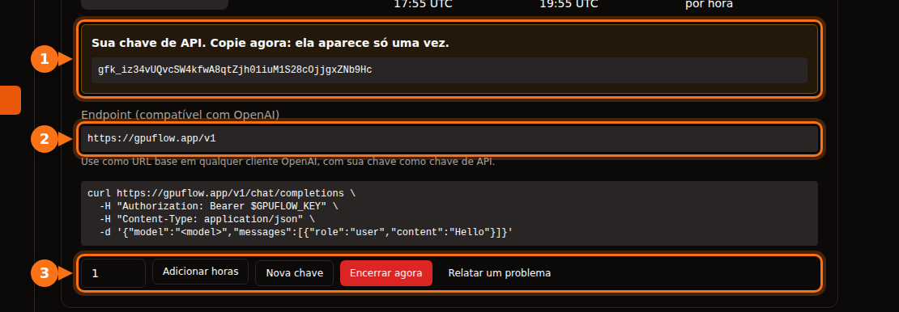

Muitas ferramentas de IA deixam você trocar a OpenAI por outro provedor, desde que ele fale a mesma API. Você sempre precisa das mesmas três coisas:

| O quê | Exemplo |
| --- | --- |
| **Base URL** (também chamada de API base, endpoint ou host) | `https://gpuflow.app/v1` |
| **Chave de API** | `gfk_...` |
| **Nome do modelo** | `qwen2.5:7b` |

Usamos um aluguel do GPUFlow como exemplo do começo ao fim, mas os passos são os mesmos para qualquer servidor compatível com a OpenAI: um Ollama ou llama.cpp local, vLLM, OpenRouter e muitos outros. Basta trocar os três valores.

No GPUFlow, você encontra os três em **Painel → Aluguéis Atuais** depois de alugar uma GPU:



## Antes de começar: confira o endpoint e o nome do modelo

Um comando mostra se a chave funciona e qual é o nome do modelo:

```bash
curl https://gpuflow.app/v1/models \
  -H "Authorization: Bearer gfk_your_key"
```

A resposta lista os modelos. Copie o `id`, por exemplo `qwen2.5:7b`, exatamente como está escrito. Um nome de modelo errado é o motivo mais comum para um app se recusar a funcionar.

**Saiba o que o seu endpoint suporta.** O endpoint do GPUFlow oferece `/v1/models` e `/v1/chat/completions`, com streaming. Ele não oferece embeddings, a Responses API, que é mais recente, nem geração de imagens. Alguns recursos dos apps precisam disso, e nós indicamos quais abaixo.

## Apps de chat

### Open WebUI

1. Abra **Settings → Admin → Connections**.
2. Em **Manage OpenAI API Connections**, clique em **+ (Add Connection)**.
3. Preencha:
   - **URL:** `https://gpuflow.app/v1`
   - **API Key:** a sua chave
4. Clique em **Verify Connection** para testar (só salvar não testa) e depois em **Save**.

O Open WebUI lê a lista de modelos de `/models` sozinho. Se você roda com Docker, pode definir `OPENAI_API_BASE_URL` e `OPENAI_API_KEY` no lugar disso, mas essas variáveis só são lidas na primeira vez que o Open WebUI inicia. Depois disso, altere as configurações na tela de administração.

O upload e a busca de documentos no Open WebUI usam um modelo de embeddings pequeno que roda localmente por padrão, então continuam funcionando. Não troque o motor de embeddings para OpenAI usando o seu endpoint de chat como URL.

### LibreChat

Adicione um endpoint personalizado ao `librechat.yaml`:

```yaml
endpoints:
  custom:
    - name: "GPUFlow"
      apiKey: "${GPUFLOW_API_KEY}"
      baseURL: "https://gpuflow.app/v1"
      models:
        default: ["qwen2.5:7b"]
        fetch: true
      titleConvo: true
      titleModel: "qwen2.5:7b"
      modelDisplayLabel: "GPUFlow"
```

Coloque a sua chave no `.env` como `GPUFLOW_API_KEY=gfk_...`. Use `apiKey: "user_provided"` se cada usuário tiver que informar a própria chave. Com `fetch: true`, o LibreChat lê a lista de modelos do endpoint.

A busca em documentos do LibreChat (a RAG API) usa embeddings da OpenAI por padrão. Mantenha-a na OpenAI, no Ollama ou no Hugging Face; não aponte `RAG_OPENAI_BASEURL` para um endpoint que só oferece chat.

### AnythingLLM

1. Abra as configurações de LLM e escolha **Generic OpenAI**.
2. Preencha **Base URL** (`https://gpuflow.app/v1`), **API Key**, **Chat Model Name** (`qwen2.5:7b`), **Token context window** e **Max Tokens**.

Com Docker, as mesmas configurações viram variáveis de ambiente:

```bash
LLM_PROVIDER='generic-openai'
GENERIC_OPEN_AI_BASE_PATH='https://gpuflow.app/v1'
GENERIC_OPEN_AI_MODEL_PREF='qwen2.5:7b'
GENERIC_OPEN_AI_MODEL_TOKEN_LIMIT=32768
GENERIC_OPEN_AI_API_KEY=gfk_your_key
```

Deixe o embedder em **AnythingLLM Default**.

### Jan

1. Abra **Settings → Model Providers** e clique em **Add Provider**.
2. Escolha **OpenAI-compatible**.
3. Informe um nome, a **Base URL** com `/v1` no final e a sua **API key**. Clique em **Create**.

O Jan carrega a lista de modelos quando você salva. Se isso não acontecer, adicione o nome do modelo manualmente com o botão **+** na lista de modelos do provedor.

## Assistentes de programação

### Continue (VS Code e JetBrains)

Adicione um modelo ao seu `config.yaml`:

```yaml
models:
  - name: GPUFlow Qwen 2.5 7B
    provider: openai
    model: qwen2.5:7b
    apiBase: https://gpuflow.app/v1
    apiKey: ${{ secrets.GPUFLOW_API_KEY }}
    roles:
      - chat
      - edit
      - apply
```

Deixe de fora os papéis `autocomplete` e `embed`: esse endpoint só oferece chat, e os embeddings precisam de `/v1/embeddings`. No VS Code, o Continue tem um embedder nativo para a busca no código. No JetBrains não tem, então configure lá um modelo de embeddings separado.

O modo Agent do Continue precisa de um modelo que lide com chamadas de ferramentas. Só adicione `capabilities: [tool_use]` se tiver certeza de que o seu modelo faz isso.

### Cline

1. Abra as configurações do Cline.
2. Em **API Provider**, escolha **OpenAI Compatible**.
3. Preencha **Base URL**, **API Key** e **Model** (`qwen2.5:7b`).
4. Em **Model Configuration**, ajuste a janela de contexto de acordo com o seu modelo.

Uma observação sobre o **Roo Code**: a documentação dele diz que só funciona com modelos que suportam chamada de ferramentas nativa, sem alternativa. Um endpoint de chat simples pode não funcionar com ele.

## Código

### Bibliotecas Python e Node da OpenAI

Python (`pip install openai`):

```python
from openai import OpenAI

client = OpenAI(base_url="https://gpuflow.app/v1", api_key="gfk_your_key")

reply = client.chat.completions.create(
    model="qwen2.5:7b",
    messages=[{"role": "user", "content": "Say hello in five languages."}],
)
print(reply.choices[0].message.content)
```

Node (`npm install openai`):

```js
import OpenAI from "openai";

const client = new OpenAI({ baseURL: "https://gpuflow.app/v1", apiKey: "gfk_your_key" });

const reply = await client.chat.completions.create({
  model: "qwen2.5:7b",
  messages: [{ role: "user", content: "Say hello in five languages." }],
});
console.log(reply.choices[0].message.content);
```

As duas bibliotecas também leem `OPENAI_BASE_URL` e `OPENAI_API_KEY` das variáveis de ambiente. Repare que os READMEs delas agora começam com `client.responses.create(...)`. Essa é a Responses API; use `client.chat.completions.create(...)`, como acima.

### LangChain

Python (`pip install -U langchain-openai`):

```python
from langchain_openai import ChatOpenAI

llm = ChatOpenAI(
    model="qwen2.5:7b",
    base_url="https://gpuflow.app/v1",
    api_key="gfk_your_key",
    use_responses_api=False,
)
print(llm.invoke("Name three uses for a GPU.").content)
```

JavaScript (`npm install @langchain/openai @langchain/core`). Primeiro defina a sua chave no ambiente, `export OPENAI_API_KEY=gfk_your_key`, e depois:

```js
import { ChatOpenAI } from "@langchain/openai";

const llm = new ChatOpenAI({
  model: "qwen2.5:7b",
  configuration: { baseURL: "https://gpuflow.app/v1" },
});
```

O LangChain passa para a Responses API quando você ativa certos recursos, como ferramentas nativas ou saída de raciocínio. `use_responses_api=False` faz ele continuar em Chat Completions.

### LlamaIndex

Use o `OpenAILike` (`pip install llama-index-llms-openai-like`):

```python
from llama_index.llms.openai_like import OpenAILike

llm = OpenAILike(
    model="qwen2.5:7b",
    api_base="https://gpuflow.app/v1",
    api_key="gfk_your_key",
    context_window=32768,
    is_chat_model=True,
    is_function_calling_model=False,
)
```

**Defina `is_chat_model=True`.** O padrão é `False`, que envia as requisições para `/v1/completions` em vez de `/v1/chat/completions`. Para indexar documentos, defina `Settings.embed_model` com um modelo de embeddings de verdade; o LlamaIndex usa embeddings da OpenAI por padrão.

## Ferramentas que não funcionam com um endpoint só de chat

- **Codex CLI.** Ele deixou de suportar Chat Completions no início de 2026 e agora só aceita a Responses API.
- **OpenAI Agents SDK.** Ele usa a Responses API por padrão. Chame `set_default_openai_api("chat_completions")` ou envolva o seu client em `OpenAIChatCompletionsModel`, e desative o tracing com `set_tracing_disabled(True)`, já que o tracing precisa de uma chave da OpenAI.
- **Qualquer coisa que precise de embeddings** do mesmo endpoint: busca em documentos, "converse com seus arquivos", busca semântica no código. Use o embedder nativo do app ou um provedor de embeddings separado.

## Se ainda não funcionar

| O que aparece | Causa comum |
| --- | --- |
| `404` ou "not found" | Falta `/v1` na base URL, ou o app já acrescenta `/v1` sozinho e você acabou colocando duas vezes. |
| `401` ou `invalid_api_key` | Chave errada, ou o aluguel já terminou. No GPUFlow, clique em **Nova chave** em Aluguéis Atuais se você perdeu a chave. |
| "Model not found" | O nome do modelo não é exatamente igual ao de `/v1/models`. |
| Requisições para `/v1/completions` ou `/v1/responses` falham | O app está usando outra API. Procure uma configuração de "chat model" ou "chat completions". |

## Artigos relacionados

- [GPU por hora ou API por token? Quanto custa de verdade rodar um modelo de 7B–8B](/pt_br/hourly-gpu-vs-per-token-api/)
- [GPUFlow vs Vast.ai vs RunPod vs SaladCloud: qual combina com o seu trabalho](/pt_br/gpuflow-vs-vast-ai-vs-runpod/)

## Fontes

Tudo verificado em setembro de 2026.

- Open WebUI: [provedores compatíveis com a OpenAI](https://docs.openwebui.com/getting-started/quick-start/connect-a-provider/starting-with-openai-compatible/), [variáveis de ambiente](https://docs.openwebui.com/reference/env-configuration)
- LibreChat: [endpoints personalizados](https://www.librechat.ai/docs/configuration/librechat_yaml/object_structure/custom_endpoint), [RAG API](https://www.librechat.ai/docs/configuration/rag_api)
- AnythingLLM: [Generic OpenAI](https://docs.anythingllm.com/setup/llm-configuration/cloud/openai-generic)
- Jan: [endpoints personalizados](https://www.jan.ai/docs/desktop/remote-models/custom-endpoint)
- Continue: [provedor OpenAI](https://docs.continue.dev/customize/model-providers/top-level/openai), [referência de configuração](https://docs.continue.dev/reference)
- Cline: [OpenAI Compatible](https://docs.cline.bot/provider-config/openai-compatible); Roo Code: [OpenAI Compatible](https://roocodeinc.github.io/Roo-Code/providers/openai-compatible/)
- Bibliotecas da OpenAI: [openai-python](https://github.com/openai/openai-python), [openai-node](https://github.com/openai/openai-node)
- LangChain: [Python](https://docs.langchain.com/oss/python/integrations/chat/openai), [JavaScript](https://docs.langchain.com/oss/javascript/integrations/chat/openai)
- LlamaIndex: [OpenAILike](https://developers.llamaindex.ai/python/framework-api-reference/llms/openai_like/)
- OpenAI Agents SDK: [modelos](https://openai.github.io/openai-agents-python/models/)
- Codex e Chat Completions: [github.com/openai/codex/discussions/7782](https://github.com/openai/codex/discussions/7782)
- API do GPUFlow: [Use sua chave de API](https://docs.gpuflow.app/pt-br/renters/api-quickstart/)
