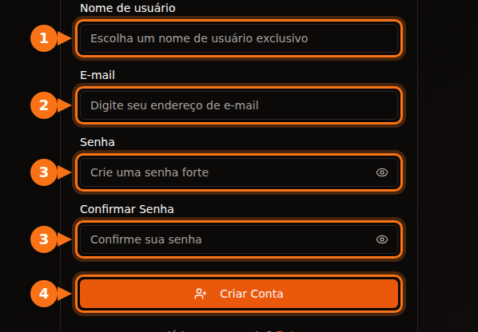
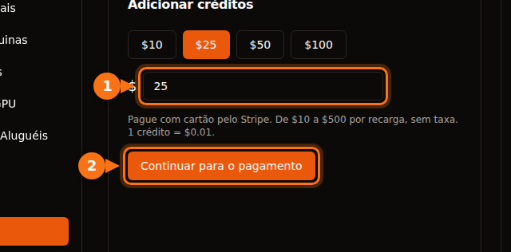

Antes de você alugar a sua primeira GPU, toda plataforma pede alguma coisa: um endereço de e-mail, um cartão, às vezes um número de telefone e, nas grandes nuvens, um pedido de cota que pode levar dias. Este artigo lista o que cada uma pede, para você escolher uma em que dá para começar ainda hoje.

Tudo foi verificado em setembro de 2026 na documentação das próprias plataformas. As fontes estão no final.

## Comparação rápida

| Plataforma | Para criar a conta | Antes de poder alugar | Verificação de identidade para locatários | Mínimo para começar |
| --- | --- | --- | --- | --- |
| **GPUFlow** | E-mail e senha, ou Google ou GitHub | Confirmar o e-mail, adicionar créditos com cartão | Nenhuma nas etapas do locatário | Recarga de US$ 10, sem taxa |
| **Vast.ai** | E-mail | Verificar o e-mail, adicionar crédito | Não consta na documentação | Depósito de US$ 5 |
| **RunPod** | E-mail | Adicionar crédito | Só antes do primeiro pagamento em cripto | 1 hora de crédito; US$ 100 por transação com cartão pré-pago |
| **SaladCloud** | Conta no portal | Adicionar uma forma de cobrança à sua organização | Não consta na documentação | Recargas a partir de US$ 5 |
| **Lambda** | Conta | Adicionar um cartão de crédito | Não consta na documentação | Pré-autorização de US$ 10 no cartão, estornada |
| **TensorDock** | Conta | Depositar dinheiro | Os termos permitem verificações da conta | "A partir de US$ 5" |
| **AWS** | E-mail, verificação por PIN no telefone, forma de pagamento, CAPTCHA | Pedir uma cota de GPU: contas novas começam com 0 | Não para a maioria das contas | Pague conforme o uso |
| **Google Cloud** | Conta com faturamento | Pedir cota de GPU; contas de avaliação gratuita não recebem nenhuma | Não para a maioria das contas | Pague conforme o uso |

"Não consta na documentação" significa que não encontramos uma exigência de identidade para locatários na documentação da plataforma. As plataformas ainda podem pedir verificações quando algo parecer fora do normal.

## As plataformas menores: minutos, não dias

Vast.ai, RunPod, SaladCloud, TensorDock e GPUFlow são todas pré-pagas. Você coloca dinheiro primeiro e gasta por segundo ou por minuto. Como não dá para acumular uma conta que você não pagou, elas não precisam verificar o seu crédito nem a sua empresa.

No que elas diferem:

- **Verificação de e-mail.** A Vast.ai e o GPUFlow exigem essa verificação antes de você poder alugar ou adicionar créditos. Olhe a pasta de spam se o e-mail não chegar.
- **Formas de pagamento.**
  - Vast.ai: cartão, BitPay, Crypto.com.
  - RunPod: Visa, Mastercard, Amex, cripto e faturamento para pagamentos acima de US$ 5.000.
  - SaladCloud: cartão, ou USDC, USDT e RENDER na Solana.
  - Lambda: só os principais cartões de crédito, e só em países atendidos.
  - GPUFlow: cartões pela Stripe.
- **O que acontece com o seu dinheiro se você não usar.** O crédito da SaladCloud expira 12 meses após a compra. Os créditos do GPUFlow não expiram.

## As grandes nuvens: conte com um pedido de cota

A AWS e o Google Cloud não barram você no cadastro. A barreira está na GPU.

- **AWS:** a cota de "Running On-Demand G and VT instances" (a família de instâncias com a NVIDIA L4 e a A10G) começa em **0 vCPUs** nas contas novas. Você pede mais no console Service Quotas. A AWS também aumenta as cotas automaticamente conforme a conta acumula uso.
- **Google Cloud:** contas de avaliação gratuita não recebem cota de GPU. Quando o projeto já tem histórico de faturamento, os pedidos de cota são aprovados com mais facilidade. A cota é por região, e GPUs preemptivas precisam de uma cota própria.

Se você precisa de uma GPU hoje, não comece por uma conta nova na AWS ou no Google Cloud.

## Cadastro no GPUFlow, passo a passo

O GPUFlow foi feito para o caso "preciso de um modelo de IA em cinco minutos". O que você recebe é uma chave de API compatível com a OpenAI para uma GPU, não uma máquina.

1. **Crie uma conta** em gpuflow.app com um nome de usuário, seu endereço de e-mail e uma senha, ou com Google ou GitHub.

   

2. **Confirme seu e-mail.** Clique no link do e-mail que o GPUFlow envia. Você não pode adicionar créditos antes disso.
3. **Adicione créditos** em **Painel → Pagamentos**, de US$ 10 a US$ 500, com cartão pela Stripe. 1 crédito = US$ 0,01, e não há taxa.

   

4. **Alugue uma GPU** pelo número de horas que quiser e copie a sua chave de API. Você [paga por segundo](/pt_br/per-second-vs-hourly-gpu-billing/); se encerrar antes, o restante volta para os seus créditos.

O passo a passo completo, com todas as telas, está na documentação: [alugue uma GPU, passo a passo](https://docs.gpuflow.app/pt-br/renters/getting-started/).

## Se o que você quer é colocar sua GPU para alugar

É na hora de receber que entram as verificações de identidade. Empresas de pagamento são obrigadas a saber para quem mandam dinheiro.

- **GPUFlow:** para sacar, você configura uma conta de recebimento na Stripe, que verifica a sua identidade e pede os seus dados bancários. Os saques funcionam nos Estados Unidos, Canadá, Reino Unido, Suíça e Espaço Econômico Europeu.
- **Vast.ai:** os hosts recebem por Wise, PayPal ou Stripe, e esses serviços cuidam da verificação de identidade.
- **Salad:** as recompensas são pagas por PayPal, vale-presentes e outras opções.

Veja quanto dá para ganhar como host em [quanto sua GPU gamer pode render](/pt_br/how-much-can-you-earn-renting-out-your-gpu/).

## Antes de pagar: um checklist rápido

1. **Confirme seu e-mail primeiro**, para não travar na etapa de pagamento.
2. **Verifique se o seu país e o seu cartão são aceitos.** A Lambda, por exemplo, só aceita pagamentos de uma lista de países.
3. **Saiba qual é a tarifa de transação internacional do seu banco.** A maioria das plataformas cobra em dólar. [Mais sobre custos escondidos](/pt_br/hidden-fees-in-gpu-rental/).
4. **Comece pequeno.** Coloque o suficiente para algumas horas, teste e depois adicione mais.

## Artigos relacionados

- [GPUFlow vs Vast.ai vs RunPod vs SaladCloud: qual combina com o seu trabalho](/pt_br/gpuflow-vs-vast-ai-vs-runpod/)
- [Como usar uma chave de API compatível com a OpenAI no Open WebUI, Continue, LangChain e outros](/pt_br/use-openai-compatible-api-key-in-apps/)

## Fontes

Tudo verificado em setembro de 2026.

- GPUFlow: [alugue uma GPU, passo a passo](https://docs.gpuflow.app/pt-br/renters/getting-started/), [créditos e cobrança](https://docs.gpuflow.app/pt-br/renters/billing/), [como receber](https://docs.gpuflow.app/pt-br/providers/getting-paid/)
- Vast.ai: [quickstart](https://docs.vast.ai/guides/get-started/quickstart.md), [cobrança](https://docs.vast.ai/documentation/reference/billing), [pagamentos aos hosts](https://docs.vast.ai/host/payment.md)
- RunPod: [informações de cobrança](https://docs.runpod.io/references/billing-information)
- SaladCloud: [configuração da conta](https://docs.salad.com/general/tutorials/account-setup.md), [cobrança](https://docs.salad.com/general/explanation/billing.md)
- Lambda: [gerenciar a cobrança](https://docs.lambda.ai/public-cloud/manage-billing/)
- TensorDock: [GPUs na nuvem](https://www.tensordock.com/cloud-gpus.html), [termos de serviço](https://docs.tensordock.com/legal-information/terms-of-service-tos)
- AWS: [criar uma conta](https://docs.aws.amazon.com/accounts/latest/reference/manage-acct-creating.html), [cotas de instâncias On-Demand](https://docs.aws.amazon.com/AWSEC2/latest/UserGuide/ec2-on-demand-instances.html)
- Google Cloud: [solução de problemas de cota de GPU](https://docs.cloud.google.com/deep-learning-vm/docs/troubleshooting)
- Recompensas do Salad: [resgate via PayPal](https://support.salad.com/rewards/redeeming-your-rewards/how-to-redeem-paypal/)
