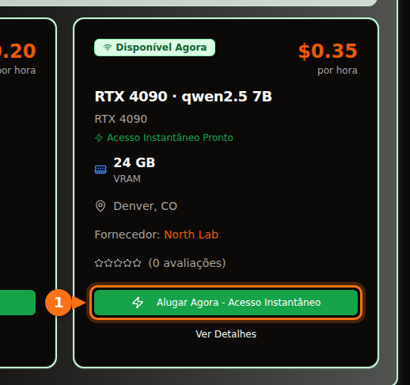

Na quantização de 4 bits que o Ollama usa por padrão, um modelo de 7B ou 8B precisa de uma placa de 8 GB, modelos de 12B a 14B precisam de 12 GB (16 GB se você quiser prompts longos) e modelos de 27B a 32B precisam de 24 GB. Um modelo de 70B em 4 bits tem 43 GB, ou seja, exige 48 GB de VRAM ou mais.

Vale ler a versão longa, porque o tamanho do download não é a conta inteira. O contexto que você usa também ocupa memória, e um modelo que parece caber pode acabar metade na CPU e várias vezes mais lento. Abaixo estão a fórmula que eu uso, o que significam os rótulos de quantização e uma tabela com modelos abertos atuais e seus tamanhos reais de download na biblioteca do Ollama. Tamanhos e especificações foram verificados em setembro de 2026; as fontes estão no final.

## Resposta rápida por tamanho de VRAM

| VRAM | Placas típicas | O que roda inteiro na GPU (4 bits) |
| --- | --- | --- |
| 8 GB | RTX 4060, RTX 5060, RTX 3070 | Modelos de 7B a 8B: Llama 3.1 8B, Qwen3 8B, Mistral 7B |
| 12 GB | RTX 3060 12 GB, RTX 4070, RTX 5070 | Modelos de 12B a 14B com contexto curto; 7B a 8B em Q8_0 |
| 16 GB | RTX 4060 Ti 16 GB, RTX 4080, RTX 5080 | 14B com contexto longo, gpt-oss 20B |
| 24 GB | RTX 3090, RTX 4090 | 24B a 32B: Mistral Small 3.2, Gemma 3 27B, Qwen3 32B |
| 32 GB | RTX 5090 | 32B com contexto longo, modelos mixture-of-experts de 35B |
| 48 a 80 GB | L40S (48 GB), H100 (80 GB) | 70B em 4 bits, gpt-oss 120B em 80 GB |

Os tamanhos de memória das placas vêm das páginas de especificação da NVIDIA. Algumas placas existem em duas versões: a RTX 3060 tem modelos de 12 GB e de 8 GB, e a RTX 4060 Ti e a RTX 5060 Ti têm de 16 GB e de 8 GB. Confira qual delas você está comprando ou alugando.

## Como estimar a VRAM de que um modelo precisa

Enquanto um modelo responde, três coisas ficam na memória da GPU:

1. **Os pesos.** Parâmetros × bits por peso ÷ 8 = bytes.
2. **O cache KV.** O modelo guarda as chaves e os valores (keys e values) de cada token da conversa para não precisar recalculá-los. Por token, isso dá 2 × camadas × cabeças KV × tamanho da cabeça × 2 bytes (com o cache padrão de 16 bits). Multiplique pelo tamanho do contexto.
3. **Overhead.** O contexto CUDA, os buffers de trabalho e o próprio runtime. Eu reservo cerca de 1 GB. Isso varia com o motor e as configurações, então trate como regra prática, não como especificação.

Os números de camadas e de cabeças estão no `config.json` de cada modelo no Hugging Face.

### Exemplo prático: Qwen 2.5 14B em uma placa de 16 GB

O Qwen 2.5 14B tem 14,7 bilhões de parâmetros, 48 camadas, 8 cabeças KV e tamanho de cabeça 128 (dimensão oculta de 5.120 ÷ 40 cabeças de atenção).

- **Pesos em Q4_K_M:** o llama.cpp indica cerca de 4,89 bits por peso para o Q4_K_M. 14,7 bilhões × 4,89 ÷ 8 = 8,99 GB. O download do `qwen2.5:14b` no Ollama tem 9,0 GB, então a conta bate com o arquivo real.
- **Cache KV por token:** 2 × 48 × 8 × 128 × 2 bytes = 196.608 bytes, cerca de 0,2 MB.
- **Cache KV do contexto inteiro:** 4.096 tokens = 0,8 GB. 16.384 tokens = 3,2 GB. 32.768 tokens = 6,4 GB.
- **Total:** 9,0 + 0,8 + 1 = 10,8 GB com contexto de 4K. 9,0 + 3,2 + 1 = 13,2 GB com 16K. 9,0 + 6,4 + 1 = 16,4 GB com 32K, que já não cabe em uma placa de 16 GB.

<figure>
<svg viewBox="0 0 720 340" role="img" aria-labelledby="d1-title" xmlns="http://www.w3.org/2000/svg" font-family="system-ui, sans-serif" font-size="15">
<title id="d1-title">O que ocupa a VRAM com o Qwen 2.5 14B em Q4_K_M em uma placa de 16 GB: pesos, cache KV em três tamanhos de contexto e overhead</title>
<rect x="0" y="0" width="720" height="340" fill="#ffffff"/>
<rect x="150" y="20" width="16" height="16" rx="3" fill="#6366f1"/>
<text x="172" y="33" fill="#1e1b4b">Pesos 9.0 GB</text>
<rect x="330" y="20" width="16" height="16" rx="3" fill="#a5b4fc"/>
<text x="352" y="33" fill="#1e1b4b">Cache KV</text>
<rect x="510" y="20" width="16" height="16" rx="3" fill="#e2e8f0"/>
<text x="532" y="33" fill="#1e1b4b">Overhead ~1 GB</text>
<line x1="582.0" y1="66" x2="582.0" y2="278" stroke="#f97316" stroke-width="2" stroke-dasharray="5 4"/>
<text x="576.0" y="60" text-anchor="end" fill="#f97316" font-weight="600">Placa de 16 GB</text>
<text x="140" y="106" text-anchor="end" fill="#1e1b4b">Contexto 4K</text>
<rect x="150" y="80" width="243.0" height="40" fill="#6366f1"/>
<text x="271.5" y="106" text-anchor="middle" fill="#ffffff">pesos</text>
<rect x="393.0" y="80" width="21.6" height="40" fill="#a5b4fc"/>
<rect x="414.6" y="80" width="27.0" height="40" fill="#e2e8f0"/>
<text x="449.6" y="106" fill="#16a34a" font-weight="600">10.8 GB</text>
<text x="140" y="180" text-anchor="end" fill="#1e1b4b">Contexto 16K</text>
<rect x="150" y="154" width="243.0" height="40" fill="#6366f1"/>
<text x="271.5" y="180" text-anchor="middle" fill="#ffffff">pesos</text>
<rect x="393.0" y="154" width="86.4" height="40" fill="#a5b4fc"/>
<text x="436.2" y="180" text-anchor="middle" fill="#1e1b4b">3.2</text>
<rect x="479.4" y="154" width="27.0" height="40" fill="#e2e8f0"/>
<text x="514.4" y="180" fill="#16a34a" font-weight="600">13.2 GB</text>
<text x="140" y="254" text-anchor="end" fill="#1e1b4b">Contexto 32K</text>
<rect x="150" y="228" width="243.0" height="40" fill="#6366f1"/>
<text x="271.5" y="254" text-anchor="middle" fill="#ffffff">pesos</text>
<rect x="393.0" y="228" width="172.8" height="40" fill="#a5b4fc"/>
<text x="479.4" y="254" text-anchor="middle" fill="#1e1b4b">6.4</text>
<rect x="565.8" y="228" width="27.0" height="40" fill="#e2e8f0"/>
<text x="600.8" y="254" fill="#f97316" font-weight="600">16.4 GB</text>
<line x1="150" y1="278" x2="690" y2="278" stroke="#64748b"/>
<line x1="150.0" y1="278" x2="150.0" y2="283" stroke="#64748b"/>
<text x="150.0" y="300" text-anchor="middle" fill="#64748b">0</text>
<line x1="258.0" y1="278" x2="258.0" y2="283" stroke="#64748b"/>
<text x="258.0" y="300" text-anchor="middle" fill="#64748b">4</text>
<line x1="366.0" y1="278" x2="366.0" y2="283" stroke="#64748b"/>
<text x="366.0" y="300" text-anchor="middle" fill="#64748b">8</text>
<line x1="474.0" y1="278" x2="474.0" y2="283" stroke="#64748b"/>
<text x="474.0" y="300" text-anchor="middle" fill="#64748b">12</text>
<line x1="582.0" y1="278" x2="582.0" y2="283" stroke="#64748b"/>
<text x="582.0" y="300" text-anchor="middle" fill="#64748b">16</text>
<line x1="690.0" y1="278" x2="690.0" y2="283" stroke="#64748b"/>
<text x="690.0" y="300" text-anchor="middle" fill="#64748b">20</text>
<text x="420.0" y="326" text-anchor="middle" fill="#64748b">GB de VRAM</text>
</svg>
<figcaption>Qwen 2.5 14B em Q4_K_M em uma placa de 16 GB. Os pesos ficam em 9,0 GB; o cache KV cresce com o contexto até que, com 32K tokens, o total passa de 16 GB. O overhead é uma estimativa prática de 1 GB.</figcaption>
</figure>

Daí saem duas conclusões. Primeiro, o contexto que você define pode custar tanta memória quanto o próprio modelo. O Llama 3.1 8B (32 camadas, 8 cabeças KV, tamanho de cabeça 128) precisa de 131.072 bytes de cache KV por token, então o contexto completo de 128K exigiria 17,2 GB só de cache, cerca de três vezes e meia o download de 4,9 GB. Segundo, o tamanho do cache KV por token varia muito entre modelos. O Qwen 2.5 7B tem só 4 cabeças KV e 28 camadas, então precisa de 57.344 bytes por token, menos da metade do Llama 3.1 8B. Confira o config antes de supor.

### O que o Ollama faz com o contexto por padrão

O Ollama escolhe o tamanho de contexto padrão a partir da VRAM que encontra: 4K tokens abaixo de 24 GiB, 32K tokens de 24 a 48 GiB e 256K a partir de 48 GiB. Dá para mudar isso com a variável de ambiente `OLLAMA_CONTEXT_LENGTH`, e o `ollama ps` mostra na coluna CONTEXT o contexto realmente alocado. Mais duas configurações mudam a conta:

- `OLLAMA_NUM_PARALLEL` (padrão 1): a documentação do Ollama diz que requisições paralelas aumentam o tamanho do contexto pelo número de requisições paralelas. Quatro slots paralelos significam quatro vezes o cache KV.
- `OLLAMA_KV_CACHE_TYPE`: `q8_0` usa cerca de metade da memória do cache padrão `f16`, e `q4_0` cerca de um quarto. Exige que o flash attention esteja ativado.

## O que significam os níveis de quantização

Os modelos abertos são publicados em precisão de 16 bits (os configs indicados abaixo listam bfloat16): dois bytes por parâmetro. A quantização guarda os pesos em menos bits. Nos arquivos GGUF, o formato que o Ollama e o llama.cpp usam, os rótulos significam mais ou menos isto:

| Rótulo | Bits por peso | Tamanho do Llama 3.1 8B | Perplexidade no Llama 3 8B (menor é melhor) |
| --- | --- | --- | --- |
| F16 | 16,0 | 14,96 GiB | 6,233 |
| Q8_0 | 8,50 | 7,95 GiB | 6,234 |
| Q6_K | 6,56 | 6,14 GiB | 6,253 |
| Q5_K_M | 5,70 | 5,33 GiB | 6,289 |
| Q4_K_M | 4,89 | 4,58 GiB | 6,407 |
| Q3_K_M | 4,00 | 3,74 GiB | 6,888 |
| Q2_K_S / Q2_K | 2,97 | 2,78 GiB | 9,752 (Q2_K) |

Bits por peso e tamanhos vêm do README de quantização do llama.cpp (Llama 3.1 8B). A perplexidade vem do README de perplexidade do llama.cpp (Llama 3 8B, Wikitext). Os tipos "K" são os k-quants do llama.cpp, que misturam precisões ao longo do modelo; `_S`, `_M` e `_L` são misturas pequena, média e grande.

O que os números dizem: o Q8_0 é praticamente sem perda (perplexidade de 6,234 contra 6,233). O Q4_K_M custa cerca de 3% em perplexidade, e o mesmo README informa que o próximo token mais provável dele coincide com o do modelo em precisão total em 91,9% das vezes. O Q3 é visivelmente pior, e o Q2 desanda.

Perplexidade não é o mesmo que utilidade, então ajuda que um estudo de janeiro de 2026, de Uygar Kurt, tenha passado o Llama 3.1 8B Instruct por benchmarks de raciocínio, conhecimento, seguimento de instruções e veracidade em cada nível do llama.cpp. A média simples foi de 69,47 em F16, 69,41 em Q8_0, 69,36 em Q5_K_M e 69,15 em Q4_K_M. É por isso que quase todo mundo, o Ollama incluído, usa Q4_K_M por padrão: o arquivo tem menos de um terço do FP16, com uma perda que você raramente vai notar. No Ollama, a tag simples é essa versão de 4 bits: `qwen3:8b` e `qwen3:8b-q4_K_M` têm os dois 5,2 GB, e `phi4:14b` e `phi4:14b-q4_K_M` têm os dois 9,1 GB.

Minha regra: pegue o maior modelo que cabe em Q4_K_M antes de pegar um modelo menor em Q8_0. Um 14B em Q4 costuma ganhar de um 7B em Q8, e os arquivos têm mais ou menos o mesmo tamanho. Suba para Q5 ou Q8 quando sobrar memória e a tarefa for sensível a pequenos erros, como código ou extração exata.

As tags mais novas do Ollama também incluem formatos como `qat` (as versões do Gemma treinadas com quantização em mente), `nvfp4` e `mxfp8`. O gpt-oss já sai da própria OpenAI em MXFP4, com 4,25 bits por parâmetro nos pesos mixture-of-experts.

## Quais modelos cabem: tamanhos e faixas de VRAM

A tabela lista modelos abertos atuais da biblioteca do Ollama em setembro de 2026, com seus tamanhos de download. A coluna "4 bits" é o tamanho da tag padrão. Na maioria dos modelos, é o mesmo arquivo da tag `q4_K_M`; quando a padrão é outra versão, a tabela mostra os dois tamanhos (a padrão do Mistral Nemo tem 7,1 GB e a `q4_K_M`, 7,5 GB). "Menor placa" quer dizer que o modelo, mais cerca de 1 GB de overhead, mais um contexto de 4K a 8K, cabe inteiro na GPU. Quer contexto longo? Suba uma faixa.

| Modelo | Tag do Ollama | Tamanho em 4 bits | Tamanho em Q8_0 | Menor placa (4 bits / Q8_0) |
| --- | --- | --- | --- | --- |
| Mistral 7B v0.3 | [`mistral:7b`](https://ollama.com/library/mistral/tags) | 4,4 GB | 7,7 GB | 8 GB / 12 GB |
| Qwen 2.5 7B | [`qwen2.5:7b`](https://ollama.com/library/qwen2.5/tags) | 4,7 GB | 8,1 GB | 8 GB / 12 GB |
| DeepSeek-R1 distill 7B (Qwen 2.5) | [`deepseek-r1:7b`](https://ollama.com/library/deepseek-r1/tags) | 4,7 GB | não verificado | 8 GB |
| Llama 3.1 8B | [`llama3.1:8b`](https://ollama.com/library/llama3.1/tags) | 4,9 GB | 8,5 GB | 8 GB / 12 GB |
| Qwen3 8B | [`qwen3:8b`](https://ollama.com/library/qwen3/tags) | 5,2 GB | 8,9 GB | 8 GB / 12 GB |
| DeepSeek-R1-0528 (Qwen3 8B) | [`deepseek-r1:8b`](https://ollama.com/library/deepseek-r1/tags) | 5,2 GB | não verificado | 8 GB |
| Qwen3.5 9B | [`qwen3.5:9b`](https://ollama.com/library/qwen3.5/tags) | 6,6 GB | 11 GB | 8 GB, só com contexto curto / 16 GB |
| Mistral Nemo 12B | [`mistral-nemo:12b`](https://ollama.com/library/mistral-nemo/tags) | 7,1 GB (q4_K_M: 7,5 GB) | 13 GB | 12 GB / 16 GB |
| Gemma 4 12B | [`gemma4:12b`](https://ollama.com/library/gemma4/tags) | 7,6 GB | 13 GB | 12 GB / 16 GB |
| Gemma 3 12B | [`gemma3:12b`](https://ollama.com/library/gemma3/tags) | 8,1 GB | 13 GB | 12 GB / 16 GB |
| Qwen 2.5 14B | [`qwen2.5:14b`](https://ollama.com/library/qwen2.5/tags) | 9,0 GB | 16 GB | 12 GB / 24 GB |
| DeepSeek-R1 distill 14B (Qwen 2.5) | [`deepseek-r1:14b`](https://ollama.com/library/deepseek-r1/tags) | 9,0 GB | não verificado | 12 GB |
| Phi-4 14B | [`phi4:14b`](https://ollama.com/library/phi4/tags) | 9,1 GB | 16 GB | 12 GB / 24 GB |
| Qwen3 14B | [`qwen3:14b`](https://ollama.com/library/qwen3/tags) | 9,3 GB | 16 GB | 12 GB / 24 GB |
| gpt-oss 20B (MoE) | [`gpt-oss:20b`](https://ollama.com/library/gpt-oss/tags) | 14 GB (MXFP4) | n/d | 16 GB |
| Mistral Small 3.2 24B | [`mistral-small3.2:24b`](https://ollama.com/library/mistral-small3.2/tags) | 15 GB | 26 GB | 24 GB / 32 GB |
| Gemma 3 27B | [`gemma3:27b`](https://ollama.com/library/gemma3/tags) | 17 GB | 30 GB | 24 GB / 48 GB |
| Qwen3.5 27B | [`qwen3.5:27b`](https://ollama.com/library/qwen3.5/tags) | 17 GB | 30 GB | 24 GB / 48 GB |
| Qwen3.6 27B | [`qwen3.6:27b`](https://ollama.com/library/qwen3.6/tags) | 18 GB (q4_K_M: 17 GB) | 30 GB | 24 GB / 48 GB |
| Gemma 4 26B (MoE, 3,8B ativos) | [`gemma4:26b`](https://ollama.com/library/gemma4/tags) | 19 GB (q4_K_M: 18 GB) | 28 GB | 24 GB / 32 GB |
| Qwen3 30B-A3B (MoE) | [`qwen3:30b`](https://ollama.com/library/qwen3/tags) | 19 GB | não verificado | 24 GB |
| Gemma 4 31B | [`gemma4:31b`](https://ollama.com/library/gemma4/tags) | 20 GB | 34 GB | 24 GB / 48 GB |
| Qwen3 32B | [`qwen3:32b`](https://ollama.com/library/qwen3/tags) | 20 GB | 35 GB | 24 GB / 48 GB |
| Qwen 2.5 32B | [`qwen2.5:32b`](https://ollama.com/library/qwen2.5/tags) | 20 GB | 35 GB | 24 GB / 48 GB |
| DeepSeek-R1 distill 32B (Qwen 2.5) | [`deepseek-r1:32b`](https://ollama.com/library/deepseek-r1/tags) | 20 GB | não verificado | 24 GB |
| Qwen3.6 35B-A3B (MoE) | [`qwen3.6:35b`](https://ollama.com/library/qwen3.6/tags) | 23 GB (q4_K_M: 24 GB) | 39 GB | 32 GB / 48 GB |
| Qwen3.5 35B-A3B (MoE) | [`qwen3.5:35b`](https://ollama.com/library/qwen3.5/tags) | 24 GB | 39 GB | 32 GB / 48 GB |
| Llama 3.3 70B | [`llama3.3:70b`](https://ollama.com/library/llama3.3/tags) | 43 GB | 75 GB | 48 GB, no limite / 80 GB, no limite |
| Qwen 2.5 72B | [`qwen2.5:72b`](https://ollama.com/library/qwen2.5/tags) | 47 GB | não verificado | 80 GB |
| gpt-oss 120B (MoE) | [`gpt-oss:120b`](https://ollama.com/library/gpt-oss/tags) | 65 GB (MXFP4) | n/d | 80 GB |

Usei o tamanho da tag padrão para definir a faixa, já que é isso que o `ollama pull` baixa quando você usa o nome curto.

As faixas de 24 GB e 32 GB têm uma pegadinha. O contexto padrão do Ollama salta de 4K para 32K a partir de 24 GiB, então um modelo de 20 GB em uma RTX 4090 pode receber um cache de 32K que não cabe ao lado dele. Se o `ollama ps` mostrar uma parte na CPU, defina um contexto menor. E não julgue um modelo pelo número no nome: o modelo de borda do Gemma 4, `gemma4:e4b` (4,5B parâmetros efetivos), é um download de 9,6 GB, maior que o `gemma4:12b`, com 7,6 GB. Confira o tamanho.

<figure>
<svg viewBox="0 0 720 546" role="img" aria-labelledby="d2-title" xmlns="http://www.w3.org/2000/svg" font-family="system-ui, sans-serif" font-size="14">
<title id="d2-title">Tamanho do download de modelos populares do Ollama na quantização padrão de 4 bits, comparado com 8, 12, 16, 24 e 32 GB de VRAM</title>
<rect x="0" y="0" width="720" height="546" fill="#ffffff"/>
<line x1="320.0" y1="58" x2="320.0" y2="486" stroke="#f97316" stroke-width="2" stroke-dasharray="5 4"/>
<text x="320.0" y="50" text-anchor="middle" fill="#f97316" font-weight="600">8 GB</text>
<line x1="380.0" y1="58" x2="380.0" y2="486" stroke="#f97316" stroke-width="2" stroke-dasharray="5 4"/>
<text x="380.0" y="50" text-anchor="middle" fill="#f97316" font-weight="600">12 GB</text>
<line x1="440.0" y1="58" x2="440.0" y2="486" stroke="#f97316" stroke-width="2" stroke-dasharray="5 4"/>
<text x="440.0" y="50" text-anchor="middle" fill="#f97316" font-weight="600">16 GB</text>
<line x1="560.0" y1="58" x2="560.0" y2="486" stroke="#f97316" stroke-width="2" stroke-dasharray="5 4"/>
<text x="560.0" y="50" text-anchor="middle" fill="#f97316" font-weight="600">24 GB</text>
<line x1="680.0" y1="58" x2="680.0" y2="486" stroke="#f97316" stroke-width="2" stroke-dasharray="5 4"/>
<text x="680.0" y="50" text-anchor="middle" fill="#f97316" font-weight="600">32 GB</text>
<text x="20" y="50" fill="#64748b">Faixas de VRAM</text>
<text x="190" y="84" text-anchor="end" fill="#1e1b4b">mistral:7b</text>
<rect x="200" y="70" width="66.0" height="18" rx="3" fill="#6366f1"/>
<text x="272.0" y="84" fill="#1e1b4b">4.4</text>
<text x="190" y="110" text-anchor="end" fill="#1e1b4b">qwen2.5:7b</text>
<rect x="200" y="96" width="70.5" height="18" rx="3" fill="#6366f1"/>
<text x="276.5" y="110" fill="#1e1b4b">4.7</text>
<text x="190" y="136" text-anchor="end" fill="#1e1b4b">llama3.1:8b</text>
<rect x="200" y="122" width="73.5" height="18" rx="3" fill="#6366f1"/>
<text x="279.5" y="136" fill="#1e1b4b">4.9</text>
<text x="190" y="162" text-anchor="end" fill="#1e1b4b">qwen3:8b</text>
<rect x="200" y="148" width="78.0" height="18" rx="3" fill="#6366f1"/>
<text x="284.0" y="162" fill="#1e1b4b">5.2</text>
<text x="190" y="188" text-anchor="end" fill="#1e1b4b">qwen3.5:9b</text>
<rect x="200" y="174" width="99.0" height="18" rx="3" fill="#6366f1"/>
<text x="297.0" y="188" text-anchor="end" fill="#ffffff">6.6</text>
<text x="190" y="214" text-anchor="end" fill="#1e1b4b">gemma4:12b</text>
<rect x="200" y="200" width="114.0" height="18" rx="3" fill="#6366f1"/>
<text x="324.0" y="214" fill="#1e1b4b">7.6</text>
<text x="190" y="240" text-anchor="end" fill="#1e1b4b">gemma3:12b</text>
<rect x="200" y="226" width="121.5" height="18" rx="3" fill="#6366f1"/>
<text x="327.5" y="240" fill="#1e1b4b">8.1</text>
<text x="190" y="266" text-anchor="end" fill="#1e1b4b">qwen2.5:14b</text>
<rect x="200" y="252" width="135.0" height="18" rx="3" fill="#6366f1"/>
<text x="341.0" y="266" fill="#1e1b4b">9.0</text>
<text x="190" y="292" text-anchor="end" fill="#1e1b4b">qwen3:14b</text>
<rect x="200" y="278" width="139.5" height="18" rx="3" fill="#6366f1"/>
<text x="345.5" y="292" fill="#1e1b4b">9.3</text>
<text x="190" y="318" text-anchor="end" fill="#1e1b4b">gpt-oss:20b</text>
<rect x="200" y="304" width="210.0" height="18" rx="3" fill="#6366f1"/>
<text x="416.0" y="318" fill="#1e1b4b">14</text>
<text x="190" y="344" text-anchor="end" fill="#1e1b4b">mistral-small3.2:24b</text>
<rect x="200" y="330" width="225.0" height="18" rx="3" fill="#6366f1"/>
<text x="423.0" y="344" text-anchor="end" fill="#ffffff">15</text>
<text x="190" y="370" text-anchor="end" fill="#1e1b4b">gemma3:27b</text>
<rect x="200" y="356" width="255.0" height="18" rx="3" fill="#6366f1"/>
<text x="461.0" y="370" fill="#1e1b4b">17</text>
<text x="190" y="396" text-anchor="end" fill="#1e1b4b">qwen3.5:27b</text>
<rect x="200" y="382" width="255.0" height="18" rx="3" fill="#6366f1"/>
<text x="461.0" y="396" fill="#1e1b4b">17</text>
<text x="190" y="422" text-anchor="end" fill="#1e1b4b">gemma4:31b</text>
<rect x="200" y="408" width="300.0" height="18" rx="3" fill="#6366f1"/>
<text x="506.0" y="422" fill="#1e1b4b">20</text>
<text x="190" y="448" text-anchor="end" fill="#1e1b4b">qwen3:32b</text>
<rect x="200" y="434" width="300.0" height="18" rx="3" fill="#6366f1"/>
<text x="506.0" y="448" fill="#1e1b4b">20</text>
<text x="190" y="474" text-anchor="end" fill="#1e1b4b">qwen3.6:35b</text>
<rect x="200" y="460" width="345.0" height="18" rx="3" fill="#6366f1"/>
<text x="539.0" y="474" text-anchor="end" fill="#ffffff">23</text>
<line x1="200" y1="486" x2="680" y2="486" stroke="#64748b" stroke-width="1"/>
<line x1="200.0" y1="486" x2="200.0" y2="491" stroke="#64748b"/>
<text x="200.0" y="506" text-anchor="middle" fill="#64748b">0</text>
<line x1="260.0" y1="486" x2="260.0" y2="491" stroke="#64748b"/>
<text x="260.0" y="506" text-anchor="middle" fill="#64748b">4</text>
<line x1="320.0" y1="486" x2="320.0" y2="491" stroke="#64748b"/>
<text x="320.0" y="506" text-anchor="middle" fill="#64748b">8</text>
<line x1="380.0" y1="486" x2="380.0" y2="491" stroke="#64748b"/>
<text x="380.0" y="506" text-anchor="middle" fill="#64748b">12</text>
<line x1="440.0" y1="486" x2="440.0" y2="491" stroke="#64748b"/>
<text x="440.0" y="506" text-anchor="middle" fill="#64748b">16</text>
<line x1="500.0" y1="486" x2="500.0" y2="491" stroke="#64748b"/>
<text x="500.0" y="506" text-anchor="middle" fill="#64748b">20</text>
<line x1="560.0" y1="486" x2="560.0" y2="491" stroke="#64748b"/>
<text x="560.0" y="506" text-anchor="middle" fill="#64748b">24</text>
<line x1="620.0" y1="486" x2="620.0" y2="491" stroke="#64748b"/>
<text x="620.0" y="506" text-anchor="middle" fill="#64748b">28</text>
<line x1="680.0" y1="486" x2="680.0" y2="491" stroke="#64748b"/>
<text x="680.0" y="506" text-anchor="middle" fill="#64748b">32</text>
<text x="440.0" y="530" text-anchor="middle" fill="#64748b">Tamanho do download em GB (tag padrão do Ollama, 4 bits)</text>
</svg>
<figcaption>Tamanhos de download das tags padrão de 4 bits do Ollama, em escala, comparados com tamanhos comuns de VRAM. Para caber, a barra precisa terminar bem à esquerda da linha: deixe cerca de 1 GB para o overhead e espaço para o cache KV.</figcaption>
</figure>

## Modelos mixture-of-experts mudam um pouco o quadro

O gpt-oss, o Gemma 4 26B e os modelos Qwen "A3B" são modelos mixture-of-experts (MoE). Para cada token, só alguns especialistas rodam: o Gemma 4 26B tem 25,2B parâmetros, mas 3,8B ativos. A regra de memória não muda, porque todos os pesos ainda precisam estar carregados em algum lugar. O que muda é a velocidade quando eles não cabem todos. Como cada token só toca uma fração dos pesos, um modelo MoE que transborda para a RAM do sistema perde muito menos velocidade do que um modelo denso do mesmo tamanho. As medições da próxima seção mostram o tamanho dessa diferença.

## O que acontece quando um modelo não cabe

O Ollama não se recusa a carregar um modelo grande demais. Ele coloca na GPU quantas camadas couberem e roda o resto na CPU, a partir da RAM do sistema. O `ollama ps` mostra em qual caso você está: `100% GPU` quer dizer que tudo cabe, `100% CPU` quer dizer que nada cabe, e uma mistura como `48%/52% CPU/GPU` quer dizer que o modelo foi dividido.

Essa divisão sai cara, porque gerar cada token exige ler todos os pesos ativos, e a RAM do sistema é muito mais lenta que a VRAM. Uma série de execuções do llama.cpp em uma RTX 4080 de 16 GB, publicada por Rost no DEV Community em abril de 2026, mostra isso com clareza:

| Modelo (quantização, tamanho do arquivo) | Contexto | Carga GPU / CPU | Tokens por segundo |
| --- | --- | --- | --- |
| Qwen3.5 27B denso (IQ3_XXS, 11,5 GB) | 32K | 98% / 100% | 45,1 |
| Qwen3.5 27B denso | 64K | 45% / 410% | 22,7 |
| Qwen3.5 27B denso | 128K | 16% / 625% | 9,6 |
| Qwen3.5 35B-A3B MoE (IQ3_S, 13,6 GB) | 64K | 88% / 115% | 136,8 |
| Qwen3.5 122B-A10B MoE (IQ3_XXS, 44,7 GB) | 32K | 30% / 480% | 21,8 |

Um valor alto de CPU com um valor baixo de GPU quer dizer que a maior parte do trabalho foi para a CPU; o autor lê os números da mesma forma.

O mesmo modelo denso perdeu metade da velocidade ao passar de 32K para 64K de contexto, só porque o cache KV maior empurrou camadas para fora da GPU, e perdeu quase 80% com 128K. O modelo MoE de 122B, um arquivo de 44,7 GB em uma placa de 16 GB, ainda rodou a cerca de 22 tokens por segundo, porque só 10B parâmetros ficam ativos por token. Para modelos densos, trate "parte na CPU" como "várias vezes mais lento". Para modelos MoE, pode ser uma troca aceitável.

Se o modelo foi dividido, as soluções, da mais barata para a mais cara: reduza o contexto, quantize o cache KV para `q8_0`, escolha uma quantização menor do mesmo modelo (Q4_K_M em vez de Q5), escolha um modelo menor ou passe para uma placa com mais memória.

## Placas de 32 GB e de data center

A RTX 5090 tem 32 GB. Isso dá para um modelo de 32B em 4 bits com contexto longo, ou para os modelos MoE 35B-A3B de 23 a 24 GB com espaço para o cache. Não chega a 70B: o `llama3.3:70b` tem 43 GB mesmo em 4 bits.

Para 70B você precisa de 48 GB ou mais. Uma L40S tem 48 GB, que comportam o arquivo de 43 GB com pouco espaço para contexto. Uma H100 SXM tem 80 GB (a H100 NVL tem 94 GB), o que comporta o Llama 3.3 70B em 4 bits com contexto longo, o gpt-oss 120B (65 GB; a página do Ollama diz que ele cabe em uma única GPU de 80 GB) ou o Llama 3.3 70B em Q8_0 (75 GB) com contexto curto. O Qwen3.5 122B, com 81 GB, já passa de uma única placa de 80 GB.

## Alugar em vez de comprar: como avaliar um anúncio no GPUFlow

Se você aluga uma GPU no GPUFlow, o provedor serve os modelos a partir da própria máquina (com o Ollama, que o instalador do GPUFlow configura por padrão) e escolhe quais modelos ficam instalados. Você não baixa modelos: recebe uma chave de API compatível com a OpenAI para aquela GPU, não um shell. O instalador do GPUFlow usa `qwen2.5:7b` por padrão, e as tags citadas no instalador e na documentação são `qwen2.5:0.5b`, `deepseek-r1:1.5b`, `qwen2.5:7b`, `deepseek-r1:7b`, `llama3.1:8b` e `qwen2.5:14b`. Os provedores podem instalar outras.

No [marketplace](https://gpuflow.app/pt-BR/marketplace), cada card mostra a GPU, a VRAM e o preço por hora, e a descrição do provedor lista os modelos que ele serve. A documentação do GPUFlow dá uma versão um pouco mais cautelosa da mesma regra: um modelo de 7B roda bem com 8 GB ou mais, um de 14B com 16 GB ou mais. Depois que você tem a chave, `GET /v1/models` devolve um nome de modelo; se a descrição listar mais modelos, você também pode usar esses nomes no campo `model`.

Duas coisas para saber. O GPUFlow não define um limite de contexto próprio, então valem os padrões do Ollama na máquina do provedor, a menos que ele os tenha alterado. E um modelo que o provedor não instalou não está disponível para você, então escolha o anúncio primeiro pelo modelo de que você precisa e depois pela GPU. [Conectar a chave ao Open WebUI, Continue ou LangChain](/pt_br/use-openai-compatible-api-key-in-apps/) funciona como com qualquer API no estilo da OpenAI.

## Artigos relacionados

- [Como usar uma chave de API compatível com a OpenAI no Open WebUI, Continue, LangChain e outros](/pt_br/use-openai-compatible-api-key-in-apps/)
- [GPU por hora ou API por token? Quanto custa de verdade rodar um modelo de 7B–8B](/pt_br/hourly-gpu-vs-per-token-api/)
- [Ollama vs vLLM vs TGI: benchmark de inferência na RTX 4090](/pt_br/ollama-vs-vllm-vs-tgi-rtx-4090-benchmark/)
- [Comparação de preços de aluguel de GPU em 2026](/pt_br/gpu-rental-pricing-comparison-2026/)

## Fontes

Tudo verificado em setembro de 2026.

- Tamanhos de download na biblioteca do Ollama: [mistral](https://ollama.com/library/mistral/tags), [qwen2.5](https://ollama.com/library/qwen2.5/tags), [qwen3](https://ollama.com/library/qwen3/tags), [qwen3.5](https://ollama.com/library/qwen3.5/tags), [qwen3.6](https://ollama.com/library/qwen3.6/tags), [llama3.1](https://ollama.com/library/llama3.1/tags), [llama3.3](https://ollama.com/library/llama3.3/tags), [deepseek-r1](https://ollama.com/library/deepseek-r1/tags), [página do DeepSeek-R1 (modelos-base dos distills)](https://ollama.com/library/deepseek-r1), [gemma3](https://ollama.com/library/gemma3/tags), [gemma4](https://ollama.com/library/gemma4/tags), [página do Gemma 4 (MoE e parâmetros ativos)](https://ollama.com/library/gemma4), [mistral-nemo](https://ollama.com/library/mistral-nemo/tags), [mistral-small3.2](https://ollama.com/library/mistral-small3.2/tags), [phi4](https://ollama.com/library/phi4/tags), [gpt-oss](https://ollama.com/library/gpt-oss/tags), [página do gpt-oss (MXFP4, memória)](https://ollama.com/library/gpt-oss), [índice da biblioteca do Ollama](https://ollama.com/library)
- Arquitetura dos modelos: [model card do Qwen2.5-14B-Instruct](https://huggingface.co/Qwen/Qwen2.5-14B-Instruct), [config.json do Qwen2.5-14B-Instruct](https://huggingface.co/Qwen/Qwen2.5-14B-Instruct/blob/main/config.json), [config.json do Qwen2.5-7B-Instruct](https://huggingface.co/Qwen/Qwen2.5-7B-Instruct/blob/main/config.json), [config.json do Llama-3.1-8B-Instruct (espelho da unsloth)](https://huggingface.co/unsloth/Llama-3.1-8B-Instruct/blob/main/config.json)
- Configurações de contexto e memória do Ollama: [documentação do Ollama, Context length](https://docs.ollama.com/context-length), [FAQ do Ollama](https://docs.ollama.com/faq)
- Tamanhos de quantização e bits por peso: [README de quantização do llama.cpp](https://github.com/ggml-org/llama.cpp/blob/master/tools/quantize/README.md)
- Perplexidade por quantização: [README de perplexidade do llama.cpp](https://github.com/ggml-org/llama.cpp/blob/master/tools/perplexity/README.md)
- Estudo de benchmarks de quantização: [Uygar Kurt, Which Quantization Should I Use? (arXiv 2601.14277)](https://arxiv.org/abs/2601.14277)
- Medições com descarregamento para a CPU: [Rost, benchmarks de LLM com 16 GB de VRAM no llama.cpp (DEV Community, abril de 2026)](https://dev.to/rosgluk/16-gb-vram-llm-benchmarks-with-llamacpp-speed-and-context-3hgg)
- Memória das GPUs: [comparação da série RTX 50 da NVIDIA](https://www.nvidia.com/en-us/geforce/graphics-cards/compare/), [série RTX 40](https://www.nvidia.com/en-us/geforce/graphics-cards/40-series/), [série RTX 30](https://www.nvidia.com/en-us/geforce/graphics-cards/30-series/), [L40S](https://www.nvidia.com/en-us/data-center/l40s/), [H100](https://www.nvidia.com/en-us/data-center/h100/)
- GPUFlow: [Alugar uma GPU, passo a passo](https://docs.gpuflow.app/pt-br/renters/getting-started/), [guia rápido da API](https://docs.gpuflow.app/pt-br/renters/api-quickstart/), [primeiros passos para provedores](https://docs.gpuflow.app/pt-br/providers/getting-started/)
