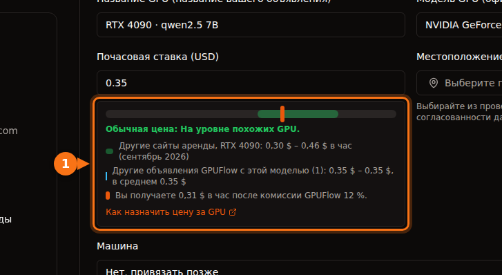

Если у вас есть игровая видеокарта, которая большую часть дня простаивает, её можно сдавать в аренду на маркетплейсе и получать почасовую оплату. Стоит ли это делать, зависит от четырёх чисел:

1. **Сколько арендаторы платят** за час работы вашей карты.
2. **Сколько забирает платформа.**
3. **Сколько стоит электричество**, пока карта работает.
4. **Сколько часов в день её реально арендуют.**

Первые три легко найти. Четвёртое не может гарантировать никто, поэтому мы показываем диапазон. Все цены ниже проверены в сентябре 2026 года, источники — в конце.

## 1. Сколько платят арендаторы

Типичные цены по требованию за час на сайтах аренды GPU (Vast.ai, RunPod, Salad, SimplePod, TensorDock, Hyperstack, Lambda) в сентябре 2026 года:

| GPU | Типичная цена за час | Середина диапазона |
| --- | --- | --- |
| RTX 3060 12 ГБ | $0,05 – $0,08 | $0,065 |
| RTX 4070 | $0,07 – $0,15 | $0,11 |
| RTX 3090 | $0,11 – $0,31 | $0,21 |
| RTX 4080 | $0,23 – $0,27 | $0,25 |
| RTX 4090 | $0,30 – $0,46 | $0,38 |
| RTX 5090 | $0,41 – $0,69 | $0,55 |

Объём памяти важен не меньше скорости. На карте с 24 ГБ вроде 3090 или 4090 можно запускать модели ИИ крупнее, чем на карте с 12 или 16 ГБ, и арендаторы за это платят.

## 2. Сколько забирает платформа

| Платформа | Доля | Выплаты |
| --- | --- | --- |
| GPUFlow | Забирает 12%, вы получаете 88% | На банковский счёт через Stripe. Минимум $25, $2,50 за каждый вывод. |
| Vast.ai | По словам Vast, цены в объявлениях обычно примерно на 25% выше того, что получают хосты | Wise, PayPal или Stripe. Минимум $20, счета выставляются раз в неделю. |
| Salad | Не раскрывается | PayPal, подарочные карты, игры и другое |

Устроены платформы тоже по-разному. На Vast.ai хосты работают на Ubuntu, а арендаторы получают на машине хоста контейнеры с доступом по SSH или через Jupyter. Salad работает на Windows 10 или 11. На GPUFlow вы выполняете одну команду на компьютере с Linux и systemd; арендаторы обращаются к вашим моделям ИИ только через API и никогда не получают командную оболочку на вашей машине. [К чему у арендаторов есть доступ, а к чему нет](https://docs.gpuflow.app/ru/providers/security/).

## 3. Сколько стоит электричество

Формула: **потребляемая мощность в кВт × цена кВт·ч = стоимость часа.**

В качестве потребляемой мощности мы берём официальную мощность платы каждой карты. Это близко к максимуму, который потребляет сама карта; при генерации текста моделью ИИ обычно меньше. Остальной компьютер добавляет своё. Честнее всего измерить: GPUFlow показывает текущее потребление вашего GPU на странице **Мои машины**, а ваттметр в розетке — потребление всего компьютера.

| GPU | Мощность платы |
| --- | --- |
| RTX 3060 | 170 Вт |
| RTX 4070 | 200 Вт |
| RTX 3090 | 350 Вт |
| RTX 4080 | 320 Вт |
| RTX 4090 | 450 Вт |
| RTX 5090 | 575 Вт |

Сколько стоит электричество за один час работы RTX 4090 на 450 Вт:

| Где | Тариф для населения | Один час при 450 Вт |
| --- | --- | --- |
| США (прогноз среднего на 2026 год) | 18,2 ¢/кВт·ч | около $0,08 |
| Канада | C$0,170/кВт·ч | около C$0,08 |
| Великобритания (потолок цен на октябрь–декабрь 2026) | 26,32 p/кВт·ч | около 11,8 p |
| Германия | €0,3869/кВт·ч | около €0,17 |
| Франция | €0,2561/кВт·ч | около €0,12 |

В США электричество съедает примерно четверть того, что 4090 зарабатывает за час аренды. В Германии тот же час стоит около €0,17, так что прежде чем назначать цену, проверьте свой тариф.

## 4. Собираем всё вместе

За час аренды по средней цене, с долей GPUFlow 88% и средним тарифом на электричество в США при полной мощности платы:

| GPU | Вы получаете (88%) | Электричество | Остаётся за час аренды | 4 ч/день (120 ч/мес.) | 12 ч/день (360 ч/мес.) |
| --- | --- | --- | --- | --- | --- |
| RTX 3060 12 ГБ | $0,057 | $0,031 | **$0,026** | $3,15 | $9,45 |
| RTX 4070 | $0,097 | $0,036 | **$0,060** | $7,25 | $21,74 |
| RTX 3090 | $0,185 | $0,064 | **$0,121** | $14,53 | $43,60 |
| RTX 4080 | $0,220 | $0,058 | **$0,162** | $19,41 | $58,23 |
| RTX 4090 | $0,334 | $0,082 | **$0,253** | $30,30 | $90,90 |
| RTX 5090 | $0,484 | $0,105 | **$0,379** | $45,52 | $136,57 |

Три вещи, которых в этой таблице нет:

- **Время ожидания.** Чтобы арендаторы нашли ваш компьютер, он должен быть включён и в сети. Пока он ждёт, он всё равно потребляет электричество. Измерьте потребление компьютера в простое и вычтите и его.
- **Износ.** При длительной нагрузке вентиляторы и термопаста стареют быстрее. Следите, чтобы корпус хорошо проветривался, и контролируйте температуру.
- **Налоги.** Доход от аренды — это доход. Как он облагается, зависит от того, где вы живёте.

## Что говорят цифры

- **RTX 3090, 4080, 4090 и 5090** могут приносить ощутимые деньги, если их арендуют по несколько часов в день. 3090 — самый выгодный вариант: 24 ГБ памяти при невысоких затратах на электричество.
- **RTX 3060 и 4070** зарабатывают за час совсем немного. При $3 в месяц 3060 будет примерно восемь месяцев копить до минимальной суммы вывода GPUFlow в $25. Смысл есть, только если электричество у вас дешёвое или компьютер всё равно включён.
- **Всё решает загрузка.** Одна и та же 4090 приносит $30 или $91 в месяц в зависимости от того, арендуют её 4 или 12 часов в день. Справедливая цена и машина, которая стабильно в сети, дают больше аренд, чем скидка в несколько центов.

## Как увеличить число часов аренды

1. **Для начала ставьте цену в нижней половине диапазона.** Арендаторы сравнивают. Цену можно поднять, когда пойдут аренды.
2. **Оставайтесь в сети.** GPU не в сети арендовать нельзя. На GPUFlow арендатор может нажать **Уведомить о появлении в сети** у отключённого GPU, и вы получите письмо, что вас кто-то ждёт.
3. **Предлагайте популярные модели.** Укажите в объявлении, какие модели у вас запущены, например `qwen2.5:7b` или `llama3.1:8b`. Арендаторы ищут именно их.
4. **Через неделю посмотрите ещё раз.** Карту арендуют почти всё время? Немного поднимите цену. Аренд нет? Немного опустите.

На GPUFlow форма объявления показывает, где ваша цена находится по сравнению с другими сайтами аренды и другими объявлениями GPUFlow с той же картой, а также сколько вы заработаете за час после комиссии:

## Где работают выплаты GPUFlow

GPUFlow выплачивает деньги через Stripe на банковские счета в **США, Канаде, Великобритании, Швейцарии и Европейской экономической зоне**. Если вы живёте в другой стране, вы всё равно можете выставить GPU и тратить заработанное на аренду других GPU, но вывести деньги в банк пока не получится. Заработок удерживается 7 дней (14 дней для аккаунтов моложе 30 дней), прежде чем его можно вывести. [Получение выплат на GPUFlow](https://docs.gpuflow.app/ru/providers/getting-paid/).

## Посчитайте на своих цифрах

**(цена за час × 0,88) − (ватты ÷ 1000 × цена кВт·ч) = остаток за час аренды**

Затем умножьте на число часов, на которое реально рассчитываете. Если получается несколько долларов в месяц, это, скорее всего, не окупает износ карты. Если десятки долларов — стоит попробовать месяц и посмотреть на реальные цифры.

С чего начать: [как подключить свой GPU](https://docs.gpuflow.app/ru/providers/getting-started/) и [как назначить цену за GPU](https://docs.gpuflow.app/ru/providers/pricing/).

## Похожие статьи

- [GPUFlow, Vast.ai, RunPod и SaladCloud: что подойдёт под вашу задачу](/ru/gpuflow-vs-vast-ai-vs-runpod/)
- [Сколько на самом деле стоит аренда GPU: что не входит в почасовую цену](/ru/hidden-fees-in-gpu-rental/)

## Источники

Всё проверено в сентябре 2026 года.

- Диапазоны цен на аренду GPU: [документация GPUFlow, «Как назначить цену за GPU»](https://docs.gpuflow.app/ru/providers/pricing/)
- Комиссия, удержание и выплаты GPUFlow: [документация GPUFlow, «Получение выплат»](https://docs.gpuflow.app/ru/providers/getting-paid/)
- Заработок хостов Vast.ai: [статья на vast.ai](https://vast.ai/article/how-much-money-can-you-earn-renting-out-your-gpu-on-vast-ai) (18 мая 2026 года); выплаты: [docs.vast.ai/host/payment.md](https://docs.vast.ai/host/payment.md); требования к хостингу: [docs.vast.ai/host/hosting-overview.md](https://docs.vast.ai/host/hosting-overview.md)
- Salad: [salad.com/download](https://salad.com/download/), [вывод через PayPal](https://support.salad.com/rewards/redeeming-your-rewards/how-to-redeem-paypal/)
- Мощность плат: страницы продуктов NVIDIA [RTX 3060](https://www.nvidia.com/en-us/geforce/graphics-cards/30-series/rtx-3060-3060ti/), [RTX 4080](https://www.nvidia.com/en-us/geforce/graphics-cards/40-series/rtx-4080-family/), [RTX 4090](https://www.nvidia.com/en-us/geforce/graphics-cards/40-series/rtx-4090/), [RTX 5090](https://www.nvidia.com/en-us/geforce/graphics-cards/50-series/rtx-5090/); RTX 3090: [TechPowerUp](https://www.techpowerup.com/gpu-specs/geforce-rtx-3090.c3622); RTX 4070: [TechSpot](https://www.techspot.com/review/2663-nvidia-geforce-rtx-4070/)
- Электричество в США: [EIA Short-Term Energy Outlook](https://www.eia.gov/outlooks/steo/report/elec_coal_renew.php) (сентябрь 2026 года)
- Электричество в Великобритании: [потолок цен Ofgem](https://www.ofgem.gov.uk/your-energy-supply/your-energy-bill/energy-price-cap-unit-rates-and-standing-charges)
- Электричество в Германии и Франции, второе полугодие 2025 года: [статистика цен на электроэнергию Eurostat](https://ec.europa.eu/eurostat/statistics-explained/index.php?title=Electricity_price_statistics), [данные Eurostat nrg_pc_204 по Франции](https://ec.europa.eu/eurostat/api/dissemination/statistics/1.0/data/nrg_pc_204?geo=FR&nrg_cons=KWH2500-4999&unit=KWH&tax=I_TAX&currency=EUR&lastTimePeriod=1)
- Электричество в Канаде, июнь 2025 года: [GlobalPetrolPrices](https://www.globalpetrolprices.com/Canada/electricity_prices/)
