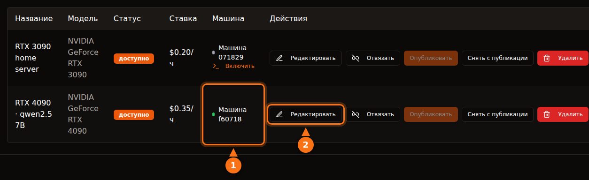

Это достаточно безопасно, если выбирать платформу с открытыми глазами, но «безопасно» на разных платформах означает разное. На контейнерных платформах вроде Vast.ai арендатор запускает на вашей машине собственный код, а его трафик уходит с вашего IP-адреса; изоляция не пускает его к вашим файлам, но не ограждает вашу сеть и ваш счёт за электричество. В архитектуре только с API, как у GPUFlow, арендатор может лишь отправлять чат-запросы к установленным вами моделям, и риск разворачивается в обратную сторону: промпты читаются на вашей машине, так что арендаторам не стоит отправлять ничего секретного.

В этой статье разобраны оба направления. Утверждения о сторонних платформах проверены по их собственной документации в сентябре 2026 года, а всё о GPUFlow взято из его исходного кода и документации. Источники — в конце.

## Что арендатор может делать на контейнерной платформе

Большинство маркетплейсов GPU сдают в аренду контейнер. Арендатор выбирает образ, получает командную оболочку и запускает что хочет. Вам как хосту это даёт пять поводов задуматься.

- **Произвольный код.** Код арендатора работает на вашем ядре, внутри контейнера или ВМ. Изоляция хорошая, но не идеальная; побеги из контейнера случаются редко, и это именно тот класс ошибок, который закрывают обновления ядра и драйверов — а их нужно устанавливать.
- **Ваш IP-адрес.** Исходящий трафик контейнера уходит через ваше интернет-подключение. Если арендатор парсит сайт, рассылает спам или сканирует интернет, жалоба на злоупотребление придёт вашему провайдеру интернета — на ваш IP. В условиях Vast.ai сказано, что пользователи возмещают провайдерам ущерб по претензиям, связанным с пользовательским контентом. Это помогает в споре с третьей стороной, но никак не мешает интернет-провайдеру прислать вам предупреждение.
- **Открытые порты.** В руководстве Vast.ai для хостов сказано: «Для большинства задач клиентам нужны открытые порты, чтобы напрямую подключаться к машине». Значит, вам придётся пробросить порты на роутере.
- **Диск.** Арендаторы скачивают на ваши диски образы, модели и датасеты. Vast.ai освобождает место, когда клиент удаляет том, но пока аренда идёт, это место принадлежит ему.
- **Электричество, нагрев и драйверы.** Vast.ai предупреждает хостов: «Рассчитывайте, что на время аренды GPU будет загружен почти на максимум». Это часы работы на полной мощности платы, тепло в комнате и крутящиеся вентиляторы. Контейнерным платформам ещё и нужна особая настройка: в руководстве Vast.ai перечислены установка Ubuntu, разметка дисков, установка драйверов NVIDIA и открытие портов на роутере.

## Как Vast.ai, Salad и RunPod изолируют арендаторов

| | Vast.ai | Salad | RunPod Community Cloud |
| --- | --- | --- | --- |
| **Что получает арендатор** | Контейнер (или ВМ) с SSH или Jupyter | Развёрнутый им контейнер; SSH и веб-терминал внутрь него | Под (контейнер) |
| **Изоляция** | Непривилегированные Docker-контейнеры | ВМ Linux на гипервизоре, внутри — контейнер | «Собственный контейнер со строгим разделением» |
| **Входящие порты** | Нужны для большинства задач | По умолчанию заблокированы | Не указано |
| **Новые хосты** | Принимаются, на Ubuntu | Принимаются, на Windows 10/11 | Больше не принимаются |

- **Vast.ai** пишет: «Клиенты изолированы в непривилегированных Docker-контейнерах и имеют доступ только к своим данным», с отдельными пространствами имён и cgroups, изоляцией сети, файловой системы и процессов. Там же арендаторов предупреждают, что «уровень безопасности у провайдеров сильно различается», а для чувствительных задач советуют уровень Secure Cloud с сертифицированными дата-центрами.
- **Salad** пишет: «Ваша нагрузка работает в OCI-совместимом контейнере внутри виртуальной машины Linux, изолированной от Windows и всех остальных процессов на хосте», а входящие соединения по умолчанию заблокированы. Арендаторов Salad защищает и от хостов: если хост «пытается получить доступ к среде Linux, мы автоматически уничтожаем среду и вносим машину в чёрный список». Отдельно Salad предлагает необязательные задачи с раздачей трафика, которые через ваше подключение «обрабатывают видеоконтент с премиальных стриминговых платформ»; на странице поддержки предупреждают, что это увеличивает расход трафика и может привести к «редкому временному (обычно на 1–2 дня) ограничению контента на этих стриминговых платформах».
- **RunPod** пишет: «Runpod больше не принимает новых хостов в Community Cloud». Для уже подключённых мощностей: «Каждый под или воркер работает в собственном контейнере», а условия RunPod «запрещают хостам просматривать данные вашего пода или воркера».

Все три платформы изолируют арендатора от вашей системы. Ни одна не может помешать вполне легитимному на вид трафику арендатора уходить через ваше подключение — и ни одна этого не обещает.

## Чем отличается архитектура GPUFlow

GPUFlow сдаёт в аренду не машину, а модель ИИ за OpenAI-совместимым API. От этого меняется то, до чего может дотянуться арендатор. Вот что делает код.

**Агент.** Установщик кладёт один бинарный файл на Go в `/usr/local/bin/gpuflow-agent` и запускает его как службу systemd. Docker не используется. В юните службы заданы `DynamicUser=yes` (временный непривилегированный пользователь), `NoNewPrivileges=yes` (повысить права нельзя), `ProtectSystem=strict` (система для него только для чтения), `ProtectHome=yes` (домашние папки не видны) и `PrivateTmp=yes`. Движок инференса по умолчанию — Ollama; её ставит собственный установщик Ollama как отдельную службу (вместо неё провайдер может направить агент на свой OpenAI-совместимый сервер). Эти ограничения относятся к агенту, а не к Ollama.

**Сеть.** Агент устанавливает только исходящие соединения: WebSocket поверх TLS к `wss://ws.gpuflow.app` и HTTPS к `gpuflow.app` для регистрации и отправки heartbeat-сигнала каждые 15 секунд. Он не открывает портов, вы ничего не пробрасываете на роутере, и арендаторы никогда не узнают ваш IP-адрес. С Ollama агент общается по адресу `127.0.0.1:11434` — это стандартный loopback-адрес Ollama.

**Что могут вызывать арендаторы.** Арендатор получает API-ключ для `https://gpuflow.app/v1`. На `GET /v1/models` GPUFlow отвечает сам, а единственный запрос, который он передаёт на вашу машину, — `POST /v1/chat/completions`. У агента есть и собственный замок: он проксирует только четыре точных пути (`/v1/chat/completions`, `/v1/completions`, `/v1/embeddings` и `/v1/models`) и отклоняет всё остальное, включая родные эндпоинты Ollama `/api/*`, через которые можно скачивать, удалять или создавать модели. Агент обрабатывает сообщения только одного типа — запрос на инференс; всё остальное игнорируется.

Итак, у арендатора нет ни командной оболочки, ни SSH, ни файлов, ни сетевого доступа к вашей машине. Он не может скачать на ваш диск модель на 70 ГБ и не может выходить в интернет через ваше подключение. Он может загружать ваш GPU на все забронированные часы и указать в поле `model` любую установленную у вас модель.

<figure>
<svg viewBox="0 0 720 380" role="img" aria-labelledby="d1-title" xmlns="http://www.w3.org/2000/svg" font-family="system-ui, sans-serif" font-size="15">
<title id="d1-title">Что арендатор может делать на контейнерном хосте и в архитектуре только с API, как у GPUFlow</title>
<rect x="0" y="0" width="720" height="380" fill="#ffffff"/>
<text x="20" y="40" fill="#64748b" font-weight="bold">Что может арендатор</text>
<text x="470" y="40" text-anchor="middle" fill="#1e1b4b" font-weight="bold">Контейнерный хост</text>
<text x="630" y="40" text-anchor="middle" fill="#1e1b4b" font-weight="bold">GPUFlow (API)</text>
<line x1="20" y1="55" x2="700" y2="55" stroke="#e2e8f0" stroke-width="2"/>
<text x="20" y="89" fill="#1e1b4b">Запускать свои программы</text>
<rect x="430" y="70" width="80" height="28" rx="14" fill="#fff7ed" stroke="#f97316" stroke-width="2"/>
<text x="470" y="89" text-anchor="middle" fill="#1e1b4b">Да</text>
<rect x="590" y="70" width="80" height="28" rx="14" fill="#f0fdf4" stroke="#16a34a" stroke-width="2"/>
<text x="630" y="89" text-anchor="middle" fill="#1e1b4b">Нет</text>
<line x1="20" y1="110" x2="700" y2="110" stroke="#e2e8f0" stroke-width="1"/>
<text x="20" y="133" fill="#1e1b4b">Открыть командную оболочку или SSH</text>
<rect x="430" y="114" width="80" height="28" rx="14" fill="#fff7ed" stroke="#f97316" stroke-width="2"/>
<text x="470" y="133" text-anchor="middle" fill="#1e1b4b">Да</text>
<rect x="590" y="114" width="80" height="28" rx="14" fill="#f0fdf4" stroke="#16a34a" stroke-width="2"/>
<text x="630" y="133" text-anchor="middle" fill="#1e1b4b">Нет</text>
<line x1="20" y1="154" x2="700" y2="154" stroke="#e2e8f0" stroke-width="1"/>
<text x="20" y="177" fill="#1e1b4b">Записывать файлы на ваш диск</text>
<rect x="430" y="158" width="80" height="28" rx="14" fill="#fff7ed" stroke="#f97316" stroke-width="2"/>
<text x="470" y="177" text-anchor="middle" fill="#1e1b4b">Да</text>
<rect x="590" y="158" width="80" height="28" rx="14" fill="#f0fdf4" stroke="#16a34a" stroke-width="2"/>
<text x="630" y="177" text-anchor="middle" fill="#1e1b4b">Нет</text>
<line x1="20" y1="198" x2="700" y2="198" stroke="#e2e8f0" stroke-width="1"/>
<text x="20" y="221" fill="#1e1b4b">Отправлять трафик с вашего IP</text>
<rect x="430" y="202" width="80" height="28" rx="14" fill="#fff7ed" stroke="#f97316" stroke-width="2"/>
<text x="470" y="221" text-anchor="middle" fill="#1e1b4b">Да</text>
<rect x="590" y="202" width="80" height="28" rx="14" fill="#f0fdf4" stroke="#16a34a" stroke-width="2"/>
<text x="630" y="221" text-anchor="middle" fill="#1e1b4b">Нет</text>
<line x1="20" y1="242" x2="700" y2="242" stroke="#e2e8f0" stroke-width="1"/>
<text x="20" y="265" fill="#1e1b4b">Требовать открытых портов на роутере</text>
<rect x="430" y="246" width="80" height="28" rx="14" fill="#fff7ed" stroke="#f97316" stroke-width="2"/>
<text x="470" y="265" text-anchor="middle" fill="#1e1b4b">Часто</text>
<rect x="590" y="246" width="80" height="28" rx="14" fill="#f0fdf4" stroke="#16a34a" stroke-width="2"/>
<text x="630" y="265" text-anchor="middle" fill="#1e1b4b">Нет</text>
<line x1="20" y1="286" x2="700" y2="286" stroke="#e2e8f0" stroke-width="1"/>
<text x="20" y="309" fill="#1e1b4b">Скачивать или удалять модели</text>
<rect x="430" y="290" width="80" height="28" rx="14" fill="#fff7ed" stroke="#f97316" stroke-width="2"/>
<text x="470" y="309" text-anchor="middle" fill="#1e1b4b">Да</text>
<rect x="590" y="290" width="80" height="28" rx="14" fill="#f0fdf4" stroke="#16a34a" stroke-width="2"/>
<text x="630" y="309" text-anchor="middle" fill="#1e1b4b">Нет</text>
<line x1="20" y1="330" x2="700" y2="330" stroke="#e2e8f0" stroke-width="1"/>
<text x="20" y="353" fill="#1e1b4b">Часами загружать ваш GPU</text>
<rect x="430" y="334" width="80" height="28" rx="14" fill="#eef2ff" stroke="#6366f1" stroke-width="2"/>
<text x="470" y="353" text-anchor="middle" fill="#1e1b4b">Да</text>
<rect x="590" y="334" width="80" height="28" rx="14" fill="#eef2ff" stroke="#6366f1" stroke-width="2"/>
<text x="630" y="353" text-anchor="middle" fill="#1e1b4b">Да</text>
</svg>
<figcaption>Столбец с контейнерами описывает хостинг в стиле Vast.ai: файлы и трафик остаются внутри контейнера арендатора, но используют ваш диск и ваше подключение. Детали различаются: Salad запускает контейнеры в ВМ Linux и по умолчанию блокирует входящие соединения. На GPUFlow арендатор только отправляет чат-запросы к установленным вами моделям.</figcaption>
</figure>

## Путь данных, шаг за шагом

Эту часть стоит прочитать арендаторам. Чат-запрос проходит через четыре программы, и текст можно прочитать не в одной из них.

<figure>
<svg viewBox="0 0 720 330" role="img" aria-labelledby="d2-title" xmlns="http://www.w3.org/2000/svg" font-family="system-ui, sans-serif" font-size="15">
<title id="d2-title">Чат-запрос GPUFlow идёт из приложения арендатора в gpuflow.app, через ретранслятор к агенту на ПК провайдера и в Ollama, а ответ возвращается потоком тем же путём</title>
<rect x="0" y="0" width="720" height="330" fill="#ffffff"/>
<rect x="480" y="50" width="230" height="200" rx="12" fill="#fff7ed" stroke="#f97316" stroke-width="2" stroke-dasharray="6 4"/>
<text x="595" y="76" text-anchor="middle" fill="#1e1b4b" font-weight="bold">ПК провайдера</text>
<rect x="10" y="110" width="110" height="70" rx="10" fill="#eef2ff" stroke="#6366f1" stroke-width="2"/>
<text x="65" y="141" text-anchor="middle" fill="#1e1b4b">Приложение</text>
<text x="65" y="161" text-anchor="middle" fill="#1e1b4b">арендатора</text>
<rect x="160" y="110" width="120" height="70" rx="10" fill="#eef2ff" stroke="#6366f1" stroke-width="2"/>
<text x="220" y="141" text-anchor="middle" fill="#1e1b4b">API GPUFlow</text>
<text x="220" y="161" text-anchor="middle" fill="#64748b" font-size="12">gpuflow.app/v1</text>
<rect x="320" y="110" width="105" height="70" rx="10" fill="#eef2ff" stroke="#6366f1" stroke-width="2"/>
<text x="372" y="141" text-anchor="middle" fill="#1e1b4b" font-size="13">Ретранслятор</text>
<text x="372" y="161" text-anchor="middle" fill="#64748b" font-size="12">ws.gpuflow.app</text>
<rect x="492" y="110" width="90" height="70" rx="10" fill="#ffffff" stroke="#6366f1" stroke-width="2"/>
<text x="537" y="141" text-anchor="middle" fill="#1e1b4b">Агент</text>
<text x="537" y="161" text-anchor="middle" fill="#1e1b4b">GPUFlow</text>
<rect x="610" y="110" width="90" height="70" rx="10" fill="#ffffff" stroke="#6366f1" stroke-width="2"/>
<text x="655" y="141" text-anchor="middle" fill="#1e1b4b">Ollama</text>
<text x="655" y="161" text-anchor="middle" fill="#64748b" font-size="12">127.0.0.1</text>
<line x1="124" y1="145" x2="156" y2="145" stroke="#16a34a" stroke-width="4"/>
<line x1="284" y1="145" x2="316" y2="145" stroke="#64748b" stroke-width="4"/>
<line x1="429" y1="145" x2="488" y2="145" stroke="#16a34a" stroke-width="4"/>
<line x1="586" y1="145" x2="606" y2="145" stroke="#f97316" stroke-width="4"/>
<text x="140" y="102" text-anchor="middle" fill="#16a34a" font-size="13">TLS</text>
<text x="300" y="102" text-anchor="middle" fill="#64748b" font-size="13">внутри</text>
<text x="452" y="102" text-anchor="middle" fill="#16a34a" font-size="13">TLS</text>
<text x="596" y="102" text-anchor="middle" fill="#f97316" font-size="13">открыто</text>
<text x="65" y="212" text-anchor="middle" fill="#64748b" font-size="12">Здесь пишется</text>
<text x="65" y="228" text-anchor="middle" fill="#64748b" font-size="12">текст</text>
<text x="220" y="212" text-anchor="middle" fill="#64748b" font-size="12">Читает текст,</text>
<text x="220" y="228" text-anchor="middle" fill="#64748b" font-size="12">хранит только</text>
<text x="220" y="244" text-anchor="middle" fill="#64748b" font-size="12">число токенов</text>
<text x="372" y="212" text-anchor="middle" fill="#64748b" font-size="12">Передаёт дальше,</text>
<text x="372" y="228" text-anchor="middle" fill="#64748b" font-size="12">не логирует</text>
<text x="372" y="244" text-anchor="middle" fill="#64748b" font-size="12">содержимое</text>
<text x="595" y="212" text-anchor="middle" fill="#1e1b4b" font-size="13" font-weight="bold">Открытый текст в памяти</text>
<text x="595" y="230" text-anchor="middle" fill="#1e1b4b" font-size="13" font-weight="bold">У владельца есть root</text>
<line x1="20" y1="295" x2="50" y2="295" stroke="#16a34a" stroke-width="4"/>
<text x="58" y="300" fill="#1e1b4b" font-size="13">TLS через интернет</text>
<line x1="235" y1="295" x2="265" y2="295" stroke="#64748b" stroke-width="4"/>
<text x="273" y="300" fill="#1e1b4b" font-size="13">внутри GPUFlow</text>
<line x1="420" y1="295" x2="450" y2="295" stroke="#f97316" stroke-width="4"/>
<text x="458" y="300" fill="#1e1b4b" font-size="13">открытый текст на ПК провайдера</text>
</svg>
<figcaption>Запрос идёт слева направо, а ответ возвращается потоком тем же путём. TLS защищает каждый участок, проходящий через интернет, но заканчивается на каждом сервере, поэтому текст читается на серверах GPUFlow, пока они его пересылают, и на ПК провайдера, где Ollama запускает модель.</figcaption>
</figure>

1. **Арендатор → gpuflow.app:** HTTPS. Сайт работает за Cloudflare.
2. **API GPUFlow → ретранслятор:** внутреннее соединение на стороне GPUFlow. API проверяет ключ, пересылает тело запроса без изменений и записывает число токенов. Текст запросов и ответов он не хранит, и это прямо сказано в политике конфиденциальности.
3. **Ретранслятор → агент провайдера:** WebSocket поверх TLS, который открыл сам агент. Ретранслятор логирует тип каждого сообщения, но не его содержимое.
4. **Агент → Ollama:** обычный HTTP по loopback-адресу внутри ПК провайдера. Агент тоже не логирует тела запросов.

Сквозного шифрования до модели нет, и с обычным движком инференса его быть не может: чтобы ответить на промпт, модель должна его прочитать.

## Что видит провайдер

Скажем прямо: **компьютер провайдера обрабатывает ваши промпты и ответы в открытом виде.** Там работает Ollama, и у провайдера есть root на машине (без него установщик не запустится). Провайдер при желании может перехватить трафик на loopback-интерфейсе, подменить движок или направить агент на другой сервер.

Мешает этому договор. В условиях GPUFlow сказано, что провайдеры «не должны записывать, читать, хранить или передавать запросы или ответы арендаторов, а также изменять ответы». Это правило с последствиями для аккаунта, а не техническая блокировка. Политика конфиденциальности говорит арендаторам то же самое: пока идёт аренда, запросы и ответы проходят через компьютер провайдера.

Помимо промптов, провайдер видит ваше имя пользователя GPUFlow и получает уведомление о начале аренды (идентификатор аренды, объявление и число часов). Арендаторы ничего не видят из статистики машины провайдера: температура GPU, VRAM, потребляемая мощность и другая телеметрия попадают только в панель управления владельца.

Практическое правило для арендаторов: **не отправляйте через какой бы то ни было общественный GPU секреты, учётные данные, персональные данные других людей или регулируемые данные (медицинские, финансовые, конфиденциальные данные клиентов).** Это касается GPUFlow и в той же мере контейнера на чужом домашнем ПК, где хост с тем же root-доступом может просмотреть память и диск. Чувствительные задачи запускайте на железе, которое контролируете сами, или у провайдера, который подпишет нужное вашему комплаенсу соглашение. Про политику компаний — в статье [почему компании запрещают публичные ИИ-инструменты](/ru/why-corporate-policies-banning-chatgpt/), про контейнеры — в статье [как защитить датасет на публичном GPU-сервере](/ru/how-to-secure-dataset-on-public-gpu-node/).

## Какие риски остаются на GPUFlow

Архитектура только с API сокращает поверхность атаки, но не убирает её. Я лучше перечислю, что осталось, чем буду делать вид, что ничего.

- **Ollama разбирает недоверенный ввод.** Каждый запрос арендатора в итоге превращается в JSON, который получает Ollama. Ошибка в Ollama — самый вероятный путь внутрь, так что обновляйте её. Список разрешённых путей в агенте не пускает арендаторов к эндпоинтам Ollama для управления моделями, но ошибку в пути чата он не исправит.
- **Установщик работает от root.** Вы передаёте скрипт с gpuflow.app в `sudo bash`, и он же запускает установочный скрипт Ollama. Сначала прочитайте оба; это правильная привычка для любого софта для хостинга.
- **Нет автообновления.** Агент не обновляется сам. Чтобы получить новую версию, запустите установщик заново; он сверяет бинарный файл с файлом SHA256SUMS, если тот опубликован.
- **Нагрузка.** Ограничения на число запросов нет. Арендатор может держать ваш GPU под полной нагрузкой все забронированные часы и использовать любую установленную у вас модель, включая самую большую.
- **Нагрев и электричество.** Как и везде: оплаченные часы — это часы под нагрузкой.

## Чек-лист для провайдеров

1. **Используйте машину, которую не жалко одолжить.** В идеале — отдельный компьютер. Как минимум не храните рабочие файлы и менеджеры паролей на компьютере, который сдаёте, на какой бы платформе вы ни работали. На GPUFlow агент и так работает от временного системного пользователя без доступа к домашним папкам, но Ollama — это отдельная служба.
2. **Ограничьте мощность.** `sudo nvidia-smi -pl 280` задаёт ограничение мощности платы в ваттах (нужен root, а значение должно быть между минимальным и максимальным пределами карты). Puget Systems пишет, что RTX 3090 с ограничением 270–280 Вт сохраняют около 95% производительности, и показывает, как применять ограничение при каждой загрузке с помощью юнита systemd.
3. **Сначала посчитайте электричество.** Посмотрите потребляемую мощность на странице **Мои машины**, пока GPU занят, и умножьте киловатты на цену за кВт·ч. В статье [сколько может заработать ваша игровая видеокарта](/ru/how-much-can-you-earn-renting-out-your-gpu/) это посчитано для популярных карт и пяти стран.
4. **Следите за температурой.** В живой статистике видны температуры GPU, хотспота и памяти, а также скорость вентиляторов. Убедитесь, что корпус хорошо продувается.
5. **Обновляйте систему.** Устанавливайте обновления Linux, драйвера GPU и Ollama. Установщик GPUFlow драйвером GPU не управляет; после перезагрузки systemd сам перезапускает агент.
6. **Знайте, как поставить на паузу.** Снимите объявление с публикации на странице **Мои GPU** или выполните `sudo systemctl stop gpuflow-agent` (`start` вернёт всё обратно). Пока идёт аренда, панель управления не даст изменить объявление или машину, и завершить аренду арендатора оттуда нельзя. Если остановить агент посреди аренды, аренда завершится через 10 минут, и вы получите оплату только до последнего heartbeat-сигнала.
7. **Знайте, как удалить.** Шаги описаны в [документации по устранению неполадок](https://docs.gpuflow.app/ru/providers/troubleshooting/). Ollama остаётся установленной, пока вы её не удалите.

На контейнерных платформах добавьте ещё два пункта: решите, действительно ли вы хотите открытые порты на роутере, и узнайте у интернет-провайдера, что он делает с жалобами на злоупотребления, потому что трафик арендаторов будет идти с вашего IP-адреса.

## Чек-лист для арендаторов

1. **Считайте любой общественный GPU чужим компьютером.** Никаких API-ключей, паролей, данных клиентов, медицинских или финансовых данных в промптах.
2. **Убирайте лишнее.** Перед отправкой заменяйте имена и номера счетов заглушками.
3. **Берегите ключ.** На GPUFlow ключ перестаёт работать, когда аренда заканчивается. Если он утёк, **Новый ключ** сразу отзывает старый, а **Завершить сейчас** останавливает оплату и возвращает неиспользованное время.
4. **Исходите из того, что ответы могут быть неверными или изменёнными.** Условия запрещают провайдерам менять ответы, но всё важное перепроверяйте.
5. **Для чувствительных задач выбирайте подходящий инструмент.** Разверните модель у себя или работайте с провайдером, который предлагает нужный вам договор. Для всего остального — [как использовать ключ в своих приложениях](/ru/use-openai-compatible-api-key-in-apps/).

## Источники

Всё проверено в сентябре 2026 года.

- GPUFlow: [к чему у арендаторов есть доступ](https://docs.gpuflow.app/ru/providers/security/), [начало работы для провайдеров](https://docs.gpuflow.app/ru/providers/getting-started/), [цены и электричество](https://docs.gpuflow.app/ru/providers/pricing/), [устранение неполадок и удаление](https://docs.gpuflow.app/ru/providers/troubleshooting/), [быстрый старт с API](https://docs.gpuflow.app/ru/renters/api-quickstart/)
- Vast.ai: [обзор хостинга](https://docs.vast.ai/host/hosting-overview.md), [FAQ по безопасности](https://docs.vast.ai/documentation/reference/faq/security), [виртуальные машины Linux](https://docs.vast.ai/linux-virtual-machines), [условия обслуживания](https://vast.ai/terms), [запуск приватных моделей ИИ](https://vast.ai/article/running-private-ai-models-without-the-risk-of-data-exposure)
- Salad: [безопасность](https://salad.com/security), [контейнерные нагрузки и ваш ПК](https://community.salad.com/container-workloads-and-your-pc/), [раздача трафика](https://support.salad.com/faq/jobs/what-is-bandwidth-sharing/), [SSH и терминал](https://docs.salad.com/container-engine/explanation/container-groups/ssh-and-terminal.md), [загрузка и системные требования](https://salad.com/download/)
- RunPod: [выбор пода](https://docs.runpod.io/pods/choose-a-pod), [безопасность данных и соответствие законодательству](https://docs.runpod.io/hosting/partner-requirements)
- Ollama: [FAQ (адрес привязки по умолчанию)](https://docs.ollama.com/faq)
- NVIDIA: [руководство по nvidia-smi](https://docs.nvidia.com/deploy/nvidia-smi/index.html)
- Puget Systems: [ограничение мощности RTX 3090 с помощью systemd и nvidia-smi](https://www.pugetsystems.com/labs/hpc/quad-rtx3090-gpu-power-limiting-with-systemd-and-nvidia-smi-1983/)
