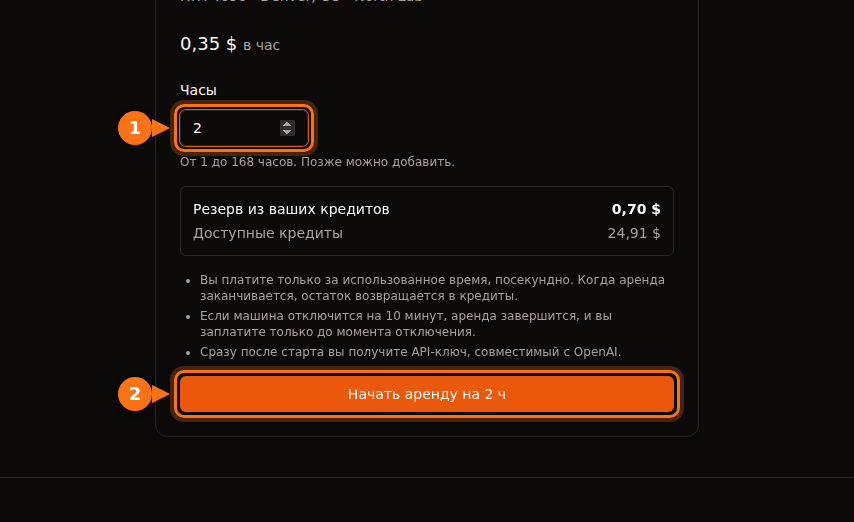

При $0,40 в час 90-секундный тестовый прогон стоит 1¢ при посекундной оплате с минимумом 60 секунд, 1,3¢ при поминутной и 40¢ при оплате полными часами. Для коротких задач вся история — в этой разнице в 40 раз. Как только задача длится дольше нескольких минут, посекундная и поминутная оплата расходятся меньше чем на цент, и итог счёта определяют простой, время на подготовку и хранение данных.

Ниже — опубликованные правила каждой платформы, примеры с расчётами, график в масштабе и то, как модель GPUFlow «сначала резерв, потом возврат» превращается в итоговое списание. Правила и цены актуальны на сентябрь 2026 года, источники — в конце.

## Три способа считать время GPU

У любой аренды GPU есть цена за час. Разница в том, как использованное время превращается в оплачиваемое, прежде чем его умножат на эту цену.

- **Посекундно с минимумом.** Считаются секунды. Если в сумме их меньше минимума (обычно 60 секунд), оплачивается минимум. Стоимость = max(60, секунды) × цена за час / 3600.
- **Поминутно.** Считаются минуты. С неполной минутой платформы поступают по-разному: одни округляют вверх, Azure её отбрасывает. В примерах ниже я округляю вверх — это худший для вас вариант. Стоимость = минуты × цена за час / 60.
- **Полными часами.** Любой начатый час считается целым. Задача на 61 минуту — это два часа. Стоимость = ceil(секунды / 3600) × цена за час.

Минимум важнее, чем обычно думают. Посекундная оплата с минимумом 60 секунд и поминутная оплата для всего, что короче минуты, дают одно и то же. Шаг тарификации влияет только на остаток в конце задачи, поэтому он никогда не обойдётся вам дороже одного шага на сессию: чуть меньше 40¢ на сессию при почасовой оплате по $0,40 и меньше 0,7¢ на сессию при поминутной оплате по той же цене (59 секунд × 40 / 3600 = 0,66¢).

## Как тарифицирует каждая платформа

Это опубликованные правила для инстансов по требованию, сверенные с документацией каждого поставщика в сентябре 2026 года.

| Платформа | Шаг | Минимум | Что сказано в документации |
| --- | --- | --- | --- |
| AWS EC2 On-Demand | Секунда | 60 секунд | Относится к Linux, Windows, RHEL и Ubuntu Pro. SUSE Linux Enterprise Server оплачивается полными часами. |
| Google Cloud Compute Engine | Секунда | 1 минута | «Все vCPU, GPU и ГБ памяти оплачиваются минимум за 1 минуту». |
| Azure Virtual Machines | Минута | Не указан | Оплачивается «число полных минут»; ВМ, проработавшая 6 мин 45 с, оплачивается как 6 минут. |
| Lambda (облако по требованию) | Минута | Не указан | Оплата «с шагом в одну минуту» с момента, когда инстанс проходит проверки работоспособности, и до его удаления. |
| RunPod Pods | Секунда | Не указан | И вычисления, и хранилище оплачиваются посекундно. |
| Vast.ai | Секунда | Не указан | Активная аренда оплачивается каждую секунду; хранилище — каждую секунду существования инстанса, если он не офлайн. |
| GPUFlow | Секунда | 60 секунд | Целые секунды, с округлением вверх до цента, не больше зарезервированной суммы. |

Два замечания к таблице. Azure на самом деле округляет вниз: в его FAQ сказано, что «лишние секунды не оплачиваются». В документации Lambda говорится о шаге в одну минуту, но не сказано, куда округляется неполная минута, поэтому я не стал предполагать ни то ни другое. А «не указан» означает ровно это: в прочитанной мной документации минимум не назван, что не то же самое, что задокументированный ноль.

Ни одна из этих платформ не округляет вычисления на GPU до полного часа для перечисленных типов инстансов. Но почасовое округление всё ещё встречается в мелком шрифте, как с SUSE на AWS, так что загляните на страницу тарификации, прежде чем запускать много коротких задач на новом месте.

## Пять задач по $0,40 в час

Возьмём одну цену — $0,40 в час — и применим её к задачам пяти разных длин. Это 40¢ за 3600 секунд, или 1/90 цента в секунду.

**90-секундный тест.** Посекундно: 90 × 40 / 3600 = 1,0¢. Поминутно: 2 минуты × 40 / 60 = 1,33¢. Полными часами: 40¢. Почасовой счёт в 40 раз больше посекундного.

**7 минут 30 секунд.** Посекундно: 450 × 40 / 3600 = 5,0¢. Поминутно: 8 минут × 40 / 60 = 5,33¢. Полными часами: 40¢, в 8 раз больше.

**38 минут 20 секунд.** Посекундно: 2300 × 40 / 3600 = 25,56¢. Поминутно: 39 минут × 40 / 60 = 26,0¢. Полными часами: 40¢, примерно в 1,57 раза больше.

**61 минута.** Посекундно: 3660 × 40 / 3600 = 40,67¢. Поминутно: 61 × 40 / 60 = 40,67¢ (задача заканчивается ровно на целой минуте, поэтому результаты совпадают). Полными часами: два часа, 80¢. Одна лишняя минута почти удваивает почасовой счёт.

| Длительность задачи | Посекундно (мин. 60 с) | Поминутно (округление вверх) | Полными часами | Списание на GPUFlow |
| --- | --- | --- | --- | --- |
| 1 мин 30 с | 1,00¢ | 1,33¢ | 40¢ | 1¢ |
| 7 мин 30 с | 5,00¢ | 5,33¢ | 40¢ | 5¢ |
| 38 мин 20 с | 25,56¢ | 26,00¢ | 40¢ | 26¢ |
| 61 мин | 40,67¢ | 40,67¢ | 80¢ | 41¢ |
| 20 задач по 2 мин 30 с | 33,33¢ | 40,00¢ | $8,00 | 40¢ (20 аренд) |

Столбец GPUFlow — это посекундный результат, округлённый вверх до целого цента для каждой аренды; именно так работает его код тарификации. Последняя строка разобрана двумя разделами ниже.

## Стоимость в зависимости от длины задачи, в масштабе

Первый график охватывает от 0 до 150 минут. Поминутная лестница состоит из ступенек шириной 1 минута и высотой 0,67¢, так что в этом масштабе она лежит прямо на посекундной линии. Важна лестница почасовой оплаты: она прыгает на 40¢ на отметках 0, 60 и 120 минут.

<figure>
<svg viewBox="0 0 720 400" role="img" aria-labelledby="d1-title" xmlns="http://www.w3.org/2000/svg" font-family="system-ui, sans-serif" font-size="15">
<title id="d1-title">Стоимость одной задачи по 0.40 доллара в час на отрезке от 0 до 150 минут при посекундной, поминутной и почасовой оплате</title>
<rect x="0" y="0" width="720" height="400" fill="#ffffff"/>
<line x1="90" y1="320.0" x2="690" y2="320.0" stroke="#e2e8f0" stroke-width="1"/>
<text x="82" y="325.0" text-anchor="end" fill="#64748b" font-size="13">$0.00</text>
<line x1="90" y1="275.0" x2="690" y2="275.0" stroke="#e2e8f0" stroke-width="1"/>
<text x="82" y="280.0" text-anchor="end" fill="#64748b" font-size="13">$0.20</text>
<line x1="90" y1="230.0" x2="690" y2="230.0" stroke="#e2e8f0" stroke-width="1"/>
<text x="82" y="235.0" text-anchor="end" fill="#64748b" font-size="13">$0.40</text>
<line x1="90" y1="185.0" x2="690" y2="185.0" stroke="#e2e8f0" stroke-width="1"/>
<text x="82" y="190.0" text-anchor="end" fill="#64748b" font-size="13">$0.60</text>
<line x1="90" y1="140.0" x2="690" y2="140.0" stroke="#e2e8f0" stroke-width="1"/>
<text x="82" y="145.0" text-anchor="end" fill="#64748b" font-size="13">$0.80</text>
<line x1="90" y1="95.0" x2="690" y2="95.0" stroke="#e2e8f0" stroke-width="1"/>
<text x="82" y="100.0" text-anchor="end" fill="#64748b" font-size="13">$1.00</text>
<line x1="90" y1="50.0" x2="690" y2="50.0" stroke="#e2e8f0" stroke-width="1"/>
<text x="82" y="55.0" text-anchor="end" fill="#64748b" font-size="13">$1.20</text>
<line x1="90.0" y1="320" x2="90.0" y2="325" stroke="#64748b" stroke-width="1"/>
<text x="90.0" y="342" text-anchor="middle" fill="#64748b" font-size="13">0</text>
<line x1="210.0" y1="320" x2="210.0" y2="325" stroke="#64748b" stroke-width="1"/>
<text x="210.0" y="342" text-anchor="middle" fill="#64748b" font-size="13">30</text>
<line x1="330.0" y1="320" x2="330.0" y2="325" stroke="#64748b" stroke-width="1"/>
<text x="330.0" y="342" text-anchor="middle" fill="#64748b" font-size="13">60</text>
<line x1="450.0" y1="320" x2="450.0" y2="325" stroke="#64748b" stroke-width="1"/>
<text x="450.0" y="342" text-anchor="middle" fill="#64748b" font-size="13">90</text>
<line x1="570.0" y1="320" x2="570.0" y2="325" stroke="#64748b" stroke-width="1"/>
<text x="570.0" y="342" text-anchor="middle" fill="#64748b" font-size="13">120</text>
<line x1="690.0" y1="320" x2="690.0" y2="325" stroke="#64748b" stroke-width="1"/>
<text x="690.0" y="342" text-anchor="middle" fill="#64748b" font-size="13">150</text>
<line x1="90" y1="320" x2="690" y2="320" stroke="#64748b" stroke-width="1.5"/>
<line x1="90" y1="50" x2="90" y2="320" stroke="#64748b" stroke-width="1.5"/>
<text x="390.0" y="365" text-anchor="middle" fill="#1e1b4b">Длительность задачи (минуты)</text>
<text x="22" y="185.0" text-anchor="middle" fill="#1e1b4b" transform="rotate(-90 22 185.0)">Стоимость при $0.40 в час</text>
<polyline fill="none" stroke="#f97316" stroke-width="3" points="90.0,230.0 330.0,230.0 330.0,140.0 570.0,140.0 570.0,50.0 690.0,50.0"/>
<polyline fill="none" stroke="#16a34a" stroke-width="2.5" stroke-dasharray="6 4" points="90.0,318.5 94.0,318.5 94.0,317.0 98.0,317.0 98.0,315.5 102.0,315.5 102.0,314.0 106.0,314.0 106.0,312.5 110.0,312.5 110.0,311.0 114.0,311.0 114.0,309.5 118.0,309.5 118.0,308.0 122.0,308.0 122.0,306.5 126.0,306.5 126.0,305.0 130.0,305.0 130.0,303.5 134.0,303.5 134.0,302.0 138.0,302.0 138.0,300.5 142.0,300.5 142.0,299.0 146.0,299.0 146.0,297.5 150.0,297.5 150.0,296.0 154.0,296.0 154.0,294.5 158.0,294.5 158.0,293.0 162.0,293.0 162.0,291.5 166.0,291.5 166.0,290.0 170.0,290.0 170.0,288.5 174.0,288.5 174.0,287.0 178.0,287.0 178.0,285.5 182.0,285.5 182.0,284.0 186.0,284.0 186.0,282.5 190.0,282.5 190.0,281.0 194.0,281.0 194.0,279.5 198.0,279.5 198.0,278.0 202.0,278.0 202.0,276.5 206.0,276.5 206.0,275.0 210.0,275.0 210.0,273.5 214.0,273.5 214.0,272.0 218.0,272.0 218.0,270.5 222.0,270.5 222.0,269.0 226.0,269.0 226.0,267.5 230.0,267.5 230.0,266.0 234.0,266.0 234.0,264.5 238.0,264.5 238.0,263.0 242.0,263.0 242.0,261.5 246.0,261.5 246.0,260.0 250.0,260.0 250.0,258.5 254.0,258.5 254.0,257.0 258.0,257.0 258.0,255.5 262.0,255.5 262.0,254.0 266.0,254.0 266.0,252.5 270.0,252.5 270.0,251.0 274.0,251.0 274.0,249.5 278.0,249.5 278.0,248.0 282.0,248.0 282.0,246.5 286.0,246.5 286.0,245.0 290.0,245.0 290.0,243.5 294.0,243.5 294.0,242.0 298.0,242.0 298.0,240.5 302.0,240.5 302.0,239.0 306.0,239.0 306.0,237.5 310.0,237.5 310.0,236.0 314.0,236.0 314.0,234.5 318.0,234.5 318.0,233.0 322.0,233.0 322.0,231.5 326.0,231.5 326.0,230.0 330.0,230.0 330.0,228.5 334.0,228.5 334.0,227.0 338.0,227.0 338.0,225.5 342.0,225.5 342.0,224.0 346.0,224.0 346.0,222.5 350.0,222.5 350.0,221.0 354.0,221.0 354.0,219.5 358.0,219.5 358.0,218.0 362.0,218.0 362.0,216.5 366.0,216.5 366.0,215.0 370.0,215.0 370.0,213.5 374.0,213.5 374.0,212.0 378.0,212.0 378.0,210.5 382.0,210.5 382.0,209.0 386.0,209.0 386.0,207.5 390.0,207.5 390.0,206.0 394.0,206.0 394.0,204.5 398.0,204.5 398.0,203.0 402.0,203.0 402.0,201.5 406.0,201.5 406.0,200.0 410.0,200.0 410.0,198.5 414.0,198.5 414.0,197.0 418.0,197.0 418.0,195.5 422.0,195.5 422.0,194.0 426.0,194.0 426.0,192.5 430.0,192.5 430.0,191.0 434.0,191.0 434.0,189.5 438.0,189.5 438.0,188.0 442.0,188.0 442.0,186.5 446.0,186.5 446.0,185.0 450.0,185.0 450.0,183.5 454.0,183.5 454.0,182.0 458.0,182.0 458.0,180.5 462.0,180.5 462.0,179.0 466.0,179.0 466.0,177.5 470.0,177.5 470.0,176.0 474.0,176.0 474.0,174.5 478.0,174.5 478.0,173.0 482.0,173.0 482.0,171.5 486.0,171.5 486.0,170.0 490.0,170.0 490.0,168.5 494.0,168.5 494.0,167.0 498.0,167.0 498.0,165.5 502.0,165.5 502.0,164.0 506.0,164.0 506.0,162.5 510.0,162.5 510.0,161.0 514.0,161.0 514.0,159.5 518.0,159.5 518.0,158.0 522.0,158.0 522.0,156.5 526.0,156.5 526.0,155.0 530.0,155.0 530.0,153.5 534.0,153.5 534.0,152.0 538.0,152.0 538.0,150.5 542.0,150.5 542.0,149.0 546.0,149.0 546.0,147.5 550.0,147.5 550.0,146.0 554.0,146.0 554.0,144.5 558.0,144.5 558.0,143.0 562.0,143.0 562.0,141.5 566.0,141.5 566.0,140.0 570.0,140.0 570.0,138.5 574.0,138.5 574.0,137.0 578.0,137.0 578.0,135.5 582.0,135.5 582.0,134.0 586.0,134.0 586.0,132.5 590.0,132.5 590.0,131.0 594.0,131.0 594.0,129.5 598.0,129.5 598.0,128.0 602.0,128.0 602.0,126.5 606.0,126.5 606.0,125.0 610.0,125.0 610.0,123.5 614.0,123.5 614.0,122.0 618.0,122.0 618.0,120.5 622.0,120.5 622.0,119.0 626.0,119.0 626.0,117.5 630.0,117.5 630.0,116.0 634.0,116.0 634.0,114.5 638.0,114.5 638.0,113.0 642.0,113.0 642.0,111.5 646.0,111.5 646.0,110.0 650.0,110.0 650.0,108.5 654.0,108.5 654.0,107.0 658.0,107.0 658.0,105.5 662.0,105.5 662.0,104.0 666.0,104.0 666.0,102.5 670.0,102.5 670.0,101.0 674.0,101.0 674.0,99.5 678.0,99.5 678.0,98.0 682.0,98.0 682.0,96.5 686.0,96.5 686.0,95.0 690.0,95.0"/>
<polyline fill="none" stroke="#6366f1" stroke-width="2.5" points="90.0,318.5 94.0,318.5 690.0,95.0"/>
<line x1="110" y1="22" x2="138" y2="22" stroke="#6366f1" stroke-width="3"/><text x="144" y="27" fill="#1e1b4b" font-size="13">Посекундно, мин. 60 s</text>
<line x1="330" y1="22" x2="358" y2="22" stroke="#16a34a" stroke-width="3" stroke-dasharray="6 4"/><text x="364" y="27" fill="#1e1b4b">Поминутно</text>
<line x1="480" y1="22" x2="508" y2="22" stroke="#f97316" stroke-width="3"/><text x="514" y="27" fill="#1e1b4b">Полными часами</text>
</svg>
<figcaption>Стоимость одной задачи при $0,40 в час. Почасовая оплата (оранжевая линия) списывает всю ступеньку в 40¢ в момент, когда начинается новый час; посекундная и поминутная оплата идут почти одной линией.</figcaption>
</figure>

Расстояние между оранжевой лестницей и синей линией — это то, во что обходится почасовое округление на одной задаче: больше всего сразу после каждой ступеньки и ноль на целых часах.

Если увеличить первые десять минут, у поминутной оплаты становятся видны ступеньки, а минимум 60 секунд виден как ровное начало посекундной линии. Почасовая оплата здесь была бы ровной линией на уровне 40¢ — в пять раз выше верхнего края графика.

<figure>
<svg viewBox="0 0 720 400" role="img" aria-labelledby="d2-title" xmlns="http://www.w3.org/2000/svg" font-family="system-ui, sans-serif" font-size="15">
<title id="d2-title">Первые 10 минут при 0.40 доллара в час крупным планом: посекундная и поминутная оплата, почасовая — за пределами шкалы</title>
<rect x="0" y="0" width="720" height="400" fill="#ffffff"/>
<line x1="90" y1="320.0" x2="690" y2="320.0" stroke="#e2e8f0" stroke-width="1"/>
<text x="82" y="325.0" text-anchor="end" fill="#64748b" font-size="13">0¢</text>
<line x1="90" y1="252.5" x2="690" y2="252.5" stroke="#e2e8f0" stroke-width="1"/>
<text x="82" y="257.5" text-anchor="end" fill="#64748b" font-size="13">2¢</text>
<line x1="90" y1="185.0" x2="690" y2="185.0" stroke="#e2e8f0" stroke-width="1"/>
<text x="82" y="190.0" text-anchor="end" fill="#64748b" font-size="13">4¢</text>
<line x1="90" y1="117.5" x2="690" y2="117.5" stroke="#e2e8f0" stroke-width="1"/>
<text x="82" y="122.5" text-anchor="end" fill="#64748b" font-size="13">6¢</text>
<line x1="90" y1="50.0" x2="690" y2="50.0" stroke="#e2e8f0" stroke-width="1"/>
<text x="82" y="55.0" text-anchor="end" fill="#64748b" font-size="13">8¢</text>
<line x1="90.0" y1="320" x2="90.0" y2="325" stroke="#64748b" stroke-width="1"/>
<text x="90.0" y="342" text-anchor="middle" fill="#64748b" font-size="13">0</text>
<line x1="150.0" y1="320" x2="150.0" y2="325" stroke="#64748b" stroke-width="1"/>
<text x="150.0" y="342" text-anchor="middle" fill="#64748b" font-size="13">1</text>
<line x1="210.0" y1="320" x2="210.0" y2="325" stroke="#64748b" stroke-width="1"/>
<text x="210.0" y="342" text-anchor="middle" fill="#64748b" font-size="13">2</text>
<line x1="270.0" y1="320" x2="270.0" y2="325" stroke="#64748b" stroke-width="1"/>
<text x="270.0" y="342" text-anchor="middle" fill="#64748b" font-size="13">3</text>
<line x1="330.0" y1="320" x2="330.0" y2="325" stroke="#64748b" stroke-width="1"/>
<text x="330.0" y="342" text-anchor="middle" fill="#64748b" font-size="13">4</text>
<line x1="390.0" y1="320" x2="390.0" y2="325" stroke="#64748b" stroke-width="1"/>
<text x="390.0" y="342" text-anchor="middle" fill="#64748b" font-size="13">5</text>
<line x1="450.0" y1="320" x2="450.0" y2="325" stroke="#64748b" stroke-width="1"/>
<text x="450.0" y="342" text-anchor="middle" fill="#64748b" font-size="13">6</text>
<line x1="510.0" y1="320" x2="510.0" y2="325" stroke="#64748b" stroke-width="1"/>
<text x="510.0" y="342" text-anchor="middle" fill="#64748b" font-size="13">7</text>
<line x1="570.0" y1="320" x2="570.0" y2="325" stroke="#64748b" stroke-width="1"/>
<text x="570.0" y="342" text-anchor="middle" fill="#64748b" font-size="13">8</text>
<line x1="630.0" y1="320" x2="630.0" y2="325" stroke="#64748b" stroke-width="1"/>
<text x="630.0" y="342" text-anchor="middle" fill="#64748b" font-size="13">9</text>
<line x1="690.0" y1="320" x2="690.0" y2="325" stroke="#64748b" stroke-width="1"/>
<text x="690.0" y="342" text-anchor="middle" fill="#64748b" font-size="13">10</text>
<line x1="90" y1="320" x2="690" y2="320" stroke="#64748b" stroke-width="1.5"/>
<line x1="90" y1="50" x2="90" y2="320" stroke="#64748b" stroke-width="1.5"/>
<text x="390.0" y="365" text-anchor="middle" fill="#1e1b4b">Длительность задачи (минуты)</text>
<text x="22" y="185.0" text-anchor="middle" fill="#1e1b4b" transform="rotate(-90 22 185.0)">Стоимость при $0.40 в час</text>
<polyline fill="none" stroke="#16a34a" stroke-width="2.5" stroke-dasharray="6 4" points="90.0,297.5 150.0,297.5 150.0,275.0 210.0,275.0 210.0,252.5 270.0,252.5 270.0,230.0 330.0,230.0 330.0,207.5 390.0,207.5 390.0,185.0 450.0,185.0 450.0,162.5 510.0,162.5 510.0,140.0 570.0,140.0 570.0,117.5 630.0,117.5 630.0,95.0 690.0,95.0"/>
<polyline fill="none" stroke="#6366f1" stroke-width="2.5" points="90.0,297.5 150.0,297.5 690.0,95.0"/>
<text x="104" y="74" text-anchor="start" fill="#f97316">Полными часами: $0.40 за любую из этих задач (за пределами графика)</text>
<line x1="110" y1="22" x2="138" y2="22" stroke="#6366f1" stroke-width="3"/><text x="144" y="27" fill="#1e1b4b" font-size="13">Посекундно, мин. 60 s</text>
<line x1="330" y1="22" x2="358" y2="22" stroke="#16a34a" stroke-width="3" stroke-dasharray="6 4"/><text x="364" y="27" fill="#1e1b4b">Поминутно</text>
<line x1="480" y1="22" x2="508" y2="22" stroke="#f97316" stroke-width="3"/><text x="514" y="27" fill="#1e1b4b">Полными часами</text>
</svg>
<figcaption>Первые 10 минут при $0,40 в час. Обе линии начинаются с 0,67¢ из-за минимума в одну минуту. Поминутная линия (зелёная) никогда не поднимается выше посекундной (синей) больше чем на 0,67¢.</figcaption>
</figure>

## День коротких задач

Короткие задачи редко приходят поодиночке. Допустим, за рабочий день вы запускаете 20 задач по 2 минуты 30 секунд и под каждую поднимаете новый инстанс.

- **Посекундно:** 20 × 150 с = 3000 с, и 3000 × 40 / 3600 = 33,33¢.
- **Поминутно с округлением вверх:** каждая задача — 3 минуты, итого 60 минут: 40¢.
- **Полными часами:** каждая задача — начатый час: 20 × 40¢ = $8,00.

Почасовая оплата обходится в 24 раза дороже за те же 50 минут работы GPU. Очевидный обходной путь — держать одну машину включённой весь день. Восемь часов по $0,40 — это $3,20: лучше, чем $8,00, но всё равно в 9,6 раза больше посекундного счёта, потому что теперь вы платите за паузы между задачами.

Впрочем, этот пример приукрашивает подход «новый инстанс на каждую задачу»: он предполагает, что работа начинается в ту же секунду, что и машина. Это не так. Для иллюстрации допустим, что каждый запуск тратит 3 минуты на загрузку системы, скачивание образа и загрузку модели, прежде чем начнётся работа (у вас цифра будет другой). Тогда посекундная оплата составит 20 × 330 с = 6600 с, то есть 73,33¢ — больше чем вдвое против 33,33¢ за саму работу. Шаг тарификации тот же; потери просто переехали в подготовку.

На GPUFlow тот же день выглядит немного иначе, потому что аренда бронируется целыми часами, а оплачивается посекундно. 20 отдельных аренд по 150 с стоят ceil(150 × 40 / 3600) = ceil(1,67) = 2¢ каждая, итого 40¢. Округление каждой аренды вверх до целого цента добавляет здесь 0,33¢ на задачу — отсюда лишние 6,67¢ сверх посекундной суммы. Если задачи идут плотно, учтите ограничение: не больше 10 новых аренд в час на пользователя. Одна аренда, открытая весь день, стоит полное календарное время, 8 часов = $3,20, потому что GPUFlow берёт плату за время, а не за токены.

## Что важнее шага тарификации

Когда задачи длятся дольше примерно десяти минут, разница между посекундной и поминутной оплатой — погрешность округления. А вот следующие три вещи — нет. Подробнее о них — в статье [сколько на самом деле стоит аренда GPU](/ru/hidden-fees-in-gpu-rental/).

### Простой

Каждая платформа с посекундной оплатой берёт деньги за запущенный инстанс, работает GPU или нет. В документации Lambda это сказано прямо: инстансы оплачиваются «независимо от того, используются ли они активно». День коротких задач выше показывает масштаб: 50 минут работы и $3,20, если машина простоит включённой 8 часов. Никакой шаг тарификации не спасёт от машины, которую вы забыли остановить.

### Время на подготовку

Загрузка системы, скачивание образа и модели — всё это идёт под счётчик. Lambda начинает тарификацию, как только инстанс проходит проверки работоспособности, ещё до того, как ваш код что-то сделал. Посекундная оплата эту стоимость не убирает: вы платите её при каждом запуске.

### Хранилище у остановленной машины

Остановка машины обычно прекращает оплату GPU. Диск продолжает тарифицироваться. RunPod берёт за том остановленного пода $0,20 за ГБ в месяц — вдвое больше, чем за работающий, — и в документации предупреждает, что «плата за хранилище продолжает начисляться за остановленные поды». Vast.ai прямо пишет, что «остановка инстанса не избавляет от платы за хранилище». Том на 100 ГБ, забытый на остановленном поде RunPod, стоит 100 × $0,20 = $20 в месяц — это 50 часов GPU по $0,40.

Если ваша нагрузка — это обращения к модели, а не собственный код на машине, сравните и с оплатой за токены: в статье [почасовой GPU или оплата за токены](/ru/hourly-gpu-vs-per-token-api/) разобрано, когда что дешевле.

## Как тарифицирует GPUFlow: сначала резерв, потом возврат остатка

GPUFlow сдаёт в аренду инференс: вы получаете OpenAI-совместимый API-ключ к модели, работающей на чужом GPU, а не машину. Нет ни командной оболочки, ни диска, ни образа, за которые нужно платить, так что хранилище и подготовка из предыдущего раздела здесь не применимы. А вот простой — применим: аренда оплачивается от начала до конца, занят GPU или нет.

Порядок такой:

1. Вы выбираете объявление и целое число часов (по умолчанию от 1 до 168). Почасовая цена провайдера переводится в целые центы.
2. При старте из ваших кредитов резервируется вся забронированная сумма: ставка в центах × часы. Это полная сумма, и она списывается в резерв сразу.
3. Когда аренда заканчивается, списание считается один раз: использованные целые секунды, минимум 60, умножаются на ставку в центах, делятся на 3600 и округляются вверх до цента — но не больше суммы резерва.
4. Всё, что осталось от резерва, на том же шаге возвращается в доступные кредиты.

Форма аренды показывает резерв ещё до старта: 2 часа по $0,35 — это $0,70 в резерве.

### Пример расчёта

Бронируем 3 часа по $0,40. Резерв — 40¢ × 3 = 120¢ ($1,20). Через 38 минут 20 секунд, то есть через 2300 секунд, вы нажимаете **Завершить сейчас**.

- Списание: ceil(2300 × 40 / 3600) = ceil(25,56) = **26¢**.
- Возврат в кредиты: 120 − 26 = **94¢**.
- Комиссия платформы — 12% от списания, округлённые до ближайшего цента для каждой аренды: round(26 × 0,12) = round(3,12) = 3¢. Провайдер получает 26 − 3 = 23¢, то есть 88,5% от этого списания, а не ровно 88%. На больших суммах округление значит меньше.

<figure>
<svg viewBox="0 0 720 230" role="img" aria-labelledby="d3-title" xmlns="http://www.w3.org/2000/svg" font-family="system-ui, sans-serif" font-size="15">
<title id="d3-title">Резерв 120 центов за бронь на 3 часа по 0.40 доллара в час, завершённую через 38 минут 20 секунд: списано 26 центов, возвращено 94 цента, а 26 центов разделены на 23 цента провайдеру и 3 цента GPUFlow</title>
<rect x="0" y="0" width="720" height="230" fill="#ffffff"/>
<text x="60" y="30" fill="#1e1b4b">Резерв при старте: 120¢ ($0.40 × 3 часа)</text>
<rect x="60" y="45" width="130" height="50" fill="#6366f1"/>
<rect x="190" y="45" width="470" height="50" fill="#eef2ff" stroke="#6366f1" stroke-width="2"/>
<text x="125" y="76" text-anchor="middle" fill="#ffffff">26¢</text>
<text x="425" y="76" text-anchor="middle" fill="#1e1b4b">94¢ возвращаются в кредиты</text>
<line x1="60" y1="95" x2="60" y2="150" stroke="#64748b" stroke-width="1.5" stroke-dasharray="4 4"/>
<line x1="190" y1="95" x2="190" y2="150" stroke="#64748b" stroke-width="1.5" stroke-dasharray="4 4"/>
<text x="205" y="127" fill="#64748b">Списано за 38 min 20 s, затем разделено</text>
<rect x="60" y="150" width="115" height="50" fill="#16a34a"/>
<rect x="175" y="150" width="15" height="50" fill="#f97316"/>
<text x="117" y="181" text-anchor="middle" fill="#ffffff">23¢</text>
<text x="205" y="172" fill="#1e1b4b">Провайдеру: 23¢</text>
<text x="205" y="195" fill="#1e1b4b">Комиссия GPUFlow: 3¢ (12% от 26¢ с округлением)</text>
</svg>
<figcaption>Резерв в 120¢ из примера в масштабе: 26¢ списано за 38 мин 20 с использования, 94¢ вернулись в кредиты, а 26¢ разделены между провайдером и GPUFlow.</figcaption>
</figure>

### Когда аренда заканчивается без вас

Если забронированные часы истекли, аренду закрывает фоновая задача, которая запускается каждую минуту. Списание считается до забронированного времени окончания, так что за задержку до запуска задачи вы не платите. API-ключ перестаёт работать в момент окончания. Если нужно больше времени, кнопка **Добавить часы** резервирует дополнительные кредиты и сохраняет тот же ключ.

Аренда завершается и тогда, когда машина провайдера замолкает. Агент на машине провайдера отправляет heartbeat-сигнал каждые 15 секунд. Если его нет 10 минут, аренда завершается и оплачивается только до последнего heartbeat-сигнала. При $0,40 в час машина, которая отвалилась через 25 минут после начала трёхчасовой брони, обойдётся в ceil(1500 × 40 / 3600) = 17¢, а остальные 103¢ из резерва в 120¢ вернутся.

С бронированием целыми часами и 61-минутной задачей есть подвох. Если забронировать 1 час и забыть нажать **Добавить часы**, пока время не истекло, ключ перестанет работать на 60-й минуте, и вы заплатите 40¢ за незаконченную задачу. Забронируйте 2 часа (80¢ в резерве), завершите на 61-й минуте — и заплатите 41¢, а 39¢ вернутся. Если сомневаетесь, бронируйте с запасом и завершайте раньше: неиспользованное время ничего не стоит.

## Как выбрать модель оплаты под свои задачи

- **Много задач короче 10 минут:** посекундная или поминутная оплата, и проверьте минимум. Всё, что округляет до часа, здесь не подходит.
- **Задачи на 30–90 минут:** избегайте округления до полного часа (задача на 61 минуту оплачивается как два часа). Разница между посекундной и поминутной оплатой — меньше цента на задачу.
- **Длинные прогоны на много часов:** шаг тарификации почти незаметен. Смотрите на простой, подготовку и хранилище.
- **Эпизодические обращения к одной модели в течение дня:** новая машина на каждую серию запросов каждый раз платит за подготовку, а одна постоянно работающая машина — за паузы. Аренда инференса, при которой модель уже загружена и готова, избавляет от затрат на подготовку, но счётчик продолжает идти между запросами, так что бронируйте время под реальный график работы.

Если хотите попробовать, в [каталоге GPUFlow](https://gpuflow.app/ru/marketplace) указаны почасовые цены для каждого GPU, а в статье [что нужно для аренды GPU](/ru/what-you-need-to-rent-a-gpu/) разобраны аккаунт и оплата.

## Источники

- AWS, цены Amazon EC2 On-Demand (детали тарификации): [aws.amazon.com/ec2/pricing/on-demand](https://aws.amazon.com/ec2/pricing/on-demand/)
- Google Cloud, цены на инстансы ВМ (модель тарификации): [cloud.google.com/compute/vm-instance-pricing](https://cloud.google.com/compute/vm-instance-pricing)
- Microsoft Azure, цены на виртуальные машины Linux (FAQ): [azure.microsoft.com/pricing/details/virtual-machines/linux](https://azure.microsoft.com/en-us/pricing/details/virtual-machines/linux/)
- Lambda, обзор тарификации: [docs.lambda.ai/public-cloud/billing](https://docs.lambda.ai/public-cloud/billing/)
- RunPod, цены на поды: [docs.runpod.io/pods/pricing](https://docs.runpod.io/pods/pricing)
- Vast.ai, справка по тарификации: [docs.vast.ai/documentation/reference/billing](https://docs.vast.ai/documentation/reference/billing)
- Документация GPUFlow, кредиты, оплата и возвраты: [docs.gpuflow.app/ru/renters/billing](https://docs.gpuflow.app/ru/renters/billing/)

Всё проверено в сентябре 2026 года.
