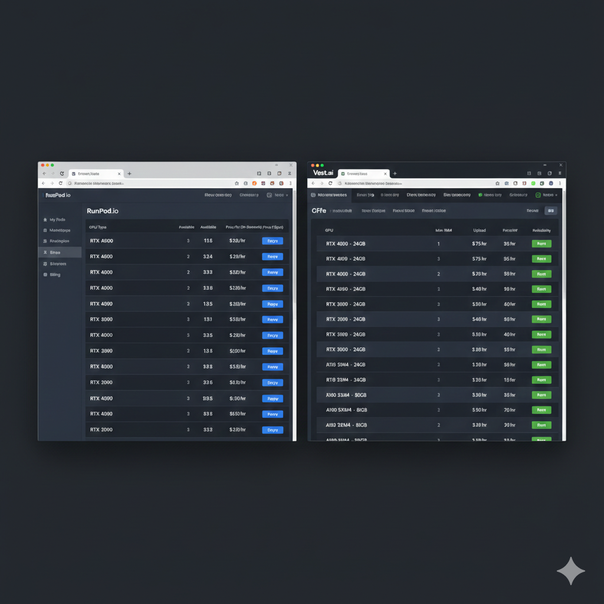
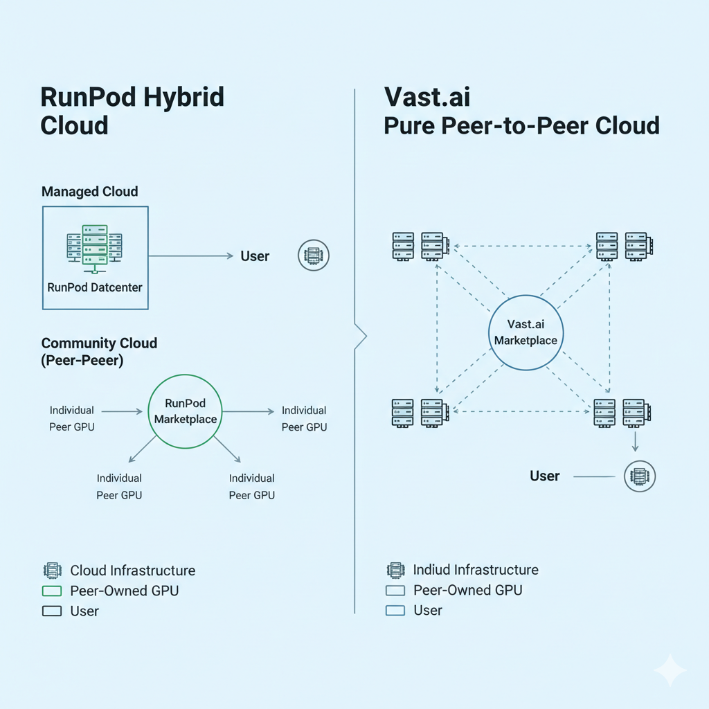
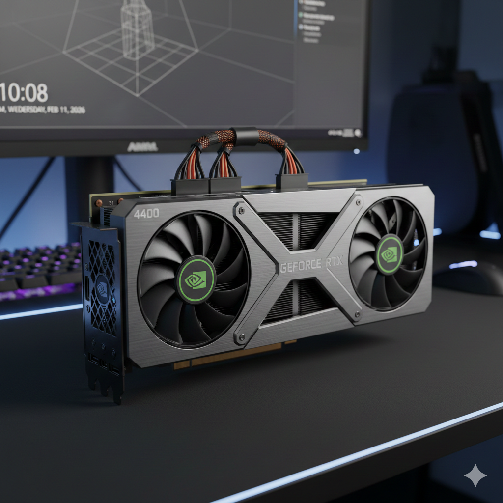
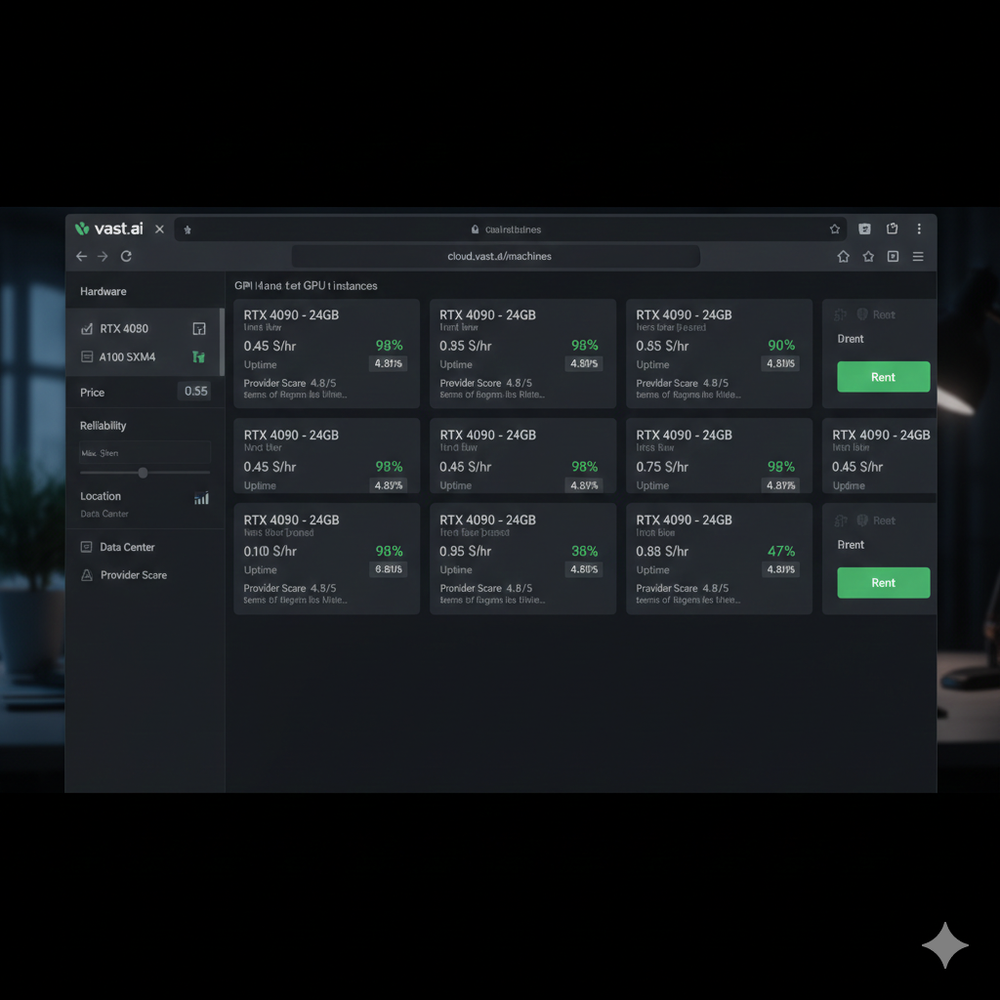
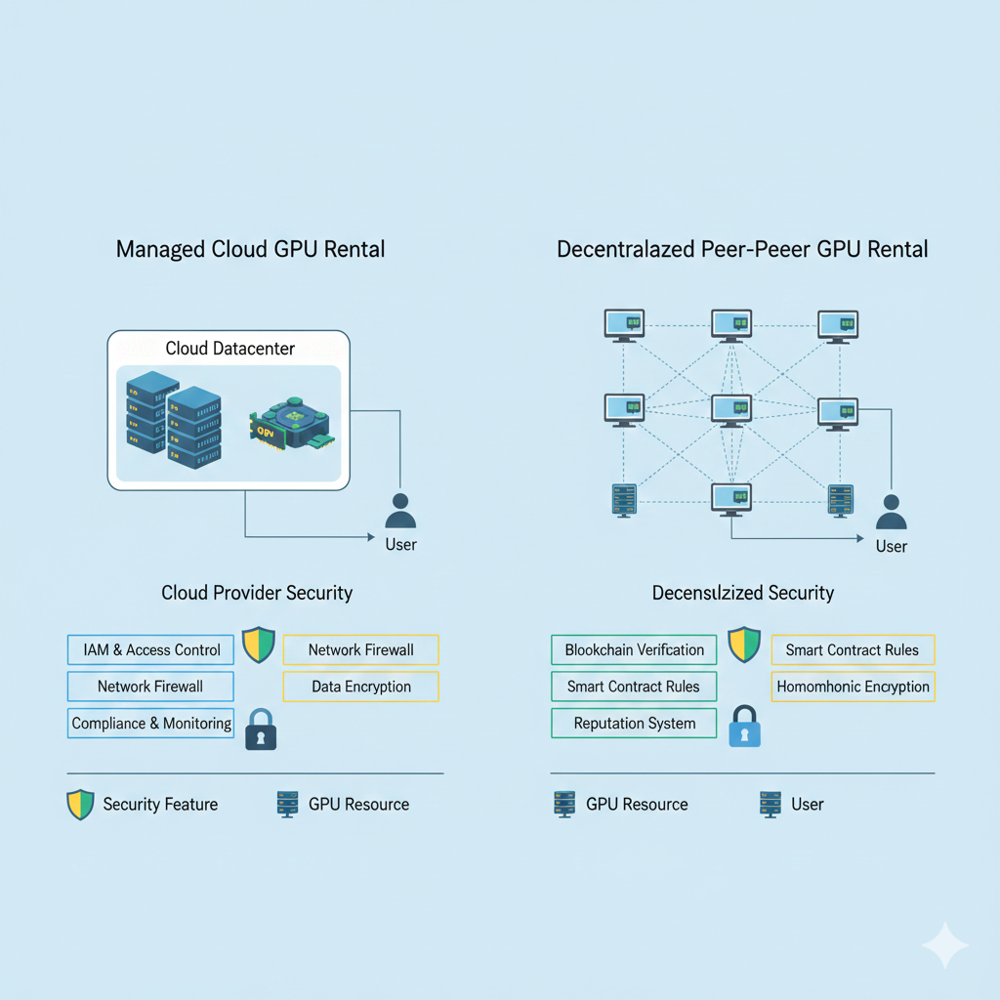

Выбор между RunPod и Vast.ai — один из самых частых вопросов у AI-разработчиков, которым нужны GPU без цен корпоративных облаков. Обе платформы занимают нишу между дорогими гиперскейлерами и покупкой собственного железа, но подходят к задаче настолько по-разному, что правильный выбор сильно зависит от ваших обстоятельств.

В этом сравнении мы разбираем обе платформы по тем параметрам, которые действительно важны при аренде GPU: как устроены цены, насколько они надёжны, что умеют и с какими сценариями справляются лучше.

Коротко: Vast.ai выигрывает по цене, RunPod — по удобству и надёжности. Чтобы понять детали, нужно разобраться, к каким компромиссам ведут архитектурные решения каждой платформы.

**Что вы найдёте в этом руководстве:**

- Подробное сравнение цен с расчётами на реальных задачах
- Анализ надёжности на основе архитектуры платформ и данных от пользователей
- Сравнение возможностей по пунктам
- Конкретные рекомендации для разных типов задач
- Практические советы, как начать работу на каждой платформе



---

## Содержание

- [Обзор платформ](#обзор-платформ)
- [Сравнение цен](#сравнение-цен)
- [Надёжность и доступность](#надёжность-и-доступность)
- [Доступное оборудование](#доступное-оборудование)
- [Удобство и интерфейс](#удобство-и-интерфейс)
- [Шаблоны и готовые окружения](#шаблоны-и-готовые-окружения)
- [Хранение и передача данных](#хранение-и-передача-данных)
- [Способы оплаты](#способы-оплаты)
- [Поддержка и документация](#поддержка-и-документация)
- [Безопасность](#безопасность)
- [Производительность на практике](#производительность-на-практике)
- [Когда какая платформа подходит лучше](#когда-какая-платформа-подходит-лучше)
- [Переход между платформами](#переход-между-платформами)
- [Какие есть альтернативы](#какие-есть-альтернативы)
- [Часто задаваемые вопросы](#часто-задаваемые-вопросы)
- [Итоговые рекомендации](#итоговые-рекомендации)

---

## Обзор платформ

### RunPod: управляемый маркетплейс

RunPod появился в 2022 году, чтобы сделать аренду GPU доступной для отдельных разработчиков и небольших команд. Платформа работает по гибридной модели: уровень Secure Cloud с оборудованием в управляемых дата-центрах и уровень Community Cloud, который, как и Vast.ai, собирает GPU от частных провайдеров.

Компания привлекла венчурное финансирование и держит собственную команду инженеров и поддержки. Благодаря этому у неё более продуманный интерфейс, официальные шаблоны и быстрая поддержка — то, что чистым peer-to-peer платформам дать непросто.

RunPod делает ставку на простоту. Платформа рассчитана на тех, кто хочет быстро запустить задачу на GPU без глубоких знаний инфраструктуры. Шаблоны в один клик для Stable Diffusion WebUI, серверов генерации текста и Jupyter-ноутбуков сокращают настройку с нескольких часов до нескольких минут.

**Ключевые особенности RunPod:**

- Гибридная модель: GPU в управляемых дата-центрах плюс GPU сообщества
- Фиксированные и предсказуемые цены на уровне Secure Cloud
- Большой набор готовых шаблонов для типовых AI-задач
- Посекундная тарификация: вы не переплачиваете за неполный час
- Активное сообщество в Discord и оперативная официальная поддержка
- Бессерверные (serverless) GPU для инференса

### Vast.ai: чистый маркетплейс

Vast.ai первым предложил модель peer-to-peer аренды GPU, запустившись в 2019 году. Платформа напрямую связывает владельцев видеокарт — от энтузиастов с игровыми ПК до операторов небольших частных дата-центров — с теми, кому нужны вычислительные ресурсы.

Такой подход даёт самые низкие цены на рынке. Без расходов на дата-центр и управляемую инфраструктуру владельцы GPU могут сдавать оборудование с прибылью по ставкам, которые ниже любых альтернатив. Обратная сторона — неоднородность: у разных провайдеров разная надёжность, скорость сети и качество железа.

Vast.ai подходит тем, кто считает деньги и готов сам оценивать провайдеров по рейтингу надёжности, расположению и характеристикам оборудования. Для каждого предложения платформа показывает подробные метрики, чтобы вы могли осознанно выбрать баланс между ценой и надёжностью.

**Ключевые особенности Vast.ai:**

- Чистый peer-to-peer маркетплейс без управляемой инфраструктуры
- Цены по принципу аукциона, в зависимости от спроса и предложения
- Самые низкие абсолютные цены на рынке аренды GPU
- Подробные метрики и рейтинги надёжности провайдеров
- Широкий выбор оборудования, включая новейшие потребительские GPU
- Чтобы эффективно пользоваться платформой, нужно больше опыта



---

## Сравнение цен

Цена — главное различие между платформами. Обе заметно дешевле корпоративных облаков, но разница между ними ощутима, когда бюджет проекта ограничен.

### Цены на потребительские GPU

Потребительские видеокарты вроде RTX 4090 и RTX 3090 дают лучшее соотношение цены и производительности для большинства AI-задач. Ни AWS, ни Azure, ни GCP такие GPU не предлагают — это серьёзное преимущество и RunPod, и Vast.ai.

| GPU              | RunPod Secure Cloud | RunPod Community | Vast.ai, диапазон | Vast.ai, в среднем |
| ---------------- | ------------------- | ---------------- | ----------------- | ------------------ |
| RTX 5090 (32GB)  | $0,89/ч             | $0,55–0,85/ч     | $0,38–1,08/ч      | $0,65/ч            |
| RTX 4090 (24GB)  | $0,59/ч             | $0,44–0,55/ч     | $0,29–0,78/ч      | $0,45/ч            |
| RTX 3090 (24GB)  | $0,46/ч             | $0,32–0,40/ч     | $0,18–0,60/ч      | $0,35/ч            |
| RTX A6000 (48GB) | $0,49/ч             | $0,40–0,48/ч     | $0,40–0,70/ч      | $0,52/ч            |

**Вывод:** нижняя граница цен на Vast.ai на 30–50% ниже, чем у RunPod, но за такие ставки приходится брать провайдеров с более низким рейтингом надёжности или в менее удобных локациях. По медианным ценам разрыв сокращается до 15–25%.

### Цены на GPU для дата-центров

Для задач, которым нужно оборудование дата-центрового класса — большие языковые модели, обучение на нескольких GPU, продакшен-инференс, — обе платформы предлагают A100 и H100 со значительной скидкой по сравнению с гиперскейлерами.

| GPU       | RunPod Secure Cloud | RunPod Community | Vast.ai, диапазон | Аналог в AWS |
| --------- | ------------------- | ---------------- | ----------------- | ------------ |
| A100 40GB | Нет                 | $1,09–1,29/ч     | $0,80–1,20/ч      | ~$4,10/ч     |
| A100 80GB | $1,39–1,49/ч        | $1,19–1,35/ч     | $0,84–1,49/ч      | ~$4,10/ч     |
| H100 80GB | $2,39/ч             | $1,89–2,29/ч     | $1,47–2,94/ч      | ~$6,90/ч     |
| L4 24GB   | $0,39/ч             | $0,29–0,35/ч     | $0,35–0,50/ч      | $0,80/ч      |

**Вывод:** на дата-центровых GPU обе платформы экономят 60–75% по сравнению с AWS. На старших моделях разница между RunPod и Vast.ai сокращается: надёжность здесь важнее, а провайдеров на маркетплейсе меньше.

### Чем отличаются модели ценообразования

Помимо самих ставок, модели ценообразования различаются в важных деталях.

**RunPod Secure Cloud:**

- Фиксированная цена независимо от спроса
- Гарантированная доступность после запуска инстанса
- Никаких ставок и аукционов
- Предсказуемые расходы, которые легко заложить в бюджет

**RunPod Community Cloud:**

- Цена зависит от провайдера
- Провайдер сам устанавливает ставки
- Работа может прерваться, если оборудование понадобится провайдеру
- Экономика, похожая на спотовые инстансы

**Vast.ai:**

- Динамические цены в зависимости от спроса и предложения
- Провайдеры задают минимальную цену, реальную ставку определяет рынок
- В периоды высокого спроса цены могут резко вырасти
- В непиковые часы можно заметно сэкономить

Подробный разбор цен на аренду GPU у всех крупных провайдеров, включая корпоративные облака, — в нашем [полном сравнении цен на аренду GPU в 2026 году](/ru/gpu-rental-pricing-comparison-2026/).

### Сколько это стоит на практике: обучение LoRA

Чтобы показать разницу на практике, возьмём обучение LoRA для Stable Diffusion — типовую задачу, которая занимает около 2 часов на RTX 4090.

| Платформа        | Выбор GPU                         | Ставка в час | Итого за 2 часа |
| ---------------- | --------------------------------- | ------------ | --------------- |
| RunPod Secure    | RTX 4090                          | $0,59        | $1,18           |
| RunPod Community | RTX 4090 (медиана)                | $0,49        | $0,98           |
| Vast.ai          | RTX 4090 (надёжность от 99%)      | $0,52        | $1,04           |
| Vast.ai          | RTX 4090 (надёжность от 97%)      | $0,38        | $0,76           |

Разница в $0,42 между RunPod Secure и самым дешёвым вариантом на Vast.ai набегает за много запусков. За 50 сессий обучения это $21 экономии — ощутимо для независимого разработчика, но, возможно, не стоит неопределённости с надёжностью в профессиональных проектах.

Подробнее о том, как обучать LoRA, выбирать GPU и экономить, — в нашем [руководстве по обучению LoRA для Stable Diffusion дешевле $10](/ru/stable-diffusion-lora-training-under-10-dollars/).

---

## Надёжность и доступность

После цены надёжность — главное, чем различаются платформы аренды GPU. Ненадёжная видеокарта за полцены — не выгодная сделка, если обучение падает на 11-м часу 12-часовой задачи.

### Как RunPod обеспечивает надёжность

**Уровень Secure Cloud:**
Secure Cloud работает на оборудовании в управляемых дата-центрах со стандартными конфигурациями. Компания контролирует среду, обслуживает железо и отвечает за доступность. RunPod не публикует официальных показателей SLA для Secure Cloud, но, судя по отзывам пользователей и моему личному опыту, доступность превышает 99,5%.

Оборудование в Secure Cloud выделенное: после запуска инстанс остаётся вашим, пока вы его не завершите. Никакой провайдер не заберёт железо посреди сессии.

**Уровень Community Cloud:**
Надёжность в Community Cloud зависит от провайдера, как и на Vast.ai. Провайдеры получают рейтинг по истории доступности, и вы можете отфильтровать тех, у кого он выше. Платформа проверяет провайдеров, что даёт некоторую защиту, но прерывания всё равно случаются.

### Как Vast.ai обеспечивает надёжность

Vast.ai полностью построен на peer-to-peer модели, поэтому надёжность целиком зависит от конкретного провайдера. Чтобы оценить риски, платформа показывает подробные метрики.

**Рейтинг надёжности (Reliability Score):** доля времени, когда машина была доступна во время аренды. От ~92% до 99,9%.

**История доступности:** наглядная картина недавней работы с отметками сбоев и прерываний.

**Стаж провайдера:** сколько провайдер работает на платформе. Чем дольше история, тем точнее прогноз.

**Число аренд:** чем больше аренд, тем больше данных для оценки надёжности.

Опытные пользователи добиваются на Vast.ai отличной надёжности, выбирая провайдеров с рейтингом от 99%, стажем на платформе от 6 месяцев и расположением в регионах со стабильным энергоснабжением. Но такие фильтры сужают выбор и часто отсекают самые дешёвые варианты.

### Сравнительная таблица надёжности

| Метрика                    | RunPod Secure | RunPod Community | Vast.ai (фильтр 99%+) | Vast.ai (все)    |
| -------------------------- | ------------- | ---------------- | --------------------- | ---------------- |
| Типичная доступность       | 99,5%+        | 98–99%           | 99%+                  | 95–99%           |
| Риск прерывания            | Очень низкий  | Умеренный        | Низкий                | Умеренный–высокий |
| Однородность оборудования  | Высокая       | Разная           | Разная                | Разная           |
| Производительность сети    | Стабильная    | Разная           | Разная                | Разная           |

### Надёжность на практике

**Обучение до 4 часов:** обе платформы достаточно надёжны. Для коротких задач экономия на Vast.ai обычно перевешивает небольшой риск прерывания.

**Обучение от 4 до 12 часов:** имеет смысл выбрать RunPod Secure Cloud или Vast.ai со строгим фильтром по надёжности (99%+). Потеря 8 часов обучения оправдывает доплату за надёжность.

**Обучение дольше 12 часов:** чекпоинты становятся обязательными на любой платформе. Сохраняйте их каждые 30–60 минут — тогда при прерывании вы теряете только время с последнего чекпоинта, а не весь запуск.

**Продакшен-инференс:** однозначно RunPod Secure Cloud, если только вы не строите собственное переключение при сбоях и проверки работоспособности. Продакшен-системам нужна предсказуемая доступность, которую изменчивый маркетплейс гарантировать не может.



---

## Доступное оборудование

Обе платформы хороши тем, что предлагают оборудование, которого нет в корпоративных облаках, — прежде всего потребительские GPU. Но их ассортимент заметно различается.

### Доступность потребительских GPU

| Модель GPU      | Доступность на RunPod | Доступность на Vast.ai  |
| --------------- | --------------------- | ----------------------- |
| RTX 5090 (32GB) | Хорошая               | Средняя (новая модель)  |
| RTX 4090 (24GB) | Отличная              | Отличная                |
| RTX 4080 (16GB) | Ограниченная          | Хорошая                 |
| RTX 3090 (24GB) | Хорошая               | Отличная                |
| RTX 3080 (12GB) | Ограниченная          | Хорошая                 |
| RTX 3070 (8GB)  | Очень ограниченная    | Средняя                 |

У Vast.ai больше провайдеров, поэтому выбор потребительского железа обычно шире, включая старые и редкие модели. RunPod делает упор на самые популярные для AI-задач карты — прежде всего RTX 4090 и RTX 3090.

### Доступность GPU для дата-центров

| Модель GPU | Доступность на RunPod  | Доступность на Vast.ai |
| ---------- | ---------------------- | ---------------------- |
| H100 80GB  | Хорошая                | Средняя                |
| H200 140GB | Ограниченная           | Ограниченная           |
| A100 80GB  | Отличная               | Хорошая                |
| A100 40GB  | Хорошая (Community)    | Хорошая                |
| A6000 48GB | Хорошая                | Хорошая                |
| L4 24GB    | Отличная               | Хорошая                |
| L40S 48GB  | Средняя                | Ограниченная           |
| A40 48GB   | Средняя                | Средняя                |

RunPod вложился в дата-центровое оборудование для Secure Cloud, поэтому A100 и H100 там доступны стабильно. На Vast.ai наличие дата-центровых GPU зависит от провайдеров, которые купили или арендовали такое оборудование, и бывает нерегулярным.

### Конфигурации с несколькими GPU

Для обучения больших моделей на нескольких GPU обе платформы уступают корпоративным облакам.

**RunPod:** в Secure Cloud доступны поды до 8xA100 или 8xH100. В Community Cloud конфигурации с несколькими GPU встречаются редко и нестабильно.

**Vast.ai:** системы с несколькими GPU есть, но редко. Чтобы найти машину на 4 или 8 GPU, нужны терпение и гибкость по срокам. Провайдеры таких систем берут повышенную плату.

Ни одна из платформ не сравнится по доступности multi-GPU с инстансами AWS p4d или серией Azure ND. Для обучения на 8 GPU в больших масштабах с гарантированной доступностью по-прежнему нужны корпоративные облака.

---

## Удобство и интерфейс

Разница в удобстве RunPod и Vast.ai отражает их разную философию и целевую аудиторию.

### Интерфейс RunPod

Интерфейс RunPod рассчитан на тех, кто не является специалистом по инфраструктуре. В панели доступные GPU показаны с понятными ценами, развёртывание занимает несколько кликов, а готовые шаблоны берут на себя большую часть настройки окружения.

**Сильные стороны:**

- Чистый современный интерфейс с понятной навигацией
- Галерея шаблонов для типовых задач
- Развёртывание в один клик для Stable Diffusion, инференса LLM и не только
- Встроенный JupyterLab без дополнительной настройки
- Адаптивный дизайн: удобно следить за задачами с телефона

**Слабые стороны:**

- Фильтры менее детальные, чем на Vast.ai
- Меньше информации для выбора провайдера в Community Cloud
- Для расширенной настройки приходится копаться в параметрах

### Интерфейс Vast.ai

Интерфейс Vast.ai рассчитан на тех, кто уверенно принимает инфраструктурные решения. Витрина маркетплейса предлагает множество фильтров и подробные данные о провайдерах, чтобы точно подобрать оборудование под требования.

**Сильные стороны:**

- Подробные метрики провайдеров (надёжность, скорость сети, расположение)
- Расширенные фильтры по объёму видеопамяти, месту на диске и пропускной способности сети
- Сортировка по цене и ценообразование на основе ставок
- Прозрачная история и рейтинги провайдеров
- CLI для программного доступа

**Слабые стороны:**

- Новичкам сложнее разобраться
- Интерфейс может казаться перегруженным информацией
- Система шаблонов менее проработана, чем у RunPod
- Перед запуском нужно принять больше решений

### Управление инстансами

| Функция                  | RunPod        | Vast.ai                 |
| ------------------------ | ------------- | ----------------------- |
| Время до первого GPU     | 2–5 минут     | 2–5 минут               |
| Развёртывание шаблона    | В один клик   | Вручную или из шаблона  |
| Доступ по SSH            | Да            | Да                      |
| Веб-терминал             | Да            | Да                      |
| JupyterLab               | Встроен       | Настраивается вручную   |
| Файловый менеджер        | Да            | Ограниченно             |
| Остановка и возобновление | Да           | Да                      |
| Посекундная тарификация  | Да            | Да                      |



---

## Шаблоны и готовые окружения

Шаблоны резко сокращают время до начала работы над типовыми задачами. Они есть на обеих платформах, но различаются по проработке и охвату.

### Шаблоны RunPod

RunPod поддерживает официальные шаблоны для основных AI-задач.

**Stable Diffusion:**

- Automatic1111 WebUI
- ComfyUI
- Forge WebUI
- InvokeAI

**Инференс LLM:**

- Text Generation WebUI (Oobabooga)
- vLLM
- Ollama
- API-серверы, совместимые с OpenAI

**Разработка:**

- PyTorch с CUDA
- TensorFlow с CUDA
- Jupyter-ноутбуки
- VS Code Server

**Другое:**

- Whisper (распознавание речи)
- Модели генерации музыки
- Поддержка собственных контейнеров

В шаблонах уже правильно настроена CUDA, где нужно, заранее загружены модели, а параметры по умолчанию выбраны разумно. Новый пользователь может генерировать изображения в Stable Diffusion уже через 10 минут после регистрации.

### Шаблоны Vast.ai

Шаблоны Vast.ai проверяются меньше, зато гибче.

**Официальные шаблоны:**

- Базовые окружения для разработки на CUDA
- Конфигурации Jupyter-ноутбуков
- Сборки с распространёнными ML-фреймворками

**Шаблоны сообщества:**

- Конфигурации, которые публикуют пользователи
- Качество и поддержка разные
- Большой выбор, но документация неоднородная

**Интеграция с Docker:**

- Полная поддержка Docker-образов
- Можно взять любой публичный образ
- Можно собрать собственный

Подход Vast.ai, построенный вокруг Docker, даёт максимум гибкости тем, кто точно знает, что ему нужно. Но без поддерживаемых официальных шаблонов типовые сценарии требуют больше ручной настройки.

### Сравнение шаблонов

| Задача                               | RunPod                         | Vast.ai                     |
| ------------------------------------ | ------------------------------ | --------------------------- |
| Stable Diffusion                     | В один клик, несколько UI      | Вручную или от сообщества   |
| Инференс LLM                         | Несколько вариантов, в один клик | Ручная настройка          |
| Обучение (PyTorch)                   | Есть шаблон                    | Есть шаблон                 |
| Собственные контейнеры               | Поддерживаются                 | Отличная поддержка          |
| Время настройки (типовые задачи)     | 5–10 минут                     | 15–30 минут                 |

Для стандартных AI-задач шаблоны RunPod заметно экономят время. Если у вас нестандартные требования или опыт с Docker, гибкость Vast.ai может оказаться удобнее.

---

## Хранение и передача данных

Хранение и передача данных часто становятся сюрпризом для новичков. Стоимость GPU очевидна, а сопутствующие расходы на хранение датасетов и перемещение данных менее заметны, хотя могут быть существенными.

### Хранение на RunPod

**Хранилище пода:**

- У каждого пода есть настраиваемое дисковое пространство
- Хранилище контейнера сохраняется, пока существует под
- До определённого объёма входит в почасовую ставку пода
- Дополнительный объём оплачивается отдельно

**Сетевые тома (Network Volume):**

- Постоянное хранилище, которое сохраняется после удаления пода
- $0,07 за ГБ в месяц
- Подключается к подам в том же регионе
- Удобно для датасетов и весов моделей

**Передача данных:**

- Без дополнительной платы за трафик
- Скорость загрузки зависит от дата-центра
- Скорость выгрузки обычно отличная

### Хранение на Vast.ai

**Хранилище инстанса:**

- Объём диска определяет провайдер
- У разных провайдеров он сильно различается
- У одних немного SSD, у других — терабайты
- Хранилище входит в почасовую ставку

**Постоянное хранилище:**

- Собственного продукта для постоянного хранения нет
- Решение придётся организовать самостоятельно
- Обычные варианты: синхронизация с облачным хранилищем, внешние серверы
- Для датасетов, которые нужны в нескольких сессиях, это сложнее, чем на RunPod

**Передача данных:**

- Платформа не берёт плату за трафик
- Скорость сети у провайдеров очень разная
- Это ключевая метрика при выборе провайдера
- У некоторых провайдеров ограниченная пропускная способность

### Сравнение расходов на хранение

Для типичного сценария, где нужно 100 ГБ постоянного хранилища:

| Что нужно хранить                          | RunPod     | Vast.ai                        |
| ------------------------------------------ | ---------- | ------------------------------ |
| Датасет (100 ГБ, 1 месяц)                  | $7,00      | Нужно внешнее решение          |
| Веса модели (50 ГБ, входят в под)          | $0         | $0                             |
| Передача данных                            | Бесплатно  | Бесплатно                      |

Сетевые тома RunPod заметно упрощают жизнь, если данные должны сохраняться между сессиями. На Vast.ai обычно синхронизируют данные с облачным хранилищем (S3, GCS или аналогами) между сессиями, что добавляет сложности и времени на передачу.

---

## Способы оплаты

Гибкость оплаты важна для пользователей из разных стран, для тех, кто избегает традиционных банков, и для организаций с особыми требованиями к закупкам.

### Способы оплаты RunPod (проверено в сентябре 2026 года)

- Кредитные и дебетовые карты (Visa, Mastercard, American Express)
- Криптовалюта, с проверкой KYC перед первым платежом в криптовалюте
- Предоплаченный баланс аккаунта
- Счета для бизнеса (ACH или банковский перевод) для платежей от $5000

### Способы оплаты Vast.ai (проверено в сентябре 2026 года)

- Кредитные и дебетовые карты
- Криптовалюта через BitPay и Crypto.com
- Предоплаченный баланс аккаунта

### Требования к аккаунту

| Требование                          | RunPod                                              | Vast.ai                      |
| ----------------------------------- | --------------------------------------------------- | ---------------------------- |
| Подтверждение email                 | Да                                                  | Да                           |
| Проверка личности (KYC)             | Только перед первым платежом в криптовалюте         | В документации не указана    |
| Проверка бизнеса                    | Нет                                                 | Нет                          |
| Минимум для старта                  | Баланс на 1 час; $100 для предоплаченных карт       | Депозит $5                   |

У обеих платформ низкий порог входа. Ни одна не требует такой обширной проверки, как корпоративные облака. У этой доступности есть обратная сторона: ни одна из платформ не предоставит документов о соответствии требованиям (compliance), которые могут понадобиться крупной организации.

---

## Поддержка и документация

Когда что-то идёт не так — а рано или поздно это случится, — от качества поддержки зависит, как быстро вы восстановите работу.

### Поддержка RunPod

**Каналы:**

- Сообщество в Discord (очень активное)
- Поддержка по email
- Вики с документацией
- Видеоуроки

**Время ответа:**

- Discord: в рабочее время часто за несколько минут
- Email: обычно 24–48 часов
- На вопросы в сообществе часто отвечают сами сотрудники

Для компании такого размера RunPod необычайно активен в Discord. Сотрудники следят за каналами и регулярно отвечают пользователям. Видно, что компания сознательно делает ставку на сообщество как на канал поддержки.

Документация хорошо описывает типовые сценарии, но может отставать от новых функций. Видеоуроки помогают тем, кому удобнее смотреть, но охватывают не всё.

### Поддержка Vast.ai

**Каналы:**

- Сообщество в Discord
- Поддержка по email
- Документация
- FAQ

**Время ответа:**

- Discord: по-разному, часто отвечает само сообщество
- Email: обычно 24–72 часа
- Сотрудники реже появляются в каналах сообщества

Поддержка Vast.ai отражает природу маркетплейса. Компания выступает посредником между арендаторами и провайдерами, но меньше контролирует инфраструктуру и поэтому не всегда может решить проблему сама. Если проблема на стороне провайдера, решать её придётся с ним.

Документации хватает для базовых операций, но по конкретным задачам она менее подробна, чем у RunPod.

### Сравнение поддержки

| Параметр                          | RunPod        | Vast.ai       |
| --------------------------------- | ------------- | ------------- |
| Активность сообщества             | Очень высокая | Средняя       |
| Ответы сотрудников                | Часто         | Иногда        |
| Глубина документации              | Хорошая       | Достаточная   |
| Видеоматериалы                    | Есть          | Мало          |
| Решение проблем самостоятельно    | Легко         | Средне        |

---

## Безопасность

Риски безопасности на управляемых платформах и peer-to-peer маркетплейсах разные. Понимание модели угроз помогает сделать правильный выбор.

### Модель безопасности RunPod

**Secure Cloud:**

- Оборудование в управляемых дата-центрах
- Стандартная физическая охрана дата-центра
- RunPod контролирует весь инфраструктурный стек
- Изоляция пользователей на уровне контейнеров
- У арендаторов нет доступа к «голому железу»

**Community Cloud:**

- Оборудование контролируют провайдеры
- У провайдера есть физический доступ к железу
- Возможны недобросовестные провайдеры (редко, но бывает)
- Контейнерная изоляция есть, но не гарантирована

### Модель безопасности Vast.ai

- Всё оборудование контролируют частные провайдеры
- У провайдера есть физический и административный доступ
- Провайдеров тщательно проверяют, но это не абсолютная защита
- Изоляция контейнеров зависит от настроек провайдера
- Некоторые провайдеры могут логировать или просматривать трафик

### Практические рекомендации по безопасности

**Для чувствительных задач (проприетарные модели, конфиденциальные данные):**

- Используйте только RunPod Secure Cloud
- Если нужно соответствие регуляторным требованиям, рассмотрите корпоративное облако
- Никогда не обрабатывайте чувствительные данные на GPU с peer-to-peer маркетплейсов

**Для нечувствительных задач (публичные модели, синтетические данные):**

- Подходят обе платформы
- Провайдеры с долгой историей и высоким рейтингом несут низкий риск
- Действуют стандартные правила гигиены (никаких учётных данных в коде и т. п.)

**Для любых задач:**

- Не оставляйте учётные данные в скриптах обучения
- Храните API-ключи в переменных окружения
- Очищайте инстанс перед завершением
- Исходите из того, что провайдер может просмотреть содержимое диска после завершения аренды



---

## Производительность на практике

Цены и функции имеют значение, только если GPU действительно работают как ожидается. Я запустил одинаковые задачи на обеих платформах, чтобы измерить реальную разницу.

### Методика тестирования

**Оборудование:** RTX 4090 24GB
**Задача 1:** генерация изображений в Stable Diffusion XL (50 изображений по 30 шагов)
**Задача 2:** обучение LoRA (50 изображений, 10 эпох)
**Задача 3:** инференс LLM (Llama 2 7B, генерация 1000 токенов)

Каждый тест запускался трижды на каждой платформе. На Vast.ai выбирались провайдеры среднего уровня (надёжность от 98%, медианная цена).

### Результаты

| Задача                                | RunPod Secure | Vast.ai (провайдер 98%+) | Разница |
| ------------------------------------- | ------------- | ------------------------ | ------- |
| Генерация SDXL (50 изображений)       | 4 мин 32 с    | 4 мин 28 с               | −1,5%   |
| Обучение LoRA (10 эпох)               | 52 мин 14 с   | 53 мин 41 с              | +2,7%   |
| Инференс LLM (1000 токенов)           | 28 с          | 29 с                     | +3,6%   |

**Вывод:** для задач, упирающихся в вычисления, разница в производительности пренебрежимо мала. RTX 4090 — одна и та же видеокарта на обеих платформах: кремнию всё равно, кому он принадлежит.

Небольшое замедление на Vast.ai при обучении и инференсе, скорее всего, связано с накладными расходами сети, а не с GPU. На практике такая разница укладывается в погрешность.

### Производительность сети

Сеть различается гораздо сильнее:

| Метрика                      | RunPod Secure | Vast.ai, в среднем | Vast.ai, лучшие |
| ---------------------------- | ------------- | ------------------ | --------------- |
| Скорость загрузки            | 500+ Мбит/с   | 200–400 Мбит/с     | 800+ Мбит/с     |
| Скорость выгрузки            | 400+ Мбит/с   | 150–300 Мбит/с     | 600+ Мбит/с     |
| Стабильность задержки        | Высокая       | Разная             | Высокая         |

Если задача связана с большим объёмом передачи данных (крупные датасеты, частая выгрузка моделей), стабильная сеть RunPod заметно экономит время. Для задач, где основное — вычисления, разница в сети менее важна.

---

## Когда какая платформа подходит лучше

По итогам анализа цен, надёжности и возможностей — конкретные рекомендации для типовых сценариев.

### Выбирайте RunPod Secure Cloud, если нужны:

**Продакшен-системы инференса:**
Требования к надёжности в продакшене оправдывают доплату за RunPod. Упавший в 2 часа ночи сервер инференса обойдётся дороже, чем разница в цене.

**Обучение с жёсткими сроками:**
Когда важен дедлайн, предсказуемая доступность лучше надежды, что провайдер на Vast.ai не отключится. Небольшая доплата — это страховка от потерянного времени.

**Первое знакомство с арендой GPU:**
Шаблоны и документация RunPod облегчают старт. Начните здесь, а к Vast.ai присмотритесь, когда поймёте свои потребности.

**Общие ресурсы для команды:**
Функции для организаций и постоянное хранилище RunPod упрощают совместную работу по сравнению с координацией между провайдерами Vast.ai.

### Выбирайте Vast.ai, если нужны:

**Эксперименты при ограниченном бюджете:**
Когда вы учитесь или экспериментируете, экономия 30–40% на Vast.ai позволяет сделать больше итераций при том же бюджете. Прерванные запуски на этом этапе не так критичны.

**Пакетная обработка с чекпоинтами:**
Задачи, которые регулярно сохраняют чекпоинты, переживут прерывания со стороны провайдера. При правильной стратегии чекпоинтов экономия на долгих запусках накапливается.

**Нестандартное оборудование:**
Нужна конкретная старая видеокарта? Среди множества провайдеров Vast.ai найдётся железо, которого нет у RunPod.

**Обучение на ночь или на выходные:**
В непиковые часы цены на Vast.ai заметно падают. Запускать долгое обучение в пятницу вечером по сниженным ставкам разумно, если вы готовы к неопределённости с надёжностью.

### Когда подходит любая из платформ:

**Обучение LoRA (2–4 часа):**
Обе платформы хорошо справляются с такой задачей. Выбирайте по текущим ценам и наличию.

**Генерация в Stable Diffusion:**
Интерактивная генерация отлично работает на обеих платформах. Риск сбоя за часовую сессию минимален.

**Разовые эксперименты:**
Быстрые проверки идей перед долгими запусками одинаково удобно делать на обеих платформах.

---

## Переход между платформами

При небольшой подготовке переключиться с одной платформы на другую несложно. Обе используют стандартные контейнеры и доступ по SSH.

### Перенос данных

**Датасеты и веса моделей:**

- Храните их в облачном хранилище (S3, GCS, Backblaze B2), доступном с любой платформы
- Не завязывайтесь на постоянное хранилище конкретной платформы
- Загружайте данные из облака на инстанс в начале сессии

**Код и конфигурации:**

- Храните весь код в git-репозиториях
- Держите файлы конфигурации под контролем версий
- Не используйте в скриптах пути, специфичные для платформы

**Образы контейнеров:**

- Обе платформы поддерживают Docker Hub и реестры контейнеров
- Собственные образы работают на обеих
- Скрывайте различия платформ в скриптах точки входа (entrypoint)

### Переносимость рабочего процесса

Переносимый рабочий процесс работает на любой платформе с минимальными изменениями:

```bash
# Example portable setup script
#!/bin/bash

# Clone code repository
git clone https://github.com/yourrepo/training-code.git

# Download dataset from cloud storage
aws s3 sync s3://your-bucket/dataset ./dataset

# Download model weights
wget https://huggingface.co/model/weights.safetensors -O ./models/

# Run training
python train.py --config ./config.yaml

# Upload results
aws s3 sync ./output s3://your-bucket/results/
```

Этот скрипт одинаково работает на RunPod и на Vast.ai — нужны только учётные данные для доступа к облачному хранилищу.

---

## Какие есть альтернативы

RunPod и Vast.ai лидируют среди маркетплейсов аренды GPU, но в зависимости от ваших требований стоит рассмотреть и другие варианты.

### Lambda Labs

Lambda Labs — управляемое GPU-облако с фиксированными ценами и сильным уклоном в ML. По цене оно находится между корпоративными облаками и маркетплейсами. Хороший выбор, если нужна надёжность без сложностей маркетплейса и вы готовы немного доплатить.

### GPUFlow

[GPUFlow](https://gpuflow.app/ru/marketplace) сдаёт в аренду кое-что другое: API-ключ, совместимый с OpenAI, к AI-моделям, которые уже запущены на чьей-то потребительской видеокарте, с посекундной тарификацией. Настраивать ничего не нужно, но обучать модели или запускать свой код нельзя. Имеет смысл, если вам нужна модель за API, а не машина. Подробнее — в сравнении [GPUFlow, Vast.ai, RunPod и SaladCloud](/ru/gpuflow-vs-vast-ai-vs-runpod/).

### Корпоративные облака (AWS, Azure, GCP)

Если нужны соответствие регуляторным требованиям, гарантированные SLA и корпоративная поддержка, без гиперскейлеров не обойтись. Цена в 3–5 раз выше, но за неё вы получаете то, чего не дадут маркетплейсы: сертификацию SOC2, соответствие HIPAA, выделенных инженеров поддержки и договорные гарантии доступности.

### Покупка оборудования

При достаточных объёмах собственное железо становится выгоднее. Для потребительских GPU точка окупаемости обычно наступает примерно через 2500–3000 часов использования. Организациям с постоянной нагрузкой стоит сравнить совокупную стоимость владения с арендой.

---

## Часто задаваемые вопросы

### Что дешевле для аренды GPU: RunPod или Vast.ai?

Обычно дешевле Vast.ai: это чистый peer-to-peer маркетплейс. RTX 4090 там стоит от $0,29 до $0,78 в час, а в Secure Cloud у RunPod та же видеокарта обходится в $0,59 в час. Но чтобы получить самые низкие ставки на Vast.ai, приходится выбирать провайдеров с более низким рейтингом надёжности. При сопоставимой надёжности (99%+) разрыв в цене сокращается до 15–25%.

### Какая платформа надёжнее для продакшен-нагрузок?

Secure Cloud от RunPod стабильнее: оборудование стоит в дата-центрах, которые отбирает сама компания. Она контролирует инфраструктуру и отвечает за доступность. Надёжность на Vast.ai зависит от конкретного провайдера, рейтинги колеблются от 97% до 99,9%. Для продакшен-инференса, где важна высокая доступность, RunPod безопаснее. Для пакетного обучения, которое переживёт редкие прерывания, Vast.ai выгоднее.

### Можно ли арендовать потребительские GPU вроде RTX 4090 на обеих платформах?

Да. И RunPod, и Vast.ai дают доступ к потребительским видеокартам, включая RTX 3090, RTX 4090 и RTX 5090. Этим они отличаются от корпоративных облаков вроде AWS, Azure и GCP, где доступны только GPU для дата-центров (A100, H100 и т. д.). Потребительские GPU дают отличное соотношение цены и производительности для большинства AI-задач.

### У какой платформы лучше готовые шаблоны для AI-задач?

У RunPod больше официальных шаблонов: развёртывание в один клик для Stable Diffusion (с несколькими интерфейсами), разных серверов инференса LLM и популярных фреймворков обучения. Шаблоны поддерживают сотрудники RunPod, CUDA в них уже правильно настроена. У Vast.ai есть шаблоны сообщества, но их меньше проверяют и поддерживают по-разному. Тем, кто хочет готовое решение «под ключ», обычно удобнее RunPod.

### Требуют ли RunPod и Vast.ai подтверждения личности?

Для обычной работы ни одна из платформ не просит у арендаторов документы. Vast.ai требует подтверждённый email и минимальный депозит $5. RunPod работает по предоплате и запрашивает KYC только перед первым платежом в криптовалюте. На обеих площадках начать гораздо быстрее, чем в корпоративных облаках, где новому аккаунту часто нужно сначала запросить квоту на GPU, прежде чем запустить GPU-инстанс. Подробнее — в статье [что нужно, чтобы арендовать GPU](/ru/what-you-need-to-rent-a-gpu/).

### Как выбрать платформу для конкретного проекта?

Учтите три фактора: требования к надёжности, бюджет и ценность времени на настройку. Для продакшен-систем и обучения с жёсткими сроками лучше RunPod Secure Cloud. Для исследовательской работы и проектов с ограниченным бюджетом — Vast.ai. Новичкам помогут шаблоны RunPod. Опытным пользователям с нестандартными требованиями может больше подойти гибкость Vast.ai.

### Легко ли переключаться между платформами?

Да. Обе платформы используют стандартный доступ по SSH и поддерживают Docker-контейнеры. Если датасеты лежат в облачном хранилище, а код — в git-репозиториях, переезд не составит труда. Основные затраты при переходе — освоить интерфейс и процесс запуска на новой платформе, обычно это несколько часов.

---

## Итоговые рекомендации

Наши рекомендации:

**Начните с RunPod, если:**

- Вы впервые арендуете GPU
- Вам нужна надёжность уровня продакшена
- Для вашей работы важны готовые шаблоны
- Вы цените оперативную поддержку

**Начните с Vast.ai, если:**

- Главное для вас — минимальная стоимость
- У вас есть опыт работы с инфраструктурой
- Ваши задачи переживут прерывания
- Вам нравится сравнивать варианты и оптимизировать

**Присмотритесь к GPUFlow, если:**

- Вам нужна открытая AI-модель за API, совместимым с OpenAI, а не машина
- Вы не хотите настраивать драйверы, контейнеры или сервер инференса
- Вам не нужно обучать модели или запускать свой код

Хорошая новость: и RunPod, и Vast.ai намного выгоднее корпоративных альтернатив. Любой из вариантов экономит 60–80% по сравнению с AWS или Azure. Различия между ними важны, но вторичны по сравнению с огромной экономией, которую дают обе платформы.

Для постоянных проектов имеет смысл держать аккаунты на обеих платформах. RunPod — для работы, где критичны надёжность и сроки. Vast.ai — для исследований, экспериментов и пакетной обработки, где цена важнее гарантированной доступности. Возможность выбирать под требования проекта, а не привязываться к одной платформе, даёт максимум экономии там, где важна цена, и максимум надёжности там, где важна она.

---

**Нужна AI-модель через API, а не целая машина?** На [GPUFlow](https://gpuflow.app/ru/marketplace) вы арендуете GPU почасово и получаете API-ключ, совместимый с OpenAI, с посекундной тарификацией. [Как это работает](https://docs.gpuflow.app/ru/renters/getting-started/).

---

_Похожие руководства:_

- [Сравнение цен на аренду GPU в 2026 году](/ru/gpu-rental-pricing-comparison-2026/)
- [Как обучить LoRA для Stable Diffusion дешевле $10](/ru/stable-diffusion-lora-training-under-10-dollars/)
- [Реальная стоимость аренды GPU](/ru/hidden-fees-in-gpu-rental/)

---

_Цены и возможности для этого сравнения собраны в феврале 2026 года; способы оплаты и требования к аккаунту перепроверены в сентябре 2026 года. Цены на сентябрь 2026 года — в сравнении [GPUFlow, Vast.ai, RunPod и SaladCloud](/ru/gpuflow-vs-vast-ai-vs-runpod/). Прежде чем принимать решение, проверьте актуальную информацию напрямую у RunPod и Vast.ai._
