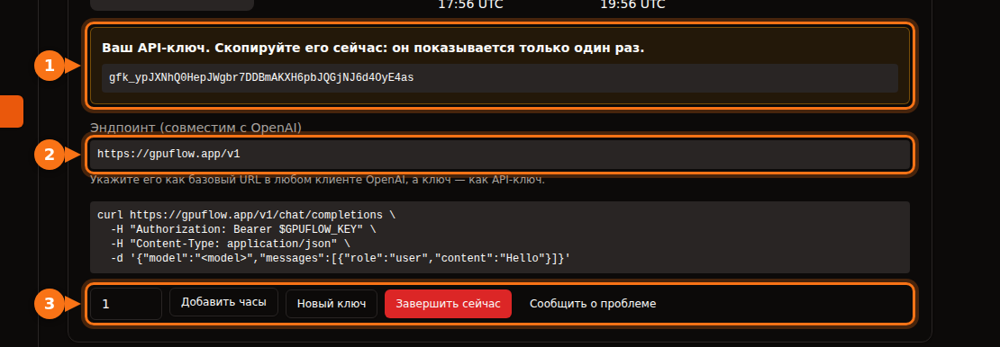

Многие инструменты для работы с ИИ позволяют заменить OpenAI другим провайдером, если он поддерживает такой же API. Для этого всегда нужны три вещи:

| Что | Пример |
| --- | --- |
| **Base URL** (он же API base, endpoint или host) | `https://gpuflow.app/v1` |
| **API-ключ** | `gfk_...` |
| **Имя модели** | `qwen2.5:7b` |

В качестве примера мы везде используем аренду на GPUFlow, но шаги те же для любого OpenAI-совместимого сервера: локальной Ollama или llama.cpp, vLLM, OpenRouter и многих других. Просто подставьте свои три значения.

На GPUFlow все три значения находятся на странице **Панель управления → Текущие аренды** после того, как вы арендуете GPU:



## Прежде чем начать: проверьте эндпоинт и имя модели

Одна команда покажет, работает ли ключ и как называется модель:

```bash
curl https://gpuflow.app/v1/models \
  -H "Authorization: Bearer gfk_your_key"
```

В ответе будет список моделей. Скопируйте `id`, например `qwen2.5:7b`, в точности как написано. Неправильное имя модели — самая частая причина, по которой приложение отказывается работать.

**Выясните, что поддерживает ваш эндпоинт.** Эндпоинт GPUFlow поддерживает `/v1/models` и `/v1/chat/completions` со стримингом. Эмбеддингов, более нового Responses API и генерации изображений в нём нет. Некоторым функциям приложений они нужны — ниже мы на это указываем.

## Чат-приложения

### Open WebUI

1. Откройте **Settings → Admin → Connections**.
2. В разделе **Manage OpenAI API Connections** нажмите **+ (Add Connection)**.
3. Заполните поля:
   - **URL:** `https://gpuflow.app/v1`
   - **API Key:** ваш ключ
4. Нажмите **Verify Connection**, чтобы проверить подключение (простое сохранение его не проверяет), затем **Save**.

Open WebUI сам загружает список моделей из `/models`. Если вы запускаете его в Docker, вместо этого можно задать `OPENAI_API_BASE_URL` и `OPENAI_API_KEY`, но они читаются только при первом запуске Open WebUI. Дальше меняйте их в админке.

Загрузка документов и поиск по ним в Open WebUI по умолчанию используют небольшую модель эмбеддингов, которая работает локально, так что они продолжат работать. Не переключайте движок эмбеддингов на OpenAI с вашим чат-эндпоинтом в качестве URL.

### LibreChat

Добавьте свой эндпоинт в `librechat.yaml`:

```yaml
endpoints:
  custom:
    - name: "GPUFlow"
      apiKey: "${GPUFLOW_API_KEY}"
      baseURL: "https://gpuflow.app/v1"
      models:
        default: ["qwen2.5:7b"]
        fetch: true
      titleConvo: true
      titleModel: "qwen2.5:7b"
      modelDisplayLabel: "GPUFlow"
```

Запишите ключ в `.env` как `GPUFLOW_API_KEY=gfk_...`. Если каждый пользователь должен вводить собственный ключ, укажите `apiKey: "user_provided"`. С `fetch: true` LibreChat загружает список моделей с эндпоинта.

Поиск по документам в LibreChat (RAG API) по умолчанию использует эмбеддинги OpenAI. Используйте для него OpenAI, Ollama или Hugging Face и не направляйте `RAG_OPENAI_BASEURL` на эндпоинт, который умеет только чат.

### AnythingLLM

1. Откройте настройки LLM и выберите **Generic OpenAI**.
2. Заполните **Base URL** (`https://gpuflow.app/v1`), **API Key**, **Chat Model Name** (`qwen2.5:7b`), **Token context window** и **Max Tokens**.

В Docker те же настройки задаются переменными окружения:

```bash
LLM_PROVIDER='generic-openai'
GENERIC_OPEN_AI_BASE_PATH='https://gpuflow.app/v1'
GENERIC_OPEN_AI_MODEL_PREF='qwen2.5:7b'
GENERIC_OPEN_AI_MODEL_TOKEN_LIMIT=32768
GENERIC_OPEN_AI_API_KEY=gfk_your_key
```

Эмбеддер оставьте на **AnythingLLM Default**.

### Jan

1. Откройте **Settings → Model Providers** и нажмите **Add Provider**.
2. Выберите **OpenAI-compatible**.
3. Введите название, **Base URL** с `/v1` на конце и ваш **API key**. Нажмите **Create**.

Jan загружает список моделей при сохранении. Если этого не произошло, добавьте имя модели вручную кнопкой **+** в списке моделей провайдера.

## Ассистенты для программирования

### Continue (VS Code и JetBrains)

Добавьте модель в `config.yaml`:

```yaml
models:
  - name: GPUFlow Qwen 2.5 7B
    provider: openai
    model: qwen2.5:7b
    apiBase: https://gpuflow.app/v1
    apiKey: ${{ secrets.GPUFLOW_API_KEY }}
    roles:
      - chat
      - edit
      - apply
```

Не назначайте ей роли `autocomplete` и `embed`: этот эндпоинт поддерживает только чат, а эмбеддингам нужен `/v1/embeddings`. В VS Code у Continue есть встроенный эмбеддер для поиска по кодовой базе. В JetBrains его нет, так что там подключите отдельную модель эмбеддингов.

Режиму Agent в Continue нужна модель, которая умеет вызывать инструменты. Добавляйте `capabilities: [tool_use]`, только если точно знаете, что ваша модель это умеет.

### Cline

1. Откройте настройки Cline.
2. В **API Provider** выберите **OpenAI Compatible**.
3. Заполните **Base URL**, **API Key** и **Model** (`qwen2.5:7b`).
4. В разделе **Model Configuration** укажите размер контекстного окна, [соответствующий вашей модели](/ru/which-ai-models-fit-your-gpu-vram/).

Отдельно о **Roo Code**: по его документации он работает только с моделями, которые нативно поддерживают вызов инструментов, и запасного варианта нет. С обычным чат-эндпоинтом он может не заработать.

## Код

### Библиотеки OpenAI для Python и Node

Python (`pip install openai`):

```python
from openai import OpenAI

client = OpenAI(base_url="https://gpuflow.app/v1", api_key="gfk_your_key")

reply = client.chat.completions.create(
    model="qwen2.5:7b",
    messages=[{"role": "user", "content": "Say hello in five languages."}],
)
print(reply.choices[0].message.content)
```

Node (`npm install openai`):

```js
import OpenAI from "openai";

const client = new OpenAI({ baseURL: "https://gpuflow.app/v1", apiKey: "gfk_your_key" });

const reply = await client.chat.completions.create({
  model: "qwen2.5:7b",
  messages: [{ role: "user", content: "Say hello in five languages." }],
});
console.log(reply.choices[0].message.content);
```

Обе библиотеки также читают `OPENAI_BASE_URL` и `OPENAI_API_KEY` из окружения. Обратите внимание: их README теперь начинаются с `client.responses.create(...)`. Это Responses API; используйте `client.chat.completions.create(...)`, как в примерах выше.

### LangChain

Python (`pip install -U langchain-openai`):

```python
from langchain_openai import ChatOpenAI

llm = ChatOpenAI(
    model="qwen2.5:7b",
    base_url="https://gpuflow.app/v1",
    api_key="gfk_your_key",
    use_responses_api=False,
)
print(llm.invoke("Name three uses for a GPU.").content)
```

JavaScript (`npm install @langchain/openai @langchain/core`). Сначала задайте ключ в окружении, `export OPENAI_API_KEY=gfk_your_key`, затем:

```js
import { ChatOpenAI } from "@langchain/openai";

const llm = new ChatOpenAI({
  model: "qwen2.5:7b",
  configuration: { baseURL: "https://gpuflow.app/v1" },
});
```

LangChain переключается на Responses API, когда вы используете некоторые функции, например встроенные инструменты или вывод рассуждений. `use_responses_api=False` оставляет его на Chat Completions.

### LlamaIndex

Используйте `OpenAILike` (`pip install llama-index-llms-openai-like`):

```python
from llama_index.llms.openai_like import OpenAILike

llm = OpenAILike(
    model="qwen2.5:7b",
    api_base="https://gpuflow.app/v1",
    api_key="gfk_your_key",
    context_window=32768,
    is_chat_model=True,
    is_function_calling_model=False,
)
```

**Укажите `is_chat_model=True`.** По умолчанию там `False`, и тогда запросы уходят на `/v1/completions` вместо `/v1/chat/completions`. Для индексации документов задайте в `Settings.embed_model` настоящую модель эмбеддингов: по умолчанию LlamaIndex использует эмбеддинги OpenAI.

## Инструменты, которые не заработают с эндпоинтом только для чата

- **Codex CLI.** В начале 2026 года он отказался от поддержки Chat Completions и теперь работает только с Responses API.
- **OpenAI Agents SDK.** По умолчанию использует Responses API. Вызовите `set_default_openai_api("chat_completions")` или оберните клиент в `OpenAIChatCompletionsModel` и отключите трассировку через `set_tracing_disabled(True)`: для трассировки нужен ключ OpenAI.
- **Всё, чему нужны эмбеддинги** с того же эндпоинта: поиск по документам, «чат с вашими файлами», семантический поиск по коду. Используйте встроенный эмбеддер приложения или отдельного провайдера эмбеддингов.

## Если всё равно не работает

| Что вы видите | Обычная причина |
| --- | --- |
| `404` или «not found» | В base URL не хватает `/v1`, или приложение само добавляет `/v1`, а вы добавили его ещё раз. |
| `401` или `invalid_api_key` | Неверный ключ или аренда уже закончилась. Если на GPUFlow вы потеряли ключ, нажмите **Новый ключ** на странице «Текущие аренды». |
| «Model not found» | Имя модели не совпадает в точности с тем, что возвращает `/v1/models`. |
| Запросы к `/v1/completions` или `/v1/responses` завершаются ошибкой | Приложение использует другой API. Поищите настройку вроде «chat model» или «chat completions». |

## Похожие статьи

- [Почасовой GPU или оплата за токены? Сколько на самом деле стоит запуск модели на 7B–8B](/ru/hourly-gpu-vs-per-token-api/)
- [GPUFlow, Vast.ai, RunPod и SaladCloud: что подойдёт под вашу задачу](/ru/gpuflow-vs-vast-ai-vs-runpod/)

## Источники

Всё проверено в сентябре 2026 года.

- Open WebUI: [OpenAI-совместимые провайдеры](https://docs.openwebui.com/getting-started/quick-start/connect-a-provider/starting-with-openai-compatible/), [переменные окружения](https://docs.openwebui.com/reference/env-configuration)
- LibreChat: [собственные эндпоинты](https://www.librechat.ai/docs/configuration/librechat_yaml/object_structure/custom_endpoint), [RAG API](https://www.librechat.ai/docs/configuration/rag_api)
- AnythingLLM: [Generic OpenAI](https://docs.anythingllm.com/setup/llm-configuration/cloud/openai-generic)
- Jan: [собственные эндпоинты](https://www.jan.ai/docs/desktop/remote-models/custom-endpoint)
- Continue: [провайдер OpenAI](https://docs.continue.dev/customize/model-providers/top-level/openai), [справочник по конфигурации](https://docs.continue.dev/reference)
- Cline: [OpenAI Compatible](https://docs.cline.bot/provider-config/openai-compatible); Roo Code: [OpenAI Compatible](https://roocodeinc.github.io/Roo-Code/providers/openai-compatible/)
- Библиотеки OpenAI: [openai-python](https://github.com/openai/openai-python), [openai-node](https://github.com/openai/openai-node)
- LangChain: [Python](https://docs.langchain.com/oss/python/integrations/chat/openai), [JavaScript](https://docs.langchain.com/oss/javascript/integrations/chat/openai)
- LlamaIndex: [OpenAILike](https://developers.llamaindex.ai/python/framework-api-reference/llms/openai_like/)
- OpenAI Agents SDK: [модели](https://openai.github.io/openai-agents-python/models/)
- Codex и Chat Completions: [github.com/openai/codex/discussions/7782](https://github.com/openai/codex/discussions/7782)
- API GPUFlow: [Как пользоваться API-ключом](https://docs.gpuflow.app/ru/renters/api-quickstart/)
