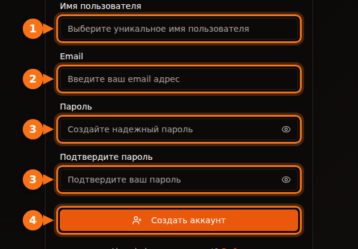
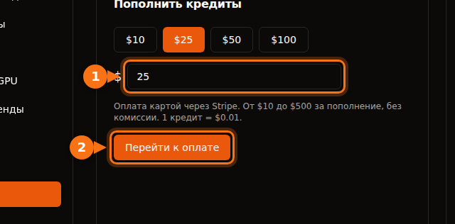

Прежде чем вы арендуете первый GPU, любая платформа что-нибудь попросит: адрес электронной почты, карту, иногда номер телефона, а в крупных облаках — ещё и запрос квоты, который может занять несколько дней. В этой статье собрано, что требует каждая из них, чтобы вы могли выбрать ту, с которой получится начать уже сегодня.

Всё проверено в сентябре 2026 года по документации самих платформ. Источники — в конце.

## Краткое сравнение

| Платформа | Чтобы создать аккаунт | Прежде чем арендовать | Проверка личности арендатора | Минимум для старта |
| --- | --- | --- | --- | --- |
| **GPUFlow** | Email и пароль или вход через Google или GitHub | Подтвердить email, пополнить кредиты картой | В шагах для арендатора нет | Пополнение $10, без комиссии |
| **Vast.ai** | Email | Подтвердить email, пополнить баланс | В документации нет | Депозит $5 |
| **RunPod** | Email | Пополнить баланс | Только перед первым криптоплатежом | Баланс на 1 час; $100 за транзакцию с предоплаченной карты |
| **SaladCloud** | Аккаунт в портале | Добавить способ оплаты в организацию | В документации нет | Пополнение от $5 |
| **Lambda** | Аккаунт | Добавить кредитную карту | В документации нет | Предавторизация $10 на карте, возвращается |
| **TensorDock** | Аккаунт | Внести деньги | Условия допускают проверку аккаунта | «Всего от $5» |
| **AWS** | Email, проверка телефона по PIN-коду, способ оплаты, CAPTCHA | Запросить квоту на GPU: у новых аккаунтов она нулевая | Для большинства аккаунтов нет | Оплата по факту использования |
| **Google Cloud** | Аккаунт с настроенной оплатой | Запросить квоту на GPU; у аккаунтов с бесплатным пробным периодом её нет | Для большинства аккаунтов нет | Оплата по факту использования |

«В документации нет» означает, что мы не нашли в документации платформы требования подтверждать личность арендатора. Проверку всё равно могут запросить, если что-то покажется подозрительным.

## Небольшие платформы: минуты, а не дни

Vast.ai, RunPod, SaladCloud, TensorDock и GPUFlow работают по предоплате. Сначала вы вносите деньги, потом тратите их посекундно или поминутно. Уйти в минус там нельзя, поэтому проверять вашу кредитную историю или компанию им незачем.

Чем они различаются:

- **Подтверждение email.** Vast.ai и GPUFlow требуют его, прежде чем вы сможете арендовать или пополнить баланс. Если письмо не пришло, проверьте папку «Спам».
- **Способы оплаты.**
  - Vast.ai: карта, BitPay, Crypto.com.
  - RunPod: Visa, Mastercard, Amex, криптовалюта и оплата по счёту для платежей больше $5000.
  - SaladCloud: карта или USDC, USDT и RENDER в сети Solana.
  - Lambda: только основные кредитные карты и только в поддерживаемых странах.
  - GPUFlow: карты через Stripe.
- **Что будет с неиспользованными деньгами.** Кредит SaladCloud сгорает через 12 месяцев после покупки. У кредитов GPUFlow нет срока действия.

## Крупные облака: готовьтесь запрашивать квоту

Зарегистрироваться в AWS и Google Cloud несложно. Застревают на другом этапе — когда пытаются получить GPU.

- **AWS:** квота «Running On-Demand G and VT instances» (семейство инстансов с NVIDIA L4 и A10G) в новых аккаунтах равна **0 vCPU**. Увеличение запрашивается в консоли Service Quotas. Кроме того, AWS автоматически поднимает квоты по мере того, как у аккаунта накапливается история использования.
- **Google Cloud:** у аккаунтов с бесплатным пробным периодом квоты на GPU нет. Когда у проекта появляется история платежей, запросы квоты одобряют охотнее. Квота действует в пределах региона, а для прерываемых (preemptible) GPU нужна отдельная квота.

Если GPU нужен сегодня, не начинайте с нового аккаунта AWS или Google Cloud.

## Регистрация на GPUFlow по шагам

GPUFlow создан для ситуации «мне нужна модель ИИ через пять минут». Вы получаете OpenAI-совместимый API-ключ к GPU, а не машину.

1. **Создайте аккаунт** на gpuflow.app: укажите имя пользователя, адрес электронной почты и пароль или войдите через Google или GitHub.

   

2. **Подтвердите адрес электронной почты.** Перейдите по ссылке из письма, которое пришлёт GPUFlow. Пока вы этого не сделаете, пополнить кредиты нельзя.
3. **Пополните кредиты** на странице **Панель управления → Платежи**: от $10 до $500 картой через Stripe. 1 кредит = $0,01, комиссии нет.

   

4. **Арендуйте GPU** на нужное число часов и скопируйте API-ключ. Оплата посекундная; если закончите раньше, остаток вернётся в кредиты.

Полное руководство со всеми экранами — в документации: [аренда GPU по шагам](https://docs.gpuflow.app/ru/renters/getting-started/).

## Если вы хотите, наоборот, сдавать GPU в аренду

Проверка личности нужна там, где деньги платят вам. Платёжные компании обязаны знать, кому они отправляют деньги.

- **GPUFlow:** чтобы выводить деньги, вы настраиваете аккаунт для выплат в Stripe, который проверяет вашу личность и запрашивает банковские реквизиты. Выплаты доступны в США, Канаде, Великобритании, Швейцарии и Европейской экономической зоне.
- **Vast.ai:** хостам платят через Wise, PayPal или Stripe, и проверку личности проводят эти сервисы.
- **Salad:** вознаграждения выдаются через PayPal, подарочными картами и другими способами.

Сколько приносит хостинг, мы разобрали в статье [«Сколько можно заработать, сдавая видеокарту в аренду»](/ru/how-much-can-you-earn-renting-out-your-gpu/).

## Прежде чем платить: короткий чек-лист

1. **Сначала подтвердите email**, чтобы не застрять на шаге оплаты.
2. **Убедитесь, что ваша страна и карта поддерживаются.** Lambda, например, принимает платежи только из определённого списка стран.
3. **Узнайте комиссию своего банка за операции в иностранной валюте.** Большинство платформ выставляют счета в долларах США. [Подробнее о скрытых расходах](/ru/hidden-fees-in-gpu-rental/).
4. **Начните с малого.** Пополните баланс на несколько часов, протестируйте, потом добавьте ещё.

## Похожие статьи

- [GPUFlow, Vast.ai, RunPod и SaladCloud: что подойдёт под вашу задачу](/ru/gpuflow-vs-vast-ai-vs-runpod/)
- [Как использовать OpenAI-совместимый API-ключ в Open WebUI, Continue, LangChain и других инструментах](/ru/use-openai-compatible-api-key-in-apps/)

## Источники

Всё проверено в сентябре 2026 года.

- GPUFlow: [аренда GPU по шагам](https://docs.gpuflow.app/ru/renters/getting-started/), [кредиты и оплата](https://docs.gpuflow.app/ru/renters/billing/), [получение выплат](https://docs.gpuflow.app/ru/providers/getting-paid/)
- Vast.ai: [быстрый старт](https://docs.vast.ai/guides/get-started/quickstart.md), [оплата](https://docs.vast.ai/documentation/reference/billing), [выплаты хостам](https://docs.vast.ai/host/payment.md)
- RunPod: [информация об оплате](https://docs.runpod.io/references/billing-information)
- SaladCloud: [настройка аккаунта](https://docs.salad.com/general/tutorials/account-setup.md), [оплата](https://docs.salad.com/general/explanation/billing.md)
- Lambda: [управление оплатой](https://docs.lambda.ai/public-cloud/manage-billing/)
- TensorDock: [облачные GPU](https://www.tensordock.com/cloud-gpus.html), [условия использования](https://docs.tensordock.com/legal-information/terms-of-service-tos)
- AWS: [создание аккаунта](https://docs.aws.amazon.com/accounts/latest/reference/manage-acct-creating.html), [квоты на On-Demand-инстансы](https://docs.aws.amazon.com/AWSEC2/latest/UserGuide/ec2-on-demand-instances.html)
- Google Cloud: [решение проблем с квотой на GPU](https://docs.cloud.google.com/deep-learning-vm/docs/troubleshooting)
- Вознаграждения Salad: [вывод через PayPal](https://support.salad.com/rewards/redeeming-your-rewards/how-to-redeem-paypal/)
