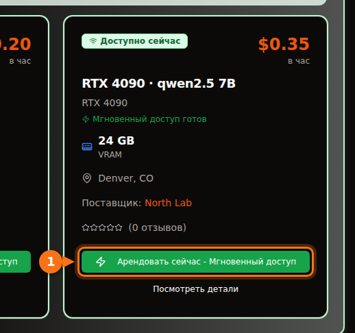

В 4-битной квантизации, которую Ollama ставит по умолчанию, модели на 7B или 8B нужна карта на 8 ГБ, моделям на 12B–14B — на 12 ГБ (или на 16 ГБ, если нужны длинные промпты), моделям на 27B–32B — на 24 ГБ. Модель на 70B в 4 битах весит 43 ГБ, то есть ей нужно 48 ГБ видеопамяти или больше.

Подробности важны, потому что размер загрузки — это ещё не весь счёт. Контекст тоже занимает память, и модель, которая вроде бы помещается, может наполовину уехать на CPU и работать в несколько раз медленнее. Ниже — формула, которой я пользуюсь, расшифровка обозначений квантизации и таблица актуальных открытых моделей с реальными размерами загрузки из библиотеки Ollama. Размеры и характеристики проверены в сентябре 2026 года, источники — в конце.

## Короткий ответ по объёму VRAM

| VRAM | Типичные карты | Что целиком работает на GPU (4 бита) |
| --- | --- | --- |
| 8 ГБ | RTX 4060, RTX 5060, RTX 3070 | Модели на 7B–8B: Llama 3.1 8B, Qwen3 8B, Mistral 7B |
| 12 ГБ | RTX 3060 12 ГБ, RTX 4070, RTX 5070 | Модели на 12B–14B с коротким контекстом; 7B–8B в Q8_0 |
| 16 ГБ | RTX 4060 Ti 16 ГБ, RTX 4080, RTX 5080 | 14B с длинным контекстом, gpt-oss 20B |
| 24 ГБ | RTX 3090, RTX 4090 | 24B–32B: Mistral Small 3.2, Gemma 3 27B, Qwen3 32B |
| 32 ГБ | RTX 5090 | 32B с длинным контекстом, MoE-модели на 35B |
| 48–80 ГБ | L40S (48 ГБ), H100 (80 ГБ) | 70B в 4 битах, gpt-oss 120B на 80 ГБ |

Объёмы памяти взяты со страниц характеристик NVIDIA. Некоторые карты выпускаются в двух вариантах: RTX 3060 бывает на 12 и на 8 ГБ, RTX 4060 Ti и RTX 5060 Ti — на 16 и на 8 ГБ. Проверяйте, какую именно вы покупаете или арендуете.

## Как оценить, сколько VRAM нужно модели

Пока модель вам отвечает, в памяти GPU лежат три вещи:

1. **Веса.** Параметры × бит на вес ÷ 8 = байты.
2. **KV-кэш.** Модель хранит ключи и значения каждого токена разговора, чтобы не пересчитывать их заново. На один токен это 2 × слои × KV-головы × размер головы × 2 байта (при стандартном 16-битном кэше). Умножьте на длину контекста.
3. **Накладные расходы.** Контекст CUDA, рабочие буферы и сама среда выполнения. Я закладываю около 1 ГБ. Цифра зависит от движка и настроек, так что это эмпирическое правило, а не спецификация.

Число слоёв и голов есть в `config.json` каждой модели на Hugging Face.

### Пример расчёта: Qwen 2.5 14B на карте с 16 ГБ

У Qwen 2.5 14B 14,7 млрд параметров, 48 слоёв, 8 KV-голов и размер головы 128 (скрытый размер 5120 ÷ 40 голов внимания).

- **Веса в Q4_K_M:** по данным llama.cpp, Q4_K_M — это около 4,89 бита на вес. 14,7 млрд × 4,89 ÷ 8 = 8,99 ГБ. Загрузка `qwen2.5:14b` в Ollama весит 9,0 ГБ, так что арифметика сходится с реальным файлом.
- **KV-кэш на токен:** 2 × 48 × 8 × 128 × 2 байта = 196 608 байт, около 0,2 МБ.
- **KV-кэш на весь контекст:** 4096 токенов = 0,8 ГБ. 16 384 токена = 3,2 ГБ. 32 768 токенов = 6,4 ГБ.
- **Итого:** 9,0 + 0,8 + 1 = 10,8 ГБ при контексте 4K. 9,0 + 3,2 + 1 = 13,2 ГБ при 16K. 9,0 + 6,4 + 1 = 16,4 ГБ при 32K — это уже не помещается в карту на 16 ГБ.

<figure>
<svg viewBox="0 0 720 340" role="img" aria-labelledby="d1-title" xmlns="http://www.w3.org/2000/svg" font-family="system-ui, sans-serif" font-size="15">
<title id="d1-title">Чем заполнена VRAM при запуске Qwen 2.5 14B в Q4_K_M на карте с 16 GB: веса, KV-кэш при трёх длинах контекста и накладные расходы</title>
<rect x="0" y="0" width="720" height="340" fill="#ffffff"/>
<rect x="150" y="20" width="16" height="16" rx="3" fill="#6366f1"/>
<text x="172" y="33" fill="#1e1b4b">Веса 9.0 GB</text>
<rect x="330" y="20" width="16" height="16" rx="3" fill="#a5b4fc"/>
<text x="352" y="33" fill="#1e1b4b">KV-кэш</text>
<rect x="510" y="20" width="16" height="16" rx="3" fill="#e2e8f0"/>
<text x="532" y="33" fill="#1e1b4b">Накладные ~1 GB</text>
<line x1="582.0" y1="66" x2="582.0" y2="278" stroke="#f97316" stroke-width="2" stroke-dasharray="5 4"/>
<text x="576.0" y="60" text-anchor="end" fill="#f97316" font-weight="600">Карта 16 GB</text>
<text x="140" y="106" text-anchor="end" fill="#1e1b4b">Контекст 4K</text>
<rect x="150" y="80" width="243.0" height="40" fill="#6366f1"/>
<text x="271.5" y="106" text-anchor="middle" fill="#ffffff">веса</text>
<rect x="393.0" y="80" width="21.6" height="40" fill="#a5b4fc"/>
<rect x="414.6" y="80" width="27.0" height="40" fill="#e2e8f0"/>
<text x="449.6" y="106" fill="#16a34a" font-weight="600">10.8 GB</text>
<text x="140" y="180" text-anchor="end" fill="#1e1b4b">Контекст 16K</text>
<rect x="150" y="154" width="243.0" height="40" fill="#6366f1"/>
<text x="271.5" y="180" text-anchor="middle" fill="#ffffff">веса</text>
<rect x="393.0" y="154" width="86.4" height="40" fill="#a5b4fc"/>
<text x="436.2" y="180" text-anchor="middle" fill="#1e1b4b">3.2</text>
<rect x="479.4" y="154" width="27.0" height="40" fill="#e2e8f0"/>
<text x="514.4" y="180" fill="#16a34a" font-weight="600">13.2 GB</text>
<text x="140" y="254" text-anchor="end" fill="#1e1b4b">Контекст 32K</text>
<rect x="150" y="228" width="243.0" height="40" fill="#6366f1"/>
<text x="271.5" y="254" text-anchor="middle" fill="#ffffff">веса</text>
<rect x="393.0" y="228" width="172.8" height="40" fill="#a5b4fc"/>
<text x="479.4" y="254" text-anchor="middle" fill="#1e1b4b">6.4</text>
<rect x="565.8" y="228" width="27.0" height="40" fill="#e2e8f0"/>
<text x="600.8" y="254" fill="#f97316" font-weight="600">16.4 GB</text>
<line x1="150" y1="278" x2="690" y2="278" stroke="#64748b"/>
<line x1="150.0" y1="278" x2="150.0" y2="283" stroke="#64748b"/>
<text x="150.0" y="300" text-anchor="middle" fill="#64748b">0</text>
<line x1="258.0" y1="278" x2="258.0" y2="283" stroke="#64748b"/>
<text x="258.0" y="300" text-anchor="middle" fill="#64748b">4</text>
<line x1="366.0" y1="278" x2="366.0" y2="283" stroke="#64748b"/>
<text x="366.0" y="300" text-anchor="middle" fill="#64748b">8</text>
<line x1="474.0" y1="278" x2="474.0" y2="283" stroke="#64748b"/>
<text x="474.0" y="300" text-anchor="middle" fill="#64748b">12</text>
<line x1="582.0" y1="278" x2="582.0" y2="283" stroke="#64748b"/>
<text x="582.0" y="300" text-anchor="middle" fill="#64748b">16</text>
<line x1="690.0" y1="278" x2="690.0" y2="283" stroke="#64748b"/>
<text x="690.0" y="300" text-anchor="middle" fill="#64748b">20</text>
<text x="420.0" y="326" text-anchor="middle" fill="#64748b">Видеопамять, GB</text>
</svg>
<figcaption>Qwen 2.5 14B в Q4_K_M на карте с 16 ГБ. Веса неизменно занимают 9,0 ГБ, а KV-кэш растёт вместе с контекстом, пока при 32K токенов сумма не превысит 16 ГБ. Накладные расходы взяты по эмпирическому правилу — 1 ГБ.</figcaption>
</figure>

Отсюда следуют два вывода. Во-первых, выбранный контекст может съесть столько же памяти, сколько сама модель. Llama 3.1 8B (32 слоя, 8 KV-голов, размер головы 128) требует 131 072 байта KV-кэша на токен, так что её полный контекст на 128K потребовал бы 17,2 ГБ только под кэш — примерно в три с половиной раза больше, чем её загрузка в 4,9 ГБ. Во-вторых, размер KV-кэша на токен сильно отличается от модели к модели. У Qwen 2.5 7B всего 4 KV-головы и 28 слоёв, поэтому ей нужно 57 344 байта на токен — меньше половины от Llama 3.1 8B. Прежде чем что-то предполагать, загляните в конфиг.

### Какой контекст Ollama выставляет по умолчанию

Ollama выбирает длину контекста по умолчанию в зависимости от найденной VRAM: 4K токенов при объёме меньше 24 ГиБ, 32K — от 24 до 48 ГиБ и 256K — от 48 ГиБ. Изменить её можно переменной окружения `OLLAMA_CONTEXT_LENGTH`, а `ollama ps` показывает фактически выделенный контекст в столбце CONTEXT. Ещё две настройки меняют расчёт:

- `OLLAMA_NUM_PARALLEL` (по умолчанию 1): в документации Ollama сказано, что параллельные запросы увеличивают размер контекста пропорционально их числу. Четыре параллельных слота — это вчетверо больший KV-кэш.
- `OLLAMA_KV_CACHE_TYPE`: `q8_0` занимает примерно половину памяти стандартного кэша `f16`, `q4_0` — примерно четверть. Для этого нужно включить flash attention.

## Что означают уровни квантизации

Открытые модели публикуются в 16-битной точности (в конфигах по ссылкам ниже указан bfloat16): два байта на параметр. Квантизация хранит веса в меньшем числе бит. В файлах GGUF — формате, который используют Ollama и llama.cpp, — обозначения значат примерно следующее:

| Обозначение | Бит на вес | Размер Llama 3.1 8B | Перплексия на Llama 3 8B (меньше — лучше) |
| --- | --- | --- | --- |
| F16 | 16,0 | 14,96 ГиБ | 6,233 |
| Q8_0 | 8,50 | 7,95 ГиБ | 6,234 |
| Q6_K | 6,56 | 6,14 ГиБ | 6,253 |
| Q5_K_M | 5,70 | 5,33 ГиБ | 6,289 |
| Q4_K_M | 4,89 | 4,58 ГиБ | 6,407 |
| Q3_K_M | 4,00 | 3,74 ГиБ | 6,888 |
| Q2_K_S / Q2_K | 2,97 | 2,78 ГиБ | 9,752 (Q2_K) |

Число бит на вес и размеры взяты из README утилиты quantize в llama.cpp (Llama 3.1 8B). Перплексия — из README утилиты perplexity в llama.cpp (Llama 3 8B, Wikitext). Типы с «K» — это k-кванты llama.cpp, которые смешивают разную точность в разных частях модели; `_S`, `_M` и `_L` — малый, средний и большой варианты смеси.

Что говорят цифры: Q8_0 практически не теряет качества (перплексия 6,234 против 6,233). Q4_K_M ухудшает перплексию примерно на 3%, и в том же README сказано, что её самый вероятный следующий токен совпадает с моделью полной точности в 91,9% случаев. Q3 заметно хуже, а Q2 разваливается.

Перплексия — не то же самое, что полезность, поэтому хорошо, что в январе 2026 года Уйгар Курт (Uygar Kurt) прогнал Llama 3.1 8B Instruct на всех уровнях llama.cpp через бенчмарки на рассуждения, знания, следование инструкциям и правдивость. Невзвешенное среднее составило 69,47 в F16, 69,41 в Q8_0, 69,36 в Q5_K_M и 69,15 в Q4_K_M. Именно поэтому почти все, включая Ollama, по умолчанию используют Q4_K_M: файл меньше трети от FP16, а потери вы редко заметите. В Ollama тег без уточнений — это и есть 4-битная сборка: `qwen3:8b` и `qwen3:8b-q4_K_M` весят по 5,2 ГБ, `phi4:14b` и `phi4:14b-q4_K_M` — по 9,1 ГБ.

Моё правило: сначала берите самую большую модель, которая помещается в Q4_K_M, и только потом — модель поменьше в Q8_0. 14B в Q4 обычно лучше 7B в Q8, а файлы примерно одного размера. Переходите на Q5 или Q8, когда остаётся свободная память, а задача чувствительна к мелким ошибкам, например код или точное извлечение данных.

В новых тегах Ollama встречаются и другие форматы: `qat` (сборки Gemma, обученные с учётом квантизации), `nvfp4` и `mxfp8`. gpt-oss сама OpenAI выпускает в MXFP4 — 4,25 бита на параметр для весов экспертов.

## Какие модели помещаются: размеры и уровни VRAM

В таблице — актуальные открытые модели из библиотеки Ollama на сентябрь 2026 года с размерами загрузки. Столбец «4 бита» — это размер тега по умолчанию. Для большинства моделей это тот же файл, что и тег `q4_K_M`; если по умолчанию идёт другая сборка, в таблице указаны оба размера (у Mistral Nemo по умолчанию 7,1 ГБ, а `q4_K_M` — 7,5 ГБ). «Минимальная карта» означает, что модель плюс около 1 ГБ накладных расходов плюс контекст на 4K–8K целиком помещаются на GPU. Нужен длинный контекст — берите уровень выше.

| Модель | Тег Ollama | Размер, 4 бита | Размер, Q8_0 | Минимальная карта (4 бита / Q8_0) |
| --- | --- | --- | --- | --- |
| Mistral 7B v0.3 | [`mistral:7b`](https://ollama.com/library/mistral/tags) | 4,4 ГБ | 7,7 ГБ | 8 ГБ / 12 ГБ |
| Qwen 2.5 7B | [`qwen2.5:7b`](https://ollama.com/library/qwen2.5/tags) | 4,7 ГБ | 8,1 ГБ | 8 ГБ / 12 ГБ |
| DeepSeek-R1 distill 7B (Qwen 2.5) | [`deepseek-r1:7b`](https://ollama.com/library/deepseek-r1/tags) | 4,7 ГБ | не проверяли | 8 ГБ |
| Llama 3.1 8B | [`llama3.1:8b`](https://ollama.com/library/llama3.1/tags) | 4,9 ГБ | 8,5 ГБ | 8 ГБ / 12 ГБ |
| Qwen3 8B | [`qwen3:8b`](https://ollama.com/library/qwen3/tags) | 5,2 ГБ | 8,9 ГБ | 8 ГБ / 12 ГБ |
| DeepSeek-R1-0528 (Qwen3 8B) | [`deepseek-r1:8b`](https://ollama.com/library/deepseek-r1/tags) | 5,2 ГБ | не проверяли | 8 ГБ |
| Qwen3.5 9B | [`qwen3.5:9b`](https://ollama.com/library/qwen3.5/tags) | 6,6 ГБ | 11 ГБ | 8 ГБ, только с коротким контекстом / 16 ГБ |
| Mistral Nemo 12B | [`mistral-nemo:12b`](https://ollama.com/library/mistral-nemo/tags) | 7,1 ГБ (q4_K_M: 7,5 ГБ) | 13 ГБ | 12 ГБ / 16 ГБ |
| Gemma 4 12B | [`gemma4:12b`](https://ollama.com/library/gemma4/tags) | 7,6 ГБ | 13 ГБ | 12 ГБ / 16 ГБ |
| Gemma 3 12B | [`gemma3:12b`](https://ollama.com/library/gemma3/tags) | 8,1 ГБ | 13 ГБ | 12 ГБ / 16 ГБ |
| Qwen 2.5 14B | [`qwen2.5:14b`](https://ollama.com/library/qwen2.5/tags) | 9,0 ГБ | 16 ГБ | 12 ГБ / 24 ГБ |
| DeepSeek-R1 distill 14B (Qwen 2.5) | [`deepseek-r1:14b`](https://ollama.com/library/deepseek-r1/tags) | 9,0 ГБ | не проверяли | 12 ГБ |
| Phi-4 14B | [`phi4:14b`](https://ollama.com/library/phi4/tags) | 9,1 ГБ | 16 ГБ | 12 ГБ / 24 ГБ |
| Qwen3 14B | [`qwen3:14b`](https://ollama.com/library/qwen3/tags) | 9,3 ГБ | 16 ГБ | 12 ГБ / 24 ГБ |
| gpt-oss 20B (MoE) | [`gpt-oss:20b`](https://ollama.com/library/gpt-oss/tags) | 14 ГБ (MXFP4) | н/д | 16 ГБ |
| Mistral Small 3.2 24B | [`mistral-small3.2:24b`](https://ollama.com/library/mistral-small3.2/tags) | 15 ГБ | 26 ГБ | 24 ГБ / 32 ГБ |
| Gemma 3 27B | [`gemma3:27b`](https://ollama.com/library/gemma3/tags) | 17 ГБ | 30 ГБ | 24 ГБ / 48 ГБ |
| Qwen3.5 27B | [`qwen3.5:27b`](https://ollama.com/library/qwen3.5/tags) | 17 ГБ | 30 ГБ | 24 ГБ / 48 ГБ |
| Qwen3.6 27B | [`qwen3.6:27b`](https://ollama.com/library/qwen3.6/tags) | 18 ГБ (q4_K_M: 17 ГБ) | 30 ГБ | 24 ГБ / 48 ГБ |
| Gemma 4 26B (MoE, 3,8B активных) | [`gemma4:26b`](https://ollama.com/library/gemma4/tags) | 19 ГБ (q4_K_M: 18 ГБ) | 28 ГБ | 24 ГБ / 32 ГБ |
| Qwen3 30B-A3B (MoE) | [`qwen3:30b`](https://ollama.com/library/qwen3/tags) | 19 ГБ | не проверяли | 24 ГБ |
| Gemma 4 31B | [`gemma4:31b`](https://ollama.com/library/gemma4/tags) | 20 ГБ | 34 ГБ | 24 ГБ / 48 ГБ |
| Qwen3 32B | [`qwen3:32b`](https://ollama.com/library/qwen3/tags) | 20 ГБ | 35 ГБ | 24 ГБ / 48 ГБ |
| Qwen 2.5 32B | [`qwen2.5:32b`](https://ollama.com/library/qwen2.5/tags) | 20 ГБ | 35 ГБ | 24 ГБ / 48 ГБ |
| DeepSeek-R1 distill 32B (Qwen 2.5) | [`deepseek-r1:32b`](https://ollama.com/library/deepseek-r1/tags) | 20 ГБ | не проверяли | 24 ГБ |
| Qwen3.6 35B-A3B (MoE) | [`qwen3.6:35b`](https://ollama.com/library/qwen3.6/tags) | 23 ГБ (q4_K_M: 24 ГБ) | 39 ГБ | 32 ГБ / 48 ГБ |
| Qwen3.5 35B-A3B (MoE) | [`qwen3.5:35b`](https://ollama.com/library/qwen3.5/tags) | 24 ГБ | 39 ГБ | 32 ГБ / 48 ГБ |
| Llama 3.3 70B | [`llama3.3:70b`](https://ollama.com/library/llama3.3/tags) | 43 ГБ | 75 ГБ | 48 ГБ, впритык / 80 ГБ, впритык |
| Qwen 2.5 72B | [`qwen2.5:72b`](https://ollama.com/library/qwen2.5/tags) | 47 ГБ | не проверяли | 80 ГБ |
| gpt-oss 120B (MoE) | [`gpt-oss:120b`](https://ollama.com/library/gpt-oss/tags) | 65 ГБ (MXFP4) | н/д | 80 ГБ |

Уровень я определял по размеру тега по умолчанию, потому что именно его скачивает `ollama pull` с коротким именем.

У уровней 24 и 32 ГБ есть подвох. Контекст Ollama по умолчанию прыгает с 4K до 32K на отметке 24 ГиБ, поэтому модели на 20 ГБ на RTX 4090 может достаться кэш на 32K, который рядом с ней уже не помещается. Если `ollama ps` показывает долю CPU, уменьшите контекст. И не судите о модели по числу в названии: edge-модель Gemma 4 `gemma4:e4b` (4,5B эффективных параметров) весит 9,6 ГБ — больше, чем `gemma4:12b` с её 7,6 ГБ. Смотрите на размер.

<figure>
<svg viewBox="0 0 720 546" role="img" aria-labelledby="d2-title" xmlns="http://www.w3.org/2000/svg" font-family="system-ui, sans-serif" font-size="14">
<title id="d2-title">Размер загрузки популярных моделей Ollama в 4-битной квантизации по умолчанию в сравнении с 8, 12, 16, 24 и 32 GB видеопамяти</title>
<rect x="0" y="0" width="720" height="546" fill="#ffffff"/>
<line x1="320.0" y1="58" x2="320.0" y2="486" stroke="#f97316" stroke-width="2" stroke-dasharray="5 4"/>
<text x="320.0" y="50" text-anchor="middle" fill="#f97316" font-weight="600">8 GB</text>
<line x1="380.0" y1="58" x2="380.0" y2="486" stroke="#f97316" stroke-width="2" stroke-dasharray="5 4"/>
<text x="380.0" y="50" text-anchor="middle" fill="#f97316" font-weight="600">12 GB</text>
<line x1="440.0" y1="58" x2="440.0" y2="486" stroke="#f97316" stroke-width="2" stroke-dasharray="5 4"/>
<text x="440.0" y="50" text-anchor="middle" fill="#f97316" font-weight="600">16 GB</text>
<line x1="560.0" y1="58" x2="560.0" y2="486" stroke="#f97316" stroke-width="2" stroke-dasharray="5 4"/>
<text x="560.0" y="50" text-anchor="middle" fill="#f97316" font-weight="600">24 GB</text>
<line x1="680.0" y1="58" x2="680.0" y2="486" stroke="#f97316" stroke-width="2" stroke-dasharray="5 4"/>
<text x="680.0" y="50" text-anchor="middle" fill="#f97316" font-weight="600">32 GB</text>
<text x="20" y="50" fill="#64748b">Объём VRAM</text>
<text x="190" y="84" text-anchor="end" fill="#1e1b4b">mistral:7b</text>
<rect x="200" y="70" width="66.0" height="18" rx="3" fill="#6366f1"/>
<text x="272.0" y="84" fill="#1e1b4b">4.4</text>
<text x="190" y="110" text-anchor="end" fill="#1e1b4b">qwen2.5:7b</text>
<rect x="200" y="96" width="70.5" height="18" rx="3" fill="#6366f1"/>
<text x="276.5" y="110" fill="#1e1b4b">4.7</text>
<text x="190" y="136" text-anchor="end" fill="#1e1b4b">llama3.1:8b</text>
<rect x="200" y="122" width="73.5" height="18" rx="3" fill="#6366f1"/>
<text x="279.5" y="136" fill="#1e1b4b">4.9</text>
<text x="190" y="162" text-anchor="end" fill="#1e1b4b">qwen3:8b</text>
<rect x="200" y="148" width="78.0" height="18" rx="3" fill="#6366f1"/>
<text x="284.0" y="162" fill="#1e1b4b">5.2</text>
<text x="190" y="188" text-anchor="end" fill="#1e1b4b">qwen3.5:9b</text>
<rect x="200" y="174" width="99.0" height="18" rx="3" fill="#6366f1"/>
<text x="297.0" y="188" text-anchor="end" fill="#ffffff">6.6</text>
<text x="190" y="214" text-anchor="end" fill="#1e1b4b">gemma4:12b</text>
<rect x="200" y="200" width="114.0" height="18" rx="3" fill="#6366f1"/>
<text x="324.0" y="214" fill="#1e1b4b">7.6</text>
<text x="190" y="240" text-anchor="end" fill="#1e1b4b">gemma3:12b</text>
<rect x="200" y="226" width="121.5" height="18" rx="3" fill="#6366f1"/>
<text x="327.5" y="240" fill="#1e1b4b">8.1</text>
<text x="190" y="266" text-anchor="end" fill="#1e1b4b">qwen2.5:14b</text>
<rect x="200" y="252" width="135.0" height="18" rx="3" fill="#6366f1"/>
<text x="341.0" y="266" fill="#1e1b4b">9.0</text>
<text x="190" y="292" text-anchor="end" fill="#1e1b4b">qwen3:14b</text>
<rect x="200" y="278" width="139.5" height="18" rx="3" fill="#6366f1"/>
<text x="345.5" y="292" fill="#1e1b4b">9.3</text>
<text x="190" y="318" text-anchor="end" fill="#1e1b4b">gpt-oss:20b</text>
<rect x="200" y="304" width="210.0" height="18" rx="3" fill="#6366f1"/>
<text x="416.0" y="318" fill="#1e1b4b">14</text>
<text x="190" y="344" text-anchor="end" fill="#1e1b4b">mistral-small3.2:24b</text>
<rect x="200" y="330" width="225.0" height="18" rx="3" fill="#6366f1"/>
<text x="423.0" y="344" text-anchor="end" fill="#ffffff">15</text>
<text x="190" y="370" text-anchor="end" fill="#1e1b4b">gemma3:27b</text>
<rect x="200" y="356" width="255.0" height="18" rx="3" fill="#6366f1"/>
<text x="461.0" y="370" fill="#1e1b4b">17</text>
<text x="190" y="396" text-anchor="end" fill="#1e1b4b">qwen3.5:27b</text>
<rect x="200" y="382" width="255.0" height="18" rx="3" fill="#6366f1"/>
<text x="461.0" y="396" fill="#1e1b4b">17</text>
<text x="190" y="422" text-anchor="end" fill="#1e1b4b">gemma4:31b</text>
<rect x="200" y="408" width="300.0" height="18" rx="3" fill="#6366f1"/>
<text x="506.0" y="422" fill="#1e1b4b">20</text>
<text x="190" y="448" text-anchor="end" fill="#1e1b4b">qwen3:32b</text>
<rect x="200" y="434" width="300.0" height="18" rx="3" fill="#6366f1"/>
<text x="506.0" y="448" fill="#1e1b4b">20</text>
<text x="190" y="474" text-anchor="end" fill="#1e1b4b">qwen3.6:35b</text>
<rect x="200" y="460" width="345.0" height="18" rx="3" fill="#6366f1"/>
<text x="539.0" y="474" text-anchor="end" fill="#ffffff">23</text>
<line x1="200" y1="486" x2="680" y2="486" stroke="#64748b" stroke-width="1"/>
<line x1="200.0" y1="486" x2="200.0" y2="491" stroke="#64748b"/>
<text x="200.0" y="506" text-anchor="middle" fill="#64748b">0</text>
<line x1="260.0" y1="486" x2="260.0" y2="491" stroke="#64748b"/>
<text x="260.0" y="506" text-anchor="middle" fill="#64748b">4</text>
<line x1="320.0" y1="486" x2="320.0" y2="491" stroke="#64748b"/>
<text x="320.0" y="506" text-anchor="middle" fill="#64748b">8</text>
<line x1="380.0" y1="486" x2="380.0" y2="491" stroke="#64748b"/>
<text x="380.0" y="506" text-anchor="middle" fill="#64748b">12</text>
<line x1="440.0" y1="486" x2="440.0" y2="491" stroke="#64748b"/>
<text x="440.0" y="506" text-anchor="middle" fill="#64748b">16</text>
<line x1="500.0" y1="486" x2="500.0" y2="491" stroke="#64748b"/>
<text x="500.0" y="506" text-anchor="middle" fill="#64748b">20</text>
<line x1="560.0" y1="486" x2="560.0" y2="491" stroke="#64748b"/>
<text x="560.0" y="506" text-anchor="middle" fill="#64748b">24</text>
<line x1="620.0" y1="486" x2="620.0" y2="491" stroke="#64748b"/>
<text x="620.0" y="506" text-anchor="middle" fill="#64748b">28</text>
<line x1="680.0" y1="486" x2="680.0" y2="491" stroke="#64748b"/>
<text x="680.0" y="506" text-anchor="middle" fill="#64748b">32</text>
<text x="440.0" y="530" text-anchor="middle" fill="#64748b">Размер загрузки, GB (тег Ollama по умолчанию, 4 бита)</text>
</svg>
<figcaption>Размеры загрузки 4-битных тегов Ollama по умолчанию в масштабе относительно распространённых объёмов видеопамяти. Чтобы модель поместилась, столбец должен заканчиваться заметно левее линии: оставьте около 1 ГБ на накладные расходы и место под KV-кэш.</figcaption>
</figure>

## Модели со смесью экспертов немного меняют картину

gpt-oss, Gemma 4 26B и модели Qwen с «A3B» в названии — это модели со смесью экспертов (mixture of experts, MoE). На каждый токен работают лишь несколько экспертов: у Gemma 4 26B 25,2B параметров, но активны только 3,8B. Правило по памяти от этого не меняется: все веса всё равно надо где-то загрузить. Меняется скорость, когда они не помещаются целиком. Поскольку каждый токен затрагивает лишь часть весов, MoE-модель, вылезшая в оперативную память, замедляется гораздо меньше, чем плотная модель того же размера. Замеры в следующем разделе показывают, насколько велика эта разница.

## Что происходит, если модель не помещается

Ollama не отказывается загружать слишком большую модель. Она кладёт на GPU столько слоёв, сколько помещается, а остальные выполняет на CPU из оперативной памяти. `ollama ps` показывает, какой у вас случай: `100% GPU` — всё поместилось, `100% CPU` — не поместилось ничего, а смесь вроде `48%/52% CPU/GPU` означает разбивку.

Разбивка обходится дорого: чтобы сгенерировать каждый токен, нужно прочитать все активные веса, а оперативная память гораздо медленнее видеопамяти. Это наглядно видно по прогонам llama.cpp на RTX 4080 с 16 ГБ, которые Rost опубликовал на DEV Community в апреле 2026 года:

| Модель (квантизация, размер файла) | Контекст | Нагрузка GPU / CPU | Токенов в секунду |
| --- | --- | --- | --- |
| Qwen3.5 27B, плотная (IQ3_XXS, 11,5 ГБ) | 32K | 98% / 100% | 45,1 |
| Qwen3.5 27B, плотная | 64K | 45% / 410% | 22,7 |
| Qwen3.5 27B, плотная | 128K | 16% / 625% | 9,6 |
| Qwen3.5 35B-A3B MoE (IQ3_S, 13,6 ГБ) | 64K | 88% / 115% | 136,8 |
| Qwen3.5 122B-A10B MoE (IQ3_XXS, 44,7 ГБ) | 32K | 30% / 480% | 21,8 |

Высокая цифра CPU при низкой цифре GPU значит, что основная работа переехала на CPU; автор трактует цифры так же.

Одна и та же плотная модель потеряла половину скорости при переходе с контекста 32K на 64K — только потому, что выросший KV-кэш вытеснил слои с GPU, — а на 128K потеряла почти 80%. MoE-модель на 122B, файл в 44,7 ГБ на карте с 16 ГБ, всё равно выдавала около 22 токенов в секунду, потому что на каждый токен активны лишь 10B параметров. Для плотных моделей считайте, что «частично на CPU» значит «в несколько раз медленнее». Для MoE-моделей это может быть приемлемым компромиссом.

Если вы упёрлись в разбивку, варианты по возрастанию цены такие: уменьшить контекст, квантизовать KV-кэш до `q8_0`, взять более сильную квантизацию той же модели (Q4_K_M вместо Q5), взять модель поменьше или перейти на карту с большим объёмом памяти.

## Карты на 32 ГБ и серверные GPU

У RTX 5090 32 ГБ. Этого хватает на модель 32B в 4 битах с длинным контекстом или на MoE-модели 35B-A3B размером 23–24 ГБ с запасом под кэш. До 70B это не дотягивает: `llama3.3:70b` весит 43 ГБ даже в 4 битах.

Для 70B нужно 48 ГБ или больше. У L40S 48 ГБ — файл в 43 ГБ поместится, но места под контекст останется мало. У H100 SXM 80 ГБ (у H100 NVL — 94 ГБ): туда помещается Llama 3.3 70B в 4 битах с длинным контекстом, gpt-oss 120B (65 ГБ, и на странице Ollama сказано, что она помещается на один GPU с 80 ГБ) или Llama 3.3 70B в Q8_0 (75 ГБ) с коротким. Qwen3.5 122B с её 81 ГБ уже не влезает в одну карту на 80 ГБ.

## Аренда вместо покупки: как проверить объявление на GPUFlow

Если вы арендуете GPU на GPUFlow, модели обслуживает провайдер на своей машине (через Ollama, которую установщик GPUFlow ставит по умолчанию), и он же решает, какие модели установлены. Сами вы модели не скачиваете: вы получаете OpenAI-совместимый API-ключ для этого GPU, а не командную оболочку. Установщик GPUFlow по умолчанию использует `qwen2.5:7b`, а в установщике и документации упоминаются теги `qwen2.5:0.5b`, `deepseek-r1:1.5b`, `qwen2.5:7b`, `deepseek-r1:7b`, `llama3.1:8b` и `qwen2.5:14b`. Провайдеры могут установить и другие.

В [каталоге](https://gpuflow.app/ru/marketplace) на каждой карточке указаны GPU, объём VRAM и цена за час, а в описании провайдер перечисляет модели, которые он обслуживает. Документация GPUFlow даёт чуть более осторожную версию того же правила: модель на 7B хорошо работает на 8 ГБ и больше, модель на 14B — на 16 ГБ и больше. Когда у вас есть ключ, `GET /v1/models` возвращает одно имя модели; если в описании перечислено больше моделей, их имена тоже можно указывать в поле `model`.

Важно знать две вещи. GPUFlow не ограничивает контекст сам, поэтому действуют настройки Ollama по умолчанию на машине провайдера, если он их не менял. И модель, которую провайдер не установил, вам недоступна, так что выбирайте объявление сначала по нужной модели, а уже потом по GPU. [Подключение ключа к Open WebUI, Continue или LangChain](/ru/use-openai-compatible-api-key-in-apps/) работает так же, как с любым API в стиле OpenAI.

## Похожие статьи

- [Как использовать OpenAI-совместимый API-ключ в Open WebUI, Continue, LangChain и других инструментах](/ru/use-openai-compatible-api-key-in-apps/)
- [Почасовой GPU или оплата за токены? Сколько на самом деле стоит запуск модели на 7B–8B](/ru/hourly-gpu-vs-per-token-api/)
- [Ollama, vLLM и TGI: бенчмарк инференса на RTX 4090](/ru/ollama-vs-vllm-vs-tgi-rtx-4090-benchmark/)
- [Сравнение цен на аренду GPU в 2026 году](/ru/gpu-rental-pricing-comparison-2026/)

## Источники

Всё проверено в сентябре 2026 года.

- Размеры загрузки в библиотеке Ollama: [mistral](https://ollama.com/library/mistral/tags), [qwen2.5](https://ollama.com/library/qwen2.5/tags), [qwen3](https://ollama.com/library/qwen3/tags), [qwen3.5](https://ollama.com/library/qwen3.5/tags), [qwen3.6](https://ollama.com/library/qwen3.6/tags), [llama3.1](https://ollama.com/library/llama3.1/tags), [llama3.3](https://ollama.com/library/llama3.3/tags), [deepseek-r1](https://ollama.com/library/deepseek-r1/tags), [страница модели DeepSeek-R1 (базовые модели дистилляций)](https://ollama.com/library/deepseek-r1), [gemma3](https://ollama.com/library/gemma3/tags), [gemma4](https://ollama.com/library/gemma4/tags), [страница модели Gemma 4 (MoE и активные параметры)](https://ollama.com/library/gemma4), [mistral-nemo](https://ollama.com/library/mistral-nemo/tags), [mistral-small3.2](https://ollama.com/library/mistral-small3.2/tags), [phi4](https://ollama.com/library/phi4/tags), [gpt-oss](https://ollama.com/library/gpt-oss/tags), [страница модели gpt-oss (MXFP4, память)](https://ollama.com/library/gpt-oss), [каталог библиотеки Ollama](https://ollama.com/library)
- Архитектура моделей: [карточка модели Qwen2.5-14B-Instruct](https://huggingface.co/Qwen/Qwen2.5-14B-Instruct), [config.json Qwen2.5-14B-Instruct](https://huggingface.co/Qwen/Qwen2.5-14B-Instruct/blob/main/config.json), [config.json Qwen2.5-7B-Instruct](https://huggingface.co/Qwen/Qwen2.5-7B-Instruct/blob/main/config.json), [config.json Llama-3.1-8B-Instruct (зеркало unsloth)](https://huggingface.co/unsloth/Llama-3.1-8B-Instruct/blob/main/config.json)
- Настройки контекста и памяти в Ollama: [документация Ollama, длина контекста](https://docs.ollama.com/context-length), [FAQ Ollama](https://docs.ollama.com/faq)
- Размеры квантизаций и число бит на вес: [README утилиты quantize в llama.cpp](https://github.com/ggml-org/llama.cpp/blob/master/tools/quantize/README.md)
- Перплексия квантизаций: [README утилиты perplexity в llama.cpp](https://github.com/ggml-org/llama.cpp/blob/master/tools/perplexity/README.md)
- Бенчмарк квантизаций: [Uygar Kurt, Which Quantization Should I Use? (arXiv 2601.14277)](https://arxiv.org/abs/2601.14277)
- Замеры с выгрузкой на CPU: [Rost, бенчмарки LLM на 16 ГБ VRAM в llama.cpp (DEV Community, апрель 2026)](https://dev.to/rosgluk/16-gb-vram-llm-benchmarks-with-llamacpp-speed-and-context-3hgg)
- Объёмы памяти GPU: [сравнение NVIDIA RTX 50 series](https://www.nvidia.com/en-us/geforce/graphics-cards/compare/), [RTX 40 series](https://www.nvidia.com/en-us/geforce/graphics-cards/40-series/), [RTX 30 series](https://www.nvidia.com/en-us/geforce/graphics-cards/30-series/), [L40S](https://www.nvidia.com/en-us/data-center/l40s/), [H100](https://www.nvidia.com/en-us/data-center/h100/)
- GPUFlow: [аренда GPU по шагам](https://docs.gpuflow.app/ru/renters/getting-started/), [быстрый старт с API](https://docs.gpuflow.app/ru/renters/api-quickstart/), [начало работы для провайдеров](https://docs.gpuflow.app/ru/providers/getting-started/)
