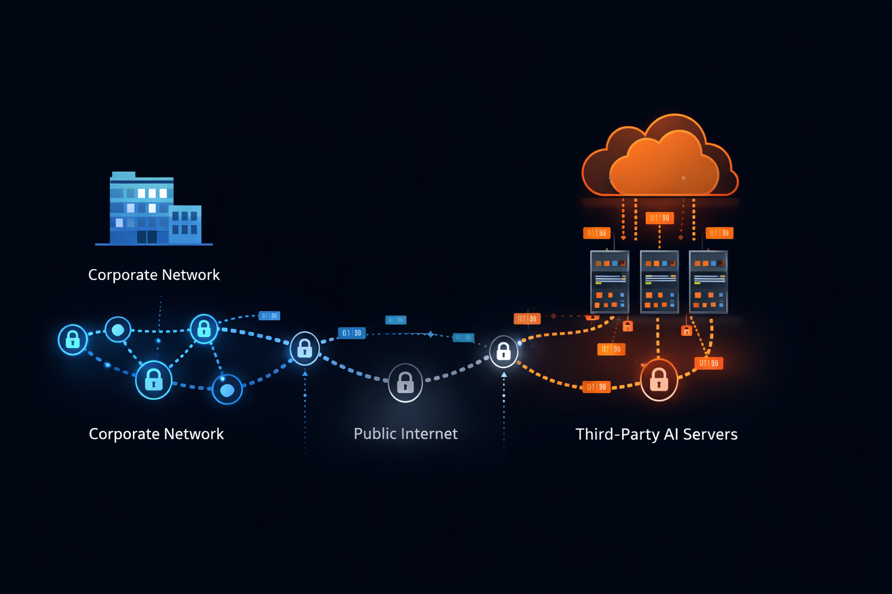

Служебная записка никого не радует, но меняет всё.

Когда в полупроводниковом подразделении Samsung выяснилось, что инженеры загружали в ChatGPT закрытые данные о разработке чипов, реакция была немедленной и жёсткой. Запрет на уровне всей компании. Без исключений. Без права на обжалование. Инструмент, ставший символом продуктивной работы с ИИ, оказался под запретом во всех корпоративных сетях.

Samsung была не одинока. За несколько месяцев похожие решения объявили JPMorgan Chase, Apple, Amazon, Goldman Sachs, Deutsche Bank и десятки других компаний. Юридические фирмы, консультирующие компании из списка Fortune 500, запретили своим юристам пользоваться сервисом. Медицинские организации заблокировали доступ на уровне межсетевых экранов. Государственные ведомства выпустили рекомендации, которые сняли любую неопределённость в вопросе допустимого использования.

Эта волна показала то, что энтузиасты технологий упустили из виду, увлёкшись возможностями ИИ: в корпоративной среде действуют ограничения, которых нет у частных пользователей.

В этой статье мы разберём, почему корпоративные политики в отношении ИИ ужесточаются, какие конкретные риски стоят за этими решениями и как организации могут пользоваться ИИ, не допуская неприемлемой утечки данных. Отказываться от ИИ для этого не нужно. Нужно понять, что инфраструктура важна не меньше, чем сам интеллект.

## Инциденты, которые всё изменили

Корпоративные запреты на ИИ появились не из теоретических оценок рисков. Им предшествовали реальные случаи, когда конфиденциальная информация выходила из-под контроля организации.

**Утечка в полупроводниковом подразделении Samsung**

В начале 2023 года сотрудники Samsung Electronics использовали ChatGPT для отладки исходного кода и оптимизации процессов производства полупроводников. Инженеры вставляли закрытый код прямо в окно чата. Другие загружали протоколы совещаний со стратегическим планированием. Менее чем через три недели после того, как ChatGPT разрешили для внутреннего использования, служба информационной безопасности Samsung выявила несколько случаев передачи конфиденциальных данных на серверы OpenAI.

В полупроводниковой отрасли техпроцесс измеряется нанометрами, а конкурентное преимущество — месяцами. Сама вероятность того, что технологические процессы Samsung оказались в обучающем корпусе OpenAI и потенциально стали доступны конкурентам, пользующимся тем же сервисом, была неприемлемой. Samsung ввела полный запрет и начала разрабатывать внутренние ИИ-инструменты, которые никогда не передают данные наружу.

**Реакция финансового сектора**

JPMorgan Chase ограничил доступ к ChatGPT ещё до каких-либо публичных инцидентов, заранее оценив регуляторные последствия. Когда сотрудники банка анализируют портфели клиентов, обсуждают стратегии слияний или оценивают кредитные риски, они работают с информацией, на которую распространяются правила SEC, законы о банковской тайне и фидуциарные обязанности. Передача такой информации стороннему ИИ-сервису — независимо от заявленной им политики конфиденциальности — создаёт регуляторный риск, на который не согласится ни один главный юрист.

Goldman Sachs, Citigroup, Bank of America и Deutsche Bank ввели похожие ограничения. Согласованная реакция финансовой отрасли объяснялась не паранойей, а профессиональным пониманием регуляторной ответственности. Утечка данных из-за использования ChatGPT сотрудником потребовала бы раскрытия информации, запустила бы проверку регулятора и могла бы закончиться принудительными мерами.

**Последствия для юридической отрасли**

Американская ассоциация юристов (ABA) не вводила общего запрета на ИИ-инструменты, но требования об адвокатской тайне на практике дают почти тот же эффект. Когда юрист обсуждает дела клиента с ChatGPT, этот разговор может лишить информацию защиты адвокатской тайны. Сведения, раскрытые третьим лицам — даже ИИ-системам, — могут потерять конфиденциальность, на которой держится защита юридической консультации.

Крупные юридические фирмы, в том числе Davis Polk, Cravath и Sullivan & Cromwell, ввели ограничения — от полного запрета до использования только в одобренных случаях с разрешения партнёра. Реакция юридического сообщества показала, что риски ИИ выходят за пределы защиты данных и затрагивают фундаментальные вопросы профессиональной ответственности.

## Как облачный ИИ обращается с данными на самом деле

Чтобы понять, почему компании запрещают ChatGPT, нужно разобраться, что происходит, когда вы отправляете сообщение облачному ИИ-сервису.

**Путь передачи данных**

Когда вы вводите запрос в ChatGPT, текст уходит с вашего устройства через корпоративную сеть и публичный интернет в инфраструктуру OpenAI. OpenAI работает в основном на Microsoft Azure, то есть ваши данные проходят через сеть Microsoft и хранятся на серверах под управлением Microsoft.

Передача происходит независимо от того, насколько чувствительно содержимое. Система не отличает просьбу написать стихотворение от просьбы проанализировать конфиденциальные условия сделки слияния. Каждый введённый символ проходит один и тот же путь к одному и тому же адресату.

**Политика хранения данных**

Политика OpenAI в отношении данных со временем менялась, но основы остаются прежними. Введённые данные журналируются. Переписка сохраняется. Срок и цель хранения зависят от тарифа и конкретных договорённостей.

Для бесплатного тарифа и подписчиков Plus OpenAI прямо оставляет за собой право использовать введённые данные для улучшения моделей. Ваши запросы становятся обучающими данными. Конфиденциальный код, который вы вставили, чтобы найти ошибку, может повлиять на ответы модели будущим пользователям — возможно, и вашим конкурентам.

Пользователи API и подписчики Enterprise могут отказаться от использования их данных для обучения, но данные всё равно обрабатываются в инфраструктуре OpenAI. Они хранятся на серверах, которые вы не контролируете, ими управляют сотрудники, которых вы не проверяли, и на них распространяются судебные процедуры, на которые вы не можете повлиять.

**Проблема третьей стороны**

Архитектура корпоративной безопасности различает системы первой стороны (инфраструктура, которой вы владеете и которую эксплуатируете сами), второй стороны (поставщики с прямыми договорными отношениями и проверенными мерами безопасности) и третьей стороны (сервисы, которыми пользуются без глубокой интеграции в систему безопасности).

Для большинства пользователей ChatGPT — непроверенная третья сторона. Если ваша организация не заключила отдельный корпоративный договор с приложениями по безопасности, правом на тестирование на проникновение и сертификатами соответствия под ваши требования, ChatGPT находится за пределами вашего периметра безопасности и получает любые данные, которыми решат поделиться сотрудники.

Именно поэтому службы безопасности относятся к ChatGPT иначе, чем к Microsoft Office или Salesforce. Те системы, хотя и облачные, работают по корпоративным договорам с оговорёнными мерами безопасности, правом на аудит и условиями ответственности. ChatGPT для пользователя с подпиской за 20 $ в месяц ничего из этого не даёт.

## Регуляторные требования, которые заставляют компании осторожничать

Корпоративные политики в отношении ИИ существуют не в вакууме. Они отвечают на правовые требования, которые появились раньше ChatGPT и переживут его.

**GDPR и защита данных в Европе**

Общий регламент по защите данных (GDPR) предъявляет строгие требования к обработке персональных данных резидентов ЕС. Когда сотрудник вставляет в ChatGPT информацию о клиентах, он инициирует передачу данных обработчику в США. Для такой передачи нужно правовое основание: решение о достаточности защиты, стандартные договорные положения или обязательные корпоративные правила.

Соглашения OpenAI об обработке данных могут удовлетворять требованиям GDPR в отдельных случаях, но у большинства сотрудников, пользующихся потребительской версией, никакого такого соглашения нет. Они просто передают персональные данные иностранной компании без разрешения.

В 2023 году итальянский регулятор временно заблокировал ChatGPT именно из-за нарушений GDPR. Сервис вернулся после того, как OpenAI внесла изменения, но случай показал, что регуляторы готовы действовать. Европейские компании несут прямую ответственность за действия сотрудников, нарушающие GDPR, и это сильный стимул вводить строгие ограничения.

**HIPAA и медицинские данные**

Закон о переносимости и подотчётности медицинского страхования (HIPAA) запрещает раскрывать защищённую медицинскую информацию (PHI), кроме строго оговорённых случаев. Медицинский работник, обсуждающий с ChatGPT случаи пациентов, раскрывает PHI неуполномоченному получателю.

Соглашения о деловом партнёрстве (business associate agreement) между типичной медицинской организацией и OpenAI нет. Ни один аудит безопасности не подтвердил соответствие ChatGPT техническим требованиям HIPAA. Никакая правовая норма не разрешает такое раскрытие.

Медицинские организации, обнаружившие, что сотрудники передавали PHI через ChatGPT, обязаны уведомить об утечке, могут стать объектом проверки OCR и получить штрафы до 1,5 млн $ за каждую категорию нарушений в год. Поэтому больничные сети блокируют ChatGPT на уровне сети, а не полагаются на соблюдение политик.

**Финансовое регулирование**

Банки, брокеры-дилеры и инвестиционные консультанты подчиняются требованиям SEC, FINRA, OCC и Федеральной резервной системы, которые обязывают хранить деловую переписку и контролировать её. Если аналитик готовит письмо клиенту с помощью ChatGPT, этот разговор должен попасть в архив для комплаенса.

ChatGPT не интегрируется с корпоративными системами архивирования. Нет инструментов контроля, которые отмечали бы потенциально проблемное использование. Разговор существует только на серверах OpenAI и на устройстве сотрудника — и ни то ни другое не отвечает требованиям регуляторов к хранению записей.

Помимо хранения записей, финансовых регуляторов беспокоят инвестиционные рекомендации, сгенерированные ИИ, участие ИИ в кредитных решениях и анализ, который может быть квалифицирован как манипулирование рынком. Регуляторная картина ещё не устоялась, и специалисты по комплаенсу отвечают на неопределённость ограничениями, а не разрешениями до появления ясности.

**Новое регулирование, посвящённое ИИ**

Европейский закон об ИИ (AI Act), который, как ожидается, будет вступать в силу поэтапно в 2025 и 2026 годах, вводит дополнительные требования к внедрению ИИ-систем. Приложения ИИ высокого риска — в том числе влияющие на трудоустройство, кредитование и образование — требуют оценки соответствия, документации и надзора со стороны человека.

Организации, использующие ChatGPT в таких сценариях, после вступления правил в силу могут оказаться владельцами несоответствующих требованиям ИИ-систем. Дальновидные компании ограничивают использование уже сейчас, чтобы не устранять нарушения потом.

## Интеллектуальная собственность: риск, который не закрыть договором

Соответствие требованиям регуляторов — одна группа рисков. Защита интеллектуальной собственности — другая, и для многих компаний более серьёзная.

**Коммерческая тайна и конфиденциальность**

Защита коммерческой тайны по американскому закону Defend Trade Secrets Act и аналогичным законам штатов требует, чтобы информация оставалась конфиденциальной благодаря разумным мерам защиты. Когда сотрудник вставляет в ChatGPT закрытые алгоритмы, производственные процессы или стратегические планы, меры защиты организации не сработали.

Суды, рассматривая иски о коммерческой тайне, проверяют, приняла ли сторона разумные меры для сохранения секретности. Если сотрудникам разрешено делиться конфиденциальной информацией со сторонними ИИ-сервисами, это требование ставится под сомнение. Даже если информация так и не утечёт из систем OpenAI, сам факт раскрытия может ослабить правовую защиту.

И это не только гипотетические споры. Компании регулярно предъявляют иски о коммерческой тайне уволившимся сотрудникам и конкурентам. Если в ходе раскрытия доказательств выяснится, что «секретная» информация раньше передавалась в ChatGPT и через возможное обучение модели могла стать доступна миллионам пользователей, позиция истца заметно слабеет.

**Исходный код и технические активы**

Особенно уязвимы компании-разработчики ПО. Разработчики вполне естественно хотят использовать ИИ-инструменты для отладки, генерации шаблонного кода и ускорения работы. Но исходный код — главный актив софтверного бизнеса. После передачи в ChatGPT этот код оказывается вне контроля организации.

Риск обучения на ваших данных вполне реален. Большие языковые модели учатся на том, что получают. OpenAI заявляет, что клиенты Enterprise и API могут отказаться от использования их данных для обучения, но у потребительской версии такой гарантии нет. Код, которым поделился один разработчик, может повлиять на подсказки, которые увидит другой, — возможно, в компании-конкуренте.

Во внутреннем предупреждении Amazon для сотрудников прямо говорилось о риске: ответы ChatGPT могут напоминать конфиденциальную информацию Amazon, а значит, похожие данные уже могли попасть в модель. Был ли это действительно код Amazon в обучающих данных или просто похожие шаблоны, до сих пор неясно. Сама неопределённость и привела к ограничительной политике.

**Информация клиентов и заказчиков**

Компании профессиональных услуг — консультанты, аудиторы, юристы, архитекторы — работают с информацией, которая принадлежит клиентам, а не им. Передача клиентских данных в ChatGPT может нарушать договоры на оказание услуг, соглашения о конфиденциальности и нормы профессиональной этики.

Консультант, загрузивший финансовые прогнозы клиента в ChatGPT для анализа, передал конфиденциальную информацию клиента третьей стороне. Если это вскроется, его фирма рискует получить иск о нарушении договора, дисциплинарные меры и потерю клиентов.

То же относится к любому бизнесу, работающему с данными клиентов. Менеджер по продажам, вставивший письмо клиента в ChatGPT, чтобы подготовить ответ, передал переписку с клиентом в OpenAI. В зависимости от отрасли и действующих договоров это может нарушать обязательства по обращению с данными клиентов.

## Почему корпоративных договоров на ИИ недостаточно

OpenAI предлагает ChatGPT Enterprise как раз для того, чтобы снять опасения компаний. Microsoft предоставляет Azure OpenAI Service с корпоративными функциями безопасности. Эти продукты лучше потребительских, но для сценариев с особо чувствительными данными фундаментальных проблем не решают.

**Что дают корпоративные договоры**

ChatGPT Enterprise включает несколько существенных улучшений:

- Данные не используются для обучения моделей
- Сертификат соответствия SOC 2 Type 2
- Шифрование данных при хранении и передаче
- Интеграция с SSO и инструменты администрирования
- Управление сроками хранения данных

Для многих корпоративных сценариев этого достаточно. Маркетинговая команда, пишущая тексты для рекламной кампании, почти ничем не рискует. Служба поддержки, готовящая шаблоны ответов, остаётся в допустимых рамках.

**Чего корпоративные договоры дать не могут**

Для регулируемых отраслей и ценной интеллектуальной собственности корпоративные договоры принципиально недостаточны.

Во-первых, данные по-прежнему обрабатываются в инфраструктуре, которую вы не контролируете. Ваша информация хранится на серверах OpenAI, ими управляют сотрудники OpenAI, и защищены они мерами безопасности OpenAI. Вы доверяете их реализации. Вы доверяете тому, как они проверяют персонал. Вы доверяете их реагированию на инциденты. Возможно, это доверие обоснованно, но это всё равно доверие, а не проверка.

Во-вторых, данные остаются доступны для судебных процедур. Повестка, направленная OpenAI, может обязать компанию раскрыть ваши переписки. Государственное расследование в отношении другого клиента потенциально может затронуть общую инфраструктуру. Письма национальной безопасности (National Security Letters) и постановления суда FISA выдаются под грифом секретности, который не позволит OpenAI сообщить вам о доступе к данным.

В-третьих, поверхность атаки включает всю организацию OpenAI. Ваш периметр безопасности больше не заканчивается на границе вашей сети. Каждый сотрудник OpenAI с доступом к системам, каждый подрядчик с доступом к инфраструктуре, каждая уязвимость в системах OpenAI становятся частью вашего профиля рисков.

В-четвёртых, уход к другому поставщику и перенос данных по-прежнему затруднены. История переписки, настроенное поведение и накопленные в ChatGPT знания организации привязаны к работе с системой OpenAI. Переход на альтернативу означает начинать с нуля.

Для фармацевтической компании, разрабатывающей новые соединения, оборонного подрядчика, ведущего исследования на грани секретности, или финансовой организации с торговыми алгоритмами, потенциально стоящими миллиарды, эти ограничения критичны. Корпоративные договоры снижают риск. Но не устраняют его.

## Альтернатива на базе open-weights-моделей

Причины, по которым компании запрещают ChatGPT, относятся не к ИИ вообще. Они касаются именно облачных ИИ-сервисов, где данные уходят из-под контроля организации. Другая архитектура полностью снимает эти проблемы.

**Что дают open-weights-модели**

Open-weights-модели — Llama от Meta, Mistral от Mistral AI, Qwen от Alibaba и десятки других — распространяются в виде файлов, которые можно скачать и запустить на любом совместимом оборудовании. Веса модели публичны. Код инференса открыт. Всю систему можно запустить на инфраструктуре, которой вы владеете и которую эксплуатируете сами.

Когда вы запускаете Llama на своём сервере, запросы не покидают вашу сеть. Третьи лица не получают ваших данных. Никакой облачный сервис не журналирует ваши запросы. Никакой конвейер обучения не использует введённые вами данные. Модель работает локально, обрабатывает данные локально и не хранит ничего сверх того, что вы явно настроили.

Такая архитектура снимает все проблемы, из-за которых запрещают ChatGPT:

- **Соответствие требованиям регуляторов:** данные остаются внутри вашего периметра безопасности, под вашим контролем и по вашим правилам. Передачи данных в смысле GDPR не происходит, потому что данные никуда не передаются. Вопросы HIPAA снимаются, потому что раскрытия неуполномоченным лицам нет.

- **Защита интеллектуальной собственности:** коммерческая тайна остаётся тайной. Исходный код не покидает ваших систем. Конфиденциальность клиентов сохраняется, потому что их информацию не получает никакая третья сторона.

- **Контроль безопасности:** поверхность атаки остаётся только вашей. Вы сами проверяете свои меры безопасности. Вы сами проверяете персонал. Вы сами управляете реагированием на инциденты. Уязвимости чужих организаций не затрагивают ваши данные.

- **Аудит и комплаенс:** каждый запрос, каждый ответ, каждое обращение к модели можно журналировать так, как требуется вам. Хранение записей для регуляторов встраивается в ваши существующие системы архивирования.

**Сравнение возможностей**

Закономерный вопрос: не уступают ли open-weights-модели ChatGPT? Честный ответ: зависит от задачи.

В вопросах общего характера ChatGPT, обученный на данных масштаба интернета, даёт широту, недоступную небольшим открытым моделям. В сложных задачах GPT-4 рассуждает лучше, чем Llama-3-8B.

Но корпоративным задачам редко нужны знания масштаба интернета. Юристам, анализирующим договоры, нужно понимание документов и точная формулировка текста — здесь дообученные открытые модели сильны. Разработчикам, отлаживающим код, нужно распознавание закономерностей в конкретной кодовой базе — и здесь модель, обученная под задачу, значительно превосходит универсальную.

Ключевой момент: дообучение превращает универсальную модель в специалиста по вашей предметной области. Llama-3-8B, дообученная на документах вашей организации, ваших стандартах кода и принятом стиле общения, справится с вашими задачами лучше GPT-4 — при полной изоляции данных.

Весь технический процесс описан в нашем основном руководстве по [приватному дообучению LLM на арендованных GPU](/ru/private-llm-fine-tuning-guide/).

## Варианты инфраструктуры для приватного ИИ

Для работы open-weights-моделей нужны вычислительные мощности GPU. Получить их организация может несколькими способами.

**Собственное оборудование**

Покупка GPU NVIDIA для собственного дата-центра даёт максимальный контроль. Оборудование стоит у вас на площадке, его обслуживают ваши сотрудники, оно подключено к вашей сети. Ни у кого извне нет доступа.

Проблема — капитальные затраты и сроки. Один GPU NVIDIA H100 стоит около 30 000 $. Для полноценного кластера обучения нужно несколько таких карт. Закупка растягивается на месяцы. Обслуживание требует специальных знаний.

Для крупных компаний с собственными дата-центрами локальная ИИ-инфраструктура — естественное продолжение. Для небольших организаций или тех, у кого нет опыта работы с GPU, барьеры существенны.

**Частные облачные инстансы**

AWS, GCP и Azure предлагают инстансы с GPU, которые дают больше контроля, чем SaaS-продукты с ИИ. Вы сами настраиваете среду. Вы сами управляете доступом. Данные обрабатываются на выделенных инстансах, а не в общих сервисах.

Такой подход лучше архитектуры ChatGPT, но облачный провайдер остаётся в цепочке. Данные по-прежнему хранятся на инфраструктуре, которую вы физически не контролируете. Сотрудники облачного провайдера с достаточными правами теоретически могут получить доступ к вашим системам. Судебный запрос к облачному провайдеру может затронуть ваши данные.

Кроме того, частные облачные инстансы с GPU стоят дорого. Инстанс AWS p4d.24xlarge (8 × A100) обходится примерно в 32 $ в час. Длительное обучение или постоянно работающий инференс дают значительные ежемесячные расходы. К тому же у новых аккаунтов квота на GPU изначально нулевая, и доступ приходится запрашивать.

**Арендованные GPU на маркетплейсах**

Третий вариант обходится без капитальных затрат: почасовая аренда потребительских GPU на маркетплейсах вроде Vast.ai, RunPod или GPUFlow, где значительная часть оборудования принадлежит частным лицам.

Что это даёт:

- **Низкая стоимость:** в сентябре 2026 года аренда RTX 4090 стоит примерно от 0,30 до 0,46 $ в час — в разы меньше, чем инстансы с GPU для дата-центров. Подробные расчёты — в нашем [сравнении цен на аренду GPU](/ru/gpu-rental-pricing-comparison-2026/).

- **Быстрый старт:** никаких корпоративных продаж и запросов квоты. Вы пополняете баланс и арендуете.

- **Open-weights-модели по запросу:** модель выбираете вы, и никакие данные не передаются её разработчику.

Чего это не даёт: оборудование принадлежит кому-то другому, и сертификатов соответствия нет. Это не место для регулируемых или конфиденциальных данных. Такой вариант хорошо подходит для обучения на публичных или обезличенных данных и для тестирования моделей перед покупкой оборудования.

Процесс выглядит так: вы передаёте данные прямо на арендованную машину по зашифрованному SSH-соединению, запускаете обучение или инференс, скачиваете результаты и очищаете удалённую среду перед отключением. Подробно о мерах операционной безопасности — в нашем руководстве о том, [как защитить датасет на публичном GPU-узле](/ru/how-to-secure-dataset-on-public-gpu-node/). При аренде с доступом через API, как на GPUFlow, запросы проходят через машину провайдера, поэтому правило то же: никаких чувствительных данных.

## Как выстроить стратегию ИИ в рамках требований

Организациям, которые переходят от запрета ChatGPT к приватному ИИ, стоит действовать системно.

**Этап 1: разработка политики**

Начните с чёткой формулировки того, что ваша политика в отношении ИИ запрещает и что разрешает. Многие первые запреты ChatGPT были реактивными — общими запретами, введёнными в спешке, чтобы остановить непосредственную угрозу. Зрелая политика разграничивает:

- Категории данных, которые никогда не могут обрабатываться внешними ИИ-системами
- Сценарии, в которых облачные ИИ-сервисы допустимы при надлежащем контроле
- Одобренные инструменты и платформы для разных уровней чувствительности
- Порядок согласования новых ИИ-инструментов
- Требования к сообщениям о нарушениях политики

Такая структура позволяет продолжать пользоваться ИИ там, где это уместно, и защищать чувствительные процессы.

**Этап 2: оценка инфраструктуры**

Оцените варианты развёртывания приватного ИИ с учётом ресурсов и требований организации:

- **Имеющиеся GPU:** во многих организациях есть рабочие станции или серверы с GPU NVIDIA, которые используются для других задач (визуализация, рендеринг, научные расчёты) и могут взять на себя ИИ-нагрузки.

- **Облачный бюджет и готовность к риску:** если ваша служба безопасности допускает участие облачного провайдера при надлежащем контроле, частные облачные инстансы с GPU проще в эксплуатации, чем собственное оборудование или арендованные GPU.

- **Требования к конфиденциальности:** если данные ни при каких условиях не должны попадать в инфраструктуру облачного провайдера, без собственного оборудования не обойтись.

- **Масштаб и частота:** для периодического дообучения подходит аренда. Постоянный инференс может оправдать капитальные вложения.

**Этап 3: выбор и настройка модели**

Универсальные open-weights-модели — это отправная точка, а ценность для организации даёт настройка под себя. Дообучение на ваших данных создаёт модели, которые понимают вашу предметную область, вашу терминологию и ваши требования.

Определите, какие сценарии дадут наибольшую отдачу:

- **Анализ документов:** юридические договоры, отчётность для регуляторов, внутренние политики
- **Помощь с кодом:** разработка в ваших фреймворках и по вашим стандартам
- **Общение с клиентами:** ответы в фирменном стиле и со знанием ваших продуктов
- **Внутренние знания:** поиск по документации и накопленному опыту организации

Под каждый сценарий можно дообучить отдельную модель, а можно обучить одну модель на разнообразных данных организации и использовать её для нескольких задач.

**Этап 4: встраивание в операционные процессы**

Приватный ИИ требует операционных возможностей, которые в SaaS-продуктах скрыты от пользователя:

- **Инфраструктура для обслуживания моделей:** инференс в масштабе требует GPU, балансировки нагрузки и API. Развёртывание упрощают такие инструменты, как vLLM, Text Generation Inference и Ollama.

- **Контроль доступа:** кто может обращаться к модели? Что журналируется? Как проводить аудит использования?

- **Порядок обновлений:** как добавлять новые обучающие данные? Как выкатывать улучшенные версии модели?

- **Реагирование на инциденты:** что делать, если модель выдала проблемный ответ? Кто разбирает пограничные случаи?

Организации, привыкшие к простоте SaaS, могут недооценить эту операционную нагрузку. Закладывайте бюджет на постоянное сопровождение, а не только на первоначальное развёртывание.

## Кейс: архитектура комплаенса в финансовой организации

Региональный банк с активами в 50 млрд $ столкнулся со знакомой дилеммой. Клиентские менеджеры хотели, чтобы ИИ помогал им готовить письма клиентам и анализировать позиции в портфелях. Специалисты по комплаенсу понимали, что передача финансовых данных клиентов в ChatGPT нарушает и требования регуляторов, и фидуциарные обязанности.

Выбранная архитектура показывает, как можно удовлетворить обе стороны.

**Классификация данных**

Банк установил три уровня данных, допустимых для работы с ИИ:

- **Уровень 1 (публичные данные):** маркетинговые материалы, публичные образовательные материалы о финансах, общие описания продуктов. Облачные ИИ-сервисы разрешены при соблюдении стандартных правил допустимого использования.

- **Уровень 2 (внутренние данные):** внутренние политики, учебные материалы, операционные процедуры. Облачные ИИ-сервисы разрешены при наличии корпоративных договоров и приложений об обращении с данными.

- **Уровень 3 (данные ограниченного доступа):** данные клиентов, информация о портфелях, детали транзакций, стратегическое планирование. Никакой обработки внешним ИИ ни при каких обстоятельствах.

Такая классификация позволила внедрять ИИ там, где риск приемлем, и сохранить абсолютную защиту чувствительных категорий.

**Развёртывание приватной инфраструктуры**

Для сценариев уровня 3 банк развернул дообученную модель Llama на собственных GPU-серверах в своём дата-центре. Модель обучали на:

- Обезличенной исторической переписке с клиентами (с согласия клиентов)
- Внутренних правилах комплаенса и толкованиях регуляторных требований
- Документации по продуктам и инвестиционной аналитике
- Шаблонах писем, одобренных комплаенсом

Получившаяся модель понимала банковскую терминологию, регуляторные ограничения и принятые в организации стандарты переписки. Клиентские менеджеры могли готовить письма клиентам с помощью ИИ, зная, что никакие данные клиентов не покидают периметр безопасности банка.

**Операционный контроль**

Каждое обращение к модели журналировалось в существующей системе архивирования для комплаенса. Руководители могли проверять письма, подготовленные с помощью ИИ, наравне с обычной перепиской. Журналы аудита отвечали требованиям регуляторов к хранению записей.

Сама модель работала в рамках ограничений, блокирующих определённые ответы: инвестиционные рекомендации, формулировки с гарантиями и высказывания, которые могли бы считаться консультацией, требующей специальной лицензии. Эти ограничения были реализованы на уровне приложения, а не полагались только на поведение модели.

**Измеренные результаты**

Через шесть месяцев после внедрения банк сообщил:

- Время на подготовку типовых писем клиентам сократилось на 40%
- Ни одного инцидента комплаенса, связанного с ИИ
- Проверка регулятора прошла без замечаний, касающихся внедрения ИИ
- Выросла удовлетворённость клиентских менеджеров

Вложения в приватную инфраструктуру — около 200 000 $ с учётом оборудования, разработки и интеграции — окупились в течение первого года за счёт одного только роста производительности.

## Кейс: медицинский исследовательский центр

Крупный академический медицинский центр, проводящий клинические исследования, столкнулся с ограничениями HIPAA, из-за которых любое использование облачного ИИ с данными пациентов было юридически проблемным. Исследователи хотели применять ИИ для обзора литературы, разработки протоколов и анализа данных.

**Гибридный подход**

Вместо выбора между полным запретом и неприемлемым риском центр внедрил гибридную архитектуру:

- **Исследовательские задачи на публичных данных** (обзор литературы, вопросы методологии, статистические подходы) решались с помощью облачных ИИ-сервисов при чётком запрете вводить любые данные пациентов.

- **Анализ данных пациентов** выполнялся локально развёрнутыми моделями на изолированных от сети рабочих станциях внутри защищённой исследовательской среды. У этих машин не было подключения к интернету. Данные не могли уйти наружу, что бы ни делал пользователь.

**Обучение на арендованных GPU**

Бюджета на покупку GPU, пригодных для обучения, у центра не было, но ему нужны были модели, дообученные на медицинской литературе и исследовательских протоколах. Для обучения использовали арендованные GPU — только на публичной медицинской литературе и обезличенных датасетах, которые не подпадают под HIPAA.

Процесс обучения следовал мерам безопасности из нашего [руководства по защите датасетов](/ru/how-to-secure-dataset-on-public-gpu-node/):

1. Передавать на арендованные узлы только нечувствительные обучающие данные
2. Запускать дообучение
3. Скачивать полученные веса модели
4. Полностью очищать удалённую среду
5. Развёртывать обученные модели во внутренней изолированной инфраструктуре

Такой подход дал центру медицинский ИИ, настроенный под его задачи, без раскрытия защищённой медицинской информации внешним системам.

**Подтверждение со стороны регуляторов**

Этический комитет центра (IRB) рассмотрел внедрение ИИ в рамках изменений к протоколам исследований. Чёткое разделение между обучением на публичных данных (внешним) и инференсом на данных пациентов (внутренним и изолированным) удовлетворило требованиям конфиденциальности. Ответственные за соблюдение HIPAA одобрили архитектуру после оценки безопасности.

## Стратегическая необходимость

Организации, которые смотрят на политику в отношении ИИ только как на снижение рисков, упускают более широкую картину. Компании, запрещающие ChatGPT сегодня, не отказываются от ИИ. Они перестраиваются ради устойчивого преимущества.

**Конкурентное преимущество за счёт данных**

Самые ценные возможности ИИ рождаются из собственных данных. Универсальная языковая модель, обученная на текстах из интернета, даёт универсальные возможности, доступные всем. Модель, дообученная на ваших взаимодействиях с клиентами, операционных данных и накопленных знаниях, даёт возможности, которые есть только у вашей организации.

Для этого собственные данные должны оставаться собственными. Организации, отдающие свои конкурентные преимущества облачным ИИ-сервисам, вкладываются в модели, которые приносят пользу всем пользователям, в том числе конкурентам. Организации, сохраняющие контроль над данными и развёртывающие приватный ИИ, накапливают преимущества, которые со временем только растут.

**Направление регулирования**

Регулирование ИИ ужесточается, а не смягчается. Европейский закон об ИИ создаёт прецедент, которому последуют другие юрисдикции. Американские ведомства, в том числе FTC, SEC и банковские регуляторы, разрабатывают рекомендации по ИИ. Китай ввёл правила, затрагивающие обучение и развёртывание моделей.

Организации, строящие приватную ИИ-инфраструктуру сейчас, готовятся к регуляторной среде, которая будет всё сильнее ограничивать использование облачного ИИ. Чем жёстче требования, тем ценнее вложения в архитектуру, соответствующую им.

**Зависимость от поставщика**

Зависимость от одного поставщика ИИ — стратегическая уязвимость. Цены, правила и возможности OpenAI меняются по её усмотрению. Сбои в работе сервиса затрагивают всех клиентов одновременно. Изменение правил может за одну ночь запретить сценарии, которые раньше были допустимы.

Приватный ИИ устраняет зависимость от одного поставщика. Open-weights-модели можно скачать, и они остаются доступны навсегда. Для развёртывания есть множество вариантов оборудования. Организация сама управляет своей цепочкой поставок ИИ, а не зависит от чужих решений.

## План внедрения

Организациям, готовым перейти от запрета ChatGPT к собственным возможностям приватного ИИ, мы рекомендуем поэтапный подход.

**Первоочередные шаги (1–2 недели)**

1. Проведите аудит текущего использования ИИ в организации
2. Классифицируйте типы данных по чувствительности и регуляторным требованиям
3. Зафиксируйте, какие сценарии требуют приватной инфраструктуры, а где допустимо облако
4. Введите временную политику, в которой ясно указано, что запрещено и что разрешено

**Краткосрочная подготовка (1–3 месяца)**

1. Оцените варианты инфраструктуры с учётом требований к чувствительности данных и бюджета
2. Выберите первые сценарии для приватного ИИ
3. Определите источники обучающих данных для настройки моделей
4. Установите протоколы безопасности для работы на внешних GPU, если они понадобятся

**Среднесрочное развёртывание (3–6 месяцев)**

1. Дообучите модели на данных организации по [нашему техническому руководству](/ru/private-llm-fine-tuning-guide/)
2. Разверните инфраструктуру инференса с надлежащим контролем доступа
3. Интегрируйте её с существующими системами комплаенса и аудита
4. Обучите пользователей одобренным процессам и инструментам

**Постоянная эксплуатация**

1. Регулярно обновляйте модели с учётом новых обучающих данных
2. Проводите оценку безопасности ИИ-инфраструктуры
3. Обновляйте политики с учётом изменений в регулировании
4. Расширяйте применение на новые сценарии

## Заключение

Корпоративные запреты на ChatGPT — это рациональное управление рисками, а не технофобия. Samsung, запретив инструмент после того, как выяснилось, что в него загружали закрытые данные о полупроводниках, поступила правильно. JPMorgan, заранее ограничив доступ, проявил должное понимание регуляторных требований. Медицинские организации, блокируя доступ на межсетевом экране, защищают конфиденциальность пациентов, как того требует закон.

Но запрет — это не стратегия. Организации, которые остановятся на «нет», уступят выигрыш в производительности конкурентам. Преуспеют те, кто увидит, что существует третий путь.

Open-weights-модели на приватной инфраструктуре дают возможности ИИ без раскрытия данных. Модели доступны уже сейчас. Инфраструктура доступна. Технические процессы описаны. Единственное препятствие — готовность организации действовать.

Ваши конкуренты, которые дообучают модели на собственных данных — создают системы, понимающие их клиентов, продукты и процессы, — строят преимущества, которые невозможно повторить подпиской на универсальный сервис. Пока вы обсуждаете политику, они внедряют.

Решения об инфраструктуре, которые вы принимаете сегодня, определят, станет ли ИИ вашим конкурентным преимуществом или преимуществом конкурентов перед вами. Облачные ИИ-сервисы превращают ваши данные в общий ресурс. Приватный ИИ превращает их в уникальную возможность.

Выбор не в том, использовать ли ИИ. Выбор в том, контролировать ли его.

---

## Полезные материалы

Эта статья посвящена стратегическому и регуляторному контексту корпоративных решений об ИИ. Техническая сторона внедрения описана в следующих материалах:

**Основное руководство по внедрению**

- [Полное руководство по приватному дообучению LLM на арендованных GPU](/ru/private-llm-fine-tuning-guide/) — весь технический процесс обучения собственных моделей

**Безопасность и эксплуатация**

- [Как защитить датасет на публичном GPU-узле](/ru/how-to-secure-dataset-on-public-gpu-node/) — меры операционной безопасности при аренде вычислительных мощностей
- [Что нужно, чтобы арендовать GPU в 2026 году](/ru/what-you-need-to-rent-a-gpu/) — регистрация, верификация и оплата на каждой платформе

**Платформы и экономика**

- [Сравнение цен на аренду GPU 2026](/ru/gpu-rental-pricing-comparison-2026/) — анализ стоимости разных вариантов развёртывания
- [Почасовой GPU или API с оплатой за токены?](/ru/hourly-gpu-vs-per-token-api/) — сколько на самом деле стоит запуск открытой модели
- [GPUFlow, Vast.ai, RunPod и SaladCloud](/ru/gpuflow-vs-vast-ai-vs-runpod/) — сравнение машин, контейнеров и API-ключей

**Технические сравнения**

- [Ollama, vLLM и TGI: скорость инференса на потребительских GPU](/ru/ollama-vs-vllm-vs-tgi-rtx-4090-benchmark/) — выбор сервера инференса для развёртывания
- [Сравнение RunPod и Vast.ai](/ru/runpod-vs-vastapi-comparison/) — оценка маркетплейсов аренды GPU
