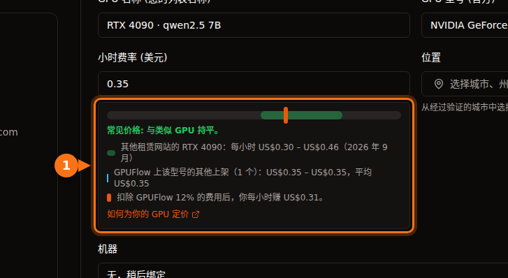

2026 年 9 月，一块 H100 的价格大致是：AWS 或 Azure 每小时约 $6.90，Google Cloud 每卡 $11.06，Lambda $3.99，RunPod $2.69 至 $3.49，Vast.ai 约 $1.50 起。消费级显卡只在市场平台上有：RTX 4090 最便宜的每小时 $0.31 至 $0.34，RunPod 的数据中心档位是 $0.74。同一块 H100，最贵的按需小时价约是最便宜的七倍半。

本文余下部分说明每个数字的出处、小时价包含哪些东西，以及三个典型任务从头到尾的费用。除特别注明外，所有价格均为按需价格，美国区域（AWS 为 us-east-1，Azure 为 East US，Google Cloud 为 us-central1），Linux，于 2026 年 9 月核实。价格每月都在变，请把它们当作一次快照，花钱之前先查一下原始出处。

## 价格一览

数据中心 GPU，每卡每小时美元价：

| 提供商 | L4 24 GB | A10G / A10 24 GB | A100 80 GB | H100 |
| --- | --- | --- | --- | --- |
| AWS | $0.81（g6.xlarge） | $1.01（g5.xlarge，A10G） | $3.43（仅 8 卡 p4de） | $6.88（p5.4xlarge） |
| Google Cloud | $0.71（g2-standard-4） | 无 | $5.07（a2-ultragpu-1g） | $11.06（8 卡 A3，÷ 8） |
| Azure | 无 | $3.20（NV36ads A10 v5） | $3.67（NC24ads A100 v4） | $6.98（NC40ads H100 v5，NVL 94 GB） |
| Lambda | 无 | 无 | $2.79 | $3.99 |
| RunPod Community / Secure | 无 / $0.49 | 无 | $1.39 / $1.59 | $2.69 / $3.49 |
| Vast.ai | 约 $0.27 起 | 无 | 约 $0.43 起 | 约 $1.47 起 |

“无”表示我们在该提供商的价格表中没有找到对应的单卡选项。消费级显卡，每小时美元价：

| GPU | Vast.ai（最低报价） | RunPod Community / Secure | 各租用平台的常见区间 |
| --- | --- | --- | --- |
| RTX 3090 24 GB | $0.11 – $0.13 | $0.22 / $0.50 | $0.11 – $0.31 |
| RTX 4090 24 GB | $0.31 – $0.33 | $0.34 / $0.74 | $0.30 – $0.46 |
| RTX 5090 32 GB | $0.41 – $0.47 | $0.69 / $0.99 | $0.41 – $0.69 |

AWS、Google Cloud、Azure 和 Lambda 都不提供消费级 RTX 显卡。Vast.ai 的数字写成区间，是因为 getdeploying.com 同一天的两次快照给出的最低价略有不同，这本身就说明了市场平台价格的特点。最后一列是 [GPUFlow 提供商定价指南](https://docs.gpuflow.app/zh-cn/providers/pricing/)在 2026 年 9 月从 Vast.ai、RunPod、Salad、SimplePod、TensorDock、Hyperstack 和 Lambda 收集的价格区间。

## 小时价包含什么

这些数字对应的其实不完全是同一种产品，这一点比小数点后第二位重要得多。

超大规模云的实例除了 GPU 还捆绑了很多东西。AWS 的 p5.4xlarge 带 16 个 vCPU、256 GiB 内存和 3.84 TB 本地 NVMe。Azure 的 NC24ads A100 v4 有 24 个 vCPU 和 220 GiB 内存。Azure 的整卡 A10 规格 NV36ads A10 v5 有 36 个 vCPU、440 GiB 内存，外加虚拟工作站用的 GRID 许可证，这也部分解释了它为什么比 AWS 上同类显卡贵三倍。如果你只需要 GPU，这些东西你照样得付钱。

有些 GPU 只能整台大机器租。AWS 上的 A100 80 GB 以 p4de.24xlarge 出售：八块 GPU，每小时 $27.45，没有更小的规格。表中 Google Cloud 的 A3 High H100 机型是 8 卡的 a3-highgpu-8g，每小时 $88.49。Lambda 的价格表给的是每卡价格，但它在 H100 旁边列出的机器规格（208 个 vCPU，1,800 GiB 内存）描述的是一台多卡系统，所以在按 $3.99 做计划之前，先确认实际能租到哪些规格。

市场平台的价格由机器的所有者决定。在 Vast.ai 上，每个主机自己定价，存储和带宽按每条上架信息单独计价。RunPod 的 Community Cloud 连接的是独立提供商；Secure Cloud 运行在 Tier 3 和 Tier 4 数据中心。同一块 RTX 4090，在前者是 $0.34，在后者是 $0.74。

小时价之外的费用（磁盘、数据传输、准备时间、空闲时间）在[GPU 租用的真实成本](/zh_cn/hidden-fees-in-gpu-rental/)中有详细介绍。对小任务来说，这些额外费用可能比 GPU 时间本身还多。

## H100 价格对比

<figure>
<svg viewBox="0 0 720 380" role="img" aria-labelledby="d1-title" xmlns="http://www.w3.org/2000/svg" font-family="system-ui, sans-serif" font-size="15">
<title id="d1-title">2026 年 9 月按需 H100 每卡每小时价格的条形图，从 Google Cloud 的 11.06 美元到 Vast.ai 的 1.47 美元</title>
<rect x="0" y="0" width="720" height="380" fill="#ffffff"/>
<text x="20" y="28" fill="#1e1b4b" font-weight="600">一块 H100，按需，每卡每小时美元价</text>
<line x1="190" y1="44" x2="190" y2="316" stroke="#e2e8f0" stroke-width="1"/>
<text x="190" y="336" text-anchor="middle" fill="#64748b" font-size="13">$0</text>
<line x1="270" y1="44" x2="270" y2="316" stroke="#e2e8f0" stroke-width="1"/>
<text x="270" y="336" text-anchor="middle" fill="#64748b" font-size="13">$2</text>
<line x1="350" y1="44" x2="350" y2="316" stroke="#e2e8f0" stroke-width="1"/>
<text x="350" y="336" text-anchor="middle" fill="#64748b" font-size="13">$4</text>
<line x1="430" y1="44" x2="430" y2="316" stroke="#e2e8f0" stroke-width="1"/>
<text x="430" y="336" text-anchor="middle" fill="#64748b" font-size="13">$6</text>
<line x1="510" y1="44" x2="510" y2="316" stroke="#e2e8f0" stroke-width="1"/>
<text x="510" y="336" text-anchor="middle" fill="#64748b" font-size="13">$8</text>
<line x1="590" y1="44" x2="590" y2="316" stroke="#e2e8f0" stroke-width="1"/>
<text x="590" y="336" text-anchor="middle" fill="#64748b" font-size="13">$10</text>
<line x1="670" y1="44" x2="670" y2="316" stroke="#e2e8f0" stroke-width="1"/>
<text x="670" y="336" text-anchor="middle" fill="#64748b" font-size="13">$12</text>
<text x="180" y="69" text-anchor="end" fill="#1e1b4b">Google Cloud</text>
<rect x="190" y="50" width="442.4" height="26" rx="3" fill="#6366f1"/>
<text x="640.4" y="69" fill="#1e1b4b">$11.06</text>
<text x="180" y="107" text-anchor="end" fill="#1e1b4b">Azure (H100 NVL)</text>
<rect x="190" y="88" width="279.2" height="26" rx="3" fill="#6366f1"/>
<text x="477.2" y="107" fill="#1e1b4b">$6.98</text>
<text x="180" y="145" text-anchor="end" fill="#1e1b4b">AWS</text>
<rect x="190" y="126" width="275.2" height="26" rx="3" fill="#6366f1"/>
<text x="473.2" y="145" fill="#1e1b4b">$6.88</text>
<text x="180" y="183" text-anchor="end" fill="#1e1b4b">Lambda</text>
<rect x="190" y="164" width="159.6" height="26" rx="3" fill="#16a34a"/>
<text x="357.6" y="183" fill="#1e1b4b">$3.99</text>
<text x="180" y="221" text-anchor="end" fill="#1e1b4b">RunPod Secure</text>
<rect x="190" y="202" width="139.6" height="26" rx="3" fill="#16a34a"/>
<text x="337.6" y="221" fill="#1e1b4b">$3.49</text>
<text x="180" y="259" text-anchor="end" fill="#1e1b4b">RunPod Community</text>
<rect x="190" y="240" width="107.6" height="26" rx="3" fill="#16a34a"/>
<text x="305.6" y="259" fill="#1e1b4b">$2.69</text>
<text x="180" y="297" text-anchor="end" fill="#1e1b4b">Vast.ai（最低价）</text>
<rect x="190" y="278" width="58.8" height="26" rx="3" fill="#16a34a"/>
<text x="256.8" y="297" fill="#1e1b4b">$1.47</text>
<line x1="190" y1="44" x2="190" y2="316" stroke="#64748b" stroke-width="1.5"/>
<rect x="190" y="352" width="14" height="14" fill="#6366f1"/>
<text x="212" y="364" fill="#64748b" font-size="13">超大规模云</text>
<rect x="360" y="352" width="14" height="14" fill="#16a34a"/>
<text x="382" y="364" fill="#64748b" font-size="13">GPU 云和市场平台</text>
</svg>
<figcaption>2026 年 9 月单块 H100 的按需价格。Google Cloud 的价格是其 8 卡 A3 机型的价格除以 8。Azure 的单卡规格用的是 94 GB 的 H100 NVL。Vast.ai 为 getdeploying.com 当天报告的最低报价。</figcaption>
</figure>

这张图按比例绘制，有两点很明显。三大云每卡价格都集中在 $7 左右，Google Cloud 的 8 卡 A3 机型还要高出一大截。而 AWS 和 Vast.ai 最便宜的报价之间差了四倍多，两者做的是完全一样的运算。

多花的钱确实买到了东西：SLA、合规文件、就在旁边的其余基础设施，以及一份支持合同。在市场平台上放弃的东西也是实实在在的：主机可能是个小运营者，可靠性因上架信息而异，也没有 SLA。周末做个实验，市场平台轻松胜出。对受监管的生产系统来说，市场平台往往根本不在考虑范围内。

## 竞价和可中断实例价格

本文对比的每家提供商都会低价出售闲置算力，代价是随时可能被收回。

| 实例 | 按需 | 竞价 | 节省 |
| --- | --- | --- | --- |
| AWS g6.xlarge（1× L4） | $0.805 | $0.605 | 25% |
| AWS g5.xlarge（1× A10G） | $1.006 | $0.469 | 53% |
| AWS p5.4xlarge（1× H100） | $6.88 | $2.623 | 62% |
| Google Cloud g2-standard-4（1× L4） | $0.707 | $0.403 | 43% |
| Google Cloud a3-highgpu-8g（8× H100） | $88.49 | $41.60 | 53% |
| Azure NC24ads A100 v4（1× A100 80 GB） | $3.673 | $0.679 | 82% |
| Azure NC40ads H100 v5（1× H100 NVL） | $6.98 | $1.29 | 82% |

Azure 的竞价价格取自其零售价格 API，其中 A100 和 H100 的竞价价格分别于 2026 年 7 月和 8 月生效。这个 H100 竞价价格比我们在市场平台上找到的最便宜的按需 H100 报价还低。竞价价格变动频繁，也不保证有货，所以只把它当作一次快照。

Vast.ai 的文档称，可中断实例“通常比按需便宜 50% 以上”；getdeploying.com 显示 RTX 3090 的可中断报价从 $0.08 起。只有当任务会写检查点、能从中断处接着跑时，竞价实例才真正省钱。否则一次中断就意味着同样的时长要付两次钱。

## GPUFlow 的定位

GPUFlow 也是一个市场平台，但出租的东西范围更窄。提供商在自己的 Linux 机器上运行 AI 模型（通常用 Ollama），你按小时租用其中一块 GPU，拿到一个 OpenAI 兼容 API 密钥（base URL 为 `https://gpuflow.app/v1`，提供 `/v1/chat/completions` 和 `/v1/models`）。没有 SSH、没有 shell，也不能访问文件，所以不能训练、微调或运行自己的代码。如果只是想在脚本或应用里调用一个开源模型，准备工作可以完全省掉：模型已经装在提供商的机器上了。

GPUFlow 不定价，所以表里没有 GPUFlow 的价格。它的定价方式如下：

- 每个提供商以美元为自己的上架信息设定小时价。设定时，上架表单会显示这个价格在其他租用平台价格区间中的位置，以及扣除手续费后能赚多少。
- 你按整小时预订，默认 1 到 168 小时。租用开始时，从你的额度中预留全部预订金额。
- 实际按秒计费，最低 1 分钟，向上取整到分（[GPU 按秒计费与按小时计费](/zh_cn/per-second-vs-hourly-gpu-billing/)一文有详细算例）。你提前结束或时间用完时，预留金额中未用完的部分直接退回你的额度。
- 如果提供商的机器 10 分钟没有响应，租用会结束，你只需支付到机器最后一次心跳为止的费用。
- token 会计数但不计费。账单上没有磁盘或数据传输费用，因为你根本拿不到一台可以存文件的机器。
- 额度通过 Stripe 用银行卡购买，每次充值 $10 到 $500，无手续费。1 额度 = $0.01，额度不会过期。每笔扣费中提供商拿 88%，GPUFlow 拿 12%。

租 API 密钥和租容器的详细对比，见 [GPUFlow、Vast.ai、RunPod 与 SaladCloud 对比](/zh_cn/gpuflow-vs-vast-ai-vs-runpod/)。如果你在比较按小时租 GPU 和按 token 计费的 API，[相关计算在这里](/zh_cn/hourly-gpu-vs-per-token-api/)。

## 算例一：在 24 GB 显卡上跑 3 小时批处理任务

假设你要用一个 7B 到 8B 的开源模型处理一大批文档，大约需要三小时。任何 24 GB 显卡都行。

| 方案 | 算式 | GPU 费用 |
| --- | --- | --- |
| Vast.ai RTX 4090 | 3 × $0.31 | $0.93 |
| RunPod Community RTX 4090 | 3 × $0.34 | $1.02 |
| Google Cloud L4（g2-standard-4） | 3 × $0.707 | $2.12 |
| RunPod Secure RTX 4090 | 3 × $0.74 | $2.22 |
| AWS L4（g6.xlarge） | 3 × $0.805 | $2.42 |
| AWS A10G（g5.xlarge） | 3 × $1.006 | $3.02 |

以上每个方案都还要为准备工作付钱：安装推理服务器、下载模型，都在计费时间内进行。花 20 分钟做这些，Vast.ai 那块卡要多付 $0.10，AWS L4 要多付 $0.27。

在 GPUFlow 上，以一条每小时 $0.35 的上架信息为例（这是截图里的价格，不是报价）。你预订 3 小时，预留 $1.05。任务在 2 小时 10 分钟（7,800 秒）后完成，你结束租用。扣费为 7,800 × 35 ÷ 3,600 = 75.8 分，向上取整为 $0.76，$0.29 退回你的额度。前提是有提供商运行你要的模型。

## 算例二：在 A100 80 GB 上微调 8 小时

微调需要一台你能控制的机器，所以这里用不了 GPUFlow。

| 方案 | 算式 | 费用 |
| --- | --- | --- |
| Vast.ai，最低 A100 报价 | 8 × $0.43 | $3.44 |
| RunPod Community A100 SXM | 8 × $1.39 | $11.12 |
| RunPod Secure A100 SXM | 8 × $1.59 | $12.72 |
| Lambda A100 SXM 80 GB | 8 × $2.79 | $22.32 |
| Azure NC24ads A100 v4 | 8 × $3.673 | $29.38 |
| Google Cloud a2-ultragpu-1g | 8 × $5.069 | $40.55 |
| AWS p4de.24xlarge（8 卡） | 8 × $27.45 | $219.60 |

Vast.ai 一行是 getdeploying.com 报告的最便宜的 A100 报价（一台 2 卡机器中的 SXM 卡，未显示显存大小），所以在指望这个价格之前先看清上架信息。AWS 一行不是笔误：如果你在 AWS 上需要一块 A100 80 GB，就得租八块。Lambda 一行假设你能租到对应规格，见上文说明。

如果你的训练循环每 15 到 30 分钟保存一次检查点，用 Azure 每小时 $0.679 的竞价价格，这个任务只要 $5.43，前提是你能抢到算力。

## 算例三：一块 L4 全天候提供推理服务

一个小型推理端点，按一个月 720 小时运行：

| 方案 | 算式 | 每月 |
| --- | --- | --- |
| Vast.ai L4，最低报价 | 720 × $0.27 | $194.40 |
| RunPod Secure L4 | 720 × $0.49 | $352.80 |
| AWS g6.xlarge，1 年预留 | 720 × $0.524 | $377.28 |
| Google Cloud g2-standard-4 | 720 × $0.707 | $509.04 |
| AWS g6.xlarge，按需 | 720 × $0.805 | $579.60 |

跑这么长时间，承诺使用折扣就开始起作用了：同一实例在 AWS 上的 1 年预留价比按需低 35%。市场平台仍然最便宜，但单台主机就是单点故障。如果这个端点有真实用户，你大概需要两台机器，市场平台那一行就要翻倍，差距也就没有看上去那么大了。

## 我会怎么选

做实验、生成图片、训练 LoRA，以及任何可以重来的任务：市场平台上的 RTX 3090 或 4090。最便宜的每小时 $0.11 到 $0.34，大型云上没有能接近的。

需要 A100 或 H100 跑大模型、且不涉及监管要求：先看 RunPod 或 Lambda；如果你愿意逐个查看主机的可靠性评分，也可以用 Vast.ai。做决定前看看 Azure 和 Google Cloud 的竞价价格；2026 年 9 月它们出人意料地有竞争力。

受监管的数据、公司已经在用 AWS、Azure 或 Google Cloud，或任何需要 SLA 的场景：留在你现有的云上，用承诺使用折扣或竞价算力把价格压下来。每小时花 $7 租一块 H100，往往比对一家新供应商做安全评审更便宜。

想在代码里调用开源模型、又不想自己运维服务器：用 API。如果有按 token 计费的 API 托管了你要的模型，就用它；如果你想在某个提供商的模型上拿到固定的小时价，就在 GPUFlow 上按小时租用。账户方面的事项见[租用 GPU 需要准备什么](/zh_cn/what-you-need-to-rent-a-gpu/)。

## 资料来源

- AWS：[EC2 按需价格](https://aws.amazon.com/ec2/pricing/on-demand/)、[P5 实例](https://aws.amazon.com/ec2/instance-types/p5/)、[P4 实例](https://aws.amazon.com/ec2/instance-types/p4/)。小时价取自 Vantage 收录的 AWS 价格表：[g6.xlarge](https://instances.vantage.sh/aws/ec2/g6.xlarge?region=us-east-1)、[g5.xlarge](https://instances.vantage.sh/aws/ec2/g5.xlarge?region=us-east-1)、[p5.4xlarge](https://instances.vantage.sh/aws/ec2/p5.4xlarge?region=us-east-1)、[p5.48xlarge](https://instances.vantage.sh/aws/ec2/p5.48xlarge?region=us-east-1)、[p4de.24xlarge](https://instances.vantage.sh/aws/ec2/p4de.24xlarge?region=us-east-1)
- Google Cloud：[加速器优化型虚拟机价格](https://cloud.google.com/products/compute/pricing/accelerator-optimized)、[虚拟机实例价格](https://cloud.google.com/compute/vm-instance-pricing)
- Azure：[Linux 虚拟机价格](https://azure.microsoft.com/en-us/pricing/details/virtual-machines/linux/)、[Azure 零售价格 API](https://prices.azure.com/api/retail/prices)，规格：[NC A100 v4](https://learn.microsoft.com/en-us/azure/virtual-machines/sizes/gpu-accelerated/nca100v4-series)、[NCads H100 v5](https://learn.microsoft.com/en-us/azure/virtual-machines/sizes/gpu-accelerated/ncadsh100v5-series)、[NVads A10 v5](https://learn.microsoft.com/en-us/azure/virtual-machines/sizes/gpu-accelerated/nvadsa10v5-series)
- Lambda：[价格](https://lambda.ai/pricing)
- RunPod：[价格](https://www.runpod.io/pricing)、[RTX 3090](https://www.runpod.io/gpu-models/rtx-3090)、[RTX 4090](https://www.runpod.io/gpu-models/rtx-4090)、[RTX 5090](https://www.runpod.io/gpu-models/rtx-5090)、[A100 SXM](https://www.runpod.io/gpu-models/a100-sxm)、[H100 SXM](https://www.runpod.io/gpu-models/h100-sxm)、[Pod 概览](https://docs.runpod.io/pods/overview)
- Vast.ai：[价格文档](https://docs.vast.ai/guides/instances/pricing.md)。市场平台价格来自 getdeploying.com：[Vast.ai](https://getdeploying.com/vast-ai)、[RTX 3090](https://getdeploying.com/reference/cloud-gpu/nvidia-rtx-3090)、[RTX 4090](https://getdeploying.com/reference/cloud-gpu/nvidia-rtx-4090)、[RTX 5090](https://getdeploying.com/reference/cloud-gpu/nvidia-rtx-5090)、[A100](https://getdeploying.com/reference/cloud-gpu/nvidia-a100)、[H100](https://getdeploying.com/reference/cloud-gpu/nvidia-h100)
- GPUFlow：[如何为你的 GPU 定价](https://docs.gpuflow.app/zh-cn/providers/pricing/)、[计费](https://docs.gpuflow.app/zh-cn/renters/billing/)、[API 快速入门](https://docs.gpuflow.app/zh-cn/renters/api-quickstart/)、[市场](https://gpuflow.app/zh-CN/marketplace)

均于 2026 年 9 月核实。
