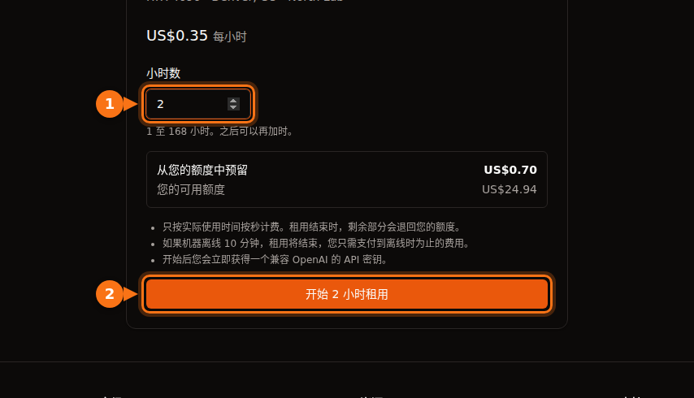

GPU 上架信息里的小时价只包含 GPU 时间，别的都不包含。在大多数平台上，你还要为磁盘空间付钱（停机时往往比运行时还贵），在一些市场平台上要为数据传输付钱，准备时间和空闲时间也和真正干活一样计费，此外还有银行的货币转换手续费。在下文的算例中，一个月原本计划花 $13.60 的 RTX 4090 时间，最后账单是 $42.23。

这些费用都不是故意藏起来的，只是按标价比较平台时很容易漏看。下面的每一项都在 2026 年 9 月对照各平台自己的文档和价格页面核实过，链接附在文末。标价本身请看 [GPU 租用价格对比](/zh_cn/gpu-rental-pricing-comparison-2026/)。

## 各平台的额外费用

| 费用 | Vast.ai | RunPod | Lambda | AWS EC2 | GPUFlow |
| --- | --- | --- | --- | --- | --- |
| 计费单位 | 按秒 | 按秒 | 按分钟 | 按秒，最低 60 秒 | 按秒，最低 1 分钟 |
| 停机期间的存储 | 按主机定价收费 | 卷磁盘 $0.20/GB/月 | 文件系统按 GiB/月计费 | EBS 继续计费 | 无 |
| 数据传输 | 按主机定价，每个字节都收 | 不收费 | 不收费 | 出站：每月 100 GB 免费，之后按 GB 计费 | 无 |
| 开始使用的门槛 | 最低预存 $5 | 一小时的额度；预付卡 $100 | 银行卡 $10 预授权 | 一种付款方式 | 充值 $10；预订金额全额预留 |
| 余额归零时 | 停止，之后销毁 | 停止；没有网络卷则数据丢失 | 用后按周结算 | 不适用 | 租用途中不会发生 |

GPUFlow 之所以能跳过存储和传输两行，是因为它出租的是另一种东西：一个 OpenAI 兼容 API 密钥，对应已经在提供商 GPU 上运行的 AI 模型，而不是一台你能登录的机器。反过来说，你不能在上面运行自己的代码，也不能训练或微调。如果你需要的是一台机器，适用的是另外四列。

## 存储，尤其是停机期间

在任何租给你机器或容器的平台上，你的文件都放在磁盘上，磁盘只要存在就要花钱。

- **RunPod** 在 pod 运行时，容器磁盘和卷磁盘按每 GB 每月 $0.10 收费。停止 pod 后，容器磁盘被清空、不再收费，但卷磁盘涨到每 GB 每月 $0.20。网络卷不管是否在运行，1 TB 以下每 GB 每月 $0.07，1 TB 以上 $0.05。节省计划只覆盖 GPU 计算，存储按标准价收费。
- **Vast.ai** 对存储的计费是“实例存在的每一秒”，除离线外的任何状态都收。它的文档说得很直白：“停止实例并不能免除存储费用。”价格由主机设定。
- **AWS** 不对已停止实例的计算和数据传输收费，但“存储 Amazon EBS 卷会产生费用”，而且绑定在已停止实例上的弹性 IP 也继续计费。us-east-1 的 gp3 卷每 GB 每月约 $0.08。
- **Lambda** 对文件系统按每月实际使用的 GiB 计费，以一小时为单位。

已停止的 RunPod pod 上的一块 200 GB 卷磁盘，每月要 200 × $0.20 = $40，即使你再也不启动这个 pod。这笔钱够在 RunPod Community Cloud 上用 100 多个小时的 RTX 4090。

额度用完会让情况更糟。RunPod 余额到 $0 时，pod 会停止，而“没有网络卷的 Pod 会被终止，其数据无法恢复”。Vast.ai 也会停止实例；如果你没有保存银行卡，短暂宽限期后，“你的实例和存储的数据将被销毁”。所以一个被遗忘的卷，要么一直向你收钱，要么连同你的工作成果一起消失。

我的做法：项目结束当天就删掉卷，只把还需要的东西留在一个小的网络卷上，重要的东西在 GPU 平台以外的地方另存一份。

## 数据传输

下载一个 15 GB 的模型、上传一个数据集，一次会话就可能传输几十 GB。

- **Vast.ai** 对“实例收发的每个字节收取带宽费用，无论实例处于什么状态”。每个主机自行设定上传和下载价格，文档提醒这“可能显著影响数据密集型工作负载的总成本”。租之前在上架信息里看清楚。
- **RunPod** 表示 pod“入站/出站流量不收费”。
- **Lambda**：“入站和出站流量不向你收费。”
- **AWS**：入站免费。出站到互联网的流量，所有服务和区域合计每月前 100 GB 免费，之后按 GB 阶梯计费。每个公网 IPv4 地址不论是否在用都按每小时 $0.005 收费，一个 720 小时的月份就是 $3.60。

## 预存、预授权和预付额度

大多数 GPU 平台都是预付制：先买额度，再消费。存在平台上的钱也是一种成本，尤其是拿不回来的时候。

- **Vast.ai**：最低预存 $5，可用银行卡、BitPay 或 Crypto.com 支付。用银行卡购买、尚未消费的额度可以通过网站聊天申请退款；已消费的不能退。
- **RunPod**：账户里至少要有所选 pod 一小时的额度，预付卡每笔至少应充值 $100。额度不可退款，也不能提现。
- **Lambda** 则反过来：每周按上一周的用量结算，添加银行卡时做一笔 $10 的预授权，几天后退回。只接受主流信用卡，预付卡和借记卡会被拒。
- **SaladCloud**：充值金额 $5 到 $10,000，额度在购买 12 个月后过期。
- **GPUFlow**：通过 Stripe 用银行卡充值，每次 $10 到 $500，无手续费，额度不会过期。开始租用时，从你的额度中预留的是全部预订金额，而不是一小笔押金。以每小时 $0.40 预订 10 小时，就会预留 $4.00，直到租用结束；那时没用完的部分会退回。已购买的额度不能提现；银行卡退款仅限重复扣款或误扣、额度未到账或法律要求的情况，且须在 60 天内申请。

会过期的额度，或者留在一个你已经不用的平台上的额度，就等于花掉了。按本月预计的工作量充值，别按一年充。

## 准备时间和空闲时间

租来的机器按时间收费，不按工作量收费。有两种时间和真正干活一样花钱，却什么也不产出。

### 准备时间

机器一启动就开始计费。在 Lambda 上，“从你启动实例、实例通过健康检查的那一刻起开始计费”。安装库、拉取容器镜像、下载模型，都在计费时间内进行。按每小时 $0.34 计算，15 分钟准备时间约 $0.09。一次不多，但一个月每天都来一遍，就是好几个小时的 GPU 时间。

有两个办法：从一个已经装好你的软件栈的模板或镜像启动；把模型放在卷上，只下载一次（再和上面的存储费用权衡一下）。

在 GPUFlow 上，你这边没有准备步骤：提供商已经在机器上装好了模型，租用开始后你马上就能拿到 API 密钥。

### 空闲时间

Lambda 说得很直接：“实例只要在运行就计费，无论是否在实际使用。”Google Cloud 对处于 RUNNING 状态的空闲虚拟机也是同样的说法。为了早上能直接用而让 pod 开一整夜，就要付一整夜的 GPU 钱。

Azure 还有一个额外的坑。仅处于“已停止”状态的虚拟机（例如在操作系统内部关机）仍按核心计费。必须通过门户或 CLI 让它进入“已停止(已解除分配)”状态，计算费用才会停止。

GPUFlow 也不例外：在你点击 **立即结束** 或预订时间用完之前，一直在计费。提前结束不收费，预留金额中未用的部分会退回，所以办法很简单：用完就结束租用。详见 [GPUFlow 的计费方式](https://docs.gpuflow.app/zh-cn/renters/billing/)。

## 计费单位和最低收费

按秒计费现在很普遍，但细节各不相同：

| 平台 | 计费方式 |
| --- | --- |
| Vast.ai | 按秒 |
| RunPod pod | 按秒（pod 概览页面仍写着按分钟） |
| RunPod serverless | 按秒，向上取整，包括 worker 启动时间和空闲超时（默认 5 秒） |
| Lambda | 以一分钟为单位 |
| AWS EC2（Linux） | 按秒，最低 60 秒 |
| Google Cloud | 最低 1 分钟，之后按秒 |
| Azure | 按完整分钟 |
| GPUFlow | 按秒，最低 1 分钟，向上取整到分 |

对长任务来说，这些差别可以忽略。对大量短会话和 serverless 来说就要紧了，因为 serverless 在请求之外还要为启动时间和空闲超时计费。如果你发送的是有间隔的短请求，这两部分可能比请求本身还贵。[GPU 按秒计费与按小时计费](/zh_cn/per-second-vs-hourly-gpu-billing/)一文有详细算例。

## 可中断实例

可中断（竞价）算力更便宜，有时便宜很多，但随时可能被收回。

- Vast.ai 称可中断实例“通常比按需便宜 50% 以上”。
- 2026 年 9 月，AWS 上的 p5.4xlarge（一块 H100）竞价价格为每小时 $2.62，按需为 $6.88。
- 在 TensorDock 上，存储按标准价格在你的出价之外另收，被别人出价超过期间也照收不误。主机会设定最低出价，一般约为按需价格的 50%。

隐藏的成本是重复劳动。如果任务不能从检查点恢复，一次中断就可能把省下的钱全抵掉。检查点要存得足够勤，勤到丢掉最后一段也不心疼。

## 银行的手续费

几乎所有 GPU 平台都以美元收费，GPUFlow 也一样。如果你的银行卡是其他币种，银行可能会另收一笔手续费：

- 境外交易手续费通常为 1% 到 3%，有些银行即使价格以美元显示，只要商户在境外也会收取。
- 大多数加拿大信用卡对其他币种的消费收取约 2.5%。
- 在巴西，自 2025 年 7 月起，境外刷卡消费的 IOF 税为 3.5%。

充值 $100，就有 $1 到 $3.50 不会出现在平台的发票上。用一张免境外交易手续费的卡，可以省掉大部分。

## 算例：每小时 $0.34，每月 $42

下面是一个真实的月份：在 RunPod Community Cloud 上以每小时 $0.34 租一块 RTX 4090，用一张加拿大信用卡付款：

- 40 小时实际工作：40 × $0.34 = $13.60。这是大家做预算时用的数字。
- 20 次会话，每次准备 15 分钟，共 5 小时：5 × $0.34 = $1.70。
- 有两个晚上 pod 没关，每次 10 小时：20 × $0.34 = $6.80。
- 一块 100 GB 的卷磁盘保留了一整个月。在当月 720 小时中运行 65 小时，停机 655 小时：100 × ($0.10 × 65/720 + $0.20 × 655/720) = 约 $19.10。
- 小计 $41.20，再加 2.5% 的境外交易手续费：$1.03。

合计：$42.23，约为计划中 GPU 工作费用的 3.1 倍。RunPod 不收数据传输费，所以如果换成一个设了带宽价格的 Vast.ai 主机，还会再多一项。

<figure>
<svg viewBox="0 0 720 300" role="img" aria-labelledby="d1-title" xmlns="http://www.w3.org/2000/svg" font-family="system-ui, sans-serif" font-size="15">
<title id="d1-title">堆叠条形图：一个月计划花 13.60 美元的 RTX 4090 时间，加上准备时间、空闲的夜晚、磁盘存储和银行卡手续费后，账单变成 42.23 美元</title>
<rect x="0" y="0" width="720" height="300" fill="#ffffff"/>
<text x="20" y="28" fill="#1e1b4b" font-weight="600">以每小时 $0.34 使用一块 RTX 4090 一个月</text>
<line x1="130" y1="50" x2="130" y2="170" stroke="#e2e8f0" stroke-width="1"/>
<text x="130" y="190" text-anchor="middle" fill="#64748b" font-size="13">$0</text>
<line x1="250" y1="50" x2="250" y2="170" stroke="#e2e8f0" stroke-width="1"/>
<text x="250" y="190" text-anchor="middle" fill="#64748b" font-size="13">$10</text>
<line x1="370" y1="50" x2="370" y2="170" stroke="#e2e8f0" stroke-width="1"/>
<text x="370" y="190" text-anchor="middle" fill="#64748b" font-size="13">$20</text>
<line x1="490" y1="50" x2="490" y2="170" stroke="#e2e8f0" stroke-width="1"/>
<text x="490" y="190" text-anchor="middle" fill="#64748b" font-size="13">$30</text>
<line x1="610" y1="50" x2="610" y2="170" stroke="#e2e8f0" stroke-width="1"/>
<text x="610" y="190" text-anchor="middle" fill="#64748b" font-size="13">$40</text>
<text x="120" y="84" text-anchor="end" fill="#1e1b4b">计划</text>
<rect x="130" y="62" width="163.2" height="34" rx="3" fill="#6366f1"/>
<text x="301.2" y="84" fill="#1e1b4b">$13.60</text>
<text x="120" y="144" text-anchor="end" fill="#1e1b4b">实际账单</text>
<rect x="130" y="122" width="163.2" height="34" fill="#6366f1"/>
<rect x="293.2" y="122" width="20.4" height="34" fill="#eef2ff" stroke="#6366f1" stroke-width="1.5"/>
<rect x="313.6" y="122" width="81.6" height="34" fill="#f97316"/>
<rect x="395.2" y="122" width="229.2" height="34" fill="#64748b"/>
<rect x="624.4" y="122" width="12.4" height="34" fill="#1e1b4b"/>
<text x="644.8" y="144" fill="#1e1b4b" font-weight="600">$42.23</text>
<line x1="130" y1="50" x2="130" y2="170" stroke="#64748b" stroke-width="1.5"/>
<rect x="20" y="209" width="16" height="16" fill="#6366f1"/>
<text x="44" y="222" fill="#1e1b4b">GPU 工作：$13.60</text>
<rect x="250" y="209" width="16" height="16" fill="#eef2ff" stroke="#6366f1" stroke-width="1.5"/>
<text x="274" y="222" fill="#1e1b4b">准备时间：$1.70</text>
<rect x="480" y="209" width="16" height="16" fill="#f97316"/>
<text x="504" y="222" fill="#1e1b4b">空闲的夜晚：$6.80</text>
<rect x="20" y="245" width="16" height="16" fill="#64748b"/>
<text x="44" y="258" fill="#1e1b4b">卷磁盘：$19.10</text>
<rect x="250" y="245" width="16" height="16" fill="#1e1b4b"/>
<text x="274" y="258" fill="#1e1b4b">银行卡手续费：$1.03</text>
</svg>
<figcaption>本节的算例，按比例绘制：以每小时 $0.34 进行 40 小时实际 GPU 工作，加上 5 小时准备时间、两个忘了关机的夜晚、一块保留了一整个月的 100 GB 卷磁盘，以及 2.5% 的银行卡手续费。GPU 工作不到账单的三分之一。</figcaption>
</figure>

最大的一项根本不是 GPU，而是一块当月 91% 时间都处于停机状态的磁盘。解决办法很无聊：删掉卷或者把它缩小，不干活时就把 pod 结束掉。

### 租用前的检查清单

1. 把 GPU 时间和存储费用加起来，存储按停机价格、按你要保留文件的时长计算。
2. 如果平台有带宽价格，在上架信息里看清楚，并估算你要下载多少数据。
3. 把准备时间算作计费时间。
4. 想清楚怎样停止付费：结束租用、停止或解除分配机器、删除卷。
5. 弄清楚[余额归零时你的数据会怎样](/zh_cn/runpod-vs-vastapi-comparison/)。
6. 查一下你的银行卡的境外交易手续费。

如果你需要的是一个能从代码里调用的 AI 模型，而不是一台运行自己软件的机器，那么基于 API 的租用可以完全免掉存储、传输和准备时间这几项。[按小时租 GPU 还是按 token 调 API](/zh_cn/hourly-gpu-vs-per-token-api/)把它和按 token 付费做了比较，[GPUFlow、Vast.ai、RunPod 与 SaladCloud 对比](/zh_cn/gpuflow-vs-vast-ai-vs-runpod/)介绍了哪个平台适合哪种任务。对于训练或其他需要完整机器的任务，这份清单能让你的账单尽量接近小时价。

## 资料来源

- RunPod：[Pod 价格和存储](https://docs.runpod.io/pods/pricing)、[价格页面](https://www.runpod.io/pricing)、[Pod 概览](https://docs.runpod.io/pods/overview)、[serverless 价格](https://docs.runpod.io/serverless/pricing)、[计费信息](https://docs.runpod.io/references/billing-information)、[RTX 4090 价格](https://www.runpod.io/gpu-models/rtx-4090)
- Vast.ai：[价格](https://docs.vast.ai/guides/instances/pricing.md)、[计费](https://docs.vast.ai/documentation/reference/billing)、[快速入门（最低预存）](https://docs.vast.ai/guides/get-started/quickstart.md)
- Lambda：[计费](https://docs.lambda.ai/public-cloud/billing/)、[管理计费](https://docs.lambda.ai/public-cloud/manage-billing/)
- SaladCloud：[计费](https://docs.salad.com/general/explanation/billing.md)
- TensorDock：[竞价实例](https://docs.tensordock.com/virtual-machines/spot-instances)
- AWS：[EC2 按需价格](https://aws.amazon.com/ec2/pricing/on-demand/)、[停止和启动的工作原理](https://docs.aws.amazon.com/AWSEC2/latest/UserGuide/how-ec2-instance-stop-start-works.html)、[VPC 价格（公网 IPv4）](https://aws.amazon.com/vpc/pricing/)、[Vantage 上的 p5.4xlarge 价格](https://instances.vantage.sh/aws/ec2/p5.4xlarge?region=us-east-1)，gp3 价格：[CloudBurn EBS 价格指南](https://cloudburn.io/blog/amazon-ebs-pricing)
- Google Cloud：[虚拟机实例价格](https://cloud.google.com/compute/vm-instance-pricing)
- Azure：[Linux 虚拟机价格和 FAQ](https://azure.microsoft.com/en-us/pricing/details/virtual-machines/linux/)
- 银行卡手续费：[Experian](https://www.experian.com/blogs/ask-experian/what-is-a-foreign-transaction-fee/)、[NerdWallet Canada](https://www.nerdwallet.com/ca/p/best/credit-cards/best-no-foreign-transaction-fee-credit-cards)，巴西 IOF：[Wise Brazil](https://wise.com/br/blog/iof-cartao-internacional)
- GPUFlow：[计费](https://docs.gpuflow.app/zh-cn/renters/billing/)、[入门](https://docs.gpuflow.app/zh-cn/renters/getting-started/)、[市场](https://gpuflow.app/zh-CN/marketplace)

均于 2026 年 9 月核实。
