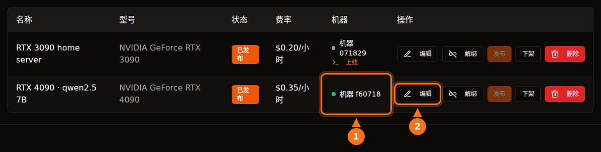

只要你清楚自己选的是什么平台，出租 GPU 是相当安全的，但“安全”在不同平台上含义不同。在 Vast.ai 这类容器平台上，租用者在你的机器上运行自己的代码，流量从你的 IP 地址出去；隔离能把他们挡在你的文件之外，却挡不住他们使用你的网络，也挡不住电费。在 GPUFlow 这种只提供 API 的设计中，租用者只能向你安装的模型发送聊天请求，风险方向反了过来：提示词在你的机器上是可读的，所以租用者不应该发送任何机密内容。

本文把两个方向都讲一遍。关于第三方平台的说法，均于 2026 年 9 月对照各平台自己的文档核实过；关于 GPUFlow 的一切都来自其源代码和文档。出处附在文末。

## 在容器平台上，租用者能做什么

大多数 GPU 市场出租的是容器。租用者选一个镜像，拿到一个 shell，想运行什么就运行什么。作为主机，你要考虑五件事。

- **任意代码。** 租用者的代码在容器或虚拟机里运行，但用的是你的内核。隔离做得不错，但并不完美；容器逃逸很少见，而这类漏洞恰恰是靠你需要安装的内核和驱动更新来修补的。
- **你的 IP 地址。** 容器发出的流量走你的网络出口。如果租用者爬取网站、发垃圾邮件或扫描互联网，滥用投诉会发到你的网络运营商那里，指向你的 IP。Vast.ai 的条款规定，因用户内容引起的索赔由用户向提供商承担赔偿责任，这在与第三方的纠纷中有用，但阻止不了运营商给你发警告。
- **开放端口。** Vast.ai 的托管指南写道：“大多数任务需要开放端口，客户才能直接连接到机器”，所以你要在路由器上做端口转发。
- **磁盘。** 租用者会把镜像、模型和数据集下载到你的硬盘上。客户删除卷后，Vast.ai 会释放空间，但租用期间这些空间归对方使用。
- **电、热和驱动。** Vast.ai 提醒主机：“租用期间，GPU 基本会以接近满负荷的状态运行。”这意味着连续几个小时的满功耗、房间发热和风扇狂转。容器平台还需要专门的配置：Vast.ai 的指南列出了安装 Ubuntu、磁盘分区、安装 NVIDIA 驱动和开放路由器端口等步骤。

## Vast.ai、Salad 和 RunPod 如何隔离租用者

| | Vast.ai | Salad | RunPod Community Cloud |
| --- | --- | --- | --- |
| **租用者得到什么** | 一个容器（或虚拟机），可用 SSH 或 Jupyter | 自己部署的容器，可通过 SSH 和网页终端进入 | 一个 pod（容器） |
| **隔离方式** | 非特权 Docker 容器 | 虚拟机管理程序上的 Linux 虚拟机，里面再跑容器 | “独立容器，严格隔离” |
| **入站端口** | 大多数任务需要 | 默认屏蔽 | 未说明 |
| **是否接受新主机** | 接受，Ubuntu 系统 | 接受，Windows 10/11 系统 | 已不再接受 |

- **Vast.ai** 表示“客户被隔离在非特权 Docker 容器中，只能访问自己的数据”，使用独立的命名空间和 cgroups，并对网络、文件系统和进程做了隔离。它也提醒租用者“各提供商的安全水平差别很大”，并建议把敏感任务放到由认证数据中心组成的 Secure Cloud 层级。
- **Salad** 表示“你的工作负载运行在 Linux 虚拟机中的 OCI 兼容容器里，与 Windows 及主机上的其他所有进程隔离”，入站连接默认屏蔽。它也保护租用者免受主机侵害：如果主机“试图访问 Linux 环境，我们会自动销毁该环境并将机器列入黑名单”。另外，Salad 提供可选的带宽共享任务，会通过你的网络“处理来自付费流媒体平台的视频内容”；其帮助页面提醒，这会增加你的流量，并可能导致“在这些流媒体平台上出现少见的、暂时的内容限制，通常持续 1 到 2 天”。
- **RunPod** 表示“RunPod 已不再为 Community Cloud 接受新主机”。对于现有算力，“每个 Pod/worker 都在自己的容器中运行”，其条款“禁止主机查看你的 Pod/worker 数据”。

这三家都把租用者和你的系统隔离开了。但都拦不住租用者看起来正常的流量从你的网络出去，也都没有这样声称。

## GPUFlow 的设计有何不同

GPUFlow 出租的是一个通过 OpenAI 兼容 API 提供服务的 AI 模型，而不是一台机器。这改变了租用者能碰到的范围。下面是代码实际做的事。

**代理。** 安装程序把一个 Go 编写的二进制文件放在 `/usr/local/bin/gpuflow-agent`，作为 systemd 服务运行。不用 Docker。服务单元设置了 `DynamicUser=yes`（临时的非特权用户）、`NoNewPrivileges=yes`（无法提升权限）、`ProtectSystem=strict`（系统对它只读）、`ProtectHome=yes`（看不到用户主目录）和 `PrivateTmp=yes`。推理引擎默认是 Ollama，由 Ollama 自己的安装脚本安装为独立服务（提供商也可以让代理指向自己的 OpenAI 兼容服务器）。这些加固措施作用于代理，而不是 Ollama。

**网络。** 代理只发起出站连接：一条到 `wss://ws.gpuflow.app` 的 TLS WebSocket，以及到 `gpuflow.app` 的 HTTPS 连接，用于注册机器和每 15 秒发送一次心跳。它不开放任何端口，你不用在路由器上转发任何东西，租用者也永远不会知道你的 IP 地址。它通过 `127.0.0.1:11434` 与 Ollama 通信，这是 Ollama 默认的本地回环地址。

**租用者能调用什么。** 租用者拿到的是 `https://gpuflow.app/v1` 的 API 密钥。`GET /v1/models` 由 GPUFlow 自己应答，唯一会转发到你机器上的请求是 `POST /v1/chat/completions`。代理自己还有第二道锁：它只代理四个确切的路径（`/v1/chat/completions`、`/v1/completions`、`/v1/embeddings` 和 `/v1/models`），其他一律拒绝，包括 Ollama 原生的 `/api/*` 端点，这些端点可以拉取、删除或创建模型。代理只处理一种消息类型，即推理请求；其他消息一律忽略。

所以租用者没有 shell、没有 SSH、碰不到文件，也不能通过你的机器访问网络。他们没法往你的磁盘上下载 70 GB 的模型，也没法用你的网络访问互联网。他们能做的，是在预订的时长内让你的 GPU 持续工作，并在 `model` 字段中指定你安装的任意模型。

<figure>
<svg viewBox="0 0 720 380" role="img" aria-labelledby="d1-title" xmlns="http://www.w3.org/2000/svg" font-family="system-ui, sans-serif" font-size="15">
<title id="d1-title">租用者在容器平台上能做的事，与 GPUFlow 这类只提供 API 的设计对比</title>
<rect x="0" y="0" width="720" height="380" fill="#ffffff"/>
<text x="20" y="40" fill="#64748b" font-weight="bold">租用者能做什么</text>
<text x="470" y="40" text-anchor="middle" fill="#1e1b4b" font-weight="bold">容器平台</text>
<text x="630" y="40" text-anchor="middle" fill="#1e1b4b" font-weight="bold">GPUFlow（API）</text>
<line x1="20" y1="55" x2="700" y2="55" stroke="#e2e8f0" stroke-width="2"/>
<text x="20" y="89" fill="#1e1b4b">运行自己的程序</text>
<rect x="430" y="70" width="80" height="28" rx="14" fill="#fff7ed" stroke="#f97316" stroke-width="2"/>
<text x="470" y="89" text-anchor="middle" fill="#1e1b4b">能</text>
<rect x="590" y="70" width="80" height="28" rx="14" fill="#f0fdf4" stroke="#16a34a" stroke-width="2"/>
<text x="630" y="89" text-anchor="middle" fill="#1e1b4b">不能</text>
<line x1="20" y1="110" x2="700" y2="110" stroke="#e2e8f0" stroke-width="1"/>
<text x="20" y="133" fill="#1e1b4b">打开 shell 或 SSH</text>
<rect x="430" y="114" width="80" height="28" rx="14" fill="#fff7ed" stroke="#f97316" stroke-width="2"/>
<text x="470" y="133" text-anchor="middle" fill="#1e1b4b">能</text>
<rect x="590" y="114" width="80" height="28" rx="14" fill="#f0fdf4" stroke="#16a34a" stroke-width="2"/>
<text x="630" y="133" text-anchor="middle" fill="#1e1b4b">不能</text>
<line x1="20" y1="154" x2="700" y2="154" stroke="#e2e8f0" stroke-width="1"/>
<text x="20" y="177" fill="#1e1b4b">往你的磁盘写文件</text>
<rect x="430" y="158" width="80" height="28" rx="14" fill="#fff7ed" stroke="#f97316" stroke-width="2"/>
<text x="470" y="177" text-anchor="middle" fill="#1e1b4b">能</text>
<rect x="590" y="158" width="80" height="28" rx="14" fill="#f0fdf4" stroke="#16a34a" stroke-width="2"/>
<text x="630" y="177" text-anchor="middle" fill="#1e1b4b">不能</text>
<line x1="20" y1="198" x2="700" y2="198" stroke="#e2e8f0" stroke-width="1"/>
<text x="20" y="221" fill="#1e1b4b">用你的 IP 发出流量</text>
<rect x="430" y="202" width="80" height="28" rx="14" fill="#fff7ed" stroke="#f97316" stroke-width="2"/>
<text x="470" y="221" text-anchor="middle" fill="#1e1b4b">能</text>
<rect x="590" y="202" width="80" height="28" rx="14" fill="#f0fdf4" stroke="#16a34a" stroke-width="2"/>
<text x="630" y="221" text-anchor="middle" fill="#1e1b4b">不能</text>
<line x1="20" y1="242" x2="700" y2="242" stroke="#e2e8f0" stroke-width="1"/>
<text x="20" y="265" fill="#1e1b4b">需要在你的路由器上开放端口</text>
<rect x="430" y="246" width="80" height="28" rx="14" fill="#fff7ed" stroke="#f97316" stroke-width="2"/>
<text x="470" y="265" text-anchor="middle" fill="#1e1b4b">通常需要</text>
<rect x="590" y="246" width="80" height="28" rx="14" fill="#f0fdf4" stroke="#16a34a" stroke-width="2"/>
<text x="630" y="265" text-anchor="middle" fill="#1e1b4b">不需要</text>
<line x1="20" y1="286" x2="700" y2="286" stroke="#e2e8f0" stroke-width="1"/>
<text x="20" y="309" fill="#1e1b4b">下载或删除模型</text>
<rect x="430" y="290" width="80" height="28" rx="14" fill="#fff7ed" stroke="#f97316" stroke-width="2"/>
<text x="470" y="309" text-anchor="middle" fill="#1e1b4b">能</text>
<rect x="590" y="290" width="80" height="28" rx="14" fill="#f0fdf4" stroke="#16a34a" stroke-width="2"/>
<text x="630" y="309" text-anchor="middle" fill="#1e1b4b">不能</text>
<line x1="20" y1="330" x2="700" y2="330" stroke="#e2e8f0" stroke-width="1"/>
<text x="20" y="353" fill="#1e1b4b">让你的 GPU 连续忙上几个小时</text>
<rect x="430" y="334" width="80" height="28" rx="14" fill="#eef2ff" stroke="#6366f1" stroke-width="2"/>
<text x="470" y="353" text-anchor="middle" fill="#1e1b4b">能</text>
<rect x="590" y="334" width="80" height="28" rx="14" fill="#eef2ff" stroke="#6366f1" stroke-width="2"/>
<text x="630" y="353" text-anchor="middle" fill="#1e1b4b">能</text>
</svg>
<figcaption>容器一列描述的是 Vast.ai 式的托管：文件和流量留在租用者的容器里，但用的仍是你的磁盘和网络。具体情况因平台而异：Salad 把容器放在 Linux 虚拟机中运行，默认屏蔽入站连接。在 GPUFlow 上，租用者只能向你安装的模型发送聊天请求。</figcaption>
</figure>

## 数据路径，逐跳拆解

这一部分是写给租用者看的。一条聊天请求要经过四个软件，文本在其中不止一处是可读的。

<figure>
<svg viewBox="0 0 720 330" role="img" aria-labelledby="d2-title" xmlns="http://www.w3.org/2000/svg" font-family="system-ui, sans-serif" font-size="15">
<title id="d2-title">一条 GPUFlow 聊天请求从租用者的应用出发，依次经过 gpuflow.app、中继、提供商电脑上的代理和 Ollama，回答再沿原路流式返回</title>
<rect x="0" y="0" width="720" height="330" fill="#ffffff"/>
<rect x="480" y="50" width="230" height="200" rx="12" fill="#fff7ed" stroke="#f97316" stroke-width="2" stroke-dasharray="6 4"/>
<text x="595" y="76" text-anchor="middle" fill="#1e1b4b" font-weight="bold">提供商的电脑</text>
<rect x="10" y="110" width="110" height="70" rx="10" fill="#eef2ff" stroke="#6366f1" stroke-width="2"/>
<text x="65" y="141" text-anchor="middle" fill="#1e1b4b">租用者的</text>
<text x="65" y="161" text-anchor="middle" fill="#1e1b4b">应用</text>
<rect x="160" y="110" width="120" height="70" rx="10" fill="#eef2ff" stroke="#6366f1" stroke-width="2"/>
<text x="220" y="141" text-anchor="middle" fill="#1e1b4b">GPUFlow API</text>
<text x="220" y="161" text-anchor="middle" fill="#64748b" font-size="12">gpuflow.app/v1</text>
<rect x="320" y="110" width="105" height="70" rx="10" fill="#eef2ff" stroke="#6366f1" stroke-width="2"/>
<text x="372" y="141" text-anchor="middle" fill="#1e1b4b">中继</text>
<text x="372" y="161" text-anchor="middle" fill="#64748b" font-size="12">ws.gpuflow.app</text>
<rect x="492" y="110" width="90" height="70" rx="10" fill="#ffffff" stroke="#6366f1" stroke-width="2"/>
<text x="537" y="141" text-anchor="middle" fill="#1e1b4b">GPUFlow</text>
<text x="537" y="161" text-anchor="middle" fill="#1e1b4b">代理</text>
<rect x="610" y="110" width="90" height="70" rx="10" fill="#ffffff" stroke="#6366f1" stroke-width="2"/>
<text x="655" y="141" text-anchor="middle" fill="#1e1b4b">Ollama</text>
<text x="655" y="161" text-anchor="middle" fill="#64748b" font-size="12">127.0.0.1</text>
<line x1="124" y1="145" x2="156" y2="145" stroke="#16a34a" stroke-width="4"/>
<line x1="284" y1="145" x2="316" y2="145" stroke="#64748b" stroke-width="4"/>
<line x1="429" y1="145" x2="488" y2="145" stroke="#16a34a" stroke-width="4"/>
<line x1="586" y1="145" x2="606" y2="145" stroke="#f97316" stroke-width="4"/>
<text x="140" y="102" text-anchor="middle" fill="#16a34a" font-size="13">TLS</text>
<text x="300" y="102" text-anchor="middle" fill="#64748b" font-size="13">内部</text>
<text x="452" y="102" text-anchor="middle" fill="#16a34a" font-size="13">TLS</text>
<text x="596" y="102" text-anchor="middle" fill="#f97316" font-size="13">明文</text>
<text x="65" y="212" text-anchor="middle" fill="#64748b" font-size="12">文本在这里</text>
<text x="65" y="228" text-anchor="middle" fill="#64748b" font-size="12">写成</text>
<text x="220" y="212" text-anchor="middle" fill="#64748b" font-size="12">读取文本，</text>
<text x="220" y="228" text-anchor="middle" fill="#64748b" font-size="12">只保存</text>
<text x="220" y="244" text-anchor="middle" fill="#64748b" font-size="12">token 数</text>
<text x="372" y="212" text-anchor="middle" fill="#64748b" font-size="12">原样转发，</text>
<text x="372" y="228" text-anchor="middle" fill="#64748b" font-size="12">不记录</text>
<text x="372" y="244" text-anchor="middle" fill="#64748b" font-size="12">消息正文</text>
<text x="595" y="212" text-anchor="middle" fill="#1e1b4b" font-size="13" font-weight="bold">内存中是明文</text>
<text x="595" y="230" text-anchor="middle" fill="#1e1b4b" font-size="13" font-weight="bold">机主有 root 权限</text>
<line x1="20" y1="295" x2="50" y2="295" stroke="#16a34a" stroke-width="4"/>
<text x="58" y="300" fill="#1e1b4b" font-size="13">互联网上走 TLS</text>
<line x1="235" y1="295" x2="265" y2="295" stroke="#64748b" stroke-width="4"/>
<text x="273" y="300" fill="#1e1b4b" font-size="13">GPUFlow 内部</text>
<line x1="420" y1="295" x2="450" y2="295" stroke="#f97316" stroke-width="4"/>
<text x="458" y="300" fill="#1e1b4b" font-size="13">提供商电脑上是明文</text>
</svg>
<figcaption>请求从左往右走，回答沿原路流式返回。每一段经过互联网的连接都有 TLS 保护，但 TLS 在每台服务器处终止，所以文本在 GPUFlow 服务器转发时是可读的，在运行模型的提供商电脑上也是可读的。</figcaption>
</figure>

1. **租用者到 gpuflow.app：** HTTPS。网站部署在 Cloudflare 之后。
2. **GPUFlow 的 API 到中继：** GPUFlow 内部的连接。API 校验密钥，原样转发请求正文，并记录 token 数量。它不保存请求或回答的文本，隐私政策中也写明了这一点。
3. **中继到提供商的代理：** 由代理发起的 TLS WebSocket 连接。中继只记录每条消息的类型，不记录内容。
4. **代理到 Ollama：** 提供商电脑内部回环地址上的普通 HTTP。代理同样不记录请求正文。

到模型之间没有端到端加密，用普通的推理引擎也不可能有：模型必须读懂提示词才能回答。

## 提供商能看到什么

直说吧：**提供商的电脑以明文处理你的提示词和回答。** Ollama 在那里运行，而提供商拥有这台机器的 root 权限（安装程序需要 root）。提供商如果有心，可以抓取回环流量、更换推理引擎，或者让代理指向另一台服务器。

拦在中间的是合同约束。GPUFlow 的条款规定，提供商“不得记录、读取、保留或分享租用者的请求或回答，也不得修改回答”。这是一条违反后会影响账户的规则，不是技术上的阻断。隐私政策对租用者也是这样说的：租用期间，请求和回答会经过提供商的电脑。

除了提示词，提供商还能看到你的 GPUFlow 用户名，并在租用开始时收到通知（租用编号、上架信息和时长）。租用者则看不到提供商机器的任何统计数据；GPU 温度、显存、功耗等遥测数据只会显示在机主自己的仪表板上。

给租用者的实用原则：**不要通过任何社区 GPU 发送机密信息、凭据、他人的个人数据或受监管的数据（健康、财务、客户保密信息）。** 这对 GPUFlow 适用，对别人家用电脑上的容器同样适用，因为主机凭同样的 root 权限就能查看内存和磁盘。敏感任务请在你自己掌控的硬件上运行模型，或者选择能签署你的合规要求所需协议的服务商。[为什么有些公司禁止使用公共 AI 工具](/zh_cn/why-corporate-policies-banning-chatgpt/)讲的是政策层面，[如何在公共 GPU 节点上保护数据集](/zh_cn/how-to-secure-dataset-on-public-gpu-node/)讲的是容器层面。

## GPUFlow 上仍然存在的风险

只提供 API 缩小了攻击面，但并没有消除它。与其假装没有风险，我宁愿把剩下的风险列出来。

- **Ollama 要解析不可信的输入。** 每个租用者请求最后都会变成交给 Ollama 的 JSON。Ollama 的漏洞是最可能的突破口，所以要及时更新它。代理的白名单让租用者碰不到 Ollama 的模型管理端点，但修不了聊天路径上的漏洞。
- **安装程序以 root 身份运行。** 你要把 gpuflow.app 上的脚本通过管道交给 `sudo bash` 执行，它还会运行 Ollama 的安装脚本。先把两个脚本都读一遍；对任何托管软件来说，这都是好习惯。
- **没有自动更新。** 代理不会自己更新。要装新版本，就重新运行安装程序；如果发布了 SHA256SUMS 文件，安装程序会用它校验二进制文件。
- **负载。** 没有请求数量上限。租用者可以在预订的每个小时里都让你的 GPU 满载运行，也可以使用你安装的任意模型，包括最大的那个。
- **发热和耗电。** 和其他平台一样：出租的时间就是满载的时间。

## 提供商检查清单

1. **用一台借出去也无所谓的机器。** 最好是专用机器。至少不要在出租的电脑上存放工作文件或密码库，无论用哪个平台。在 GPUFlow 上，代理本身已经以临时系统用户运行，看不到主目录，但 Ollama 是单独的服务。
2. **限制功耗。** `sudo nvidia-smi -pl 280` 以瓦为单位设置显卡功耗上限（需要 root 权限，数值必须在显卡的最小和最大限制之间）。Puget Systems 的测试显示，RTX 3090 限制在 270-280 W 时能保留约 95% 的性能，文中还演示了如何用 systemd 单元在每次开机时重新应用这个限制。
3. **先算电费。** GPU 忙碌时，在 **我的机器** 中查看功耗，再用千瓦数乘以你的每千瓦时电价。[你的游戏显卡能赚多少](/zh_cn/how-much-can-you-earn-renting-out-your-gpu/)一文针对常见显卡和五个国家算过这笔账。
4. **注意温度。** 实时统计中会显示 GPU、热点和显存温度以及风扇转速。确保机箱通风。
5. **保持系统更新。** 及时安装 Linux、GPU 驱动和 Ollama 的更新。GPUFlow 安装程序不管理你的 GPU 驱动；重启后 systemd 会自动重新启动代理。
6. **知道怎么暂停。** 在 **我的 GPU** 中下架这条上架信息，或运行 `sudo systemctl stop gpuflow-agent`（用 `start` 恢复）。有租用进行中时，仪表板不允许修改上架信息或机器，你也不能从仪表板结束租用者的租用。在租用期间停止代理，租用会在 10 分钟后结束，你的收益只算到最后一次心跳为止。
7. **知道怎么卸载。** 步骤见[故障排除文档](https://docs.gpuflow.app/zh-cn/providers/troubleshooting/)。Ollama 会一直保留，直到你自己把它删除。

在容器平台上，还要再加两项：想清楚你是否真的要在路由器上开放端口，并问问你的网络运营商如何处理滥用投诉，因为租用者的流量会带着你的 IP 地址。

## 租用者检查清单

1. **把每一块社区 GPU 都当成陌生人的电脑。** 提示词里不要出现 API 密钥、密码、客户记录、医疗或财务数据。
2. **删掉不需要的信息。** 发送前把姓名和账号换成占位符。
3. **保管好你的密钥。** 在 GPUFlow 上，租用结束后密钥即失效。如果密钥泄露，**新密钥** 会立即吊销旧密钥，**立即结束** 会停止计费并退回未使用的时间。
4. **假定回答可能出错或被篡改。** 条款禁止提供商修改回答，但重要的内容还是要核对。
5. **敏感任务用合适的工具。** 自己部署，或者选择能提供你所需合同的服务商。其他情况可以参考[如何在应用中使用密钥](/zh_cn/use-openai-compatible-api-key-in-apps/)。

## 资料来源

均于 2026 年 9 月核实。

- GPUFlow：[租用者能访问什么](https://docs.gpuflow.app/zh-cn/providers/security/)、[提供商入门](https://docs.gpuflow.app/zh-cn/providers/getting-started/)、[定价与电费](https://docs.gpuflow.app/zh-cn/providers/pricing/)、[故障排除与卸载](https://docs.gpuflow.app/zh-cn/providers/troubleshooting/)、[API 快速入门](https://docs.gpuflow.app/zh-cn/renters/api-quickstart/)
- Vast.ai：[托管概览](https://docs.vast.ai/host/hosting-overview.md)、[安全 FAQ](https://docs.vast.ai/documentation/reference/faq/security)、[Linux 虚拟机](https://docs.vast.ai/linux-virtual-machines)、[服务条款](https://vast.ai/terms)、[安全运行私有 AI 模型](https://vast.ai/article/running-private-ai-models-without-the-risk-of-data-exposure)
- Salad：[安全](https://salad.com/security)、[容器工作负载与你的电脑](https://community.salad.com/container-workloads-and-your-pc/)、[带宽共享](https://support.salad.com/faq/jobs/what-is-bandwidth-sharing/)、[SSH 与终端](https://docs.salad.com/container-engine/explanation/container-groups/ssh-and-terminal.md)、[下载与系统要求](https://salad.com/download/)
- RunPod：[选择 pod](https://docs.runpod.io/pods/choose-a-pod)、[数据安全与合规](https://docs.runpod.io/hosting/partner-requirements)
- Ollama：[FAQ（默认绑定地址）](https://docs.ollama.com/faq)
- NVIDIA：[nvidia-smi 手册](https://docs.nvidia.com/deploy/nvidia-smi/index.html)
- Puget Systems：[用 systemd 和 nvidia-smi 限制 RTX 3090 功耗](https://www.pugetsystems.com/labs/hpc/quad-rtx3090-gpu-power-limiting-with-systemd-and-nvidia-smi-1983/)
