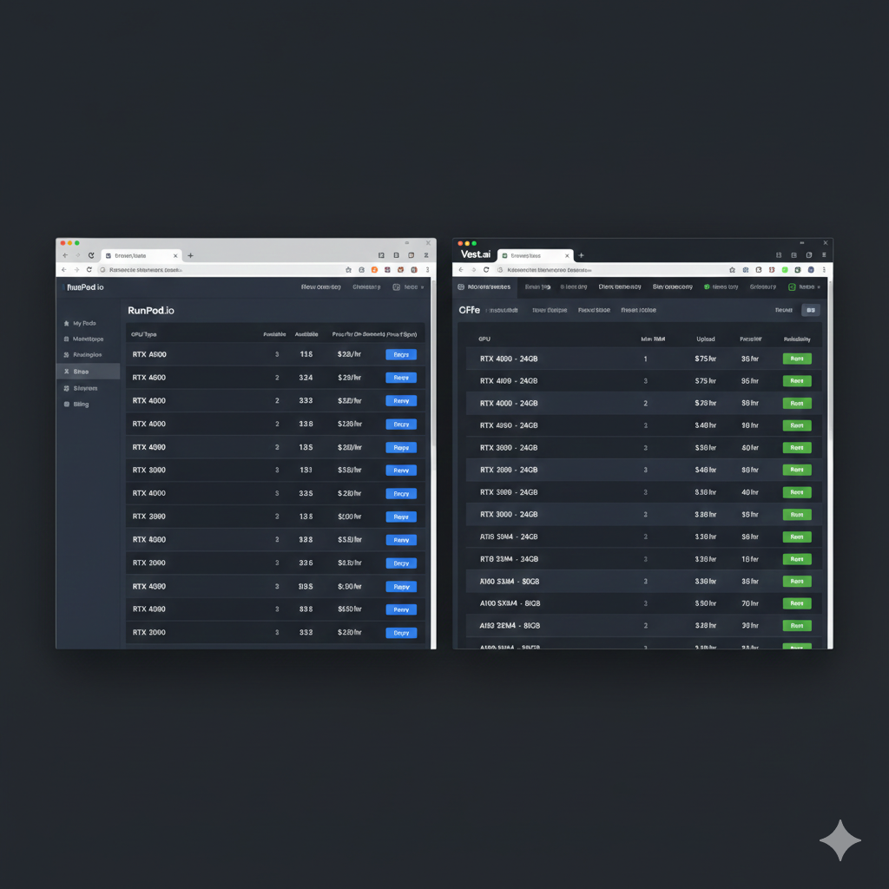
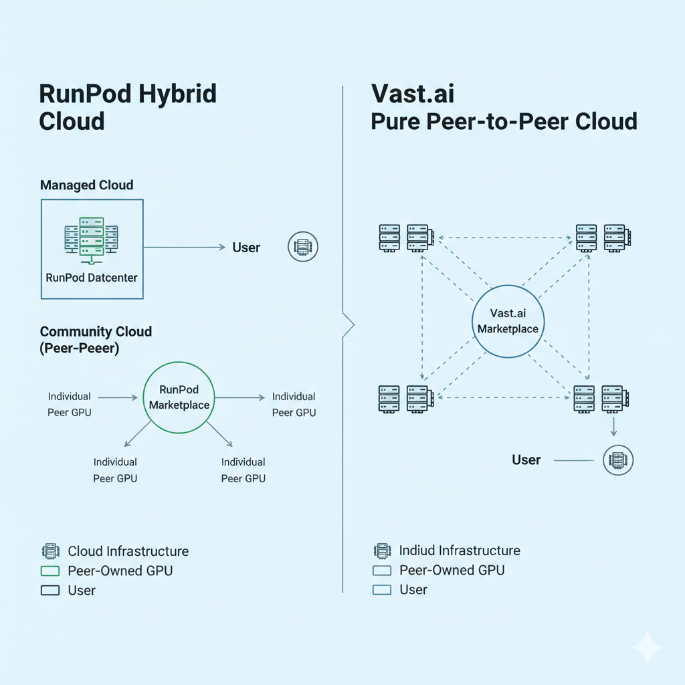
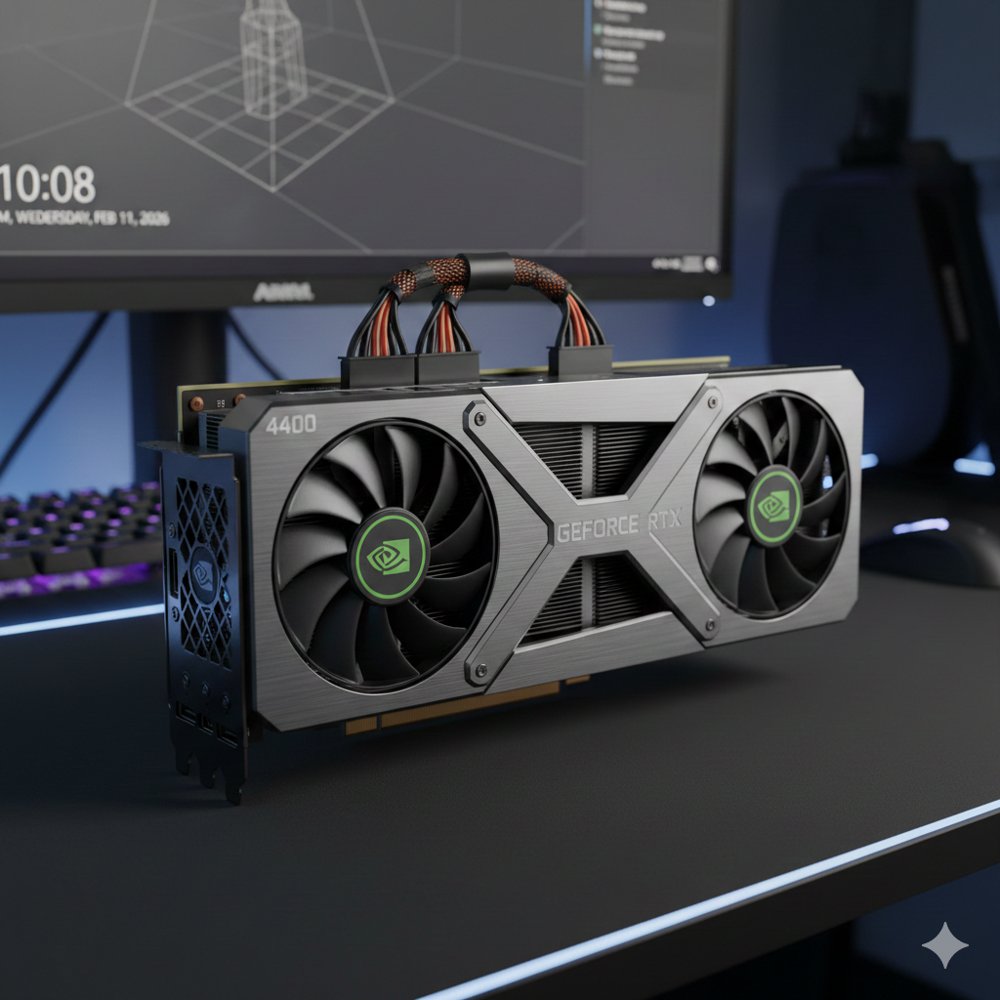
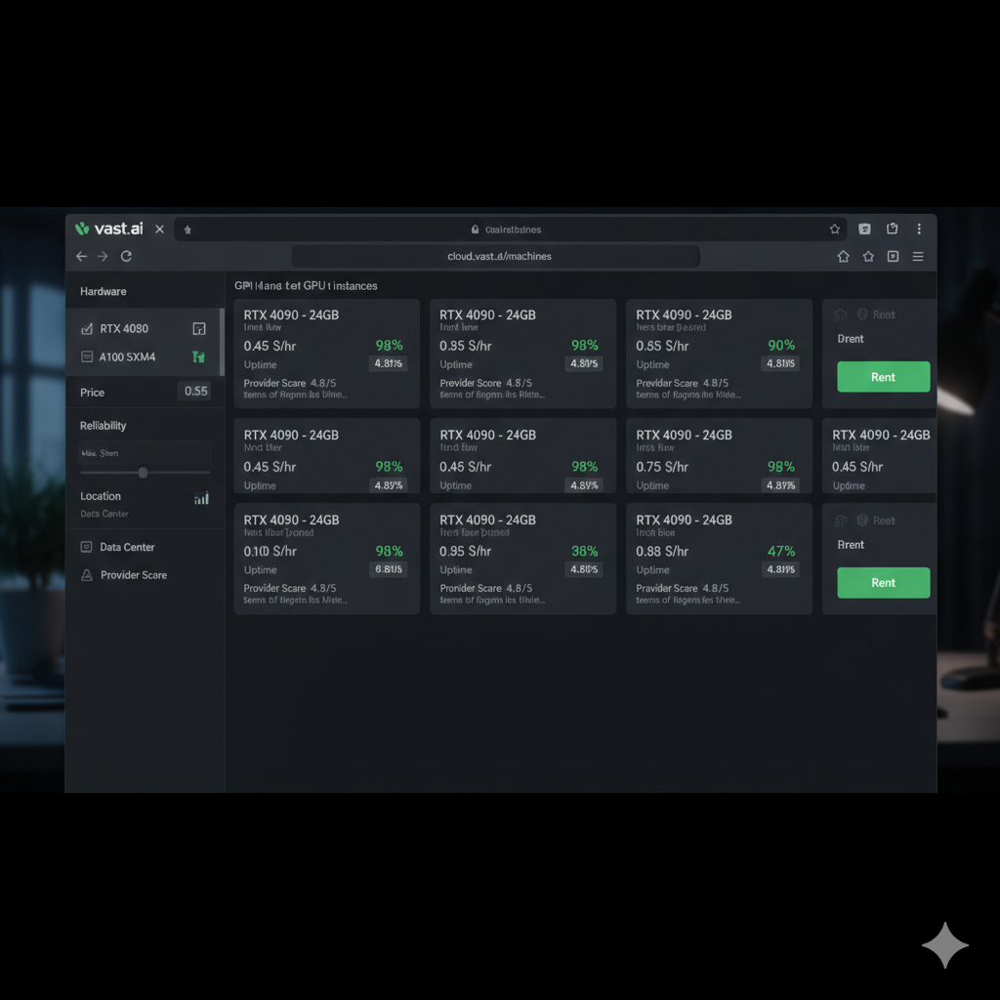
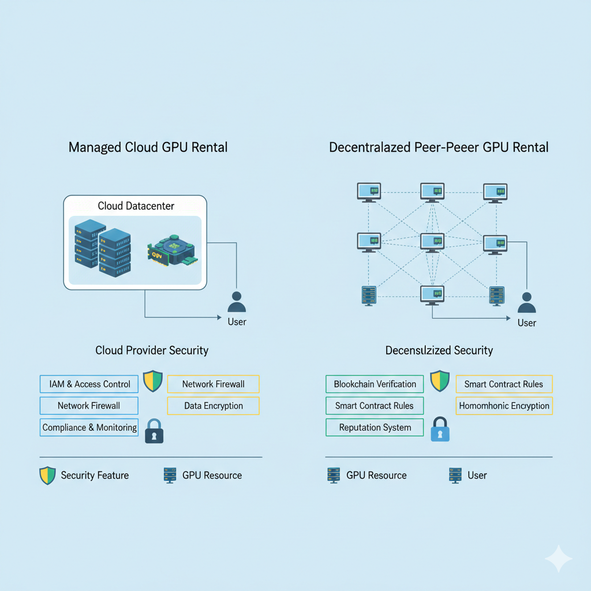

# RunPod vs Vast.ai：AI 开发者完整对比指南

对于需要 GPU 算力但又不想支付企业级云服务高昂费用的 AI 开发者来说，在 RunPod 和 Vast.ai 之间做出选择是一个非常普遍的决策。这两个平台都填补了昂贵的巨头服务商与自行购置硬件之间的空白，但它们解决问题的方法迥异，正确的选择很大程度上取决于您的具体需求。

本文将从实际 GPU 租赁中真正重要的维度对这两个平台进行考察：定价结构、可靠性特征、功能集以及每个平台最擅长处理的工作流。我曾在训练和推理负载中大量使用过这两个平台，本次分析结合了这些实操经验与当前的市分析场数据。

简而言之：Vast.ai 赢在价格，RunPod 赢在便利性和可靠性。而长篇分析则需要理解每个平台架构决策背后的权衡。

**本指南涵盖内容：**

- 包含真实成本计算的详细价格对比
- 基于平台架构和用户反馈指标的可靠性分析
- 两大平台各项功能的逐一拆解
- 针对不同工作负载类型的具体建议
- 快速上手每个平台的实操指导



---

## 目录

- [平台概览](#platform-overview)
- [定价对比](#pricing-comparison)
- [可靠性与在线率](#reliability-and-uptime)
- [可用硬件](#available-hardware)
- [用户体验与界面](#user-experience-and-interface)
- [模板与预配置环境](#templates-and-pre-configured-environments)
- [存储与数据传输](#storage-and-data-transfer)
- [付款方式](#payment-options)
- [支持与文档](#support-and-documentation)
- [安全考量](#security-considerations)
- [真实性能实测对比](#real-world-performance-comparison)
- [各平台的最佳应用场景](#best-use-cases-for-each-platform)
- [迁移注意事项](#migration-considerations)
- [其他备选方案](#alternatives-to-consider)
- [常见问题解答](#frequently-asked-questions)
- [最终总结建议](#final-recommendations)

---

## 平台概览

### RunPod：托管式算力市场

RunPod 于 2022 年推出，致力于让个人开发者和小型团队能够轻松租用 GPU。该平台采用混合模式：由管理的数据中心硬件组成的“Secure Cloud（安全云）”层级，以及类似于 Vast.ai 模式、整合个人供应商 GPU 的“Community Cloud（社区云）”层级。

公司已获得风险投资，并拥有一支全职的工程和支持团队。这种机构背景转化为更精致的用户体验、官方维护的模板以及及时的客户服务——这些都是纯 P2P 平台难以提供的“奢侈品”。

RunPod 的定位强调易用性。该平台针对的是希望快速部署 GPU 负载而无需深厚基础设施背景的用户。针对 Stable Diffusion WebUI、文本生成推理服务器和 Jupyter 笔记本的一键模板将配置时间从几小时缩短到了几分钟。

**RunPod 核心特征：**

- 结合托管数据中心和社区 GPU 的混合模式
- Secure Cloud 层级价格固定且可预测
- 针对常见 AI 负载提供丰富的预建模板
- 按秒计费，消除不足一小时的使用浪费
- 活跃的 Discord 社区，官方支持响应迅速
- 提供适用于推理负载的 Serverless GPU 选项

### Vast.ai：纯市场化平台

Vast.ai 在 2019 年成立时开创了点对点（P2P）GPU 租赁模式。该平台将个人 GPU 持有者（从拥有游戏主机的发烧友到运行小型私有数据中心的运营商）直接与需要计算资源的用户联系起来。

这种纯市场化的方法产生出了行业内最低的价格。由于没有数据中心管理开销或托管基础设施成本，GPU 持有者能够以低于任何其他选项的价格获利出租。其代价是波动性：不同的供应商提供的可靠性、网络性能和硬件质量水平参差不齐。

Vast.ai 吸引的是对成本敏感、且擅长根据可靠性评分、地理位置和硬件规格评估单个供应商的用户。平台为每个列表提供详细的指标，以便用户在价格和可靠性之间做出权衡决策。

**Vast.ai 核心特征：**

- 无托管基础设施的纯 P2P 市场
- 基于供需关系的竞拍式定价
- GPU 租赁市场中绝对价格最低
- 详尽的供应商可靠性指标和评分
- 硬件选择广泛，包含最新的消费级 GPU
- 需要用户具备较高的技术辨别能力才能高效使用



---

## 定价对比

价格是这两个平台之间最显著的区别因素。两者都比企业级云服务便宜得多，但对于预算有限的项目来说，它们之间的差距依然具有重要意义。

### 消费级 GPU 定价

RTX 4090 和 RTX 3090 等消费级 GPU 为大多数 AI 工作负载提供了最佳的性价比。AWS、Azure 和 GCP 均不提供这些 GPU——这是 RunPod 和 Vast.ai 的共同重大优势。

| GPU              | RunPod Secure Cloud | RunPod Community | Vast.ai 价格范围 | Vast.ai 平均价 |
| ---------------- | ------------------- | ---------------- | ---------------- | -------------- |
| RTX 5090 (32GB)  | $0.89/小时          | $0.55-0.85/小时  | $0.38-1.08/小时  | $0.65/小时     |
| RTX 4090 (24GB)  | $0.59/小时          | $0.44-0.55/小时  | $0.29-0.78/小时  | $0.45/小时     |
| RTX 3090 (24GB)  | $0.46/小时          | $0.32-0.40/小时  | $0.18-0.60/小时  | $0.35/小时     |
| RTX A6000 (48GB) | $0.49/小时          | $0.40-0.48/小时  | $0.40-0.70/小时  | $0.52/小时     |

**分析：** Vast.ai 的最低价格比 RunPod 便宜 30-50%，但要获得这些费率，通常需要选择可靠性评分较低或位置较偏的供应商。在均价水平下，两者的差距缩小到 15-25%。

### 数据中心级 GPU 定价

对于需要数据中心级硬件的工作负载——如大语言模型、多卡并行训练、生产环境推理——两个平台提供的 A100 和 H100 价格较巨头服务商都有大幅折扣。

| GPU       | RunPod Secure Cloud | RunPod Community | Vast.ai 价格范围 | AWS 等效价格  |
| --------- | ------------------- | ---------------- | ---------------- | ------------- |
| A100 40GB | 不适用              | $1.09-1.29/小时  | $0.80-1.20/小时  | 约 $4.10/小时 |
| A100 80GB | $1.39-1.49/小时     | $1.19-1.35/小时  | $0.84-1.49/小时  | 约 $4.10/小时 |
| H100 80GB | $2.39/小时          | $1.89-2.29/小时  | $1.47-2.94/小时  | 约 $6.90/小时 |
| L4 24GB   | $0.39/小时          | $0.29-0.35/小时  | $0.35-0.50/小时  | $0.80/小时    |

**分析：** 在数据中心 GPU 方面，两个平台比 AWS 节省 60-75%。对于高端硬件，RunPod 和 Vast.ai 之间的差距会缩小，因为此类硬件对可靠性要求更高，且市场上的供应商较少。

### 定价模式差异

除了原始费率外，定价模式在以下方面也存在显著差异：

**RunPod Secure Cloud：**

- 价格固定，不随需求波动
- 实例启动后保证可用性
- 无竞价或拍卖机制
- 成本可预测，便于预算管理

**RunPod Community Cloud：**

- 价格随供应商而异
- 供应商自行设定费率
- 如果供应商需要收回硬件，任务可能会被中断
- 经济性类似于竞价实例（Spot Instance）

**Vast.ai：**

- 基于供需关系的动态定价
- 供应商设定底价，市场决定实际费率
- 需求高峰期价格可能飙升
- 在非高峰时段可获得显著优惠

如需全面了解所有主流服务商（包括企业云选项）的 GPU 租赁定价，请参阅我们的 [2026 年 GPU 租赁价格对比全指南](/zh_cn/gpu-rental-pricing-comparison-2026/)。

### 真实成本案例：训练 LoRA 模型

为了说明实际成本差异，以训练一个 Stable Diffusion LoRA 模型为例——这是常见的工作负载，在 RTX 4090 上大约耗时 2 小时。

| 平台             | GPU 选择               | 每小时费率 | 2小时总计 |
| ---------------- | ---------------------- | ---------- | --------- |
| RunPod Secure    | RTX 4090               | $0.59      | $1.18     |
| RunPod Community | RTX 4090 (中位数价格)  | $0.49      | $0.98     |
| Vast.ai          | RTX 4090 (99%+ 可靠性) | $0.52      | $1.04     |
| Vast.ai          | RTX 4090 (97%+ 可靠性) | $0.38      | $0.76     |

RunPod Secure 与最便宜的 Vast.ai 选项之间 0.42 美元的差价在多次训练中会积少成多。如果是 50 次训练，将节省 21 美元——这对独立开发者很有意义，但对于专业应用来说，可能不值得为此承担可靠性方面的风险。

有关 LoRA 训练工作流（包括 GPU 选择和成本优化）的详细指导，请参阅我们的 [10 美元以内训练 Stable Diffusion LoRA 模型指南](/zh_cn/stable-diffusion-lora-training/)。

---

## 可靠性与在线率

除了价格之外，可靠性是区分 GPU 租赁平台的最大因素。如果您的训练任务在 12 小时工作进度的第 11 小时由于硬件不可靠而崩溃，那么便宜一半的价格也毫无意义。

### RunPod 可靠性架构

**Secure Cloud 层级：**
RunPod 的 Secure Cloud 在采用标准化配置的托管数据中心运行硬件。公司控制环境、维护硬件并对在线率负责。虽然 RunPod 没有发布 Secure Cloud 的正式 SLA 数据，但用户反馈和我的个人经验表明，其可用性在 99.5% 以上。

Secure Cloud 的硬件是独占的——一旦启动实例，它就会一直保持可用直到您将其终止。供应商无法在中途回收硬件。

**Community Cloud 层级：**
Community Cloud 的可靠性随供应商而异，与 Vast.ai 类似。供应商根据历史在线时间获得可靠性评级，用户可以筛选评级较高的供应商。平台通过供应商审核提供一定的保障，但中断仍有可能发生。

### Vast.ai 可靠性架构

Vast.ai 完全采用 P2P 模式，这意味着可靠性完全取决于单个供应商的行为。平台提供详细指标帮助用户评估风险：

**可靠性评分（Reliability Score）：** 机器在出租期间可用的时间百分比。范围通常在 92% 到 99.9% 之间。

**在线历史（Uptime History）：** 最近可用性的可视化呈现，显示任何故障或中断。

**供应商入驻时长（Provider Age）：** 供应商在平台上的时间。时间越长，其记录的参考价值越高。

**租赁次数（Number of Rentals）：** 租赁次数越多，可靠性评估的数据点就越丰富。

资深用户可以通过筛选可靠性评分 99% 以上、入驻时间 6 个月以上且位于电网稳定地区的供应商，在 Vast.ai 上获得极佳的可靠性。然而，这种筛选会减少可选资源量，且往往会排除掉最便宜的选项。

### 可靠性对比矩阵

| 指标       | RunPod Secure | RunPod Community | Vast.ai (99%+ 筛选) | Vast.ai (全部) |
| ---------- | ------------- | ---------------- | ------------------- | -------------- |
| 典型在线率 | 99.5%+        | 98-99%           | 99%+                | 95-99%         |
| 中断风险   | 极低          | 中等             | 低                  | 中等至偏高     |
| 硬件一致性 | 高            | 不稳定           | 不稳定              | 不稳定         |
| 网络性能   | 稳定          | 不稳定           | 不稳定              | 不稳定         |

### 实际可靠性考量

**对于 4 小时以内的训练：** 两个平台都能提供可接受的可靠性。对于短时间任务，Vast.ai 节省的成本通常足以抵消极小的中断风险。

**对于 4-12 小时的训练：** 建议选择 RunPod Secure Cloud，或者在 Vast.ai 上进行严格的可靠性筛选（99%+）。损失 8 小时训练进度的代价通常超过了为可靠性支付的溢价。

**对于 12 小时以上的训练：** 无论使用哪个平台，保存检查点（Checkpointing）都至关重要。建议每 30-60 分钟保存一次，这样即使发生中断，损失也仅限于上次保存以来的进度，而非全部。

**对于生产环境推理：** 除非您自己实现了故障转移和健康检查机制，否则 RunPod Secure Cloud 是明确的首选。生产系统需要确定的在线时间，而市场化运作的波动性无法提供此类保证。



## 可用硬件

这两个平台在提供企业云无法获取的硬件（尤其是消费级 GPU）方面表现出色。然而，它们的库存在各方面存在显著差异。

### 消费级 GPU 可用性

| GPU 型号        | RunPod 可用性 | Vast.ai 可用性   |
| --------------- | ------------- | ---------------- |
| RTX 5090 (32GB) | 良好          | 中等（新型 GPU） |
| RTX 4090 (24GB) | 极佳          | 极佳             |
| RTX 4080 (16GB) | 有限          | 良好             |
| RTX 3090 (24GB) | 良好          | 极佳             |
| RTX 3080 (12GB) | 有限          | 良好             |
| RTX 3070 (8GB)  | 非常有限      | 中等             |

Vast.ai 拥有更庞大的供应商群体，通常能提供更丰富的消费级硬件选择，包括较旧或不常见的型号。RunPod 则专注于 AI 负载最热门的选择，优先保证 RTX 4090 和 RTX 3090 的库存。

### 数据中心级 GPU 可用性

| GPU 型号   | RunPod 可用性 | Vast.ai 可用性 |
| ---------- | ------------- | -------------- |
| H100 80GB  | 良好          | 中等           |
| H200 140GB | 有限          | 有限           |
| A100 80GB  | 极佳          | 良好           |
| A100 40GB  | 良好 (社区云) | 良好           |
| A6000 48GB | 良好          | 良好           |
| L4 24GB    | 极佳          | 良好           |
| L40S 48GB  | 中等          | 有限           |
| A40 48GB   | 中等          | 中等           |

RunPod 为其 Secure Cloud 层级投资了大量数据中心级硬件，确保了 A100 和 H100 GPU 的稳定供应。Vast.ai 的数据中心 GPU 可用性则取决于购买或租赁了这些设备的供应商——供应情况可能较为零散。

### 多 GPU 配置

对于需要多卡并行的超大模型训练，两个平台与企业云相比都存在局限性。

**RunPod：** 在 Secure Cloud 中提供最高支持 8x A100 或 8x H100 的多卡 Pod。社区云的多卡可用性较低且不稳定。

**Vast.ai：** 多卡系统虽然存在但很稀缺。寻找 4x 或 8x GPU 系统需要耐心和灵活的时间安排。拥有多卡系统的供应商通常会收取溢价。

两个平台都无法完全匹配 AWS p4d 实例或 Azure ND 系列的多卡可用性。对于大规模的 8 卡训练，为了保证可用性，企业云仍然是必要的。

---

## 用户体验与界面

RunPod 和 Vast.ai 之间的用户体验差异反映了它们不同的理念和目标用户。

### RunPod 界面

RunPod 的界面优先考虑非基础设施专家的易用性。控制面板清晰地展示了可用 GPU 及其价格，只需点击几次即可完成部署，预配置模板处理了大部分环境设置。

**优点：**

- 界面整洁现代，导航直观
- 针对常见工作负载提供模板库
- Stable Diffusion、LLM 推理等一键部署
- 集成 JupyterLab 访问，无需额外配置
- 移动端适配良好，方便随时监控

**缺点：**

- 筛选选项不如 Vast.ai 细致
- 社区云供应商的选择信息不够详尽
- 高级配置需要深入设置菜单

### Vast.ai 界面

Vast.ai 的界面面向的是对基础设施决策游刃有余的用户。市场视图提供了极其丰富的筛选功能和详细的供应商信息，使用户能够精准地将需求与可用硬件匹配。

**优点：**

- 详细的供应商指标（可靠性、网速、地理位置）
- 可按 GPU 显存、磁盘空间和网络带宽进行高级筛选
- 支持价格排序和基于竞价的价格选项
- 供应商历史和评级透明
- 提供用于程序化访问的 CLI 工具

**缺点：**

- 新用户学习曲线较陡峭
- 界面信息过于密集，显得拥挤
- 模板系统不如 RunPod 精致
- 部署前需要做出更多决策

### 实例管理对比

| 功能              | RunPod   | Vast.ai    |
| ----------------- | -------- | ---------- |
| 首台 GPU 获取时间 | 2-5 分钟 | 2-5 分钟   |
| 模板部署          | 一键式   | 手动或模板 |
| SSH 访问          | 支持     | 支持       |
| Web 终端          | 支持     | 支持       |
| JupyterLab        | 已集成   | 需手动设置 |
| 文件浏览器        | 支持     | 有限支持   |
| 停止/恢复         | 支持     | 支持       |
| 按秒计费          | 支持     | 支持       |



---

## 模板与预配置环境

模板能显著缩短常见任务的生产准备时间。两个平台都提供模板系统，但在精致程度和覆盖面上有所不同。

### RunPod 模板

RunPod 为主要的 AI 负载维护着官方模板：

**Stable Diffusion：**

- Automatic1111 WebUI
- ComfyUI
- Forge WebUI
- InvokeAI

**LLM 推理：**

- Text Generation WebUI (Oobabooga)
- vLLM
- Ollama
- 兼容 OpenAI 的 API 服务器

**开发环境：**

- 带有 CUDA 的 PyTorch
- 带有 CUDA 的 TensorFlow
- Jupyter 笔记本
- VS Code Server

**其他：**

- Whisper（语音识别）
- 音乐生成模型
- 自定义容器支持

这些模板包含正确的 CUDA 配置，在适当情况下提供预下载模型，以及合理的默认设置。新用户在创建账户后 10 分钟内即可开始生成图像。

### Vast.ai 模板

Vast.ai 的模板系统筛选较少，但更为灵活：

**官方模板：**

- 基础 CUDA 开发环境
- Jupyter 笔记本配置
- 常见机器学习框架设置

**社区模板：**

- 用户提交的配置
- 质量和维护情况参差不齐
- 种类繁多但文档说明不一致

**Docker 集成：**

- 全面的 Docker 镜像支持
- 可拉取任何公共镜像
- 构建自定义镜像

Vast.ai 这种以 Docker 为核心的方法为清楚自己需求的用户提供了极大的灵活性。然而，缺乏维护良好的官方模板意味着在处理常见用例时需要更多的配置工作。

### 模板对比

| 工作负载            | RunPod                 | Vast.ai        |
| ------------------- | ---------------------- | -------------- |
| Stable Diffusion    | 一键部署，多种 UI 可选 | 手动或社区模板 |
| LLM 推理            | 多种选择，一键部署     | 手动设置       |
| 训练 (PyTorch)      | 提供模板               | 提供模板       |
| 自定义容器          | 支持                   | 完美支持       |
| 配置时间 (常见负载) | 5-10 分钟              | 15-30 分钟     |

对于运行标准 AI 工作负载的用户，RunPod 的模板优势能节省大量时间。对于有特殊要求或精通 Docker 的用户，Vast.ai 的灵活性可能更具吸引力。

---

## 存储与数据传输

存储和数据传输的考量往往会让新用户感到意外。GPU 成本是显性的，而存储数据集和移动数据的隐性成本同样不可忽视。

### RunPod 存储

**Pod 存储：**

- 每个 Pod 包含可配置的磁盘空间
- 容器存储在 Pod 存在期间持续保留
- 价格包含在 Pod 小时费率内（有一定限额）
- 超出部分存储空间单独计费

**网络卷存储 (Network Volume)：**

- 持久化存储，Pod 销毁后数据依然存在
- 每 GB 每月 0.07 美元
- 可挂载到同一区域的 Pod 上
- 非常适合存放数据集和模型权重

**数据传输：**

- 无额外数据传输费用
- 下载速度因数据中心而异
- 上传速度通常极佳

### Vast.ai 存储

**实例存储：**

- 磁盘空间由供应商决定
- 不同供应商之间差异巨大
- 有些仅提供少量 SSD 空间；有些则提供数 TB 空间
- 存储费用包含在小时费率中

**持久化存储：**

- 无原生持久化存储产品
- 用户需自行管理存储方案
- 常见做法：云存储同步、外部服务器
- 相比 RunPod，跨会话处理数据集更为复杂

**数据传输：**

- 平台不收取传输费用
- 网络速度因供应商而异，波动巨大
- 选择供应商时需重点查看的关键指标
- 某些供应商的带宽非常有限

### 存储成本对比

假设一个需要 100GB 持久化存储的典型工作流：

| 存储需求                    | RunPod | Vast.ai        |
| --------------------------- | ------ | -------------- |
| 数据集存储 (100GB, 1 个月)  | $7.00  | 需使用外部方案 |
| 模型权重 (50GB, Pod 已包含) | $0     | $0             |
| 数据传输                    | 免费   | 免费           |

RunPod 的网络卷功能为需要跨会话数据持久化的用户提供了极大便利。Vast.ai 用户通常需要在两次租赁会话之间同步云存储（如 S3、GCS 等），这增加了复杂度并可能消耗传输时间。

---

## 付款方式

支付灵活性对于国际用户、不使用传统银行服务的用户以及有特定采购要求的机构非常重要。

### RunPod 支付方式

- 信用卡和借记卡 (Visa, Mastercard, American Express)
- 加密货币 (Bitcoin, Ethereum, USDC)
- 预充值账户余额
- 企业账户无账单支付选项（仅限自助服务）

RunPod 对加密货币的支持值得关注——许多云平台完全拒绝加密支付。其实现方式简单直接：充值加密货币，换取账户余额，用于租用 GPU。

### Vast.ai 支付方式

- 信用卡和借记卡
- 预充值账户余额
- 不支持加密货币
- 无账单支付选项

Vast.ai 较窄的支付渠道可能会影响偏好加密货币或需要正式商业发票入账的用户。

### 账户要求

| 要求           | RunPod | Vast.ai |
| -------------- | ------ | ------- |
| 邮箱验证       | 是     | 是      |
| 手机验证       | 否     | 否      |
| 身份验证 (KYC) | 否     | 否      |
| 企业认证       | 否     | 否      |
| 最低充值额     | 无     | 无      |

两个平台都维持了较低的人场门槛。两者都不需要企业级云服务商强制要求的大规模验证。这种便捷性也伴随着权衡——两个平台都无法提供大型机构可能需要的合规性证明文件。

---

## 支持与文档

当出现问题时——这终究会发生——支持的质量决定了您恢复的速度。

### RunPod 支持

**渠道：**

- Discord 社区（非常活跃）
- 邮件支持
- 文档维基 (Wiki)
- 视频教程

**响应时间：**

- Discord：工作时间内通常几分钟内响应
- 邮件：通常 24-48 小时
- 社区提问：经常由工作人员直接回答

RunPod 的 Discord 活跃度对于这种规模的公司来说是出类拔萃的。工作人员积极监控频道并频繁回答用户问题。显然，公司将社区建设作为其核心支持策略。

其文档很好地涵盖了常见工作流，但有时会滞后于新功能的发布。视频教程对视觉学习者很有帮助，但覆盖面不够全面。

### Vast.ai 支持

**渠道：**

- Discord 社区
- 邮件支持
- 文档
- 常见问题解答 (FAQ)

**响应时间：**

- Discord：不固定，通常由社区成员回答
- 邮件：通常 24-72 小时
- 社区频道中的官方存在感较低

Vast.ai 的支持体现了其纯市场的性质。公司在租户和供应商之间充当仲裁者，但对基础设施的控制较弱，因此解决特定技术问题的能力有限。供应商侧的问题通常需要直接与具体供应商沟通。

其文档足以应对基本操作，但在特定工作负载的指导上不如 RunPod 详尽。

### 支持能力对比

| 维度                 | RunPod | Vast.ai |
| -------------------- | ------ | ------- |
| 社区活跃度           | 极高   | 中等    |
| 官方响应             | 频繁   | 偶尔    |
| 文档深度             | 良好   | 足够    |
| 视频内容             | 有     | 较少    |
| 自助解决问题的便捷度 | 高     | 中等    |

---

## 安全考量

托管平台与 P2P 市场的安全关注点有所不同。理解威胁模型有助于做出正确选择。

### RunPod 安全模型

**Secure Cloud：**

- 硬件位于托管的数据中心
- 标准的数据中心物理安全
- RunPod 控制整个基础设施技术栈
- 用户之间实现容器隔离
- 租户无法访问裸机

**社区云：**

- 硬件由供应商控制
- 供应商拥有硬件的物理接触权限
- 存在潜在恶意供应商风险（极罕见但理论上存在）
- 有容器隔离但无绝对保证

### Vast.ai 安全模型

- 所有硬件均由单个供应商控制
- 供应商拥有物理和管理访问权限
- 虽有详尽的供应商审核但非万无一失
- 容器隔离程度取决于供应商的配置
- 某些供应商可能会记录或检查流量

### 实际安全建议

**对于敏感任务（自有模型、机密数据）：**

- 务必仅使用 RunPod Secure Cloud
- 如果有合规要求，请考虑企业级云服务
- 切勿在 P2P 市场 GPU 上处理敏感数据

**对于非敏感任务（公开模型、合成数据）：**

- 两个平台均可接受
- 拥有长期记录和高评级的供应商风险较低
- 需遵循标准安全准则（不要硬编码凭证等）

**针对任何负载：**

- 避免在训练脚本中留下账号密码
- 使用环境变量存储 API 密钥
- 在终止实例前清理数据
- 假设供应商可能会在实例终止后检查磁盘内容



## 真实性能实测对比

单纯的价格和功能固然重要，但 GPU 能否达到预期表现才是关键。我在两个平台上运行了完全相同的任务，以测量实际差异。

### 测试方法

**硬件配置：** RTX 4090 24GB
**工作负载 1：** Stable Diffusion XL 图像生成（50 张图像，每张 30 步）
**工作负载 2：** LoRA 训练（50 张图像，10 个 Epoch）
**工作负载 3：** LLM 推理（Llama 2 7B，生成 1000 个 Token）

每项测试在每个平台上运行三次，Vast.ai 选择了中等水平的供应商（可靠性 98% 以上，价格居中）。

### 性能结果

| 工作负载               | RunPod Secure | Vast.ai (98%+ 供应商) | 差异  |
| ---------------------- | ------------- | --------------------- | ----- |
| SDXL 生成 (50 张图)    | 4分 32秒      | 4分 28秒              | -1.5% |
| LoRA 训练 (10 Epochs)  | 52分 14秒     | 53分 41秒             | +2.7% |
| LLM 推理 (1000 Tokens) | 28秒          | 29秒                  | +3.6% |

**分析：** 对于计算密集型工作负载，性能差异几乎可以忽略不计。RTX 4090 在两个平台上都是相同的芯片，底层硬件并不在乎所有者是谁。

Vast.ai 在训练和推理中的轻微延迟可能反映了网络开销而非 GPU 性能。从实际使用角度来看，这些差异完全处于正常波动范围内。

### 网络性能

网络性能的差异则更为显著：

| 指标       | RunPod Secure | Vast.ai 平均水平 | Vast.ai 最佳表现 |
| ---------- | ------------- | ---------------- | ---------------- |
| 下载速度   | 500+ Mbps     | 200-400 Mbps     | 800+ Mbps        |
| 上传速度   | 400+ Mbps     | 150-300 Mbps     | 600+ Mbps        |
| 延迟稳定性 | 高            | 不稳定           | 高               |

对于涉及大量数据传输的任务（如大型数据集下载、频繁的模型上传），RunPod 稳定的网络表现能节省可观的时间。而对于纯计算任务，网络差异的影响较小。

---

## 各平台的最佳应用场景

基于对价格、可靠性和功能的分析，以下是针对常见场景的具体建议。

### 在以下情况下选择 RunPod Secure Cloud：

**生产级推理系统：**
生产环境对可靠性的要求使得 RunPod 的溢价物有所值。凌晨 2 点掉线的推理服务器带来的损失远超那点差价。

**有明确截止时间的训练任务：**
当交付期限至关重要时，确定的可用性远比寄希望于 Vast.ai 供应商不掉线更靠谱。适度的成本增加是对时间流逝的有效保险。

**刚入行的新手用户：**
RunPod 的模板和文档大大降低了学习门槛。建议从此开始，等摸清需求后再考虑 Vast.ai。

**拥有共享资源的团队：**
RunPod 的组织管理功能和持久化存储使团队协作比在多个 Vast.ai 供应商之间协调要容易得多。

### 在以下情况下选择 Vast.ai：

**预算受限的探索性研究：**
在学习或实验阶段，Vast.ai 节省的 30-40% 成本能让您在固定预算内进行更多次迭代。探索阶段的任务中断影响相对较小。

**支持检查点保存的批量处理：**
能够定期保存检查点的工作负载可以容忍供应商中断。配合正确的检查点策略，长周期训练任务的成本节省非常可观。

**特殊的硬件需求：**
需要某些特定的旧款 GPU？Vast.ai 庞杂的供应商库中可能存有 RunPod 不再提供的型号。

**夜间或周末训练：**
Vast.ai 在非高峰时段的价格会大幅下降。如果您能接受可靠性波动，在周五晚上启动长耗时训练任务非常划算。

### 两者皆可胜任的场景：

**LoRA 训练 (2-4 小时)：**
两个平台都能很好地处理此类任务。根据实时价格和可用性选择即可。

**Stable Diffusion 创作：**
交互式生成会话在任一平台上表现都很好。1 小时的会话中出现可靠性问题的风险极低。

**一次性实验：**
在投入长时间运行前验证想法的小型测试，在两个平台上的表现基本一致。

---

## 迁移注意事项

只要做好准备，在两个平台之间切换并不困难。两者都采用了标准的容器技术和 SSH 访问方式。

### 数据迁移

**数据集与模型权重：**

- 存储在两个平台都能访问的云存储（如 S3, GCS, Backblaze B2）中。
- 避免过度依赖平台特定的持久化存储。
- 会话开始时，直接从云端下载到实例中。

**代码与配置：**

- 所有代码使用 Git 仓库管理。
- 将配置文件存储在版本控制系统中。
- 脚本中避免使用平台特定的硬编码路径。

**容器镜像：**

- 两个平台均支持 Docker Hub 和私有镜像仓库。
- 自定义镜像在两个平台上均可运行。
- 在入口脚本 (Entrypoint) 中屏蔽平台差异。

### 工作流可移植性

一个通用的设置脚本可以让你在任意平台上运行：

```bash
# 通用设置脚本示例
#!/bin/bash

# 克隆代码库
git clone https://github.com/yourrepo/training-code.git

# 从云存储同步数据集
aws s3 sync s3://your-bucket/dataset ./dataset

# 下载模型权重
wget https://huggingface.co/model/weights.safetensors -O ./models/

# 运行训练
python train.py --config ./config.yaml

# 上传结果
aws s3 sync ./output s3://your-bucket/results/
```

该脚本在 RunPod 或 Vast.ai 上运行效果相同，仅需提供相应的云存储访问凭证。

---

## 其他备选方案

虽然 RunPod 和 Vast.ai 主导了 GPU 算力租赁市场，但根据需求，以下选项也值得考虑。

### Lambda Labs

Lambda Labs 提供价格固定且专注于机器学习的托管 GPU 云。其定价介于企业云与算力市场之间。对于追求稳定、不愿应对算力市场复杂度，且愿意支付适度溢价的用户来说是理想选择。

### GPUFlow

[GPUFlow](https://gpuflow.app) 运营着一个基于区块链支付处理的点对点市场。通过智能合约处理托管，无需中心化机构即可消除违约风险。主要优势包括：无需 KYC 的加密货币支付、更低的平台手续费（10-15% 对比 20-30%）以及快速的实例交付。适合偏好去中心化基础设施的用户。

### 企业级云服务 (AWS, Azure, GCP)

若有合规性要求、明确的 SLA 协议及企业级支持需求，大厂依然不可或缺。3-5 倍的溢价换来的是算力市场无法提供的能力：SOC2 认证、HIPAA 合规、专属支持工程师以及合同保障的在线率。

### 购置硬件

当规模足够大时，自购硬件才具有经济性。通常，消费级 GPU 的盈亏平衡点在累计使用 2,500 到 3,000 小时左右。运行持续性工作负载的机构应评估总拥有成本 (TCO) 与租赁成本的差异。

---

## 常见问题解答

### 租用 GPU 是 RunPod 还是 Vast.ai 更便宜？

Vast.ai 通常价格更低，因为它是一个纯粹的 P2P 市场。Vast.ai 上的 RTX 4090 价格低至每小时 0.29 美元，而 RunPod 的 Secure Cloud 则为 0.59 美元。然而，要获得 Vast.ai 的最低价，必须牺牲一定的可靠性。在同等可靠性水平（99% 以上）下，两者的价格差距会缩小到 15-25%。

### 哪个平台对生产环境负载更可靠？

RunPod 的 Secure Cloud 更可靠，因为它使用精选的数据中心硬件并由官方负责维护。Vast.ai 的可靠性取决于具体的个体供应商，通常在 97% 到 99.9% 之间波动。对于追求高在线率的任务，RunPod 是更稳妥的选择。

### 我可以在这两个平台上使用 RTX 4090 等消费级 GPU 吗？

可以。RunPod 和 Vast.ai 均提供 RTX 3090、RTX 4090 和 RTX 5090 等消费级 GPU。而 AWS、Azure 等大厂仅提供 A100、H100 等数据中心型号。对于大多数 AI 任务，消费级 GPU 提供了极佳的性价比。

### 哪个平台针对 AI 负载有更好的预配置模板？

RunPod 拥有更完善的官方模板，支持 Stable Diffusion（多种 UI）、各种 LLM 推理服务器及主流训练框架的一键部署。这些模板由官方维护并预装了正确的 CUDA 配置。Vast.ai 则多依赖质量参差不齐的社区模板。

### RunPod 和 Vast.ai 是否需要身份验证？

基础使用均不需要完整的 KYC 验证。RunPod 仅需邮箱验证和支付方式，Vast.ai 需求更少。相比之下，企业级云服务商往往需要商业实名认证和信用调查。

### 如何为特定项目选择平台？

考虑三个因素：可靠性要求、预算限制和配置时间成本。生产系统或紧急任务首选 RunPod Secure Cloud；研究性或低预算项目首选 Vast.ai。新手建议从 RunPod 的模板开始，专家则可能更喜欢 Vast.ai 的灵活性。

### 我可以轻松地在平台间切换吗？

可以。两者都支持标准 SSH 和 Docker 容器。通过将数据集存放在云端、代码存放在 Git，迁移通常只需几个小时的熟悉时间即可完成。

---

## 最终总结建议

在深度使用过两个平台后，我的建议如下：

**在以下情况下优先选择 RunPod：**

- 您是 GPU 租赁的新手
- 您需要生产环境级别的稳定性
- 官方模板对您的工作流很重要
- 您看重及时的官方支持

**在以下情况下优先选择 Vast.ai：**

- 成本优化是您的头等大事
- 您具备丰富的基础设施管理经验
- 您的任务可以容忍偶尔的中断
- 您乐于筛选和优化各种资源选项

**在以下情况下考虑 GPUFlow：**

- 您偏好加密货币支付
- 您不希望参与任何 KYC 认证
- 更低的平台手续费对您的成本模型有显著影响
- 您追求基于区块链验证的支付安全性

好消息是：无论选择 RunPod 还是 Vast.ai，与企业级云服务相比，它们都提供了极高的价值，通常能节省 60-80% 的成本。两者之间的差异虽然重要，但与它们共同带来的巨额节省相比，则是次要的。

对于长期项目，我建议在两个平台上都保留账号。将 RunPod 用于关键任务，将 Vast.ai 用于成本敏感的实验和批量处理。这种灵活性不仅能最大化成本效率，还能在可靠性最关键的时候提供保障。

---

**寻找支持加密货币支付且具有智能合约安全保障的 GPU 租赁服务？** [GPUFlow](https://gpuflow.app) 提供极具竞争力的市场费率，支持区块链验证的托管服务，手续费更低且无需 KYC。立即访问 [gpuflow.app](https://gpuflow.app) 查看实时库存和价格。

---

_相关指南：_

- [2026 年 GPU 租赁价格对比指南](/zh_cn/gpu-rental-pricing-comparison-2026/)
- [如何以不到 10 美元的成本训练 Stable Diffusion LoRA 模型](/zh_cn/stable-diffusion-lora-training/)
- [加密货币租用 GPU 完整指南](/zh_cn/rent-gpu-with-crypto/)
