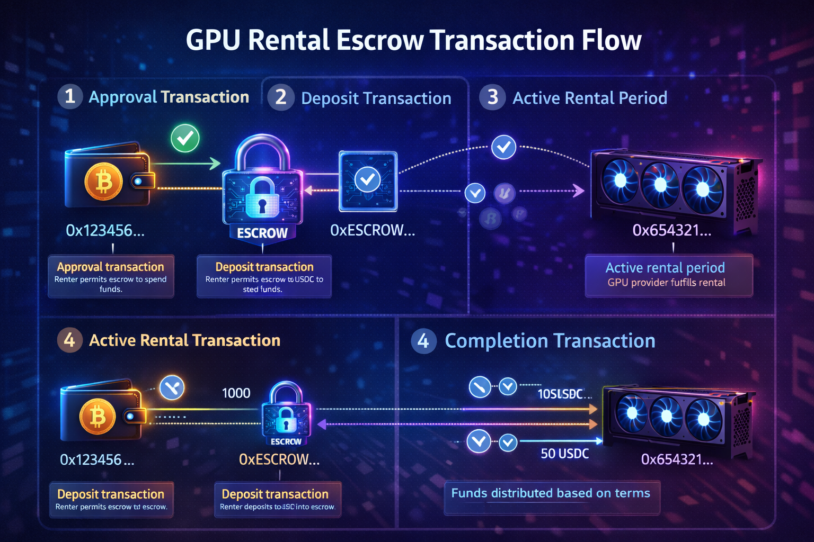
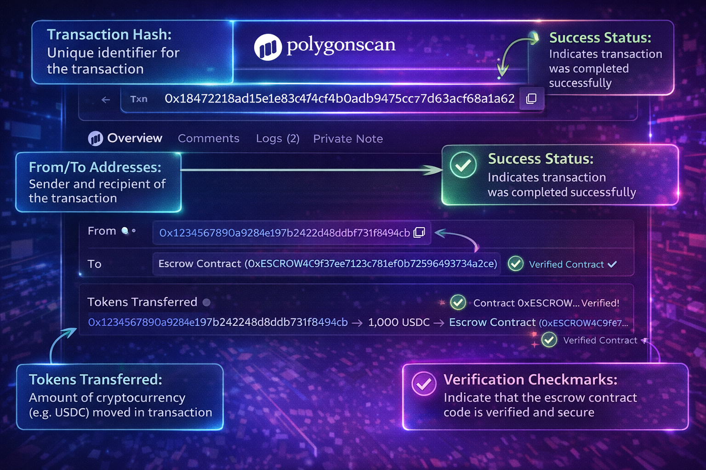
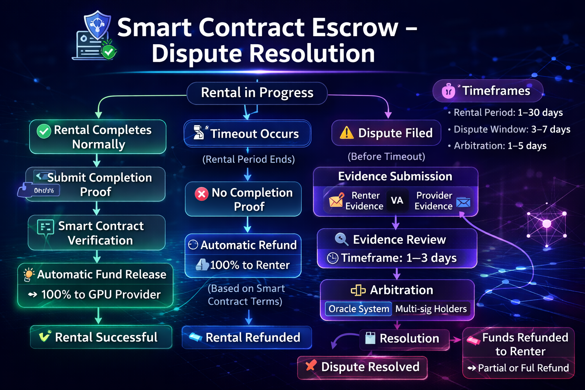
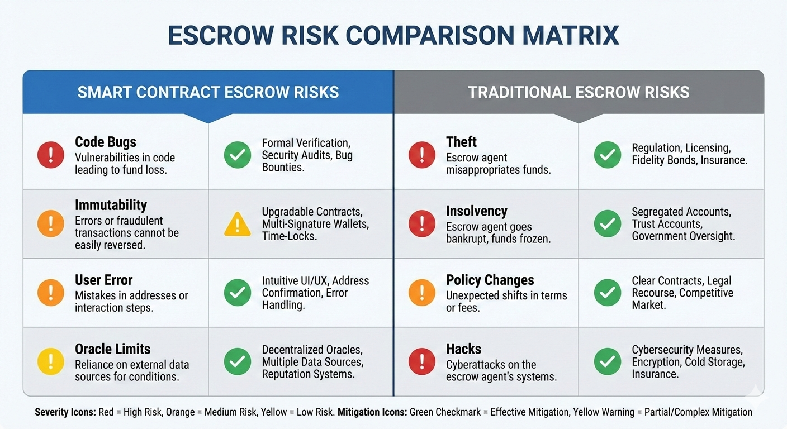
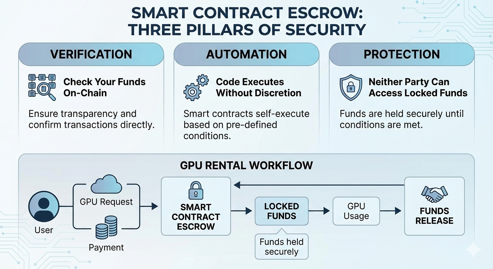

当您在传统GPU租赁平台上存入50美元时，这笔钱会进入平台的银行账户。您在仪表板上看到一个数字。您相信这个数字代表您以后可以提取的真实美元。如果平台被黑客攻击、破产或决定更改服务条款，您的信任就是您与您的资金之间唯一的屏障。

智能合约托管用可验证的代码取代了这种信任。您的50美元USDC转移到一个区块链地址，该地址由一个程序控制，您、GPU供应商和平台运营商都无法操纵它。当租赁条件满足时，资金会自动释放。您可以自己验证这一点——就在现在，在公共区块浏览器上——无需征得任何人的许可，也无需相信任何人的话。

本文将逐步详细解释智能合约托管如何用于GPU租赁，包括如何在链上验证您的资金以及出现问题时会发生什么。

有关完整的GPU租赁流程（包括平台选择和支付设置），请参阅我们的[使用加密货币租赁GPU的完整指南](/zh_cn/rent-gpu-with-crypto/)。

---

## 平台托管与智能合约托管：实际有何不同

理解这些托管模式之间的差异可以阐明为什么智能合约能提供更强的保证。

### 传统的平台托管

当您在Vast.ai、RunPod或大多数传统平台上存入资金时：

**您的资金会发生什么：**

1. 您发送付款（信用卡、加密货币、银行转账）
2. 平台在其银行账户或加密钱包中收到资金
3. 平台的数据库记录您的余额
4. 您在网站上看到显示的余额
5. 当您租赁时，平台在内部扣减您的余额
6. 当您提现时，平台从其账户发送资金

**信任要求：**

| 风险     | 您相信平台会...        |
| -------- | ---------------------- |
| 盗窃     | 不窃取您的资金         |
| 安全     | 不被黑客攻击           |
| 偿付能力 | 不会破产               |
| 诚实     | 准确跟踪您的余额       |
| 可用性   | 按需处理提现           |
| 政策     | 不会对您不利地更改条款 |

**您可以验证的内容：**

- 您的仪表板显示一个余额数字
- 仅此而已

您无法独立验证：

- 是否有真实资金支持该数字
- 资金存放在哪里
- 平台是否有偿付能力
- 其他用户的余额是否得到保障

**历史教训：**

- FTX（2022年）：客户资金被挪用，损失数十亿美元
- Mt. Gox（2014年）：交易所被黑，损失85万枚BTC
- 众多小型平台：卷款跑路、黑客攻击、资不抵债

平台托管在整个加密货币行业中反复出现灾难性失败。

### 智能合约托管

当您在GPUFlow或类似的智能合约平台上存入资金时：

**您的资金会发生什么：**

1. 您批准（Approve）托管合约访问您的USDC
2. 您确认存款交易
3. USDC从您的钱包转移到合约地址
4. 合约在链上记录租赁条款
5. 资金被锁定——任何一方都无法单方面访问
6. 租赁完成后，合约向供应商释放付款
7. 未使用的资金自动返回您的钱包

**信任要求：**

| 风险         | 您信任的是...                              |
| ------------ | ------------------------------------------ |
| 代码正确性   | 合约按其声明的方式运行（审计解决这一问题） |
| 区块链安全   | Polygon/以太坊网络正常运行                 |
| 您自身的安全 | 您不批准恶意交易                           |

**您可以验证的内容：**

- 在区块浏览器上查看您的存款交易
- 托管合约中锁定的确切金额
- 合约源代码（如果已验证）
- 通过合约进行的所有历史交易
- 租赁完成时向供应商释放的付款
- 未使用资金返回您的钱包

**您无需信任的内容：**

- 平台运营商的诚实
- 平台的安全实践
- 平台的偿付能力
- 平台的政策决定

### 根本区别

**平台托管：** "相信我们会妥善保管您的资金。"

**智能合约托管：** "验证控制您资金的代码。"

这不是哲学上的区分。这是一个具有实际安全影响的实用区分。

**场景：平台运营商变得恶意**

平台托管：

- 运营商可以卷走所有客户资金
- 用户除了法律诉讼外别无他法
- 追回可能性很小，尤其是小额资金

智能合约托管：

- 运营商无法访问托管资金（代码阻止了这一点）
- 资金保持锁定状态，直到满足释放条件
- 运营商的恶意行为无关紧要——代码会照常执行

**场景：平台被黑客攻击**

平台托管：

- 攻击者掏空热钱包和客户数据库
- 所有资金处于风险之中
- 用户损失一切

智能合约托管：

- 攻击者可能会入侵平台网站
- 但托管资金仍保留在合约中
- 只有单个用户的批准可能被利用（需要用户操作）
- 正确托管的资金保持安全


---

## GPU租赁托管交易的解剖

让我们准确追踪使用智能合约托管进行GPU租赁时链上发生的事情。理解这个流程可以揭开整个过程的神秘面纱。

### 阶段1：批准（Approval）

在托管合约能够转移您的USDC之前，您必须批准它。

**您看到的界面：**

MetaMask弹窗：

```
权限请求
允许GPUFlow Escrow使用您的USDC？

请求方：gpuflow.app
合约：0x7a3B...4f2D

[拒绝] [批准]
```

**链上发生的事情：**

1. 您点击"批准"
2. 交易发送到Polygon上的USDC合约
3. USDC合约记录："钱包0xYour...允许合约0x7a3B...转移USDC"
4. 此时USDC尚未移动——这只是授权

**在Polygonscan上您会看到：**

```
Transaction: 0xabc123...
From: 0xYourWallet
To: 0x3c499c54... (USDC Contract)
Method: approve(spender, amount)
```

**为什么存在这一步：**

ERC-20代币（如USDC）在任何合约能够移动它们之前需要明确的批准。这是一项安全功能——未经您的许可，合约无法清空您的钱包。

**安全提示：** 只批准您信任的合约。对恶意合约的无限批准可能会耗尽您的代币。GPUFlow的合约已经过审计，但请始终验证您是否在合法网站上。

### 阶段2：存入托管

批准后，您存入资金以开始租赁。

**您看到的界面：**

MetaMask弹窗：

```
确认交易

向GPU租赁托管存入50 USDC
租赁：RTX 4090，供应商0xProv...
时长：最多10小时

Gas费：0.02 MATIC（约$0.02）

[拒绝] [确认]
```

**链上发生的事情：**

1. 您点击"确认"
2. 交易发送到GPUFlow托管合约
3. 合约调用USDC合约，将50 USDC从您的钱包转移到托管地址
4. 合约记录租赁详情：
   - 租户：0xYourWallet
   - 供应商：0xProviderWallet
   - 金额：50 USDC
   - 开始时间：区块时间戳
   - 租赁条款：GPU规格、小时费率、最长时长
5. 资金现在被锁定在合约中

**在Polygonscan上您会看到：**

```
Transaction: 0xdef456...
From: 0xYourWallet
To: 0x7a3B...4f2D (GPUFlow Escrow)
Method: createRental(provider, amount, terms)
Value: 0 MATIC
Tokens Transferred: 50 USDC from 0xYour... to 0x7a3B...
```

**关键点：** 50 USDC现在位于托管合约地址。不在GPUFlow的钱包中。不在供应商的钱包中。在合约本身中。

### 阶段3：活跃租赁

您的资金已被锁定。GPU租赁正在进行中。

**正在发生的事情：**

- 您拥有GPU的SSH/终端访问权限
- 计时器正在计算租赁时长
- 合约持有资金，等待完成信号

**租赁期间没有链上活动**（除非您按区块付费，大多数合约出于Gas效率考虑不实现这一点）。

**托管合约正在做什么：**

- 没有主动执行——它是等待下一笔交易的代码
- 资金保持锁定在合约地址
- 任何一方都无法访问它们

### 阶段4：租赁完成

租赁通过您的操作（停止租赁）或时间到期而结束。

**您看到的界面：**

在GPUFlow仪表板上："结束租赁"按钮

MetaMask弹窗：

```
确认交易

结束GPU租赁
时长：3小时27分钟
费用：$2.08（3.45小时 × $0.60/小时）
退款：$47.92 USDC

Gas费：0.02 MATIC（约$0.02）

[拒绝] [确认]
```

**链上发生的事情：**

1. 您点击"确认"
2. 交易发送到托管合约
3. 合约计算：
   - 实际租赁时长
   - 基于小时费率的费用
   - 应付给供应商的金额
   - 应退还给租户的金额
4. 合约执行两笔转账：
   - $2.08 USDC → 供应商钱包
   - $47.92 USDC → 您的钱包
5. 租赁在合约状态中标记为已完成

**在Polygonscan上您会看到：**

```
Transaction: 0xghi789...
From: 0xYourWallet
To: 0x7a3B...4f2D (GPUFlow Escrow)
Method: completeRental(rentalId)
Tokens Transferred:
  - 2.08 USDC from 0x7a3B... to 0xProvider...
  - 47.92 USDC from 0x7a3B... to 0xYour...
```

**两笔转账原子性执行：** 要么都成功，要么都失败。合约无法在不同时退还您资金的情况下向供应商付款，反之亦然。

### 完整流程

```
[您的钱包]
     |
     | 1. 批准USDC支出
     v
[USDC合约] 记录批准
     |
     | 2. 向托管存入50 USDC
     v
[托管合约] 持有50 USDC，记录租赁
     |
     | 3. 租赁活跃（无链上活动）
     |
     | 4. 完成租赁
     v
[托管合约] 计算并释放
     |
     +---> 2.08 USDC 至 [供应商钱包]
     |
     +---> 47.92 USDC 至 [您的钱包]
```

每一步都记录在链上。每一笔USDC的移动都是可验证的。没有需要信任的数据库条目——只有您可以自行验证的区块链状态。



## 如何在Polygonscan上验证您的托管资金

智能合约托管的力量来自于可验证性。您不必相信任何人的话——您可以自己检查区块链。本节将向您展示具体操作方法。

### 您需要什么

- 您的钱包地址（来自MetaMask）
- 托管合约地址（来自平台文档）
- 区块浏览器（Polygon网络的Polygonscan）

**GPUFlow托管合约地址：** `0x7a3B...4f2D`（示例——请查看官方文档获取实际地址）

### 第1步：找到您的存款交易

**方法A：从您的钱包**

1. 打开MetaMask
2. 点击"活动"（Activity）标签
3. 找到您的存款交易
4. 点击交易以查看详情
5. 点击"在区块浏览器上查看"（View on block explorer）
6. Polygonscan将打开并显示您的交易

**方法B：直接从Polygonscan**

1. 访问polygonscan.com
2. 在搜索栏粘贴您的钱包地址
3. 查看"交易"（Transactions）标签
4. 找到标记有托管合约地址的交易
5. 点击交易哈希（Transaction Hash）以查看详情

### 第2步：读取交易详情

Polygonscan上的存款交易显示：

```
Transaction Hash: 0xdef456...
Status: Success ✓
Block: 52847291
Timestamp: Feb 18, 2026 14:32:05 UTC

From: 0xYourWallet...
To: 0x7a3B...4f2D (GPUFlow: Escrow Contract)
Value: 0 MATIC

Transaction Action:
  Deposit 50 USDC for GPU Rental

Tokens Transferred:
  From: 0xYourWallet...
  To: 0x7a3B...4f2D
  For: 50 USDC
```

**这确认了什么：**

- ✅ 交易成功（Status: Success）
- ✅ USDC离开了您的钱包（From: 您的地址）
- ✅ USDC进入了托管合约（To: 合约地址）
- ✅ 转移了正确的金额（50 USDC）
- ✅ 时间戳被永久记录

### 第3步：验证资金在托管合约中

现在确认托管合约实际上持有您的资金。

1. 在Polygonscan上，转到托管合约地址（0x7a3B...4f2D）
2. 点击"合约"（Contract）标签
3. 点击"读取合约"（Read Contract）
4. 找到类似`getRentalDetails`或`escrowBalance`的函数
5. 输入您的租赁ID或钱包地址
6. 点击"查询"（Query）
7. 查看返回的数据，其中显示您的托管金额

**替代方法：检查合约的代币余额**

1. 在合约页面上，点击"代币持有"（Token Holdings）或类似选项
2. 查看合约持有的总USDC
3. 这显示的是总托管金额，而不是您的特定租赁
4. 您的租赁是该总额的一部分

### 第4步：验证合约代码

为了完全验证，请检查实际的合约代码。

1. 在合约页面上，点击"合约"（Contract）标签
2. 点击"代码"（Code）子标签
3. 如果已验证，您将看到Solidity源代码
4. 寻找托管逻辑：

```solidity
// 托管释放逻辑的简化示例
function completeRental(uint256 rentalId) external {
    Rental storage rental = rentals[rentalId];
    require(msg.sender == rental.renter, "Only renter can complete");

    uint256 duration = block.timestamp - rental.startTime;
    uint256 cost = (duration * rental.hourlyRate) / 3600;
    uint256 refund = rental.depositAmount - cost;

    // 向供应商转移费用
    USDC.transfer(rental.provider, cost);

    // 将剩余部分退还给租户
    USDC.transfer(rental.renter, refund);

    rental.completed = true;
}
```

**此代码显示的内容：**

- 只有租户可以触发完成
- 持续时间是根据区块链时间戳计算的
- 费用是数学计算出来的（没有人为裁量权）
- 两笔转账在同一笔交易中发生（原子性）
- 平台运营商不可能干预

### 第5步：监控完成交易

当您的租赁结束时，验证资金是否正确释放。

1. 在您的钱包活动或Polygonscan中找到完成交易
2. 查看交易详情：

```
Transaction Hash: 0xghi789...
Status: Success ✓

From: 0xYourWallet...
To: 0x7a3B...4f2D (GPUFlow: Escrow Contract)

Transaction Action:
  Complete GPU Rental #12345

Tokens Transferred:
  Transfer 1: 2.08 USDC from 0x7a3B... to 0xProvider...
  Transfer 2: 47.92 USDC from 0x7a3B... to 0xYourWallet...
```

**这确认了什么：**

- ✅ 供应商收到了正确的付款（2.08 USDC）
- ✅ 您收到了正确的退款（47.92 USDC）
- ✅ 所有资金都有账可查（2.08 + 47.92 = 50.00）
- ✅ 没有资金滞留在合约中

### 验证清单

在任何托管交易后，请验证：

- [ ] 交易状态显示"成功"（Success）
- [ ] 正确的金额离开了您的钱包（存款）
- [ ] 资金进入了托管合约地址（而不是随机钱包）
- [ ] 合约地址与官方文档匹配
- [ ] 完成后，退款到达了您的钱包
- [ ] 供应商付款 + 您的退款 = 原始存款

### 验证证明了什么

当您在Polygonscan上验证时，您不需要信任：

| 传统平台       | 智能合约 + 验证      |
| -------------- | -------------------- |
| 平台的数据库   | 区块链状态（不可变） |
| 平台的诚实     | 数学计算             |
| 平台的偿付能力 | 合约的实际代币余额   |
| 仪表板显示     | 区块浏览器（独立）   |

**区块链不会撒谎。** 它也无法撒谎——交易经过加密签名并由数千个节点验证。您在Polygonscan上看到的就是实际发生的事情。



---

## 当出现问题时会发生什么：代码中的争议解决

智能合约托管自动处理顺利的流程。但是，当GPU服务失败、规格不符或任何一方行为不当时会发生什么？

### 自动故障检测

某些故障可以在链上或通过预言机集成进行检测：

**基于超时的保护：**

```solidity
// 如果租赁未在宽限期内开始，租户可以取消
function cancelUnstartedRental(uint256 rentalId) external {
    Rental storage rental = rentals[rentalId];
    require(msg.sender == rental.renter, "Only renter");
    require(!rental.started, "Rental already started");
    require(block.timestamp > rental.createdAt + GRACE_PERIOD, "Grace period active");

    // 全额退款给租户
    USDC.transfer(rental.renter, rental.depositAmount);
    rental.cancelled = true;
}
```

**这处理的情况：**

- 供应商接受租赁但从未提供访问权限
- 租户存款但供应商消失
- 宽限期（例如30分钟）后的自动全额退款

**最长持续时间保护：**

```solidity
// 租赁在达到最长持续时间时自动结束
function forceComplete(uint256 rentalId) external {
    Rental storage rental = rentals[rentalId];
    require(block.timestamp > rental.startTime + rental.maxDuration, "Not expired");

    // 基于最长持续时间计算
    uint256 cost = rental.maxDuration * rental.hourlyRate / 3600;
    uint256 refund = rental.depositAmount - cost;

    USDC.transfer(rental.provider, cost);
    USDC.transfer(rental.renter, refund);
    rental.completed = true;
}
```

**这处理的情况：**

- 租户在未结束租赁的情况下消失
- 供应商不必无限期等待付款
- 任何一方都不能在超过最长持续时间后扣留资金

### 争议机制

对于需要人为判断的问题（主观质量争议），合约实施各种机制：

**带争议窗口的时间锁定释放：**

```solidity
function initiateCompletion(uint256 rentalId) external {
    Rental storage rental = rentals[rentalId];
    require(msg.sender == rental.renter, "Only renter");

    rental.completionInitiated = true;
    rental.disputeDeadline = block.timestamp + DISPUTE_WINDOW; // 例如24小时
}

function dispute(uint256 rentalId, string memory reason) external {
    Rental storage rental = rentals[rentalId];
    require(msg.sender == rental.renter || msg.sender == rental.provider, "Not party");
    require(rental.completionInitiated, "Completion not initiated");
    require(block.timestamp < rental.disputeDeadline, "Dispute window closed");

    rental.disputed = true;
    rental.disputeReason = reason;
    // 资金保持锁定等待解决
}

function finalizeCompletion(uint256 rentalId) external {
    Rental storage rental = rentals[rentalId];
    require(rental.completionInitiated, "Not initiated");
    require(block.timestamp > rental.disputeDeadline, "Window still open");
    require(!rental.disputed, "Disputed - requires resolution");

    // 按最初计算释放资金
    _releaseFunds(rentalId);
}
```

**这如何运作：**

1. 租户启动完成程序
2. 24小时窗口开启，供任何一方提出争议
3. 如果没有争议，窗口关闭后资金释放
4. 如果有争议，资金保持锁定以待解决

**仲裁集成：**

一些合约与仲裁协议集成：

```solidity
function resolveDispute(uint256 rentalId, uint256 renterPercent, uint256 providerPercent) external {
    require(msg.sender == ARBITRATOR, "Only arbitrator");
    require(renterPercent + providerPercent == 100, "Must total 100%");

    Rental storage rental = rentals[rentalId];
    require(rental.disputed, "Not disputed");

    uint256 renterAmount = rental.depositAmount * renterPercent / 100;
    uint256 providerAmount = rental.depositAmount * providerPercent / 100;

    USDC.transfer(rental.renter, renterAmount);
    USDC.transfer(rental.provider, providerAmount);
    rental.resolved = true;
}
```

**仲裁选项：**

| 方法                  | 工作原理                 | 去中心化程度 |
| --------------------- | ------------------------ | ------------ |
| 平台仲裁              | GPUFlow团队决定          | 中心化       |
| DAO投票               | 代币持有者对争议进行投票 | 去中心化     |
| Kleros/Aragon法庭     | 去中心化陪审员网络       | 完全去中心化 |
| 多重签名（Multi-sig） | 双方 + 调解员批准        | 半去中心化   |

### GPUFlow的争议处理方法

GPUFlow实施混合模式：

**对于客观故障：**

- 自动超时退款（供应商未出现）
- 在最长持续时间自动完成
- 合约强制执行费率计算

**对于主观争议：**

- 租赁完成后的争议窗口
- 通过IPFS提交证据（截图、日志）
- GPUFlow团队对小额争议进行仲裁
- 大额争议可选择第三方仲裁

**争议统计（假设示例）：**

| 结果               | 百分比 |
| ------------------ | ------ |
| 无争议             | 97.8%  |
| 自动解决           | 1.5%   |
| 仲裁（租户胜诉）   | 0.4%   |
| 仲裁（供应商胜诉） | 0.2%   |
| 分割决定           | 0.1%   |

大多数租赁无需争议即可完成。当发生争议时，自动机制无需人工干预即可解决大多数情况。

### 哪些争议无法通过代码解决

**本质上主观的问题：**

- "GPU很慢"（有多慢？与什么相比？）
- "模型质量比预期的差"（不是GPU问题）
- "供应商在聊天中很粗鲁"（无链上证据）

**合约知识范围外的问题：**

- 链下服务质量
- 现实世界的身份问题
- 跨司法管辖区的法律纠纷

**合约限制：**

- 无法强迫供应商提供服务
- 无法验证GPU是否实际上符合规格（需要预言机/证明）
- 无法撤销已完成的交易

对于这些情况，存在仲裁机制，但它们重新引入了一些信任要素（信任仲裁员）。这是一种固有的限制——并非所有争议都可以仅通过代码解决。



## 已知限制：智能合约托管的不足之处

智能合约托管提供了比平台托管更强的保证，但它并不完美。了解限制有助于您准确评估风险。

### 限制1：智能合约漏洞（Bugs）

**风险：**

智能合约是代码。代码可能有漏洞。托管逻辑中的漏洞可能导致：

- 资金被永久锁定（无法释放）
- 允许未经授权的提取
- 错误计算付款
- 在边缘情况（edge cases）下失败

**历史案例：**

| 事件       | 年份   | 影响            | 原因                      |
| ---------- | ------ | --------------- | ------------------------- |
| The DAO    | 2016年 | 6000万美元被盗  | 重入漏洞（Reentrancy）    |
| Parity钱包 | 2017年 | 1.5亿美元被冻结 | 自毁漏洞（Self-destruct） |
| Wormhole   | 2022年 | 3.2亿美元被盗   | 签名验证缺陷              |

**缓解措施：**

- **审计：** 独立安全公司在部署前审查代码
- **漏洞赏金（Bug Bounties）：** 奖励发现漏洞的人员
- **经过时间考验的代码：** 长期部署且无问题的代码增加了信心
- **形式化验证：** 代码正确性的数学证明（罕见且昂贵）
- **可升级合约：** 修复漏洞的能力（引入了中心化权衡）

**需要检查的内容：**

在存入大量资金之前：

- 合约是否经过审计？由谁审计？
- 该代码已部署多长时间？
- 是否有漏洞赏金计划？
- 合约是否成功处理过大量资金？

### 限制2：代码不可变性（Immutability）

**双刃剑：**

不可变代码意味着：

- ✅ 部署后没人能更改规则
- ❌ 漏洞无法轻易修补
- ❌ 改进需要迁移到新合约

**示例场景：**

发现一个小漏洞，在某些边缘情况下向租户多收0.1%的费用。在传统软件中，您会部署一个热修复程序。在不可变智能合约中：

- 旧合约继续带着漏洞运行
- 必须部署新合约
- 用户必须迁移到新合约
- 旧的托管资金需要迁移路径

**可升级合约：**

一些平台使用可升级代理模式，允许更改代码。这引入了一个权衡：

| 方法   | 好处           | 风险                     |
| ------ | -------------- | ------------------------ |
| 不可变 | 不会被恶意更改 | 无法修复漏洞             |
| 可升级 | 可以修复漏洞   | 所有者可能会恶意更改规则 |

GPUFlow使用[指定方法——带有迁移路径的不可变 / 带有时间锁的可升级 / 等]。了解您平台的方法及其影响。

### 限制3：用户错误是永久性的

**没有撤销按钮：**

区块链交易是不可逆的。用户错误无法恢复：

| 错误           | 结果           | 恢复                 |
| -------------- | -------------- | -------------------- |
| 批准恶意合约   | 代币被耗尽     | 无                   |
| 发送到错误地址 | 资金丢失       | 无（除非接收者退还） |
| 错误网络       | 资金在意外链上 | 通过努力可能恢复     |
| 错误金额       | 多付/少付      | 可能需要争议解决     |

**传统平台：**

- 可以撤销欺诈性交易
- 可以从用户错误中恢复
- 可以重置密码并恢复访问权限

**智能合约：**

- 交易一旦确认即为最终结果
- 没有客户服务可以撤销它们
- 自我托管意味着自我负责

**缓解措施：**

- 发送前三次检查地址
- 从小额测试交易开始
- 验证您是否在正确的网络上
- 了解您正在批准什么
- 绝不在任何地方输入助记词

### 限制4：预言机依赖

**预言机问题：**

智能合约只能访问链上数据。现实世界信息（GPU实际工作，规格实际匹配）需要"预言机"——外部数据提供者。

**合约可以原生验证的内容：**

- 经过的时间（区块时间戳）
- 代币转移
- 链上状态变化

**合约无法验证的内容：**

- GPU实际已开机
- 规格与列表匹配
- 性能符合预期
- 用户实际已连接并工作

**当前方法：**

| 方法       | 工作原理                     | 信任要求         |
| ---------- | ---------------------------- | ---------------- |
| 基于超时   | 假设如果没有争议即为工作正常 | 极小             |
| 声誉系统   | 过去的行为预测未来           | 中等             |
| 硬件证明   | GPU以加密方式证明规格        | 低（如果已实施） |
| 供应商质押 | 如果作弊，供应商将失去质押金 | 经济激励         |

**实际影响：**

GPU供应商理论上可以接受租赁，提供比列出的更差的GPU，如果租户不提出争议，就可以收取款项。合约无法独立验证硬件规格。

**缓解措施：**

- 检查供应商声誉/历史
- 连接后立即验证GPU规格（nvidia-smi）
- 如果规格不符，立即提出争议
- 优先选择有质押抵押品的供应商

### 限制5：监管不确定性

**法律层面：**

智能合约在传统法律框架之外运作。问题依然存在：

- 智能合约托管具有法律约束力吗？
- 哪个司法管辖区管辖争议？
- 法院可以强制执行合约行动吗？
- 税收如何处理？

**实际影响：**

- 小额争议：合约内的仲裁是实用的
- 大额争议：法律追索权不确定
- 跨境：管辖权不明确
- 监管变化：可能会影响平台运营

**当前状态：**

对于典型的GPU租赁金额（10-500美元），智能合约托管是实用的，法律模糊性很少重要。对于非常大的金额或企业用途，法律不确定性可能会令人担忧。

### 风险评估摘要

| 风险       | 严重性 | 可能性           | 缓解措施               |
| ---------- | ------ | ---------------- | ---------------------- |
| 合约漏洞   | 高     | 低（如果已审计） | 检查审计，使用成熟合约 |
| 用户错误   | 中-高  | 中               | 小心，小额测试，验证   |
| 供应商欺诈 | 中     | 低               | 声誉，快速验证，争议   |
| 监管       | 低-中  | 不确定           | 监控，使用合规平台     |
| 预言机故障 | 低     | 低               | 超时保护，声誉         |

**总体评估：**

对于大多数个人GPU租赁用户来说，智能合约托管提供了比信任平台运营商强大得多的保护。风险是真实存在的，但通过合理的预防措施是可以管理的。替代方案（平台持有资金）在历史上已被证明更危险。



---

## 结论：代码作为保证

智能合约托管从根本上改变了GPU租赁的信任模式。与其问"我信任这个平台吗？"，不如问"这段代码是否如其所言？"。第二个问题有一个可验证的答案。

### 关键要点

**信任从人转移到代码。** 传统托管要求您将资金托付给平台运营商。智能合约托管要求您信任经过审计的代码，该代码每次都以相同方式执行。平台运营商即使想要也无法访问托管资金——代码阻止了这一点。

**验证取代信仰。** 每笔交易都记录在公共区块链上。您可以确认您的存款到达了托管合约，验证资金在租赁期间保持锁定，并观察完成时的付款分配。无需信任仪表板余额——只需验证区块链状态。

**自动执行消除自由裁量权。** 付款计算根据时间戳和费率以数学方式进行。释放条件在满足时执行。没有人决定是否向供应商付款或向您退款——代码评估条件并采取相应行动。

**存在限制但与传统风险不同。** 智能合约可能有漏洞，用户错误是不可逆的，某些争议需要人为判断。这些风险是真实存在的，但从根本上不同于——通常也小于——信任平台运营商保管资金的风险。

### 何时智能合约托管有意义

**非常适合：**

- 个人开发者和小型团队
- 熟悉加密货币基础知识的用户
- 重视验证而非信任的人
- 任何曾因平台托管失败而受损的人
- 避免KYC平台的注重隐私的用户

**如果属于以下情况，请考虑传统平台：**

- 您需要特定司法管辖区的法律合同
- 企业合规要求特定的托管安排
- 您需要电话支持来解决付款问题
- 加密货币基础知识超出您的舒适区

### 实际应用

对于您的下一次GPU租赁：

1. **验证合约：** 检查托管合约地址是否与官方文档匹配
2. **确认审计状态：** 在存入大量资金之前查看已发布的审计报告
3. **从小额开始：** 以最小存款进行测试，以验证流程是否按预期工作
4. **链上监控：** 在整个租赁期间在Polygonscan上观察您的交易
5. **验证完成：** 在完成交易中确认供应商付款和您的退款

花几分钟进行验证比平台运营商的任何承诺都提供更强的保证。

### 更大的图景

智能合约托管代表了数字服务运作方式的更广泛转变。传统模式——把钱给我们，相信我们是诚实的——在加密货币行业内外屡屡失败。FTX、Mt. Gox和无数小型平台证明，基于信任的托管会造成灾难性的失败模式。

基于代码的托管并不能消除所有风险。但它将风险从"这个平台会偷我的钱吗？"转变为"这个经过审计的代码是否正常工作？"。第二个问题有更好的答案：审计、形式化验证、漏洞赏金以及多年无事故的生产运行。

具体到GPU租赁，智能合约托管使像GPUFlow这样的平台能够提供：

- 无KYC要求（无托管意味着更少的监管）
- 更低的费用（无欺诈准备金、退款或合规开销）
- 即时结算（无需等待平台处理）
- 全球可访问性（代码不在乎地理位置）
- 真正的自我托管（您的密钥，您的资金）

技术已经准备就绪。问题在于您是更喜欢可验证的代码还是受信任的中介。

### 相关资源

**来自本站：**

- [使用加密货币租赁GPU的完整指南](/zh_cn/rent-gpu-with-crypto/) — 包括平台选择在内的完整租赁流程
- [如何在没有KYC或身份验证的情况下租赁GPU](/zh_cn/how-to-rent-gpu-without-kyc/) — 智能合约托管支持的注重隐私的租赁选项
- [设置MetaMask和Polygon用于GPU租赁](/zh_cn/setting-up-metamask-polygon-gpu-rental/) — 与托管合约交互的钱包设置
- [为什么稳定币是支付GPU租赁费用的最明智方式](/zh_cn/stable-coins-are-the-smartest-way-to-pay-for-gpu-rental/) — 托管存款的最佳支付代币

**外部资源：**

- [Polygonscan](https://polygonscan.com) — 验证交易和合约状态
- [OpenZeppelin](https://www.openzeppelin.com) — 智能合约安全标准
- [以太坊智能合约最佳实践](https://consensys.github.io/smart-contract-best-practices/) — 合约评估的安全指南



---

**准备好体验可验证的托管了吗？** [GPUFlow](https://gpuflow.app)在Polygon网络上使用智能合约托管，以经过审计的代码保护您的GPU租赁付款。在链上验证您的资金，消除托管风险，并充满信心地租赁GPU。
