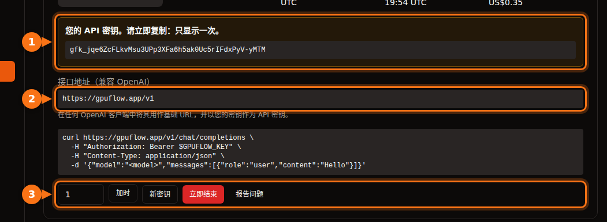

很多 AI 工具都支持把 OpenAI 换成其他服务商，只要对方使用相同的 API。无论换成谁，你需要的始终是这三样东西：

| 内容 | 示例 |
| --- | --- |
| **Base URL**（也叫 API base、endpoint 或 host） | `https://gpuflow.app/v1` |
| **API 密钥** | `gfk_...` |
| **模型名称** | `qwen2.5:7b` |

本文以在 GPUFlow 上租用的 GPU 为例，但对任何 OpenAI 兼容服务器，步骤都是一样的：本地的 Ollama 或 llama.cpp、vLLM、OpenRouter 等等。只需替换这三个值。

在 GPUFlow 上租用 GPU 后，这三项都可以在**仪表板 → 当前租用**中找到：



## 开始之前：检查接口和模型名称

一条命令就能确认密钥是否可用，以及模型叫什么：

```bash
curl https://gpuflow.app/v1/models \
  -H "Authorization: Bearer gfk_your_key"
```

返回结果会列出所有模型。把 `id`（例如 `qwen2.5:7b`）原样复制下来。模型名称写错，是应用无法正常工作最常见的原因。

**弄清楚你的接口支持哪些功能**。GPUFlow 的接口提供 `/v1/models` 和 `/v1/chat/completions`，支持流式输出。不提供嵌入、较新的 Responses API 和图像生成。有些应用功能依赖这些接口，下文会逐一指出。

## 聊天应用

### Open WebUI

1. 打开 **Settings → Admin → Connections**。
2. 在 **Manage OpenAI API Connections** 下，点击 **+ (Add Connection)**。
3. 填写：
   - **URL**：`https://gpuflow.app/v1`
   - **API Key**：你的密钥
4. 点击 **Verify Connection** 进行测试（只点保存不会测试连接），然后点击 **Save**。

Open WebUI 会自动从 `/models` 读取模型列表。如果你用 Docker 运行，也可以改为设置 `OPENAI_API_BASE_URL` 和 `OPENAI_API_KEY`，但这两个变量只在 Open WebUI 首次启动时读取。之后要修改，请到管理界面里改。

Open WebUI 的文档上传和检索默认使用一个在本地运行的小型嵌入模型，所以这些功能不受影响。不要把嵌入引擎切换成 OpenAI、再把 URL 指向你的对话接口。

### LibreChat

在 `librechat.yaml` 中添加一个自定义接口：

```yaml
endpoints:
  custom:
    - name: "GPUFlow"
      apiKey: "${GPUFLOW_API_KEY}"
      baseURL: "https://gpuflow.app/v1"
      models:
        default: ["qwen2.5:7b"]
        fetch: true
      titleConvo: true
      titleModel: "qwen2.5:7b"
      modelDisplayLabel: "GPUFlow"
```

把密钥以 `GPUFLOW_API_KEY=gfk_...` 的形式写进 `.env`。如果希望每个用户各自填写密钥，就用 `apiKey: "user_provided"`。设置 `fetch: true` 后，LibreChat 会从接口读取模型列表。

LibreChat 的文档检索（RAG API）默认使用 OpenAI 的嵌入服务。请保持使用 OpenAI、Ollama 或 Hugging Face，不要把 `RAG_OPENAI_BASEURL` 指向只支持对话的接口。

### AnythingLLM

1. 打开 LLM 设置，选择 **Generic OpenAI**。
2. 填写 **Base URL**（`https://gpuflow.app/v1`）、**API Key**、**Chat Model Name**（`qwen2.5:7b`）、**Token context window** 和 **Max Tokens**。

用 Docker 运行时，这些设置对应以下环境变量：

```bash
LLM_PROVIDER='generic-openai'
GENERIC_OPEN_AI_BASE_PATH='https://gpuflow.app/v1'
GENERIC_OPEN_AI_MODEL_PREF='qwen2.5:7b'
GENERIC_OPEN_AI_MODEL_TOKEN_LIMIT=32768
GENERIC_OPEN_AI_API_KEY=gfk_your_key
```

嵌入器保持 **AnythingLLM Default** 不变。

### Jan

1. 打开 **Settings → Model Providers**，点击 **Add Provider**。
2. 选择 **OpenAI-compatible**。
3. 输入名称、以 `/v1` 结尾的 **Base URL** 和你的 **API key**，点击 **Create**。

保存后 Jan 会加载模型列表。如果没有加载出来，可以在该服务商的模型列表中点击 **+** 按钮手动添加模型名称。

## 编程助手

### Continue（VS Code 和 JetBrains）

在 `config.yaml` 中添加一个模型：

```yaml
models:
  - name: GPUFlow Qwen 2.5 7B
    provider: openai
    model: qwen2.5:7b
    apiBase: https://gpuflow.app/v1
    apiKey: ${{ secrets.GPUFLOW_API_KEY }}
    roles:
      - chat
      - edit
      - apply
```

不要给它分配 `autocomplete` 和 `embed` 角色：这个端点只提供聊天功能，而嵌入需要 `/v1/embeddings`。在 VS Code 中，Continue 自带用于代码库检索的嵌入器；在 JetBrains 中则没有，需要另外配置一个嵌入模型。

Continue 的 Agent 模式需要支持工具调用的模型。只有在确认你的模型支持时，才添加 `capabilities: [tool_use]`。

### Cline

1. 打开 Cline 的设置。
2. 将 **API Provider** 设为 **OpenAI Compatible**。
3. 填写 **Base URL**、**API Key** 和 **Model**（`qwen2.5:7b`）。
4. 在 **Model Configuration** 下，把上下文窗口设置为与你的模型一致。

关于 **Roo Code**：其文档说明它只支持具备原生工具调用能力的模型，没有降级方案。普通的对话接口可能无法配合它使用。

## 代码

### OpenAI 的 Python 和 Node 库

Python（`pip install openai`）：

```python
from openai import OpenAI

client = OpenAI(base_url="https://gpuflow.app/v1", api_key="gfk_your_key")

reply = client.chat.completions.create(
    model="qwen2.5:7b",
    messages=[{"role": "user", "content": "Say hello in five languages."}],
)
print(reply.choices[0].message.content)
```

Node（`npm install openai`）：

```js
import OpenAI from "openai";

const client = new OpenAI({ baseURL: "https://gpuflow.app/v1", apiKey: "gfk_your_key" });

const reply = await client.chat.completions.create({
  model: "qwen2.5:7b",
  messages: [{ role: "user", content: "Say hello in five languages." }],
});
console.log(reply.choices[0].message.content);
```

这两个库也会从环境变量中读取 `OPENAI_BASE_URL` 和 `OPENAI_API_KEY`。注意，它们的 README 现在开头示例用的是 `client.responses.create(...)`，那是 Responses API；请按上面的写法使用 `client.chat.completions.create(...)`。

### LangChain

Python（`pip install -U langchain-openai`）：

```python
from langchain_openai import ChatOpenAI

llm = ChatOpenAI(
    model="qwen2.5:7b",
    base_url="https://gpuflow.app/v1",
    api_key="gfk_your_key",
    use_responses_api=False,
)
print(llm.invoke("Name three uses for a GPU.").content)
```

JavaScript（`npm install @langchain/openai @langchain/core`）。先在环境变量中设置密钥 `export OPENAI_API_KEY=gfk_your_key`，然后：

```js
import { ChatOpenAI } from "@langchain/openai";

const llm = new ChatOpenAI({
  model: "qwen2.5:7b",
  configuration: { baseURL: "https://gpuflow.app/v1" },
});
```

使用某些功能时（例如内置工具或推理输出），LangChain 会自动切换到 Responses API。设置 `use_responses_api=False` 可以让它保持使用 Chat Completions。

### LlamaIndex

使用 `OpenAILike`（`pip install llama-index-llms-openai-like`）：

```python
from llama_index.llms.openai_like import OpenAILike

llm = OpenAILike(
    model="qwen2.5:7b",
    api_base="https://gpuflow.app/v1",
    api_key="gfk_your_key",
    context_window=32768,
    is_chat_model=True,
    is_function_calling_model=False,
)
```

**务必设置 `is_chat_model=True`**。它的默认值是 `False`，这会把请求发到 `/v1/completions`，而不是 `/v1/chat/completions`。如果要为文档建索引，请把 `Settings.embed_model` 设为一个真正的嵌入模型；LlamaIndex 默认使用 OpenAI 的嵌入服务。

## 无法配合纯对话接口使用的工具

- **Codex CLI**。它在 2026 年初放弃了对 Chat Completions 的支持，现在只接受 Responses API。
- **OpenAI Agents SDK**。它默认使用 Responses API。调用 `set_default_openai_api("chat_completions")`，或者用 `OpenAIChatCompletionsModel` 包装你的客户端，并通过 `set_tracing_disabled(True)` 关闭追踪功能，因为追踪需要 OpenAI 密钥。
- **任何需要从同一接口获取嵌入的功能**：文档检索、“与文件对话”、语义代码搜索。请使用应用内置的嵌入器，或单独配置一个嵌入服务商。

## 如果还是不行

| 现象 | 常见原因 |
| --- | --- |
| `404` 或 “not found” | Base URL 缺少 `/v1`，或者应用会自动添加 `/v1`，而你又加了一次。 |
| `401` 或 `invalid_api_key` | 密钥错误，或者租用已经结束。在 GPUFlow 上，如果密钥丢了，可以在当前租用页面点击**新密钥**。 |
| “Model not found” | 模型名称与 `/v1/models` 返回的不完全一致。 |
| 对 `/v1/completions` 或 `/v1/responses` 的请求失败 | 应用用的是另一种 API。找一下 “chat model” 或 “chat completions” 相关设置。 |

## 相关文章

- [按小时租 GPU 还是按 token 调 API？运行 7B–8B 模型的真实成本](/zh_cn/hourly-gpu-vs-per-token-api/)
- [GPUFlow、Vast.ai、RunPod 和 SaladCloud 对比：哪个适合你的任务](/zh_cn/gpuflow-vs-vast-ai-vs-runpod/)

## 资料来源

均于 2026 年 9 月核实。

- Open WebUI：[OpenAI 兼容服务商](https://docs.openwebui.com/getting-started/quick-start/connect-a-provider/starting-with-openai-compatible/)、[环境变量](https://docs.openwebui.com/reference/env-configuration)
- LibreChat：[自定义接口](https://www.librechat.ai/docs/configuration/librechat_yaml/object_structure/custom_endpoint)、[RAG API](https://www.librechat.ai/docs/configuration/rag_api)
- AnythingLLM：[Generic OpenAI](https://docs.anythingllm.com/setup/llm-configuration/cloud/openai-generic)
- Jan：[自定义接口](https://www.jan.ai/docs/desktop/remote-models/custom-endpoint)
- Continue：[OpenAI 服务商](https://docs.continue.dev/customize/model-providers/top-level/openai)、[配置参考](https://docs.continue.dev/reference)
- Cline：[OpenAI Compatible](https://docs.cline.bot/provider-config/openai-compatible)；Roo Code：[OpenAI Compatible](https://roocodeinc.github.io/Roo-Code/providers/openai-compatible/)
- OpenAI 库：[openai-python](https://github.com/openai/openai-python)、[openai-node](https://github.com/openai/openai-node)
- LangChain：[Python](https://docs.langchain.com/oss/python/integrations/chat/openai)、[JavaScript](https://docs.langchain.com/oss/javascript/integrations/chat/openai)
- LlamaIndex：[OpenAILike](https://developers.llamaindex.ai/python/framework-api-reference/llms/openai_like/)
- OpenAI Agents SDK：[模型](https://openai.github.io/openai-agents-python/models/)
- Codex 与 Chat Completions：[github.com/openai/codex/discussions/7782](https://github.com/openai/codex/discussions/7782)
- GPUFlow API：[使用你的 API 密钥](https://docs.gpuflow.app/zh-cn/renters/api-quickstart/)
