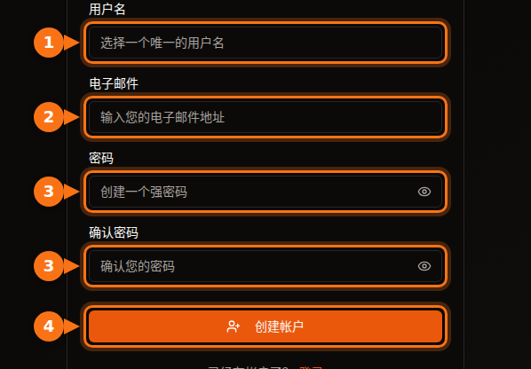
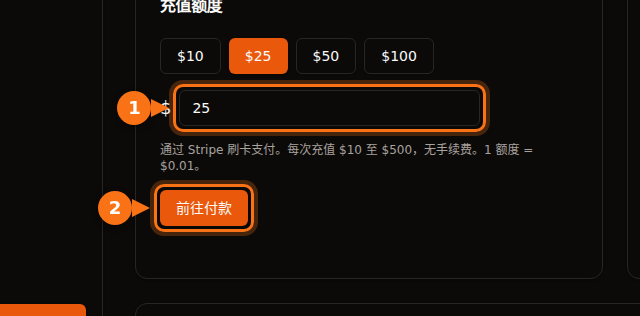

租用第一块 GPU 之前，每个平台都会要你提供一些东西：邮箱地址、银行卡，有时还有手机号；在大型云平台上，还要申请配额，可能要等好几天。本文列出了各平台的具体要求，方便你挑一个今天就能用上的。

所有内容均于 2026 年 9 月在各平台自己的文档上核实，出处附在文末。

## 快速对比

| 平台 | 注册账户 | 租用之前 | 租用者身份验证 | 起步门槛 |
| --- | --- | --- | --- | --- |
| **GPUFlow** | 邮箱和密码，或 Google、GitHub 账号 | 验证邮箱，用银行卡充值额度 | 租用流程中没有 | 充值 $10，无手续费 |
| **Vast.ai** | 邮箱 | 验证邮箱，充值 | 文档中未提及 | 充值 $5 |
| **RunPod** | 邮箱 | 充值 | 仅在首次用加密货币付款前 | 1 小时的额度；预付卡每笔 $100 |
| **SaladCloud** | 门户账户 | 为你的组织添加付款方式 | 文档中未提及 | 充值 $5 起 |
| **Lambda** | 账户 | 添加信用卡 | 文档中未提及 | 银行卡预授权 $10，会退回 |
| **TensorDock** | 账户 | 充值 | 条款允许进行账户审核 | “最低只需 $5” |
| **AWS** | 邮箱、手机 PIN 验证、支付方式、验证码 | 申请 GPU 配额：新账户从 0 开始 | 大多数账户不需要 | 按量付费 |
| **Google Cloud** | 开通结算的账户 | 申请 GPU 配额；免费试用账户没有配额 | 大多数账户不需要 | 按量付费 |

“文档中未提及”指我们在该平台的文档中没有找到对租用者的身份验证要求。遇到异常情况时，平台仍可能要求验证。

## 小平台：几分钟，而不是几天

Vast.ai、RunPod、SaladCloud、TensorDock 和 GPUFlow 都是预付费的。你先充钱，再按秒或按分钟消费。由于不存在先用后付、欠费的情况，这些平台也就不需要审核你的信用或公司资质。

它们的区别在于：

- **邮箱验证**。Vast.ai 和 GPUFlow 都要求先验证邮箱，才能租用或充值。如果收不到邮件，请检查垃圾邮件文件夹。
- **支付方式。**
  - Vast.ai：银行卡、BitPay、Crypto.com。
  - RunPod：Visa、Mastercard、Amex、加密货币，$5,000 以上的付款可以开票。
  - SaladCloud：银行卡，或 Solana 链上的 USDC、USDT 和 RENDER。
  - Lambda：只接受主流信用卡，且仅限支持的国家和地区。
  - GPUFlow：通过 Stripe 使用银行卡。
- **没用完的钱怎么办**。SaladCloud 的额度在购买 12 个月后过期。GPUFlow 的额度永不过期。

## 大型云平台：做好申请配额的准备

AWS 和 Google Cloud 不会在注册时拦住你，而是在 GPU 这一步拦住你。

- **AWS**：新账户“Running On-Demand G and VT instances”（搭载 NVIDIA L4 和 A10G 的实例系列）的配额从 **0 个 vCPU** 起步。你需要在 Service Quotas 控制台申请提额。随着账户用量增加，AWS 也会自动提高配额。
- **Google Cloud**：免费试用账户没有 GPU 配额。项目有了结算记录后，配额申请更容易获批。配额按区域划分，抢占式 GPU 需要单独申请配额。

如果你今天就要用 GPU，别从新注册的 AWS 或 Google Cloud 账户开始。

## 在 GPUFlow 上注册：分步说明

GPUFlow 就是为“五分钟内用上 AI 模型”这种需求设计的。你拿到的是一块 GPU 的 OpenAI 兼容 API 密钥，而不是一台机器。

1. 在 gpuflow.app 用用户名、邮箱地址和密码**创建账户**，也可以用 Google 或 GitHub 登录。

   

2. **验证邮箱**。点击 GPUFlow 发给你的邮件中的链接。验证之前无法充值。
3. 在**仪表板 → 支付**中**充值额度**，通过 Stripe 用银行卡充值 $10 到 $500。1 额度 = $0.01，不收手续费。

   

4. 按需要的小时数**租用 GPU**，复制你的 API 密钥。按秒计费；如果提前结束，剩余部分会退回你的额度。

包含每个页面的完整操作说明见文档：[租用 GPU 分步指南](https://docs.gpuflow.app/zh-cn/renters/getting-started/)。

## 如果你想出租 GPU

收款这一步才会涉及身份验证。支付公司有义务了解收款人是谁。

- **GPUFlow**：要提现，你需要在 Stripe 上设置收款账户，Stripe 会验证你的身份并要求提供银行信息。支持提现的地区为美国、加拿大、英国、瑞士和欧洲经济区。
- **Vast.ai**：主机方通过 Wise、PayPal 或 Stripe 收款，由这些服务负责身份验证。
- **Salad**：奖励通过 PayPal、礼品卡等方式发放。

出租 GPU 能赚多少，详见[游戏显卡出租能赚多少钱](/zh_cn/how-much-can-you-earn-renting-out-your-gpu/)。

## 付款之前：简短检查清单

1. **先验证邮箱**，免得卡在付款这一步。
2. **确认你所在的国家和你的银行卡受支持**。比如 Lambda 只接受特定国家和地区的付款。
3. **了解你银行的境外交易手续费**。大多数平台以美元收费。[更多隐性成本](/zh_cn/hidden-fees-in-gpu-rental/)。
4. **从小额开始**。先充够几个小时的钱，测试一下，再追加。

## 相关文章

- [GPUFlow、Vast.ai、RunPod 和 SaladCloud 对比：哪个适合你的任务](/zh_cn/gpuflow-vs-vast-ai-vs-runpod/)
- [如何在 Open WebUI、Continue、LangChain 等工具中使用 OpenAI 兼容 API 密钥](/zh_cn/use-openai-compatible-api-key-in-apps/)

## 资料来源

均于 2026 年 9 月核实。

- GPUFlow：[租用 GPU 分步指南](https://docs.gpuflow.app/zh-cn/renters/getting-started/)、[额度与计费](https://docs.gpuflow.app/zh-cn/renters/billing/)、[获得收益](https://docs.gpuflow.app/zh-cn/providers/getting-paid/)
- Vast.ai：[快速入门](https://docs.vast.ai/guides/get-started/quickstart.md)、[计费](https://docs.vast.ai/documentation/reference/billing)、[主机方提现](https://docs.vast.ai/host/payment.md)
- RunPod：[计费信息](https://docs.runpod.io/references/billing-information)
- SaladCloud：[账户设置](https://docs.salad.com/general/tutorials/account-setup.md)、[计费](https://docs.salad.com/general/explanation/billing.md)
- Lambda：[管理账单](https://docs.lambda.ai/public-cloud/manage-billing/)
- TensorDock：[云 GPU](https://www.tensordock.com/cloud-gpus.html)、[服务条款](https://docs.tensordock.com/legal-information/terms-of-service-tos)
- AWS：[创建账户](https://docs.aws.amazon.com/accounts/latest/reference/manage-acct-creating.html)、[按需实例配额](https://docs.aws.amazon.com/AWSEC2/latest/UserGuide/ec2-on-demand-instances.html)
- Google Cloud：[GPU 配额问题排查](https://docs.cloud.google.com/deep-learning-vm/docs/troubleshooting)
- Salad 奖励：[PayPal 兑换](https://support.salad.com/rewards/redeeming-your-rewards/how-to-redeem-paypal/)
