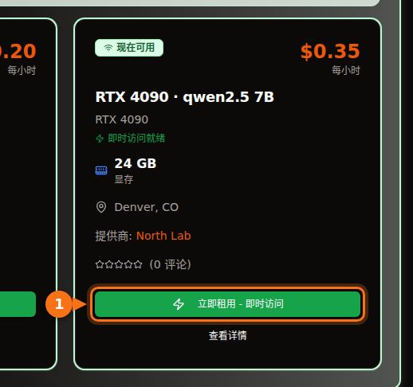

按 Ollama 默认提供的 4-bit 量化，7B 或 8B 模型需要一块 8 GB 的卡，12B 到 14B 模型需要 12 GB（想用长提示词就要 16 GB），27B 到 32B 模型需要 24 GB。4-bit 的 70B 模型有 43 GB，也就是需要 48 GB 以上的显存。

细节之所以重要，是因为下载大小并不是全部开销。你用的上下文也要占显存，一个看起来放得下的模型，最后可能有一半跑在 CPU 上，速度慢好几倍。下面是我用的估算公式、量化标签的含义，以及一张当前开源模型的表格，大小取自 Ollama 模型库的实际下载大小。大小和规格均于 2026 年 9 月核实，出处附在文末。

## 按显存大小的速查表

| 显存 | 常见显卡 | 能完全在 GPU 上运行的模型（4-bit） |
| --- | --- | --- |
| 8 GB | RTX 4060、RTX 5060、RTX 3070 | 7B 到 8B 模型：Llama 3.1 8B、Qwen3 8B、Mistral 7B |
| 12 GB | RTX 3060 12 GB、RTX 4070、RTX 5070 | 短上下文下的 12B 到 14B 模型；Q8_0 的 7B 到 8B 模型 |
| 16 GB | RTX 4060 Ti 16 GB、RTX 4080、RTX 5080 | 长上下文的 14B 模型、gpt-oss 20B |
| 24 GB | RTX 3090、RTX 4090 | 24B 到 32B：Mistral Small 3.2、Gemma 3 27B、Qwen3 32B |
| 32 GB | RTX 5090 | 长上下文的 32B 模型、35B 混合专家模型 |
| 48 到 80 GB | L40S（48 GB）、H100（80 GB） | 4-bit 的 70B 模型；80 GB 可跑 gpt-oss 120B |

显卡的显存大小取自 NVIDIA 的规格页面。有些卡有两个版本：RTX 3060 有 12 GB 和 8 GB 两种，RTX 4060 Ti 和 RTX 5060 Ti 有 16 GB 和 8 GB 两种。买卡或租卡时要确认是哪一个。

## 如何估算模型需要的显存

模型回答你的时候，GPU 显存里放着三样东西：

1. **权重。** 参数量 × 每个权重的位数 ÷ 8 = 字节数。
2. **KV 缓存。** 模型会保存对话中每个 token 的键和值，免得重复计算。每个 token 占 2 × 层数 × KV 头数 × 头维度 × 2 字节（默认 16-bit 缓存），再乘以上下文长度。
3. **开销。** CUDA 上下文、临时缓冲区和运行时本身。我按约 1 GB 估算。这个值因推理引擎和设置而异，只能当经验值，不是规格。

层数和头数可以在 Hugging Face 上每个模型的 `config.json` 里查到。

### 算例：16 GB 显卡上的 Qwen 2.5 14B

Qwen 2.5 14B 有 147 亿参数、48 层、8 个 KV 头，头维度为 128（隐藏层大小 5,120 ÷ 40 个注意力头）。

- **Q4_K_M 下的权重：** llama.cpp 给出的 Q4_K_M 约为每个权重 4.89 bit。147 亿 × 4.89 ÷ 8 = 8.99 GB。Ollama 的 `qwen2.5:14b` 下载大小是 9.0 GB，算出来的结果和实际文件对得上。
- **每个 token 的 KV 缓存：** 2 × 48 × 8 × 128 × 2 字节 = 196,608 字节，约 0.2 MB。
- **整个上下文的 KV 缓存：** 4,096 个 token = 0.8 GB。16,384 个 token = 3.2 GB。32,768 个 token = 6.4 GB。
- **合计：** 4K 上下文为 9.0 + 0.8 + 1 = 10.8 GB。16K 为 9.0 + 3.2 + 1 = 13.2 GB。32K 为 9.0 + 6.4 + 1 = 16.4 GB，16 GB 的卡已经放不下了。

<figure>
<svg viewBox="0 0 720 340" role="img" aria-labelledby="d1-title" xmlns="http://www.w3.org/2000/svg" font-family="system-ui, sans-serif" font-size="15">
<title id="d1-title">16 GB 显卡上运行 Q4_K_M 量化的 Qwen 2.5 14B 时显存的占用：权重、三种上下文长度下的 KV 缓存，以及开销</title>
<rect x="0" y="0" width="720" height="340" fill="#ffffff"/>
<rect x="150" y="20" width="16" height="16" rx="3" fill="#6366f1"/>
<text x="172" y="33" fill="#1e1b4b">权重 9.0 GB</text>
<rect x="330" y="20" width="16" height="16" rx="3" fill="#a5b4fc"/>
<text x="352" y="33" fill="#1e1b4b">KV 缓存</text>
<rect x="510" y="20" width="16" height="16" rx="3" fill="#e2e8f0"/>
<text x="532" y="33" fill="#1e1b4b">开销 约 1 GB</text>
<line x1="582.0" y1="66" x2="582.0" y2="278" stroke="#f97316" stroke-width="2" stroke-dasharray="5 4"/>
<text x="576.0" y="60" text-anchor="end" fill="#f97316" font-weight="600">16 GB 显卡</text>
<text x="140" y="106" text-anchor="end" fill="#1e1b4b">4K 上下文</text>
<rect x="150" y="80" width="243.0" height="40" fill="#6366f1"/>
<text x="271.5" y="106" text-anchor="middle" fill="#ffffff">权重</text>
<rect x="393.0" y="80" width="21.6" height="40" fill="#a5b4fc"/>
<rect x="414.6" y="80" width="27.0" height="40" fill="#e2e8f0"/>
<text x="449.6" y="106" fill="#16a34a" font-weight="600">10.8 GB</text>
<text x="140" y="180" text-anchor="end" fill="#1e1b4b">16K 上下文</text>
<rect x="150" y="154" width="243.0" height="40" fill="#6366f1"/>
<text x="271.5" y="180" text-anchor="middle" fill="#ffffff">权重</text>
<rect x="393.0" y="154" width="86.4" height="40" fill="#a5b4fc"/>
<text x="436.2" y="180" text-anchor="middle" fill="#1e1b4b">3.2</text>
<rect x="479.4" y="154" width="27.0" height="40" fill="#e2e8f0"/>
<text x="514.4" y="180" fill="#16a34a" font-weight="600">13.2 GB</text>
<text x="140" y="254" text-anchor="end" fill="#1e1b4b">32K 上下文</text>
<rect x="150" y="228" width="243.0" height="40" fill="#6366f1"/>
<text x="271.5" y="254" text-anchor="middle" fill="#ffffff">权重</text>
<rect x="393.0" y="228" width="172.8" height="40" fill="#a5b4fc"/>
<text x="479.4" y="254" text-anchor="middle" fill="#1e1b4b">6.4</text>
<rect x="565.8" y="228" width="27.0" height="40" fill="#e2e8f0"/>
<text x="600.8" y="254" fill="#f97316" font-weight="600">16.4 GB</text>
<line x1="150" y1="278" x2="690" y2="278" stroke="#64748b"/>
<line x1="150.0" y1="278" x2="150.0" y2="283" stroke="#64748b"/>
<text x="150.0" y="300" text-anchor="middle" fill="#64748b">0</text>
<line x1="258.0" y1="278" x2="258.0" y2="283" stroke="#64748b"/>
<text x="258.0" y="300" text-anchor="middle" fill="#64748b">4</text>
<line x1="366.0" y1="278" x2="366.0" y2="283" stroke="#64748b"/>
<text x="366.0" y="300" text-anchor="middle" fill="#64748b">8</text>
<line x1="474.0" y1="278" x2="474.0" y2="283" stroke="#64748b"/>
<text x="474.0" y="300" text-anchor="middle" fill="#64748b">12</text>
<line x1="582.0" y1="278" x2="582.0" y2="283" stroke="#64748b"/>
<text x="582.0" y="300" text-anchor="middle" fill="#64748b">16</text>
<line x1="690.0" y1="278" x2="690.0" y2="283" stroke="#64748b"/>
<text x="690.0" y="300" text-anchor="middle" fill="#64748b">20</text>
<text x="420.0" y="326" text-anchor="middle" fill="#64748b">显存（GB）</text>
</svg>
<figcaption>16 GB 显卡上 Q4_K_M 量化的 Qwen 2.5 14B。权重固定为 9.0 GB；KV 缓存随上下文增长，到 32K token 时总量超过 16 GB。开销按经验值 1 GB 计。</figcaption>
</figure>

由此可以得出两点。第一，你设置的上下文可能和模型本身一样占显存。Llama 3.1 8B（32 层、8 个 KV 头、头维度 128）每个 token 需要 131,072 字节的 KV 缓存，所以完整的 128K 上下文光缓存就要 17.2 GB，约为其 4.9 GB 下载大小的三倍半。第二，不同模型每个 token 的 KV 缓存差别很大。Qwen 2.5 7B 只有 4 个 KV 头和 28 层，每个 token 只需 57,344 字节，不到 Llama 3.1 8B 的一半。别想当然，先查配置。

### Ollama 默认怎么设置上下文

Ollama 根据检测到的显存选择默认上下文长度：低于 24 GiB 时为 4K token，24 到 48 GiB 为 32K token，48 GiB 及以上为 256K。可以用 `OLLAMA_CONTEXT_LENGTH` 环境变量修改，`ollama ps` 的 CONTEXT 一列会显示实际分配的上下文。还有两个设置会改变计算结果：

- `OLLAMA_NUM_PARALLEL`（默认为 1）：Ollama 文档说明，并行请求会让上下文大小乘以并行请求数。4 个并行槽位就是 4 倍的 KV 缓存。
- `OLLAMA_KV_CACHE_TYPE`：`q8_0` 占用的显存约为默认 `f16` 缓存的一半，`q4_0` 约为四分之一。需要开启 flash attention。

## 量化等级是什么意思

开源模型以 16-bit 精度发布（下文链接的配置文件里写的是 bfloat16）：每个参数两个字节。量化就是用更少的位数存储权重。在 Ollama 和 llama.cpp 使用的 GGUF 格式中，各标签的大致含义如下：

| 标签 | 每个权重的位数 | Llama 3.1 8B 大小 | Llama 3 8B 困惑度（越低越好） |
| --- | --- | --- | --- |
| F16 | 16.0 | 14.96 GiB | 6.233 |
| Q8_0 | 8.50 | 7.95 GiB | 6.234 |
| Q6_K | 6.56 | 6.14 GiB | 6.253 |
| Q5_K_M | 5.70 | 5.33 GiB | 6.289 |
| Q4_K_M | 4.89 | 4.58 GiB | 6.407 |
| Q3_K_M | 4.00 | 3.74 GiB | 6.888 |
| Q2_K_S / Q2_K | 2.97 | 2.78 GiB | 9.752（Q2_K） |

每个权重的位数和文件大小取自 llama.cpp 的 quantize README（Llama 3.1 8B）。困惑度取自 llama.cpp 的 perplexity README（Llama 3 8B，Wikitext）。“K” 类型是 llama.cpp 的 k-quants，会在模型的不同部分混用不同精度；`_S`、`_M` 和 `_L` 分别表示小、中、大三种混合方案。

这些数字说明：Q8_0 基本无损（困惑度 6.234 对 6.233）。Q4_K_M 的困惑度高约 3%，同一份 README 还报告，它最可能输出的下一个 token 有 91.9% 的时候与全精度模型一致。Q3 明显变差，Q2 则基本不可用。

困惑度不等于实用性，所以 Uygar Kurt 在 2026 年 1 月的一项研究很有参考价值：他在 llama.cpp 的各个量化等级下，用推理、知识、指令遵循和真实性基准测试了 Llama 3.1 8B Instruct。未加权平均分：F16 为 69.47，Q8_0 为 69.41，Q5_K_M 为 69.36，Q4_K_M 为 69.15。这就是几乎所有人（包括 Ollama）都默认用 Q4_K_M 的原因：文件不到 FP16 的三分之一，损失却很少能察觉。在 Ollama 上，不带后缀的标签就是这个 4-bit 版本：`qwen3:8b` 和 `qwen3:8b-q4_K_M` 都是 5.2 GB，`phi4:14b` 和 `phi4:14b-q4_K_M` 都是 9.1 GB。

我的原则：先选 Q4_K_M 下放得下的最大模型，而不是 Q8_0 下的小模型。Q4 的 14B 通常强过 Q8 的 7B，而两者文件大小差不多。如果显存有富余，任务又对小错误敏感（比如写代码或精确抽取），再上 Q5 或 Q8。

Ollama 较新的标签还包括 `qat`（Gemma 的量化感知训练版本）、`nvfp4` 和 `mxfp8` 等格式。gpt-oss 由 OpenAI 直接以 MXFP4 格式发布，混合专家部分的权重为每个参数 4.25 bit。

## 哪些模型放得下：大小与显存档位

下表列出截至 2026 年 9 月 Ollama 模型库中的主流开源模型及其下载大小。“4-bit” 一列是默认标签的大小。大多数模型的默认标签和 `q4_K_M` 标签是同一个文件；默认标签是其他版本的，表中同时给出两个大小（Mistral Nemo 默认为 7.1 GB，`q4_K_M` 为 7.5 GB）。“最小显卡”指模型加上约 1 GB 开销再加 4K 到 8K 上下文能完全放进 GPU。想要长上下文，就再往上升一档。

| 模型 | Ollama 标签 | 4-bit 大小 | Q8_0 大小 | 最小显卡（4-bit / Q8_0） |
| --- | --- | --- | --- | --- |
| Mistral 7B v0.3 | [`mistral:7b`](https://ollama.com/library/mistral/tags) | 4.4 GB | 7.7 GB | 8 GB / 12 GB |
| Qwen 2.5 7B | [`qwen2.5:7b`](https://ollama.com/library/qwen2.5/tags) | 4.7 GB | 8.1 GB | 8 GB / 12 GB |
| DeepSeek-R1 蒸馏 7B（Qwen 2.5） | [`deepseek-r1:7b`](https://ollama.com/library/deepseek-r1/tags) | 4.7 GB | 未核实 | 8 GB |
| Llama 3.1 8B | [`llama3.1:8b`](https://ollama.com/library/llama3.1/tags) | 4.9 GB | 8.5 GB | 8 GB / 12 GB |
| Qwen3 8B | [`qwen3:8b`](https://ollama.com/library/qwen3/tags) | 5.2 GB | 8.9 GB | 8 GB / 12 GB |
| DeepSeek-R1-0528（Qwen3 8B） | [`deepseek-r1:8b`](https://ollama.com/library/deepseek-r1/tags) | 5.2 GB | 未核实 | 8 GB |
| Qwen3.5 9B | [`qwen3.5:9b`](https://ollama.com/library/qwen3.5/tags) | 6.6 GB | 11 GB | 8 GB，仅限短上下文 / 16 GB |
| Mistral Nemo 12B | [`mistral-nemo:12b`](https://ollama.com/library/mistral-nemo/tags) | 7.1 GB（q4_K_M：7.5 GB） | 13 GB | 12 GB / 16 GB |
| Gemma 4 12B | [`gemma4:12b`](https://ollama.com/library/gemma4/tags) | 7.6 GB | 13 GB | 12 GB / 16 GB |
| Gemma 3 12B | [`gemma3:12b`](https://ollama.com/library/gemma3/tags) | 8.1 GB | 13 GB | 12 GB / 16 GB |
| Qwen 2.5 14B | [`qwen2.5:14b`](https://ollama.com/library/qwen2.5/tags) | 9.0 GB | 16 GB | 12 GB / 24 GB |
| DeepSeek-R1 蒸馏 14B（Qwen 2.5） | [`deepseek-r1:14b`](https://ollama.com/library/deepseek-r1/tags) | 9.0 GB | 未核实 | 12 GB |
| Phi-4 14B | [`phi4:14b`](https://ollama.com/library/phi4/tags) | 9.1 GB | 16 GB | 12 GB / 24 GB |
| Qwen3 14B | [`qwen3:14b`](https://ollama.com/library/qwen3/tags) | 9.3 GB | 16 GB | 12 GB / 24 GB |
| gpt-oss 20B（MoE） | [`gpt-oss:20b`](https://ollama.com/library/gpt-oss/tags) | 14 GB（MXFP4） | 不适用 | 16 GB |
| Mistral Small 3.2 24B | [`mistral-small3.2:24b`](https://ollama.com/library/mistral-small3.2/tags) | 15 GB | 26 GB | 24 GB / 32 GB |
| Gemma 3 27B | [`gemma3:27b`](https://ollama.com/library/gemma3/tags) | 17 GB | 30 GB | 24 GB / 48 GB |
| Qwen3.5 27B | [`qwen3.5:27b`](https://ollama.com/library/qwen3.5/tags) | 17 GB | 30 GB | 24 GB / 48 GB |
| Qwen3.6 27B | [`qwen3.6:27b`](https://ollama.com/library/qwen3.6/tags) | 18 GB（q4_K_M：17 GB） | 30 GB | 24 GB / 48 GB |
| Gemma 4 26B（MoE，激活 3.8B） | [`gemma4:26b`](https://ollama.com/library/gemma4/tags) | 19 GB（q4_K_M：18 GB） | 28 GB | 24 GB / 32 GB |
| Qwen3 30B-A3B（MoE） | [`qwen3:30b`](https://ollama.com/library/qwen3/tags) | 19 GB | 未核实 | 24 GB |
| Gemma 4 31B | [`gemma4:31b`](https://ollama.com/library/gemma4/tags) | 20 GB | 34 GB | 24 GB / 48 GB |
| Qwen3 32B | [`qwen3:32b`](https://ollama.com/library/qwen3/tags) | 20 GB | 35 GB | 24 GB / 48 GB |
| Qwen 2.5 32B | [`qwen2.5:32b`](https://ollama.com/library/qwen2.5/tags) | 20 GB | 35 GB | 24 GB / 48 GB |
| DeepSeek-R1 蒸馏 32B（Qwen 2.5） | [`deepseek-r1:32b`](https://ollama.com/library/deepseek-r1/tags) | 20 GB | 未核实 | 24 GB |
| Qwen3.6 35B-A3B（MoE） | [`qwen3.6:35b`](https://ollama.com/library/qwen3.6/tags) | 23 GB（q4_K_M：24 GB） | 39 GB | 32 GB / 48 GB |
| Qwen3.5 35B-A3B（MoE） | [`qwen3.5:35b`](https://ollama.com/library/qwen3.5/tags) | 24 GB | 39 GB | 32 GB / 48 GB |
| Llama 3.3 70B | [`llama3.3:70b`](https://ollama.com/library/llama3.3/tags) | 43 GB | 75 GB | 48 GB，很紧 / 80 GB，很紧 |
| Qwen 2.5 72B | [`qwen2.5:72b`](https://ollama.com/library/qwen2.5/tags) | 47 GB | 未核实 | 80 GB |
| gpt-oss 120B（MoE） | [`gpt-oss:120b`](https://ollama.com/library/gpt-oss/tags) | 65 GB（MXFP4） | 不适用 | 80 GB |

档位按默认标签的大小划分，因为 `ollama pull` 加简短名称下载的就是它。

24 GB 和 32 GB 这两档有个坑。Ollama 的默认上下文在 24 GiB 处从 4K 跳到 32K，所以一个 20 GB 的模型放在 RTX 4090 上，可能会被分配一个旁边塞不下的 32K 缓存。如果 `ollama ps` 显示有 CPU 占比，就把上下文调小。另外，别凭名字里的数字判断模型大小：Gemma 4 的端侧模型 `gemma4:e4b`（有效参数 4.5B）下载大小是 9.6 GB，比 7.6 GB 的 `gemma4:12b` 还大。先查大小。

<figure>
<svg viewBox="0 0 720 546" role="img" aria-labelledby="d2-title" xmlns="http://www.w3.org/2000/svg" font-family="system-ui, sans-serif" font-size="14">
<title id="d2-title">热门 Ollama 模型在默认 4-bit 量化下的下载大小，与 8、12、16、24 和 32 GB 显存的对比</title>
<rect x="0" y="0" width="720" height="546" fill="#ffffff"/>
<line x1="320.0" y1="58" x2="320.0" y2="486" stroke="#f97316" stroke-width="2" stroke-dasharray="5 4"/>
<text x="320.0" y="50" text-anchor="middle" fill="#f97316" font-weight="600">8 GB</text>
<line x1="380.0" y1="58" x2="380.0" y2="486" stroke="#f97316" stroke-width="2" stroke-dasharray="5 4"/>
<text x="380.0" y="50" text-anchor="middle" fill="#f97316" font-weight="600">12 GB</text>
<line x1="440.0" y1="58" x2="440.0" y2="486" stroke="#f97316" stroke-width="2" stroke-dasharray="5 4"/>
<text x="440.0" y="50" text-anchor="middle" fill="#f97316" font-weight="600">16 GB</text>
<line x1="560.0" y1="58" x2="560.0" y2="486" stroke="#f97316" stroke-width="2" stroke-dasharray="5 4"/>
<text x="560.0" y="50" text-anchor="middle" fill="#f97316" font-weight="600">24 GB</text>
<line x1="680.0" y1="58" x2="680.0" y2="486" stroke="#f97316" stroke-width="2" stroke-dasharray="5 4"/>
<text x="680.0" y="50" text-anchor="middle" fill="#f97316" font-weight="600">32 GB</text>
<text x="20" y="50" fill="#64748b">显存档位</text>
<text x="190" y="84" text-anchor="end" fill="#1e1b4b">mistral:7b</text>
<rect x="200" y="70" width="66.0" height="18" rx="3" fill="#6366f1"/>
<text x="272.0" y="84" fill="#1e1b4b">4.4</text>
<text x="190" y="110" text-anchor="end" fill="#1e1b4b">qwen2.5:7b</text>
<rect x="200" y="96" width="70.5" height="18" rx="3" fill="#6366f1"/>
<text x="276.5" y="110" fill="#1e1b4b">4.7</text>
<text x="190" y="136" text-anchor="end" fill="#1e1b4b">llama3.1:8b</text>
<rect x="200" y="122" width="73.5" height="18" rx="3" fill="#6366f1"/>
<text x="279.5" y="136" fill="#1e1b4b">4.9</text>
<text x="190" y="162" text-anchor="end" fill="#1e1b4b">qwen3:8b</text>
<rect x="200" y="148" width="78.0" height="18" rx="3" fill="#6366f1"/>
<text x="284.0" y="162" fill="#1e1b4b">5.2</text>
<text x="190" y="188" text-anchor="end" fill="#1e1b4b">qwen3.5:9b</text>
<rect x="200" y="174" width="99.0" height="18" rx="3" fill="#6366f1"/>
<text x="297.0" y="188" text-anchor="end" fill="#ffffff">6.6</text>
<text x="190" y="214" text-anchor="end" fill="#1e1b4b">gemma4:12b</text>
<rect x="200" y="200" width="114.0" height="18" rx="3" fill="#6366f1"/>
<text x="324.0" y="214" fill="#1e1b4b">7.6</text>
<text x="190" y="240" text-anchor="end" fill="#1e1b4b">gemma3:12b</text>
<rect x="200" y="226" width="121.5" height="18" rx="3" fill="#6366f1"/>
<text x="327.5" y="240" fill="#1e1b4b">8.1</text>
<text x="190" y="266" text-anchor="end" fill="#1e1b4b">qwen2.5:14b</text>
<rect x="200" y="252" width="135.0" height="18" rx="3" fill="#6366f1"/>
<text x="341.0" y="266" fill="#1e1b4b">9.0</text>
<text x="190" y="292" text-anchor="end" fill="#1e1b4b">qwen3:14b</text>
<rect x="200" y="278" width="139.5" height="18" rx="3" fill="#6366f1"/>
<text x="345.5" y="292" fill="#1e1b4b">9.3</text>
<text x="190" y="318" text-anchor="end" fill="#1e1b4b">gpt-oss:20b</text>
<rect x="200" y="304" width="210.0" height="18" rx="3" fill="#6366f1"/>
<text x="416.0" y="318" fill="#1e1b4b">14</text>
<text x="190" y="344" text-anchor="end" fill="#1e1b4b">mistral-small3.2:24b</text>
<rect x="200" y="330" width="225.0" height="18" rx="3" fill="#6366f1"/>
<text x="423.0" y="344" text-anchor="end" fill="#ffffff">15</text>
<text x="190" y="370" text-anchor="end" fill="#1e1b4b">gemma3:27b</text>
<rect x="200" y="356" width="255.0" height="18" rx="3" fill="#6366f1"/>
<text x="461.0" y="370" fill="#1e1b4b">17</text>
<text x="190" y="396" text-anchor="end" fill="#1e1b4b">qwen3.5:27b</text>
<rect x="200" y="382" width="255.0" height="18" rx="3" fill="#6366f1"/>
<text x="461.0" y="396" fill="#1e1b4b">17</text>
<text x="190" y="422" text-anchor="end" fill="#1e1b4b">gemma4:31b</text>
<rect x="200" y="408" width="300.0" height="18" rx="3" fill="#6366f1"/>
<text x="506.0" y="422" fill="#1e1b4b">20</text>
<text x="190" y="448" text-anchor="end" fill="#1e1b4b">qwen3:32b</text>
<rect x="200" y="434" width="300.0" height="18" rx="3" fill="#6366f1"/>
<text x="506.0" y="448" fill="#1e1b4b">20</text>
<text x="190" y="474" text-anchor="end" fill="#1e1b4b">qwen3.6:35b</text>
<rect x="200" y="460" width="345.0" height="18" rx="3" fill="#6366f1"/>
<text x="539.0" y="474" text-anchor="end" fill="#ffffff">23</text>
<line x1="200" y1="486" x2="680" y2="486" stroke="#64748b" stroke-width="1"/>
<line x1="200.0" y1="486" x2="200.0" y2="491" stroke="#64748b"/>
<text x="200.0" y="506" text-anchor="middle" fill="#64748b">0</text>
<line x1="260.0" y1="486" x2="260.0" y2="491" stroke="#64748b"/>
<text x="260.0" y="506" text-anchor="middle" fill="#64748b">4</text>
<line x1="320.0" y1="486" x2="320.0" y2="491" stroke="#64748b"/>
<text x="320.0" y="506" text-anchor="middle" fill="#64748b">8</text>
<line x1="380.0" y1="486" x2="380.0" y2="491" stroke="#64748b"/>
<text x="380.0" y="506" text-anchor="middle" fill="#64748b">12</text>
<line x1="440.0" y1="486" x2="440.0" y2="491" stroke="#64748b"/>
<text x="440.0" y="506" text-anchor="middle" fill="#64748b">16</text>
<line x1="500.0" y1="486" x2="500.0" y2="491" stroke="#64748b"/>
<text x="500.0" y="506" text-anchor="middle" fill="#64748b">20</text>
<line x1="560.0" y1="486" x2="560.0" y2="491" stroke="#64748b"/>
<text x="560.0" y="506" text-anchor="middle" fill="#64748b">24</text>
<line x1="620.0" y1="486" x2="620.0" y2="491" stroke="#64748b"/>
<text x="620.0" y="506" text-anchor="middle" fill="#64748b">28</text>
<line x1="680.0" y1="486" x2="680.0" y2="491" stroke="#64748b"/>
<text x="680.0" y="506" text-anchor="middle" fill="#64748b">32</text>
<text x="440.0" y="530" text-anchor="middle" fill="#64748b">下载大小（GB，Ollama 默认标签，4-bit）</text>
</svg>
<figcaption>Ollama 默认 4-bit 标签的下载大小，按比例与常见显存大小对比。条形必须在竖线左侧留出相当余量才算放得下：约 1 GB 留给开销，另外还要给 KV 缓存留空间。</figcaption>
</figure>

## 混合专家模型让情况稍有不同

gpt-oss、Gemma 4 26B 和 Qwen 的 “A3B” 系列都是混合专家（MoE）模型。每个 token 只运行少数几个专家：Gemma 4 26B 有 252 亿参数，但激活参数只有 38 亿。显存规则不变，因为全部权重仍然要加载到某个地方。变化的是放不下时的速度。每个 token 只用到一小部分权重，所以溢出到系统内存的 MoE 模型，比同等大小的稠密模型慢得少得多。下一节的实测数据会显示这个差距有多大。

## 模型放不进显存会怎样

Ollama 不会拒绝加载过大的模型。它会把能放下的层放到 GPU 上，其余的放在系统内存里由 CPU 运行。`ollama ps` 会告诉你属于哪种情况：`100% GPU` 表示全部放得下，`100% CPU` 表示完全放不下，`48%/52% CPU/GPU` 这样的组合表示被拆分了。

拆分的代价很大，因为每生成一个 token 都要读取所有激活的权重，而系统内存比显存慢得多。Rost 于 2026 年 4 月在 DEV Community 上发布了一组在 16 GB RTX 4080 上用 llama.cpp 跑的测试，结果一目了然：

| 模型（量化，文件大小） | 上下文 | GPU / CPU 负载 | 每秒 token 数 |
| --- | --- | --- | --- |
| Qwen3.5 27B 稠密（IQ3_XXS，11.5 GB） | 32K | 98% / 100% | 45.1 |
| Qwen3.5 27B 稠密 | 64K | 45% / 410% | 22.7 |
| Qwen3.5 27B 稠密 | 128K | 16% / 625% | 9.6 |
| Qwen3.5 35B-A3B MoE（IQ3_S，13.6 GB） | 64K | 88% / 115% | 136.8 |
| Qwen3.5 122B-A10B MoE（IQ3_XXS，44.7 GB） | 32K | 30% / 480% | 21.8 |

CPU 数字高、GPU 数字低，说明大部分工作转移到了 CPU 上；作者也是这样解读的。

同一个稠密模型，上下文从 32K 增加到 64K，速度就掉了一半，原因只是 KV 缓存变大，把一些层挤出了 GPU；到 128K 时速度损失接近 80%。122B 的 MoE 模型是 44.7 GB 的文件，放在 16 GB 的卡上，每秒仍能生成约 22 个 token，因为每个 token 只激活 100 亿参数。对稠密模型来说，“部分跑在 CPU 上”就等于“慢好几倍”。对 MoE 模型来说，这可能是可以接受的取舍。

遇到拆分时，按代价从低到高的解决办法：调小上下文，把 KV 缓存量化为 `q8_0`，换用同一模型更小的量化版本（用 Q4_K_M 而不是 Q5），换更小的模型，或者换一块显存更大的卡。

## 32 GB 和数据中心显卡

RTX 5090 有 32 GB。能跑长上下文的 4-bit 32B 模型，或者 23 到 24 GB 的 35B-A3B MoE 模型并留出缓存空间。但跑不了 70B：`llama3.3:70b` 即使是 4-bit 也有 43 GB。

70B 需要 48 GB 以上。L40S 有 48 GB，放得下 43 GB 的文件，但留给上下文的空间很少。H100 SXM 有 80 GB（H100 NVL 为 94 GB），可以跑长上下文的 4-bit Llama 3.3 70B、gpt-oss 120B（65 GB，Ollama 页面说明它可以放进单块 80 GB GPU），或者短上下文的 Q8_0 Llama 3.3 70B（75 GB）。81 GB 的 Qwen3.5 122B 已经超出单块 80 GB 卡的容量。

## 不买而租：怎样看 GPUFlow 上的出租信息

在 GPUFlow 上租 GPU 时，模型由提供商在自己的机器上运行（使用 Ollama，GPUFlow 安装程序默认会装好它），装哪些模型也由提供商决定。你不需要自己拉取模型：你拿到的是这块 GPU 的 OpenAI 兼容 API 密钥，而不是 shell。GPUFlow 安装程序默认使用 `qwen2.5:7b`，安装程序和文档中提到的标签有 `qwen2.5:0.5b`、`deepseek-r1:1.5b`、`qwen2.5:7b`、`deepseek-r1:7b`、`llama3.1:8b` 和 `qwen2.5:14b`。提供商也可以安装其他模型。

在[市场](https://gpuflow.app/zh-CN/marketplace)中，每张卡片都会显示 GPU 型号、显存和每小时价格，提供商的描述里会列出他们提供的模型。GPUFlow 文档给出的规则更保守一些：7B 模型在 8 GB 或以上跑得好，14B 模型需要 16 GB 或以上。拿到密钥后，`GET /v1/models` 会返回一个模型名；如果描述里列了更多模型，你也可以在 `model` 字段里使用那些名称。

有两点需要注意。GPUFlow 自己不设上下文上限，所以除非提供商改过，否则适用的是提供商机器上 Ollama 的默认值。另外，提供商没装的模型你用不了，所以要先按需要的模型挑选出租信息，其次才看 GPU。[把密钥接入 Open WebUI、Continue 或 LangChain](/zh_cn/use-openai-compatible-api-key-in-apps/) 的方法和其他 OpenAI 风格的 API 一样。

## 相关文章

- [如何在 Open WebUI、Continue、LangChain 等工具中使用 OpenAI 兼容 API 密钥](/zh_cn/use-openai-compatible-api-key-in-apps/)
- [按小时租 GPU 还是按 token 调 API？运行 7B–8B 模型的真实成本](/zh_cn/hourly-gpu-vs-per-token-api/)
- [Ollama、vLLM 与 TGI 对比：RTX 4090 推理基准测试](/zh_cn/ollama-vs-vllm-vs-tgi-rtx-4090-benchmark/)
- [2026 年 GPU 租用价格对比](/zh_cn/gpu-rental-pricing-comparison-2026/)

## 资料来源

均于 2026 年 9 月核实。

- Ollama 模型库下载大小：[mistral](https://ollama.com/library/mistral/tags)、[qwen2.5](https://ollama.com/library/qwen2.5/tags)、[qwen3](https://ollama.com/library/qwen3/tags)、[qwen3.5](https://ollama.com/library/qwen3.5/tags)、[qwen3.6](https://ollama.com/library/qwen3.6/tags)、[llama3.1](https://ollama.com/library/llama3.1/tags)、[llama3.3](https://ollama.com/library/llama3.3/tags)、[deepseek-r1](https://ollama.com/library/deepseek-r1/tags)、[DeepSeek-R1 模型页（蒸馏基座）](https://ollama.com/library/deepseek-r1)、[gemma3](https://ollama.com/library/gemma3/tags)、[gemma4](https://ollama.com/library/gemma4/tags)、[Gemma 4 模型页（MoE 与激活参数）](https://ollama.com/library/gemma4)、[mistral-nemo](https://ollama.com/library/mistral-nemo/tags)、[mistral-small3.2](https://ollama.com/library/mistral-small3.2/tags)、[phi4](https://ollama.com/library/phi4/tags)、[gpt-oss](https://ollama.com/library/gpt-oss/tags)、[gpt-oss 模型页（MXFP4、显存）](https://ollama.com/library/gpt-oss)、[Ollama 模型库索引](https://ollama.com/library)
- 模型架构：[Qwen2.5-14B-Instruct 模型卡](https://huggingface.co/Qwen/Qwen2.5-14B-Instruct)、[Qwen2.5-14B-Instruct config.json](https://huggingface.co/Qwen/Qwen2.5-14B-Instruct/blob/main/config.json)、[Qwen2.5-7B-Instruct config.json](https://huggingface.co/Qwen/Qwen2.5-7B-Instruct/blob/main/config.json)、[Llama-3.1-8B-Instruct config.json（unsloth 镜像）](https://huggingface.co/unsloth/Llama-3.1-8B-Instruct/blob/main/config.json)
- Ollama 上下文与显存设置：[Ollama 文档：Context length](https://docs.ollama.com/context-length)、[Ollama FAQ](https://docs.ollama.com/faq)
- 量化大小与每个权重的位数：[llama.cpp quantize README](https://github.com/ggml-org/llama.cpp/blob/master/tools/quantize/README.md)
- 量化困惑度：[llama.cpp perplexity README](https://github.com/ggml-org/llama.cpp/blob/master/tools/perplexity/README.md)
- 量化基准研究：[Uygar Kurt，Which Quantization Should I Use?（arXiv 2601.14277）](https://arxiv.org/abs/2601.14277)
- CPU 卸载实测：[Rost，16 GB 显存下用 llama.cpp 跑 LLM 的基准测试（DEV Community，2026 年 4 月）](https://dev.to/rosgluk/16-gb-vram-llm-benchmarks-with-llamacpp-speed-and-context-3hgg)
- GPU 显存大小：[NVIDIA RTX 50 系列对比](https://www.nvidia.com/en-us/geforce/graphics-cards/compare/)、[RTX 40 系列](https://www.nvidia.com/en-us/geforce/graphics-cards/40-series/)、[RTX 30 系列](https://www.nvidia.com/en-us/geforce/graphics-cards/30-series/)、[L40S](https://www.nvidia.com/en-us/data-center/l40s/)、[H100](https://www.nvidia.com/en-us/data-center/h100/)
- GPUFlow：[租用 GPU 分步指南](https://docs.gpuflow.app/zh-cn/renters/getting-started/)、[API 快速入门](https://docs.gpuflow.app/zh-cn/renters/api-quickstart/)、[提供商入门](https://docs.gpuflow.app/zh-cn/providers/getting-started/)
