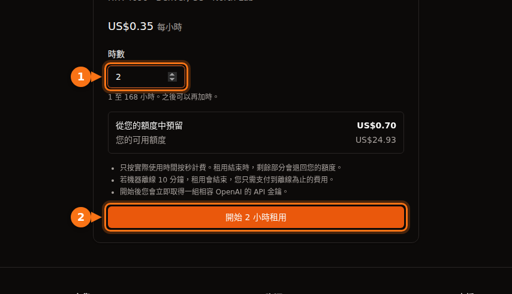

GPU 上架資訊上的每小時價格只涵蓋 GPU 時間，其他什麼都不包括。在多數平台上，您還要付磁碟空間的錢（機器停止時往往比執行時更貴），有些市集要付資料傳輸費，準備時間和閒置時間也會像真正的工作一樣計費，最後還有銀行的貨幣轉換手續費。在下面的試算裡，原本預算 $13.60 RTX 4090 時間的一個月，最後帳單是 $42.23。

這些費用都不是刻意隱藏的，只是用醒目的標價比較平台時很容易漏看。以下內容都在 2026 年 9 月依各平台自己的文件和價格頁面查核，連結列在文末。標價本身請看 [GPU 租用價格比較](/zh_tw/gpu-rental-pricing-comparison-2026/)。

## 各平台的額外費用

| 費用 | Vast.ai | RunPod | Lambda | AWS EC2 | GPUFlow |
| --- | --- | --- | --- | --- | --- |
| 計費單位 | 按秒 | 按秒 | 按分鐘 | 按秒，最低 60 秒 | 按秒，最低 1 分鐘 |
| 停止期間的儲存 | 依主機費率計費 | Volume 磁碟 $0.20/GB/月 | 檔案系統按 GiB/月計費 | EBS 持續計費 | 無 |
| 資料傳輸 | 依主機費率，每個位元組都算 | 不收費 | 不收費 | 傳出：每月 100 GB 免費，之後按 GB 計費 | 無 |
| 開始使用 | 最低儲值 $5 | 一小時的額度；預付卡 $100 | $10 信用卡預授權 | 一種付款方式 | 儲值 $10；預訂金額全額預留 |
| 餘額歸零 | 停止，之後銷毀 | 停止；沒有網路磁碟區 = 資料消失 | 使用後每週結帳 | 不適用 | 租用途中不會發生 |

GPUFlow 能略過儲存和傳輸這兩列，是因為它租的東西不一樣：一組相容 OpenAI 的 API 金鑰，用來呼叫已經在提供者 GPU 上執行的 AI 模型，而不是一台可以登入的機器。反過來說，您無法在上面執行自己的程式碼、訓練或微調。如果您需要的是一台機器，適用的是另外四欄。

## 儲存費用，尤其是停止期間

在任何租給您機器或容器的平台上，您的檔案都放在磁碟上，而磁碟只要存在就要花錢。

- **RunPod** 在 pod 執行時，容器磁碟和 volume 磁碟每 GB 每月收 $0.10。停止 pod 時，容器磁碟會被清除、不收費，但 volume 磁碟會漲到每 GB 每月 $0.20。網路磁碟區不論是否執行，1 TB 以下每 GB 每月 $0.07，超過的部分 $0.05。節省方案只涵蓋 GPU 運算；儲存以標準費率計費。
- **Vast.ai** 對儲存空間「在執行個體存在的每一秒」計費，除了離線以外的所有狀態都算。它的文件講得很直白：「停止執行個體並不能避免儲存費用。」費率由主機設定。
- **AWS** 不收已停止執行個體的運算和資料傳輸費用，但「儲存 Amazon EBS 磁碟區會產生費用」，連結在已停止執行個體上的 Elastic IP 也會繼續計費。us-east-1 的 gp3 磁碟區每 GB 每月約 $0.08。
- **Lambda** 按每月使用的 GiB 數對檔案系統計費，以一小時為單位。

已停止的 RunPod pod 上一個 200 GB 的 volume 磁碟，每月要 200 × $0.20 = $40，就算您再也不啟動那個 pod 也一樣。這比用 RunPod Community Cloud 的價格租 100 小時 RTX 4090 還多。

額度用完會讓情況更糟。RunPod 餘額歸零時，pod 會停止，而且「沒有網路磁碟區的 Pod 會被終止，資料無法復原」。Vast.ai 也會停止執行個體，如果您沒有儲存信用卡，短暫寬限期後「您的執行個體和儲存的資料將被銷毀」。所以一個被遺忘的磁碟區，不是一直向您收錢，就是連同您的工作成果一起消失。

我的做法：專案結束當天就刪除磁碟區，還需要的東西只放在一個小的網路磁碟區上，重要的東西在 GPU 平台以外另存一份。

## 資料傳輸

下載一個 15 GB 的模型、上傳資料集，一個工作階段就可能搬動幾十 GB。

- **Vast.ai** 收取「進出執行個體的每個位元組的頻寬費用，不論它處於什麼狀態」。每位主機自訂上傳和下載價格，文件也提醒這「可能大幅影響資料密集型工作負載的總成本」。租之前請先在上架資訊上看清楚。
- **RunPod** 表示 pod「傳入和傳出都不收費」。
- **Lambda**：「傳入和傳出都不向您收費。」
- **AWS**：傳入免費。傳出到網際網路的流量，所有服務和區域合計每月前 100 GB 免費，之後按 GB 分級計費。每個公有 IPv4 位址不論使用中或閒置，每小時都收 $0.005，一個 720 小時的月份就是 $3.60。

## 押金、預授權與預付額度

多數 GPU 平台採預付制：先買額度，再花掉。放在平台上的錢也是一種成本，尤其是拿不回來的時候。

- **Vast.ai**：最低儲值 $5，可用信用卡、BitPay 或 Crypto.com。用信用卡買、還沒花掉的額度可以透過網站聊天申請退款；花掉的不行。
- **RunPod**：您需要至少夠所選 pod 用一小時的額度，預付卡每筆應至少儲值 $100。額度不可退款，也不能提領。
- **Lambda** 則反過來：每週針對上週的用量收費，並在您新增信用卡時做 $10 的預授權，幾天內退回。它只接受主要信用卡；預付卡和金融卡會被拒絕。
- **SaladCloud**：儲值從 $5 到 $10,000，額度在購買 12 個月後到期。
- **GPUFlow**：透過 Stripe 刷卡儲值，每次 $10 到 $500，不收手續費，額度不會過期。開始租用時，整筆預訂金額會從您的額度中預留，而不是一小筆押金。以每小時 $0.40 預訂 10 小時，$4.00 會被預留到租用結束，沒用到的部分在那時退回。購買的額度不能兌現；刷卡退款只限重複或錯誤扣款、額度沒有入帳，或法律要求的情況，並須在 60 天內提出。

會過期的額度，或是留在您已經不用的平台上的額度，就等於花掉了。依這個月預計的工作量儲值，不要一次儲一整年。

## 準備與閒置時間

租來的機器按時間收費，不按工作量。有兩種時間和真正的工作一樣花錢，卻什麼都沒產出。

### 準備時間

機器一啟動就開始計費。在 Lambda 上，「計費從您啟動執行個體、且執行個體通過健康檢查的那一刻開始」。安裝函式庫、拉取容器映像檔、下載模型，全都發生在計費時間內。以每小時 $0.34 計算，15 分鐘的準備約 $0.09。一次不多，但一個月每天都來一次，就是好幾個小時的 GPU 時間。

有兩個方法有幫助：從已經裝好您工具鏈的範本或映像檔開始，並把模型放在磁碟區上，只下載一次（再和上面的儲存費用權衡一下）。

在 GPUFlow 上，您這邊沒有準備步驟：提供者已經在機器上裝好模型，租用一開始您就拿到 API 金鑰。

### 閒置時間

Lambda 說得很明白：「執行個體只要在執行就會計費，無論是否實際在使用。」Google Cloud 對仍處於 RUNNING 狀態的閒置 VM 也是一樣的說法。讓 pod 開整晚、好讓早上可以直接用，就要付一整晚的 GPU 時間。

Azure 還有一個額外的陷阱。只是「已停止」的虛擬機器（例如從作業系統內部關機）仍會收核心的費用。必須從入口網站或 CLI 把它變成「已停止（已解除配置）」，運算費用才會停止。

GPUFlow 也不例外：在您點擊 **立即結束** 或預訂時間用完之前，都在計費。提早結束不用錢，預留金額沒用到的部分會退回，所以解法很簡單：做完就結束租用。[GPUFlow 如何計費](https://docs.gpuflow.app/zh-tw/renters/billing/)。

## 計費單位與最低收費

按秒計費現在很普遍，但細節各有不同：

| 平台 | 時間如何計費 |
| --- | --- |
| Vast.ai | 按秒 |
| RunPod pod | 按秒（pod 概覽頁面仍寫著按分鐘） |
| RunPod serverless | 按秒，無條件進位，包含 worker 啟動時間和閒置逾時（預設 5 秒） |
| Lambda | 以一分鐘為單位 |
| AWS EC2（Linux） | 按秒，最低 60 秒 |
| Google Cloud | 最低 1 分鐘，之後按秒 |
| Azure | 完整分鐘數 |
| GPUFlow | 按秒，最低 1 分鐘，無條件進位到下一分錢 |

對長時間工作來說，這些差異無關緊要。它們影響的是大量短時間工作階段和 serverless：在 serverless 上，啟動時間和閒置逾時是在請求之外另外計費的。如果您送出的是短請求、中間又有空檔，這兩項的花費可能比請求本身還多。[GPU 按秒計費 vs 按小時計費](/zh_tw/per-second-vs-hourly-gpu-billing/)有完整試算。

## 可中斷執行個體

可中斷（Spot）容量比較便宜，有時便宜很多，但可能被收回。

- Vast.ai 表示可中斷執行個體「通常比隨選便宜 50% 以上」。
- 2026 年 9 月在 AWS 上，p5.4xlarge（一張 H100）用 Spot 每小時 $2.62，隨選則是 $6.88。
- 在 TensorDock 上，儲存空間在您的出價之外以標準費率計費，被出價超過期間也照樣要付。主機會設定最低出價，通常約為隨選價格的 50%。

隱藏的成本是重做的工作。如果您的工作不能從檢查點重新開始，一次中斷就可能把省下的錢全部吃掉。檢查點要存得夠頻繁，讓損失最後一段也不心疼。

## 銀行手續費

幾乎所有 GPU 平台，包括 GPUFlow，都以美元收費。如果您的卡是其他幣別，銀行可能另外收手續費：

- 海外交易手續費通常是 1% 到 3%，有些銀行即使標價是美元，只要商家在國外就會收。
- 大多數加拿大信用卡對其他幣別的消費收約 2.5%。
- 在巴西，國際刷卡消費的 IOF 稅自 2025 年 7 月起為 3.5%。

儲值 $100，就有 $1 到 $3.50 不會出現在平台的發票上。用一張免海外交易手續費的卡，可以省掉大部分。

## 實際試算：每小時 $0.34，一個月 $42

以下是用 RunPod Community Cloud 每小時 $0.34 的 RTX 4090、刷加拿大信用卡的一個真實月份：

- 40 小時的實際工作：40 × $0.34 = $13.60。這是大家做預算時看的數字。
- 20 個工作階段，每次準備 15 分鐘，共 5 小時：5 × $0.34 = $1.70。
- 有兩個晚上 pod 忘了關，每次 10 小時：20 × $0.34 = $6.80。
- 一個 100 GB 的 volume 磁碟保留一整個月。在這個月的 720 小時裡，它執行 65 小時，其餘 655 小時處於停止狀態：100 × ($0.10 × 65/720 + $0.20 × 655/720) = 約 $19.10。
- 小計 $41.20，加上 2.5% 的海外交易手續費：$1.03。

總計：$42.23，約為原本預算的 GPU 工作的 3.1 倍。RunPod 不收資料傳輸費，如果換成有頻寬費的 Vast.ai 主機，還會多一項。

<figure>
<svg viewBox="0 0 720 300" role="img" aria-labelledby="d1-title" xmlns="http://www.w3.org/2000/svg" font-family="system-ui, sans-serif" font-size="15">
<title id="d1-title">堆疊長條圖：預算 13.60 美元 RTX 4090 時間的一個月，加上準備時間、閒置的夜晚、磁碟儲存和刷卡手續費後，帳單變成 42.23 美元</title>
<rect x="0" y="0" width="720" height="300" fill="#ffffff"/>
<text x="20" y="28" fill="#1e1b4b" font-weight="600">RTX 4090 每小時 $0.34，一個月的費用</text>
<line x1="130" y1="50" x2="130" y2="170" stroke="#e2e8f0" stroke-width="1"/>
<text x="130" y="190" text-anchor="middle" fill="#64748b" font-size="13">$0</text>
<line x1="250" y1="50" x2="250" y2="170" stroke="#e2e8f0" stroke-width="1"/>
<text x="250" y="190" text-anchor="middle" fill="#64748b" font-size="13">$10</text>
<line x1="370" y1="50" x2="370" y2="170" stroke="#e2e8f0" stroke-width="1"/>
<text x="370" y="190" text-anchor="middle" fill="#64748b" font-size="13">$20</text>
<line x1="490" y1="50" x2="490" y2="170" stroke="#e2e8f0" stroke-width="1"/>
<text x="490" y="190" text-anchor="middle" fill="#64748b" font-size="13">$30</text>
<line x1="610" y1="50" x2="610" y2="170" stroke="#e2e8f0" stroke-width="1"/>
<text x="610" y="190" text-anchor="middle" fill="#64748b" font-size="13">$40</text>
<text x="120" y="84" text-anchor="end" fill="#1e1b4b">預算</text>
<rect x="130" y="62" width="163.2" height="34" rx="3" fill="#6366f1"/>
<text x="301.2" y="84" fill="#1e1b4b">$13.60</text>
<text x="120" y="144" text-anchor="end" fill="#1e1b4b">實際帳單</text>
<rect x="130" y="122" width="163.2" height="34" fill="#6366f1"/>
<rect x="293.2" y="122" width="20.4" height="34" fill="#eef2ff" stroke="#6366f1" stroke-width="1.5"/>
<rect x="313.6" y="122" width="81.6" height="34" fill="#f97316"/>
<rect x="395.2" y="122" width="229.2" height="34" fill="#64748b"/>
<rect x="624.4" y="122" width="12.4" height="34" fill="#1e1b4b"/>
<text x="644.8" y="144" fill="#1e1b4b" font-weight="600">$42.23</text>
<line x1="130" y1="50" x2="130" y2="170" stroke="#64748b" stroke-width="1.5"/>
<rect x="20" y="209" width="16" height="16" fill="#6366f1"/>
<text x="44" y="222" fill="#1e1b4b">GPU 實際工作：$13.60</text>
<rect x="250" y="209" width="16" height="16" fill="#eef2ff" stroke="#6366f1" stroke-width="1.5"/>
<text x="274" y="222" fill="#1e1b4b">準備時間：$1.70</text>
<rect x="480" y="209" width="16" height="16" fill="#f97316"/>
<text x="504" y="222" fill="#1e1b4b">閒置的夜晚：$6.80</text>
<rect x="20" y="245" width="16" height="16" fill="#64748b"/>
<text x="44" y="258" fill="#1e1b4b">Volume 磁碟：$19.10</text>
<rect x="250" y="245" width="16" height="16" fill="#1e1b4b"/>
<text x="274" y="258" fill="#1e1b4b">刷卡手續費：$1.03</text>
</svg>
<figcaption>本節試算，依比例繪製：以每小時 $0.34 計算的 40 小時實際 GPU 工作，加上 5 小時準備時間、兩個忘了關機的夜晚、保留一整個月的 100 GB volume 磁碟，以及 2.5% 的刷卡手續費。GPU 工作不到帳單的三分之一。</figcaption>
</figure>

最大的一筆根本不是 GPU，而是一個在這個月 91% 的時間都處於停止狀態的磁碟。解法很無聊：刪掉磁碟區或縮小它，不工作時就結束 pod。

### 租用前的檢查清單

1. 把 GPU 時間，加上檔案保留期間以停止時費率計算的儲存費用，全部加起來。
2. 如果平台有頻寬費，查看上架資訊上的頻寬價格，並估計您會下載多少。
3. 把準備時間算成付費時間。
4. 清楚知道要怎麼停止付費：結束租用、停止或解除配置機器、刪除磁碟區。
5. 清楚知道[餘額歸零時您的資料會怎樣](/zh_tw/runpod-vs-vastapi-comparison/)。
6. 查一下您信用卡的海外交易手續費。

如果您需要的是一個能從程式碼呼叫的 AI 模型，而不是一台執行自己軟體的機器，以 API 為基礎的租用方式可以完全免掉儲存、傳輸和準備這幾項。[按小時租 GPU，還是按 token 付費的 API](/zh_tw/hourly-gpu-vs-per-token-api/)比較了它和按 token 付費，[GPUFlow vs Vast.ai vs RunPod vs SaladCloud](/zh_tw/gpuflow-vs-vast-ai-vs-runpod/)則說明哪個平台適合哪種工作。至於訓練或任何需要完整機器的工作，這份清單就是讓帳單貼近每小時價格的方法。

## 資料來源

- RunPod：[pod 價格與儲存](https://docs.runpod.io/pods/pricing)、[價格頁面](https://www.runpod.io/pricing)、[Pod 概覽](https://docs.runpod.io/pods/overview)、[serverless 價格](https://docs.runpod.io/serverless/pricing)、[計費資訊](https://docs.runpod.io/references/billing-information)、[RTX 4090 價格](https://www.runpod.io/gpu-models/rtx-4090)
- Vast.ai：[價格](https://docs.vast.ai/guides/instances/pricing.md)、[計費](https://docs.vast.ai/documentation/reference/billing)、[快速入門（最低儲值）](https://docs.vast.ai/guides/get-started/quickstart.md)
- Lambda：[計費](https://docs.lambda.ai/public-cloud/billing/)、[管理帳務](https://docs.lambda.ai/public-cloud/manage-billing/)
- SaladCloud：[計費](https://docs.salad.com/general/explanation/billing.md)
- TensorDock：[Spot 執行個體](https://docs.tensordock.com/virtual-machines/spot-instances)
- AWS：[EC2 隨選價格](https://aws.amazon.com/ec2/pricing/on-demand/)、[停止與啟動的運作方式](https://docs.aws.amazon.com/AWSEC2/latest/UserGuide/how-ec2-instance-stop-start-works.html)、[VPC 價格（公有 IPv4）](https://aws.amazon.com/vpc/pricing/)、[透過 Vantage 查詢的 p5.4xlarge 價格](https://instances.vantage.sh/aws/ec2/p5.4xlarge?region=us-east-1)，gp3 價格：[CloudBurn EBS 價格指南](https://cloudburn.io/blog/amazon-ebs-pricing)
- Google Cloud：[VM 執行個體價格](https://cloud.google.com/compute/vm-instance-pricing)
- Azure：[Linux 虛擬機器價格與常見問題](https://azure.microsoft.com/en-us/pricing/details/virtual-machines/linux/)
- 刷卡手續費：[Experian](https://www.experian.com/blogs/ask-experian/what-is-a-foreign-transaction-fee/)、[NerdWallet Canada](https://www.nerdwallet.com/ca/p/best/credit-cards/best-no-foreign-transaction-fee-credit-cards)，巴西 IOF：[Wise Brazil](https://wise.com/br/blog/iof-cartao-internacional)
- GPUFlow：[計費](https://docs.gpuflow.app/zh-tw/renters/billing/)、[入門指南](https://docs.gpuflow.app/zh-tw/renters/getting-started/)、[市集](https://gpuflow.app/zh-TW/marketplace)

皆於 2026 年 9 月查核。
