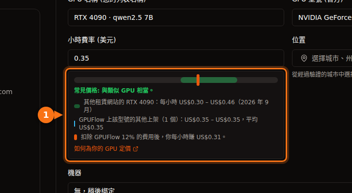

如果您有一張一天大部分時間都閒置的遊戲顯示卡，可以把它放到市集上出租，按小時收費。值不值得，取決於四個數字：

1. 租用者為您的卡**每小時付多少錢**。
2. **平台抽多少**。
3. 執行期間**您要付多少電費**。
4. **每天實際被租用幾小時**。

前三個很容易查到。第四個沒有人能向您保證，所以我們列出一個範圍。以下所有價格都在 2026 年 9 月查核過，來源列在文末。

## 1. 租用者付多少

以下是 2026 年 9 月 GPU 租用網站（Vast.ai、RunPod、Salad、SimplePod、TensorDock、Hyperstack、Lambda）上常見的每小時隨選價格：

| GPU | 常見每小時價格 | 範圍中間值 |
| --- | --- | --- |
| RTX 3060 12 GB | $0.05 – $0.08 | $0.065 |
| RTX 4070 | $0.07 – $0.15 | $0.11 |
| RTX 3090 | $0.11 – $0.31 | $0.21 |
| RTX 4080 | $0.23 – $0.27 | $0.25 |
| RTX 4090 | $0.30 – $0.46 | $0.38 |
| RTX 5090 | $0.41 – $0.69 | $0.55 |

記憶體和速度一樣重要。3090 或 4090 這類 24 GB 的卡，能執行比 12 GB 或 16 GB 的卡更大的 AI 模型，租用者也願意為此多付錢。

## 2. 平台抽多少

| 平台 | 抽成 | 提領 |
| --- | --- | --- |
| GPUFlow | 抽 12%，您拿 88% | 透過 Stripe 匯入您的銀行帳戶。最低 $25，每次提領 $2.50。 |
| Vast.ai | Vast 表示刊登價格通常比主機實際收入高約 25% | Wise、PayPal 或 Stripe。最低 $20，每週開立發票。 |
| Salad | 未公開 | PayPal、禮物卡、遊戲等 |

各平台的架構也不一樣。Vast.ai 的主機執行 Ubuntu，租用者在主機上取得容器，可以透過 SSH 或 Jupyter 存取。Salad 在 Windows 10 或 11 上執行。在 GPUFlow 上，您只要在一台使用 systemd 的 Linux 電腦上執行一行指令；租用者只能透過 API 使用您的 AI 模型，永遠無法取得您機器上的 shell。[租用者能存取什麼、不能存取什麼](https://docs.gpuflow.app/zh-tw/providers/security/)。

## 3. 電費要多少

公式：**耗電量（kW）× 您每度電的價格 = 每小時成本。**

耗電量方面，我們採用每張卡官方的顯示卡功耗（board power）。這大約是顯示卡本身的最大耗電量；在 AI 生成文字時，實際耗電通常較低。電腦的其他零件還會再增加耗電。最準確的方法是實際測量：GPUFlow 會在 **我的機器** 上即時顯示您 GPU 的功耗，而插座式電力計可以測出整台電腦的耗電。

| GPU | 顯示卡功耗 |
| --- | --- |
| RTX 3060 | 170 W |
| RTX 4070 | 200 W |
| RTX 3090 | 350 W |
| RTX 4080 | 320 W |
| RTX 4090 | 450 W |
| RTX 5090 | 575 W |

RTX 4090 以 450 W 執行一小時的電費：

| 地區 | 住宅電價 | 450 W 執行一小時 |
| --- | --- | --- |
| 美國（2026 年平均預估） | 每度 18.2 美分 | 約 $0.08 |
| 加拿大 | 每度 C$0.170 | 約 C$0.08 |
| 英國（2026 年 10 月至 12 月電價上限） | 每度 26.32 便士 | 約 11.8 便士 |
| 德國 | 每度 €0.3869 | 約 €0.17 |
| 法國 | 每度 €0.2561 | 約 €0.12 |

在美國，電費大約吃掉 4090 每出租一小時收入的四分之一。在德國，同樣一小時的電費約 €0.17，所以定價之前請先確認您自己的電價。

## 4. 綜合計算

以中間價格、GPUFlow 88% 的分潤，以及美國平均電價、滿載顯示卡功耗計算，每出租一小時：

| GPU | 您拿到（88%） | 電費 | 每出租一小時淨賺 | 每天 4 小時（每月 120 小時） | 每天 12 小時（每月 360 小時） |
| --- | --- | --- | --- | --- | --- |
| RTX 3060 12 GB | $0.057 | $0.031 | **$0.026** | $3.15 | $9.45 |
| RTX 4070 | $0.097 | $0.036 | **$0.060** | $7.25 | $21.74 |
| RTX 3090 | $0.185 | $0.064 | **$0.121** | $14.53 | $43.60 |
| RTX 4080 | $0.220 | $0.058 | **$0.162** | $19.41 | $58.23 |
| RTX 4090 | $0.334 | $0.082 | **$0.253** | $30.30 | $90.90 |
| RTX 5090 | $0.484 | $0.105 | **$0.379** | $45.52 | $136.57 |

這張表沒有包含三件事：

- **等待時間**。您的電腦必須開機並連上網路，租用者才找得到它。等待期間它仍然在耗電。請測量電腦閒置時的耗電，也一併扣掉。
- **耗損**。長時間高負載下，風扇和散熱膏老化得比較快。請保持機殼通風良好，並留意溫度。
- **稅金**。出租收入也是收入。怎麼課稅取決於您居住的地方。

## 數字告訴我們什麼

- **RTX 3090、4080、4090 和 5090** 如果每天被租用好幾個小時，能賺到可觀的金額。3090 是最划算的選擇：24 GB 記憶體，電費又低。
- **RTX 3060 和 4070** 每小時賺得很少。一個月 $3 的話，3060 大約要八個月才能達到 GPUFlow $25 的最低提領金額。只有在您的電費很便宜，或電腦本來就開著的情況下才值得。
- **使用率決定一切**。同一張 4090，每天被租 4 小時或 12 小時，每月收入就是 $30 和 $91 的差別。合理的價格加上穩定在線的機器，比降價幾美分更能吸引租用者。

## 如何增加出租時數

1. **一開始把價格訂在範圍的下半段**。租用者會比價。等開始有人租用後，再調高價格。
2. **保持在線**。離線的 GPU 無法被租用。在 GPUFlow 上，租用者可以在離線的 GPU 上點擊 **上線時通知我**；有人在等待時，您會收到電子郵件。
3. **提供熱門模型**。在您的上架資訊中寫出您執行的模型，例如 `qwen2.5:7b` 或 `llama3.1:8b`。租用者會搜尋這些名稱。
4. **一週後再檢查一次**。大部分時間都有人租？稍微調高價格。沒人租？稍微調低價格。

在 GPUFlow 上，上架表單會顯示您的價格和其他租用網站、以及 GPUFlow 上同型號顯示卡的其他上架相比落在什麼位置，還有扣除手續費後您每小時能拿到多少：

## GPUFlow 支援提領的地區

GPUFlow 透過 Stripe 撥款到位於**美國、加拿大、英國、瑞士和歐洲經濟區**的銀行帳戶。如果您住在其他地區，仍然可以上架 GPU，並用賺到的收益租用其他 GPU，但目前還無法提領到銀行。收益會先暫扣 7 天（註冊未滿 30 天的帳戶為 14 天）才能提領。[在 GPUFlow 收款](https://docs.gpuflow.app/zh-tw/providers/getting-paid/)。

## 用您自己的數字算算看

**（每小時價格 × 0.88）−（瓦數 ÷ 1,000 × 每度電價）= 每出租一小時淨賺**

然後乘以您實際預期的時數。如果結果每月只有幾美元，大概不值得讓硬體耗損。如果有幾十美元，就值得試一個月，再看實際數字。

要開始的話，請參閱[讓您的 GPU 上線](https://docs.gpuflow.app/zh-tw/providers/getting-started/)和[如何為您的 GPU 定價](https://docs.gpuflow.app/zh-tw/providers/pricing/)。

## 相關文章

- [GPUFlow、Vast.ai、RunPod、SaladCloud 比較：哪一個適合您的工作](/zh_tw/gpuflow-vs-vast-ai-vs-runpod/)
- [GPU 租用的真實成本：每小時價格沒告訴您的費用](/zh_tw/hidden-fees-in-gpu-rental/)

## 資料來源

皆於 2026 年 9 月查核。

- GPU 租用價格範圍：[GPUFlow 文件：如何為您的 GPU 定價](https://docs.gpuflow.app/zh-tw/providers/pricing/)
- GPUFlow 手續費、暫扣與提領：[GPUFlow 文件：收款](https://docs.gpuflow.app/zh-tw/providers/getting-paid/)
- Vast.ai 主機收入：[vast.ai 文章](https://vast.ai/article/how-much-money-can-you-earn-renting-out-your-gpu-on-vast-ai)（2026 年 5 月 18 日）；提領：[docs.vast.ai/host/payment.md](https://docs.vast.ai/host/payment.md)；主機託管需求：[docs.vast.ai/host/hosting-overview.md](https://docs.vast.ai/host/hosting-overview.md)
- Salad：[salad.com/download](https://salad.com/download/)、[PayPal 兌換](https://support.salad.com/rewards/redeeming-your-rewards/how-to-redeem-paypal/)
- 顯示卡功耗：NVIDIA 產品頁面 [RTX 3060](https://www.nvidia.com/en-us/geforce/graphics-cards/30-series/rtx-3060-3060ti/)、[RTX 4080](https://www.nvidia.com/en-us/geforce/graphics-cards/40-series/rtx-4080-family/)、[RTX 4090](https://www.nvidia.com/en-us/geforce/graphics-cards/40-series/rtx-4090/)、[RTX 5090](https://www.nvidia.com/en-us/geforce/graphics-cards/50-series/rtx-5090/)；RTX 3090：[TechPowerUp](https://www.techpowerup.com/gpu-specs/geforce-rtx-3090.c3622)；RTX 4070：[TechSpot](https://www.techspot.com/review/2663-nvidia-geforce-rtx-4070/)
- 美國電價：[EIA 短期能源展望](https://www.eia.gov/outlooks/steo/report/elec_coal_renew.php)（2026 年 9 月）
- 英國電價：[Ofgem 電價上限](https://www.ofgem.gov.uk/your-energy-supply/your-energy-bill/energy-price-cap-unit-rates-and-standing-charges)
- 德國和法國電價，2025 年下半年：[Eurostat 電價統計](https://ec.europa.eu/eurostat/statistics-explained/index.php?title=Electricity_price_statistics)、[Eurostat nrg_pc_204 法國資料](https://ec.europa.eu/eurostat/api/dissemination/statistics/1.0/data/nrg_pc_204?geo=FR&nrg_cons=KWH2500-4999&unit=KWH&tax=I_TAX&currency=EUR&lastTimePeriod=1)
- 加拿大電價，2025 年 6 月：[GlobalPetrolPrices](https://www.globalpetrolprices.com/Canada/electricity_prices/)
