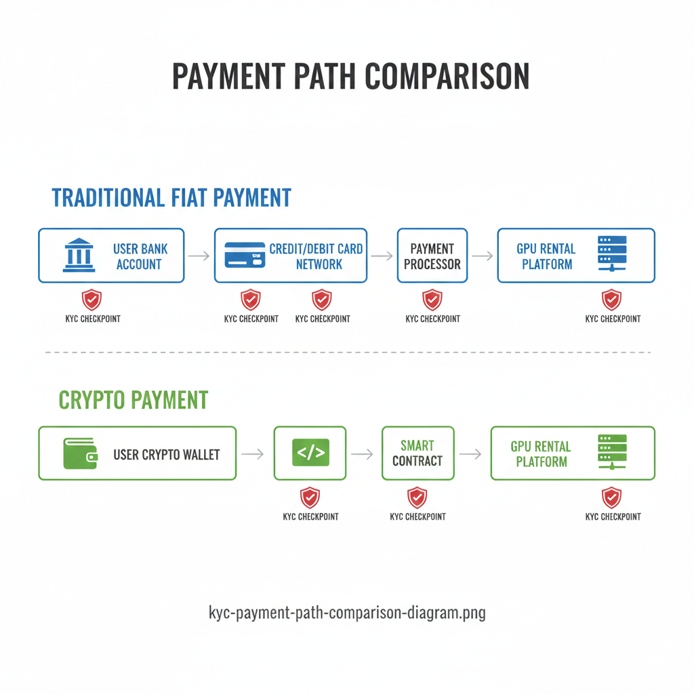
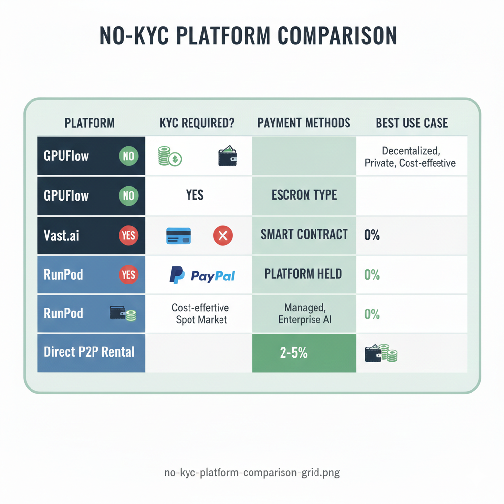
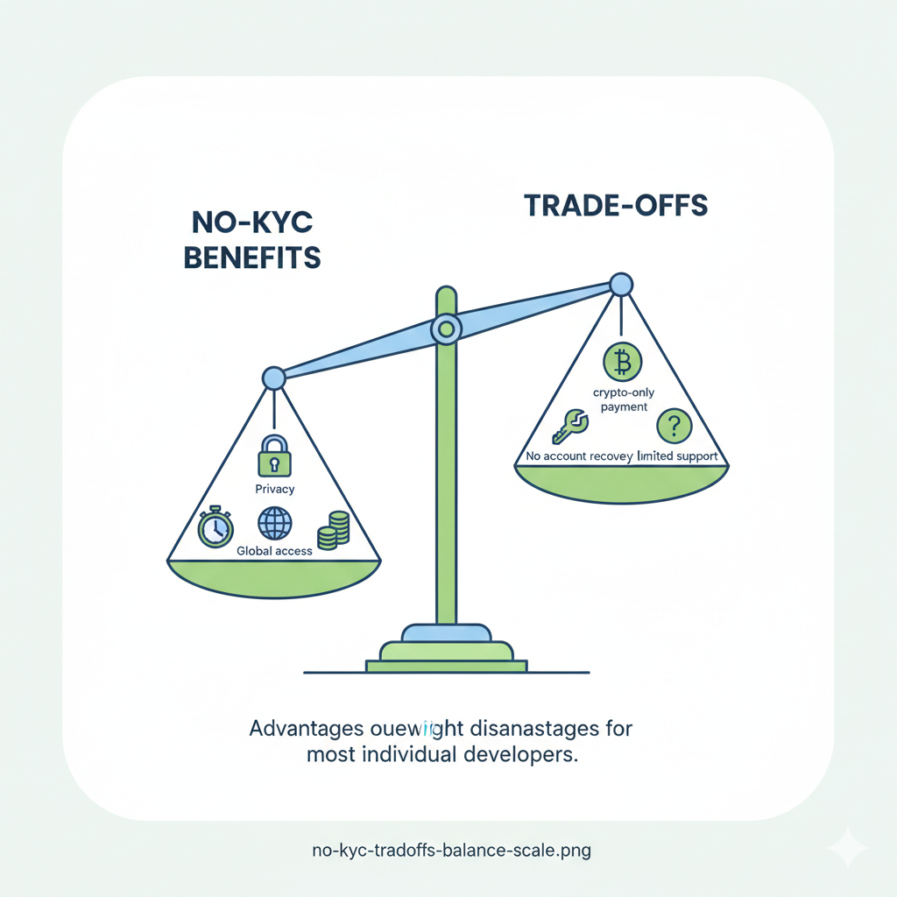
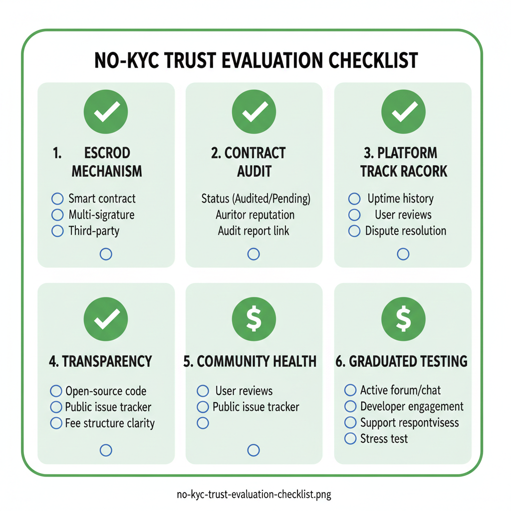
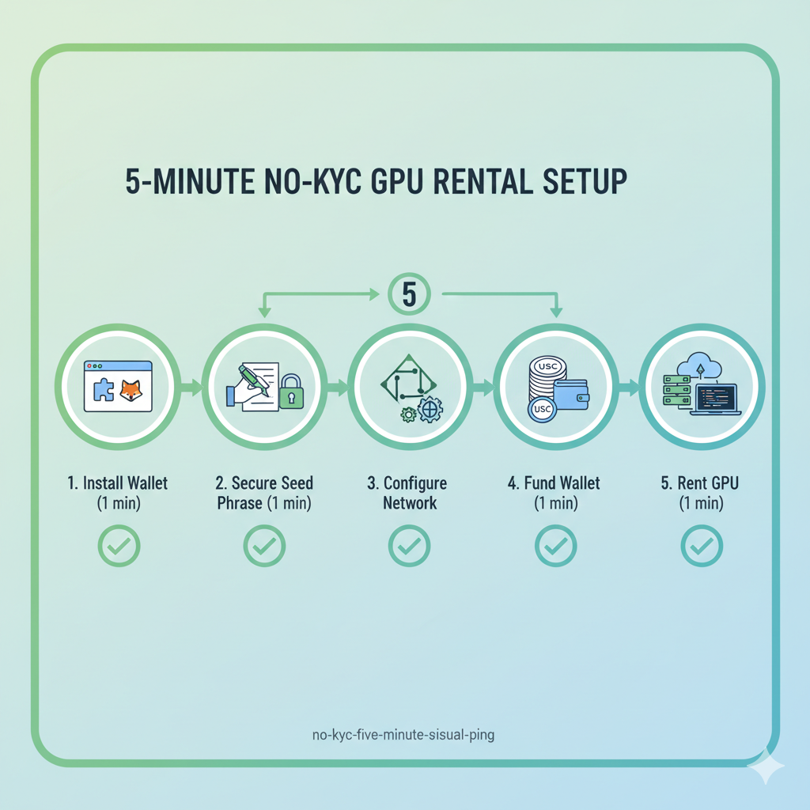
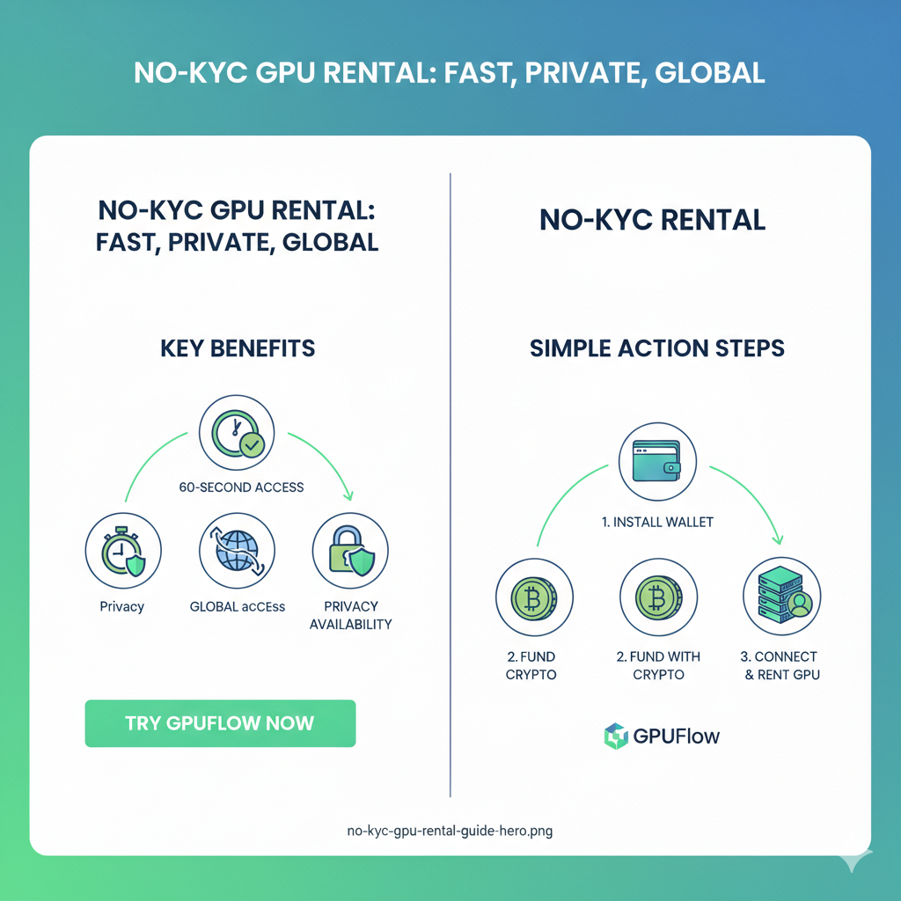

從 AWS 租用 GPU 需要信用卡、電話號碼、地址驗證，有時還需要政府簽發的身份證件。Azure 需要一個與已驗證身份綁定的 Microsoft 帳戶。Google Cloud 會進行信用檢查。對於一個需要四個小時 A100 使用時間來微調模型的開發人員來說，這些要求代表了與技術能力或支付意願無關的障礙。

無 KYC（No-KYC）GPU 租賃平台完全從流程中消除了身份驗證。您連接加密貨幣錢包，存入資金，即可存取硬體。整個註冊流程耗時不到六十秒。本指南將檢視哪些平台在無 KYC 要求下運作，存在哪些實際的權衡，以及如何評估一個無需驗證的平台是否值得您的信任和金錢。

有關加密貨幣支付的完整流程，包括錢包設置、智能合約託管機制和平台比較，請參閱我們的[使用加密貨幣租用 GPU 的完整指南](/zh_tw/rent-gpu-with-crypto/)。

---

## 為什麼 GPU 租賃平台需要 KYC（以及為什麼有些不需要）

KYC——即「了解您的客戶」（Know Your Customer）——是指金融機構用於遵守反洗錢（AML）法規的身份驗證流程。理解 KYC 存在的原因，就能釐清它何時是真正必要的，何時僅僅是從支付基礎設施繼承而來的。

### 監管鏈條

當您使用信用卡支付 GPU 租賃費用時，您的交易通過受監管的金融基礎設施進行：

**1. 您的銀行（發卡行）：**

- 具有 KYC 義務的受監管實體
- 必須驗證客戶身份
- 向當局報告可疑交易

**2. 卡片網路（Visa/Mastercard）：**

- 在銀行法規下運作
- 要求商家保持合規性
- 可以因違規而凍結商家帳戶

**3. 支付處理商（Stripe, PayPal）：**

- 在大多數司法管轄區獲得貨幣傳輸許可
- 必須驗證商家身份
- 將驗證要求傳遞給平台

**4. GPU 租賃平台：**

- 使用支付處理商 → 繼承其要求
- 必須保留記錄以確保合規
- 驗證用戶身份以滿足上游要求

**這條鏈條創造了繼承的義務。** 使用 Stripe 的 GPU 租賃平台必須收集用戶身份資訊，因為 Stripe 要求這樣做，因為 Visa 要求這樣做，因為銀行監管機構要求這樣做。

### 用加密貨幣打破鏈條

原生加密貨幣平台通過完全避開傳統支付基礎設施來打破這一監管鏈條：

**加密貨幣支付流程：**

1. 您在自託管錢包中持有加密貨幣
2. 智能合約將資金鎖定為託管（Escrow）
3. GPU 供應商交付服務
4. 智能合約向供應商釋放付款

**不涉及受監管的金融中介。** 平台促進點對點交易，而無需在傳統銀行系統中持有客戶資金。

**這就是為什麼 GPUFlow 不需要 KYC 的原因：**

- 無信用卡處理（無銀行法規）
- 無法幣處理（無需貨幣傳輸許可證）
- 智能合約託管（平台不託管資金）
- 加密貨幣對加密貨幣的交易（在傳統金融範圍之外）

### 司法管轄區因素

平台所在地和法律結構也決定了 KYC 要求：

**美國平台（RunPod, Lambda Labs）：**

- 受美國銀行法規約束
- FinCEN 貨幣傳輸規則可能適用
- 逐州的許可要求
- 通常需要 KYC 才能獲得全部功能

**歐盟平台：**

- 受 AMLD（反洗錢指令）約束
- 針對加密服務的 MiCA 法規
- 通常在超過一定門檻時需要 KYC

**離岸或去中心化平台：**

- 可能在主要監管管轄區之外運作
- 基於智能合約的營運減少了監管接觸點
- KYC 要求極低或不存在

**GPUFlow 的方法：**

- 原生加密貨幣架構
- 智能合約託管（非平台託管）
- 不處理法定貨幣
- **結果：無需 KYC**

### KYC 關乎支付，而非 GPU

關鍵見解：**KYC 要求附屬於支付處理，而非 GPU 租賃。**

沒有任何法規要求對租用運算資源進行身份驗證。驗證之所以存在，是因為：

1. 信用卡公司要求
2. 銀行要求
3. 支付處理商要求
4. 平台繼承了這些要求

**移除傳統支付基礎設施 → 移除 KYC 要求。**

這就是為什麼相同的 GPU 硬體在一個平台（使用信用卡的 RunPod）上可能需要完整的身份驗證，而在另一個平台（使用加密貨幣的 GPUFlow）上則完全不需要驗證。運算資源是相同的；不同的是支付基礎設施。



---

## 無 KYC GPU 平台比較

並非所有 GPU 租賃平台在身份驗證方面都是平等的。本節審查主要選項、它們的實際要求以及「無 KYC」對每個平台在實務上的意義。

### GPUFlow：真正的無 KYC

**所需驗證：** 無

**您需要的：**

- 加密貨幣錢包（MetaMask, Phantom 等）
- 加密貨幣餘額（ETH, MATIC, USDC, SOL）
- 僅此而已

**您不需要的：**

- 電子郵件地址
- 電話號碼
- 政府身份證件
- 自拍或照片驗證
- 地址驗證
- 信用卡

**如何運作：**

1. 訪問 GPUFlow.app
2. 點擊「連接錢包」（Connect Wallet）
3. 批准錢包連接（不授予資金存取權限）
4. 存入加密貨幣
5. 選擇 GPU 並開始租賃
6. **總時間：少於 60 秒**

**為什麼無 KYC 是可能的：**

GPUFlow 完全在加密貨幣軌道上運行：

- 智能合約託管持有資金（非平台銀行帳戶）
- 支付通過區塊鏈進行錢包對錢包轉帳
- 無法幣接觸平台
- 不涉及受監管的支付處理商

**平台費用：** 10-15%

**典型 GPU 定價：**
| GPU | 小時費率 |
|-----|-------------|
| RTX 4090 | $0.50-0.80 |
| RTX 3090 | $0.35-0.55 |
| A100 40GB | $1.20-1.80 |
| A100 80GB | $1.60-2.40 |

**託管保護（Escrow）：**

您的付款鎖定在一個鏈上可見的智能合約中。在滿足租賃條件之前，GPUFlow 和 GPU 供應商都無法存取這些資金。這提供了比信任經過 KYC 驗證的平台誠實持有您的資金更強的加密保證。

關於智能合約託管如何保護您的付款並消除交易對手風險的詳細解釋，請參閱我們的[使用加密貨幣租用 GPU 的完整指南](/zh_tw/rent-gpu-with-crypto/)。

**最適合：**

- 最大限度的隱私
- 最快的註冊速度
- 銀行服務受限地區的用戶
- 避免企業帳戶要求的開發人員

---

### Vast.ai：承租人無需 KYC

**所需驗證：** 租賃無需驗證，供應商收款需 KYC

**您需要的：**

- 電子郵件地址
- 支付方式（加密貨幣或信用卡）

**您不需要的：**

- 政府身份證件（用於租賃）
- 電話驗證
- 地址驗證

**區別很重要：**

Vast.ai 將承租人與供應商分開：

- **承租人：** 無需身份驗證
- **供應商：** 必須完成 KYC 才能提取收入

如果您只是租用 GPU（而不是提供 GPU），Vast.ai 實際上是作為一個無 KYC 平台運作的。

**支付選項：**

| 方式                          | 需要 KYC 嗎？              |
| ----------------------------- | -------------------------- |
| 加密貨幣（通過 CoinPayments） | 否                         |
| 信用卡                        | 否（發卡公司已經驗證了您） |
| 銀行轉帳                      | 否                         |

**加密貨幣支付如何運作：**

1. 創建 Vast.ai 帳戶（僅需電子郵件）
2. 導航至帳單（Billing）
3. 選擇「添加信用」（Add Credit）→「加密貨幣」（Cryptocurrency）
4. 選擇加密貨幣（BTC, ETH, USDC, 其他）
5. 通過 CoinPayments 閘道完成支付
6. 區塊鏈確認後顯示信用

**平台費用：** ~20%

**典型 GPU 定價：**
| GPU | 小時費率 |
|-----|-------------|
| RTX 4090 | $0.29-0.78 |
| RTX 3090 | $0.20-0.45 |
| A100 40GB | $0.84-1.49 |
| A100 80GB | $1.20-2.10 |

**託管類型：** 平台持有（非智能合約）

Vast.ai 將資金持有在其系統中，而不是基於區塊鏈的託管。這需要信任 Vast.ai 作為一家公司，而不是信任加密保證。他們的過往記錄很穩健，但信任模型與 GPUFlow 不同。

**最適合：**

- 最大的 GPU 選擇範圍
- 最低的絕對定價
- 對平台持有資金感到放心的用戶
- 想要加密支付但不需要完全的原生加密體驗的用戶

---

### RunPod：部分 KYC

**所需驗證：** 基於使用情況分層

**RunPod 的分層方法：**

| 層級     | 要求            | 限制                        |
| -------- | --------------- | --------------------------- |
| 基礎     | 僅電子郵件      | 有限的 GPU 存取，低支出上限 |
| 已驗證   | 電話 + 電子郵件 | 更高限額，更多 GPU 選項     |
| 完整 KYC | 身份證驗證      | 無限存取，啟用提款          |

**這在實務中意味著什麼：**

- **小型租賃：** 僅電子郵件註冊即可
- **常規使用：** 可能需要電話驗證
- **提款：** 需要完整 KYC（如果您也是供應商，這很重要）

**加密貨幣支付：**

RunPod 通過 Coinbase Commerce 接受加密貨幣：

- 比特幣（BTC）
- 以太坊（ETH）
- USDC

但是，根據驗證層級，帳戶限制可能仍然適用。

**平台費用：** ~20%

**典型 GPU 定價：**
| GPU | 小時費率 |
|-----|-------------|
| RTX 4090 | $0.44-0.74 |
| RTX 3090 | $0.22-0.44 |
| A100 40GB | $1.09-1.89 |
| A100 80GB | $1.69-2.29 |

**最適合：**

- 想要使用模板的託管體驗的用戶
- 對部分驗證感到放心的用戶
- 優先考慮可靠性而非隱私的開發人員

---

### 直接供應商安排：可變 KYC

**所需驗證：** 取決於供應商

在主要平台之外，個別 GPU 供應商有時接受直接付款：

**哪裡可以找到直接供應商：**

- Discord 社群（ML/AI 伺服器）
- Reddit (r/MachineLearning, r/LocalLLaMA)
- Telegram 群組
- 供應商自己的網站

**典型安排：**

- 直接與供應商協商
- 向供應商的錢包支付加密貨幣
- 接收 SSH 憑證
- 無平台參與

**KYC 狀態：** 通常無（個人對個人交易）

**風險：**

- 無託管保護
- 無平台爭議解決
- 必須自己評估供應商的可信度
- 如果服務失敗，無退款

**風險緩解：**

- 從小型測試租賃開始
- 在社群中檢查供應商的聲譽
- 使用託管服務（Particl, 通過受信任的第三方進行手動託管）
- 從其他用戶處獲取推薦

**最適合：**

- 能夠評估交易對手風險的經驗豐富的用戶
- 最高的隱私要求
- 為大型/長期租賃協商價格

---

### 比較矩陣

| 平台     | 需要 KYC     | 支付方式      | 託管類型     | 平台費用 |
| -------- | ------------ | ------------- | ------------ | -------- |
| GPUFlow  | 無           | 僅加密貨幣    | 智能合約     | 10-15%   |
| Vast.ai  | 無（承租人） | 加密貨幣 + 卡 | 平台持有     | ~20%     |
| RunPod   | 分層         | 加密貨幣 + 卡 | 平台持有     | ~20%     |
| P2P 直接 | 通常無       | 加密貨幣      | 無（或手動） | 0%       |

**決策框架：**

```

想要最大隱私 + 智能合約保護？
→ GPUFlow

想要最大選擇範圍 + 最低價格？
→ Vast.ai

想要託管體驗 + 願意驗證電話？
→ RunPod

想要零費用 + 對風險感到放心？
→ P2P 直接



---

## 沒有 KYC 你放棄了什麼：權衡與限制

無 KYC GPU 租賃提供了明顯的優勢——速度、隱私、全球可訪問性。但也存在權衡。了解這些限制有助於您決定無 KYC 平台是否適合您的具體情況。

### 權衡 1：僅限加密貨幣支付

**限制：**

無 KYC 平台接受加密貨幣，因為加密貨幣使無 KYC 營運成為可能。這不是設計選擇——這是結構性要求。傳統支付方式（信用卡、銀行轉帳）帶有金融系統的 KYC 義務。

**這意味著什麼：**

- 您必須在租賃前獲取加密貨幣
- 如果您從未使用過加密貨幣，則存在學習曲線
- 與輸入信用卡號碼相比，步驟更多
- 購買加密貨幣時的兌換費用（0.1-1%）

**這對誰影響最大：**

- 沒有加密貨幣經驗的用戶
- 處於加密貨幣存取受限司法管轄區的用戶
- 想要將 GPU 租賃費用記入企業信用卡的用戶
- 任何需要無需任何設置即可即時存取的人

**這對誰影響最小：**

- 已經持有加密貨幣的開發人員
- 高費用國家的用戶（無論如何加密貨幣都能省錢）
- 隱私意識強的用戶（願意為隱私利益而學習）
- 任何已經使用過 MetaMask 或類似錢包的人

**緩解措施：**

加密貨幣的學習曲線約為 30-60 分鐘。我們的[使用加密貨幣租用 GPU 的完整指南](/zh_tw/rent-gpu-with-crypto/)詳細涵蓋了錢包設置、穩定幣獲取和首次租賃流程。一旦建立，工作流程與任何支付方式相當。

---

### 權衡 2：無帳戶恢復

**限制：**

傳統平台將帳戶與已驗證的身份綁定。忘記密碼？通過電子郵件重置。失去電子郵件存取權限？用電話驗證身份。失去電話？提供政府身份證件。

無 KYC 平台無法提供這些恢復途徑，因為它們不知道您是誰。

**這意味著什麼：**

- 失去錢包存取權限 → 失去存放在平台上的任何資金
- 針對基於錢包的身份驗證，沒有「忘記密碼」恢復功能
- 助記詞（Seed phrase）是唯一的恢復機制
- 平台支援無法幫助恢復錢包存取權限

**風險是真實的：**

如果您丟失了 MetaMask 助記詞：

- 錢包將永久無法存取
- 錢包中的任何加密貨幣都將永遠丟失
- 與該錢包綁定的任何平台信用都將丟失
- 不存在申訴流程——沒有任何身份驗證可以恢復存取權限

**這對誰影響最大：**

- 不熟悉加密貨幣安全實踐的用戶
- 不維護安全助記詞備份的用戶
- 任何容易丟失密碼或存取憑證的人

**這對誰影響最小：**

- 在加密貨幣自託管方面經驗豐富的用戶
- 擁有既定安全備份實踐的用戶
- 任何已經使用具有適當備份的硬體錢包的人

**緩解措施：**

1. 將助記詞寫在紙上（絕不以數位方式存儲）
2. 存放在安全位置（保險箱、銀行保管箱）
3. 絕不拍照或存儲在雲端服務中
4. 絕不在任何網站上輸入助記詞
5. 考慮多個備份位置以實現冗餘
6. 在存入大量資金之前測試恢復流程

**視角：**

傳統帳戶恢復需要信任平台保管您的身份數據。自託管需要用 12 個單詞的短語信任您自己。風險從「平台可能濫用我的數據」轉變為「我可能會丟失我的存取憑證」。沒有任何方法是無風險的——它們代表了適合不同用戶的不同風險狀況。

---

### 權衡 3：有限的客戶支援選項

**限制：**

KYC 平台知道您是誰，這使得個性化支援成為可能：

- 「嗨 John，我看到您 2 月 15 日的租賃出現了問題...」
- 支援人員查詢帳戶歷史
- 退款至已驗證的支付方式
- 通過電話或視訊支援進行身份確認

無 KYC 平台只能看到錢包地址：

- 「錢包 0x7a3B...4f2D 報告了一個問題...」
- 有限的帳戶歷史可見性
- 僅退款至原始錢包地址
- 主要通過工單或 Discord 提供支援

**這意味著什麼：**

- 支援互動不那麼個性化
- 複雜的爭議可能更難解決
- 沒有需要身份驗證的電話支援
- 響應時間可能更長（原生加密平台典型的較小團隊）

**這對誰影響最大：**

- 期望企業級支援的用戶
- 經常需要退款或爭議解決的用戶
- 任何對自助故障排除感到不舒服的人

**這對誰影響最小：**

- 習慣閱讀文檔的技術用戶
- 很少需要支援干預的用戶
- 偏好非同步溝通（工單、Discord）的用戶

**緩解措施：**

- GPUFlow 的智能合約託管大大減少了支援需求——爭議通過合約邏輯而非人工干預解決
- 用截圖和交易雜湊（transaction hashes）記錄一切
- 加入平台 Discord 以獲得社群支援以及官方管道支援
- 在投入大量資金之前進行小額租賃測試

---

### 權衡 4：平台選擇限制

**限制：**

無 KYC 要求過濾了可用的平台。最大的雲端供應商（AWS, Azure, GCP）需要廣泛的驗證。出於合規原因，一些專門的 GPU 平台需要身份驗證。

**無 KYC 您無法存取的內容：**

| 平台 | 需要 KYC | 原因 |
| ------------ | ------------ | ---------------------------------- |
| AWS | 是 | 銀行和支付合規性 |
| Azure | 是 | Microsoft 帳戶驗證 |
| Google Cloud | 是 | 信用檢查，支付合規性 |
| Lambda Labs | 是 | 美國金融法規 |
| CoreWeave | 是 | 企業合規要求 |

**無 KYC 您可以存取的內容：**

| 平台 | 需要 KYC | 備註 |
| ---------- | ------------ | ---------------------------- |
| GPUFlow | 否 | 完全無 KYC 營運 |
| Vast.ai | 否（承租人） | 僅需電子郵件 |
| RunPod | 部分 | 無驗證受限 |
| P2P/直接 | 通常否 | 視供應商而定 |

**這意味著什麼：**

- 無法使用需要驗證帳戶的超大規模雲端服務商積分或促銷
- 某些企業功能不可用
- 某些 GPU 型號的可用性可能受限
- 無法與現有雲端基礎設施整合

**這對誰影響最大：**

- 擁有現有雲端關係的企業用戶
- 需要特定超大規模雲端服務商整合的用戶
- 需要具有法律效力的保證 SLA 的用戶

**這對誰影響最小：**

- 個人開發人員和小型團隊
- 主要需要普通 GPU 存取的用戶
- 沒有現有雲端基礎設施依賴的用戶
- 積極避免超大規模雲端服務商的注重隱私的用戶

**緩解措施：**

對於大多數 ML 和 AI 工作負載，市場 GPU 在功能上等同於超大規模雲端服務商的 GPU。無論是從 AWS 還是 GPUFlow 租用，RTX 4090 的性能都是相同的。晶片不知道也不關心 KYC 狀態。性能基準測試確認平台之間的運算能力沒有差異。

---

### 權衡 5：監管不確定性

**限制：**

加密貨幣法規在全球範圍內不斷演變。今天在沒有 KYC 的情況下運作的平台可能面臨未來的要求。某些司法管轄區可能會對基於加密貨幣的服務施加限制。

**這意味著什麼：**

- 平台政策可能會隨著監管變化而改變
- 某些司法管轄區將來可能會限制存取
- 長期可用性不確定（與任何加密服務一樣）

**當前監管環境：**

| 地區 | 加密 GPU 租賃狀態 |
| -------------- | ---------------------------------- |
| 美國 | 合法，無特定限制 |
| 歐盟 | 合法，MiCA 實施進行中 |
| 英國 | 合法，FCA 監管加強 |
| 日本 | 合法，FSA 受監管交易所 |
| 印度 | 合法但稅收繁重 |
| 中國 | 受限（加密貨幣被廣泛禁止） |

**這對誰影響最大：**

- 處於積極限制司法管轄區的用戶
- 需要保證長期平台可用性的用戶
- 需要監管清晰度以合規的企業用戶

**這對誰影響最小：**

- 處於加密友好司法管轄區的用戶
- 具有靈活平台要求的用戶
- 面臨較低監管審查的個人開發人員

**緩解措施：**

- 隨時了解您所在司法管轄區的監管動態
- 保持在需要時使用替代平台的能力
- 不要在任何單一平台上長期存儲大額餘額
- 在選擇主要平台時考慮監管環境

---

### 權衡摘要矩陣

| 權衡 | 嚴重性 | 對誰影響最大 | 緩解難度 |
| ---------------------- | ---------- | ------------------------ | ------------------------- |
| 僅限加密支付 | 中等 | 加密新手 | 低（一次性學習） |
| 無帳戶恢復 | 高 | 備份習慣差的人 | 低（適當的助記詞存儲） |
| 有限支援 | 低-中 | 依賴支援的用戶 | 中等（文檔） |
| 平台選擇 | 中等 | 企業用戶 | 低（大多數 GPU 可用） |
| 監管不確定性 | 低 | 受限司法管轄區 | 中等（保持知情） |

**總體評估：**

對於熟悉加密貨幣基礎知識的技術能力強的用戶來說，無 KYC 的權衡是微乎其微的。主要風險（錢包丟失、有限支援）可以通過適當的實踐來管理。對於個人開發人員和小型團隊來說，優勢（即時存取、隱私、更低費用、全球可用性）通常超過了限制。

對於需要 SLA、合規文檔和廣泛支援基礎設施的企業用戶來說，儘管摩擦和成本更高，KYC 平台可能仍然是合適的。



---

## 在沒有監管合規信號的情況下評估平台可信度

KYC 平台透過監管合規性來傳達可信度：「我們持有牌照、經過審計且受監管——因此是值得信賴的。」無 KYC 平台無法使用這些信號。您該如何評估一個無 KYC 平台是否值得您的信任？

### 信任問題的重構

傳統信任模型：

> 「這個平台受到監管，所以他們不會偷我的錢，因為監管機構會懲罰他們。」

加密貨幣信任模型：

> 「這個平台的智能合約在技術上使得竊取我的錢成為不可能，無論他們的意圖如何。」

**問題不在於「這個平台值得信賴嗎？」**
**問題在於「是什麼阻止了這個平台拿走我的資金？」**

不同的答案需要不同的評估方法。

### 評估標準 1：託管機制（Escrow）

**最重要的因素。** 在租賃期間資金是如何受到保護的？

**智能合約託管（GPUFlow 模型）：**

租賃開始時，您的加密貨幣被鎖定在一個智能合約中。該合約是：

- **公開可見：** 任何人都可以在區塊鏈瀏覽器上驗證資金已被鎖定
- **程式碼強制執行：** 釋放條件是程式化的，而非人為決定的
- **非託管：** 平台營運商無法存取託管資金
- **可審計：** 任何人都可審查和驗證合約程式碼

**如何驗證：**

1. 在平台文件或交易記錄中找到合約地址
2. 在區塊瀏覽器（Polygonscan, Etherscan）上查看合約
3. 確認您的存款交易顯示正確
4. 查看資金是鎖定在合約地址中，而不是平台控制的錢包中

**這意味著什麼：**

即使 GPUFlow 的營運商想要竊取資金，智能合約也會阻止這種行為。信任建立在經過審計的程式碼上，而不是人的誠實上。

關於智能合約託管如何運作以及如何在鏈上驗證您的資金的詳細解釋，請參閱我們的[使用加密貨幣租用 GPU 的完整指南](/zh_tw/rent-gpu-with-crypto/)。

**平台持有託管（Vast.ai 模型）：**

您的付款進入平台的銀行帳戶或內部帳本。保護取決於：

- 平台的誠實和正直
- 平台的安全實踐
- 平台的財務償付能力

**如何評估平台持有託管：**

- 公司過往記錄和市場壽命
- 具有可驗證身份的公開團隊
- 長期以來的社群聲譽
- 來自其他用戶的提款可靠性歷史

**信任層級：**

```

最高信任：智能合約託管（加密保證）
中等信任：擁有多年過往記錄的成熟平台
較低信任：具有未經驗證主張的新平台
最低信任：沒有託管機制的匿名平台

```

---

### 評估標準 2：合約審計

對於智能合約平台，獨立的安全性審計可驗證程式碼是否執行了文件所聲明的功能。

**尋找什麼：**

- **審計報告公開可用：** 平台應連結到完整的審計報告
- **信譽良好的審計機構：** Trail of Bits, OpenZeppelin, Consensys Diligence, Certik
- **近期審計：** 審計後的程式碼更改需要重新審計
- **問題已解決：** 審計發現的問題應已解決並經過驗證

**警示信號（Red flags）：**

- 長時間處於「審計進行中」狀態
- 由未知或無法驗證的公司進行審計
- 審計的是舊版本程式碼，此後已部署了重大更改
- 儘管處理大量用戶資金，但沒有審計

**如何驗證：**

1. 在平台網站或文件中找到審計報告
2. 通過檢查審計機構網站上的客戶列表來驗證審計機構是否合法
3. 確認經審計的合約地址與當前部署的合約匹配
4. 審查審計發現及記錄的解決方案

**如果不存在審計：**

風險較高。智能合約可能包含漏洞或故意留下的後門。如果沒有審計，您就是完全信任開發團隊的能力和誠實。考慮在審計完成並發布之前限制風險敞口。

---

### 評估標準 3：過往記錄和壽命

時間是一個強有力的信任信號。誠實營運多年的平台證明了新平台無法主張的可靠性。

**評估因素：**

| 因素 | 檢查內容 |
| ------------------- | ----------------------------------------------------- |
| 營運歷史 | 平台存在多久了？ |
| 交易量 | 有多少價值流經該平台？ |
| 事故歷史 | 有無安全漏洞、資金損失、長時間停機？ |
| 社群情緒 | 長期用戶對體驗有何回饋？ |
| 團隊連續性 | 是同一團隊在營運，還是頻繁且無法解釋的變動？ |

**在哪裡研究：**

- **Twitter/X：** 搜尋平台名稱 + "scam"（騙局）, "problem"（問題）, "issue"（故障）, "lost funds"（丟失資金）
- **Reddit：** 搜尋相關子版塊 (r/MachineLearning, r/LocalLLaMA, r/gpumining)
- **Discord：** 加入平台 Discord，閱讀訊息歷史，提問
- **Trustpilot/評論：** 檢查模式，同時注意評論可能被操縱

**警示信號：**

- 平台成立不到 6 個月且無通過驗證的團隊身份
- 有延遲提款或凍結帳戶的歷史
- 突然更改條款或政策且無解釋
- 社群關於資金丟失或未解決問題的投訴
- 團隊匿名且無通過驗證的職業歷史

**正面信號（Green flags）：**

- 營運 2 年以上且無重大安全事故
- 對社群關切反應積極，對問題保持透明
- 發生問題時溝通公開
- 具有專業背景的可驗證團隊
- 一貫的政策和可靠的提款處理

---

### 評估標準 4：開源與透明度

公開營運的平台比作為黑箱營運的平台更容易讓人信任。

**透明度指標：**

| 指標 | 為什麼重要 |
| ---------------------------- | ------------------------------------------------------ |
| 開源合約 | 任何人都可以驗證程式碼是否執行了其聲明的功能 |
| 公開文件 | 清晰解釋平台如何運作 |
| 透明費用 | 無隱藏費用或不明定價 |
| 可驗證的鏈上活動 | 交易在區塊瀏覽器上可見 |
| 公開團隊 | 具有可驗證身份和背景的真人 |

**如何驗證：**

1. **智能合約：** 原始碼是否在區塊瀏覽器上經過驗證？
2. **GitHub：** 平台是否有公共程式碼庫？
3. **文件：** 平台操作是否解釋清楚？
4. **定價：** 交易前是否預先披露所有費用？

**透明度測試：**

問自己：「如果不信任他們的網站，我能否獨立驗證該平台的主張？」

- 我能在鏈上看到託管資金嗎？（是 = 透明）
- 我能閱讀並驗證合約程式碼嗎？（是 = 透明）
- 我能從實際交易數據中確認平台費用嗎？（是 = 透明）
- 我能在 LinkedIn 或職業網路上找到團隊成員嗎？（是 = 透明）

---

### 評估標準 5：社群規模與活躍度

活躍的社群提供了正式法規無法比擬的持續問責制。

**評估內容：**

| 平台 | Discord 成員 | 活躍水平 | 支援響應度 |
| -------- | --------------- | ----------------- | ------------------------ |
| GPUFlow | 檢查當前數據 | 每日討論 | 數小時內回覆 |
| Vast.ai | 15,000+ | 非常活躍 | 活躍的社群支援 |
| RunPod | 10,000+ | 非常活躍 | 官方支援團隊 |

**社群評估流程：**

1. 加入 Discord 或 Telegram 社群
2. 閱讀過去一週的近期訊息
3. 注意：是否有問題報告？它們是如何解決的？
4. 提一個問題，觀察響應速度和有用程度
5. 搜尋投訴，觀察平台如何回應

**健康社群的跡象：**

- 支援問題和一般討論的混合
- 問題得到公開承認和解決
- 團隊成員活躍並對關切做出回應
- 長期用戶幫助新用戶
- 允許批評性回饋（不刪除或封鎖用戶）

**不健康社群的跡象：**

- 只有推廣訊息，沒有真正的討論
- 投訴被刪除或批評用戶被封鎖
- 社群中沒有團隊存在
- 問題數天無人回答
- 僅允許積極的回應

---

### 評估標準 6：從小額開始

終極信任測試：用真金白銀進行的實際行為。

**漸進式曝險方法：**

| 階段 | 金額 | 目的 |
| ----------------- | ------- | ------------------------------------- |
| 測試 | $5-10 | 驗證存款和提款是否正常運作 |
| 小型租賃 | $20-30 | 完成一個完整的租賃週期 |
| 正常使用 | $50-100 | 典型租賃金額 |
| 較大承諾 | $200+ | 僅在多次成功循環後 |

**每個階段要驗證的內容：**

**測試存款：**

- 資金正確顯示在平台帳戶中
- 無意外費用或延遲
- 提款至錢包運作迅速

**首次租賃：**

- GPU 存取如描述般運作
- 性能符合列出的規格
- 計費與文件準確一致
- 租賃終止運作正常

**正常使用：**

- 隨著時間的推移體驗一致
- 如有需要，支援反應迅速
- 服務品質無下降

**只有在多次成功循環後，您才應該：**

- 存入更大金額
- 承諾更長的租賃期
- 向他人推薦該平台

---

### 信任評估清單

在向任何無 KYC 平台存入大量資金之前：

**智能合約平台（GPUFlow）：**

- [ ] 合約地址已公開記錄
- [ ] 合約原始碼在區塊瀏覽器上已驗證
- [ ] 有來自信譽良好公司的安全審計
- [ ] 資金明顯鎖定在合約中，而非平台錢包中
- [ ] 社群活躍且總體積極
- [ ] 測試存款和提款成功

**平台持有託管（Vast.ai, RunPod）：**

- [ ] 公司已註冊且可驗證
- [ ] 1 年以上營運歷史，無重大事故
- [ ] 團隊已公開身份且具有專業背景
- [ ] 社群龐大、活躍且情緒積極
- [ ] 提款可靠性已由社群成員確認
- [ ] 測試存款和提款成功

**直接 P2P 安排：**

- [ ] 供應商在社群中擁有可驗證的聲譽
- [ ] 其他用戶的推薦信可用且已檢查
- [ ] 有託管安排（或有意識地接受全額損失風險）
- [ ] 溝通反應迅速且專業
- [ ] 在較大承諾前已成功進行小型測試租賃



---

## 分步指南：從零到運行 GPU 不到 5 分鐘

本節提供了從無帳戶到活躍 GPU 租賃的最快路徑。我們以 GPUFlow 為例，因為它需要的設置最少——無需電子郵件、無電話、無任何形式的驗證。

**先決條件：**

- 配備現代瀏覽器的電腦（Chrome, Firefox, Brave, Edge）
- 存有資金的加密貨幣錢包（如有需要，請參見下文設置）
- 約 5 分鐘

### 如果您已經有了存資錢包：60 秒路徑

**第 1 步：連接錢包（15 秒）**

1. 訪問 gpuflow.app
2. 點擊右上角的「連接錢包」（Connect Wallet）
3. 選擇您的錢包（MetaMask, Phantom, WalletConnect 等）
4. 在錢包彈出視窗中批准連接

網站現在可以看到您的錢包地址，但未經您的批准無法存取資金。

**第 2 步：存入資金（30 秒）**

1. 點擊您的錢包地址（現在顯示在標題中）
2. 選擇「存款」（Deposit）
3. 選擇代幣（推薦 USDC 以保持穩定）
4. 輸入金額
5. 在錢包彈出視窗中批准交易
6. 等待區塊鏈確認（Polygon 上 5-15 秒）

**第 3 步：選擇並租用 GPU（15 秒）**

1. 瀏覽可用 GPU 或使用過濾器
2. 點擊所需的 GPU 列表
3. 點擊「立即租賃」（Rent Now）
4. 確認租賃條款
5. 在錢包中批准託管交易
6. 存取憑證立即出現

**總時間：少於 60 秒**

您現在擁有 GPU 存取權限。終端機或 SSH 憑證出現在您的儀表板中。

---

### 如果您需要先設置錢包：5 分鐘路徑

**第 1 分鐘：安裝 MetaMask**

1. 訪問 metamask.io（仔細核對網址）
2. 點擊瀏覽器的「下載」（Download）
3. 將擴充功能添加到瀏覽器
4. 點擊瀏覽器工具列中的 MetaMask 圖示
5. 選擇「創建新錢包」（Create a new wallet）
6. 創建密碼（僅用於本地存取）

**第 2 分鐘：保護您的助記詞**

1. MetaMask 顯示 12 個單詞的助記詞（seed phrase）
2. **按確切順序將這些單詞寫在紙上**
3. 將紙張存放在安全位置
4. 切勿拍照、截圖或以數位方式存儲
5. 切勿在任何網站上輸入這些單詞
6. 按順序選擇單詞以確認助記詞

**這一步至關重要。** 丟失這些單詞 = 永久失去所有資金。無法恢復。

**第 3 分鐘：添加 Polygon 網路**

GPUFlow 使用 Polygon 以獲得低交易費用。添加網路：

1. 點擊 MetaMask 中的網路下拉選單（顯示 "Ethereum Mainnet"）
2. 點擊「添加網路」（Add network）
3. 點擊「手動添加網路」（Add network manually）
4. 輸入這些詳細資訊：

```

Network Name: Polygon Mainnet
RPC URL: https://polygon-rpc.com
Chain ID: 137
Currency Symbol: MATIC
Block Explorer: https://polygonscan.com

````

5. 點擊「儲存」（Save）
6. 從網路下拉選單中選擇 "Polygon Mainnet"

**替代快速方法：**

1. 訪問 chainlist.org
2. 搜尋 "Polygon"
3. 點擊「添加到 MetaMask」（Add to MetaMask）
4. 在彈出視窗中批准

**第 4 分鐘：為您的錢包注資**

您需要 USDC（或其他穩定幣）加上少量 MATIC 用於 Gas 費（手續費）。

**選項 A：從交易所轉帳（如果您在其他地方有加密貨幣）**

1. 打開您的交易所（Coinbase, Binance, Kraken 等）
2. 將 USDC 提取到您的 MetaMask 地址
3. 選擇 Polygon 網路進行提取
4. 貼上您的 MetaMask 地址（從 MetaMask 複製）
5. 確認提取
6. 等待到帳（通常 1-5 分鐘）

**選項 B：直接在 MetaMask 中購買**

1. 點擊 MetaMask 中的「購買」（Buy）
2. 選擇支付方式（卡片、銀行、Apple Pay）
3. 購買 MATIC 或 USDC
4. 購買完成後資金出現在錢包中

**選項 C：使用入金（Onramp）服務**

1. 訪問 transak.com, moonpay.com, 或 ramp.network
2. 連接 MetaMask 錢包
3. 在 Polygon 上購買 USDC
4. 資金直接到達錢包

**關於 Gas 費：** 您需要價值約 $0.50-1.00 的 MATIC 用於交易費用。大多數入金服務允許直接購買 MATIC，或者使用 MetaMask 的內建交換功能將少量 USDC 兌換為 MATIC。

**第 5 分鐘：連接到 GPUFlow 並租賃**

1. 訪問 gpuflow.app
2. 點擊「連接錢包」
3. 選擇 MetaMask
4. 批准連接
5. 確保選擇了 Polygon 網路（如果錯誤，網站會提示）
6. 點擊您的地址 →「存款」
7. 輸入 USDC 金額，批准交易
8. 瀏覽 GPU，選擇一個，點擊「立即租賃」
9. 批准託管交易
10. 存取憑證出現

**從零開始總時間：約 5 分鐘**

---

### 首次連接：驗證您的 GPU

一旦租賃激活，驗證您是否收到了您付費購買的資源。

**用於 SSH/終端機存取：**

```bash
# 檢查 GPU 是否存在並符合規格
nvidia-smi

# 預期輸出顯示：
# - GPU 型號（應與列表匹配）
# - VRAM 大小（應與列表匹配）
# - 溫度和使用率
````

**用於 Jupyter 存取：**

```python
import torch
print(f"GPU available: {torch.cuda.is_available()}")
print(f"GPU name: {torch.cuda.get_device_name(0)}")
print(f"VRAM: {torch.cuda.get_device_properties(0).total_memory / 1e9:.1f} GB")
```

**如果規格不匹配：**

1. 截圖差異
2. 記錄租賃 ID 和交易雜湊
3. 立即終止租賃
4. 通過 Discord 聯繫支援並提供證據
5. 智能合約託管保護您的剩餘資金

---

### 快速參考：平台連接摘要

| 平台          | 帳戶設置      | 資金     | 到達 GPU 時間 |
| ------------- | ------------- | -------- | ------------- |
| GPUFlow       | 僅連接錢包    | 加密存款 | 60 秒         |
| Vast.ai       | 電子郵件註冊  | 加密或卡 | 2-5 分鐘      |
| RunPod        | 電子郵件註冊  | 加密或卡 | 2-5 分鐘      |
| AWS/Azure/GCP | 完整 KYC 驗證 | 信用卡   | 1-3 天        |

無 KYC 的優勢在獲取 GPU 的時間上最為明顯。當您現在需要運算資源時，等待數天的身份驗證是不可接受的。

---

### 常見問題故障排除

**「錢包無法連接」**

- 驗證您是否在正確的網站上（檢查 URL 拼寫）
- 嘗試刷新頁面
- 確保錢包擴充功能已解鎖
- 如果問題持續存在，嘗試不同的瀏覽器
- 禁用其他可能衝突的錢包擴充功能

**「交易掛起（Pending）時間過長」**

- 使用交易雜湊檢查區塊瀏覽器
- Polygon 交易應在 5-30 秒內確認
- 如果卡住，MetaMask 提供「加速」（Speed Up）選項（增加 Gas 費）
- Polygon 網路壅塞罕見但可能發生

**「Gas 資金不足」**

- 您需要 MATIC 支付 Gas 費，不僅僅是 USDC
- 獲取少量 MATIC（$0.50-1.00 足夠許多筆交易）
- 一些平台為第一筆交易提供 Gas 贊助

**「錯誤網路」錯誤**

- 點擊 MetaMask 中的網路下拉選單
- 選擇 "Polygon Mainnet"
- 重試連接或交易

有關全面的故障排除和詳細的錢包設置說明，請參閱我們的[使用加密貨幣租用 GPU 的完整指南](/zh_tw/rent-gpu-with-crypto/)。



---

## 結論：無障礙存取

無需身份驗證的 GPU 租賃為全球數百萬開發人員解決了一個真正的問題。傳統雲端供應商施加的障礙——與特定銀行系統綁定的信用卡、特定國家的身份證件、老牌公司的企業帳戶——是基於地理位置和官僚主義而非技術優勢或支付能力將有能力的開發人員拒之門外。

### 關鍵要點

**無 KYC GPU 租賃存在且有效。** GPUFlow 提供完整的 GPU 存取權限，僅需一個加密貨幣錢包。Vast.ai 僅要求承租人提供電子郵件地址。這些不是變通辦法或灰色市場解決方案——它們是合法的平台，服務於重視隱私或缺乏傳統支付基礎設施存取權限的用戶。

**KYC 要求來自支付系統，而非 GPU 租賃。** 身份驗證障礙之所以存在，是因為信用卡網路和銀行法規要求它們。移除傳統支付基礎設施，也就移除了 KYC 要求。GPU 硬體本身對您的身份沒有任何意見。

**智能合約託管提供比監管更強的保護。** GPUFlow 的託管機制使資金盜竊在技術上成為不可能，無論營運商意圖如何。這代表了比信任一家受監管公司誠實行為更強的保護，因為監管機構可能只是在事後懲罰他們。

**存在權衡但可控。** 僅限加密貨幣支付需要學習新系統。無帳戶恢復意味著保護您自己的助記詞。有限的支援意味著更多地依賴文件和社群。對於技術上有能力的開發人員，考慮到即時存取、隱私和全球可用性的好處，這些權衡是可以接受的。

**基於機制而非行銷來評估平台。** 智能合約託管配合已發布的審計、既定的過往記錄、活躍的社群和透明的營運表明了可信度。監管合規性是眾多信任信號中的一個——而且並不總是最可靠的。

### 誰應該使用無 KYC GPU 租賃

**理想候選人：**

- 國際銀行服務受限地區的開發人員
- 避免不必要數據收集的注重隱私的專業人士
- 自由職業者和沒有企業帳戶的個人
- 任何需要比 KYC 流程允許的速度更快獲得 GPU 存取權限的人
- 對加密貨幣基礎知識感到放心的用戶
- 已經持有加密貨幣並希望將其用於生產性用途的開發人員

**考慮替代方案的情況：**

- 您需要具有法律執行力的企業級 SLA
- 您的組織強制要求特定的合規認證
- 您需要將 GPU 成本記入企業信用卡
- 您不願意學習基本的加密貨幣操作
- 您需要電話客戶支援

### 今天就開始

**最快路徑（已有加密貨幣）：**

1. 訪問 gpuflow.app
2. 連接錢包
3. 存入資金
4. 租用 GPU
5. **時間：60 秒**

**完整路徑（從零開始）：**

1. 安裝 MetaMask（1 分鐘）
2. 保護助記詞（1 分鐘）
3. 添加 Polygon 網路（30 秒）
4. 通過入金服務購買 USDC（2 分鐘）
5. 連接到 GPUFlow 並租賃（1 分鐘）
6. **時間：少於 5 分鐘**

無論您是提交了護照掃描件還是連接了錢包，您租用的 GPU 性能都是相同的。運算不知道區別。但您將在幾分鐘而不是幾天內獲得存取權限，且您的身份數據仍屬於您，而不是存儲在另一個企業數據庫中。

### 相關資源

**來自本站：**

- [使用加密貨幣租用 GPU 的完整指南](/zh_tw/rent-gpu-with-crypto/) — 包括智能合約託管、安全實踐和平台比較的完整流程
- [GPU 租賃中的隱藏費用：加密貨幣如何為國際用戶省錢](/zh_tw/gpu-rental-hidden-fees-international/) — 詳細的成本分析，顯示為何加密貨幣為國際用戶省錢
- [GPU 租賃價格比較 2026](/zh_tw/gpu-rental-pricing-comparison-2026/) — 所有主要平台的當前定價

**外部資源：**

- [MetaMask 文件](https://support.metamask.io) — 官方錢包設置和故障排除
- [Polygon 網路](https://polygon.technology) — 網路資訊和工具
- [GPUFlow Discord](https://discord.gg/gpuflow) — 社群支援和討論



---

## 常見問題 (FAQ)

### 我可以在不提供身份證件或驗證的情況下租用 GPU 嗎？

可以。有幾個 GPU 租賃平台在沒有 KYC（了解您的客戶）要求的情況下運作。GPUFlow 只需要連接加密貨幣錢包——不需要電子郵件地址、電話號碼或身份文件。您連接錢包，存入加密貨幣，即刻租用 GPU。Vast.ai 僅要求承租人提供電子郵件地址，不驗證身份。RunPod 提供分層驗證，基本的僅電子郵件帳戶可以存取有限的 GPU 租賃。關鍵在於使用加密貨幣支付，它在強制要求身份驗證的傳統銀行基礎設施之外運作。

### 為什麼有些 GPU 平台需要 KYC 而其他的不需要？

KYC 要求源於支付基礎設施，而非 GPU 租賃本身。接受信用卡的平台必須遵守要求客戶身份識別的銀行法規。信用卡網路（Visa, Mastercard）強制要求商家合規，支付處理商（Stripe, PayPal）在其服務的平台上執行這些規則。原生加密貨幣平台通過避開傳統支付系統，繞過了整個鏈條。智能合約託管處理資金保管，而平台營運商不會以觸發監管要求的方式接觸資金。相同的 GPU 硬體在 AWS（信用卡支付）上需要完整驗證，而在 GPUFlow（加密貨幣支付）上則零驗證，因為支付方式——而非運算資源——決定了合規義務。

### 在沒有身份驗證的情況下租用 GPU 合法嗎？

是的。在大多數司法管轄區，在不提供身份文件的情況下租用運算資源是完全合法的。KYC 要求是對金融機構——銀行、支付處理商、貨幣傳輸者——施加的監管義務，而不是對購買服務的個人的義務。當您使用無 KYC 平台時，該平台已構建其營運以避免觸發這些金融法規（通常是通過使用加密貨幣和智能合約而不是傳統銀行業務）。作為客戶，您在購買服務時沒有法律義務提供身份文件。但是，無論平台是否收集了您的身份資訊，您仍需對租賃資源的合法使用以及您所在司法管轄區的適用稅務報告要求負責。

### 無 KYC 的 GPU 租賃平台使用安全嗎？

安全性取決於平台架構和營運實踐，而非 KYC 狀態。GPUFlow 使用智能合約託管，為您的資金提供加密保護——無論營運商意圖如何，程式碼都使盜竊在技術上成為不可能。這代表了比僅因為受到監管而承諾誠實處理您資金的平台更強的安全性。在評估任何平台時，請檢查：租賃期間資金如何受到保護？（智能合約託管是最強的。）合約程式碼是否由信譽良好的公司審計？平台無事故運行了多久？社群對可靠性和支援有何報告？營運有什麼透明度？一個設計良好、擁有智能合約託管、已發布審計和多年過往記錄的無 KYC 平台，比僅僅將資金持有在公司銀行帳戶並承諾誠實的 KYC 平台更安全。

### 無 KYC GPU 租賃的缺點是什麼？

存在五個主要的權衡。首先，支付僅限於加密貨幣——您不能使用信用卡或銀行轉帳，這要求您在租賃前獲取加密貨幣。其次，不存在帳戶恢復——如果您丟失了錢包助記詞，平台支援無法幫助您恢復存取權限，因為他們不知道您是誰。第三，客戶支援不太個性化，因為支援人員只看到錢包地址，而不是與已驗證身份關聯的帳戶歷史。第四，平台選擇受限——主要雲端供應商（AWS, Azure, GCP）需要驗證，因此無 KYC 選項僅限於原生加密市場。第五，隨著加密貨幣法規在全球範圍內演變，存在監管不確定性。對於對加密貨幣基礎知識和適當的助記詞備份感到放心的用戶來說，與即時存取、隱私和全球可用性的好處相比，這些權衡是微乎其微的。

### 我能在沒有 KYC 的情況下多快獲得 GPU 存取權限？

使用現有的已注資加密貨幣錢包，GPU 存取大約需要 60 秒：連接錢包，存入資金，選擇 GPU，批准託管，接收存取憑證。從零開始（無錢包，無加密貨幣），整個過程大約需要 5 分鐘：安裝 MetaMask（1 分鐘），保護助記詞（1 分鐘），添加 Polygon 網路（30 秒），通過入金服務購買加密貨幣（2 分鐘），連接並租賃（1 分鐘）。相比之下，傳統雲端供應商的帳戶驗證通常需要 1-3 個工作日，一些供應商需要額外的驗證步驟，這進一步延長了時間表。對於緊急的運算需求，5 分鐘和 3 天之間的速度差異就是趕上截止日期和錯過截止日期的區別。

### 我可以使用哪些加密貨幣進行無 KYC GPU 租賃？

接受的加密貨幣因平台而異。GPUFlow 在支援的網路上接受以太坊（ETH）、Polygon（MATIC）、Solana（SOL）以及包括 USDC 和 USDT 在內的穩定幣。推薦使用 Polygon 網路以獲得最低的交易費用（每筆交易 $0.001-0.05，而以太坊主網為 $1-5）。Vast.ai 通過 CoinPayments 整合接受比特幣、以太坊、USDC 和 15 種以上的其他加密貨幣。RunPod 通過 Coinbase Commerce 接受比特幣、以太坊和 USDC。建議使用穩定幣（USDC, USDT, DAI）進行 GPU 租賃，因為它們保持穩定的美元價值——無論加密貨幣市場波動如何，您的 $100 存款仍價值 $100。

### 如果無 KYC 租賃出現問題會怎樣？

解決方案取決於平台的託管機制。在具有智能合約託管的 GPUFlow 上，爭議通過程式解決——合約持有資金直到租賃條件滿足，任何一方都不能單方面存取託管資金。如果 GPU 規格與列表不符或服務未交付，合約中內建的爭議機制將決定資金分配。在具有平台持有託管（Vast.ai, RunPod）的平台上，爭議通過類似於傳統平台的支援工單解決——您提供證據（截圖、交易記錄），支援人員進行調查。對於沒有託管的直接 P2P 安排，如果供應商未能交付，您的追索權有限，這就是為什麼在大額承諾之前進行小型測試租賃和聲譽驗證至關重要。

### 我需要技術知識才能使用無 KYC GPU 租賃嗎？

需要對加密貨幣錢包有基本的了解——對於完全的初學者來說大約需要 30-60 分鐘的學習。您需要了解：安裝瀏覽器擴充功能錢包（類似於任何瀏覽器擴充功能），創建和保護助記詞備份（關鍵安全要求），在錢包中批准交易（在彈出視窗中點擊確認），以及基本的區塊鏈概念如交易費用。如果您能遵循技術文件、安裝軟體並使用命令行工具——這些是需要 GPU 租賃的開發人員常見的技能——那麼加密貨幣的學習曲線不會構成重大障礙。我們的主要指南通過分步截圖詳細涵蓋了錢包設置。

### 我可以將無 KYC GPU 租賃用於我的業務嗎？

可以，但有幾點考慮。許多自由職業者、獨立開發人員和小型團隊使用無 KYC 平台進行合法的商業 GPU 工作負載。出於會計和稅務目的，請保留交易記錄，包括錢包地址、交易雜湊、租賃期限和成本。加密貨幣業務費用在大多數司法管轄區是可以扣除的，儘管報告要求各不相同。對於具有正式合規要求、採購流程或傳統發票需求的大型組織，KYC 平台可能更合適——它們提供無 KYC 平台無法開具的標準商業文件（與已驗證帳戶關聯的發票、收據）。在選擇平台類型時評估您的具體業務需求。

---

**準備好在沒有驗證障礙的情況下租用 GPU 了嗎？** [GPUFlow](https://gpuflow.app) 提供受智能合約託管保護的即時存取。連接您的錢包，在不到 60 秒的時間內開始運算——無需電子郵件，無需電話號碼，無需護照。
