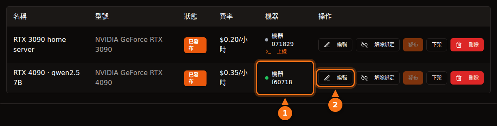

只要選平台時清楚自己在做什麼，出租 GPU 算是相當安全，但「安全」在不同平台上意思不一樣。在 Vast.ai 這類容器平台上，租用者在您的機器上執行自己的程式碼，流量從您的 IP 位址送出；隔離機制能讓他們碰不到您的檔案，卻擋不住他們使用您的網路和電費。在 GPUFlow 這種只提供 API 的設計中，租用者只能對您安裝的模型送出聊天請求，風險反過來了：提示詞在您的機器上是可讀的，所以租用者不應該送出任何機密內容。

本文兩個方向都會談。第三方平台的說法都在 2026 年 9 月依各平台自己的文件查核過，GPUFlow 的所有內容則來自它的原始碼和文件。來源列在文末。

## 在容器平台上，租用者能做什麼

大多數 GPU 市集出租的是容器。租用者選一個映像檔，拿到 shell，想執行什麼就執行什麼。身為主機方，您要考慮五件事。

- **任意程式碼。** 租用者的程式碼在容器或虛擬機器中，跑在您的核心上。隔離做得不錯，但不完美；容器逃逸很少見，而它正是那種會在核心和驅動程式更新中修補的漏洞，所以這些更新您必須安裝。
- **您的 IP 位址。** 容器對外的流量會經過您的網路連線。如果租用者爬取網站、寄送垃圾郵件或掃描網路，濫用檢舉會寄到您的網路服務供應商，指向您的 IP。Vast.ai 的條款規定，使用者須就其內容引起的索賠賠償提供者，這在與第三方發生糾紛時有幫助，卻無法阻止您的網路服務供應商寄警告給您。
- **開放的連接埠。** Vast.ai 的主機指南寫道：「大多數工作中，客戶端需要開放的連接埠才能直接連線到機器。」，所以您要在路由器上設定連接埠轉送。
- **硬碟。** 租用者會把映像檔、模型和資料集下載到您的硬碟上。客戶端刪除磁碟區後，Vast.ai 會釋放空間，但在租用期間，這些空間是他們的。
- **電力、熱度與驅動程式。** Vast.ai 告訴主機方：「預期 GPU 在租用期間會以接近最大負載運作。」這代表好幾個小時的滿載功耗、房間變熱、風扇持續運轉。容器平台也需要特定的設定：Vast.ai 的指南列出了安裝 Ubuntu、分割硬碟、安裝 NVIDIA 驅動程式和開放路由器連接埠等步驟。

## Vast.ai、Salad 和 RunPod 如何隔離租用者

| | Vast.ai | Salad | RunPod Community Cloud |
| --- | --- | --- | --- |
| **租用者拿到** | 可用 SSH 或 Jupyter 連線的容器（或虛擬機器） | 自己部署的容器；可透過 SSH 和網頁終端機進入 | 一個 pod（容器） |
| **隔離方式** | 非特權 Docker 容器 | Hypervisor 上的 Linux 虛擬機器，內含容器 | 「各自獨立的容器，嚴格隔離」 |
| **對內連接埠** | 大多數工作需要 | 預設封鎖 | 未說明 |
| **接受新主機** | 是，使用 Ubuntu | 是，使用 Windows 10/11 | 已不再接受 |

- **Vast.ai** 表示「客戶端被隔離在非特權 Docker 容器中，只能存取自己的資料」，並使用獨立的 namespace 和 cgroup，以及網路、檔案系統和行程隔離。它也提醒租用者「提供者的安全性差異很大」，並建議把敏感工作放到由認證資料中心組成的 Secure Cloud 方案。
- **Salad** 表示「您的工作負載在 Linux 虛擬機器上的 OCI 相容容器中執行，與 Windows 和主機上的所有其他行程隔離」，而且預設封鎖對內連線。它也保護租用者不受主機方影響：如果主機方「試圖存取 Linux 環境，我們會自動銷毀該環境，並將機器列入黑名單」。另外，Salad 提供可選擇加入的頻寬分享工作，會透過您的連線「處理付費串流平台的影片內容」；它的支援頁面提醒，這會增加您的資料用量，並可能造成「在這些串流平台上罕見、暫時性（通常為 1-2 天）的內容限制」。
- **RunPod** 表示「Runpod 已不再接受 Community Cloud 的新主機」。對現有的容量，「每個 Pod/worker 都在自己的容器中運作」，而它的條款「禁止主機方檢視您的 Pod/worker 資料」。

三個平台都會把租用者和您的系統隔開。但沒有一個能阻止租用者看似正常的流量從您的連線送出，它們也沒有這樣宣稱。

## GPUFlow 的設計有何不同

GPUFlow 出租的是一個透過相容 OpenAI 的 API 提供服務的 AI 模型，而不是一台機器。這改變了租用者能碰到的範圍。以下是程式碼實際做的事。

**代理程式。** 安裝程式會把一個 Go 執行檔放在 `/usr/local/bin/gpuflow-agent`，並以 systemd 服務執行。沒有使用 Docker。服務設定使用 `DynamicUser=yes`（臨時的非特權使用者）、`NoNewPrivileges=yes`（無法取得更多權限）、`ProtectSystem=strict`（系統對它而言是唯讀的）、`ProtectHome=yes`（看不到家目錄）和 `PrivateTmp=yes`。推論引擎預設是 Ollama，由 Ollama 自己的安裝程式安裝成獨立的服務（提供者也可以讓代理程式改接自己的相容 OpenAI 伺服器）。這些強化設定套用在代理程式上，不套用在 Ollama 上。

**網路。** 代理程式只建立對外連線：一條經過 TLS 連到 `wss://ws.gpuflow.app` 的 WebSocket，以及連到 `gpuflow.app` 的 HTTPS，用來註冊機器，並每 15 秒送出一次心跳訊號。它不開放任何連接埠，您不需要在路由器上轉送任何東西，租用者也永遠不會知道您的 IP 位址。它透過 `127.0.0.1:11434` 和 Ollama 溝通，這是 Ollama 預設的本機回送位址。

**租用者能呼叫什麼。** 租用者會拿到一組用於 `https://gpuflow.app/v1` 的 API 金鑰。`GET /v1/models` 由 GPUFlow 自己回應，唯一會轉送到您機器的請求是 `POST /v1/chat/completions`。代理程式自己還有第二道鎖：它只代理四個確切的路徑（`/v1/chat/completions`、`/v1/completions`、`/v1/embeddings` 和 `/v1/models`），其他一律拒絕，包括 Ollama 原生那些可以下載、刪除或建立模型的 `/api/*` 端點。代理程式只處理一種訊息類型，也就是推論請求；其他訊息都會被忽略。

所以租用者沒有 shell、沒有 SSH、碰不到檔案，也無法透過網路存取您的機器。他們不能把 70 GB 的模型下載到您的硬碟，也不能用您的連線上網。他們能做的，是在預訂的時數內讓您的 GPU 保持忙碌，並在 `model` 欄位中指定您安裝的任何模型。

<figure>
<svg viewBox="0 0 720 380" role="img" aria-labelledby="d1-title" xmlns="http://www.w3.org/2000/svg" font-family="system-ui, sans-serif" font-size="15">
<title id="d1-title">租用者在容器主機上能做的事，與在 GPUFlow 這種只提供 API 的設計上能做的事比較</title>
<rect x="0" y="0" width="720" height="380" fill="#ffffff"/>
<text x="20" y="40" fill="#64748b" font-weight="bold">租用者能做什麼</text>
<text x="470" y="40" text-anchor="middle" fill="#1e1b4b" font-weight="bold">容器主機</text>
<text x="630" y="40" text-anchor="middle" fill="#1e1b4b" font-weight="bold">GPUFlow（API）</text>
<line x1="20" y1="55" x2="700" y2="55" stroke="#e2e8f0" stroke-width="2"/>
<text x="20" y="89" fill="#1e1b4b">執行自己的程式</text>
<rect x="430" y="70" width="80" height="28" rx="14" fill="#fff7ed" stroke="#f97316" stroke-width="2"/>
<text x="470" y="89" text-anchor="middle" fill="#1e1b4b">可以</text>
<rect x="590" y="70" width="80" height="28" rx="14" fill="#f0fdf4" stroke="#16a34a" stroke-width="2"/>
<text x="630" y="89" text-anchor="middle" fill="#1e1b4b">不行</text>
<line x1="20" y1="110" x2="700" y2="110" stroke="#e2e8f0" stroke-width="1"/>
<text x="20" y="133" fill="#1e1b4b">開啟 shell 或 SSH</text>
<rect x="430" y="114" width="80" height="28" rx="14" fill="#fff7ed" stroke="#f97316" stroke-width="2"/>
<text x="470" y="133" text-anchor="middle" fill="#1e1b4b">可以</text>
<rect x="590" y="114" width="80" height="28" rx="14" fill="#f0fdf4" stroke="#16a34a" stroke-width="2"/>
<text x="630" y="133" text-anchor="middle" fill="#1e1b4b">不行</text>
<line x1="20" y1="154" x2="700" y2="154" stroke="#e2e8f0" stroke-width="1"/>
<text x="20" y="177" fill="#1e1b4b">把檔案寫入您的硬碟</text>
<rect x="430" y="158" width="80" height="28" rx="14" fill="#fff7ed" stroke="#f97316" stroke-width="2"/>
<text x="470" y="177" text-anchor="middle" fill="#1e1b4b">可以</text>
<rect x="590" y="158" width="80" height="28" rx="14" fill="#f0fdf4" stroke="#16a34a" stroke-width="2"/>
<text x="630" y="177" text-anchor="middle" fill="#1e1b4b">不行</text>
<line x1="20" y1="198" x2="700" y2="198" stroke="#e2e8f0" stroke-width="1"/>
<text x="20" y="221" fill="#1e1b4b">從您的 IP 送出流量</text>
<rect x="430" y="202" width="80" height="28" rx="14" fill="#fff7ed" stroke="#f97316" stroke-width="2"/>
<text x="470" y="221" text-anchor="middle" fill="#1e1b4b">可以</text>
<rect x="590" y="202" width="80" height="28" rx="14" fill="#f0fdf4" stroke="#16a34a" stroke-width="2"/>
<text x="630" y="221" text-anchor="middle" fill="#1e1b4b">不行</text>
<line x1="20" y1="242" x2="700" y2="242" stroke="#e2e8f0" stroke-width="1"/>
<text x="20" y="265" fill="#1e1b4b">需要在路由器上開放連接埠</text>
<rect x="430" y="246" width="80" height="28" rx="14" fill="#fff7ed" stroke="#f97316" stroke-width="2"/>
<text x="470" y="265" text-anchor="middle" fill="#1e1b4b">經常</text>
<rect x="590" y="246" width="80" height="28" rx="14" fill="#f0fdf4" stroke="#16a34a" stroke-width="2"/>
<text x="630" y="265" text-anchor="middle" fill="#1e1b4b">不需要</text>
<line x1="20" y1="286" x2="700" y2="286" stroke="#e2e8f0" stroke-width="1"/>
<text x="20" y="309" fill="#1e1b4b">下載或刪除模型</text>
<rect x="430" y="290" width="80" height="28" rx="14" fill="#fff7ed" stroke="#f97316" stroke-width="2"/>
<text x="470" y="309" text-anchor="middle" fill="#1e1b4b">可以</text>
<rect x="590" y="290" width="80" height="28" rx="14" fill="#f0fdf4" stroke="#16a34a" stroke-width="2"/>
<text x="630" y="309" text-anchor="middle" fill="#1e1b4b">不行</text>
<line x1="20" y1="330" x2="700" y2="330" stroke="#e2e8f0" stroke-width="1"/>
<text x="20" y="353" fill="#1e1b4b">讓您的 GPU 連續忙碌好幾小時</text>
<rect x="430" y="334" width="80" height="28" rx="14" fill="#eef2ff" stroke="#6366f1" stroke-width="2"/>
<text x="470" y="353" text-anchor="middle" fill="#1e1b4b">可以</text>
<rect x="590" y="334" width="80" height="28" rx="14" fill="#eef2ff" stroke="#6366f1" stroke-width="2"/>
<text x="630" y="353" text-anchor="middle" fill="#1e1b4b">可以</text>
</svg>
<figcaption>「容器主機」一欄描述的是 Vast.ai 式的主機服務：檔案和流量都留在租用者的容器內，但仍然使用您的硬碟和網路連線。細節因平台而異：Salad 在 Linux 虛擬機器中執行容器，並預設封鎖對內連線。在 GPUFlow 上，租用者只能對您安裝的模型送出聊天請求。</figcaption>
</figure>

## 資料路徑，逐段拆解

這一節是寫給租用者看的。一個聊天請求會經過四個軟體元件，而文字在其中不只一處是可讀的。

<figure>
<svg viewBox="0 0 720 330" role="img" aria-labelledby="d2-title" xmlns="http://www.w3.org/2000/svg" font-family="system-ui, sans-serif" font-size="15">
<title id="d2-title">GPUFlow 的聊天請求從租用者的應用程式出發，經過 gpuflow.app、中繼伺服器、提供者電腦上的代理程式，到達 Ollama，回答再沿原路串流回來</title>
<rect x="0" y="0" width="720" height="330" fill="#ffffff"/>
<rect x="480" y="50" width="230" height="200" rx="12" fill="#fff7ed" stroke="#f97316" stroke-width="2" stroke-dasharray="6 4"/>
<text x="595" y="76" text-anchor="middle" fill="#1e1b4b" font-weight="bold">提供者的電腦</text>
<rect x="10" y="110" width="110" height="70" rx="10" fill="#eef2ff" stroke="#6366f1" stroke-width="2"/>
<text x="65" y="141" text-anchor="middle" fill="#1e1b4b">租用者的</text>
<text x="65" y="161" text-anchor="middle" fill="#1e1b4b">應用程式</text>
<rect x="160" y="110" width="120" height="70" rx="10" fill="#eef2ff" stroke="#6366f1" stroke-width="2"/>
<text x="220" y="141" text-anchor="middle" fill="#1e1b4b">GPUFlow API</text>
<text x="220" y="161" text-anchor="middle" fill="#64748b" font-size="12">gpuflow.app/v1</text>
<rect x="320" y="110" width="105" height="70" rx="10" fill="#eef2ff" stroke="#6366f1" stroke-width="2"/>
<text x="372" y="141" text-anchor="middle" fill="#1e1b4b">中繼伺服器</text>
<text x="372" y="161" text-anchor="middle" fill="#64748b" font-size="12">ws.gpuflow.app</text>
<rect x="492" y="110" width="90" height="70" rx="10" fill="#ffffff" stroke="#6366f1" stroke-width="2"/>
<text x="537" y="141" text-anchor="middle" fill="#1e1b4b">GPUFlow</text>
<text x="537" y="161" text-anchor="middle" fill="#1e1b4b">代理程式</text>
<rect x="610" y="110" width="90" height="70" rx="10" fill="#ffffff" stroke="#6366f1" stroke-width="2"/>
<text x="655" y="141" text-anchor="middle" fill="#1e1b4b">Ollama</text>
<text x="655" y="161" text-anchor="middle" fill="#64748b" font-size="12">127.0.0.1</text>
<line x1="124" y1="145" x2="156" y2="145" stroke="#16a34a" stroke-width="4"/>
<line x1="284" y1="145" x2="316" y2="145" stroke="#64748b" stroke-width="4"/>
<line x1="429" y1="145" x2="488" y2="145" stroke="#16a34a" stroke-width="4"/>
<line x1="586" y1="145" x2="606" y2="145" stroke="#f97316" stroke-width="4"/>
<text x="140" y="102" text-anchor="middle" fill="#16a34a" font-size="13">TLS</text>
<text x="300" y="102" text-anchor="middle" fill="#64748b" font-size="13">內部</text>
<text x="452" y="102" text-anchor="middle" fill="#16a34a" font-size="13">TLS</text>
<text x="596" y="102" text-anchor="middle" fill="#f97316" font-size="13">明文</text>
<text x="65" y="212" text-anchor="middle" fill="#64748b" font-size="12">文字在</text>
<text x="65" y="228" text-anchor="middle" fill="#64748b" font-size="12">這裡寫出</text>
<text x="220" y="212" text-anchor="middle" fill="#64748b" font-size="12">讀取文字，</text>
<text x="220" y="228" text-anchor="middle" fill="#64748b" font-size="12">只儲存</text>
<text x="220" y="244" text-anchor="middle" fill="#64748b" font-size="12">token 數量</text>
<text x="372" y="212" text-anchor="middle" fill="#64748b" font-size="12">轉送出去，</text>
<text x="372" y="228" text-anchor="middle" fill="#64748b" font-size="12">不記錄</text>
<text x="372" y="244" text-anchor="middle" fill="#64748b" font-size="12">請求內容</text>
<text x="595" y="212" text-anchor="middle" fill="#1e1b4b" font-size="13" font-weight="bold">記憶體中是明文</text>
<text x="595" y="230" text-anchor="middle" fill="#1e1b4b" font-size="13" font-weight="bold">機器主人有 root 權限</text>
<line x1="20" y1="295" x2="50" y2="295" stroke="#16a34a" stroke-width="4"/>
<text x="58" y="300" fill="#1e1b4b" font-size="13">網際網路上的 TLS</text>
<line x1="235" y1="295" x2="265" y2="295" stroke="#64748b" stroke-width="4"/>
<text x="273" y="300" fill="#1e1b4b" font-size="13">GPUFlow 內部</text>
<line x1="420" y1="295" x2="450" y2="295" stroke="#f97316" stroke-width="4"/>
<text x="458" y="300" fill="#1e1b4b" font-size="13">提供者電腦上的明文</text>
</svg>
<figcaption>請求由左往右傳送，回答再沿原路串流回來。TLS 保護每一段經過網際網路的連線，但它在每台伺服器終止，所以文字在 GPUFlow 的伺服器轉送時是可讀的，在執行模型的 Ollama 所在的提供者電腦上也是。</figcaption>
</figure>

1. **租用者到 gpuflow.app：** HTTPS。網站位於 Cloudflare 後方。
2. **GPUFlow 的 API 到中繼伺服器：** GPUFlow 端的內部連線。API 會檢查金鑰、原封不動地轉送請求內容，並記錄 token 數量。它不儲存請求或回答的文字，隱私權政策中也寫明了這一點。
3. **中繼伺服器到提供者的代理程式：** 由代理程式建立的 TLS WebSocket。中繼伺服器只記錄每則訊息的類型，不記錄內容。
4. **代理程式到 Ollama：** 在提供者電腦內部的本機回送位址上使用一般 HTTP。代理程式同樣不記錄請求內容。

到模型為止並沒有端對端加密，而使用一般的推論引擎也不可能做到：模型必須讀懂提示詞才能回答。

## 提供者看得到什麼

直接說清楚：**提供者的電腦以明文處理您的提示詞和回答。** Ollama 在那裡執行，而提供者擁有這台機器的 root 權限（安裝程式需要它）。提供者如果有意，可以擷取本機回送的流量、更換推論引擎，或讓代理程式改接另一台伺服器。

能擋住這些行為的是契約。GPUFlow 的條款規定，提供者「不得記錄、閱讀、保留或分享租用者的請求或回答，也不得竄改回答」。這是會影響帳號的規定，不是技術上的阻擋。隱私權政策也對租用者說明了同樣的事：租用期間，請求和回答會經過提供者的電腦。

除了提示詞之外，提供者還會看到您的 GPUFlow 使用者名稱，並在租用開始時收到通知（租用編號、上架資訊和時數）。租用者則看不到提供者機器的任何統計數據；GPU 溫度、VRAM、功耗和其他遙測資料只會出現在機器主人的儀表板上。

給租用者的實用原則：**不要透過任何社群 GPU 傳送機密、登入憑證、他人的個人資料，或受法規管制的資料（健康、財務、客戶機密）。** 這適用於 GPUFlow，也同樣適用於別人家用電腦上的容器，因為主機方能以同樣的 root 權限檢視記憶體和硬碟。敏感工作請在您自己掌控的硬體上執行模型，或使用願意簽署您的法規遵循所需協議的服務商。[企業 AI 政策為何禁用公開 AI 工具](/zh_tw/why-corporate-policies-banning-chatgpt/)談的是政策面，[如何在公共 GPU 節點上保護資料集](/zh_tw/how-to-secure-dataset-on-public-gpu-node/)談的則是容器面。

## GPUFlow 上仍然存在的風險

只提供 API 能縮小攻擊面，但無法讓它消失。與其假裝沒有風險，我寧可把剩下的列出來。

- **Ollama 要解析不受信任的輸入。** 每個租用者請求最後都會變成交給 Ollama 的 JSON。Ollama 的漏洞是最可能的入侵途徑，所以請保持更新。代理程式的允許清單讓租用者碰不到 Ollama 的模型管理端點，但無法修補聊天路徑上的漏洞。
- **安裝程式以 root 執行。** 您把來自 gpuflow.app 的腳本導入 `sudo bash`，它還會執行 Ollama 的安裝腳本。請先讀過這兩個腳本；任何主機軟體都該這樣做。
- **沒有自動更新。** 代理程式不會自行更新。要取得新版本，請重新執行安裝程式；如果有發布 SHA256SUMS 檔案，安裝程式會用它核對執行檔。
- **負載。** 沒有請求數量上限。租用者可以在預訂的每一個小時裡讓您的 GPU 滿載，也可以使用您安裝的任何模型，包括最大的那個。
- **熱度與電力。** 和其他平台一樣：被租用的時間就是滿載的時間。

## 給提供者的檢查清單

1. **用一台借出去也無妨的機器。** 最好是專用機。至少不要在出租的電腦上存放工作檔案或密碼庫，無論用哪個平台都一樣。在 GPUFlow 上，代理程式本身已經以臨時系統使用者身分執行，看不到家目錄，但 Ollama 是另一個獨立的服務。
2. **限制功耗。** `sudo nvidia-smi -pl 280` 會以瓦特為單位設定顯示卡的功耗上限（需要 root 權限，而且數值必須介於顯示卡的最小和最大上限之間）。Puget Systems 的報告指出，RTX 3090 限制在 270–280 W 時仍保有約 95% 的效能，並示範如何用 systemd unit 在每次開機時重新套用這個限制。
3. **先算好電費。** 在 GPU 忙碌時查看 **我的機器** 上的功耗，再把千瓦數乘以每度電的價格。[出租遊戲顯示卡能賺多少](/zh_tw/how-much-can-you-earn-renting-out-your-gpu/)針對常見顯示卡和五個國家算過一遍。
4. **注意溫度。** 即時數據會顯示 GPU、熱點和記憶體溫度，以及風扇轉速。請確保機殼通風良好。
5. **保持系統更新。** 安裝 Linux、GPU 驅動程式和 Ollama 的更新。GPUFlow 的安裝程式不管理您的 GPU 驅動程式；重新開機後，systemd 會重新啟動代理程式。
6. **知道怎麼暫停。** 在 **我的 GPU** 將上架資訊下架，或執行 `sudo systemctl stop gpuflow-agent`（用 `start` 即可恢復）。租用進行中時，儀表板無法修改上架資訊或機器，您也無法從儀表板結束租用者的租用。在租用期間停止代理程式，租用會在 10 分鐘後結束，您只會收到到最後一次心跳訊號為止的款項。
7. **知道怎麼解除安裝。** 步驟寫在[疑難排解文件](https://docs.gpuflow.app/zh-tw/providers/troubleshooting/)中。Ollama 會一直保留，直到您自己移除它。

使用容器平台的話，還要多加兩項：想清楚您是否真的要在路由器上開放連接埠，並問問您的網路服務供應商會怎麼處理濫用檢舉，因為租用者的流量會帶著您的 IP 位址。

## 給租用者的檢查清單

1. **把每一張社群 GPU 都當成陌生人的電腦。** 提示詞中不要放 API 金鑰、密碼、客戶資料、醫療或財務資料。
2. **刪掉用不到的資訊。** 送出前，把姓名和帳號換成預留位置文字。
3. **保管好您的金鑰。** 在 GPUFlow 上，租用結束後金鑰就會失效。如果金鑰外洩，**新金鑰** 會立即撤銷舊金鑰，**立即結束** 則會停止計費並退回未使用的時間。
4. **假設回答可能有錯或被竄改。** 條款禁止提供者竄改回答，但重要的內容請自行查核。
5. **敏感工作用對的工具。** 自行架設，或使用能提供您所需合約的服務商。其他情況請參考[如何在您的應用程式中使用金鑰](/zh_tw/use-openai-compatible-api-key-in-apps/)。

## 資料來源

皆於 2026 年 9 月查核。

- GPUFlow：[租用者能碰到什麼](https://docs.gpuflow.app/zh-tw/providers/security/)、[提供者入門](https://docs.gpuflow.app/zh-tw/providers/getting-started/)、[定價與電費](https://docs.gpuflow.app/zh-tw/providers/pricing/)、[疑難排解與解除安裝](https://docs.gpuflow.app/zh-tw/providers/troubleshooting/)、[API 快速入門](https://docs.gpuflow.app/zh-tw/renters/api-quickstart/)
- Vast.ai：[主機概覽](https://docs.vast.ai/host/hosting-overview.md)、[安全性常見問題](https://docs.vast.ai/documentation/reference/faq/security)、[Linux 虛擬機器](https://docs.vast.ai/linux-virtual-machines)、[服務條款](https://vast.ai/terms)、[執行私有 AI 模型](https://vast.ai/article/running-private-ai-models-without-the-risk-of-data-exposure)
- Salad：[安全性](https://salad.com/security)、[容器工作負載與您的電腦](https://community.salad.com/container-workloads-and-your-pc/)、[頻寬分享](https://support.salad.com/faq/jobs/what-is-bandwidth-sharing/)、[SSH 與終端機](https://docs.salad.com/container-engine/explanation/container-groups/ssh-and-terminal.md)、[下載與系統需求](https://salad.com/download/)
- RunPod：[選擇 pod](https://docs.runpod.io/pods/choose-a-pod)、[資料安全與法規遵循](https://docs.runpod.io/hosting/partner-requirements)
- Ollama：[FAQ（預設綁定位址）](https://docs.ollama.com/faq)
- NVIDIA：[nvidia-smi 手冊](https://docs.nvidia.com/deploy/nvidia-smi/index.html)
- Puget Systems：[用 systemd 和 nvidia-smi 限制 RTX 3090 功耗](https://www.pugetsystems.com/labs/hpc/quad-rtx3090-gpu-power-limiting-with-systemd-and-nvidia-smi-1983/)
