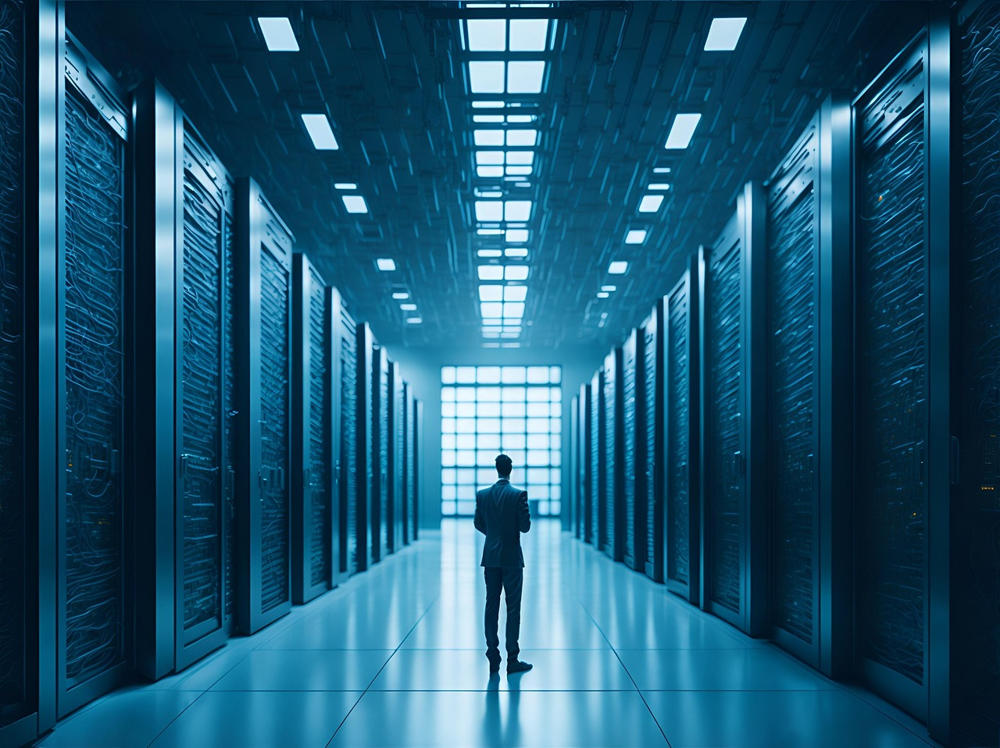
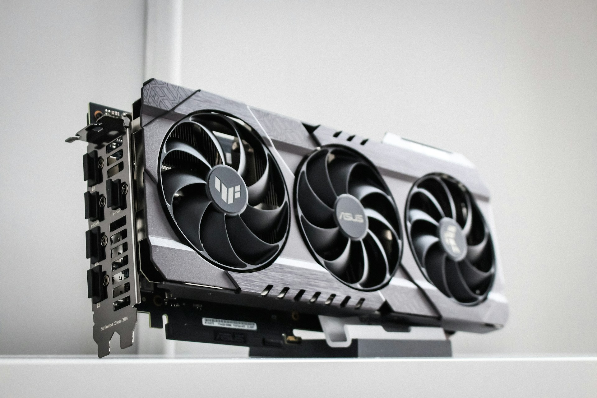
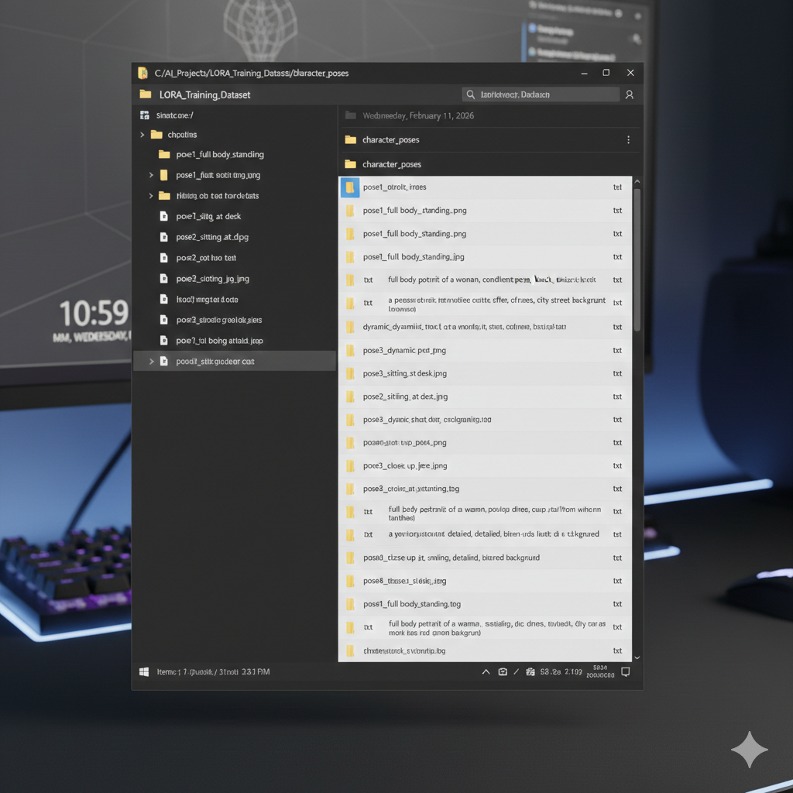
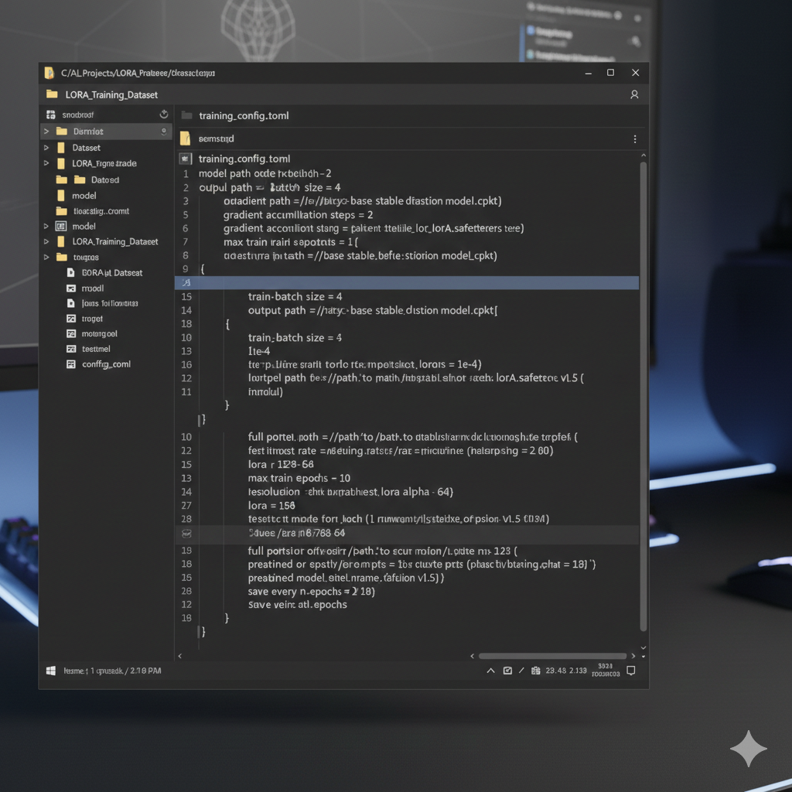
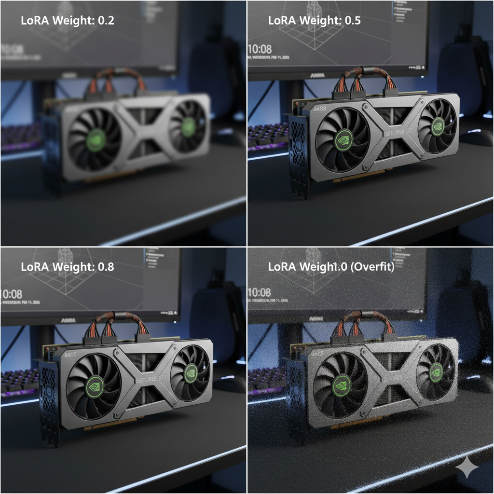

為 Stable Diffusion 訓練自訂 LoRA 模型，已經成為製作個人化 AI 圖像最容易上手的方式之一。無論你想重現特定的藝術風格、產生外觀一致的角色臉孔，還是用產品照片微調模型，LoRA 訓練都能做到，而且不必負擔完整微調模型的運算成本。

一般人常以為，這件事不是需要昂貴的本機硬體，就是需要可觀的雲端運算預算。其實兩者都不必。以目前的 GPU 租用價格，搭配有效率的訓練設定，你可以用不到十美元訓練出可實際使用的 LoRA 模型，而且往往花得更少。

這份指南會帶你走完整個流程：挑選合適的硬體、準備訓練資料集、設定訓練參數、執行訓練，以及驗證結果。每個階段的成本我都會講清楚，因為「平價 AI 訓練」這種模糊的承諾，對要實際編列專案預算的人毫無幫助。

**開始之前你需要準備**：

- 二十到一百張訓練圖片（挑選標準見下文）
- 對命令列介面有基本的認識
- 一張可以在 GPU 租用平台儲值的付款卡
- 大約兩到四小時的專注時間
- 第一次訓練準備五到十五美元的預算



---

## 目錄

- [認識 LoRA 及其重要性](#認識-lora-及其重要性)
- [選擇適合訓練的 GPU](#選擇適合訓練的-gpu)
- [GPU 租用平台比較](#gpu-租用平台比較)
- [準備訓練資料集](#準備訓練資料集)
- [建置訓練環境](#建置訓練環境)
- [設定訓練參數](#設定訓練參數)
- [執行訓練](#執行訓練)
- [驗證與測試你的 LoRA](#驗證與測試你的-lora)
- [成本最佳化策略](#成本最佳化策略)
- [常見問題與解決方法](#常見問題與解決方法)
- [常見問答](#常見問答)

---

## 認識 LoRA 及其重要性

LoRA 是 Low-Rank Adaptation（低秩適應）的縮寫，是一種微調大型神經網路的技術：它只訓練少量額外參數，而不修改整個模型。原始的 Stable Diffusion 模型有將近十億個參數，完整微調就得修改全部參數，需要大量 GPU 記憶體和很長的訓練時間。

LoRA 繞過了這個問題：它凍結原始模型的權重，只訓練一些小型的 adapter 矩陣，用來改變模型處理資訊的方式。一個典型的 LoRA 檔案大約十到兩百 MB，而完整的 Stable Diffusion 檢查點則有兩到六 GB。

這在實務上的影響相當大：

**記憶體效率**。LoRA 訓練需要的 GPU VRAM 遠少於完整微調。一張 24GB 的 GPU 就能輕鬆為 SDXL 模型訓練 LoRA，若要完整微調則需要 40GB 以上。

**訓練速度**。要訓練的參數比較少，每個 epoch 也就完成得比較快。完整微調可能要十二小時的工作，用 LoRA 常常九十分鐘就能搞定。

**可組合性**。多個 LoRA 可以在推論時組合使用。你可以用一個 LoRA 控制藝術風格、另一個維持角色一致性，再以不同強度混合，完全不必重新訓練。

**儲存與分享**。檔案小，LoRA 分享和管理起來都很方便。手邊放幾十個專用的 LoRA 也不用擔心儲存空間。

正是這些效率帶來的成本下降，讓十美元以內的訓練成為可能。你只需要租用昂貴的硬體一到三小時，而不是八到二十四小時。

---

## 選擇適合訓練的 GPU

選 GPU 要在三個因素之間取得平衡：VRAM 容量、訓練速度和租金。能用的最低選項和最佳選擇差別很大。

### VRAM 需求

訓練 Stable Diffusion 1.5 的 LoRA，12GB VRAM 是實務上的最低門檻。降低 batch size 和解析度的話，8GB 也跑得動，但訓練品質往往會打折扣。

訓練 SDXL 的 LoRA，最低需要 16GB，強烈建議 24GB。SDXL 模型更大、需求也更高。VRAM 不足時硬跑 SDXL 訓練，會不斷發生記憶體置換，大幅拖慢速度，也常常導致訓練失敗。

### 速度與成本的取捨

越貴的 GPU 訓練越快，但每小時多付的錢，不一定能等比例降低整個專案的成本。以訓練一個典型的 SD 1.5 LoRA 為例：

| GPU         | VRAM | 大約訓練時間 | 一般時薪 | 預估總成本 |
| ----------- | ---- | ------------ | -------- | ---------- |
| RTX 3090    | 24GB | 2.5 小時     | $0.50    | $1.25      |
| RTX 4090    | 24GB | 1.5 小時     | $0.70    | $1.05      |
| RTX A6000   | 48GB | 1.5 小時     | $0.80    | $1.20      |
| A100 (40GB) | 40GB | 1.0 小時     | $1.50    | $1.50      |

RTX 4090 通常是最划算的選擇。它的訓練速度幾乎跟資料中心級 GPU 一樣快，時薪卻低得多。4090 不好租的時候，RTX 3090 仍然可行，總成本只高一點點。

訓練 SDXL LoRA 時，計算方式會稍微不同，因為較大的模型更能受惠於額外的 VRAM 和記憶體頻寬。對於在消費級硬體上可能要跑四小時以上的複雜 SDXL 專案，A100 會變得更有競爭力。

如果想看各大服務商（包括企業雲端和市集平台）GPU 租用價格的完整分析，請參考我們的 [2026 GPU 租用價格完整比較](/zh_tw/gpu-rental-pricing-comparison-2026/)。



---

## GPU 租用平台比較

針對 LoRA 訓練，有兩家服務商值得考慮。各有不同的特點，適合哪一家取決於你的技術熟悉程度和對成本的敏感度。

### Vast.ai

Vast.ai 經營一個點對點市集，由個人 GPU 擁有者上架硬體出租。這種模式造就了市場上最低的價格，RTX 4090 常常只要每小時 $0.35 到 $0.60。

代價是品質不一。視個別主機而定，可靠度從 97% 到 99.9% 不等，可租用的數量也會隨需求起伏。你可能要多試幾個主機，才能找到網路速度足以上傳資料集的那一台。

對於能自行評估主機指標的有經驗使用者，Vast.ai 能把訓練成本壓到最低。第一次設定和評估主機，請多預留三十分鐘。

### RunPod

RunPod 的定位介於純市集和企業雲端服務商之間。平台同時提供社群來源的 GPU，以及效能更穩定的專屬「Secure Cloud」執行個體。

價格略高於 Vast.ai，Secure Cloud 方案的 RTX 4090 一般是每小時 $0.59。相對地，平台設定更簡單，提供常見 AI 工作負載的預先設定範本，可用性也更好預測。

如果你是 GPU 租用新手，或比起把成本壓到最低，更重視介面直覺好用，RunPod 是合理的折衷選擇。

### 關於 GPUFlow

GPUFlow 不適合用來訓練 LoRA。它透過相容 OpenAI 的 API 提供 AI 對話模型的存取，而不是一台讓你執行訓練腳本的機器。要做訓練，請使用會把整台機器交給你的平台，例如上面這兩家。兩種做法的差別，請參考 [GPUFlow vs Vast.ai vs RunPod vs SaladCloud](/zh_tw/gpuflow-vs-vast-ai-vs-runpod/)。

### 平台比較總覽

| 平台    | RTX 4090 價格範圍           | 設定時間   | 付款方式             | 最適合         |
| ------- | --------------------------- | ---------- | -------------------- | -------------- |
| Vast.ai | $0.35-0.60/小時             | 5-15 分鐘  | 信用卡、加密貨幣     | 省下最多成本   |
| RunPod  | $0.59/小時（Secure Cloud）  | 2-5 分鐘   | 信用卡、加密貨幣     | 容易上手       |

以上為 2026 年 2 月的價格。2026 年 9 月，我們在 Vast.ai 上看到的 RTX 4090 每小時約 $0.37 起，RunPod Secure Cloud 則為 $0.74；請參考[我們最新的比較](/zh_tw/gpuflow-vs-vast-ai-vs-runpod/)。

---

## 準備訓練資料集

資料集的品質比任何其他因素都更能決定訓練結果。精心挑選的三十張圖片，效果會比隨便湊出來的兩百張更好。

### 圖片挑選標準

**一致性**。所有圖片都應該呈現你想讓模型學習的概念。如果要訓練特定人物的臉，每張圖片都應該清楚拍到那張臉。如果要訓練某種藝術風格，每張圖片都應該是那種風格的代表作。

**一致中求變化**。在維持概念一致的同時，讓技術面有所變化：納入不同的角度、光線條件、背景和情境。這些變化能教模型學會類推，而不是對特定構圖過度擬合。

**技術品質**。使用清晰、曝光正確的圖片。動態模糊、雜訊、壓縮失真和光線不佳，都會變成模型學到的一部分。如果訓練圖片顆粒很粗，產生出來的圖片也會偏向有顆粒感。

**解析度**。SD 1.5 的訓練圖片至少要 512x512 像素，SDXL 至少要 1024x1024。來源圖片解析度越高，訓練流程裁切和縮放時就越不會損失品質。

### 資料集大小建議

最理想的資料集大小取決於概念的複雜度：

**簡單概念（單一臉孔、基本風格）**：20-40 張圖片
**中等概念（有多套服裝的角色、細膩的風格）**：40-80 張圖片
**複雜概念（細節豐富的場景、變化很大的風格）**：80-150 張圖片

圖片越多，需要的訓練步數就越多，時間和成本也跟著增加。前幾次嘗試請從這些範圍的下限開始。

### 為圖片加上標註

每張訓練圖片都需要一段描述內容的文字標註（caption）。這些標註會教模型把哪些文字概念和視覺模式連結起來。

有效的標註要具體且一致：

**不佳的標註**：「a woman」
**較好的標註**：「a photograph of Sarah Miller, a woman with short brown hair and green eyes, wearing a blue sweater」

**不佳的標註**：「fantasy art」
**較好的標註**：「a digital painting in the style of luminescent fantasy, featuring glowing mushrooms in a dark forest, detailed linework, vibrant purple and blue color palette」

推論時要用的觸發詞或片語，應該出現在每一段標註裡。如果你想用「in the style of luminescent fantasy」來呼叫你的 LoRA，這個片語就應該原封不動地出現在每一段訓練標註中。

資料集不大的話，可以手動標註。圖片比較多時，可以用 BLIP 或 WD14 Tagger 之類的工具先產生初步標註，再由你檢查修改。



### 目錄結構

依照訓練腳本預期的特定結構整理訓練資料：

```
training_data/
├── 10_concept_name/
│   ├── image001.jpg
│   ├── image001.txt
│   ├── image002.jpg
│   ├── image002.txt
│   └── ...
```

資料夾名稱的前綴（這個例子中的「10」）代表該資料夾中每張圖片在訓練時要重複幾次。數字越大，這些圖片在訓練中的權重就越高。

數字後面以底線分隔的名稱，在你不使用自訂標註時，會成為預設的觸發詞。

---

## 建置訓練環境

資料集準備好、GPU 也租到之後，下一步是設定訓練環境。LoRA 訓練的標準工具是 kohya_ss/sd-scripts，這是一套由社群維護的開源訓練腳本。

### 初始環境設定

連上租用的 GPU 執行個體後，你需要 clone 訓練用的儲存庫並安裝相依套件。以下指令會建立基本環境：

```bash
# Clone the training scripts repository
git clone https://github.com/kohya-ss/sd-scripts.git
cd sd-scripts

# Create and activate a virtual environment
python -m venv venv
source venv/bin/activate

# Install dependencies
pip install torch torchvision --index-url https://download.pytorch.org/whl/cu121
pip install -r requirements.txt
pip install xformers
```

視網路速度而定，安裝通常要五到十分鐘。xformers 套件不是必要的，但建議安裝，因為它能大幅降低訓練時的記憶體用量。

### 下載基礎模型

LoRA 訓練需要一個 Stable Diffusion 基礎模型作為訓練對象。你必須把它下載到執行個體上：

```bash
# Create a models directory
mkdir -p models/sd

# Download Stable Diffusion 1.5 (approximately 4GB)
wget -O models/sd/v1-5-pruned.safetensors \
  "https://huggingface.co/runwayml/stable-diffusion-v1-5/resolve/main/v1-5-pruned.safetensors"
```

如果要訓練 SDXL，請改用 SDXL 基礎模型，大小約 6.5GB。

### 上傳訓練資料

把準備好的資料集傳到 GPU 執行個體上。大多數服務商都支援 SCP 或 SFTP：

```bash
# From your local machine
scp -r ./training_data user@gpu-instance-ip:~/sd-scripts/
```

如果你的資料集存放在雲端儲存空間，也可以用 wget 或 rclone 直接下載到執行個體上。

### 用範本節省設定時間

RunPod 和 Vast.ai 都提供已經裝好 Stable Diffusion 訓練工具的現成映像檔。比起從一台空白的執行個體開始設定，通常可以省下十五到二十分鐘，而設定時間也是計費時間。如果只是偶爾訓練，這可能占你 GPU 租用總費用相當可觀的比例。

---

## 設定訓練參數

訓練設定會大幅影響輸出品質和訓練時間。以下參數是保守的起點，不必耗費過多運算，就能得到可靠的結果。

### 基本參數

建立一個名為 `training_config.toml` 的設定檔：

```toml
[model]
pretrained_model_name_or_path = "./models/sd/v1-5-pruned.safetensors"
v2 = false
v_parameterization = false

[dataset]
train_data_dir = "./training_data"
resolution = 512
batch_size = 2
enable_bucket = true
min_bucket_reso = 256
max_bucket_reso = 1024

[training]
output_dir = "./output"
output_name = "my_lora"
max_train_epochs = 10
learning_rate = 1e-4
unet_lr = 1e-4
text_encoder_lr = 5e-5
lr_scheduler = "cosine_with_restarts"
lr_warmup_steps = 100
network_dim = 32
network_alpha = 16
optimizer_type = "AdamW8bit"
mixed_precision = "fp16"
save_every_n_epochs = 2
save_model_as = "safetensors"
```

### 參數說明

**resolution**：設成你推論時的目標解析度。SD 1.5 用 512，SDXL 用 1024。

**batch_size**：數值越高訓練越快，但需要更多 VRAM。從 2 開始，記憶體夠的話再提高到 4。

**max_train_epochs**：一個 epoch 代表模型把每張訓練圖片都看過一次。對大多數資料集來說，十個 epoch 是合理的起點。

**learning_rate**：控制模型更新的幅度。上面的數值偏保守。如果效果不明顯，可以試著提高到 2e-4 或 3e-4。

**network_dim 和 network_alpha**：這兩個參數控制 LoRA 的容量。dim 32 搭配 alpha 16，能在品質和檔案大小之間取得平衡。更高的維度（64、128）能捕捉更多細節，但檔案更大，也有過度擬合的風險。

**optimizer_type**：AdamW8bit 能大幅降低記憶體用量，對品質的影響極小。用 24GB 顯示卡訓練 SDXL 時不可或缺。

**mixed_precision**：FP16 訓練需要的記憶體只有 FP32 的一半。對大多數用途來說，品質上的影響可以忽略。

### 依硬體調整

RTX 4090（24GB VRAM）：

- SD 1.5 通常可以安全使用 batch_size = 4
- SDXL 使用 batch_size = 2

RTX 3090（24GB VRAM）：

- SD 1.5 使用 batch_size = 2
- SDXL 使用 batch_size = 1（啟用 gradient checkpointing）

A100（40GB VRAM）：

- SD 1.5 使用 batch_size = 6-8
- SDXL 使用 batch_size = 4

batch size 越大，總訓練時間就等比例縮短。batch size 加倍，需要的最佳化步數大約減半。



---

## 執行訓練

環境和參數都設定好之後，開始訓練：

```bash
accelerate launch --num_cpu_threads_per_process=4 train_network.py \
  --config_file="./training_config.toml" \
  --logging_dir="./logs"
```

### 監控進度

訓練輸出會顯示 loss 值和進度資訊：

```
epoch 1/10, step 50/500, loss=0.0823
epoch 1/10, step 100/500, loss=0.0756
epoch 1/10, step 150/500, loss=0.0691
...
```

**需要留意的地方**：

loss 通常會在前幾個 epoch 下降，然後趨於穩定。一次典型的訓練可能是這樣：

- 第 1 個 epoch：loss 約 0.08-0.10
- 第 5 個 epoch：loss 約 0.05-0.07
- 第 10 個 epoch：loss 約 0.04-0.06

如果 loss 在一開始下降後又回升，模型可能過度擬合了。如果 loss 從頭到尾都沒什麼變化，學習率可能太低。

### 檢查點

這份設定每兩個 epoch 儲存一次檢查點。這些中途存檔有兩個用途：

1. **復原**。如果訓練當掉，或你需要提早終止，可以從最後一個檢查點繼續。

2. **挑選**。不同的 epoch 有時會產生不同的特性。第 6 個 epoch 可能已經很好地抓住你的概念，第 10 個 epoch 卻過度擬合了。有了檢查點，你就能測試後再做選擇。

### 預期訓練時間

以上述設定訓練一個 50 張圖片的 SD 1.5 LoRA：

| GPU      | 大約時間     |
| -------- | ------------ |
| RTX 3090 | 90-120 分鐘  |
| RTX 4090 | 60-90 分鐘   |
| A100     | 45-60 分鐘   |

SDXL 訓練大約需要上述時間的 1.5 到 2 倍。

---

## 驗證與測試你的 LoRA

訓練完成後，輸出目錄中會產生一個 .safetensors 檔案。這個檔案要先經過測試，專案才算真正完成。

### 基本驗證

把 LoRA 檔案複製到你的本機電腦，或執行 Stable Diffusion WebUI 的系統上：

```bash
# Download from GPU instance
scp user@gpu-instance-ip:~/sd-scripts/output/my_lora.safetensors ./
```

在 Automatic1111 WebUI 中，把檔案放到 `models/Lora` 目錄。ComfyUI 則使用 `models/loras` 目錄。

### 測試方法

產生一系列測試圖片，並變換以下因素：

**LoRA 權重**：分別以 0.5、0.7、0.8 和 1.0 的強度測試。有些 LoRA 在低於滿強度時效果最好。

**提示詞位置**：把觸發詞放在提示詞的不同位置。放在開頭、中間或結尾，產生的結果可能有微妙的差異。

**負面提示詞**：分別測試負面提示詞中有沒有你的概念。有時候把觸發詞加進負面提示詞、再搭配低權重，會產生有趣的反轉效果。

**不同的種子值**：每種設定至少使用五個不同的種子，才能區分哪些是穩定的模式、哪些只是隨機的變化。

### 品質評估

依照以下標準評估結果：

**概念準確度**：產生的圖片有沒有反映你訓練的概念？如果你訓練的是臉孔，認得出是那張臉嗎？

**融合度**：LoRA 的概念能不能自然地和提示詞中的其他元素融合？你能不能把訓練好的角色放進各種不同的場景？

**瑕疵**：留意是否有反覆出現的圖樣、不自然的元素，或一再出現的變形。這些都代表訓練有問題或過度擬合。

**靈活度**：測試極端情況。如果你訓練的是角色，能不能畫出不同年齡的樣子？穿不同的衣服？做各種動作？

如果結果不理想，常見的補救方法包括：

- 增加訓練的 epoch 數（擬合不足時）
- 減少訓練的 epoch 數（過度擬合時）
- 調整學習率
- 提升標註品質
- 加入更多樣化的訓練圖片



---

## 成本最佳化策略

一次訓練花五美元還是二十美元，關鍵往往在於工作流程的效率，而不是選哪家服務商。

### 上傳前先準備好資料集

在開始租用 GPU 之前，就在本機電腦上完成所有資料集的篩選、裁切和標註。每小時付 $0.70 來手動檢查和重新命名檔案，是很浪費硬體的做法。

開始租用前的檢查清單：

- 所有圖片都已裁切成合適的長寬比
- 所有標註都已撰寫並檢查過
- 資料集已依正確的資料夾結構整理好
- 訓練設定檔已準備好
- 測試指令已寫好，隨時可以貼上

### 批次訓練

如果需要好幾個 LoRA，就在同一次租用中一起訓練。環境設定和模型下載這些固定成本，可以分攤到每一次訓練上。

舉例來說，訓練三個不同的 LoRA：

- 分三次租用：3 × (20 分鐘設定 + 90 分鐘訓練) = 330 分鐘
- 一次批次處理：20 分鐘設定 + (3 × 90 分鐘訓練) = 290 分鐘

省下的四十分鐘，大約等於降低 15% 的成本。

### 檢查點測試策略

與其一路訓練到第 15 個 epoch 再祈禱結果不錯，不如考慮：

1. 訓練到第 6 個 epoch（約完整訓練時間的 60%）
2. 測試該檢查點
3. 如果結果滿意，就停下來，省下剩餘的 GPU 時間
4. 如果擬合不足，就從檢查點繼續訓練

用這種方式，常常能比預期更早得到好結果，降低總成本。

### 用完立刻終止

GPU 通常會一直計費，直到你明確停止執行個體為止。複製完輸出檔案後，請立刻結束租用。忘記關掉的執行個體以每小時 $0.70 跑一整晚，就會讓你的專案多花十二美元。

### 挑對租用時段

GPU 的供應量和價格會隨需求波動。在離峰時段訓練（例如美國時區的平日早上），通常比週末晚上更容易拿到好價格，也更容易租到 GPU。

---

## 常見問題與解決方法

### CUDA 記憶體不足

**症狀**：訓練當掉，並出現「CUDA out of memory」錯誤。

**解決方法**：

- 調低設定中的 batch_size
- 加上 `gradient_checkpointing = true` 以啟用 gradient checkpointing
- 降低解析度（但會影響輸出品質）
- 改用 VRAM 更大的 GPU

### 訓練 loss 沒有下降

**症狀**：在整個訓練過程中，loss 值一直持平或隨機波動。

**解決方法**：

- 提高學習率（試試 2e-4 或 3e-4）
- 檢查標註是否正確描述圖片
- 確認圖片格式正確且可以讀取
- 確認基礎模型的路徑正確

### LoRA 對生成結果沒有作用

**症狀**：不論啟用或停用 LoRA，產生的圖片都一模一樣。

**解決方法**：

- 確認 LoRA 檔案放在你所用介面的正確目錄中
- 檢查觸發詞是否與訓練標註中使用的一致
- 提高 LoRA 的權重／強度設定
- 改用訓練過程中的其他檢查點

### LoRA 過度擬合、缺乏彈性

**症狀**：LoRA 幾乎原樣重現訓練圖片，但換了不同的提示詞就失效。

**解決方法**：

- 減少訓練的 epoch 數
- 降低 network_dim 的數值
- 讓訓練資料集更多樣化
- 降低學習率

### 訓練速度太慢

**症狀**：訓練進度比預期時間慢很多。

**解決方法**：

- 確認 GPU 真的有在使用（nvidia-smi 應該顯示很高的 GPU 使用率）
- 確認已安裝 xformers
- 檢查 mixed_precision 是否已啟用
- 如果 network_dim 設得非常高，請調低

---

## 常見問答

### 可以用自己的 GPU 訓練 LoRA 模型，不用租嗎？

可以，前提是你有一張至少 12GB VRAM 的 NVIDIA GPU，例如 RTX 3060 或更高階的型號。不過考量電費、硬體耗損，以及消費級硬體明顯更長的訓練時間，如果只是偶爾做專案，租用通常更划算。以每小時 $0.70 訓練兩小時的費用，比大多數家用電腦在較慢的硬體上滿載跑四到六小時所耗的電費還低。

### 一次典型的 LoRA 訓練需要多久？

使用 RTX 4090 或 RTX 3090 時，大多數 LoRA 訓練會在一到三小時內完成。實際時間取決於資料集大小、訓練 epoch 數與 batch size 設定。同樣的訓練，SDXL 模型大約比 SD 1.5 多花 50-100% 的時間。

### LoRA 訓練最少需要幾張圖片？

只要十五到二十張圖片，就能得到還不錯的結果。不過，含有三十到一百張標註良好圖片的資料集，品質通常更好。圖片品質和標註的準確度，比單純的數量更重要。精心挑選的三十張圖片，表現通常勝過匆忙湊出來的一百張。

### 哪個 GPU 租用平台訓練 LoRA 最划算？

Vast.ai 的 RTX 4090 每小時價格通常最低，2026 年 2 月常見的價格是每小時 $0.35 到 $0.50。RunPod 的介面對 GPU 租用新手來說最直覺。想看所有服務商與最新價格的詳細比較，請參考我們的 [GPU 租用價格完整比較](/zh_tw/gpu-rental-pricing-comparison-2026/)。

### 在同一次租用中訓練多個 LoRA 模型比較划算嗎？

是的。在一次較長的租用中批次訓練多個 LoRA，可以省去重複的環境設定時間，並盡量減少 GPU 閒置的費用。在四小時內訓練三到五個 LoRA 模型，花費通常不到分成多次租用、個別訓練的一半。

### 訓練出來的 LoRA 可以商用嗎？

這取決於基礎模型的授權。Stable Diffusion 1.5 採用 CreativeML Open RAIL-M 授權，允許在特定限制下商用。SDXL 的授權同樣寬鬆。你的 LoRA 會沿用基礎模型的限制。訓練圖片也可能有授權要求，請確認你對訓練用的每張圖片都擁有適當的權利。

---

## 結論

訓練自訂 LoRA 模型已經變得非常容易。過去需要大筆硬體投資的運算門檻，現在只剩下幾美元的 GPU 租金。只要把本指南介紹的技巧用在準備充分的資料集上，第一次嘗試通常就能得到可用的結果。

成功的關鍵跟更昂貴的訓練方式並無不同：優質的訓練資料、恰當的參數選擇，以及仔細驗證結果。再強的運算能力，也彌補不了品質差的來源圖片或設定錯誤的訓練。

先從二十到三十張圖片的小型資料集開始，用保守的設定訓練，在擴大到更大的專案之前徹底測試結果。每次嘗試的成本夠低，反覆調整完全可行，不妨把最初幾次訓練當作學習經驗，而不是正式產出。同樣的流程也適用於其他類型的模型。如果你處理的是文字而不是圖片，請參考我們的指南：在同類型的租用 GPU 上[微調大型語言模型](/zh_tw/private-llm-fine-tuning-guide/)。

如果你正在比較各類服務商、各種價位的 GPU 租用選項，我們的 [GPU 租用價格比較](/zh_tw/gpu-rental-pricing-comparison-2026/)提供了消費級 GPU、資料中心硬體與企業雲端方案的最新價格。

---

_本指南最後更新於 2026 年 2 月 12 日。GPU 租用價格和訓練工具的設定經常變動，開始訓練專案之前，請直接向服務商確認最新價格。_
