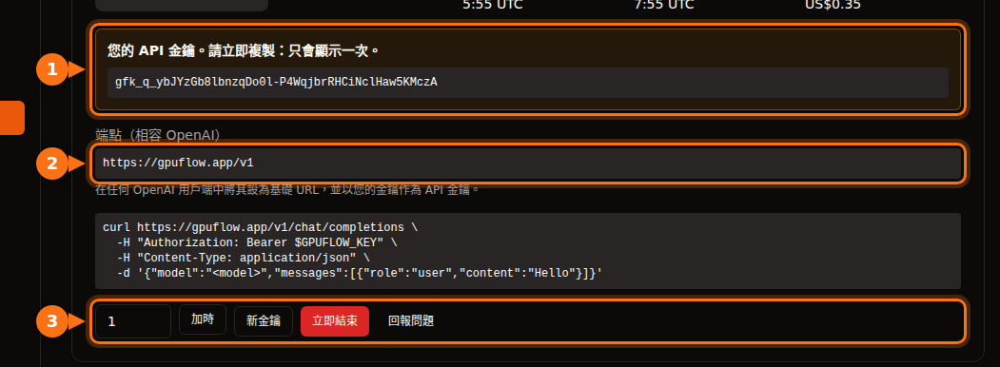

許多 AI 工具都能把 OpenAI 換成其他服務商，只要對方使用相同的 API 即可。您需要的永遠是這三樣東西：

| 項目 | 範例 |
| --- | --- |
| **Base URL**（也稱為 API base、端點或主機） | `https://gpuflow.app/v1` |
| **API 金鑰** | `gfk_...` |
| **模型名稱** | `qwen2.5:7b` |

本文全程以 GPUFlow 的租用為例，但任何相容 OpenAI 的伺服器步驟都一樣：本機的 Ollama 或 llama.cpp、vLLM、OpenRouter 等等。只要換掉這三個值即可。

在 GPUFlow 上，租用 GPU 後，這三個值都可以在 **儀表板 → 目前租用** 找到：



## 開始之前：確認端點和模型名稱

一行指令就能確認金鑰是否有效，以及模型的名稱：

```bash
curl https://gpuflow.app/v1/models \
  -H "Authorization: Bearer gfk_your_key"
```

回應會列出所有模型。把 `id`（例如 `qwen2.5:7b`）原封不動地複製下來。模型名稱錯誤，是應用程式無法運作最常見的原因。

**了解您的端點支援哪些功能**。GPUFlow 的端點提供 `/v1/models` 和 `/v1/chat/completions`，並支援串流。它不提供嵌入、較新的 Responses API 或圖片生成。有些應用程式功能需要這些，我們會在下面特別指出。

## 聊天應用程式

### Open WebUI

1. 打開 **Settings → Admin → Connections**。
2. 在 **Manage OpenAI API Connections** 下方，點擊 **+ (Add Connection)**。
3. 填入：
   - **URL**：`https://gpuflow.app/v1`
   - **API Key**：您的金鑰
4. 點擊 **Verify Connection** 進行測試（只按儲存不會測試），然後點擊 **Save**。

Open WebUI 會自動從 `/models` 讀取模型清單。如果您用 Docker 執行，也可以改設 `OPENAI_API_BASE_URL` 和 `OPENAI_API_KEY`，但這兩個變數只在 Open WebUI 第一次啟動時讀取。之後請在管理畫面中修改。

Open WebUI 的文件上傳和搜尋，預設使用在本機執行的小型嵌入模型，所以仍然可以正常運作。請勿把嵌入引擎切換成 OpenAI，再把聊天端點填作它的 URL。

### LibreChat

在 `librechat.yaml` 中新增一個自訂端點：

```yaml
endpoints:
  custom:
    - name: "GPUFlow"
      apiKey: "${GPUFLOW_API_KEY}"
      baseURL: "https://gpuflow.app/v1"
      models:
        default: ["qwen2.5:7b"]
        fetch: true
      titleConvo: true
      titleModel: "qwen2.5:7b"
      modelDisplayLabel: "GPUFlow"
```

把您的金鑰以 `GPUFLOW_API_KEY=gfk_...` 的形式放進 `.env`。如果每位使用者都要輸入自己的金鑰，請使用 `apiKey: "user_provided"`。設定 `fetch: true` 後，LibreChat 會從端點讀取模型清單。

LibreChat 的文件搜尋（RAG API）預設使用 OpenAI 的嵌入。請維持使用 OpenAI、Ollama 或 Hugging Face，不要把 `RAG_OPENAI_BASEURL` 指向只支援聊天的端點。

### AnythingLLM

1. 打開 LLM 設定，選擇 **Generic OpenAI**。
2. 填入 **Base URL**（`https://gpuflow.app/v1`）、**API Key**、**Chat Model Name**（`qwen2.5:7b`）、**Token context window** 和 **Max Tokens**。

使用 Docker 時，同樣的設定以環境變數表示：

```bash
LLM_PROVIDER='generic-openai'
GENERIC_OPEN_AI_BASE_PATH='https://gpuflow.app/v1'
GENERIC_OPEN_AI_MODEL_PREF='qwen2.5:7b'
GENERIC_OPEN_AI_MODEL_TOKEN_LIMIT=32768
GENERIC_OPEN_AI_API_KEY=gfk_your_key
```

嵌入模型請維持 **AnythingLLM Default**。

### Jan

1. 打開 **Settings → Model Providers**，點擊 **Add Provider**。
2. 選擇 **OpenAI-compatible**。
3. 輸入名稱、結尾帶有 `/v1` 的 **Base URL**，以及您的 **API key**。點擊 **Create**。

Jan 會在儲存時載入模型清單。如果沒有載入，請在該服務商的模型清單中，用 **+** 按鈕手動新增模型名稱。

## 程式設計助理

### Continue（VS Code 和 JetBrains）

在您的 `config.yaml` 中新增一個模型：

```yaml
models:
  - name: GPUFlow Qwen 2.5 7B
    provider: openai
    model: qwen2.5:7b
    apiBase: https://gpuflow.app/v1
    apiKey: ${{ secrets.GPUFLOW_API_KEY }}
    roles:
      - chat
      - edit
      - apply
```

不要給它 `autocomplete` 和 `embed` 角色：這個端點只提供聊天功能，嵌入則需要 `/v1/embeddings`。在 VS Code 中，Continue 內建了用於程式碼庫搜尋的嵌入模型。JetBrains 版沒有，所以請在那裡另外設定一個嵌入模型。

Continue 的 Agent 模式需要支援工具呼叫（tool calling）的模型。只有在您確定模型支援時，才加上 `capabilities: [tool_use]`。

### Cline

1. 打開 Cline 的設定。
2. 把 **API Provider** 設為 **OpenAI Compatible**。
3. 填入 **Base URL**、**API Key** 和 **Model**（`qwen2.5:7b`）。
4. 在 **Model Configuration** 下方，把上下文視窗設成[和您的模型一致](/zh_tw/which-ai-models-fit-your-gpu-vram/)。

關於 **Roo Code**：它的文件說明，它只能搭配支援原生工具呼叫的模型，沒有任何退回機制。一般的聊天端點可能無法和它搭配使用。

## 程式碼

### OpenAI 的 Python 和 Node 函式庫

Python（`pip install openai`）：

```python
from openai import OpenAI

client = OpenAI(base_url="https://gpuflow.app/v1", api_key="gfk_your_key")

reply = client.chat.completions.create(
    model="qwen2.5:7b",
    messages=[{"role": "user", "content": "Say hello in five languages."}],
)
print(reply.choices[0].message.content)
```

Node（`npm install openai`）：

```js
import OpenAI from "openai";

const client = new OpenAI({ baseURL: "https://gpuflow.app/v1", apiKey: "gfk_your_key" });

const reply = await client.chat.completions.create({
  model: "qwen2.5:7b",
  messages: [{ role: "user", content: "Say hello in five languages." }],
});
console.log(reply.choices[0].message.content);
```

兩個函式庫也都會從環境變數讀取 `OPENAI_BASE_URL` 和 `OPENAI_API_KEY`。請注意，它們的 README 現在一開頭就是 `client.responses.create(...)`。那是 Responses API；請像上面那樣使用 `client.chat.completions.create(...)`。

### LangChain

Python（`pip install -U langchain-openai`）：

```python
from langchain_openai import ChatOpenAI

llm = ChatOpenAI(
    model="qwen2.5:7b",
    base_url="https://gpuflow.app/v1",
    api_key="gfk_your_key",
    use_responses_api=False,
)
print(llm.invoke("Name three uses for a GPU.").content)
```

JavaScript（`npm install @langchain/openai @langchain/core`）。先在環境變數中設定金鑰：`export OPENAI_API_KEY=gfk_your_key`，然後：

```js
import { ChatOpenAI } from "@langchain/openai";

const llm = new ChatOpenAI({
  model: "qwen2.5:7b",
  configuration: { baseURL: "https://gpuflow.app/v1" },
});
```

當您使用某些功能（例如內建工具或推理輸出）時，LangChain 會切換到 Responses API。`use_responses_api=False` 可以讓它維持使用 Chat Completions。

### LlamaIndex

使用 `OpenAILike`（`pip install llama-index-llms-openai-like`）：

```python
from llama_index.llms.openai_like import OpenAILike

llm = OpenAILike(
    model="qwen2.5:7b",
    api_base="https://gpuflow.app/v1",
    api_key="gfk_your_key",
    context_window=32768,
    is_chat_model=True,
    is_function_calling_model=False,
)
```

**請設定 `is_chat_model=True`**。它的預設值是 `False`，這會把請求送到 `/v1/completions`，而不是 `/v1/chat/completions`。如果要為文件建立索引，請把 `Settings.embed_model` 設為真正的嵌入模型；LlamaIndex 預設使用 OpenAI 的嵌入。

## 無法搭配純聊天端點使用的工具

- **Codex CLI**。它在 2026 年初停止支援 Chat Completions，現在只接受 Responses API。
- **OpenAI Agents SDK**。它預設使用 Responses API。請呼叫 `set_default_openai_api("chat_completions")`，或用 `OpenAIChatCompletionsModel` 包裝您的 client，並以 `set_tracing_disabled(True)` 關閉追蹤功能，因為追蹤需要 OpenAI 金鑰。
- **任何需要從同一個端點取得嵌入的功能**：文件搜尋、「和您的檔案聊天」、語意程式碼搜尋。請使用應用程式內建的嵌入模型，或另外找一個嵌入服務商。

## 如果還是無法運作

| 您看到的訊息 | 常見原因 |
| --- | --- |
| `404` 或「not found」 | Base URL 少了 `/v1`，或是應用程式會自動加上 `/v1`，而您又加了一次。 |
| `401` 或 `invalid_api_key` | 金鑰錯誤，或租用已結束。在 GPUFlow 上，如果金鑰遺失，請在「目前租用」頁面點擊 **新金鑰**。 |
| 「Model not found」 | 模型名稱和 `/v1/models` 回傳的不完全一致。 |
| 送到 `/v1/completions` 或 `/v1/responses` 的請求失敗 | 應用程式使用的是另一種 API。請找找看「chat model」或「chat completions」之類的設定。 |

## 相關文章

- [按小時租 GPU，還是按 token 付費的 API？執行 7B–8B 模型的實際成本](/zh_tw/hourly-gpu-vs-per-token-api/)
- [GPUFlow、Vast.ai、RunPod、SaladCloud 比較：哪一個適合您的工作](/zh_tw/gpuflow-vs-vast-ai-vs-runpod/)

## 資料來源

皆於 2026 年 9 月查核。

- Open WebUI：[相容 OpenAI 的服務商](https://docs.openwebui.com/getting-started/quick-start/connect-a-provider/starting-with-openai-compatible/)、[環境變數](https://docs.openwebui.com/reference/env-configuration)
- LibreChat：[自訂端點](https://www.librechat.ai/docs/configuration/librechat_yaml/object_structure/custom_endpoint)、[RAG API](https://www.librechat.ai/docs/configuration/rag_api)
- AnythingLLM：[Generic OpenAI](https://docs.anythingllm.com/setup/llm-configuration/cloud/openai-generic)
- Jan：[自訂端點](https://www.jan.ai/docs/desktop/remote-models/custom-endpoint)
- Continue：[OpenAI 服務商](https://docs.continue.dev/customize/model-providers/top-level/openai)、[設定參考](https://docs.continue.dev/reference)
- Cline：[OpenAI Compatible](https://docs.cline.bot/provider-config/openai-compatible)；Roo Code：[OpenAI Compatible](https://roocodeinc.github.io/Roo-Code/providers/openai-compatible/)
- OpenAI 函式庫：[openai-python](https://github.com/openai/openai-python)、[openai-node](https://github.com/openai/openai-node)
- LangChain：[Python](https://docs.langchain.com/oss/python/integrations/chat/openai)、[JavaScript](https://docs.langchain.com/oss/javascript/integrations/chat/openai)
- LlamaIndex：[OpenAILike](https://developers.llamaindex.ai/python/framework-api-reference/llms/openai_like/)
- OpenAI Agents SDK：[模型](https://openai.github.io/openai-agents-python/models/)
- Codex 與 Chat Completions：[github.com/openai/codex/discussions/7782](https://github.com/openai/codex/discussions/7782)
- GPUFlow API：[使用您的 API 金鑰](https://docs.gpuflow.app/zh-tw/renters/api-quickstart/)
