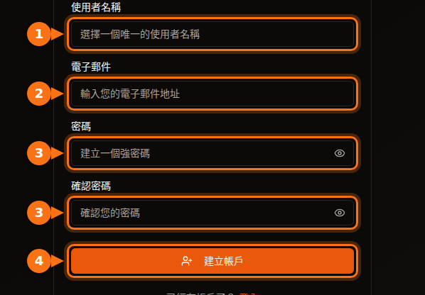
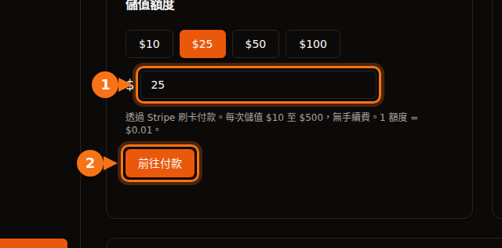

在租用第一張 GPU 之前，每個平台都會要求一些東西：電子郵件地址、信用卡，有時還要電話號碼，而大型雲端平台還需要申請配額，可能要等上好幾天。本文列出每個平台的要求，讓您挑一個今天就能開始用的。

所有內容都在 2026 年 9 月依各平台自己的文件查核過。來源列在文末。

## 快速比較

| 平台 | 建立帳戶 | 租用之前 | 租用者身分驗證 | 開始使用的最低金額 |
| --- | --- | --- | --- | --- |
| **GPUFlow** | 電子郵件和密碼，或 Google、GitHub | 驗證電子郵件，用信用卡儲值額度 | 租用流程中沒有 | 儲值 $10，不收手續費 |
| **Vast.ai** | 電子郵件 | 驗證電子郵件，儲值額度 | 文件中未提及 | 儲值 $5 |
| **RunPod** | 電子郵件 | 儲值額度 | 只在第一次用加密貨幣付款前 | 1 小時的額度；預付卡每筆 $100 |
| **SaladCloud** | 入口網站帳戶 | 為您的組織新增付款方式 | 文件中未提及 | 儲值從 $5 起 |
| **Lambda** | 帳戶 | 新增信用卡 | 文件中未提及 | 信用卡預先授權 $10，會退回 |
| **TensorDock** | 帳戶 | 儲值 | 服務條款允許帳戶審查 | 「最低只要 $5」 |
| **AWS** | 電子郵件、電話 PIN 碼驗證、付款方式、CAPTCHA | 申請 GPU 配額：新帳戶從 0 開始 | 大多數帳戶不需要 | 用多少付多少 |
| **Google Cloud** | 已啟用計費的帳戶 | 申請 GPU 配額；免費試用帳戶沒有配額 | 大多數帳戶不需要 | 用多少付多少 |

「文件中未提及」表示我們在該平台的文件中沒有找到租用者需要身分驗證的規定。平台在發現異常時，仍然可能要求驗證。

## 小型平台：幾分鐘，而不是幾天

Vast.ai、RunPod、SaladCloud、TensorDock 和 GPUFlow 都是預付制。您先儲值，再按秒或按分鐘扣款。既然不可能先用後付、累積欠款，這些平台也就不需要審查您的信用或公司。

它們不同的地方在於：

- **電子郵件驗證**。Vast.ai 和 GPUFlow 都要求在租用或儲值之前完成驗證。如果沒收到郵件，請檢查垃圾郵件資料夾。
- **付款方式**。
  - Vast.ai：信用卡、BitPay、Crypto.com。
  - RunPod：Visa、Mastercard、Amex、加密貨幣，$5,000 以上的付款可開發票。
  - SaladCloud：信用卡，或 Solana 上的 USDC、USDT 和 RENDER。
  - Lambda：只接受主要信用卡，且只限支援的國家。
  - GPUFlow：透過 Stripe 以信用卡付款。
- **沒用完的錢會怎樣**。SaladCloud 的額度在購買 12 個月後到期。GPUFlow 的額度沒有使用期限。

## 大型雲端平台：先準備好申請配額

AWS 和 Google Cloud 不會在註冊時擋住您。它們擋在 GPU 這一關。

- **AWS**：「Running On-Demand G and VT instances」（搭載 NVIDIA L4 和 A10G 的執行個體系列）的配額，新帳戶一開始是 **0 個 vCPU**。您要在 Service Quotas 主控台申請提高。隨著帳戶累積使用量，AWS 也會自動調高配額。
- **Google Cloud**：免費試用帳戶沒有 GPU 配額。專案有了計費紀錄之後，配額申請會比較容易通過。配額以區域為單位，而先占（preemptible）GPU 需要另外申請配額。

如果您今天就需要 GPU，不要從新的 AWS 或 Google Cloud 帳戶開始。

## 在 GPUFlow 註冊的步驟

GPUFlow 是為「我要在五分鐘內用上 AI 模型」這種情況打造的。您拿到的是一組連到某張 GPU、相容 OpenAI 的 API 金鑰，而不是一台機器。

1. 在 gpuflow.app **建立帳戶**，輸入使用者名稱、電子郵件地址和密碼，或使用 Google 或 GitHub 註冊。

   

2. **驗證電子郵件**。點擊 GPUFlow 寄給您的郵件中的連結。完成驗證之前，您無法儲值額度。
3. **儲值額度**：在 **儀表板 → 支付** 儲值，每次 $10 到 $500，透過 Stripe 以信用卡付款。1 額度 = $0.01，不收手續費。

   

4. **租用 GPU**，選擇您要的時數，然後複製您的 API 金鑰。[按秒計費](/zh_tw/per-second-vs-hourly-gpu-billing/)；如果提早結束，剩下的會退回您的額度。

文件中有附上每個畫面的完整教學：[一步步租用 GPU](https://docs.gpuflow.app/zh-tw/renters/getting-started/)。

## 如果您想出租 GPU

需要身分驗證的，是收款這一端。支付公司依法必須知道錢匯給了誰。

- **GPUFlow**：要提領時，您需要在 Stripe 設定收款帳戶，Stripe 會驗證您的身分並詢問您的銀行資料。提領支援美國、加拿大、英國、瑞士和歐洲經濟區。
- **Vast.ai**：主機透過 Wise、PayPal 或 Stripe 收款，由這些服務處理身分驗證。
- **Salad**：獎勵透過 PayPal、禮物卡等方式發放。

關於出租 GPU 能賺多少，請參閱[您的遊戲顯示卡能賺多少](/zh_tw/how-much-can-you-earn-renting-out-your-gpu/)。

## 付款之前：簡單的檢查清單

1. **先驗證電子郵件**，才不會卡在付款步驟。
2. **確認平台支援您的國家和信用卡**。例如 Lambda 只接受特定國家的付款。
3. **了解您銀行的海外交易手續費**。大多數平台以美元收費。[更多隱藏成本](/zh_tw/hidden-fees-in-gpu-rental/)。
4. **從小額開始**。先儲值夠用幾小時的額度，測試之後再加值。

## 相關文章

- [GPUFlow、Vast.ai、RunPod、SaladCloud 比較：哪一個適合您的工作](/zh_tw/gpuflow-vs-vast-ai-vs-runpod/)
- [如何在 Open WebUI、Continue、LangChain 等工具中使用相容 OpenAI 的 API 金鑰](/zh_tw/use-openai-compatible-api-key-in-apps/)

## 資料來源

皆於 2026 年 9 月查核。

- GPUFlow：[一步步租用 GPU](https://docs.gpuflow.app/zh-tw/renters/getting-started/)、[額度與計費](https://docs.gpuflow.app/zh-tw/renters/billing/)、[收款](https://docs.gpuflow.app/zh-tw/providers/getting-paid/)
- Vast.ai：[快速入門](https://docs.vast.ai/guides/get-started/quickstart.md)、[計費](https://docs.vast.ai/documentation/reference/billing)、[主機提領](https://docs.vast.ai/host/payment.md)
- RunPod：[計費資訊](https://docs.runpod.io/references/billing-information)
- SaladCloud：[帳戶設定](https://docs.salad.com/general/tutorials/account-setup.md)、[計費](https://docs.salad.com/general/explanation/billing.md)
- Lambda：[管理計費](https://docs.lambda.ai/public-cloud/manage-billing/)
- TensorDock：[雲端 GPU](https://www.tensordock.com/cloud-gpus.html)、[服務條款](https://docs.tensordock.com/legal-information/terms-of-service-tos)
- AWS：[建立帳戶](https://docs.aws.amazon.com/accounts/latest/reference/manage-acct-creating.html)、[隨選執行個體配額](https://docs.aws.amazon.com/AWSEC2/latest/UserGuide/ec2-on-demand-instances.html)
- Google Cloud：[GPU 配額疑難排解](https://docs.cloud.google.com/deep-learning-vm/docs/troubleshooting)
- Salad 獎勵：[PayPal 兌換](https://support.salad.com/rewards/redeeming-your-rewards/how-to-redeem-paypal/)
