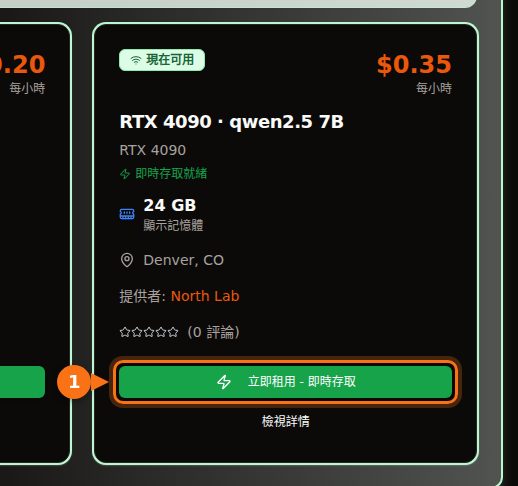

以 Ollama 預設提供的 4 位元量化來說，7B 或 8B 模型需要 8 GB 的顯示卡，12B 到 14B 模型需要 12 GB（想用長提示詞的話要 16 GB），27B 到 32B 模型需要 24 GB。70B 模型在 4 位元下是 43 GB，也就是要 48 GB 以上的 VRAM。

細節之所以重要，是因為下載大小並不是全部的帳單。您使用的上下文也要佔記憶體，一個看起來放得下的模型，最後可能有一半跑在 CPU 上，速度慢上好幾倍。下面是我使用的公式、各種量化標籤的意思，以及一張目前開源模型的表格，列出它們在 Ollama 模型庫中的實際下載大小。大小和規格都在 2026 年 9 月查核過，來源列在文末。

## 依 VRAM 容量快速查詢

| VRAM | 常見顯示卡 | 可以完全在 GPU 上執行的模型（4 位元） |
| --- | --- | --- |
| 8 GB | RTX 4060、RTX 5060、RTX 3070 | 7B 到 8B 模型：Llama 3.1 8B、Qwen3 8B、Mistral 7B |
| 12 GB | RTX 3060 12 GB、RTX 4070、RTX 5070 | 短上下文下的 12B 到 14B 模型；Q8_0 的 7B 到 8B 模型 |
| 16 GB | RTX 4060 Ti 16 GB、RTX 4080、RTX 5080 | 長上下文的 14B 模型、gpt-oss 20B |
| 24 GB | RTX 3090、RTX 4090 | 24B 到 32B：Mistral Small 3.2、Gemma 3 27B、Qwen3 32B |
| 32 GB | RTX 5090 | 長上下文的 32B 模型、35B 混合專家模型 |
| 48 到 80 GB | L40S（48 GB）、H100（80 GB） | 4 位元的 70B 模型；80 GB 可放 gpt-oss 120B |

顯示卡的記憶體容量取自 NVIDIA 的規格頁面。有些卡有兩種版本：RTX 3060 有 12 GB 和 8 GB，RTX 4060 Ti 和 RTX 5060 Ti 有 16 GB 和 8 GB。購買或租用前，請確認是哪一種。

## 如何估算模型需要多少 VRAM

模型在回答您時，GPU 記憶體裡有三樣東西：

1. **權重。** 參數數量 × 每個權重的位元數 ÷ 8 = 位元組數。
2. **KV 快取。** 模型會保留對話中每個 token 的 key 和 value，免得重新計算。每個 token 佔 2 × 層數 × KV 頭數 × 頭維度 × 2 位元組（以預設的 16 位元快取計算），再乘以上下文長度。
3. **額外開銷。** CUDA context、暫存緩衝區，以及執行環境本身。我抓大約 1 GB。實際數字會因推論引擎和設定而異，請把它當成經驗值，而不是規格。

層數和頭數都寫在 Hugging Face 上每個模型的 `config.json` 裡。

### 實際計算：在 16 GB 顯示卡上執行 Qwen 2.5 14B

Qwen 2.5 14B 有 147 億個參數、48 層、8 個 KV 頭，頭維度 128（隱藏層維度 5,120 ÷ 40 個注意力頭）。

- **Q4_K_M 的權重：** llama.cpp 列出 Q4_K_M 約為每個權重 4.89 位元。147 億 × 4.89 ÷ 8 = 8.99 GB。Ollama 的 `qwen2.5:14b` 下載檔是 9.0 GB，所以算出來的數字和實際檔案一致。
- **每個 token 的 KV 快取：** 2 × 48 × 8 × 128 × 2 位元組 = 196,608 位元組，約 0.2 MB。
- **整個上下文的 KV 快取：** 4,096 個 token = 0.8 GB。16,384 個 token = 3.2 GB。32,768 個 token = 6.4 GB。
- **總計：** 4K 上下文為 9.0 + 0.8 + 1 = 10.8 GB。16K 為 9.0 + 3.2 + 1 = 13.2 GB。32K 為 9.0 + 6.4 + 1 = 16.4 GB，16 GB 的顯示卡已經放不下。

<figure>
<svg viewBox="0 0 720 340" role="img" aria-labelledby="d1-title" xmlns="http://www.w3.org/2000/svg" font-family="system-ui, sans-serif" font-size="15">
<title id="d1-title">在 16 GB 顯示卡上以 Q4_K_M 執行 Qwen 2.5 14B 時，VRAM 被哪些東西佔用：權重、三種上下文長度下的 KV 快取，以及額外開銷</title>
<rect x="0" y="0" width="720" height="340" fill="#ffffff"/>
<rect x="150" y="20" width="16" height="16" rx="3" fill="#6366f1"/>
<text x="172" y="33" fill="#1e1b4b">權重 9.0 GB</text>
<rect x="330" y="20" width="16" height="16" rx="3" fill="#a5b4fc"/>
<text x="352" y="33" fill="#1e1b4b">KV 快取</text>
<rect x="510" y="20" width="16" height="16" rx="3" fill="#e2e8f0"/>
<text x="532" y="33" fill="#1e1b4b">額外開銷 ~1 GB</text>
<line x1="582.0" y1="66" x2="582.0" y2="278" stroke="#f97316" stroke-width="2" stroke-dasharray="5 4"/>
<text x="576.0" y="60" text-anchor="end" fill="#f97316" font-weight="600">16 GB 顯示卡</text>
<text x="140" y="106" text-anchor="end" fill="#1e1b4b">4K 上下文</text>
<rect x="150" y="80" width="243.0" height="40" fill="#6366f1"/>
<text x="271.5" y="106" text-anchor="middle" fill="#ffffff">權重</text>
<rect x="393.0" y="80" width="21.6" height="40" fill="#a5b4fc"/>
<rect x="414.6" y="80" width="27.0" height="40" fill="#e2e8f0"/>
<text x="449.6" y="106" fill="#16a34a" font-weight="600">10.8 GB</text>
<text x="140" y="180" text-anchor="end" fill="#1e1b4b">16K 上下文</text>
<rect x="150" y="154" width="243.0" height="40" fill="#6366f1"/>
<text x="271.5" y="180" text-anchor="middle" fill="#ffffff">權重</text>
<rect x="393.0" y="154" width="86.4" height="40" fill="#a5b4fc"/>
<text x="436.2" y="180" text-anchor="middle" fill="#1e1b4b">3.2</text>
<rect x="479.4" y="154" width="27.0" height="40" fill="#e2e8f0"/>
<text x="514.4" y="180" fill="#16a34a" font-weight="600">13.2 GB</text>
<text x="140" y="254" text-anchor="end" fill="#1e1b4b">32K 上下文</text>
<rect x="150" y="228" width="243.0" height="40" fill="#6366f1"/>
<text x="271.5" y="254" text-anchor="middle" fill="#ffffff">權重</text>
<rect x="393.0" y="228" width="172.8" height="40" fill="#a5b4fc"/>
<text x="479.4" y="254" text-anchor="middle" fill="#1e1b4b">6.4</text>
<rect x="565.8" y="228" width="27.0" height="40" fill="#e2e8f0"/>
<text x="600.8" y="254" fill="#f97316" font-weight="600">16.4 GB</text>
<line x1="150" y1="278" x2="690" y2="278" stroke="#64748b"/>
<line x1="150.0" y1="278" x2="150.0" y2="283" stroke="#64748b"/>
<text x="150.0" y="300" text-anchor="middle" fill="#64748b">0</text>
<line x1="258.0" y1="278" x2="258.0" y2="283" stroke="#64748b"/>
<text x="258.0" y="300" text-anchor="middle" fill="#64748b">4</text>
<line x1="366.0" y1="278" x2="366.0" y2="283" stroke="#64748b"/>
<text x="366.0" y="300" text-anchor="middle" fill="#64748b">8</text>
<line x1="474.0" y1="278" x2="474.0" y2="283" stroke="#64748b"/>
<text x="474.0" y="300" text-anchor="middle" fill="#64748b">12</text>
<line x1="582.0" y1="278" x2="582.0" y2="283" stroke="#64748b"/>
<text x="582.0" y="300" text-anchor="middle" fill="#64748b">16</text>
<line x1="690.0" y1="278" x2="690.0" y2="283" stroke="#64748b"/>
<text x="690.0" y="300" text-anchor="middle" fill="#64748b">20</text>
<text x="420.0" y="326" text-anchor="middle" fill="#64748b">VRAM 用量（GB）</text>
</svg>
<figcaption>在 16 GB 顯示卡上以 Q4_K_M 執行 Qwen 2.5 14B。權重固定是 9.0 GB；KV 快取隨上下文變大，到 32K 個 token 時，總量超過 16 GB。額外開銷以經驗值 1 GB 計算。</figcaption>
</figure>

由此可以得出兩點。第一，您設定的上下文可能和模型本身一樣吃記憶體。Llama 3.1 8B（32 層、8 個 KV 頭、頭維度 128）每個 token 需要 131,072 位元組的 KV 快取，所以完整的 128K 上下文光是快取就要 17.2 GB，大約是它 4.9 GB 下載檔的三倍半。第二，每個 token 的 KV 快取大小在不同模型之間差很多。Qwen 2.5 7B 只有 4 個 KV 頭和 28 層，每個 token 只要 57,344 位元組，不到 Llama 3.1 8B 的一半。先看設定檔，別憑感覺假設。

### Ollama 預設怎麼處理上下文

Ollama 會依偵測到的 VRAM 選擇預設上下文長度：低於 24 GiB 用 4K 個 token，24 到 48 GiB 用 32K，48 GiB 以上用 256K。您可以用環境變數 `OLLAMA_CONTEXT_LENGTH` 修改，而 `ollama ps` 的 CONTEXT 欄位會顯示實際配置的上下文。另外還有兩個設定會影響計算結果：

- `OLLAMA_NUM_PARALLEL`（預設為 1）：Ollama 的文件說明，平行請求會讓上下文大小乘以平行請求數。四個平行槽位就是四倍的 KV 快取。
- `OLLAMA_KV_CACHE_TYPE`：`q8_0` 用的記憶體約為預設 `f16` 快取的一半，`q4_0` 約為四分之一。必須先啟用 flash attention。

## 量化等級代表什麼

開源模型以 16 位元精度發布（下方連結的設定檔列的是 bfloat16）：每個參數兩個位元組。量化就是用較少的位元來儲存權重。在 Ollama 和 llama.cpp 使用的 GGUF 格式中，各標籤的意思大致如下：

| 標籤 | 每個權重的位元數 | Llama 3.1 8B 大小 | Llama 3 8B 的困惑度（越低越好） |
| --- | --- | --- | --- |
| F16 | 16.0 | 14.96 GiB | 6.233 |
| Q8_0 | 8.50 | 7.95 GiB | 6.234 |
| Q6_K | 6.56 | 6.14 GiB | 6.253 |
| Q5_K_M | 5.70 | 5.33 GiB | 6.289 |
| Q4_K_M | 4.89 | 4.58 GiB | 6.407 |
| Q3_K_M | 4.00 | 3.74 GiB | 6.888 |
| Q2_K_S / Q2_K | 2.97 | 2.78 GiB | 9.752（Q2_K） |

每個權重的位元數和檔案大小取自 llama.cpp 的 quantize README（Llama 3.1 8B）。困惑度取自 llama.cpp 的 perplexity README（Llama 3 8B，Wikitext）。「K」類型是 llama.cpp 的 k-quants，會在模型的不同部分混用不同精度；`_S`、`_M` 和 `_L` 分別代表小、中、大三種混合方式。

數字說明了什麼：Q8_0 實際上等於無損（困惑度 6.234 對 6.233）。Q4_K_M 的困惑度增加約 3%，同一份 README 也指出，它最可能輸出的下一個 token 有 91.9% 的時候和全精度模型相同。Q3 明顯變差，Q2 則完全走樣。

困惑度不等於實用程度，所以 Uygar Kurt 在 2026 年 1 月發表的研究很有參考價值：他在 llama.cpp 的每個量化等級下，用推理、知識、指令遵循和真實性等基準測試 Llama 3.1 8B Instruct。未加權的平均分數是 F16 69.47、Q8_0 69.41、Q5_K_M 69.36、Q4_K_M 69.15。這就是幾乎所有人（包括 Ollama）都預設用 Q4_K_M 的原因：檔案不到 FP16 的三分之一，損失卻很少會被察覺。在 Ollama 上，不加後綴的標籤就是這個 4 位元版本：`qwen3:8b` 和 `qwen3:8b-q4_K_M` 都是 5.2 GB，`phi4:14b` 和 `phi4:14b-q4_K_M` 都是 9.1 GB。

我的原則是：先選 Q4_K_M 下放得進去的最大模型，再考慮 Q8_0 的較小模型。Q4 的 14B 模型通常比 Q8 的 7B 模型好，而兩者的檔案大小差不多。如果還有剩餘記憶體，而工作又對小錯誤很敏感（例如寫程式或精確擷取資料），再改用 Q5 或 Q8。

較新的 Ollama 標籤還包括 `qat`（Gemma 經過量化感知訓練的版本）、`nvfp4` 和 `mxfp8` 等格式。gpt-oss 由 OpenAI 直接以 MXFP4 格式發布，混合專家權重為每個參數 4.25 位元。

## 哪些模型放得下：檔案大小與 VRAM 級距

下表列出 2026 年 9 月 Ollama 模型庫中的現行開源模型及其下載大小。「4 位元」欄是預設標籤的大小。大多數模型的預設標籤和 `q4_K_M` 標籤是同一個檔案；預設標籤是不同版本時，表中會列出兩種大小（Mistral Nemo 的預設標籤是 7.1 GB，`q4_K_M` 是 7.5 GB）。「最低需求顯示卡」表示模型加上約 1 GB 額外開銷，再加上 4K 到 8K 的上下文，可以完全放進 GPU。需要長上下文的話，請往上加一級。

| 模型 | Ollama 標籤 | 4 位元大小 | Q8_0 大小 | 最低需求顯示卡（4 位元 / Q8_0） |
| --- | --- | --- | --- | --- |
| Mistral 7B v0.3 | [`mistral:7b`](https://ollama.com/library/mistral/tags) | 4.4 GB | 7.7 GB | 8 GB / 12 GB |
| Qwen 2.5 7B | [`qwen2.5:7b`](https://ollama.com/library/qwen2.5/tags) | 4.7 GB | 8.1 GB | 8 GB / 12 GB |
| DeepSeek-R1 蒸餾 7B（Qwen 2.5） | [`deepseek-r1:7b`](https://ollama.com/library/deepseek-r1/tags) | 4.7 GB | 未查核 | 8 GB |
| Llama 3.1 8B | [`llama3.1:8b`](https://ollama.com/library/llama3.1/tags) | 4.9 GB | 8.5 GB | 8 GB / 12 GB |
| Qwen3 8B | [`qwen3:8b`](https://ollama.com/library/qwen3/tags) | 5.2 GB | 8.9 GB | 8 GB / 12 GB |
| DeepSeek-R1-0528（Qwen3 8B） | [`deepseek-r1:8b`](https://ollama.com/library/deepseek-r1/tags) | 5.2 GB | 未查核 | 8 GB |
| Qwen3.5 9B | [`qwen3.5:9b`](https://ollama.com/library/qwen3.5/tags) | 6.6 GB | 11 GB | 8 GB，僅限短上下文 / 16 GB |
| Mistral Nemo 12B | [`mistral-nemo:12b`](https://ollama.com/library/mistral-nemo/tags) | 7.1 GB（q4_K_M：7.5 GB） | 13 GB | 12 GB / 16 GB |
| Gemma 4 12B | [`gemma4:12b`](https://ollama.com/library/gemma4/tags) | 7.6 GB | 13 GB | 12 GB / 16 GB |
| Gemma 3 12B | [`gemma3:12b`](https://ollama.com/library/gemma3/tags) | 8.1 GB | 13 GB | 12 GB / 16 GB |
| Qwen 2.5 14B | [`qwen2.5:14b`](https://ollama.com/library/qwen2.5/tags) | 9.0 GB | 16 GB | 12 GB / 24 GB |
| DeepSeek-R1 蒸餾 14B（Qwen 2.5） | [`deepseek-r1:14b`](https://ollama.com/library/deepseek-r1/tags) | 9.0 GB | 未查核 | 12 GB |
| Phi-4 14B | [`phi4:14b`](https://ollama.com/library/phi4/tags) | 9.1 GB | 16 GB | 12 GB / 24 GB |
| Qwen3 14B | [`qwen3:14b`](https://ollama.com/library/qwen3/tags) | 9.3 GB | 16 GB | 12 GB / 24 GB |
| gpt-oss 20B（MoE） | [`gpt-oss:20b`](https://ollama.com/library/gpt-oss/tags) | 14 GB（MXFP4） | 不適用 | 16 GB |
| Mistral Small 3.2 24B | [`mistral-small3.2:24b`](https://ollama.com/library/mistral-small3.2/tags) | 15 GB | 26 GB | 24 GB / 32 GB |
| Gemma 3 27B | [`gemma3:27b`](https://ollama.com/library/gemma3/tags) | 17 GB | 30 GB | 24 GB / 48 GB |
| Qwen3.5 27B | [`qwen3.5:27b`](https://ollama.com/library/qwen3.5/tags) | 17 GB | 30 GB | 24 GB / 48 GB |
| Qwen3.6 27B | [`qwen3.6:27b`](https://ollama.com/library/qwen3.6/tags) | 18 GB（q4_K_M：17 GB） | 30 GB | 24 GB / 48 GB |
| Gemma 4 26B（MoE，3.8B 啟用） | [`gemma4:26b`](https://ollama.com/library/gemma4/tags) | 19 GB（q4_K_M：18 GB） | 28 GB | 24 GB / 32 GB |
| Qwen3 30B-A3B（MoE） | [`qwen3:30b`](https://ollama.com/library/qwen3/tags) | 19 GB | 未查核 | 24 GB |
| Gemma 4 31B | [`gemma4:31b`](https://ollama.com/library/gemma4/tags) | 20 GB | 34 GB | 24 GB / 48 GB |
| Qwen3 32B | [`qwen3:32b`](https://ollama.com/library/qwen3/tags) | 20 GB | 35 GB | 24 GB / 48 GB |
| Qwen 2.5 32B | [`qwen2.5:32b`](https://ollama.com/library/qwen2.5/tags) | 20 GB | 35 GB | 24 GB / 48 GB |
| DeepSeek-R1 蒸餾 32B（Qwen 2.5） | [`deepseek-r1:32b`](https://ollama.com/library/deepseek-r1/tags) | 20 GB | 未查核 | 24 GB |
| Qwen3.6 35B-A3B（MoE） | [`qwen3.6:35b`](https://ollama.com/library/qwen3.6/tags) | 23 GB（q4_K_M：24 GB） | 39 GB | 32 GB / 48 GB |
| Qwen3.5 35B-A3B（MoE） | [`qwen3.5:35b`](https://ollama.com/library/qwen3.5/tags) | 24 GB | 39 GB | 32 GB / 48 GB |
| Llama 3.3 70B | [`llama3.3:70b`](https://ollama.com/library/llama3.3/tags) | 43 GB | 75 GB | 48 GB，很吃緊 / 80 GB，很吃緊 |
| Qwen 2.5 72B | [`qwen2.5:72b`](https://ollama.com/library/qwen2.5/tags) | 47 GB | 未查核 | 80 GB |
| gpt-oss 120B（MoE） | [`gpt-oss:120b`](https://ollama.com/library/gpt-oss/tags) | 65 GB（MXFP4） | 不適用 | 80 GB |

級距是依預設標籤的大小判斷的，因為用短名稱執行 `ollama pull` 時，下載的就是這個檔案。

24 GB 和 32 GB 這兩級有個陷阱。Ollama 的預設上下文在 24 GiB 時會從 4K 跳到 32K，所以 RTX 4090 上的 20 GB 模型，可能會被配置一個放不下的 32K 快取。如果 `ollama ps` 顯示有 CPU 佔比，請把上下文調小。另外，別看名稱裡的數字判斷模型大小：Gemma 4 的邊緣裝置模型 `gemma4:e4b`（45 億有效參數）下載檔是 9.6 GB，比 7.6 GB 的 `gemma4:12b` 還大。請實際確認檔案大小。

<figure>
<svg viewBox="0 0 720 546" role="img" aria-labelledby="d2-title" xmlns="http://www.w3.org/2000/svg" font-family="system-ui, sans-serif" font-size="14">
<title id="d2-title">熱門 Ollama 模型在預設 4 位元量化下的下載大小，與 8、12、16、24、32 GB VRAM 的比較</title>
<rect x="0" y="0" width="720" height="546" fill="#ffffff"/>
<line x1="320.0" y1="58" x2="320.0" y2="486" stroke="#f97316" stroke-width="2" stroke-dasharray="5 4"/>
<text x="320.0" y="50" text-anchor="middle" fill="#f97316" font-weight="600">8 GB</text>
<line x1="380.0" y1="58" x2="380.0" y2="486" stroke="#f97316" stroke-width="2" stroke-dasharray="5 4"/>
<text x="380.0" y="50" text-anchor="middle" fill="#f97316" font-weight="600">12 GB</text>
<line x1="440.0" y1="58" x2="440.0" y2="486" stroke="#f97316" stroke-width="2" stroke-dasharray="5 4"/>
<text x="440.0" y="50" text-anchor="middle" fill="#f97316" font-weight="600">16 GB</text>
<line x1="560.0" y1="58" x2="560.0" y2="486" stroke="#f97316" stroke-width="2" stroke-dasharray="5 4"/>
<text x="560.0" y="50" text-anchor="middle" fill="#f97316" font-weight="600">24 GB</text>
<line x1="680.0" y1="58" x2="680.0" y2="486" stroke="#f97316" stroke-width="2" stroke-dasharray="5 4"/>
<text x="680.0" y="50" text-anchor="middle" fill="#f97316" font-weight="600">32 GB</text>
<text x="20" y="50" fill="#64748b">VRAM 級距</text>
<text x="190" y="84" text-anchor="end" fill="#1e1b4b">mistral:7b</text>
<rect x="200" y="70" width="66.0" height="18" rx="3" fill="#6366f1"/>
<text x="272.0" y="84" fill="#1e1b4b">4.4</text>
<text x="190" y="110" text-anchor="end" fill="#1e1b4b">qwen2.5:7b</text>
<rect x="200" y="96" width="70.5" height="18" rx="3" fill="#6366f1"/>
<text x="276.5" y="110" fill="#1e1b4b">4.7</text>
<text x="190" y="136" text-anchor="end" fill="#1e1b4b">llama3.1:8b</text>
<rect x="200" y="122" width="73.5" height="18" rx="3" fill="#6366f1"/>
<text x="279.5" y="136" fill="#1e1b4b">4.9</text>
<text x="190" y="162" text-anchor="end" fill="#1e1b4b">qwen3:8b</text>
<rect x="200" y="148" width="78.0" height="18" rx="3" fill="#6366f1"/>
<text x="284.0" y="162" fill="#1e1b4b">5.2</text>
<text x="190" y="188" text-anchor="end" fill="#1e1b4b">qwen3.5:9b</text>
<rect x="200" y="174" width="99.0" height="18" rx="3" fill="#6366f1"/>
<text x="297.0" y="188" text-anchor="end" fill="#ffffff">6.6</text>
<text x="190" y="214" text-anchor="end" fill="#1e1b4b">gemma4:12b</text>
<rect x="200" y="200" width="114.0" height="18" rx="3" fill="#6366f1"/>
<text x="324.0" y="214" fill="#1e1b4b">7.6</text>
<text x="190" y="240" text-anchor="end" fill="#1e1b4b">gemma3:12b</text>
<rect x="200" y="226" width="121.5" height="18" rx="3" fill="#6366f1"/>
<text x="327.5" y="240" fill="#1e1b4b">8.1</text>
<text x="190" y="266" text-anchor="end" fill="#1e1b4b">qwen2.5:14b</text>
<rect x="200" y="252" width="135.0" height="18" rx="3" fill="#6366f1"/>
<text x="341.0" y="266" fill="#1e1b4b">9.0</text>
<text x="190" y="292" text-anchor="end" fill="#1e1b4b">qwen3:14b</text>
<rect x="200" y="278" width="139.5" height="18" rx="3" fill="#6366f1"/>
<text x="345.5" y="292" fill="#1e1b4b">9.3</text>
<text x="190" y="318" text-anchor="end" fill="#1e1b4b">gpt-oss:20b</text>
<rect x="200" y="304" width="210.0" height="18" rx="3" fill="#6366f1"/>
<text x="416.0" y="318" fill="#1e1b4b">14</text>
<text x="190" y="344" text-anchor="end" fill="#1e1b4b">mistral-small3.2:24b</text>
<rect x="200" y="330" width="225.0" height="18" rx="3" fill="#6366f1"/>
<text x="423.0" y="344" text-anchor="end" fill="#ffffff">15</text>
<text x="190" y="370" text-anchor="end" fill="#1e1b4b">gemma3:27b</text>
<rect x="200" y="356" width="255.0" height="18" rx="3" fill="#6366f1"/>
<text x="461.0" y="370" fill="#1e1b4b">17</text>
<text x="190" y="396" text-anchor="end" fill="#1e1b4b">qwen3.5:27b</text>
<rect x="200" y="382" width="255.0" height="18" rx="3" fill="#6366f1"/>
<text x="461.0" y="396" fill="#1e1b4b">17</text>
<text x="190" y="422" text-anchor="end" fill="#1e1b4b">gemma4:31b</text>
<rect x="200" y="408" width="300.0" height="18" rx="3" fill="#6366f1"/>
<text x="506.0" y="422" fill="#1e1b4b">20</text>
<text x="190" y="448" text-anchor="end" fill="#1e1b4b">qwen3:32b</text>
<rect x="200" y="434" width="300.0" height="18" rx="3" fill="#6366f1"/>
<text x="506.0" y="448" fill="#1e1b4b">20</text>
<text x="190" y="474" text-anchor="end" fill="#1e1b4b">qwen3.6:35b</text>
<rect x="200" y="460" width="345.0" height="18" rx="3" fill="#6366f1"/>
<text x="539.0" y="474" text-anchor="end" fill="#ffffff">23</text>
<line x1="200" y1="486" x2="680" y2="486" stroke="#64748b" stroke-width="1"/>
<line x1="200.0" y1="486" x2="200.0" y2="491" stroke="#64748b"/>
<text x="200.0" y="506" text-anchor="middle" fill="#64748b">0</text>
<line x1="260.0" y1="486" x2="260.0" y2="491" stroke="#64748b"/>
<text x="260.0" y="506" text-anchor="middle" fill="#64748b">4</text>
<line x1="320.0" y1="486" x2="320.0" y2="491" stroke="#64748b"/>
<text x="320.0" y="506" text-anchor="middle" fill="#64748b">8</text>
<line x1="380.0" y1="486" x2="380.0" y2="491" stroke="#64748b"/>
<text x="380.0" y="506" text-anchor="middle" fill="#64748b">12</text>
<line x1="440.0" y1="486" x2="440.0" y2="491" stroke="#64748b"/>
<text x="440.0" y="506" text-anchor="middle" fill="#64748b">16</text>
<line x1="500.0" y1="486" x2="500.0" y2="491" stroke="#64748b"/>
<text x="500.0" y="506" text-anchor="middle" fill="#64748b">20</text>
<line x1="560.0" y1="486" x2="560.0" y2="491" stroke="#64748b"/>
<text x="560.0" y="506" text-anchor="middle" fill="#64748b">24</text>
<line x1="620.0" y1="486" x2="620.0" y2="491" stroke="#64748b"/>
<text x="620.0" y="506" text-anchor="middle" fill="#64748b">28</text>
<line x1="680.0" y1="486" x2="680.0" y2="491" stroke="#64748b"/>
<text x="680.0" y="506" text-anchor="middle" fill="#64748b">32</text>
<text x="440.0" y="530" text-anchor="middle" fill="#64748b">下載大小，單位 GB（Ollama 預設標籤，4 位元）</text>
</svg>
<figcaption>Ollama 預設 4 位元標籤的下載大小，依比例和常見的 VRAM 容量對照。長條必須明顯停在虛線左側才放得下：要留約 1 GB 給額外開銷，還要留空間給 KV 快取。</figcaption>
</figure>

## 混合專家模型讓情況稍有不同

gpt-oss、Gemma 4 26B 和 Qwen 的「A3B」模型都是混合專家（MoE）模型。每個 token 只會啟用少數幾個專家：Gemma 4 26B 有 252 億個參數，但只有 38 億個是啟用的。記憶體的計算規則不變，因為所有權重仍然必須載入某個地方。改變的是放不下時的速度。因為每個 token 只用到一小部分權重，溢出到系統記憶體的 MoE 模型，變慢的程度遠小於同樣大小的稠密模型。下一節的量測數據會顯示差距有多大。

## 模型放不下時會發生什麼事

Ollama 不會拒絕載入太大的模型。它會把放得下的層放在 GPU 上，其餘的從系統記憶體由 CPU 執行。`ollama ps` 會告訴您是哪一種情況：`100% GPU` 表示全部放得下，`100% CPU` 表示完全放不下，而 `48%/52% CPU/GPU` 這類混合數字表示被拆開了。

拆開的代價很高，因為每產生一個 token，都要讀過所有啟用中的權重，而系統記憶體比 VRAM 慢得多。Rost 在 2026 年 4 月於 DEV Community 發表了一組在 16 GB RTX 4080 上的 llama.cpp 測試，結果很清楚：

| 模型（量化，檔案大小） | 上下文 | GPU / CPU 負載 | 每秒 token 數 |
| --- | --- | --- | --- |
| Qwen3.5 27B 稠密（IQ3_XXS，11.5 GB） | 32K | 98% / 100% | 45.1 |
| Qwen3.5 27B 稠密 | 64K | 45% / 410% | 22.7 |
| Qwen3.5 27B 稠密 | 128K | 16% / 625% | 9.6 |
| Qwen3.5 35B-A3B MoE（IQ3_S，13.6 GB） | 64K | 88% / 115% | 136.8 |
| Qwen3.5 122B-A10B MoE（IQ3_XXS，44.7 GB） | 32K | 30% / 480% | 21.8 |

CPU 數字高、GPU 數字低，代表大部分工作已轉到 CPU 上；原作者也是這樣解讀這些數字的。

同一個稠密模型從 32K 上下文改成 64K，速度就少了一半，原因只是變大的 KV 快取把部分層擠出了 GPU；到 128K 時則少了將近 80%。122B 的 MoE 模型是 44.7 GB 的檔案，放在 16 GB 的卡上仍然有每秒約 22 個 token，因為每個 token 只啟用 100 億個參數。對稠密模型來說，「部分在 CPU 上」就等於「慢好幾倍」。對 MoE 模型來說，這可能是可以接受的取捨。

如果遇到拆分的情況，依代價由低到高的解法是：降低上下文、把 KV 快取量化成 `q8_0`、改用同一個模型的較小量化版本（用 Q4_K_M 而不是 Q5）、改用較小的模型，或換一張記憶體更大的卡。

## 32 GB 與資料中心顯示卡

RTX 5090 有 32 GB。這足以執行 4 位元、長上下文的 32B 模型，或是 23 到 24 GB 的 35B-A3B MoE 模型，還有空間放快取。但還不到 70B：`llama3.3:70b` 就算是 4 位元也有 43 GB。

70B 需要 48 GB 以上。L40S 有 48 GB，放得下 43 GB 的檔案，但留給上下文的空間很少。H100 SXM 有 80 GB（H100 NVL 有 94 GB），放得下長上下文的 4 位元 Llama 3.3 70B、gpt-oss 120B（65 GB，Ollama 頁面說明它可以放進單張 80 GB GPU），或短上下文的 Q8_0 Llama 3.3 70B（75 GB）。81 GB 的 Qwen3.5 122B 已經超過單張 80 GB 顯示卡。

## 用租的而不是買的：如何檢查 GPUFlow 上架資訊

如果您在 GPUFlow 上租用 GPU，模型是由提供者在自己的機器上執行（使用 Ollama，GPUFlow 安裝程式預設會裝好），要安裝哪些模型也由提供者決定。您不需要自己下載模型：您拿到的是這張 GPU 的相容 OpenAI 的 API 金鑰，而不是 shell。GPUFlow 安裝程式預設使用 `qwen2.5:7b`，安裝程式和文件中提到的標籤有 `qwen2.5:0.5b`、`deepseek-r1:1.5b`、`qwen2.5:7b`、`deepseek-r1:7b`、`llama3.1:8b` 和 `qwen2.5:14b`。提供者也可以安裝其他模型。

在[市集](https://gpuflow.app/zh-TW/marketplace)中，每張卡片都會顯示 GPU、VRAM 和每小時價格，提供者的描述則會列出他們提供的模型。GPUFlow 的文件給出同一條規則稍微保守一點的版本：7B 模型在 8 GB 以上執行順暢，14B 模型則要 16 GB 以上。拿到金鑰後，`GET /v1/models` 會回傳一個模型名稱；如果描述中列了更多模型，您也可以在 `model` 欄位中使用那些名稱。

有兩件事要知道。GPUFlow 本身不設定上下文限制，所以除非提供者改過設定，否則適用的是提供者機器上 Ollama 的預設值。另外，提供者沒有安裝的模型您就用不到，所以挑選上架資訊時，先看您需要的模型，再看 GPU。[把金鑰接到 Open WebUI、Continue 或 LangChain](/zh_tw/use-openai-compatible-api-key-in-apps/) 的方式，和任何 OpenAI 風格的 API 都一樣。

## 相關文章

- [如何在 Open WebUI、Continue、LangChain 等工具中使用相容 OpenAI 的 API 金鑰](/zh_tw/use-openai-compatible-api-key-in-apps/)
- [按小時租 GPU，還是按 token 付費的 API？執行 7B–8B 模型的實際成本](/zh_tw/hourly-gpu-vs-per-token-api/)
- [Ollama vs vLLM vs TGI：RTX 4090 推論效能實測](/zh_tw/ollama-vs-vllm-vs-tgi-rtx-4090-benchmark/)
- [2026 年 GPU 租用價格比較](/zh_tw/gpu-rental-pricing-comparison-2026/)

## 資料來源

皆於 2026 年 9 月查核。

- Ollama 模型庫下載大小：[mistral](https://ollama.com/library/mistral/tags)、[qwen2.5](https://ollama.com/library/qwen2.5/tags)、[qwen3](https://ollama.com/library/qwen3/tags)、[qwen3.5](https://ollama.com/library/qwen3.5/tags)、[qwen3.6](https://ollama.com/library/qwen3.6/tags)、[llama3.1](https://ollama.com/library/llama3.1/tags)、[llama3.3](https://ollama.com/library/llama3.3/tags)、[deepseek-r1](https://ollama.com/library/deepseek-r1/tags)、[DeepSeek-R1 模型頁面（蒸餾基底模型）](https://ollama.com/library/deepseek-r1)、[gemma3](https://ollama.com/library/gemma3/tags)、[gemma4](https://ollama.com/library/gemma4/tags)、[Gemma 4 模型頁面（MoE 與啟用參數）](https://ollama.com/library/gemma4)、[mistral-nemo](https://ollama.com/library/mistral-nemo/tags)、[mistral-small3.2](https://ollama.com/library/mistral-small3.2/tags)、[phi4](https://ollama.com/library/phi4/tags)、[gpt-oss](https://ollama.com/library/gpt-oss/tags)、[gpt-oss 模型頁面（MXFP4、記憶體）](https://ollama.com/library/gpt-oss)、[Ollama 模型庫索引](https://ollama.com/library)
- 模型架構：[Qwen2.5-14B-Instruct 模型卡](https://huggingface.co/Qwen/Qwen2.5-14B-Instruct)、[Qwen2.5-14B-Instruct config.json](https://huggingface.co/Qwen/Qwen2.5-14B-Instruct/blob/main/config.json)、[Qwen2.5-7B-Instruct config.json](https://huggingface.co/Qwen/Qwen2.5-7B-Instruct/blob/main/config.json)、[Llama-3.1-8B-Instruct config.json（unsloth 鏡像）](https://huggingface.co/unsloth/Llama-3.1-8B-Instruct/blob/main/config.json)
- Ollama 上下文與記憶體設定：[Ollama 文件：Context length](https://docs.ollama.com/context-length)、[Ollama FAQ](https://docs.ollama.com/faq)
- 量化檔案大小與每個權重的位元數：[llama.cpp quantize README](https://github.com/ggml-org/llama.cpp/blob/master/tools/quantize/README.md)
- 量化困惑度：[llama.cpp perplexity README](https://github.com/ggml-org/llama.cpp/blob/master/tools/perplexity/README.md)
- 量化基準測試研究：[Uygar Kurt，Which Quantization Should I Use?（arXiv 2601.14277）](https://arxiv.org/abs/2601.14277)
- CPU 卸載量測：[Rost，16 GB VRAM LLM benchmarks with llama.cpp（DEV Community，2026 年 4 月）](https://dev.to/rosgluk/16-gb-vram-llm-benchmarks-with-llamacpp-speed-and-context-3hgg)
- GPU 記憶體容量：[NVIDIA RTX 50 系列比較](https://www.nvidia.com/en-us/geforce/graphics-cards/compare/)、[RTX 40 系列](https://www.nvidia.com/en-us/geforce/graphics-cards/40-series/)、[RTX 30 系列](https://www.nvidia.com/en-us/geforce/graphics-cards/30-series/)、[L40S](https://www.nvidia.com/en-us/data-center/l40s/)、[H100](https://www.nvidia.com/en-us/data-center/h100/)
- GPUFlow：[逐步租用 GPU](https://docs.gpuflow.app/zh-tw/renters/getting-started/)、[API 快速入門](https://docs.gpuflow.app/zh-tw/renters/api-quickstart/)、[提供者入門](https://docs.gpuflow.app/zh-tw/providers/getting-started/)
